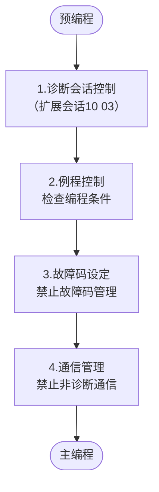
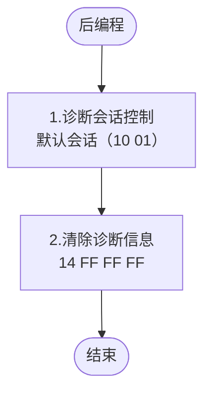

# 参考链接

[基于UDS的BootLoader设计——架构设计及规范_nxp s32k144 bootloader 基于uds-CSDN博客](https://blog.csdn.net/u012406840/article/details/108180654)

[Bootloader升级方式一————擦、写flash在RAM中运行 - isAndyWu - 博客园 (cnblogs.com)](https://www.cnblogs.com/isAndyWu/p/9524089.html)


# 基础介绍

Boot Loader又称为引导加载程序，引导加载程序是系统上电后运行的第一段软件代码，常被用来加载系统或者更新系统等。因此，大部分的Boot Loader存在两种不同的操作模式：

1. ==启动模式==：启动加载（BootLoading）模式也称为自主模式（Autonmous），即BootLoader从目标机上某个固态存储设备上将操作系统加载至RAM中运行，整个过程中并没有用户的介入。
2. ==下载模式==：在下载（DownLoading）模式下，目标机上的Boot Loader将通过串口连接或者网络连接等通信手段下载文件，如下载内核映像和根文件系统映像等。通常文件会保存在RAM中，然后将其写入目标地址完后系统的更新等。

> [!tip] 
>
> Bootloader=Boot + loader

1. Boot的目的：
   最终目的：跳到C语言中；为了C语言运行程序会进行一系列的初始化，系统一上电后如何通过一系列的设置让软件程序员进入C语言/更高级语言环境的开发，这个过程就是boot的主要目的。

2. Loader的目的：
   主要目的是开始执行应用逻辑，比如点灯：需要灯的接口开发；串口输入输出：需要串口编程；加载linux的内核：flash的编程、网卡的编程、内核启动前的初始化部分。根据不同的应用会有不同的变化。

> [!tip]
>
> 一个开发板要想执行loader，要先看boot做了什么事。

# UDS实现

## 名词

| 缩写          | 全称                                                     | 释义                                                         |
| ------------- | -------------------------------------------------------- | ------------------------------------------------------------ |
| CAN           | Controller Area Network                                  | 控制器区域网络                                               |
| ECU           | Electronic Control Unit                                  | 电子控制单元                                                 |
| NRC           | Negative Response Code                                   | 负响应代码                                                   |
| VIN           | Vehicle identification number                            | 车辆识别号                                                   |
| EOL           | End of Line                                              | 下线检测                                                     |
| Node          | ECU connected on the network                             | 节点                                                         |
| Tester        | Test tool                                                | 测试工具                                                     |
| BootManager   | Part of Boot software                                    | 引导软件的一部分，它在启动期间执行软件有效性检查，并启动 引导加载程序或应用程序软件。 |
| BootLoader    | Part of the ECU functionality                            | ECU 的部分功能，当电源打开或复位时ECU 启动。                 |
| PBL           | Primary Bootloader                                       | 主引导加载程序，它包含ECU 启动软件，应该存储在一个受保护 的永久内存中，以消除意外擦除的可能性。 |
| SBL           | Secondary Bootloader                                     | SBL是一个可下载的软件模块，包含擦除和写入闪存的例程。它与 flash 序列一起下载，以确保在正常操作期间 ECU 中不存在擦除 和写入例程。 |
| Logical block | Logical block                                            | 逻辑块用于将物理内存划分为单独的可写区域，例如应用程序和 校准块。这些块可以独立下载和验证。逻辑块之间不能重叠，但允 许在一个逻辑块中存在间隙。 |
| Public ECU    | An ECU addressable from a client/tester point of view.   | 从客户端/测试设备的角度来看，ECU是可寻址的。                 |
| Private ECU   | An ECU not addressable from client/tester point of view. | 从客户端/测试设备的角度来看，ECU是不可寻址的。               |
| SID           | Service Identifier                                       | 服务标识符                                                   |
| SW            | Software                                                 | 软件                                                         |
| HW            | Hardware                                                 | 硬件                                                         |
| TBD           | To be defined                                            | 未定义                                                       |
| DID           | Data Identifier                                          | 数据标识符                                                   |
| UDS           | Unified Diagnostic Services                              | 统一诊断服务                                                 |
| OBD           | On-Board Diagnostics                                     | 在线诊断                                                     |
| N/A           | Not Applicable                                           | 未应用                                                       |
| M             | Mandatory                                                | 强制                                                         |
| C             | Conditional                                              | 条件                                                         |
| S             | Selection                                                | 可选                                                         |
| U             | User Optional                                            | 用户选择                                                     |
| Y             | Yes                                                      | 是                                                           |
| N             | No                                                       | 否                                                           |

## 基本需求

两个SWC（Software Component）：

1. 启动管理——控制器的启动管理等
2. 应用程序——ECU软件下载升级及标定数据再编程等

四个服务模块：

1. 内存管理——软件更新主要是将Flash中的Application及标定数据重编程，内存擦除与重写驱动必不可少的模块；
2. CAN协议栈——软件更新媒介
3. 看门狗模块——软件运行保护
4. 安全模块——软件数据保护，下载数据校验等


> [!tip]
>
> 需要注意的是，SBL 需要先下载，其他软件部分才可以下载，flash 顺序适用于三个用例:
>
> 1. 更新应用程序，包括标定数据；
> 2. 仅更新应用程序并使用现有标定数据；
> 3. 只更新标定数据，使用现有应用程序；

为了减小Boot的代码体量，所以Boot只需要支持以下服务即可：

| 服务 |               | 默认会话 | 编程会话 | 扩展会话 | 描述                         |
| ---- | ------------- | -------- | -------- | -------- | ---------------------------- |
| 0x10 | 诊断会话控制  | M        | M        | M        | 进入编程模式                 |
| 0x11 | ECU复位       | N/A      | M        | M        | 从编程模式退出               |
| 0x22 | 读数据标识符  | M        | M        | M        | ECU 的数据标识符             |
| 0x2E | 写数据标识符  | M        | M        | M        | 写配置数据                   |
| 0x27 | 安全访问      | N/A      | M        | M        | 解锁ECU                      |
| 0x28 | 通讯控制      | N/A      | N/A      | M        | 启用/禁用非诊断通信          |
| 0x31 | 例程控制      | N/A      | M        | U        | 擦除闪存，计算校验和，…      |
| 0x34 | 请求下载      | N/A      | M        | N/A      | 请求下载                     |
| 0x36 | 传输数据      | N/A      | M        | N/A      | 传输数据                     |
| 0x37 | 请求传输退出  | N/A      | M        | N/A      | 退出传输                     |
| 0x3E | 测试设备在线  | M        | M        | M        | 测试设备向 ECU表明它仍然在线 |
| 0x85 | 控制 DTC 设置 | N/A      | N/A      | M        | 停止或恢复诊断故障代码的设置 |

## ECU启动程序

Bootloader是所有支持重编程的ECU必须具备的软件功能，在ECU运行过程中，执行的是应用软件和应用数据，仅当应用软件或应用数据无效时，或者要求对其进行升级或特殊测试时，Bootloader软件才被激活。启动过程如下图所示：


## 软件执行安全机制

应用软件和应用数据可以同时编程或者相互独立编程，不允许Boot Loader在软件运行时被非法修改。因此，Bootloader软件存储于被保护的存储器区域，即使发生潜在错误时，控制器始终保证可重新编程。

基于软件运行安全性考虑，flash diver不会存在放在flash中，避免正常程序在发生错误时可能的非法修改。在需要执行应用程序或应用数据需要时，首先将flash diver下载至ram中，然后执行相应的更新。

基于以上考虑，将Boot Loader划分为：

1. PBL（Primary Boot Loader）：用于启动过程中的状态管理及下载软件等，下载 SBL、更新应用软件及应用数据（可以理解为Boot程序）

2. SBL（Secondary Boot Loader）：本质为Flash Diver（可被用来修改写在flash中生产信息校验信息等），下载完成后重新启动将会被清除

   > [!TIP]
   >
   > SBL也可是运行在RAM中的另一个完整Boot Loader，以上将其认为flash driver

为确保下载的安全，ECU需设计安全机制，避免以下几种情况：

1.  来自非法源的下载动作；
2. 当前编程条件不满足；
3.  下载错误的应用软件或应用数据到ECU；
4.  软件之间不兼容；

解决措施：

1. 安全访问:ECU通过SEED&KEY机制进行安全访问服务限制，保证ECU免遭未授权的编程动作影响。
2. 预编程条件:ECU确保编程时处于安全状态，条件不满足（如高压上电或车辆运行）时，编程服务请求将被拒绝。
3. 完整性校验:ECU对即将下载到存储器的程序或数据进行完整性检查，当一个逻辑模块下载后，使用CRC32算法验证当前逻辑块的所有数据字节是否被正确传输和写入。通过“检查编程完整性”例程控制激活ECU完整性校验。当ECU接收到此服务请求时，Bootloader将计算下载数据字节的CRC32值，并将计算结果与诊断仪请求报文中发送的校验值进行比较。
4. 一致性检查:不兼容的软件不能配合使用，如果配合使用可能会使功能异常或产生致命性错误。为此，ECU通过验证软件兼容性来检查编程程序的一致性，包括应用软件与Bootloader软件、应用数据与应用软件检验等。
5. 有效性检查:ECU内部有一个标志位，用于标识应用软件是否有效。如果编程完整性检查和一致性检查都正确时，ECU才会设置应用软件的标志位为有效。只有标志位为有效时，应用软件才可以运行。

## 重编程流程设计

在APP模式下，使用了两种不同的诊断会话模式：

1. 默认会话模式
2. 扩展会话模式

在Bootloader模式下，使用了三种不同的诊断会话模式：

1. 默认会话模式

2. 扩展会话模式

3. 编程会话模式。

   > 如果ECU在正确的条件下收到“10 02”（编程会话）指令，ECU将重编程请求标志状态位设为有效，并执行ECU重启从而进入Boot程序。


上电/复位后，ECU首先执行Bootloader引导代码，然后检查外部编程请求标志位：

1. 如果外部编程请求标志位为有效，那么即使应用程序是有效的，Bootloader也会继续进一步执行，在此情况下，ECU直接进入编程会话模式。
2. 如果外部重编程请求标志位为无效，则继续检查应用软件的标志位状态：
   1.  如果应用软件是有效的，则启动应用模式；
   2. 如果应用软件无效，ECU停留在Bootloader模式下的默认会话模式。

在Bootloader模式下，ECU重启方式：

1. 无论当前处于何种会话模式，“11 01”（ECU复位指令）都会引导ECU重启；
2. 在扩展会话模式或编程会话模式下，S3定时器超时会导致ECU重启；
3. 在编程会话模式下，“10 01”会导致ECU重启。

## 时序设计

编程时序分为三个编程步骤：

1. 预编程步骤：编程前的CAN网络准备；
2. 主编程步骤：下载应用软件或应用数据；
3. 后编程步骤：重同步CAN网络。

> [!TIP]
>
> 如果在预编程、主编程和后编程步骤过程中，任何物理寻址的请求及响应不满足要求，则全部时序需再次执行。

### 预编程

预编程步骤用来为要下载的ECU做重编程前的CAN网络准备。此步骤也包含了提高下载速度的准备。此步骤的请求报文能采用的是物理寻址，或功能寻址。如下图所示：



1. 诊断会话控制 `10 03`：为了禁止ECU间的正常通信和控制DTC设置，预编程需要启动非默认会话模式。通过使用会话类型为扩展会话模式的诊断会话控制`10`服务来完成。此请求使用一个单帧请求报文，通过功能寻址发送给所有的ECU。
2. 例程控制：检查编程预条件`31 01 XXXX`：通过此例程来检查ECU编程条件，从而确保系统安全，如果有任何不安全的因素，ECU将拒绝编程。

   > [!NOTE]
   >
   > 注意：如果ECU在未收到“检查编程预条件”例程（`31 01 XXXX`）的情况下，收到`10 02`请求，ECU将拒绝进入Bootloader模式，并且发送否定响应。
3. 控制DTC设置 `85 02`：诊断仪通过DTC设置类型设为“关闭”的控制DTC设置服务请求。此请求使用一个单帧请求报文，通过功能寻址发送给所有的ECU。
4. 通信控制 `28 03 03`：诊断仪通过通信控制（`28`）服务请求，禁止非诊断报文的发送和接收。请求中的控制类型参数置为“disable the transmission and the reception”，通信类型置为“application and network management messages”。此请求使用一个单帧请求报文，通过功能寻址发送给所有的ECU。

### 主编程

在预编程步骤之后，是主编程步骤。主编程时序是单个ECU编程事件的应用，因此所有服务的请求都使用物理寻址。如下图所示：


1. a:诊断会话控制 `10 02`：在收到一个寻址方式为物理寻址，子功能为编程会话的诊断会话控制（`10`）服务后，ECU启动Bootloader，并分配编程所需的所有资源。ECU需先发送肯定响应，再执行跳转到编程模式动作。

2. b:安全访问 `27 XX/XX`：编程事件必须通过安全访问。安全访问（`27`）服务在排放相关和安全系统中是强制的。其它系统不要求使用该服务。下载前，通过安全访问过程是强制的，确保只有合法的诊断仪能对ECU进行下载操作。

3. c:驱动下载 `34，36，37，31`：当ECU的非易失性存储单元中没有存储内存驱动时，将执行内存驱动的下载。下载应该按照如下时序来进行：请求下载、传输数据、请求传输退出。下载完所有字节后，用“检查编程完整性”例程（`31 01 XXXX`）来检查所有的字节都正确传输。

4. d:写入数据 `2EXXXX`：在擦除内存例程之前，将“指纹”写到ECU内存中是强制的。“指纹”标识了是哪个诊断仪对ECU内存做了修改。使用`XXXX`数据标识符而不是引导软件指纹、应用软件指纹、应用数据指纹这些数据标识符。每个逻辑块（除了驱动）下载前，诊断仪将首先写“指纹”，在下载完逻辑块后，ECU将识别之前下载的程序是哪个逻辑块（即逻辑块序号），并根据逻辑块的序号将它存储。在追踪指纹信息时，诊断仪将发报文`22 XXXX`，ECU将通过`62 XXXX`，返回每一个逻辑块的指纹信息。

5. e:例程控制:“擦除内存`31 01 XXXX`：为了允许应用软件和数据下载，ECU的内存将被擦除。此步骤通过例程控制服务（`31`）来执行擦除内存。如果擦除内存例程被调用执行，那么应用软件的标志位将被置为无效。

6. f:下载过程 `34 36 37`：应用软件或者数据的每一个连续的数据块（也叫段，可能是一个完整的应用软件或者数据，也可能是应用软件或者数据的一部分）下载到ECU非易失性内存中，都是遵循下面的服务顺序完成数传输：请求下载（`34`）、传输数据（`36`）、请求退出传输（`37`）。

   > [!NOTE]
   >
   > 注：单个应用软件或数据块可能需要多个数据传输（36）请求报文来完成传输（当数据块长度超出网络层缓存大小时，就会出现这种情况）。

7. g:例程控制:检查编程完整性 `31 01 XXXX`：此例程用来检查逻辑块的完整性。

8. h:例程控制:检查编程一致性`31 01 XXXX`：一旦完成所有的应用软件或数据块/模块的下载，诊断仪将开始一个例程来触发ECU检查重编程的一致性。

9. i:电控单元复位`11 01`：诊断仪使用物理寻址，发送一个复位类型为硬复位的ECU复位（`11`）服务请求报文到CAN网络上。

   > [!NOTE]
   >
   > 备注：通过ECU复位服务请求将使ECU结束重编程过程，返回到正常的操作模式。内存驱动代码必须从RAM缓存中完全清除，避免意外激活这些可能会进行非预期的内存擦除或程序操作的代码。

### 后编程



1. 诊断会话控制`10 01`：诊断仪发送一个会话类型为默认会话的诊断会话控制（`10`）服务请求报文到CAN网络上。所有的ECU接收到诊断会话控制（`10`），而进入到默认会话模式。此请求通过功能寻址发送，请求发送给所有包含在编程事件中或因此而进入非默认会话模式的ECU。跳转到默认会话模式，表示通信控制（`28`）服务和控制DTC设置（`85`）服务也将复位到默认状态。
2. 清除诊断信息 ：`14 FF FF FF`：如果重编程ECU在编程步骤被重启，当编程ECU运行在默认会话模式时，网络上其它的ECU仍然在不能正常通信状态，此时，一些可能被存储在编程ECU中的诊断信息就应该通过物理寻址的清除诊断信息（`14`）服务来清除。

## 将Flash驱动函数写入RAM

一共有三种方法可以将Flash的驱动函数写入到RAM中：

1. 为了实现在线更新功能，Bootloader程序需要对flash进行操作。一般情况下，我们将FLASH操作程序作为Bootloader组件的一部分固化在存储器中，在需要执行flash擦除或烧写操作时，先将该部分代码复制到RAM中，再做调用。操作代码的复制工作也可以在Bootloader启动阶段完成。
2. 两级Bootloader方案，没有在flash存储器中固化flash擦写代码，而是通过通讯口将该部分代码从上位机下载到指定的RAM出，在需要指出flash擦除或烧写操作时，再调用RAM中的该代码。
3. Bootloader制作下载引导程序，此软件不固化flash擦写代码，通过通讯口下载另外Bootloader(包含flash擦写操作)到指定的RAM中，跳转到RAM运行升级流程。

### 如何生成bin文件

首先编写flash驱动文件

> [!note]
>
> 这两个函数中不能调用外部函数、全局变量信息


使用GCC将程序编译为bin文件

```bash
gcc -c flash_drive.c -o flash_drive.o
gcc flash_drive.o -o flash_drive.out
objcopy -O binary flash_drive.out flash_drive.bin
```

#### 在vscode中可以生成bin文件

步骤如下：

1. 使用 `-nostartfiles` 禁用标准启动文件

   通常，C 程序会有一个标准的启动文件（`crt0.o`），它负责程序的初始化并调用 `main` 函数。如果没有 `main` 函数，你需要使用 `-nostartfiles` 标志来禁止这些标准启动文件。

2. 指定入口点

   如果没有 `main` 函数，你需要使用 `-e` 标志来指定一个自定义的入口点（如裸机程序中的 `start` 函数）。在裸机程序中，`start` 函数通常是程序的入口点。

3. 使用裸机编程时的配置

   裸机程序常常没有标准库和操作系统支持，因此需要额外的配置。你可以使用自定义的链接器脚本来指定程序的内存布局、入口点等。


tasks.json的配置：

```json
{
    "version": "2.0.0",
    "tasks": [
        {
            "label": "build and link",
            "type": "shell",
            "command": "gcc",
            "args": [
                "-nostartfiles",      // 禁用标准启动文件
                "-nostdlib",          // 不链接标准库
                "-T", "link.ld",       // 使用自定义链接器脚本
                "-o", "output.bin",    // 输出文件为 .bin
                "yourfile.c"           // 你的 C 源文件
            ],
            "group": "build",
            "problemMatcher": [],
            "detail": "编译并生成 .bin 文件"
        }
    ]
}

```

> [!tip]
>
> 如何生成tasks.json模板
>
> 依次点击*==终端》配置任务》选择基于的平台==*

## BootLoader下载

下载流程：

1. **会话控制 (Session Control)**

   - 首先，ECU必须进入扩展诊断会话或编程会话模式。通过发送`DiagnosticSessionControl (0x10)`请求，将ECU切换到编程会话 (`Programming Session`)。
   - 常用的会话类型：
     - `0x01`: 默认会话（Default Session）
     - `0x02`: 编程会话（Programming Session）

2. **安全访问 (Security Access)**

   - 进入编程模式后，ECU通常需要安全访问授权。通过发送`SecurityAccess (0x27)`请求，获取安全种子，之后根据 ECU 的算法计算出响应值，并发送给 ECU 以验证授权。
   - 安全访问包含两步：
     1. 请求安全种子。
     2. 使用种子计算密钥并进行授权。

3. **请求下载 (Request Download)**

   - 通过`RequestDownload (0x34)`服务，通知ECU即将进行软件下载。此服务指定了传输数据的格式、地址范围和待下载数据的大小。
   - 报文组成格式为：
     - 0x34+数据传输模式+指定地址和数据长度格式(ALFID)+需要写入的内存地址+下载数据大小
     - 传输数据模式：0x00-0xFF （0x00表示无压缩，无加密）
     - Address And Length Format Identifier (ALFID):高四位表示内存地址的字节数，低四位表示需要下载的字节数

4. **数据传输 (Transfer Data)**

   - 通过`TransferData (0x36)`服务，分段将 Bootloader 的数据传输给 ECU。通常会分为多个数据块进行传输，每个数据块都有一个编号，以确保传输顺序。
   - 发送数据块的过程中可能需要等待 ECU 的响应来确认当前块的接收状态。

5. **数据传输完成 (Request Transfer Exit)**

   - 当所有数据块传输完成后，通过发送`RequestTransferExit (0x37)`服务，通知 ECU 数据传输已完成。此时 ECU 将会验证传输的数据，并准备执行进一步的操作。

6. **校验数据 (Routine Control - Check Data Integrity)**

   - 传输结束后，ECU通常会执行校验操作，验证下载的 Bootloader 是否完整无误。使用`RoutineControl (0x31)`服务启动数据完整性校验例程。

   - 报文格式：31+RoutineControlType + RoutineIdentifier + [RoutineControlOptionRecord]

     - `31`：RoutineControl 服务 ID。
     - **RoutineControlType**：控制类型，指定需要对该例程执行的操作。
       - `0x01`：开始例程（StartRoutine）。
       - `0x02`：停止例程（StopRoutine）。
       - `0x03`：请求结果（RequestRoutineResults）。
     - **RoutineIdentifier**：例程的标识符（2 个字节），用于指定要执行的特定例程。例如，校验例程、存储器擦除等。
     - **RoutineControlOptionRecord**（可选）：例程执行所需的参数。对于某些例程，可能需要提供额外的数据来指定操作范围或细节。

     

7. **编程完成（Programming Complete）**

   - 一旦数据校验通过，Bootloader 应该已经成功写入 ECU。
   - 此时可以使用`ECUReset (0x11)`命令重启 ECU，使其进入新的工作模式。

8. **重启与验证**

   - 通过 ECU 重启，将系统引导至新的 Bootloader，验证系统是否能够正常启动和工作。如果需要，还可以通过诊断服务检查 Bootloader 的版本或其他参数以确保其正确运行。

具体实现如下：

```mermaid
sequenceDiagram

%%会话控制
Test->> ECU:10 01 
Note right of Test:默认会话，APP层在默认会话
ECU->>Test:50 01 
Note Left of ECU:积极响应
Test->> ECU:22 F1 93 
Note right of Test:0x22是通过DID读数据，F193的DID功能是通过供应商硬件版本号
ECU->>Test:（10 13）62 F1 93 xx xx xx xx
Note left of ECU:0x1013是传输层的报文头，表示这是一个多帧数据（0x10）,长度为0x13，之后后面跟的肯定响应格式，最后是数据。
Test->> ECU:(30 SS BS STmin) 
Note right of Test:传输层协议的流控制帧（0x30），用于控制发送发的发送流量，等待接收方接受完成之后，才开始继续接收，允许接收多帧
ECU->>Test:（21） xx xx xx xx xx 
Note right of Test:0x21代表的是连续帧（0x2）的第一段（0x01），程序下载前，操作完烧录日期写入（如果有），版本写入，其它DID读取等操作；写入按要求过密钥认证执行。

%%安全访问
Test->> ECU:10 02 
Note right of Test:编程会话
Note left of ECU:主编程阶段
ECU->>Test: 7F 10 78 
Note right of Test:APP中回应负响应，告诉ECU现在还不能实现ECU想要实现的功能
Note left of ECU:此时切入boot
ECU->>Test: 50 02 00 xx xx  
Note right of Test:boot中回应积极响应，此时编程会话层已经在boot中了，此时就可以告诉Test，ECU已经准备好了

Test->> ECU:27 11 
Note right of Test:0x2711是通过安全访问，请求种子
Note left of ECU:申请种子
ECU->Test: 67 11 XX XX XX XX 
Note left of ECU:肯定响应，返回种子Seed，并且在ECU端Seed有一个对应的Key

Test->> ECU:27 12 XX XX XX XX 
Note left of ECU:密钥认证：Test端通过得到的Seed进行加密计算的，得到一个KeyCompute
ECU->Test: 67 12 
Note left of ECU:密钥正确，积极响应：实际上是在对比KeyCompute和Key的值是否一致
Test->> ECU:2E F1 99 XX XX XX XX  
Note left of ECU:写入软件烧录日期，以华菱UDS规范为例
ECU->Test: 6E F1 99

%%请求下载
Test->> ECU: (10 0B)34 00 44 20 00 40 
Note right of Test:0x10 0B是传输层的报文头，表示是数据的首帧，要发送的数据长度为0x0B大小，写入flash driver中首地址，存在RAM中
Note right of Test:34（SID）+00（标准字节）+44（地址4字节，数据4字节）+ 20004000（内存地址）+ 000002c0（数据大小）:在下面接受了完整字节
ECU->> Test: (30 00 00)
Note left of ECU:传输层的流控制帧，告诉Test别发那么快，等ECU处理完成之后再发
Test->> ECU: (21) 00 00 00 02 C0
Note right of Test:由于首帧发送数据没发送完，所以又要发一个连续帧（0x21），把剩下的数据发过来
ECU->> Test: （04） 74 20 08 02 
Note right of Test: 单帧数据（0），数据长度为0x4，回应单次可接收下载的最大字节数(0x0802字节)

%%数据传输
Test->> ECU: （12 C2 ）36 01 XX XX XX XX 
Note left of ECU: SID为0x36的功能是下载数据，这是首帧数据，数据长度为0x2c2
ECU->> Test: （30 00 00）
Note left of ECU:流控制帧（传输层），用于限制发送方的流量
Test->> ECU: （21） XX XX XX XX XX XX XX
Test->> ECU: （22） XX XX XX XX XX XX XX
Note right of Test: 多帧传送，中间省略，直至数据发送完
ECU->> Test: （02）76 01
Note left of ECU:单帧数据（0），数据长度为2，flash驱动 接收完成中间省略

%%数据传输完成
Test->> ECU: 37 00 
Note left of ECU:SID为37的功能为请求下载退出
ECU->> Test: 77
Note right of Test:积极响应

Test-->>ECU:34    36   37   依次多次，至flash驱动数据块下载结束

%%校验数据
Test->>ECU:31 01 02 02 XX XX XX (0202依照华菱UDS规范)
Note left of ECU:0x31的功能是校验，0x0202的功能是flash驱动数据块CRC，存放在RAM中
ECU->>Test:71 01 02 02 04
Note right of Test:正响应，并且带回数据04

Test->>ECU:31 01 FF 00 XX XX XX (FF00依照华菱UDS规范)
Note left of ECU:0xFF00的功能是擦除flash，用于存放APP的部分
ECU->>Test:71 01 FF 00 04
Note right of Test:正响应，并且带回数据04

%%请求下载
Test->>ECU:34 00 44 XX XX XX XX ......
Note left of ECU:请求下载（0x34），写入APP首地址
ECU->>Test:74 20 08 02
Note left of ECU:34回应一次允许接收的最大字节数

%%数据传输
Test->>ECU:  36 01 xx xx xx xx
Note right of Test:36多帧发送
ECU->>Test: 76 01 
Test->>ECU:  36 02 xx xx xx xx
Note right of Test:36多帧发送
ECU->>Test: 76 02 
Test->>ECU:  36 03 xx xx xx xx
Note right of Test:36多帧发送
ECU->>Test: 76 03
Note right of Test:36多数据块发送结束

%%下载完成
Test->>ECU:  37 xx xx xx xx
Note right of Test:37请示下载退出
ECU->>Test: 77
Note  right of Test:如有不连续地块或者长度不是整数的数据块，则接着 34   36  37  ，直至下载结束
Note left of ECU:如有不连续地块或者长度不是整数的数据块，接着发  34    36   37   ，至APP数据块下载结束

%%校验
Test->>ECU:31 01 02 02 XX XX XX (0202依照华菱UDS规范)
Note left of ECU:31 校验APP动数据块CRC
ECU->>Test:71 01 02 02 04

Test->>ECU:31 01 FF 01 XX XX XX (FF 01 依照华菱UDS规范)
Note left of ECU:31 校验是否升级成功
ECU->>Test:71 01 FF 01 04  

%%重启
Test->>ECU:11 01 
Note left of ECU:ECU重启
ECU->>Test:51 01 
```



## BOOT代码设计流程

流程：

1. 关闭看门狗、中断、MMU、CACHE，通过汇编语言对相应的寄存器进行置位即可实现。
2. 配置系统工作时钟，通过代码对相应寄存器进行相关配置即可实现。
3. 配置SDRAM的控制器。首选空间为SDRAM，SDRAM不是系统一上电就好，所以在做（1）、（2）之前要配置SDRAM的控制器，使SDRAM可以正常工作。
4. 让SP指向可读可写的设备空间中（SP为指令指针）
5. 满足递减栈的规则—SP想办法放在内存的高段地址

### 对流程1的说明

配置系统时钟之前还有一个问题，不是配了就马上工作正常，还要经过一段时间，在这期间还要引入看门狗。看门狗就是一个定时器，在一段时间之内，如果不对定时器进行重新的喂狗，一旦减到0就会触发一个中断/复位，CPU就相当于重启了。所以要保证有足够的长的时间来执行前提条件（1）、（2）、（3）、（4），所以在配置时钟之前为了安全起见还要把看门狗给关了。同时中断也要关了，因为我们还没进入到C或者说还没进到系统处理，即使中断来了，我们还不知道该怎么处理，因为我们的函数还没注册进去，这时最好把中断也关了，在调用main函数时再将中断打开。除此之外还可以关闭MMU、CACHE，MMU一般指的是有操作系统情况下才用，裸机程序上一般情况下为了简单一点可以不要管它，对于CACHE，指令CACHE无所谓可开可关，但是数据CACHE一般情况下在这时最好关了，虽然说速度可以提高，但是由于涉及到数据完整性的问题，有可能CACHE打开后数据的完整性就会有影响，这样给后期的调试带来很大麻烦，所以先关了它。

BOOT阶段总结

==Boot最终目的是跳到C语言==

- 在跳到C语言之前要考虑栈指针的初始化，因为C语言编译器要自动的利用SP指针来作为我们的栈空间，这样我们就必须要把SP指向一个可读可写的设备，具体赋什么值要根据规则来决定
- 然后再放到SDRAM上，紧接着SDRAM要想工作，在擦之前还要配置SDRAM，这个工作量比较大，包括：行地址数、列地址数、多少块、周期性充电问题
- 在配置SDRAM之前还要计算多久充一次电，所以还要配置系统时钟
- 而系统时钟工作还要一些前导，即关闭看门狗、中断、MMU、CACHE。

所以具体的来说，不管什么系统，要想设计一款Bootloader中的Boot阶段基本是要完成上述前提工作。最后根据每个系统的条件不同，还涉及到一个概念就是代码搬移。

为什么要==代码搬移==？一个芯片，系统启动时它会规定只能处理多少量的代码，如果代码量超过了规定的可处理的量，多余的代码就处理不了了，这时就要程序员自己把代码搬到一个更大的空间上去运行，要程序员自己对控制器进行控制，所以在main函数执行前也还要对相应存储器的控制器进行初始化，在代码搬移前还要初始化对应控制器，这样做软件工程师的工作量大一些，因为首先要看硬件公司用哪一个存储器启动，比如SD卡就要写SD卡的驱动，如果是NAND启动，就要写NAND的驱动，然后考虑怎么把代码快读搬到内存上，跳到内存上执行，一般来说代码搬移到RAM上，所以都要在SDRAM工作正常的基础上。其次是执行速度问题，如果代码本身之前工作在flash上，flash的执行速度比RAM慢得多，所以要把程序从存储器（nor-flash）搬移到快速的内存上运行。这就是我们说的代码搬移。

以上就是完成Bootloader中的Boot工作所要进行的一些事。

### 对流程2的说明

在嵌入式开发过程中这一步是最耗时的，因为后期Linux内核最终还是运行在RAM，包括很多程序都是在RAM上运行，而RAM中，如果我们给它的频率不符合这款芯片本身的物理特性，那么很容易出现程序跑飞，在PC中就可能出现程序在运行时突然蓝屏，蓝屏的原因有很多，但是大部分都是由于内存的问题，有些时候买的内存的芯片的物理结构/质量不好，响应时间会很慢。

举例：现在CPU要发出序列1101，现在芯片要想办法以一定的速度将这4bit发到数据总线上，或者说给到这片SDRAM上，假设CPU工作在1GHZ（这频率很快了），基本上1GHZ分之一再乘以4，这个时间就可以把4个比特发完了。SDRAM价格便宜，根本就不能同步响应1GHZ的CPU给的信息，那么内存工作就有问题，出现蓝屏。

### 对流程3的说明


​       


CPU直接发出地址后现在要访问SDRAM，让CPU把想做的事情告诉给控制器，控制器根据我的配置（行地址数、列地址数、多少块、周期性充电问题、计算多久让它充一次电）

关于计算多久让它充一次电：CPU是一个脉冲波形，这里要引入时序的概念。


时序是芯片的心脏，每一个上升沿触发CPU干一件事，多久充一次电？

控制器凭什么知道经过多久可以充？所以要先配置控制器，在配置中又有一个问题，CPU和控制器都有自己的工作频率，它们共用同一个频率吗？即它们共用同一个时钟吗？因为外围控制器的成本/芯片工艺过程决定了控制器处理数据的能力较弱，导致不能同步接收到发送给它的数据，所以总时钟总线上的频率不会直接给控制器用，而是通过一个分频器，将频率降低后再给它用。所以还要先配置系统工作时钟。只有配置好了工作时钟才能计算出多久充一次电。


### 对流程4的说明

不存在的空间——0x2000 0000是内存机地址，但硬件公司只买了一个16M的内存，现在软件工程师想把a放在地址0x2100 0000，这个地址发出去后显然没有落到16M的范围内，那么对a的赋值就无法进行了。这时C语言无法帮我们进行压栈入栈的操作。

小结：栈指针一定要指向一个合法的设备——可读可写的地址空间。

### 对流程5的说明

系统刚上电时SP指向的是==0==地址，即ROM，显然写不进去。所以在跳到C语言之前一定要让SP指向一个可读可写的设备区间中，SP首选指向地址是SDRAM中。如果用汇编写Bootloader：

```
MOV  SP, #0x2000  0000	//跳之前将sp赋值
BL  MAIN	//跳到MAIN中
```

这样会出现问题，我们在学Arm基础时知道栈指针在C语言中有一个规范，称之为ATPCS，它规定C语言默认将SP作为栈指针，且SP指向的是一个向下压栈的过程，所以把栈指针指向内存的低地址不合适，SP指针一定要往上指，所以要满足递减栈的规则。
代码应为：

```
MOV  SP, #0x2100  0000	//跳之前将sp赋值
BL  MAIN	//跳到MAIN中
```

问题没完。既然指向地址0x2100 0000，而这个地址是内存，内存是一上电就能干活？不行，内存涉及到一个动态的充电过程。

内存的访问：*==发出地址 —-> 直接把数据发给它 ——> 将数据写过去。==*
假设内存大小是16M，地址总线数计算：
$$
存储总量=存储单元个数 \times 存储字长 \\
存储单元个数 = 2^{地址总线位数}  \\
1MB=1024KB=1024B∗1024=1048576B==2^{20} B = 2^{20} \times 2^{3}bit
$$
存储字长：存储单元中的二进制代码（存储字）位数，存储字长可以是8位、16位、32位等。

存储字是指存放在一个存储单元中的二进制代码组合。一个存储字可代表一个二进制数，也可代表一串字符，如存储字为0011011001111101，既可表示为由十六进制字符组成的367DH（ASCII码），又可代表16位的二进制数，此值对应十进制数为13 949，还可代表两个ASCII码：“6”和“}”。一个存储字还可代表一条指令。 字长就是在同一时间中处理二进制数的位数叫字长。通常称处理字长为8位数据的CPU叫8位CPU，32位CPU就是在同一时间内处理字长为32位的二进制数据。

存储字长是在内存中存储字的长度，可以是16bit或8bit
$$
16M = 2^{地址总线位数} \times 存储字长 \\
(2^{4} \times 2^{20})B = 2^{地址总线位数} \times 存储字长
$$
存储字长为1(字节)，所以地址总线数为24。

所以这个内存有24根地址总线，用这24根地址总线就可以对16兆进行逐一编址。现在CPU只要发出对应的地址，就会进行数据的读写。

如果一个芯片的内存比较大，为了减小芯片的体积，需要减少地址总线的数目。如何用较少的地址线来将较大的内存全访问到？利用C语言中一维数组、二维数组的概念

```c
int  a[16];//在这里定义了16个字节（2^4），用4根线就能找到它（用4bit可以表示）
```

即用这4根线就能表示这16种状态。

现在想办法减少这4根线的数目，对于同样的空间我还可以怎样访问？如代码：

```c
int  b[4][4];//将16个字节分为4行4列
```

用这种方式访问时需要知道行数和列数，范围都是0~3，4个字节大小，现在用2bit就能表示（2根线访问）。先发出行坐标，再发出列坐标。
通过改成2维数组使得外部接口上的位数变少了。数组维数越大，在表示相同大小的内存时，需要的位数越小。

芯片内存的内部结构可以理解为一个多维数组，它由多个面构成，要想访问其中的一块空间，要先知道它在哪一个面上，然后知道它在这个面上的行、列坐标（地址）。

所以现在发出地址0x2100 0000，要将这个地址转换为在这个芯片中的哪一个面上、哪一行上、那一列上。这个转换过程可以由软件程序员来自行分解，也可以由硬件做。软件做成本高、意义也不大，故而让硬件来帮我们确定。

# 解读代码

## 参考链接

[usbxyz/CAN-Bootloader: 使用USB2XXX实现的CAN Bootloader功能，实现CAN节点固件远程升级 (github.com)](https://github.com/usbxyz/CAN-Bootloader)

## 过程

首先通过寄存器中的值判断是否要进入APP执行程序，如果需要的话就跳转到APP的起始地址

> 典型的跳转过程
>
> 1. **禁用中断**：
>    - 在跳转到新的应用程序之前，通常会禁用所有中断，以确保没有中断干扰跳转过程。
>
> 2. **设置栈指针**：
>    - 从应用程序的起始地址读取栈指针（通常是地址的第一个值），并将其设置为当前栈指针。
>
> 3. **设置程序计数器**：
>    - 从应用程序的起始地址读取复位向量（通常是地址的第二个值），并将其设置为程序计数器（PC），以开始执行应用程序。
>
> 4. **跳转到应用程序**：
>    - 使用函数指针或汇编指令进行跳转。
>
> 注意事项
>
> - **地址对齐**：确保 `Addr` 是正确的应用程序起始地址，并且地址对齐符合处理器要求。
> - **应用程序准备**：确保应用程序已经正确编译并烧录到指定地址。
> - **中断向量表**：如果应用程序使用中断，可能需要重新映射中断向量表。
>
> 通过这些步骤，微控制器将从指定的地址开始执行应用程序代码。
>
> > [!NOTE]
> >
> > 注意，这里的地址需要转换为指针，使用函数指针指向需要执行的函数
> >
> > 并且需要返回类型和参数类型都需要是相互匹配的，如：
> >
> > ```c
> > typedef  void (*pFunction)(void);
> > ```
> >
> > 这里的函数指针如果需要指向app的启动函数，那么app的启动函数返回类型必须要是void类型，并且参数类型也必须要是void类型

否则的话就进入bootloader模式

> 步骤如下：
>
> 开启总中断
>
> 初始化CAN，配置CAN的波特率（如开启中断）
>
> 等待接受到来自于上位机发送的CAN报文（死循环等待）
>
> 当等待到报文之后，解析指令
>
> 典型步骤
>
> > 1. 解析消息：从 pRxMessage 中提取消息ID、数据长度和数据内容。
> >
> > 2. 命令识别：根据消息ID或数据内容识别要执行的命令。
> > 3. 执行相应操作：根据识别出的命令，执行相应的操作。这可能涉及对系统状态的修改、数据的存储或其他控制操作。
> > 4. 响应或确认（可选）：在某些情况下，函数可能会发送一个响应消息回到CAN总线，以确认命令的执行或报告执行结果。反馈操作是否成功
> >
> > ```c
> > void CAN_BOOT_ExecutiveCommand(CanRxMsg *pRxMessage) {
> >     // 提取消息ID和数据
> >     uint32_t messageId = pRxMessage->StdId;
> >     uint8_t dataLength = pRxMessage->DLC;
> >     uint8_t *data = pRxMessage->Data;
> > 
> >     // 根据消息ID或数据内容识别命令
> >     switch (messageId) {
> >         case CMD_UPDATE_FIRMWARE:
> >             // 执行固件更新
> >             UpdateFirmware(data, dataLength);
> >             break;
> >         case CMD_REBOOT_SYSTEM:
> >             // 执行系统重启
> >             RebootSystem();
> >             break;
> >         case CMD_SET_PARAMETER:
> >             // 设置系统参数
> >             SetParameter(data, dataLength);
> >             break;
> >         default:
> >             // 未知命令，可能记录错误或忽略
> >             break;
> >     }
> > 
> >     // 可选：发送响应消息
> >     // SendResponseMessage(messageId, status);
> > }
> > ```
>
> > [!NOTE]
> >
> > 注意，在进行操作的时候一定要首先关中断，再开中断


> 问题？
>
> 1. 如何修改寄存器中的地址，从而达到升级程序的功能？
> 2. 为什么要与0x2FFE0000，说是要使用掩码保证地址的合法性，但是与完之后就不会进入启动函数了？


芯片的启动过程为：

1. **复位向量表**：
   - 当板子上电或复位时，微控制器会从复位向量表中读取启动地址。这个地址通常指向引导加载程序的起始位置。

2. **引导加载程序（Bootloader）**：
   - 如果系统配置了引导加载程序，微控制器会首先执行引导加载程序的代码。引导加载程序的任务通常是检查是否有新的固件需要加载，或者是否需要进入某种维护模式（如固件更新模式）。

3. **跳转到主应用程序**：
   - 如果没有特殊的引导任务需要执行，引导加载程序通常会跳转到主应用程序的起始地址，开始执行主应用程序的代码。

具体情况：

- **引导加载程序的存在**：如果你的板子上配置了引导加载程序，那么上电后通常会先执行引导加载程序。
- **直接运行主程序**：如果没有配置引导加载程序，或者引导加载程序立即跳转到主程序，那么上电后会直接运行主程序。

如何确定：

- **查看启动配置**：可以通过查看微控制器的启动配置（如复位向量表的设置）来确定上电后执行的代码位置。
- **调试和日志**：通过调试工具或在代码中添加日志，可以观察上电后的执行流程。

总之，是否从引导加载程序开始运行取决于系统的配置和设计。通常在开发阶段，设计者会根据需求决定是否使用引导加载程序以及如何配置启动流程。


