# 参考链接


# 概述

**设计模式不是代码，而是：**在**特定上下文**下，针对**反复出现的设计问题**，总结出的**可复用设计思想与结构**。

核心特征：

| 特征       | 说明                                 |
| ---------- | ------------------------------------ |
| 可复用     | 不是一次性方案                       |
| 语言无关   | 不依赖 C / C++ / Java                |
| 抽象层面   | 描述“对象如何协作”，而非“语法怎么写” |
| 经实践验证 | 来自大量工程经验                     |

> [!note]
>
> 需要注意的是：⚠️ **设计模式 ≠ 框架 ≠ 库 ≠ API**

设计模式本质是“解耦 + 组织复杂度”

C 虽然没有 `class / inheritance`，但你依然拥有：

| 面向对象概念 | C 中的实现方式        |
| ------------ | --------------------- |
| 对象         | `struct`              |
| 方法         | 函数 + `struct *this` |
| 接口         | 函数指针表            |
| 多态         | 函数指针              |
| 封装         | `.h / .c` 分离        |
| 组合         | 结构体嵌套            |

👉 **这正是嵌入式 / OS / 驱动 / 协议栈的真实世界**

设计模式的三大分类（GoF）：

1. 创建型模式（Creational Patterns）

   **关注点：对象如何创建**

   | 模式             | 核心思想           | C 中常见场景       |
   | ---------------- | ------------------ | ------------------ |
   | Singleton        | 全局唯一实例       | 设备驱动、配置管理 |
   | Factory          | 抽象创建过程       | 外设抽象、协议实例 |
   | Abstract Factory | 一族对象的创建     | 跨平台 BSP         |
   | Builder          | 分步骤构建复杂对象 | 报文、配置结构     |
   | Prototype        | 复制已有对象       | 参数模板           |

   📌 **C 语言重点掌握**：
   ➡ `Singleton / Factory`

2. 结构型模式（Structural Patterns）

   **关注点：对象如何组合**

   | 模式      | 核心思想       | C 中对应实践 |
   | --------- | -------------- | ------------ |
   | Adapter   | 接口适配       | 新旧驱动兼容 |
   | Bridge    | 抽象与实现分离 | HAL / Driver |
   | Decorator | 动态功能扩展   | 协议栈层叠   |
   | Composite | 树形结构       | 文件系统     |
   | Facade    | 简化复杂系统   | 模块对外接口 |
   | Proxy     | 间接访问       | 缓存 / 远程  |

   📌 **C 语言非常常用**：
   ➡ `Adapter / Bridge / Facade`

3. 行为型模式（Behavioral Patterns）

   **关注点：对象如何协作**

   | 模式            | 核心思想            | C 中真实用途 |
   | --------------- | ------------------- | ------------ |
   | Strategy        | 算法可替换          | 调度算法     |
   | Observer        | 发布-订阅           | 事件系统     |
   | State           | 状态驱动行为        | 协议状态机   |
   | Command         | 请求封装            | 消息队列     |
   | Template Method | 固定流程 + 可变步骤 | 控制流程     |
   | Iterator        | 统一遍历            | 容器         |
   | Mediator        | 集中协调            | 模块通信     |

   📌 **嵌入式 C 的核心**：
   ➡ `State / Strategy / Observer`

# 单例模式（Singleton）


在工程中，经常存在这样的对象：

- **全系统只能有一个实例**
- 所有模块都要访问它
- 但你**不希望它是“裸露的全局变量”**

典型例子（嵌入式）：

| 场景      | 说明                    |
| --------- | ----------------------- |
| 外设驱动  | UART / SPI / I2C 控制器 |
| 配置管理  | 系统参数、Flash 配置    |
| 日志系统  | Logger                  |
| RTOS 资源 | Scheduler / Heap        |

👉 **问题不是“怎么访问”，而是：**

> 如何 **控制创建 + 生命周期 + 访问方式**

❌ 常见写法（反例）：

```c
/* config.c */
Config g_config;
```

这个写法的问题：

| 问题           | 工程后果       |
| -------------- | -------------- |
| 创建时机不受控 | 初始化顺序 Bug |
| 可被随意修改   | 隐性耦合       |
| 无法替换实现   | 无法测试       |
| 不可扩展       | 后期痛苦       |

⚠️ **单例模式 ≠ 全局变量**

实际上单例模式做了 3 件事：

1. **私有化实例**
2. **统一获取入口**
3. **保证唯一性**

在 C 语言中体现为：

| 面向对象概念 | C 语言方式       |
| ------------ | ---------------- |
| 私有成员     | `static`         |
| 构造函数     | `init()`         |
| 获取实例     | `get_instance()` |

---

场景设定：**系统配置管理模块**

- 系统启动时初始化一次
- 所有模块读取/修改配置
- 禁止重复创建

1. 头文件（config.h）

   ```c
   #ifndef CONFIG_H
   #define CONFIG_H
   
   typedef struct {
       int baudrate;
       int mode;
   } Config;
   
   /* 获取全局唯一配置实例 */
   Config *Config_GetInstance(void);
   
   #endif
   ```

2. 实现文件（config.c）

   ```c
   #include "config.h"
   
   /* 私有的唯一实例 */
   static Config s_config;
   
   /* 私有初始化标志 */
   static int s_inited = 0;
   
   /* 私有初始化函数 */
   static void Config_Init(Config *cfg)
   {
       cfg->baudrate = 115200;
       cfg->mode = 0;
   }
   
   /* 对外唯一访问接口 */
   Config *Config_GetInstance(void)
   {
       if (!s_inited) {
           Config_Init(&s_config);
           s_inited = 1;
       }
       return &s_config;
   }
   ```

3. 使用方（main.c）

   ```c
   #include <stdio.h>
   #include "config.h"
   
   int main(void)
   {
       Config *cfg1 = Config_GetInstance();
       Config *cfg2 = Config_GetInstance();
   
       cfg1->baudrate = 9600;
   
       printf("cfg2 baudrate = %d\n", cfg2->baudrate);
   
       return 0;
   }
   ```

   📌 **输出结果：**

   ```
   cfg2 baudrate = 9600
   ```

   👉 **说明：系统中只有一个 Config 实例**

> [!note]
>
> 需要注意的是：
>
> 初始化时机控制：
>
> - 启动阶段调用一次
> - 或惰性初始化（如上）
>
> ---
>
> 多线程/中断环境：裸机 / RTOS 需要注意：
>
> ```c
> /* RTOS 场景需要加锁 */
> taskENTER_CRITICAL();
> /* init */
> taskEXIT_CRITICAL();
> ```
>
> （这是**单例模式在嵌入式中最常见的坑**）

> [!tip]
>
> 什么时候不该用单例？
>
> ⚠️ **这是高级判断**
>
> - 对象本身可以存在多个实例
> - 需要强隔离（如多通道）
> - 状态复杂、生命周期多变
>
> 👉 **不要为了“设计模式”而设计模式**

# 工厂模式（Factory）

在嵌入式/驱动开发中，你一定写过类似代码：

```c
if (type == UART) 
{
    uart_init();
} 
else if (type == SPI) 
{
    spi_init();
} 
else if (type == I2C) 
{
    i2c_init();
}
```

**问题不是能不能跑，而是：** 

| 问题           | 工程后果           |
| -------------- | ------------------ |
| 创建逻辑分散   | 到处都是 `if/else` |
| 强依赖具体实现 | 模块不可替换       |
| 扩展成本高     | 新外设要改老代码   |
| 无法统一接口   | 上层逻辑混乱       |

👉 **工厂模式要做的事：**

> 把“创建对象的逻辑”集中起来，与“使用对象的逻辑”解耦

**核心一句话**：

> **使用者只关心“我要什么”，不关心“怎么创建”**

在 C 语言中：

| 概念            | C 语言实现     |
| --------------- | -------------- |
| 产品（Product） | `struct`       |
| 产品接口        | 函数指针       |
| 工厂            | 返回指针的函数 |
| 多态            | 函数指针表     |

---

场景：**统一通信接口驱动**

- 支持 UART / SPI / I2C
- 上层只关心 `send()` / `recv()`
- 底层创建不同驱动实例

首先看一下整体的类图说明：

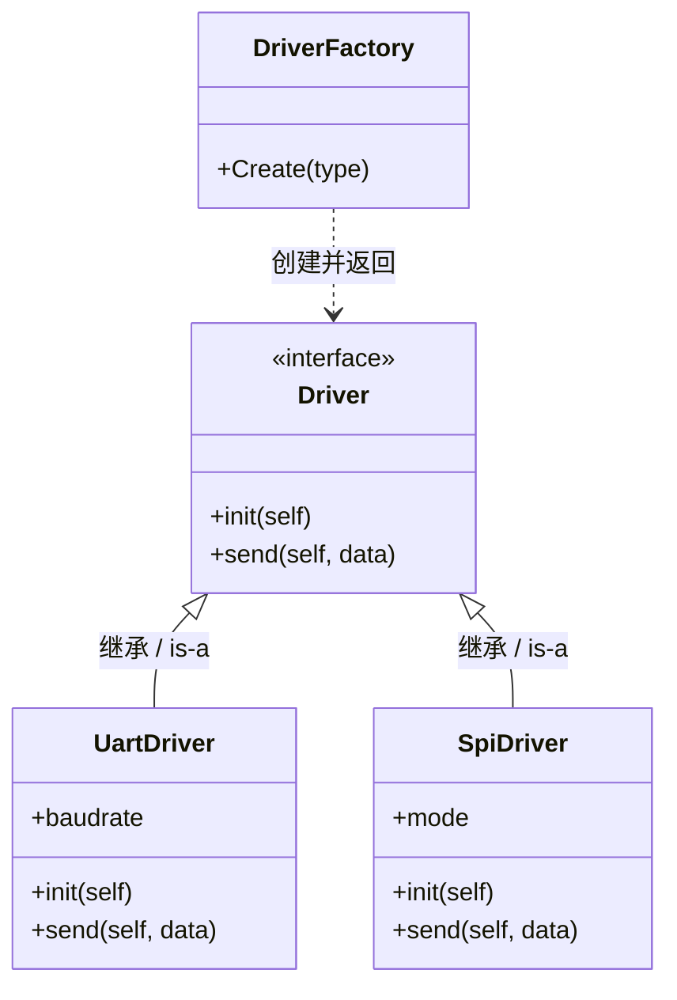


1. 抽象“产品接口”（driver.h）

   ```c
   #ifndef DRIVER_H
   #define DRIVER_H
   
   typedef struct Driver Driver;
   
   struct Driver {
       int (*init)(Driver *self);
       int (*send)(Driver *self, const char *data);
   };
   
   /* 驱动类型 */
   typedef enum {
       DRIVER_UART,
       DRIVER_SPI,
       DRIVER_I2C
   } DriverType;
   
   /* 工厂接口 */
   Driver *DriverFactory_Create(DriverType type);
   
   #endif
   ```

2. 具体产品实现（uart.c）

   ```c
   #include <stdio.h>
   #include <stdlib.h>
   #include "driver.h"
   
   typedef struct {
       Driver base;
       int baudrate;
   } UartDriver;
   
   static int uart_init(Driver *self)
   {
       UartDriver *uart = (UartDriver *)self;
       uart->baudrate = 115200;
       printf("UART init, baudrate=%d\n", uart->baudrate);
       return 0;
   }
   
   static int uart_send(Driver *self, const char *data)
   {
       (void)self;
       printf("UART send: %s\n", data);
       return 0;
   }
   
   Driver *UartDriver_Create(void)
   {
       UartDriver *uart = malloc(sizeof(UartDriver));
       if (!uart) return NULL;
   
       uart->base.init = uart_init;
       uart->base.send = uart_send;
       return (Driver *)uart;
   }
   ```

3. SPI 实现（spi.c）

   ```c
   #include <stdio.h>
   #include <stdlib.h>
   #include "driver.h"
   
   typedef struct {
       Driver base;
       int mode;
   } SpiDriver;
   
   static int spi_init(Driver *self)
   {
       SpiDriver *spi = (SpiDriver *)self;
       spi->mode = 0;
       printf("SPI init, mode=%d\n", spi->mode);
       return 0;
   }
   
   static int spi_send(Driver *self, const char *data)
   {
       (void)self;
       printf("SPI send: %s\n", data);
       return 0;
   }
   
   Driver *SpiDriver_Create(void)
   {
       SpiDriver *spi = malloc(sizeof(SpiDriver));
       if (!spi) return NULL;
   
       spi->base.init = spi_init;
       spi->base.send = spi_send;
       return (Driver *)spi;
   }
   ```

4.  工厂实现（factory.c）

   ```c
   #include "driver.h"
   
   /* 具体产品创建函数声明 */
   Driver *UartDriver_Create(void);
   Driver *SpiDriver_Create(void);
   
   Driver *DriverFactory_Create(DriverType type)
   {
       switch (type) {
       case DRIVER_UART:
           return UartDriver_Create();
       case DRIVER_SPI:
           return SpiDriver_Create();
       default:
           return 0;
       }
   }
   ```

5. 使用方（main.c）

   ```c
   #include <stdio.h>
   #include "driver.h"
   
   int main(void)
   {
       Driver *drv = DriverFactory_Create(DRIVER_UART);
   
       drv->init(drv);
       drv->send(drv, "hello");
   
       return 0;
   }
   ```

   📌 **输出：**

   ```
   UART init, baudrate=115200
   UART send: hello
   ```

> [!tip]
>
> 创建逻辑被“隔离”了
>
> ```c
> Driver *drv = DriverFactory_Create(DRIVER_UART);
> ```
>
> 上层**完全不知道 UART/SPI 的存在**。
>
> 多态在 C 中如何成立？
>
> ```c
> drv->send(drv, "hello");
> ```
>
> - `drv` 是 `Driver *`
> - 实际执行的是 UART / SPI 的实现
>
> 👉 **这就是 C 语言的“运行期多态”**
>
> ---
>
> 工厂模式 vs 单例模式（🔍 对比）
>
> | 维度     | 单例         | 工厂       |
> | -------- | ------------ | ---------- |
> | 关注点   | 唯一实例     | 创建解耦   |
> | 返回对象 | 固定一个     | 多种类型   |
> | 是否多态 | ❌            | ✅          |
> | 典型用途 | 配置、管理器 | 驱动、模块 |
>
> ---
>
> 👉 **它们经常组合使用，而不是互斥**
>
> 工厂 + 单例（常见）
>
> - 每种驱动只有一个实例
> - 工厂返回“唯一实例”


> [!important] 
>
> 什么时候该用工厂模式？
>
> ✅ 当你满足以下任一条件：
>
> - `if / switch` 开始蔓延
> - 有“产品族”的概念
> - 未来可能增加新类型
>
> ❌ 不要用于：
>
> - 只会存在一种类型
> - 创建逻辑极简单

# 策略模式（Strategy）

真实工程痛点（你一定遇到过）

```c
if (mode == FAST) 
{
    calc_fast();
} 
else if (mode == SAFE) 
{
    calc_safe();
} 
else if (mode == LOW_POWER) 
{
    calc_low_power();
}
```

问题不在“能不能跑”，而在：

| 问题             | 工程后果     |
| ---------------- | ------------ |
| 条件分支爆炸     | 可读性差     |
| 算法与流程耦合   | 无法独立演进 |
| 新算法要改老代码 | 违反开闭原则 |
| 测试困难         | 逻辑缠绕     |

👉 **策略模式要解决的核心问题：**

> **“把‘算法的选择’从‘算法的使用’中分离出来”**

策略模式的抽象思想（语言无关）的核心角色有3个：

| 角色              | 职责             |
| ----------------- | ---------------- |
| Strategy          | 抽象算法接口     |
| Concrete Strategy | 具体算法         |
| Context           | 使用算法的上下文 |

---

场景：**通信发送策略**

- 同一个发送流程
- 不同发送策略：
  - 普通模式
  - 低功耗模式
  - 高可靠模式

👉 **发送流程固定，算法可变**

首先看一下类图说明：

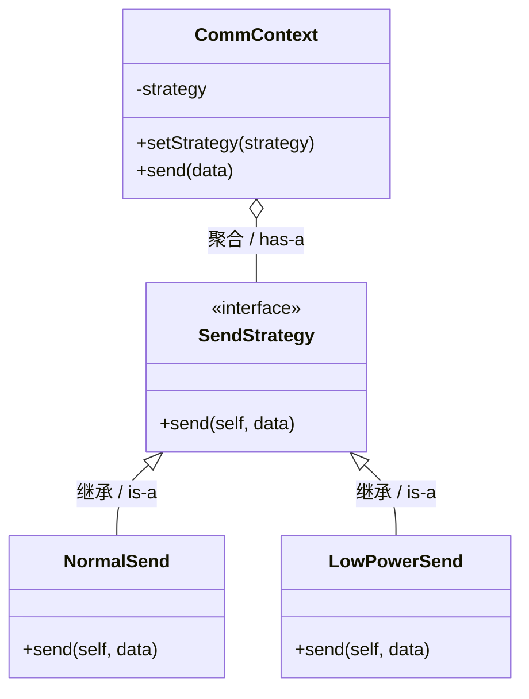

1. 抽象策略接口（strategy.h）

   ```c
   #ifndef STRATEGY_H
   #define STRATEGY_H
   
   typedef struct SendStrategy SendStrategy;
   
   struct SendStrategy {
       int (*send)(SendStrategy *self, const char *data);
   };
   
   #endif
   ```

2. 具体策略实现（normal_send.c）

   ```c
   #include <stdio.h>
   #include "strategy.h"
   
   static int normal_send(SendStrategy *self, const char *data)
   {
       (void)self;
       printf("[Normal] send: %s\n", data);
       return 0;
   }
   
   SendStrategy *NormalSend_Create(void)
   {
       static SendStrategy s_normal;
       s_normal.send = normal_send;
       return &s_normal;
   }
   ```

3. 低功耗策略（low_power_send.c）

   ```c
   #include <stdio.h>
   #include "strategy.h"
   
   static int low_power_send(SendStrategy *self, const char *data)
   {
       (void)self;
       printf("[LowPower] send slowly: %s\n", data);
       return 0;
   }
   
   SendStrategy *LowPowerSend_Create(void)
   {
       static SendStrategy s_lowpower;
       s_lowpower.send = low_power_send;
       return &s_lowpower;
   }
   ```

4. 上下文（context.h / context.c）

   `context.h`

   ```c
   #ifndef CONTEXT_H
   #define CONTEXT_H
   
   #include "strategy.h"
   
   typedef struct {
       SendStrategy *strategy;
   } CommContext;
   
   void CommContext_SetStrategy(CommContext *ctx, SendStrategy *strategy);
   int  CommContext_Send(CommContext *ctx, const char *data);
   
   #endif
   ```

   `context.c`

   ```c
   #include "context.h"
   
   void CommContext_SetStrategy(CommContext *ctx, SendStrategy *strategy)
   {
       ctx->strategy = strategy;
   }
   
   int CommContext_Send(CommContext *ctx, const char *data)
   {
       return ctx->strategy->send(ctx->strategy, data);
   }
   ```

5. 使用方（main.c）

   ```c
   #include "context.h"
   
   /* 工厂函数声明 */
   SendStrategy *NormalSend_Create(void);
   SendStrategy *LowPowerSend_Create(void);
   
   int main(void)
   {
       CommContext ctx;
   
       CommContext_SetStrategy(&ctx, NormalSend_Create());
       CommContext_Send(&ctx, "hello");
   
       CommContext_SetStrategy(&ctx, LowPowerSend_Create());
       CommContext_Send(&ctx, "hello");
   
       return 0;
   }
   ```

   📌 **输出：**

   ```
   [Normal] send: hello
   [LowPower] send slowly: hello
   ```

> [!note]
>
> `Context` 永远只依赖抽象
>
> ```c
> SendStrategy *strategy;
> ```
>
> 👉 **它不知道 Normal / LowPower 的存在**
>
> ------
>
> 策略可以在“运行期”切换
>
> ```c
> CommContext_SetStrategy(&ctx, LowPowerSend_Create());
> ```
>
> 👉 这正是 Strategy 和 Factory 的核心区别之一
>
> ------
>
> 这是“组合”，不是继承
>
> ```c
> CommContext o-- SendStrategy : 聚合 / has-a
> ```
>
> 👉 Context **拥有策略，但不是一种策略**
>
> ---
>
> Strategy vs Factory（🔍 关键对比）
>
> | 维度         | Factory  | Strategy |
> | ------------ | -------- | -------- |
> | 解决问题     | 如何创建 | 如何使用 |
> | 关注点       | 实例生成 | 行为切换 |
> | 切换时机     | 创建时   | 运行时   |
> | 是否持有对象 | ❌        | ✅        |
>
> 👉 **常见组合：Factory 创建 Strategy，Context 使用 Strategy**


> [!important]
>
> 嵌入式工程中的常见策略模式应用
>
> - 滤波算法选择（你之前讨论 PF/AF 算法，其实天然是 Strategy）
> - 调度策略
> - 编码 / 解码策略
> - 省电模式切换

# 状态模式（State）

> 关键词：**状态驱动行为 / 状态内部切换 / 使用者透明**

真实协议代码（反例）

```c
switch (state) {
case IDLE:
    if (evt == EVT_CONN)
    { 
        state = CONNECTED;
    }
    break;
case CONNECTED:
    if (evt == EVT_SEND) 
    {
        send_data();
    }
    else if (evt == EVT_CLOSE) 
    {
        state = IDLE;
    }
    break;
}
```

表面能跑，但工程问题是：

| 问题                | 后果       |
| ------------------- | ---------- |
| 状态 + 行为混在一起 | 难维护     |
| 分支指数级增长      | 复杂度失控 |
| 新状态必改老代码    | 高风险     |
| 无法模块化测试      | 易出错     |

👉 **State 模式要解决的是：**

> **“把‘状态’本身变成对象，让状态决定行为和迁移”**

State 模式的抽象思想（语言无关）有3 个核心角色：

| 角色           | 职责         |
| -------------- | ------------ |
| State          | 抽象状态接口 |
| Concrete State | 具体状态     |
| Context        | 持有当前状态 |

⚠️ 和 Strategy 极像，但**核心差异在“谁负责切换状态”**

---

协议状态机场景设定

```
IDLE → CONNECTED → SENDING → IDLE
```

- `EVT_CONNECT`
- `EVT_SEND`
- `EVT_DONE`

首先来看一下整体类图说明：

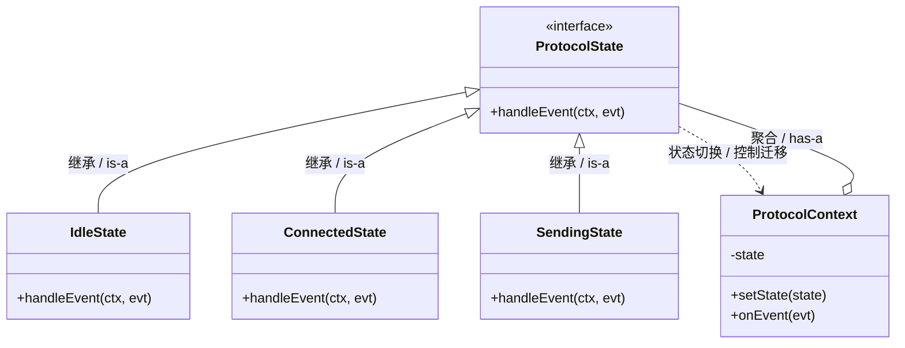

1. 抽象状态接口（state.h）

   ```c
   #ifndef STATE_H
   #define STATE_H
   
   typedef struct ProtocolContext ProtocolContext;
   
   typedef enum 
   {
       EVT_CONNECT,
       EVT_SEND,
       EVT_DONE
   } Event;
   
   typedef struct ProtocolState ProtocolState;
   
   struct ProtocolState {
       void (*handle)(ProtocolContext *ctx, Event evt);
   };
   
   #endif
   ```

2. 上下文（context.h / context.c）

   `context.h`

   ```c
   #ifndef CONTEXT_H
   #define CONTEXT_H
   
   #include "state.h"
   
   struct ProtocolContext 
   {
       ProtocolState *state;
   };
   
   void ProtocolContext_SetState(ProtocolContext *ctx, ProtocolState *state);
   void ProtocolContext_OnEvent(ProtocolContext *ctx, Event evt);
   
   #endif
   ```

   `context.c`

   ```c
   #include "context.h"
   
   void ProtocolContext_SetState(ProtocolContext *ctx, ProtocolState *state)
   {
       ctx->state = state;
   }
   
   void ProtocolContext_OnEvent(ProtocolContext *ctx, Event evt)
   {
       ctx->state->handle(ctx, evt);
   }
   ```

3. 具体状态实现

   1. `idle_state.c`

      ```c
      #include <stdio.h>
      #include "context.h"
      
      /* 前向声明其他状态 */
      ProtocolState *ConnectedState_Instance(void);
      
      static void idle_handle(ProtocolContext *ctx, Event evt)
      {
          if (evt == EVT_CONNECT) 
          {
              printf("IDLE -> CONNECTED\n");
              ProtocolContext_SetState(ctx, ConnectedState_Instance());
          }
      }
      
      static ProtocolState s_idle = 
      {
          .handle = idle_handle
      };
      
      ProtocolState *IdleState_Instance(void)
      {
          return &s_idle;
      }
      ```

   2. `connected_state.c`

      ```c
      #include <stdio.h>
      #include "context.h"
      
      ProtocolState *SendingState_Instance(void);
      
      static void connected_handle(ProtocolContext *ctx, Event evt)
      {
          if (evt == EVT_SEND) 
          {
              printf("CONNECTED -> SENDING\n");
              ProtocolContext_SetState(ctx, SendingState_Instance());
          }
      }
      
      static ProtocolState s_connected = 
      {
          .handle = connected_handle
      };
      
      ProtocolState *ConnectedState_Instance(void)
      {
          return &s_connected;
      }
      ```

   3. `sending_state.c`

      ```c
      #include <stdio.h>
      #include "context.h"
      
      ProtocolState *IdleState_Instance(void);
      
      static void sending_handle(ProtocolContext *ctx, Event evt)
      {
          if (evt == EVT_DONE) {
              printf("SENDING -> IDLE\n");
              ProtocolContext_SetState(ctx, IdleState_Instance());
          }
      }
      
      static ProtocolState s_sending = {
          .handle = sending_handle
      };
      
      ProtocolState *SendingState_Instance(void)
      {
          return &s_sending;
      }
      ```

4. 使用方（main.c）

   ```c
   /* 状态实例函数 */
   ProtocolState *IdleState_Instance(void);
   
   int main(void)
   {
       ProtocolContext ctx;
   
       ProtocolContext_SetState(&ctx, IdleState_Instance());
   
       ProtocolContext_OnEvent(&ctx, EVT_CONNECT);
       ProtocolContext_OnEvent(&ctx, EVT_SEND);
       ProtocolContext_OnEvent(&ctx, EVT_DONE);
   
       return 0;
   }
   ```

   📌 **输出：**

   ```
   IDLE -> CONNECTED
   CONNECTED -> SENDING
   SENDING -> IDLE
   ```

> [!tip]
>
> 当然，也可以在处理函数中修改当前的状态，让状态机可以自动的进行状态转移，而不需要使用指定的状态，状态机的配置可以如以下配置：
>
> ```c
> typedef enum {
>     VOLTAGE_NORMAL = 0,
>     VOLTAGE_UNDER_DETECTING,
>     VOLTAGE_OVER_DETECTING,
>     VOLTAGE_UNDER,
>     VOLTAGE_UNDER_RECOVERING,
>     VOLTAGE_OVER,
>     VOLTAGE_OVER_RECOVERING,
>     VOLTAGE_STATE_MAX
> } VoltageStatus_e;
> 
> typedef void (*VoltageStateFunc_t)(VoltageMonitor_t *, uint16_t);
> 
> static VoltageStateFunc_t g_pfnStateTable[VOLTAGE_STATE_MAX] = 
> {
>     [VOLTAGE_NORMAL]           = PowerManger_NormalState,
>     [VOLTAGE_UNDER_DETECTING]  = PowerManger_UnderVoltageCheck,
>     [VOLTAGE_OVER_DETECTING]   = PowerManger_OverVoltageCheck,
>     [VOLTAGE_UNDER]            = PowerManger_UnderState,
>     [VOLTAGE_UNDER_RECOVERING] = PowerManger_UnderVoltageRecovery,
>     [VOLTAGE_OVER]             = PowerManger_OverState,
>     [VOLTAGE_OVER_RECOVERING]  = PowerManger_OverVoltageRecovery,
> };
> ```
>
> 在处理函数中修改当前的状态，那么我在调用的时候只要按照以下状态转移即可。
>
> ```c
> g_pfnStateTable[pMonitor->eState](pMonitor, usCurrentVal);
> ```

> [!note]
>
> 状态“自己决定”怎么迁移
>
> ```c
> ProtocolContext_SetState(ctx, ConnectedState_Instance());
> ```
>
> 👉 **这行代码只存在于 State 内部**
>
> ------
>
> Context 完全“不知道状态逻辑”
>
> ```c
> ctx->state->handle(ctx, evt);
> ```
>
> 👉 Context 是**状态机的壳**
>
> ------
>
> State 是“有行为的对象”，不是枚举
>
> ❌ `enum + switch`
>
> ✅ `struct + function pointer`
>
> ------
>
> State vs Strategy（🔍 本质对比）
>
> | 维度         | Strategy | State            |
> | ------------ | -------- | ---------------- |
> | 谁切换       | 外部     | 状态内部         |
> | 是否有迁移图 | ❌        | ✅                |
> | 上下文感知   | 明确     | 透明             |
> | 典型场景     | 算法选择 | 协议 / UI / 流程 |
>
> 👉 **协议 = State，算法 = Strategy**


> [!important]
>
> - 通信协议（CAN / Modbus / BLE）
> - Bootloader
> - 电源管理状态
> - 设备生命周期管理

# 观察者模式（Observer）

> 关键词：**发布-订阅 / 解耦 / 一对多通知**

真实嵌入式代码（反例）

```c
void on_rx_interrupt(void)
{
    protocol_on_rx();
    logger_on_rx();
    ui_on_rx();
}
```

工程问题在于：

| 问题     | 后果             |
| -------- | ---------------- |
| 强耦合   | ISR 知道所有模块 |
| 扩展困难 | 加模块必改 ISR   |
| 复用性差 | 逻辑绑死         |
| 测试困难 | 无法独立验证     |

👉 **Observer 模式要解决的是：**

> **“事件发生者，不需要知道谁在响应事件”**

Observer 模式的抽象思想（语言无关）有4个核心角色：

| 角色              | 职责               |
| ----------------- | ------------------ |
| Subject           | 被观察者（事件源） |
| Observer          | 观察者（订阅者）   |
| Concrete Observer | 具体订阅者         |
| attach / notify   | 管理和通知         |

---

场景：**协议接收事件通知**

- RX 完成 → 产生事件
- 多个模块订阅：
  - 协议解析
  - 日志
  - UI

首先来看一下整体的类图说明：

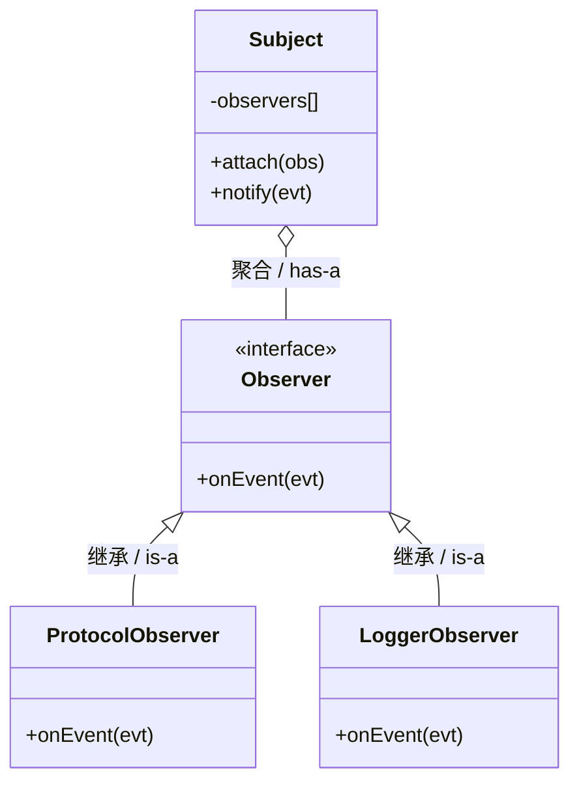

1. 抽象 Observer 接口（observer.h）

   ```c
   #ifndef OBSERVER_H
   #define OBSERVER_H
   
   typedef enum 
   {
       EVT_RX_DONE,
       EVT_TX_DONE
   } Event;
   
   typedef struct Observer Observer;
   
   struct Observer 
   {
       void (*on_event)(Observer *self, Event evt);
   };
   
   #endif
   ```

2. Subject（subject.h / subject.c）

   `subject.h`

   ```c
   #ifndef SUBJECT_H
   #define SUBJECT_H
   
   #include "observer.h"
   
   #define MAX_OBSERVERS 4
   
   typedef struct 
   {
       Observer *list[MAX_OBSERVERS];
       int count;
   } Subject;
   
   void Subject_Init(Subject *sub);
   void Subject_Attach(Subject *sub, Observer *obs);
   void Subject_Notify(Subject *sub, Event evt);
   
   #endif
   ```

   `subject.c`

   ```c
   #include "subject.h"
   
   void Subject_Init(Subject *sub)
   {
       sub->count = 0;
   }
   
   void Subject_Attach(Subject *sub, Observer *obs)
   {
       if (sub->count < MAX_OBSERVERS) {
           sub->list[sub->count++] = obs;
       }
   }
   
   void Subject_Notify(Subject *sub, Event evt)
   {
       for (int i = 0; i < sub->count; i++) {
           sub->list[i]->on_event(sub->list[i], evt);
       }
   }
   ```

3. 具体 Observer 实现

   1. `protocol_observer.c`

      ```c
      #include <stdio.h>
      #include "observer.h"
      
      static void protocol_on_event(Observer *self, Event evt)
      {
          (void)self;
          if (evt == EVT_RX_DONE) {
              printf("[Protocol] RX done\n");
          }
      }
      
      static Observer s_protocol = {
          .on_event = protocol_on_event
      };
      
      Observer *ProtocolObserver_Instance(void)
      {
          return &s_protocol;
      }
      ```

   2. `logger_observer.c`

      ```c
      #include <stdio.h>
      #include "observer.h"
      
      static void logger_on_event(Observer *self, Event evt)
      {
          (void)self;
          printf("[Logger] event = %d\n", evt);
      }
      
      static Observer s_logger = {
          .on_event = logger_on_event
      };
      
      Observer *LoggerObserver_Instance(void)
      {
          return &s_logger;
      }
      ```

4. 使用方（main.c）

   ```c
   #include "subject.h"
   
   /* observer 实例 */
   Observer *ProtocolObserver_Instance(void);
   Observer *LoggerObserver_Instance(void);
   
   int main(void)
   {
       Subject rx_subject;
   
       Subject_Init(&rx_subject);
   
       Subject_Attach(&rx_subject, ProtocolObserver_Instance());
       Subject_Attach(&rx_subject, LoggerObserver_Instance());
   
       Subject_Notify(&rx_subject, EVT_RX_DONE);
   
       return 0;
   }
   ```

   📌 **输出：**

   ```
   [Protocol] RX done
   [Logger] event = 0
   ```

> [!note]
>
> Subject 完全不知道 Observer 的类型
>
> ```c
> Observer *list[];
> ```
>
> 👉 **这就是解耦的根本**
>
> ------
>
> Observer 是“一对多”关系
>
> ```c
> Subject o-- Observer : 聚合 / has-a
> ```
>
> ------
>
> ISR / 驱动 → Observer 是天然组合
>
> ISR 只做：
>
> ```c
> Subject_Notify(&rx_subject, EVT_RX_DONE);
> ```
>
> ------
>
> Observer vs State（🔍 边界对比）
>
> | 维度     | Observer         | State    |
> | -------- | ---------------- | -------- |
> | 解决问题 | 事件通知         | 状态行为 |
> | 通知对象 | 多个             | 当前状态 |
> | 切换关系 | ❌                | ✅        |
> | 常组合   | State + Observer | ——       |
>
> 👉 **State 决定“怎么做”，Observer 决定“通知谁”**
>
> ---
>
> Observer vs 回调函数（非常重要）
>
> | 回调       | Observer    |
> | ---------- | ----------- |
> | 单一接收者 | 多接收者    |
> | 强绑定     | 解耦        |
> | 难管理     | 可注册/注销 |
>
> 👉 **Observer = 可管理的回调系统**


> [!important]
>
> - 中断事件分发
> - RTOS 消息通知
> - 协议栈事件
> - UI 事件系统


# 命令模式（Command）

> 关键词：**请求封装 / 延迟执行 / ISR 解耦 / 队列调度**

典型反例（ISR 里直接干活）

```c
void USART_IRQHandler(void)
{
    if (rx_done) {
        protocol_on_rx();
        logger_write();
        app_notify();
    }
}
```

这在嵌入式里是**严重设计问题**

| 问题     | 后果             |
| -------- | ---------------- |
| ISR 太重 | 中断延迟、丢中断 |
| 强耦合   | ISR 知道所有模块 |
| 无法调度 | 无优先级控制     |
| 无法复用 | ISR 逻辑绑死     |

👉 **ISR 的唯一职责应该是：**

> **“记录发生了什么”，而不是“处理发生的事情”**

抽象视角（语言无关）：

| 角色             | 含义             |
| ---------------- | ---------------- |
| Command          | “要做的事”的封装 |
| Concrete Command | 具体要做什么     |
| Invoker          | 触发/调度命令    |
| Receiver         | 真正干活的模块   |

在嵌入式中自然映射为：

| OOP 角色 | 嵌入式实体      |
| -------- | --------------- |
| Command  | 消息 / 任务对象 |
| Invoker  | ISR             |
| Queue    | Command Buffer  |
| Receiver | 协议 / 应用任务 |

Command + Queue 架构：

```
┌──────────┐
│   ISR    │  ← Invoker
│ (产生命令)│
└────┬─────┘
     │ enqueue
┌────▼─────┐
│  Queue   │  ← Command Buffer
└────┬─────┘
     │ dequeue
┌────▼─────┐
│  Task    │  ← 执行 Command
└──────────┘
```

首先看一下整体的类图：

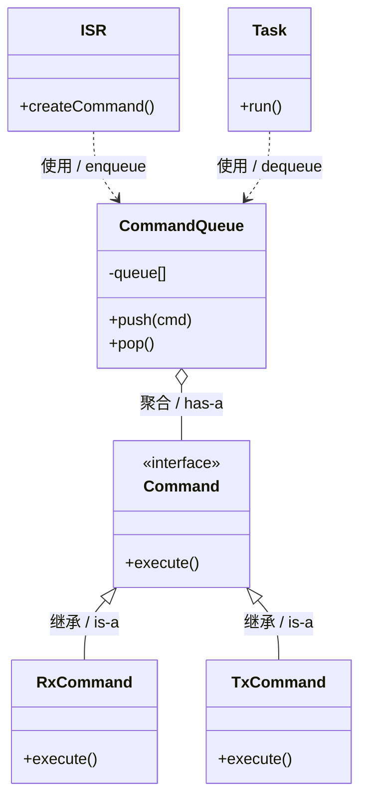

> ISR **只创建 Command**，Task **只执行 Command**

示例目标：**ISR 产生 RX 命令 → 队列 → 主循环执行**

1. Command 抽象接口（command.h）

   ```c
   #ifndef COMMAND_H
   #define COMMAND_H
   
   typedef struct Command Command;
   
   struct Command {
       void (*execute)(Command *self);
   };
   
   #endif
   ```

2. 具体命令（rx_command.c）

   ```c
   #include <stdio.h>
   #include "command.h"
   
   static void rx_execute(Command *self)
   {
       (void)self;
       printf("[CMD] Handle RX data\n");
   }
   
   static Command s_rx_cmd = {
       .execute = rx_execute
   };
   
   Command *RxCommand_Instance(void)
   {
       return &s_rx_cmd;
   }
   ```

3. Command Queue（queue.h / queue.c）

   1. queue.h

      ```c
      #ifndef QUEUE_H
      #define QUEUE_H
      
      #include "command.h"
      
      #define QUEUE_SIZE 8
      
      typedef struct {
          Command *buf[QUEUE_SIZE];
          int head;
          int tail;
      } CommandQueue;
      
      void Queue_Init(CommandQueue *q);
      int  Queue_Push(CommandQueue *q, Command *cmd);
      Command *Queue_Pop(CommandQueue *q);
      
      #endif
      ```

   2. queue.c

      ```c
      #include "queue.h"
      
      void Queue_Init(CommandQueue *q)
      {
          q->head = q->tail = 0;
      }
      
      int Queue_Push(CommandQueue *q, Command *cmd)
      {
          int next = (q->tail + 1) % QUEUE_SIZE;
          if (next == q->head) {
              return -1; /* full */
          }
          q->buf[q->tail] = cmd;
          q->tail = next;
          return 0;
      }
      
      Command *Queue_Pop(CommandQueue *q)
      {
          if (q->head == q->tail) {
              return 0; /* empty */
          }
          Command *cmd = q->buf[q->head];
          q->head = (q->head + 1) % QUEUE_SIZE;
          return cmd;
      }
      ```

4. ISR（模拟）（isr.c）

   ```c
   #include "queue.h"
   
   /* 命令实例 */
   Command *RxCommand_Instance(void);
   
   void USART_ISR(CommandQueue *q)
   {
       /* 只做一件事：投递命令 */
       Queue_Push(q, RxCommand_Instance());
   }
   ```

5. Task / 主循环（main.c）

   ```c
   #include <stdio.h>
   #include "queue.h"
   
   /* ISR & Command */
   void USART_ISR(CommandQueue *q);
   
   int main(void)
   {
       CommandQueue q;
       Queue_Init(&q);
   
       /* 模拟中断 */
       USART_ISR(&q);
       USART_ISR(&q);
   
       /* 主循环 / 任务上下文 */
       Command *cmd;
       while ((cmd = Queue_Pop(&q)) != 0) {
           cmd->execute(cmd);
       }
   
       return 0;
   }
   ```

   📌 **输出：**

   ```
   [CMD] Handle RX data
   [CMD] Handle RX data
   ```


> [!tip]
>
> ISR **不执行逻辑**
>
> ```c
> Queue_Push(q, RxCommand_Instance());
> ```
>
> 👉 ISR 只负责 **“发生了 RX 事件”**
>
> ------
>
> Command = 延迟执行的行为对象
>
> ```c
> cmd->execute(cmd);
> ```
>
> 👉 行为被**封装、排队、调度**
>
> ------
>
> Queue 是 Command 模式的“放大器”
>
> - 可限流
> - 可优先级
> - 可丢弃
> - 可统计

# 适配器模式（Adapter）

> 关键词：**接口不兼容 / 旧代码复用 / 中间层 / 不侵入式改造**

你在工程里**希望统一 UART 驱动接口**：

```c
typedef struct 
{
    int  (*open)(void);
    int  (*write)(const uint8_t *buf, int len);
} UartDriver;
```

但现实是：

厂商 A（HAL）

```c
HAL_StatusTypeDef HAL_UART_Transmit(UART_HandleTypeDef *, uint8_t *, uint16_t, uint32_t);
```

厂商 B（裸驱）

```c
int uart_send_bytes(int port, const char *buf, int size);
```

👉 **接口签名、调用方式、语义全部不同**

你现在面临三个选择：

1. ❌ 改所有业务代码
2. ❌ 改厂商 HAL（作死）
3. ✅ **加 Adapter**

Adapter 模式在 C 里的本质定义:

> **把一个已有接口，转换成客户端期望的接口**

📌 注意关键词：

- **已有接口**（不能改）
- **客户端期望接口**（你设计的抽象）
- **转换发生在中间**

角色映射（OOP → 嵌入式 C）

| 经典角色 | C / 嵌入式实体     |
| -------- | ------------------ |
| Target   | 统一的 Driver 接口 |
| Adaptee  | 厂商 HAL / 旧驱动  |
| Adapter  | 适配器结构体       |
| Client   | 协议 / 应用代码    |

我们希望实现的目标是：

> **业务代码只认识 `UartDriver`，完全不知道 HAL 存在**


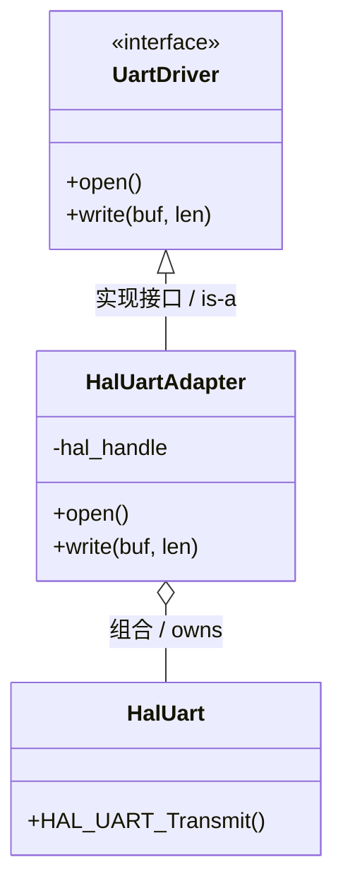

1. 统一接口（uart_driver.h）

   ```c
   #ifndef UART_DRIVER_H
   #define UART_DRIVER_H
   
   #include <stdint.h>
   
   typedef struct UartDriver UartDriver;
   
   struct UartDriver {
       int (*open)(UartDriver *self);
       int (*write)(UartDriver *self, const uint8_t *buf, int len);
   };
   
   #endif
   ```

2. 模拟 HAL（不可修改）（hal_uart.h / .c）

   1. hal_uart.h

      ```c
      #ifndef HAL_UART_H
      #define HAL_UART_H
      
      #include <stdint.h>
      
      typedef struct {
          int dummy;
      } HAL_UART_Handle;
      
      int HAL_UART_Transmit(HAL_UART_Handle *h,
                            uint8_t *buf,
                            uint16_t len,
                            uint32_t timeout);
      
      #endif
      ```

   2. hal_uart.c

      ```c
      #include <stdio.h>
      #include "hal_uart.h"
      
      int HAL_UART_Transmit(HAL_UART_Handle *h,
                            uint8_t *buf,
                            uint16_t len,
                            uint32_t timeout)
      {
          (void)h;
          (void)timeout;
          printf("[HAL] TX %d bytes: %.*s\n", len, len, buf);
          return 0;
      }
      ```

3. Adapter（hal_uart_adapter.c）

   ```c
   #include <stdio.h>
   #include "uart_driver.h"
   #include "hal_uart.h"
   
   typedef struct {
       UartDriver base;              /* is-a */
       HAL_UART_Handle *hal;         /* has-a */
   } HalUartAdapter;
   
   static int hal_open(UartDriver *self)
   {
       (void)self;
       return 0;
   }
   
   static int hal_write(UartDriver *self,
                        const uint8_t *buf,
                        int len)
   {
       HalUartAdapter *adp = (HalUartAdapter *)self;
       return HAL_UART_Transmit(adp->hal,
                                (uint8_t *)buf,
                                (uint16_t)len,
                                1000);
   }
   
   void HalUartAdapter_Init(HalUartAdapter *adp,
                            HAL_UART_Handle *hal)
   {
       adp->base.open  = hal_open;
       adp->base.write = hal_write;
       adp->hal = hal;
   }
   ```

4. 业务代码（main.c）

   ```c
   #include "uart_driver.h"
   
   /* Adapter API */
   typedef struct HalUartAdapter HalUartAdapter;
   void HalUartAdapter_Init(HalUartAdapter *, void *);
   
   int main(void)
   {
       HAL_UART_Handle hal;
       HalUartAdapter adapter;
   
       HalUartAdapter_Init(&adapter, &hal);
   
       UartDriver *drv = (UartDriver *)&adapter;
   
       drv->open(drv);
       drv->write(drv, (uint8_t *)"Hello", 5);
   
       return 0;
   }
   ```

   📌 **业务层完全不知道 HAL 的存在**

> [!tip]  
>
> Adapter ≠ Wrapper（随便包一层）
>
> > Adapter 的目标是**接口兼容**
> >
> > 不是“加一层 API”
>
> ------
>
> Adapter 一定是 **“is-a + has-a”**
>
> ```c
> typedef struct {
>     UartDriver base;   /* is-a */
>     HAL_UART_Handle *hal; /* has-a */
> } HalUartAdapter;
> ```
>
> 这正是类图里两条线的体现。
>
> ------
>
> Adapter 是“被 Factory 创建”的理想对象
>
> ```c
> UartDriver *DriverFactory_Create(TYPE_HAL_UART);
> ```
>
> 👉 **Factory + Adapter = 工程抽象的核心组合**
>
> ---
>
> Adapter vs Strategy vs Facade（🔍 边界对比）
>
> | 模式     | 解决什么问题 | 是否改变接口 |
> | -------- | ------------ | ------------ |
> | Adapter  | 接口不兼容   | ✅            |
> | Strategy | 行为可替换   | ❌            |
> | Facade   | 简化子系统   | ❌            |
>
> 一句话记忆：
>
> > 1. **接口不一样 → Adapter**
> > 2. **行为不一样 → Strategy**
> > 3. **系统太复杂 → Facade**
>
> 


Adapter 在当前“完整体系”中的位置为：

```
Factory
  ↓
Adapter (统一接口)
  ↓
Strategy / State
  ↓
Command
  ↓
Observer
```

👉 **这是嵌入式中大型工程的真实骨架**


# 装饰器模式（Decorator）

> 关键词：**功能叠加 / 不改原代码 / 横切关注点 / 透明增强**

你一定遇到过这样的需求链：

- 原始 UART 驱动 ✔
- 后来要 **加日志**
- 再后来要 **加 CRC**
- 再后来要 **统计发送字节数**
- 再后来要 **加调试 Trace**

❌ 反例：不停改驱动

```c
uart_write()
{
    log();
    crc();
    stat();
    real_send();
}
```

后果：

- 驱动越来越胖
- 功能强耦合
- 不可裁剪
- 不可复用

👉 **Decorator 的目的：把这些“横切功能”拆出去**

Decorator 的核心思想是：

> **对象“外面再包一层对象”**
>
> 外层和内层**接口完全一致**

所以：

- 对客户端来说：**还是同一个接口**
- 对实现来说：**功能被叠加**

Decorator 在 C / 嵌入式里的角色映射

| 经典角色           | C 语言映射        |
| ------------------ | ----------------- |
| Component          | Driver 接口       |
| Concrete Component | 原始驱动          |
| Decorator          | 包装驱动的结构体  |
| Concrete Decorator | 日志 / CRC / 统计 |


📌 **Decorator 的精髓就在：**

> **“is-a + wraps” 同时存在**

目标：

> UART → Log → CRC
> 	**三层叠加，但业务代码只看到 `Driver`**

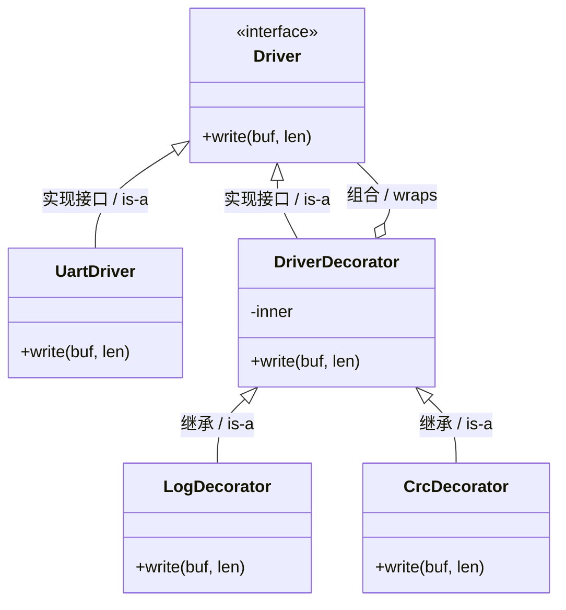

1. Driver 接口（driver.h）

   ```c
   #ifndef DRIVER_H
   #define DRIVER_H
   
   #include <stdint.h>
   
   typedef struct Driver Driver;
   
   struct Driver {
       int (*write)(Driver *self, const uint8_t *buf, int len);
   };
   
   #endif
   ```

2. 原始 UART 驱动（uart_driver.c）

   ```c
   #include <stdio.h>
   #include "driver.h"
   
   typedef struct {
       Driver base;
   } UartDriver;
   
   static int uart_write(Driver *self,
                         const uint8_t *buf,
                         int len)
   {
       (void)self;
       printf("[UART] send %d bytes: %.*s\n", len, len, buf);
       return len;
   }
   
   void UartDriver_Init(UartDriver *uart)
   {
       uart->base.write = uart_write;
   }
   ```

3. 抽象 Decorator（driver_decorator.h）

   ```c
   #ifndef DRIVER_DECORATOR_H
   #define DRIVER_DECORATOR_H
   
   #include "driver.h"
   
   typedef struct {
       Driver base;     /* is-a */
       Driver *inner;   /* wraps */
   } DriverDecorator;
   
   void DriverDecorator_Init(DriverDecorator *dec,
                             Driver *inner);
   
   #endif
   #include "driver_decorator.h"
   
   void DriverDecorator_Init(DriverDecorator *dec,
                             Driver *inner)
   {
       dec->inner = inner;
   }
   ```

4. 日志装饰器（log_decorator.c）

   ```c
   #include <stdio.h>
   #include "driver_decorator.h"
   
   typedef struct {
       DriverDecorator base;
   } LogDecorator;
   
   static int log_write(Driver *self,
                        const uint8_t *buf,
                        int len)
   {
       LogDecorator *log = (LogDecorator *)self;
       printf("[LOG] write %d bytes\n", len);
       return log->base.inner->write(log->base.inner, buf, len);
   }
   
   void LogDecorator_Init(LogDecorator *log,
                          Driver *inner)
   {
       DriverDecorator_Init(&log->base, inner);
       log->base.base.write = log_write;
   }
   ```

5. CRC 装饰器（crc_decorator.c）

   ```c
   #include <stdio.h>
   #include "driver_decorator.h"
   
   typedef struct {
       DriverDecorator base;
   } CrcDecorator;
   
   static int crc_write(Driver *self,
                        const uint8_t *buf,
                        int len)
   {
       CrcDecorator *crc = (CrcDecorator *)self;
       printf("[CRC] calc crc\n");
       return crc->base.inner->write(crc->base.inner, buf, len);
   }
   
   void CrcDecorator_Init(CrcDecorator *crc,
                          Driver *inner)
   {
       DriverDecorator_Init(&crc->base, inner);
       crc->base.base.write = crc_write;
   }
   ```

6. 业务代码（main.c）

   ```c
   #include "driver.h"
   
   /* forward decl */
   void UartDriver_Init(void *);
   void LogDecorator_Init(void *, Driver *);
   void CrcDecorator_Init(void *, Driver *);
   
   int main(void)
   {
       UartDriver uart;
       LogDecorator log;
       CrcDecorator crc;
   
       UartDriver_Init(&uart);
       LogDecorator_Init(&log, (Driver *)&uart);
       CrcDecorator_Init(&crc, (Driver *)&log);
   
       Driver *drv = (Driver *)&crc;
   
       drv->write(drv, (uint8_t *)"ABC", 3);
       return 0;
   }
   ```

   输出顺序

   ```
   [CRC] calc crc
   [LOG] write 3 bytes
   [UART] send 3 bytes: ABC
   ```

   👉 **调用栈是“从外到内”逐层穿透**

> [!tip]
>
> Decorator **绝不改变接口**
>
> ```c
> int (*write)(Driver *, ...);
> ```
>
> 否则你用不了“透明叠加”。
>
> ------
>
> Decorator **不关心 inner 是谁**
>
> ```c
> Driver *inner;
> ```
>
> 可能是：
>
> - 原始驱动
> - 另一个 Decorator
> - Adapter
>
> ------
>
> Decorator 的顺序 = 功能顺序
>
> ```c
> CRC → Log → UART
> ```
>
> 顺序错误，语义就错。
>
> ------
>
> Decorator vs Adapter vs Proxy（🔍 必须分清）
>
> | 模式      | 核心目的   |
> | --------- | ---------- |
> | Adapter   | 接口不一致 |
> | Decorator | 功能叠加   |
> | Proxy     | 控制访问   |
>
> 一句话总结：
>
> > 1. **接口不一样 → Adapter**
> > 2. **功能往上加 → Decorator**
> > 3. **控制能不能用 → Proxy**

Decorator 在整体架构中的位置为：

```
HAL
 ↓ Adapter
Driver
 ↓ Decorator (Log / CRC / Trace)
 ↓
Strategy / State
 ↓
Command
 ↓
Observer
```

👉 **这是“可裁剪、可组合”的嵌入式架构核心**

# 门面模式（Facade）

> 关键词：**子系统封装 / 简化接口 / 降低耦合 / 对外唯一入口**

假设你现在有一个通信协议栈：

内部包含：

- UART Driver
- CRC Decorator
- Protocol State Machine
- Command Queue
- Event Dispatcher

外部应用只想做三件事：

```c
Protocol_Init();
Protocol_Send(data);
Protocol_Poll();
```

但如果没有 Facade，外部必须：

```c
uart_init();
crc_wrap();
state_init();
queue_init();
observer_register();
...
```

❌ 这会导致：

- 外部依赖内部细节
- 无法重构协议栈
- 接口混乱
- 模块边界模糊

Facade 的核心思想

> **给复杂子系统提供一个“统一、简洁、高层”的接口**

注意：

- Facade 不增加功能
- Facade 不改变接口语义
- Facade 不做策略选择

它只做一件事：

> **隐藏内部复杂性**


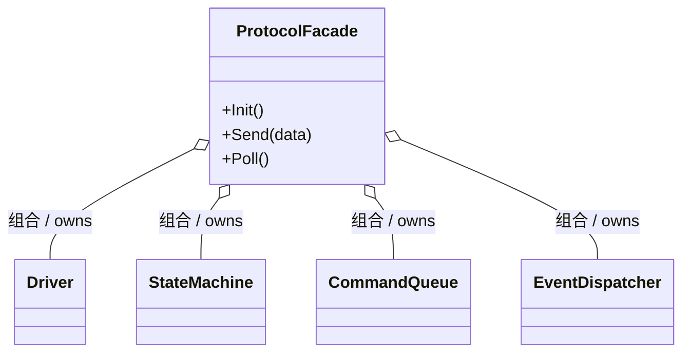

📌 重点：

- 外部只认识 `ProtocolFacade`
- 子系统完全被隐藏

我们做一个极简协议栈模型。

1. 子系统 1：Driver

   ```c
   typedef struct {
       int (*write)(const char *buf);
   } Driver;
   
   static int uart_write(const char *buf)
   {
       printf("[UART] %s\n", buf);
       return 0;
   }
   
   static Driver g_driver = {
       .write = uart_write
   };
   ```

2. 子系统 2：State Machine

   ```c
   typedef enum {
       STATE_IDLE,
       STATE_CONNECTED
   } ProtocolState;
   
   static ProtocolState g_state;
   
   static void State_Init(void)
   {
       g_state = STATE_IDLE;
   }
   
   static void State_HandleSend(void)
   {
       if (g_state == STATE_IDLE)
       {
           printf("[STATE] auto connect\n");
           g_state = STATE_CONNECTED;
       }
   }
   ```

3. 子系统 3：Command Queue（简化）

   ```c
   static void Command_PostSend(const char *data)
   {
       printf("[CMD] enqueue send\n");
       g_driver.write(data);
   }
   ```

4. Facade 实现（核心）

   ```c
   typedef struct {
       Driver *driver;
   } ProtocolFacade;
   
   static ProtocolFacade g_protocol;
   ```

5. 初始化（隐藏所有内部细节）

   ```c
   void Protocol_Init(void)
   {
       g_protocol.driver = &g_driver;
   
       State_Init();
   
       printf("[Facade] Protocol Init Done\n");
   }
   ```

6. 对外发送接口

   ```c
   void Protocol_Send(const char *data)
   {
       State_HandleSend();
       Command_PostSend(data);
   }
   ```

7. 对外轮询

   ```c
   void Protocol_Poll(void)
   {
       printf("[Facade] Polling...\n");
   }
   ```

8. 业务层（只看到 Facade）

   ```c
   int main(void)
   {
       Protocol_Init();
   
       Protocol_Send("Hello");
       Protocol_Poll();
   
       return 0;
   }
   ```

9. 运行结果（执行流程）

   ```
   [Facade] Protocol Init Done
   [STATE] auto connect
   [CMD] enqueue send
   [UART] Hello
   [Facade] Polling...
   ```

外部完全不知道：

- 状态机存在
- 命令队列存在
- Driver 细节存在

Facade vs Adapter vs Decorator（必须彻底区分）

| 模式      | 解决的问题 | 是否改变接口 |
| --------- | ---------- | ------------ |
| Adapter   | 接口不兼容 | ✅            |
| Decorator | 功能叠加   | ❌            |
| Facade    | 隐藏复杂性 | ❌            |
| Proxy     | 控制访问   | ❌            |

一句话区分：

- **Adapter：接口转换**
- **Decorator：功能增强**
- **Facade：系统封装**

# 代理模式（Proxy）

Proxy（代理模式）是**控制访问权**的模式。
如果说：

- Adapter = 改接口
- Decorator = 加功能
- Facade = 藏复杂

那么：

> **Proxy = 控制“能不能访问”**

假设系统里有一个：

```c
Flash_Write(address, data);
```

但问题是：

- 有些区域是 Bootloader 区 ❌ 不允许写
- 有些区域必须校验权限 ❌ 不允许随便写
- 某些情况下（未解锁） ❌ 不允许写

你不能把权限判断写进：

```c
Flash_Write()
```

原因：

- 破坏单一职责
- 驱动变得臃肿
- 不可复用

👉 正确做法：

> **在外面加一个“代理层”**

Proxy 的核心思想：

> 提供一个与真实对象“相同接口”的对象，但在转发调用前，先进行控制逻辑

📌 关键点：

- 接口一致（透明替代）
- 内部持有真实对象
- 可拒绝调用

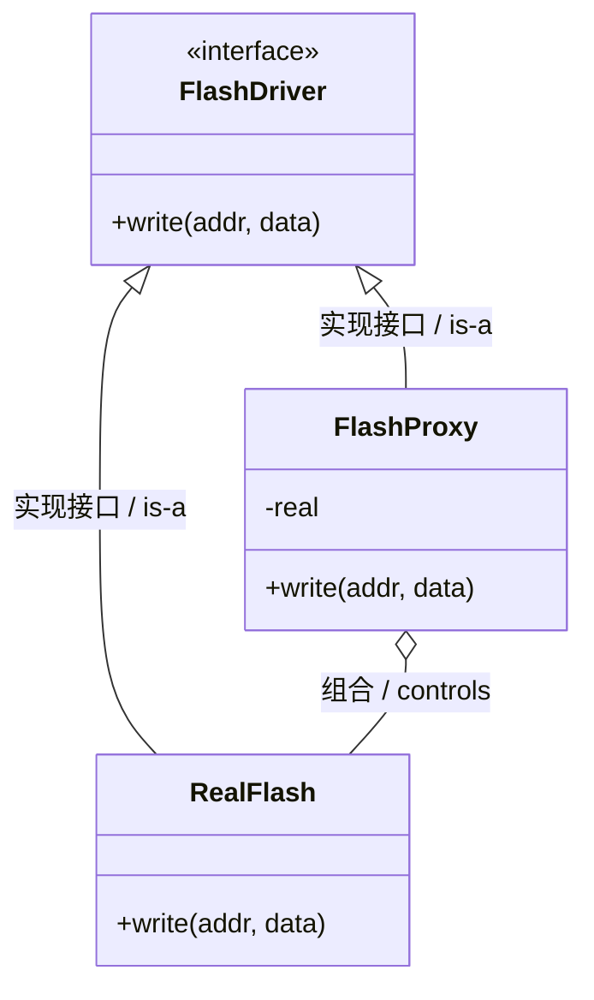

我们构建：

- FlashDriver（抽象接口）
- RealFlash（真实驱动）
- FlashProxy（权限控制代理）

1. 抽象接口

   ```c
   typedef struct FlashDriver FlashDriver;
   
   struct FlashDriver {
       int (*write)(FlashDriver *self,
                    unsigned int addr,
                    unsigned int data);
   };
   ```

2. 真实 Flash 驱动

   ```c
   #include <stdio.h>
   
   typedef struct {
       FlashDriver base;
   } RealFlash;
   
   static int real_write(FlashDriver *self,
                         unsigned int addr,
                         unsigned int data)
   {
       (void)self;
       printf("[REAL FLASH] Write 0x%X -> 0x%X\n", data, addr);
       return 0;
   }
   
   void RealFlash_Init(RealFlash *rf)
   {
       rf->base.write = real_write;
   }
   ```

3. 代理（访问控制核心）

   ```c
   typedef struct {
       FlashDriver base;     /* is-a */
       FlashDriver *real;    /* controls */
       int unlocked;
   } FlashProxy;
   ```

4. 写入逻辑（控制发生点）

   ```c
   static int proxy_write(FlashDriver *self,
                          unsigned int addr,
                          unsigned int data)
   {
       FlashProxy *proxy = (FlashProxy *)self;
   
       if (!proxy->unlocked)
       {
           printf("[PROXY] Flash locked! Reject.\n");
           return -1;
       }
   
       if (addr < 0x1000)  /* bootloader region */
       {
           printf("[PROXY] Protected region! Reject.\n");
           return -2;
       }
   
       return proxy->real->write(proxy->real, addr, data);
   }
   ```

5. 初始化

   ```c
   void FlashProxy_Init(FlashProxy *proxy,
                        FlashDriver *real)
   {
       proxy->real = real;
       proxy->unlocked = 0;
       proxy->base.write = proxy_write;
   }
   
   void FlashProxy_Unlock(FlashProxy *proxy)
   {
       proxy->unlocked = 1;
   }
   ```

6. 业务层

   ```c
   int main(void)
   {
       RealFlash real;
       FlashProxy proxy;
   
       RealFlash_Init(&real);
       FlashProxy_Init(&proxy, (FlashDriver *)&real);
   
       FlashDriver *flash = (FlashDriver *)&proxy;
   
       flash->write(flash, 0x0800, 0xAA);   /* 被拒绝 */
   
       FlashProxy_Unlock(&proxy);
   
       flash->write(flash, 0x0800, 0xBB);   /* 保护区拒绝 */
       flash->write(flash, 0x2000, 0xCC);   /* 允许 */
   
       return 0;
   }
   ```

7. 执行结果

   ```
   [PROXY] Flash locked! Reject.
   [PROXY] Protected region! Reject.
   [REAL FLASH] Write 0xCC -> 0x2000
   ```

Proxy 和 Decorator 的本质区别（非常重要）

| 对比点           | Decorator | Proxy          |
| ---------------- | --------- | -------------- |
| 目的             | 增强功能  | 控制访问       |
| 是否可能拒绝调用 | ❌ 一般不  | ✅ 可以         |
| 是否改变行为顺序 | 可能      | 不改变核心行为 |
| 是否强调权限     | 否        | 是             |

一句话：

> Decorator 是“加功能”，Proxy 是“拦截控制”


# 模板方法（Template Method）

如果说：

- Strategy → **算法可替换**
- State → **状态驱动行为**
- Template Method → **流程固定，步骤可扩展**

那么它解决的问题是：

> **系统执行流程是固定的，但某些步骤允许不同实现。**

假设我们有一个**通信协议处理流程**：

```text
接收数据
   ↓
解析帧
   ↓
校验 CRC
   ↓
处理命令
   ↓
发送响应
```

这个流程：

- **顺序固定**
- **框架不允许被改**

但不同协议：

| 协议       | 解析方式 | CRC   | 命令处理 |
| ---------- | -------- | ----- | -------- |
| Modbus     | 不同     | CRC16 | 寄存器   |
| 自定义协议 | 不同     | CRC32 | 私有命令 |

所以：

> **流程固定，但步骤实现不同**

这就是 Template Method。


Template Method 的核心思想

> 在父类中定义 **算法骨架（流程）**，但把某些步骤留给子类实现。

关键特点：

- 流程不可变
- 步骤可重写
- 框架控制执行

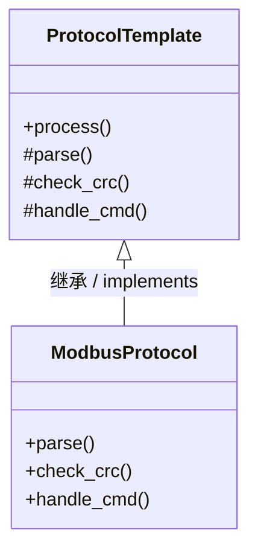

📌 核心：

```
process() = 模板方法
```

C 没有继承，但我们可以用：

```
结构体 + 函数指针
```

实现类似效果。

核心结构：

```c
typedef struct Protocol Protocol;

struct Protocol {
    void (*parse)(Protocol *);
    int  (*crc)(Protocol *);
    void (*handle)(Protocol *);
};
```

模板函数：

```c
Protocol_Process()
```

我们做一个：

- 协议模板
- Modbus 实现

2. 协议模板接口

   ```c
   #include <stdio.h>
   
   typedef struct Protocol Protocol;
   
   struct Protocol
   {
       void (*parse)(Protocol *self);
       int  (*check_crc)(Protocol *self);
       void (*handle_cmd)(Protocol *self);
   };
   ```

3. 模板方法（核心）

   ```c
   void Protocol_Process(Protocol *p)
   {
       printf("[FRAMEWORK] receive frame\n");
   
       p->parse(p);
   
       if (!p->check_crc(p))
       {
           printf("[FRAMEWORK] CRC error\n");
           return;
       }
   
       p->handle_cmd(p);
   
       printf("[FRAMEWORK] send response\n");
   }
   ```

   📌 这就是 **Template Method**，流程完全固定。

4.  Modbus 协议实现

   ```c
   typedef struct
   {
       Protocol base;
   } ModbusProtocol;
   ```

5. parse

   ```c
   static void modbus_parse(Protocol *self)
   {
       (void)self;
       printf("[MODBUS] parse frame\n");
   }
   ```

6. crc

   ```c
   static int modbus_crc(Protocol *self)
   {
       (void)self;
       printf("[MODBUS] check CRC16\n");
       return 1;
   }
   ```

7. handle

   ```c
   static void modbus_handle(Protocol *self)
   {
       (void)self;
       printf("[MODBUS] handle register command\n");
   }
   ```

8. 初始化

   ```c
   void Modbus_Init(ModbusProtocol *m)
   {
       m->base.parse = modbus_parse;
       m->base.check_crc = modbus_crc;
       m->base.handle_cmd = modbus_handle;
   }
   ```

9. 业务层调用

   ```c
   int main()
   {
       ModbusProtocol modbus;
   
       Modbus_Init(&modbus);
   
       Protocol_Process((Protocol *)&modbus);
   
       return 0;
   }
   ```

10. 执行结果

    ```
    [FRAMEWORK] receive frame
    [MODBUS] parse frame
    [MODBUS] check CRC16
    [MODBUS] handle register command
    [FRAMEWORK] send response
    ```

    关键观察：

    ```
    流程 = Framework 控制
    步骤 = 协议实现
    ```


Template Method vs Strategy（极易混淆），这是**设计模式里最容易混淆的一对**。

| 对比         | Template Method | Strategy   |
| ------------ | --------------- | ---------- |
| 控制流程     | 父类控制        | 客户端控制 |
| 变化点       | 算法步骤        | 整个算法   |
| 是否固定流程 | 是              | 否         |
| 常见用途     | 框架            | 算法选择   |

一句话理解：

```
Template = 固定流程
Strategy = 替换算法
```

嵌入式中 Template Method 的典型应用：

1. 协议栈框架

   ```
   receive
   parse
   check
   dispatch
   response
   ```

2.  Bootloader

   ```
   init
   verify image
   erase flash
   program flash
   jump
   ```

3. 设备驱动框架

   ```
   init
   configure
   enable
   handle_irq
   shutdown
   ```

现在体系已经是：

```
Adapter        接口统一
Decorator      功能叠加
Proxy          访问控制
Facade         系统封装
Strategy       行为切换
State          状态驱动
Observer       事件通知
Command        异步请求
Template       框架流程
```

这其实已经是：

> **嵌入式系统架构的完整工具箱**


# 策略组合

## State + Observer

> 核心目标：
>
> **用 Observer 解耦“事件来源”** 
>
> **用 State 管理“协议行为与迁移”**

先说结论：

> **协议栈 = 状态机（State） + 事件分发（Observer）**

如果你在 C 代码里看到：

- 中断 / 驱动 → 通知协议
- 协议内部大量 `switch(state)`
- 多模块监听同一协议事件

那 99% **应该是 Observer + State，而不是单独某一个模式**。

---

首先看一下整体架构：

协议栈分三层

```
┌──────────────┐
│  Application │  ← Observer（订阅协议事件）
└──────▲───────┘
       │ notify
┌──────┴───────┐
│  Protocol    │  ← State（协议状态机）
└──────▲───────┘
       │ notify
┌──────┴───────┐
│  Driver / ISR│  ← Subject（事件源）
└──────────────┘
```

👉 **关键思想：**

- Driver **不知道协议内部状态**
- 协议 **不知道谁在用它**
- Application **不关心协议状态如何实现**

看一下整体的类图框架：

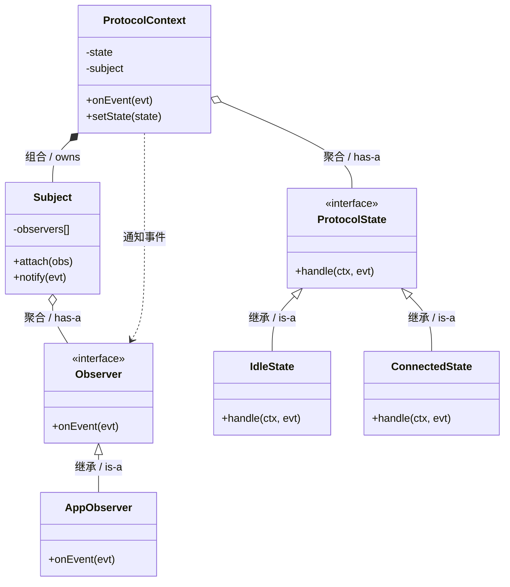

> 示例协议：
>
> `IDLE → CONNECTED`
>
> 驱动事件 → 协议状态机 → 应用通知

1. 公共事件定义（event.h）

   ```c
   #ifndef EVENT_H
   #define EVENT_H
   
   typedef enum {
       EVT_RX,
       EVT_CONNECTED
   } Event;
   
   #endif
   ```

2. Observer（observer.h）

   ```c
   #ifndef OBSERVER_H
   #define OBSERVER_H
   
   #include "event.h"
   
   typedef struct Observer Observer;
   
   struct Observer {
       void (*on_event)(Observer *self, Event evt);
   };
   
   #endif
   ```

3. Subject（subject.h / subject.c）

   ```c
   #ifndef SUBJECT_H
   #define SUBJECT_H
   
   #include "observer.h"
   
   #define MAX_OBS 4
   
   typedef struct {
       Observer *list[MAX_OBS];
       int count;
   } Subject;
   
   void Subject_Init(Subject *s);
   void Subject_Attach(Subject *s, Observer *o);
   void Subject_Notify(Subject *s, Event evt);
   
   #endif
   #include "subject.h"
   
   void Subject_Init(Subject *s)
   {
       s->count = 0;
   }
   
   void Subject_Attach(Subject *s, Observer *o)
   {
       s->list[s->count++] = o;
   }
   
   void Subject_Notify(Subject *s, Event evt)
   {
       for (int i = 0; i < s->count; i++) {
           s->list[i]->on_event(s->list[i], evt);
       }
   }
   ```

4. State 抽象（state.h）

   ```c
   #ifndef STATE_H
   #define STATE_H
   
   #include "event.h"
   
   typedef struct ProtocolContext ProtocolContext;
   
   typedef struct {
       void (*handle)(ProtocolContext *ctx, Event evt);
   } ProtocolState;
   
   #endif
   ```

5. Protocol Context（context.h / context.c）

   ```c
   #ifndef CONTEXT_H
   #define CONTEXT_H
   
   #include "state.h"
   #include "subject.h"
   
   struct ProtocolContext {
       ProtocolState *state;
       Subject subject;   /* 对上层的事件发布者 */
   };
   
   void Protocol_Init(ProtocolContext *ctx, ProtocolState *init);
   void Protocol_OnEvent(ProtocolContext *ctx, Event evt);
   void Protocol_SetState(ProtocolContext *ctx, ProtocolState *state);
   
   #endif
   #include "context.h"
   
   void Protocol_Init(ProtocolContext *ctx, ProtocolState *init)
   {
       ctx->state = init;
       Subject_Init(&ctx->subject);
   }
   
   void Protocol_SetState(ProtocolContext *ctx, ProtocolState *state)
   {
       ctx->state = state;
   }
   
   void Protocol_OnEvent(ProtocolContext *ctx, Event evt)
   {
       ctx->state->handle(ctx, evt);
   }
   ```

6. 具体状态

   1. idle_state.c

      ```c
      #include <stdio.h>
      #include "context.h"
      
      ProtocolState *ConnectedState_Instance(void);
      
      static void idle_handle(ProtocolContext *ctx, Event evt)
      {
          if (evt == EVT_RX) {
              printf("IDLE -> CONNECTED\n");
              Protocol_SetState(ctx, ConnectedState_Instance());
              Subject_Notify(&ctx->subject, EVT_CONNECTED);
          }
      }
      
      static ProtocolState s_idle = { idle_handle };
      
      ProtocolState *IdleState_Instance(void)
      {
          return &s_idle;
      }
      ```

   2. connected_state.c

      ```c
      #include <stdio.h>
      #include "context.h"
      
      static void connected_handle(ProtocolContext *ctx, Event evt)
      {
          (void)ctx;
          printf("CONNECTED: evt=%d\n", evt);
      }
      
      static ProtocolState s_connected = { connected_handle };
      
      ProtocolState *ConnectedState_Instance(void)
      {
          return &s_connected;
      }
      ```

7.  应用层 Observer

   ```c
   #include <stdio.h>
   #include "observer.h"
   
   static void app_on_event(Observer *self, Event evt)
   {
       (void)self;
       if (evt == EVT_CONNECTED) {
           printf("[APP] protocol connected\n");
       }
   }
   
   static Observer s_app = { app_on_event };
   
   Observer *AppObserver_Instance(void)
   {
       return &s_app;
   }
   ```

8. main.c（驱动 / ISR 模拟）

   ```c
   #include "context.h"
   
   /* 实例 */
   ProtocolState *IdleState_Instance(void);
   Observer *AppObserver_Instance(void);
   
   int main(void)
   {
       ProtocolContext proto;
   
       Protocol_Init(&proto, IdleState_Instance());
       Subject_Attach(&proto.subject, AppObserver_Instance());
   
       /* 模拟驱动 RX 中断 */
       Protocol_OnEvent(&proto, EVT_RX);
   
       return 0;
   }
   ```

   📌 **输出：**

   ```
   IDLE -> CONNECTED
   [APP] protocol connected
   ```

   


