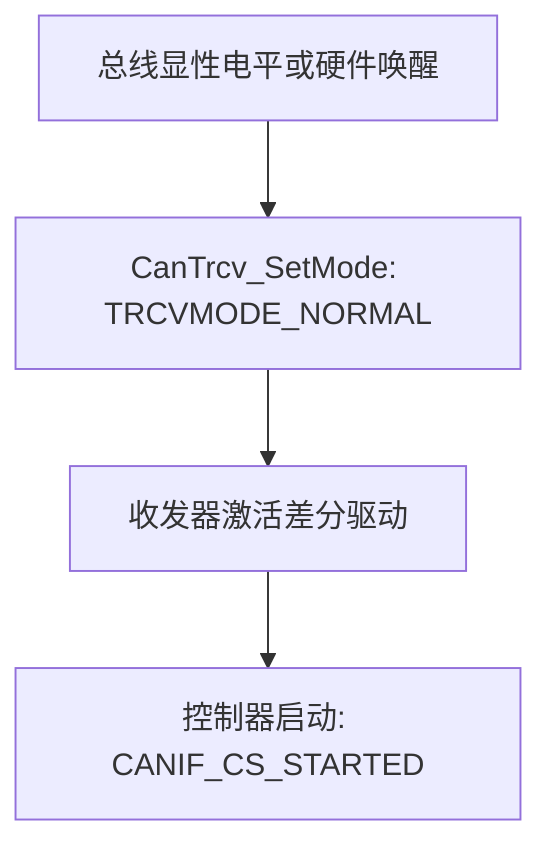
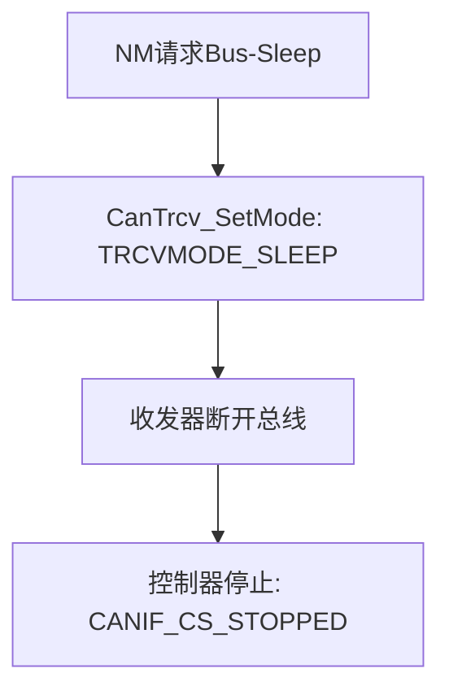

# 概述

> [!tip] 
>
> 标准文件参见[AUTOSAR_SWS_CANInterface.pdf](https://www.autosar.org/fileadmin/standards/R20-11/CP/AUTOSAR_SWS_CANInterface.pdf)

下图展示了Can模块所处的位置：


在MCAL层，看到了不仅仅有CanDriver， 还有SPI和I/O Driver，其中SPI针对的是那些需要外挂CAN controller的应用，除了外部CAN controller芯片需要IO来进行输入输出，有些特殊的CAN Tranceiver也需要IO来进行输入输出，比如经典的TJA1043，就有一个EN引脚和STB引脚，所以就需要IO Driver来控制。

CanIf模块位于MCAL层（CAN Driver）和上层通信服务层（如 CAN Network Management, CAN Transport Protocol 等）的中间，其充当 CAN Driver 和上层通信服务层的接口层。所以它位于BSW层中的ECU抽象层，为了让上层软件与ECU硬件设计无关。

CAN Interface 模块主要功能如下：

1. 初始化
2. 发送请求服务
3. 发送确认服务
4. 接收指示服务
5. Controller 模式控制服务
6. PDU channel mode 控制服务

CANIF可能应用在以下情景：

1. 中断模式 CanDrv 处理由 CAN 控制器触发的中断。CanIf 是基于事件的，当事件发生时会被通知。在这种情况下，相关的 CanIf 服务在 CanDrv 对应的 ISR 中被调用。
2. 轮询模式 CanDrv 由 SchM 触发并执行后续过程（轮换模式）。在这种情况下，必须在规定的时间区间内定期调用 Can_MainFunction_<写/读/总线关闭/唤醒/收发器>（）。CanDrv 会通知 CanDrv 在某个 CAN 控制器中发生的事件（接收、传输、总线关闭、超时），与中断驱动作同样有效。CanDrv 负责更新属于 CAN 控制器中事件的对应信息，例如接收 L-PDU。
3. 混合模式：中断驱动和轮询驱动的 CanDrv 功能可根据所用 CAN 控制器分为中断驱动和轮询驱动作模式。

与别的模块的关联性如下：


# 物理信道

一个物理信道通过一个 CAN 控制器和一个 CAN 收发器连接，而一个或多个物理信道可以连接到单一网络。CanIf 提供控制所有 CAN 设备（如 CAN 控制器和所有支持 ECU 通道的 CAN 收发器）的服务。这些 API 被 CanSm 用于向 ComM提供网络视图，用于对所有连接到单一网络的物理通道执行唤醒和睡眠请求。CanIf 分别将 CanDrv 和 CanTrcv 提供的状态信息传递给每个物理通道，作为 CanSm 的状态信息。

CanIf 将提供一个控制器Id，该 Id 从不同 CanDrv 实例的不同控制器中抽象出来。CanIf 内 ControllerId 的范围应以“0”开头。它应可通过 CanIfCtrlId.c（）进行配置。

| Canlf          | CanDrv A     | CanDrv B     |
| -------------- | ------------ | ------------ |
| Controllerld 0 | Controller 0 |              |
| Controllerld 1 | Controller 1 |              |
| Controllerld 2 |              | Controller 0 |

CanIf 将提供一个收发器 Id，从不同 CanTrcv 实例的不同收发器中抽象出来。CanIF 内收发器的范围应以“0”开头。它应可通过 CanIfTrcvId.c（） 进行配置。

| Canlf           | CanDrv A      | CanDrv B      |
| --------------- | ------------- | ------------- |
| TransceiverId 0 | Transceiver 0 |               |
| TransceiverId 1 | Transceiver 1 |               |
| TransceiverId 2 |               | Transceiver 0 |

在通知过程中，CanIf 会将原始 CAN 控制器或 CAN 收发器参数从驱动模块映射到 CanSm。这种映射是在引用的 CAN 控制器或 CAN 收发器参数被用抽象的 CanIf 参数 ControllerId 或 TransceiverId 配置时完成的。


CanIf 支持多个物理 CAN 通道。这些必须通过网络控制的 CanSm 进行区分。CanIf API 为多个底层物理 CAN 通道提供请求和读取控制。
此外，CanIf 不区分专用类型的 CAN 物理层（即低速 CAN 或高速 CAN），不区分连接一个或多个 CAN 控制器的类型。


# 工作流

## 初始化

EcuM 调用 CanIf 的函数 CanIf_Init（），用于初始化整个 CanIf。在初始化过程中，所有全局变量和数据结构（包括标志和缓冲区）都会被初始化。EcuM 通过调用对应的初始化服务分别执行 CanDrvs 和 CanTrcvs 的初始化。

CanIf 期望 CAN 控制器在初始化过程完成后，保持在**开机重置后停止状态**。在此模式下，CanIf 和 CanDrv 既无法发送也无法接收 CAN L-PDU。
如果运行时需要重新初始化整个 CAN 模块，EcuM 应调用 CanSm，通过调用 CAN 接口模块的 API 服务 CanIf_SetControllerMode（）启动 CAN 控制器所需的状态转换。CanIf 将 CanSm 的调用映射到相应 CanDrv 的调用。

## 发送请求

CanIf 的传输请求函数 CanIf_Transmit（）是 CAN 网络上上层传输 L-PDU 的常用接口。上层通信层模块仅通过 CanIf 的服务发起传输，无法直接访问 CanDrv。如果 CanDrv 能够将 L-PDU 数据写入 CAN 硬件传输对象，则发送请求成功完成。上层模块使用 API 服务 CanIf_Transmit（） 来发起传输请求。

CanIf_Transmit函数将会进行以下操作：

1. 检查CanIf的初始化状态
2. 识别CanDrv(仅在使用多个CanDrv时)
3. 确定访问CAN硬件传输对象的HTH
4. 调用CanDry的 Can_Write(）函数

如果传输请求服务CanIf_Transmit()返回E_OK,则传输成功完成。

如果请求通过 PDU 信道模式传输 L-PDU，请求返回 CANIF_OFFLINE，CanIf 应向 DET 的 Det_ReportRuntimeError（）服务报告运行时错误代码 CANIF_E_STOPPED，CanIf_Transmit（）返回 E_NOT_OK

## 传输数据流

发射请求服务Canlf Transmit()基于L-PDU。访问L-SDU特定数据的参数如下：

- 发送L-PDU=>L-SDU ID
- 引用包含L-SDU相关数据的数据结构：指向L-SDU,指向元数据的指针和L-SDU长度。

对L-SDU数据结构的引用被用作多个Canlf API服务中的参数，例如Canlf Transmit()或回调服务<User_RxIndication>()。如果L-PDU配置为触发传输，则L-SDU指针为空指针。


CanIf 存储了为传输目的配置的可用硬件对象的信息。函数 CanIf_Transmit（） 将 CanTxPduId 映射到对应的 HTH，并调用函数 Can_Write（）。

如果总线镜像已全局启用（参见 CanIfBusMirroringSupport），并且通过调用 CanIf_EnableBusMirroring 激活 CAN 控制器，CanIf 应在传输前存储每个帧的内容
注意：帧内容应仅在实际发送时提供给总线镜像模块。因此，内容必须存储，以便能够从 CanIf_TxConfirmation（）内部提供给总线镜像模块。

## 传输缓冲

### 发送缓冲区

首先介绍一个叫做（**HOH**）Hardware Object handles的这个概念，这个其实在MCAL层出现的较多，对MCAL的上层软件来说，HOH其实就是一个CAN报文的消息缓冲区，该结构包含与 CAN 相关的参数，如 CanId、DLC 和数据。基于 CAN 硬件缓冲区抽象，每个硬件对象在 CanIf 中被引用，独立于 CAN 硬件缓冲区布局。上层软件想发送报文的时候，就把报文往里面塞就好了，MCAL会负责发送出去，同理，接收报文就是从缓冲区里读取。但是在MCAL层，这个HOH的实现就五花八门了，这里就不多解释了。后文出现的HTH意思就是用来发送的HOH，而HRH意思就是用来接收的HOH。HOH 作为 CanDrv 接口服务调用中的参数，由 CanDrv 配置提供，CanDrv 用作 CAN 邮箱通信缓冲区的标识符。

CanIf 仅作为硬件对象句柄的用户，但不会基于硬件特定信息来解释。因此，CanIf 始终独立于硬件。

1. CanIf 应避免直接访问硬件特定的通信缓冲区，仅通过 CanDrv 接口服务访问。CanIf 与硬件保持独立，因为 CanDrv 接口调用时带有 HOH 参数，这些参数抽象了具体的 CAN 硬件缓冲区属性。
2. 每个 CAN 控制器可以在 CAN 邮箱中提供多个 CAN 传输硬件对象。这些可以逻辑上通过HTH寻址动态的连接到一个完整的硬件对象池（复用硬件对象）
   1. 多个物理硬件对象（如CAN控制器提供的多个发送邮箱）可以被**逻辑映射到一个统一的资源池**中。
   2. 通过这种复用机制，**一个HTH可以动态关联到池中的任意空闲硬件对象**，而非固定绑定到某个物理邮箱。
3. CanIf 将使用两种类型的 HOH 以实现对 CanDrv 的访问

HRH应该可以收到：

1. BasicCAN：一组CanId和在一个区域或一个范围内的CANID
2. FullCan：单个CanId
3. 所有的Canid

这里不妨衍生一下，这两个的定义其实起源颇深，大家可参考文章：[《Full-CAN vs. Basic-CAN》](https://zhuanlan.zhihu.com/p/484354161)。


当 CANIF_PUBLIC_TX_BUFFERING 配置为 ON 的时候， CanIf 会为 Basic 类型（多个 PDU 共享一个 HTH）的 PDU 分配发送缓冲区。
  当 CanIf 调用 Can_Write 返回 CAN_BUSY 的时候，说明当前的 HTH 正在发送上一帧数据，不能写入新的数据。此时， CanIf 将会把新的数据储存在 CanIf 的缓冲区。在 Can 的发送确认中，针对刚刚发送成功的 HTH（此时已经处于空闲状态，可以写入新的数据）， CanIf 将查询分配给该 HTH 的 PDU，是否有数据在缓冲区中，如果有的话， CanIf 将自动把缓冲区中的数据写入 HTH，并发送出去。CanIf 发送缓冲区具有如下特性：

1. Full 类型的 PDU 不会分配缓冲区；
2. 每个 Basic 类型的 PDU 有且只有一级缓存，因此，新的数据覆盖旧的数据；
3. 当 CANIF_PUBLIC_TX_BUFFERING 配置为 OFF 时，所有的 PDU 都没有发送缓冲区；
4. 如果同一 HTH 的缓冲区中有多个 PDU，将按照 PDU 的优先级（CANID 从小到大的顺序）进行发送。

### 一般行为

在 CanIf 的范围内，传输过程从调用 CanIf_Transmit（）开始，最终以调用上层模块的回调服务（）结束。在传输过程中，CanIf、CanDrv 和 CAN 邮箱应将 L-PDU 存储一次，只在一个位置发送一次。根据发射方式的不同，这些包括：

1. CAN 硬件传输对象
2. CanIf 内的发射 L-PDU 缓冲区（如果启用了传输缓冲，CanIf 会将 Tx L-PDU 存储在 CanIf 传输 L-PDU 缓冲区（CanIfBufferCfg）中，前提是 CanDrv 在发送请求时拒绝该缓冲。）

> [!note]  
>
> 对于触发传输，CanIf 只需存储给定 L-PDU 的发送请求，而无需存储其数据。当 HTH 再次空闲时，通过触发传输功能及时获取数据。单个 Tx L-PDU 若被请求传输，绝不能存储两次。这种行为对应于 CAN 网络上通常的周期性通信方式。

基本上，CanIf 中用于缓冲 Tx L-PDU 的整体缓冲区由一个或多个 CanIfBufferCfg 组成。而每个 CanIfBufferCfg 分配给一个或多个专用 CanIfBufferHthRef，并可配置为缓冲一个或多个 Tx L-PDU。但如上所述，每个 Tx L-PDU 只能缓冲一个实例，包含 CanIfBufferCfg 的总量。

在 L-PDU 传输过程中，CanIf 的行为会根据对应发送L-PDU 的配置设置是否启用传输缓冲而有所不同：

- 如果传输缓冲被禁用且发送请求失败（CAN 控制器邮箱正在使用 BasicCAN），L-PDU 不会被复制到 CAN 控制器邮箱，CanIf_Transmit（）返回值 E_NOT_OK。
- 如果启用了传输缓冲且发送请求失败，根据 CanIfTxBuffer 配置，L-PDU 可以存储在 CanIfTxBuffer 中。在这种情况下，CanIf_Transmit（）返回了值 E_OK，尽管无法执行传输。在这种情况下，CanIf 通过 CanIf_TxConfirmation（）回调处理 L-PDU 的未完成传输，上层无需重试发送请求。

在配置 **CanIf** 模块时，你为发送 L-PDU（即应用层想要通过 CAN 发送的数据包）分配的**实际 RAM 缓冲区数量**，**可以完全独立于**你在 CAN 网络描述文件（如 `.dbc` 文件）中为该 ECU 定义的**要发送的 L-PDU 数量**。假设你的 ECU 可能在网络描述文件中定义了 10 个不同的 Tx L-PDU，但你可能只需要配置 5 个 CanIf Tx L-PDU 缓冲区，因为这些 L-PDU 可以共用硬件发送对象 (HTH)，或者有些 L-PDU 不需要 CanIf 内部缓冲。

根据 AUTOSAR 规范，每个 Tx L-PDU（通过配置容器 `CanIfTxPduCfg` 定义）都需要通过一个 **`CanIfBufferCfg`** 配置容器来关联一个或多个 **HTH (Hardware Transmit Handle)**，HTH 是由 CAN Driver 提供的，代表 CAN 硬件上的发送邮箱或缓冲区。

当某个 Tx L-PDU **不需要** CanIf 模块内部提供 RAM 缓冲时（例如，这个 L-PDU 直接使用 CAN 硬件的发送邮箱，不需要在软件层排队或存储），`CanIfBufferCfg` 仍然是**必需的**。此时，需要将 `CanIfBufferCfg` 中的配置参数 **`CanIfBufferSize`** 设置为 **0**。当 `CanIfBufferSize` 设置为 0 时，`CanIfBufferCfg` 配置容器的作用就只剩下**引用**或**关联**该 L-PDU 将要使用的 **HTH**，它不再具备实际的软件缓冲功能。


### L-PDU的存储

配置的不同的传输方式也会进行不同的缓存处理：

1. 当 L-PDU 被配置为 **直接传输** (Direct Transmission) 模式时：

   - 如果缓冲功能已启用，并且 `Can_Write()` 返回 `CAN_BUSY`，CanIf 必须检查是否有可能将**整个**被请求传输的 **CanIf Tx L-PDU 数据** 缓冲到 `CanIfTxBuffer` 中。
   - 对于 **动态 (Dynamic)** Tx L-PDUs，**CanID (CAN 标识符)** 也必须与 L-PDU 数据一起存储在缓冲区中。
   - **数据长度不匹配的处理**：
     - 如果被拒绝的 L-PDU **数据长度**超过了配置的缓冲区大小 (`CanIfBufferSize`)，CanIf 必须：
       1. **只缓冲**配置允许的**数据量**，并**丢弃**其余部分。
       2. 向 **DET (Development Error Tracer)** 报告运行时错误码 **`CANIF_E_DATA_LENGTH_MISMATCH`**。

2. 当 L-PDU 被配置为 **触发传输** (Triggered Transmission) 模式时：

   - 如果缓冲功能已启用，并且 `Can_Write()` 返回 `CAN_BUSY`，CanIf 必须检查是否有可能将**发送请求 (Transmit Request)** 缓冲到 `CanIfTxBuffer` 中。

     > [!note]  
     >
     > 注：对于触发传输，通常缓冲的不是实际的数据，而是发送请求本身（即一个标志），实际数据会在后续由 PDU Router 或上层模块提供（例如在 `PduR_CanIfTriggerTransmit()` 被调用时）。

CanIf 只有在配置参数 **`CanIfPublicTxBuffering`** 启用时，才支持对 **BasicCAN** 传输进行 L-PDU 缓冲。

> [!note]  
>
> BasicCAN 通常指一个 L-PDU 可能使用多个不同的 HTH，且通常需要软件缓冲来处理排队。FullCAN L-PDU 通常不使用 CanIf 缓冲。

尝试发送过程如下：

1. 上层 (如 PduR) 调用 `CanIf_Transmit()`。
2. CanIf 尝试立即调用 `Can_Write()` 写入 CAN Driver。
   1. **结果 A (`CAN_OK`):** 发送成功，流程结束。
   2. **结果 B (`CAN_BUSY`):** 硬件繁忙（无 HTH 可用）。
      1. **CanIf 检查：**
         1. 如果 **`CanIfPublicTxBuffering` 禁用**：发送失败，向上传输结果。
         2. 如果 **`CanIfPublicTxBuffering` 启用**：将 L-PDU **数据**（直接传输）或 L-PDU **请求**（触发传输）存储到 CanIf 内部的 Tx L-PDU 缓冲区中。
      2. 当 CAN Driver 报告发送完成（通过 `CanIf_TxConfirmation()`）且有 HTH 释放时，CanIf 会将缓冲区中的 L-PDU 写入 CAN Driver。

## 发送确认

如果之前的传输请求成功完成，CanDrv 会通过调用 CanIf_TxConfirmation（）通知 CanIf。

如果总线镜像在全局启用，并且通过调用 CanIf_EnableBusMirroring（）激活 CAN 控制器，CanIf 应对该控制器上的每个帧传输通过 CanIf_TxConfirmation（）确认发送帧，调用 Mirror_ReportCanFrame（）服务，调用时，需要提供**存储的内容**和**实际的 CAN ID**）

> [!tip] 
>
> 总线镜像允许外部工具或模块监听 ECU 实际发送的 CAN 帧，常用于诊断和调试。

当 `CanIf_TxConfirmation()` 回调服务被调用时，CanIf 必须执行以下操作：

1. **识别**与成功传输的 L-PDU 链接的**上层通信层**（例如 PduR 或某个应用模块）。
2. 通过调用该上层模块的**发送确认服务**（返回值为 **`E_OK`**）来通知其传输已完成。

**上层回调：** 这个回调服务是由被通知的**上层模块实现**的。

**配置静态分配：** 一个 Transmit L-PDU 只能静态地分配给一个**单一**的发送确认回调服务。上层模块可以配置为对不同的 L-PDU 使用单个或多个回调服务。

如果配置启用了 **发送确认轮询支持** (`CanIfPublicTxConfirmPollingSupport`)。并且，对应的 CAN 控制器模式处于 **`CAN_CS_STARTED`** 状态。那么，CanIf 必须为每个 CAN 控制器**缓冲**接收到的 TxConfirmation **信息**。这允许 CanIf 在后续的 `CanIf_MainFunction()` 中，通过轮询的方式处理这些确认信息，而不是立即在中断上下文（如果 TxConfirmation 是在中断中触发的话）中处理。

## 接收数据流

根据 AUTOSAR 基础软件架构，接收到的数据将在上层通信栈（如 AUTOSAR COM、CanNm、CanTp、DCM）中进行评估和处理，这意味着，上层模块既不能使用 CanDrv (Rx) 的缓冲区，也不能访问 CanIf (Tx) 的缓冲区。

如果有新的 L-PDU 接收，CanDrv 会调用 CanIf 的 CanIf_RxIndication（）。对 L-PDU 指定数据的访问由以下参数决定：

- 硬件接收句柄（HRH）
- 接收 CAN 标识符（CanId）
- 接收数据长度
- 接收 L-PDU 的Reference

接收的 L-PDU 依赖硬件（字节和字节排序、访问类型），并分配给通信系统中最低层——CanDrv，其中**HRH (Hardware Receive Handle)** 充当了 **CanDrv** 和使用该 L-PDU 的**上层模块**之间的**链接**。

当 CanDrv 接收到一个 L-PDU 后，它会调用 **`CanIf_RxIndication()`** 来通知 CanIf 模块。

- CanIf **无法识别** CanDrv 是使用了**临时缓冲**还是**直接硬件访问**来获取数据。
- CanIf 期望在 `CanIf_RxIndication()` 的调用中接收到的 L-PDU 数据是**规范化 (normalized) 的**（即，CanDrv 必须处理硬件的字节序等依赖性，向 CanIf 提供统一格式的数据）。

硬件接收对象的锁定与释放：

- **锁定：** 在将数据**复制**到**临时缓冲区**或**上层模块缓冲区**的过程中，CAN 硬件接收对象是处于**锁定**状态的。
  - 这个锁定确保了数据在被复制完成之前不会被新的接收帧覆盖。
- **释放：** 为了避免数据丢失，在 CanIf 的 `CanIf_RxIndication()` 函数**返回**给 CanDrv 后，该硬件接收对象**必须立即被释放**。
  - *这保证了 CAN 硬件能够迅速准备好接收下一个传入的 CAN 帧。*

缓冲区访问：

- **共享缓冲区：** **CanDrv**、**CanIf** 以及属于该接收 L-PDU 的**上层模块**，都可能访问**同一个临时中间缓冲区**。
- **缓冲区位置：** 这个临时缓冲区可以位于：
  1. **CAN 控制器的 CAN 硬件接收对象**中。
  2. **CanDrv 的临时缓冲区**中。


## 接收指示

`CanIf_RxIndication()` 是 CAN Driver 用来通知 CanIf 模块接收到新 CAN 帧的回调函数。CanIf 接收到调用后，其主要任务是评估 L-PDU 的**接受性**并准备 **L-SDU** (上层数据)。

1. 总线镜像报告
   1. 如果全局启用了**总线镜像** (`CanIfBusMirroringSupport`) 且已为该控制器激活。
   2. CanIf 必须为该控制器上**每个**通过 `CanIf_RxIndication()` 指示的接收帧，调用 **`Mirror_ReportCanFrame()`** 进行报告。
2. 软件过滤 (Software Filtering)
   1. 一旦调用 `CanIf_RxIndication()`，CanIf 必须对接收到的 L-PDU 执行**软件过滤**（如果配置了，例如通过 `CanIfHrhRangeCfg`）。
   2. **如果软件过滤拒绝了**该 L-PDU，CanIf 必须**立即终止**该 `CanIf_RxIndication()` 的后续处理。
   3. *注：软件过滤主要用于 FullCAN 未能覆盖到的 BasicCAN 接收，或用于更复杂的过滤逻辑。*
3. 数据长度检查 (Data Length Check)
   1. 如果 L-PDU **通过**了软件过滤。
   2. CanIf 随后必须执行**数据长度检查**（如果配置了，通过 `CanIfPrivateDataLengthCheck` 和 `CanIfRxPduDataLengthCheck`）。
   3. *注：这确保接收到的数据长度不超过配置所允许的长度。*
4. 缓冲和数据复制
   1. 如果 L-PDU **通过**了数据长度检查。
   2. 并且该 L-PDU 配置了使用 **静态接收缓冲区**。
   3. CanIf 必须将接收到的 L-PDU 数据（L-SDU）**复制**到该静态接收缓冲区中，复制的字节数应等于配置的**数据长度**。
   4. 如果 L-SDU 配置了 **元数据 (MetaData)**。
   5. CanIf 必须将 L-PDU 的**有效载荷 (payload)** 复制到静态接收缓冲区，并将 **CAN ID** 复制到类型为 `CAN_ID_32` 的 **MetaDataItem** 中。
5. 通知上层模块 (Upper Layer Indication)
   1. 如果 L-PDU **通过**了数据长度检查。
   2. CanIf 必须检查是否配置了**目标上层模块**，以便调用其**接收指示服务**来处理接收到的 L-SDU（通过 `CanIfRxPduUserRxIndicationUL` 等参数配置）。
   3. 如果配置了要调用目标上层模块，CanIf 必须调用这个配置好的**接收指示回调服务** (`CanIfRxPduUserRxIndicationName`)。
   4. CanIf 将基于 `CanIf_RxIndication()` 的参数，提供上层通知回调函数所需的参数。
   5. *注：一个接收 L-PDU 只能分配给**一个单一**的接收指示回调服务。*

### 读取接收数据

**通过同步 API `CanIf_ReadRxPduData()` 读取数据**。这提供了一种与异步接收指示 (Rx_Indication) 不同的数据获取方式。

1. API 的作用和接口

   1. **作用：** `CanIf_ReadRxPduData()` 是 CanIf 模块提供给上层模块（如 PduR 或应用层）用来**读取**最近从 CAN 网络接收到的 **CAN L-SDU** 的通用接口。
   2. **访问方式：** 上层模块通过 CanIf 的服务（即这个 API）发起接收请求，**不直接访问 CanDrv**。
   3. **完成标志：** 当 CanIf 将接收到的 L-SDU **写入**上层模块提供的 I-PDU 缓冲区时，接收请求成功完成。

2. 独立于接收事件

   1. **配置启用：** 如果配置参数 **`CanIfPublicReadRxPduDataApi`** 启用，则可以使用此 API 读取数据。
   2. **异步解耦：** 这种读取方式使得数据读取**不依赖于接收事件的发生（即 `RxIndication`）**。
   3. **灵活配置：** 当此 API 启用时，**不必**同时为同一个 L-SDU 配置**接收指示服务** (`CanIfRxPduUserRxIndicationUL`)。当然，如果需要，两者也可以同时启用。

3. 缓冲机制的要求

   1. 如果配置参数 **`CanIfPublicReadRxPduDataApi`** 设置为 `TRUE`。
   2. 并且某个特定的 L-SDU 配置参数 **`CanIfRxPduReadData`** 设置为 `TRUE`。
   3. 那么，CanIf **必须**为该接收 L-SDU **分配**并使用一个**接收 L-SDU 缓冲区**来存储接收到的数据。
   4. 在 `CanIf_RxIndication()` 调用过程中，如果 L-PDU **通过**了软件过滤和数据长度检查，CanIf 必须将接收到的 L-SDU **存储**到这个接收 L-SDU 缓冲区中。
   5. **互斥访问：** 在调用 `CanIf_ReadRxPduData()` 期间（即上层正在读取数据时），CanIf **必须避免**可能抢占访问该接收 L-SDU 缓冲区的事件（例如，新的 `CanIf_RxIndication` 或其他并行访问），以确保数据的一致性。

4. 接收机制的选择

   1. 通过配置参数 **`CanIfRxPduUserRxIndicationUL`**（用于**异步通知**）和 **`CanIfRxPduReadData`**（用于**同步读取**），上层模块可以根据自己的需求，在配置时选择适合的接收 L-SDU 机制：

      | **机制**     | **异步通知 (Rx Indication Callback)**     | **同步读取 (ReadRxPduData API)**             |
      | ------------ | ----------------------------------------- | -------------------------------------------- |
      | **触发方式** | 数据**到达**时，CanIf 主动调用上层回调。  | 上层模块**需要**数据时，主动调用 CanIf API。 |
      | **配置参数** | `CanIfRxPduUserRxIndicationUL`            | `CanIfRxPduReadData`                         |
      | **数据缓冲** | 可选，通常不强制要求 CanIf 内部静态缓冲。 | **强制**要求 CanIf 内部静态缓冲              |


## 通知状态轮询

AUTOSAR CanIf 模块提供的另一种状态获取机制：**通知状态轮询 (Notification Status Polling)**。除了通过回调函数（Callback）被动接收通知外，上层模块还可以主动调用 API 来查询某个 PDU 是否已经成功发送或接收。

1. CanIf 提供了两个专门用于查询状态的 API，实现了“**读并清除 (Read-and-Consume)**”的机制：

   1. **`CanIf_ReadTxNotifStatus()`**: 用于查询某个 **发送 (Tx) L-PDU** 的发送确认状态。
   2. **`CanIf_ReadRxNotifStatus()`**: 用于查询某个 **接收 (Rx) L-PDU** 的接收指示状态。

2. 配置与启用

   1. 这两个 API 的功能可以通过配置参数在**全局**或**单个 PDU** 级别进行开启或关闭：

      | **级别**        | **发送 (Tx) 配置参数**                | **接收 (Rx) 配置参数**                |
      | --------------- | ------------------------------------- | ------------------------------------- |
      | **全局开关**    | `CanIfPublicReadTxPduNotifyStatusApi` | `CanIfPublicReadRxPduNotifyStatusApi` |
      | **单 PDU 开关** | `CanIfTxPduReadNotifyStatus`          | `CanIfRxPduReadNotifyStatus`          |

   2. 只有当全局开关设为 `TRUE` 时，CanIf 才会为每个 L-PDU 维护（存储）这个内部状态位。

3. “读并清除”机制 (Read-and-Consume)

   1. **逻辑含义**：当上层模块调用这些 API 读取状态后，CanIf 会**自动将该状态重置**（通常重置为 `CANIF_NO_NOTIFICATION`）。
   2. **设计目的**：确保上层模块获取到的“成功”状态，代表的是**自上次调用该服务以来**，至少发生过一次新的成功发送或接收事件。
   3. **状态返回值**：
      - `CANIF_TX_RX_NOTIFICATION`: 自上次清除以来已发生事件。
      - `CANIF_NO_NOTIFICATION`: 自上次清除以来未发生新事件。

> [!note] 
>
> 在 AUTOSAR 架构中，并不是所有上层模块都适合用“回调/中断”模式工作。以下场景通常会用到这些 API：
>
> 1. **非事件驱动型任务**：某些应用层任务（SWC）运行在固定的周期循环中，它们更倾向于在每个周期开始时“轮询”一下数据是否更新，而不是被中断随机打断。
> 2. **降低中断负载**：如果通信频率极高，频繁的回调会占用大量 CPU 资源。通过轮询状态，可以将处理逻辑集中在低优先级的周期性任务中。
> 3. **双重确认**：在某些安全关键应用中，除了等待回调，还可以通过该 API 进行状态的二次校验。

当相关配置参数使能后， CanIf 提供了接口，可通过这些接口查询 CanIf PDU 的的状态和数据，这包括：

1. CanIf_ReadRxNotifStatus 查询某个 PDU 是否接收到；
2. CanIf_ReadTxNotifStatus 查询某个 PDU 是否发送成功；
3. CanIf_ReadRxPduData，读取某个 PDU 的接收数据；
4. CanIf_GetTxConfirmationState，获取是否有报文发送成功，主要用于 Busoff 恢复。

# DLC检查

当 CanIf 从 Can Drviver接收到一帧报文，可以对报文的 DLC 进行检查，如果 DLC 不合法，可以报错，并进行相应的处理。DLC 检查的方法有两种：

1. AUTOSAR 标准算法：当实际接收到的 DLC 小于配置的 DLC 时，认为 DLC 不合法；
2. 用户自定义算法：用户需要完成 CanIf_DlcCheckCallout 函数，自行进行检查。

若 DLC 检查失败，等同于该报文没有接收到，不会调用上层的接收指示回调函数。

# 控制器模式

## 通用功能

**CanIf** 在控制 **CAN 控制器模式（Controller Mode）** 时的角色的核心思想是：**CanIf 是“执行者”，而 CanSm（CAN State Manager）是“决策者”**。

1. CanIf 的角色：执行与透传
   1. **核心职责**：CanIf 提供了一组 API（如 `CanIf_SetControllerMode()`），允许上层模块请求改变 CAN 控制器的状态（如：START, STOP, SLEEP）。
   2. **不做校验**：**CanIf 不负责判断模式切换是否合法**。它只是简单地把请求通过 `CanDrv` 的接口转发给硬件。
   3. **状态存储**：CanIf 会存储控制器的当前状态，并执行转换。为了优化性能，它会记录由 `CanIf_ControllerModeIndication()` 上报的最新状态，以避免频繁调用底层驱动获取信息。
2. CanSm 的角色：网络级决策
   1. **全局管理**：**CanSm** 负责管理整个 CAN 网络（Network）的一致性。例如，当一个网络需要进入睡眠时，CanSm 会依次命令该网络下的所有控制器进入睡眠。
   2. **状态机实现**：复杂的网络状态机逻辑（如 Bus-Off 恢复流程、网络激活/去激活）是在 CanSm 中实现的，而不是在 CanIf 中。
3. 模式切换流程
   1. **全局管理**：**CanSm** 负责管理整个 CAN 网络（Network）的一致性。例如，当一个网络需要进入睡眠时，CanSm 会依次命令该网络下的所有控制器进入睡眠。
   2. **状态机实现**：复杂的网络状态机逻辑（如 Bus-Off 恢复流程、网络激活/去激活）是在 CanSm 中实现的，而不是在 CanIf 中。

> [!tip] 
>
> - **Bus-Off 处理**：虽然 `CanIf_SetControllerMode()` 是主动请求，但 `CanIf_ControllerBusOff()` 是由硬件检测到故障后被动触发的。
> - **多方请求**：规范提到“不仅只有 CanSm 能请求改变模式”。这意味着在某些特定配置下，其他模块（如 BswM）也可能直接介入控制。
> - **性能优化**：CanIf 内部缓存控制器状态是推荐的做法，这样在响应 `CanIf_GetControllerMode()` 时速度更快。

## 操作模式

当控制器进入 `CAN_CS_STOPPED` 状态时，当控制器被停止（例如为了节能或准备进入睡眠状态）时，CanIf 必须清理所有相关的中间状态：

1. **拒绝新的发送请求**：
   - 如果控制器处于 `STOPPED` 状态，任何调用 `CanIf_Transmit()` 的请求都会被拦截。
   - CanIf **不会**调用底层的 `Can_Write()`，而是直接返回 **`E_NOT_OK`**。
2. **清理缓冲区**：
   - 控制器一旦停止，CanIf 必须**清空（Clear）**分配给该控制器的所有 Tx 缓冲区（Tx Buffers）。这防止了陈旧的数据在控制器重启后被意外发送。
3. **通知上层失败**：
   - 对于所有已经在缓冲区中或正在等待确认（Outstanding）的发送 PDU，CanIf 必须通过调用上层的 **`TxConfirmation(id, E_NOT_OK)`** 告知发送失败。
   - **原则**：这保证了对于每一个 `CanIf_Transmit` 请求，上层最终都会收到一个确定的反馈（要么成功，要么失败），不会出现“悬挂”状态。
   - 如果开启了轮询模式（Polling），相关的确认信息也要被清除。

状态通知与回调转发

CanIf 作为一个中间层，负责将底层的硬件状态回调转发给正确的决策模块（通常是 **CanSm**）：

- **Bus-Off 处理**：
  - 当硬件检测到 Bus-Off 并调用 `CanIf_ControllerBusOff()` 时，CanIf 必须立即通知 **CanSm**。CanSm 随后会启动恢复状态机。
- **模式切换确认 **：
  - 当底层驱动真正完成了模式切换（例如从 START 到 STOP）并调用 `CanIf_ControllerModeIndication()` 时，CanIf 将此信息转发给 **CanSm**。
- **收发器状态**：
  - 同理，CAN 收发器（Transceiver）的模式切换也会通过 CanIf 转发给 **CanSm**。

CAN controller 在硬件实现上的状态抽象为以下四种基本状态：

1. UNINIT
2. STOPPED
3. STARTED
4. SLEEP

对每个 CAN Controller，在 Can Interface 模块上有一个对应的“软件”状态机，其有以下几种状态：

1.  CANIF_CS_UNINIT
2.  CANIF_CS_STOPPED
3.  CANIF_CS_STARTED
4.  CANIF_CS_SLEEP

上层可以通过调用 CanIf_SetControllerMode()服务来改变 CAN Controller 的状态。下表展示了用户使用CanIf_SetControllerMode()时的状态转换:

| CanIf 当前模式   | 用户请求模式     | 传递给 Can 的模式 |
| ---------------- | ---------------- | ----------------- |
| X                | CANIF_CS_STARTED | CAN_T_START       |
| CANIF_CS_SLEEP   | CANIF_CS_STOPPED | CAN_T_WAKEUP      |
| CANIF_CS_STOPPED | CANIF_CS_STOPPED | CAN_T_STOP        |
| CANIF_CS_STARTED | CANIF_CS_STOPPED | CAN_T_STOP        |
| X                | CANIF_CS_SLEEP   | CAN_T_SLEEP       |

不合法的状态转换请求，例如 SLEEP 到 START， START 到 SLEEP，将在 Can 模块被检测到，并返回 E_NOT_OK。在转换阶段， Can Interface 模块中软件状态机的状态可能会与 CAN controller 中的硬件状态不一致。

调用 CanIf_SetControllerMode 进行模式切换，如果硬件的模式能够在较短的时间内完成，那么模式转换可以是同步的，也就是说，在 CanIf_SetControllerMode 返回之前，模式转换已经完成，并且通过 User_ControllerModeIndication 通知了上层。否则，模式转换是异步完成的，用户需周期调用 Can_MainFunction_Mode 来完成模式转换并通知上层。

在AUTOSAR架构中，**CAN控制器（CAN Controller）的模式**由通信接口层（CAN Interface, CANIf）管理。通过分层控制（控制器模式 + PDU模式），AUTOSAR实现了灵活且低功耗的CAN通信管理。CAN控制器模式如下：

1. 启动模式（ `CANIF_CS_STARTED`）
   - 功能：
     - 控制器**完全激活**，可正常**收发CAN帧**（包括数据帧、远程帧、错误帧等）。
     - 参与总线仲裁、错误检测与恢复（如自动重传）。
   - 触发条件：
     - 网络管理（NM）请求通信，或上层模块（如ComM）授权通信。
2. 停止模式（`CANIF_CS_STOPPED`）
   - 功能：
     - 控制器**停止所有通信活动**，关闭内部时钟以降低功耗。
     - 仍可响应硬件唤醒事件（如总线显性电平）。
   - 触发条件：
     - 网络管理（NM）进入总线睡眠模式（Bus-Sleep），或ComM拒绝通信请求。
3. 睡眠模式 (`CANIF_CS_SLEEP`)
   - 功能：
     - 控制器进入**深度低功耗状态**，仅保留基础唤醒功能。
     - 需软件唤醒（调用`CanIf_ControllerWakeup()`）才能恢复通信。
   - 触发条件：
     - 明确请求低功耗（如整车电源管理指令）。

---

PDU模式与控制器模式协同工作，独立控制发送/接收行为：

| **模式**           | 发送（TX） | 接收（RX） | 说明                       |
| ------------------ | ---------- | ---------- | -------------------------- |
| `CANIF_ONLINE`     | ✅          | ✅          | 完全通信（默认模式）       |
| `CANIF_TX_OFFLINE` | ❌          | ✅          | 静默模式（仅接收）         |
| `CANIF_OFFLINE`    | ❌          | ❌          | 无通信（控制器停止或睡眠） |

---

控制器模式与其他模块的关系为：

1. 与收发器的联动：
   - 控制器进入`CANIF_CS_STOPPED`时，收发器通常切换至`TRCVMODE_STANDBY`（待机）。
   - 控制器唤醒后，收发器需先恢复`TRCVMODE_NORMAL`，再启动控制器。
2. 与网络管理（NM）的协同：
   - NM通过`CanIf_ControllerMode`控制总线参与权（如休眠时强制`CANIF_CS_STOPPED`）。
3. 与ComM的交互：
   - ComM决定通信权限，通过`CanIf_SetControllerMode`配置控制器状态。

---

状态切换示例：

1. 唤醒流程：

   ```mermaid
   graph LR
   A[总线显性电平] --> B[收发器唤醒]
   B --> C[CanIf_ControllerWakeup]
   C --> D[控制器: CANIF_CS_STARTED]
   D --> E[PDU模式: CANIF_ONLINE]
   ```

2. 休眠流程：

   ```mermaid
   graph LR
   A[NM请求休眠] --> B[ComM释放通信]
   B --> C[CanIf_SetControllerMode: CANIF_CS_STOPPED]
   C --> D[收发器待机]
   ```

---

关键差异总结：

| **模式**           | 通信能力 | 功耗 | 唤醒方式      | 适用场景 |
| ------------------ | -------- | ---- | ------------- | -------- |
| `CANIF_CS_STARTED` | 全双工   | 高   | 始终活跃      | 正常运行 |
| `CANIF_CS_STOPPED` | 无       | 中   | 硬件/总线唤醒 | 短时休眠 |
| `CANIF_CS_SLEEP`   | 无       | 极低 | 软件指令唤醒  | 深度休眠 |

## 模式转换

在 AUTOSAR 中，改变 CAN 控制器的状态并不是“即时”完成的，而是一个请求与响应的过程。

1. **异步流程**：
   - **请求阶段**：上层模块调用 `CanIf_SetControllerMode(CAN_CS_SLEEP)`。此时 CanIf 只是将指令下发给 CanDrv，API 随即返回。
   - **执行阶段**：CAN 控制器硬件在完成当前的通信任务后，才开始物理切换。
   - **通知阶段**：一旦硬件完成切换，CanDrv 调用回调函数 `CanIf_ControllerModeIndication()`。随后，CanIf 会将此通知转发给 `CanSm`。
2. **特殊情况（快速切换）**：
   - 如果硬件响应极快，`CanIf_ControllerModeIndication()` 可能会在 `CanIf_SetControllerMode()` 还没执行完时就被触发（嵌套调用）。这是实现相关的。
3. **失败处理**：
   - CanIf 本身不监控“模式转换是否超时”。如果转换失败或没有响应，必须由**上层模块**（如 CanSm）通过超时机制来跟踪处理。

> [!tip] 
>
> 🛌 睡眠与唤醒机制 (Wake-up):CAN 控制器的硬件差异（是否支持 Sleep/Wake-up）被 `CanDrv` 屏蔽了，CanIf 只需要处理标准化的模式。

**内部唤醒 vs 外部唤醒**

CanIf 严格区分了两类唤醒请求：

| **特性**     | **内部唤醒 (Internal Request)**                     | **外部/网络唤醒 (External Request)**   |
| ------------ | --------------------------------------------------- | -------------------------------------- |
| **触发源**   | 软件逻辑（ECU 主动想通信）                          | 外部总线活动（其他节点发出的帧）       |
| **触发方式** | 调用 `CanIf_SetControllerMode(..., CAN_CS_STARTED)` | 硬件检测到信号，由 CanDrv/CanTrcv 通知 |
| **处理性质** | 异步软件请求                                        | 硬件中断事件                           |

> **注意：** 在从 `STOPPED` 切换到 `SLEEP` 的敏感过程中，硬件可能会意外产生一个唤醒中断给集成代码（ECU Integration Code），这在开发底层驱动时需要特别注意。

**状态查询**：如果上层模块不想等待异步通知，可以随时调用 `CanIf_GetControllerMode()` 主动轮询。

**硬件解耦**：无论底层硬件如何实现，CanIf 看到的都是统一的 `START`、`STOP`、`SLEEP`。

**责任分担**：CanIf 负责“传话”和“记录”，CanSm 负责“决策”和“监控”。

## 唤醒

为了支持通过 CAN 网络唤醒 ECU（无论是通过 CAN 控制器还是收发器），硬件必须处于一种**“监听唤醒”**的状态。唤醒模式的硬件前提：

1. **必须进入休眠（Sleep Mode）**：
   - 唤醒监听通常是在 **Sleep Mode** 下实现的。
   - 在这个模式下，**正常的通信功能是关闭的**。这种“禁用通信”是确保 CAN 控制器能够完全停止（Stopped）的必要条件。
2. **唤醒中断的使能**：
   - 只有当控制器停止了正常的帧处理逻辑，硬件才能将资源切换到检测特定的总线活动（如 WUP - Wake-up Pattern）。
   - 此时，**唤醒中断（Wake-up Interrupt）** 才能被安全地使能。如果控制器还在正常发送/接收数据，硬件是无法区分普通信号和唤醒信号的。
3. **硬件独立性**：
   - 规范提到，无论唤醒信号是通过 **CAN 控制器** 直接检测，还是通过 **CAN 收发器 (Transceiver)** 检测，这种逻辑都适用。

🔄 唤醒流程图解

当 ECU 处于低功耗状态时，数据的流动和状态切换如下：

- **进入休眠**：CanSm 发起请求 $\rightarrow$ CanIf 转发 $\rightarrow$ CanDrv 将硬件设为休眠并开启中断。
- **监听状态**：此时总线上没有该节点的流量，耗电极低，但硬件电路仍在监控差分电压的变化。
- **外部触发**：总线上出现特定波形（如远程节点发送的网络管理帧）。
- **中断触发**：硬件产生唤醒中断 $\rightarrow$ 触发 ECU 的启动序列 $\rightarrow$ CanIf 收到通知并将模式切回 `CAN_CS_STARTED`。

这段话的核心技术意义在于：**通信的“停止”是唤醒“开启”的前提**。在设计 AUTOSAR 系统的休眠逻辑时，必须先通过 `CanIf_SetControllerMode` 确保控制器进入 `CAN_CS_SLEEP`，否则硬件层面的唤醒中断可能无法正确初始化。

**CanIf** 模块在 AUTOSAR 唤醒流程中扮演的“协调者”角色，特别是它如何响应 **ECU Manager (EcuM)** 的请求来验证物理硬件是否真的发生了唤醒。


### 唤醒检查

🛡️ CanIf 唤醒检查机制 (`CanIf_CheckWakeup`)：当 ECU 处于睡眠状态并检测到潜在的唤醒信号时，系统的处理逻辑遵循从上到下再到下的链式调用。

1. 触发源：集成代码与 EcuM
   1. **调用背景**：当硬件检测到总线活动，**EcuM**（通过集成代码）会启动唤醒验证流程。它会调用 `CanIf_CheckWakeup(WakeupSource)`。
   2. **参数意义**：`WakeupSource` 是一个位掩码，代表 EcuM 定义的唤醒源。CanIf 需要知道这个“源”对应的是哪些具体的 CAN 控制器或收发器。
2. 映射逻辑：寻找目标硬件
   1. **配置引用**：CanIf 通过配置（`CanIfCtrlCanCtrlRef`）建立起 **EcuM 唤醒源** 与 **CAN 控制器/收发器** 之间的映射关系。
   2. **精准定位**：当 EcuM 问“这个唤醒源有没有唤醒？”时，CanIf 查表得知该源涉及哪些驱动（CanDrv 或 CanTrcv）。
3. 执行验证：向下查询
   1. 这是核心动作。CanIf 不自己判断，而是去问底层：
      1. 问收发器驱动：`CanTrcv_CheckWakeup()`
      2. 问控制器驱动：`Can_CheckWakeup()`
   2. **目的**：底层驱动会读取硬件状态寄存器，确认是否真的发生了有效的总线唤醒波形（例如符合 ISO 11898-2 的唤醒序列）。
4. 判定规则 (返回值的逻辑)
   1. CanIf 汇总底层驱动的检查结果并反馈给 EcuM：
      - **只要有一个行，就行**：
        - 只要底层驱动中有一个返回 `E_OK`（确认有唤醒事件），`CanIf_CheckWakeup()` 就向 EcuM 返回 **`E_OK`**。
      - **必须全不行，才算不行**：
        - 只有当所有相关的底层驱动都返回 `E_NOT_OK` 时，`CanIf_CheckWakeup()` 才向 EcuM 返回 **`E_NOT_OK`**。

📝 总结：CanIf 在这里的职责

1. **分发者**：将 EcuM 抽象的 `WakeupSource` 翻译成具体的硬件对象。
2. **调用者**：统一调用不同厂商（Vendor）提供的 CAN 驱动 API。
3. **聚合者**：将多个驱动的状态合并成一个简单的成功或失败，供 EcuM 决策是否需要全面启动 ECU（即从低功耗状态切回正常运行状态）。

💡 为什么需要这个过程？

这个机制是为了**防止误唤醒（False Wakeups）**。

- 有时候总线上的电磁干扰（EMC）可能会触发一个虚假的唤醒中断。
- EcuM 通过 `CanIf_CheckWakeup` 强制要求驱动层去检查硬件内部的**唤醒标志位**。如果标志位没置位，ECU 会认为这是一个噪声，从而继续保持睡眠，节省功耗。

### 唤醒校验

**唤醒校验 (Wake-up Validation)**的存在是为了防止 ECU 被总线上的电磁干扰（噪声）误唤醒，从而浪费电量。

当 CAN 控制器检测到总线活动并触发唤醒中断后，ECU 此时仅处于“疑似唤醒”状态。为了确认这确实是一个有效的通信请求，而不是由于电线接触不良产生的火花，**EcuM (ECU Manager)** 需要看到一个**真实的 CAN 报文**。

1. 校验的前提：控制器必须“转起来”

   1. 控制器不能直接从 `SLEEP` 跳到 `STARTED`。
   2. **流程**：当硬件产生唤醒事件通知 EcuM 后，EcuM 会通过 `CanIf_SetControllerMode()` 将控制器设为 `STARTED` 状态。只有控制器开始工作，才能接收报文来进行校验。

2. 谁能通过校验？ (`CanIf_RxIndication`)

   1. CanIf 会盯住控制器启动后的**第一条**报文：

      - 如果配置了 `CanIfPublicWakeupCheckValidByNM = TRUE`：只有**网络管理 (NM) 报文**才能算作有效的唤醒。
      - 如果为 `FALSE`：任何在配置表里的 **Rx PDU**（普通应用报文）都能通过校验。

      - 一旦收到这第一条符合要求的报文，CanIf 内部就会存下一个“已验证”的标记。

> [!important] 
>
> 规范中特别提到：**在校验期间，PDU 通道模式（PduRoute）不能设为 `ONLINE`。**
>
> - **原因**：如果校验还没通过就把通道设为 `ONLINE`，那么上层应用模块（如 PduR, Com）就会立刻收到数据。
> - **逻辑矛盾**：如果最后校验发现这个唤醒是“误报”，但此时应用层已经开始处理数据了，会导致系统逻辑混乱。
> - **正确做法**：只有在 EcuM 确认校验成功后，才会将 PDU 通道切换到 `ONLINE`，允许数据流向应用层。

🔄 校验的生命周期管理

| **动作**         | **CanIf 的处理逻辑**                                         |
| ---------------- | ------------------------------------------------------------ |
| **检测到报文**   | 检查是否为合法的 NM 或应用报文，并记录状态。                 |
| **触发校验请求** | EcuM 调用 `CanIf_CheckValidation()`，CanIf 回复：收到有效帧了。 |
| **重置标记**     | 当控制器重新进入 `CAN_CS_SLEEP` 时，清空“已验证”标记，为下次唤醒做准备。 |

**唤醒校验**是一个“二次确认”的过程：

1. **硬件**说：“有人拍我，我醒了（产生中断）。”
2. **EcuM** 说：“别急，把控制器打开，我看看他说了什么（请求校验）。”
3. **CanIf** 说：“我看到他发了一个合法的报文，确实是自己人（收到 RxIndication）。”
4. **EcuM** 说：“好，现在全员正常开工（切换 ONLINE）。”

# PDU模式

## PDU信道组

📂 什么是 L-PDU 通道组？

在 AUTOSAR 中，ECU 可能会连接多个 CAN 网络。为了方便管理，CanIf 将 L-PDU 进行了逻辑分组：

1. **物理对应关系**：
   - 每个 **L-PDU** 都固定分配给一个物理 CAN 通道（即一个 CAN 控制器 + 一个 CAN 网络）。
   - 属于同一个物理通道的所有 L-PDU 被归为一个**逻辑组**。
2. **单一性原则**：
   - 一个 L-PDU **只能**属于一个通道组。这确保了模式切换（如：一键关闭该网络的所有通信）时逻辑的唯一性。
3. **逻辑抽象**：
   - 通过这种分组，上层模块不需要逐个操作成百上千个 PDU，而是可以针对整个“通道组”下达指令。

------

🎮 谁在控制这些通道组？

虽然 CanIf 负责执行，但**控制权**属于更高层的模块：

- **PduR (PDU Router)**：负责路由 PDU。它可以决定某个路径的通信是否开启。
- **NM (Network Management)**：负责网络管理。当网络需要休眠或激活时，NM 会通知 CanIf 切换通道组的状态。

------

🚦 通道模式（PDU Operation Modes）

当 PduR 或 NM 控制这些组时，主要是在切换以下几种模式（即 **PduChannelMode**）：

| **模式**                    | **发送 (TX)** | **接收 (RX)** | **描述**                                                     |
| --------------------------- | ------------- | ------------- | ------------------------------------------------------------ |
| **CANIF_OFFLINE**           | ❌ 禁用        | ❌ 禁用        | 通信完全切断。                                               |
| **CANIF_ONLINE**            | ✅ 启用        | ✅ 启用        | 正常通信状态。                                               |
| **CANIF_TX_OFFLINE**        | ❌ 禁用        | ✅ 启用        | 仅接收，不发送。常用于诊断或网络启动初期。                   |
| **CANIF_TX_OFFLINE_ACTIVE** | ⚠️ 模拟        | ✅ 启用        | 模拟发送成功（触发 TxConfirmation），但实际不往总线上发。用于测试或静默模式。 |

------

📝 这种设计的意义在于：

- **简化操作**：上层只需要通过一个 `CanIf_SetPduMode(ChannelGroup, Mode)` 调用，就能瞬间改变整个控制器的通信行为。
- **解耦**：上层模块（如 NM）只需要关注“网络（Network）”的状态，而不必关心这个网络里具体有哪些 PDU。
- **一致性**：确保属于同一网络的所有报文在状态转换时步调一致。


## PDU信道模式

如果说控制器模式（Controller Mode）是整个控制器的“电源总闸”，那么 **PDU 通道模式（PDU Channel Mode）** 就是每个逻辑通道的“分路开关”。

CanIf 允许上层模块（如 PduR 或 CanSm）通过 `CanIf_SetPduMode()` 来控制一个逻辑通道内所有 PDU 的行为。

1. 四种核心模式对比

   | **模式**                    | **发送 (Tx)** | **接收 (Rx)** | **行为描述**                                                 |
   | --------------------------- | ------------- | ------------- | ------------------------------------------------------------ |
   | **CANIF_OFFLINE**           | ❌ 禁用        | ❌ 禁用        | **默认状态**。该通道的所有 PDU 既不发送也不接收。            |
   | **CANIF_ONLINE**            | ✅ 启用        | ✅ 启用        | **全功能状态**。报文在总线和上层之间自由流动。               |
   | **CANIF_TX_OFFLINE**        | ❌ 禁用        | ✅ 启用        | **被动监听模式**。节点可以听到总线上的声音，但自己保持沉默。常用于网络初始化或诊断期间。 |
   | **CANIF_TX_OFFLINE_ACTIVE** | ⚠️ 模拟        | ✅ 启用        | **模拟发送模式**。CanIf **不**将数据传给驱动，但会向上层回复“发送确认”。这用于欺骗上层协议栈，使其认为发送已成功。 |

2. 关键约束：必须先“通电”

   1. 只有当对应的 CAN 控制器处于 **`CAN_CS_STARTED`** 状态时，才允许更改 PDU 通道模式。
   2. **逻辑关系**：如果控制器本身都处于 `STOPPED` 或 `SLEEP` 状态（总闸关了），那么调节 PDU 的分路开关是没有意义且不被允许的。


------

1. 静默模式（TX_OFFLINE）：

   当 ECU 处于某些特殊诊断状态或刚上电需要观察总线流量（防止干扰其他节点）时，会将模式设为 CANIF_TX_OFFLINE。

2. 模拟通信（TX_OFFLINE_ACTIVE）：

   在某些测试场景或特定的网络管理（NM）流程中，可能需要维持上层协议栈的状态机运行，但又不希望实际报文干扰总线。此时开启“模拟发送”，上层模块会收到正常的 TxConfirmation，从而维持业务逻辑不报错。

3. 防止“悬挂”请求：

   当模式从 ONLINE 切换到 OFFLINE 时，CanIf 会负责清理该通道关联的所有缓冲区，确保不会有旧数据残留在里面。

- **默认状态**始终是 `OFFLINE`，必须显式切换才能通信。
- **精细控制**：你可以单独关闭发送路径（TX_OFFLINE），而保持接收能力。
- **状态查询**：上层可以随时通过 `CanIf_GetPduMode()` 确认当前的通信状态。

### CANIF_OFFLINE

1. 模式的触发条件

   1. 根据规范，PDU 通道模式往往会随着控制器的状态变化而**自动同步**：
      - **初始化 **：系统启动时，所有通道默认处于 `CANIF_OFFLINE` 状态。
      - **进入睡眠**：当调用 `CanIf_SetControllerMode(..., CAN_CS_SLEEP)` 时，通道会自动切换到 `CANIF_OFFLINE`。
      - **停止或 BusOff**：当控制器进入 `CAN_CS_STOPPED` 或发生 `BusOff` 时，通道会自动切换到 `CANIF_TX_OFFLINE`。

2. 核心模式行为对比表

   | **行为特性**                      | **CANIF_OFFLINE (全离线)** | **CANIF_TX_OFFLINE (发送离线)**   |
   | --------------------------------- | -------------------------- | --------------------------------- |
   | **新发送请求 (`CanIf_Transmit`)** | ❌ 拒绝 (返回 `E_NOT_OK`)   | ❌ 拒绝 (返回 `E_NOT_OK`)          |
   | **发送缓冲区 (Tx Buffer)**        | 🧹 **立即清空**             | 🧹 **立即清空**                    |
   | **发送确认回调 (TxConfirmation)** | ❌ 屏蔽/拦截                | ❌ 屏蔽/拦截                       |
   | **接收指示回调 (RxIndication)**   | ❌ 屏蔽/拦截                | ✅ **正常触发** (允许监听)         |
   | **触发场景**                      | 初始化、睡眠 (Sleep)       | 停止 (Stopped)、总线关闭 (BusOff) |

> 1. 缓冲区的“暴力”清理 :一旦通道切换到 `OFFLINE` 或 `TX_OFFLINE`，CanIf 内部的 Tx 软件缓冲区会**立刻清空**。这防止了当网络恢复正常（回到 `ONLINE`）时，缓冲区中积压的陈旧数据突然“喷涌”而出，干扰总线时序。
> 2. BusOff 通知的“残留处理”
>    1. **场景**：如果有些报文在模式切换**之前**已经进入了硬件寄存器（Hardware Object），但还没发出去。
>    2. **现象**：切换到 `OFFLINE` 后，硬件可能仍会尝试发送这些残留报文。如果发送导致了 `BusOff`。
>    3. **处理**：CanIf **不会禁止** 这个 `BusOff` 的通知。这意味着上层模块（如 CanSm）依然能收到这个最后的故障信号，从而启动恢复流程。
> 3. 唤醒通知的独立性：**唤醒通知 (Wake-up Notification)** 不受 PDU 通道模式的影响。即便通道是 `OFFLINE`，只要硬件配置了唤醒监听，唤醒事件依然会正常上报。

- **`CANIF_OFFLINE` 是“全闭口”**：不听也不说，通常用于断电或深度睡眠。
- **`CANIF_TX_OFFLINE` 是“只听不说”**：用于节点生病（BusOff）或被要求闭嘴（Stopped）时，维持基本的网络监听能力。
- **自动化管理**：CanIf 通过同步控制器状态和 PDU 状态，确保了即使上层模块没有精细操作每个 PDU，整个通信系统的状态也是安全的。

### CANIF_ONLINE

当一个逻辑通道（Channel Group）切换到此模式时，通信的所有“闸门”都会打开，允许数据在控制器和上层应用之间自由流动。当物理通道切换到 `CANIF_ONLINE` 时，CanIf 必须执行以下操作：

1. 开启发送转发 (Enable Transmit Forwarding)
   1. **逻辑：** 允许 `CanIf_Transmit()` 请求通过。
   2. **行为：** 当上层模块（如 PduR）请求发送数据时，CanIf 不再直接返回错误或拦截，而是将其转发给底层的 **CanDrv**（调用 `Can_Write()`）。
2. 开启接收通知 (Enable Receive Indication)
   1. **逻辑：** 允许底层接收到的数据上传给应用层。
   2. **行为：** 当总线上收到报文并触发 `CanIf_RxIndication()` 时，CanIf 会执行过滤和检查，并最终调用上层配置的 **Rx 回调函数**（如 `PduR_CanIfRxIndication`）。
3. 开启发送确认通知 (Enable Transmit Confirmation)
   1. **逻辑：** 允许反馈发送成功的状态。
   2. **行为：** 当硬件完成报文发送并触发 `CanIf_TxConfirmation()` 时，CanIf 会将此成功信号转发给上层。这对于需要确认机制的协议（如诊断 TP 或网络管理 NM）至关重要。

为了方便理解，我们可以将 `CANIF_ONLINE` 与之前提到的 `OFFLINE` 模式进行对比：

| **功能路径**                    | **CANIF_OFFLINE**       | **CANIF_ONLINE**         |
| ------------------------------- | ----------------------- | ------------------------ |
| **发送请求 (`CanIf_Transmit`)** | ❌ 拒绝并返回 `E_NOT_OK` | ✅ **转发至 CanDrv**      |
| **发送确认 (`TxConfirmation`)** | ❌ 拦截/屏蔽             | ✅ **转发至上层**         |
| **接收指示 (`RxIndication`)**   | ❌ 拦截/屏蔽             | ✅ **转发至上层**         |
| **缓冲区状态**                  | 🧹 清空并锁定            | ✅ **启用（如果已配置）** |

> [!tip]
>
> ⚠️ 关键提示：从 Offline 恢复到 Online
>
> 虽然进入 `CANIF_ONLINE` 会开启所有功能，但有两点需要注意：
>
> - **不自动补发**：切换到 `ONLINE` **不会**自动补发之前在 `OFFLINE` 期间被拒绝的报文（因为那些报文在进入 `OFFLINE` 时已经被清空了）。
> - **前提条件**：正如之前规范提到的，切换到 `ONLINE` 模式的前提是 CAN 控制器必须已经处于 **`CAN_CS_STARTED`** 状态。


### CANIF_OFFLINE_ACTIVE

👻 **`CANIF_TX_OFFLINE_ACTIVE` (发送离线激活模式)**：简单来说，这是一种**“虚拟发送”**或**“欺骗”**模式。它让上层模块以为报文发成功了，但实际上物理总线上静悄悄。

1. 什么是“模拟成功传输”？
   1. 在正常的 `CANIF_ONLINE` 模式下，`TxConfirmation` 必须等到硬件发出报文并收到 ACK 之后，由中断触发。但在 `CANIF_TX_OFFLINE_ACTIVE` 模式下：
      - 当上层调用 `CanIf_Transmit()` 时，CanIf **不会**把报文发给 `CanDrv`（硬件），也**不会**存入缓冲区。
      - **立即回调**：CanIf 会在 `CanIf_Transmit()` 函数内部，**立即**调用上层的 `TxConfirmation` 回调函数。
2. “立即”意味着什么？
   1. 这改变了 AUTOSAR 典型的异步逻辑。在正常的发送流程中，`CanIf_Transmit` 返回 `E_OK` 后很久才会触发回调；而在本模式下，回调几乎是同步发生的。上层模块必须能够处理这种“刚请求发送就收到确认”的情况。

>  🛠️ 为什么要设计这个模式？（应用场景）
>
>  规范中提到了一个核心词：**诊断被动模式 (Diagnosis Passive Mode)**。
>
>  - **避免总线干扰**：在某些诊断场景下（例如刷新其他 ECU 或执行某些系统测试），当前 ECU 不允许向总线上发送任何报文，以免产生干扰。
>  - **维持状态机运行**：虽然不发报文，但上层协议栈（如 `Com`、`PduR`、`NM`）的状态机可能依赖于 `TxConfirmation` 才能进入下一个状态。
>  - **无感切换**：如果直接使用 `OFFLINE` 模式，上层会因为收不到确认而报错或超时。使用 `TX_OFFLINE_ACTIVE`，上层模块逻辑保持不变（依然能收到确认），实现了“逻辑在线、物理离线”。

| **模式**              | **是否传给硬件 (CanDrv)** | **是否触发 TxConfirmation** | **物理总线表现** |
| --------------------- | ------------------------- | --------------------------- | ---------------- |
| **ONLINE**            | ✅ 是                      | ✅ 是（异步，等待硬件反馈）  | 有报文           |
| **OFFLINE**           | ❌ 否                      | ❌ 否                        | 无报文           |
| **TX_OFFLINE**        | ❌ 否                      | ❌ 否                        | 无报文           |
| **TX_OFFLINE_ACTIVE** | ❌ 否                      | ✅ **是（立即模拟触发）**    | **无报文**       |

> [!note] 
>
> 💡 提示
>
> 这个功能是可选的。在配置工具中，必须先将全局参数 **`CanIfTxOfflineActiveSupport`** 设置为 `TRUE`，才能使用 `CanIf_SetPduMode()` 切换进入此状态。
>
> 在执行 **UDS 28服务 (Communication Control)** 时，利用这个模式来关闭应用报文但保持网络管理或诊断响应的

CanIf中，可调用 CanIf_SetPduMode 控制某个 CAN 通道上 PDU 的接收和发送，各 CAN通道可分别控制。CanIf支持的Pdu Mode 模式和特征描述如下所示：

| PDU Mode                | 描述                                                         |
| ----------------------- | ------------------------------------------------------------ |
| CANIF_OFFLINE           | 1. 阻止发送请求，调用 CanIf_Transmit() 时，返回 E_NOT_OK。<br>2. 清除相关通道的发送缓冲区。<br>3. 阻止调用上层的接收指示回调函数。<br>4. 阻止调用上层的发送确认回调函数。 |
| CANIF_TX_OFFLINE_ACTIVE | 1. 调用的 CanIf_Transmit() 时，返回 E_OK，但是不调用 Can 的发送接口发送报文。<br>2. 调用的 CanIf_Transmit() 时，直接调用上层的发送确认函数。<br>3. 阻止调用上层的接收指示回调函数。 |
| CANIF_TX_OFFLINE        | 1. 阻止发送请求，调用 CanIf_Transmit() 时，返回 E_NOT_OK。<br>2. 清除相关通道的发送缓冲区。<br>3. 允许调用上层的接收指示回调函数。<br>4. 阻止调用上层的发送确认回调函数。 |
| CANIF_ONLINE            | 1. 调用 CanIf_Transmit() 时，正常发送报文，返回 E_OK。<br>2. 报文发送成功时，调用上层的发送确认函数。<br>3. 接收到报文时，调用上层的接收指示回调函数。 |

# 收发器模式


在AUTOSAR架构中，**CAN收发器（CAN Transceiver）的模式**由收发器驱动（CAN Transceiver Driver, CanTrcv）管理，收发器有以下模式：

1. 正常模式（ `TRCVMODE_NORMAL`）
   - 功能：
     - 收发器**完全激活**，支持差分信号（CAN_H/CAN_L）的发送和接收。
     - 符合ISO 11898-2电气标准（显性/隐性电平）。
   - 功耗：
     - 典型值：5~15mA（取决于型号，如TJA1042）。
   - 触发条件：
     - 控制器需主动通信（`CANIF_CS_STARTED`）。
2. 待机模式（`TRCVMODE_STANDBY`）
   - 功能：
     - 收发器**停止发送**，但仍可监听总线活动（接收功能部分激活）。
     - 支持硬件唤醒（如总线显性电平触发）。
   - 功耗：
     - 典型值：100~500μA（如TJA1145）。
   - 触发条件：
     - 控制器进入`CANIF_CS_STOPPED`，但需保留唤醒能力。
3. 睡眠模式（`TRCVMODE_SLEEP`）
   - 功能：
     - 收发器**完全关闭**，断开与总线的电气连接。
     - 仅支持特定唤醒方式（如LIN唤醒、硬件引脚触发）。
   - 功耗：
     - 典型值：1~10μA（如SIT1145AQ）。
   - 触发条件：
     - 明确请求深度休眠（如整车电源管理指令）。

---

收发器模式与其他模块的关系

1. 与控制器的联动：
   - 控制器模式（`CANIF_CS_STARTED`）要求收发器必须处于`TRCVMODE_NORMAL`。
   - 控制器休眠（`CANIF_CS_STOPPED`）时，收发器可切换至`TRCVMODE_STANDBY`或`TRCVMODE_SLEEP`。
2. 与网络管理（NM）的协同：
   - NM通过`CanTrcv_SetMode`控制收发器状态（如Bus-Sleep时强制`TRCVMODE_SLEEP`）。
3. 与电源管理的交互：
   - 部分收发器通过`INH`引脚控制外部电源（睡眠时关闭MCU供电）。

---

状态切换示例：

唤醒流程（睡眠→正常）：



休眠流程（正常→睡眠）：



---

关键差异总结：

| **模式**           | 发送能力 | 接收能力  | 功耗        | 唤醒方式              | 适用场景   |
| ------------------ | -------- | --------- | ----------- | --------------------- | ---------- |
| `TRCVMODE_NORMAL`  | ✅        | ✅         | 高（5mA+）  | 始终活跃              | 正常通信   |
| `TRCVMODE_STANDBY` | ❌        | ⚠️（部分） | 中（100μA） | 总线显性电平/硬件唤醒 | 低功耗监听 |
| `TRCVMODE_SLEEP`   | ❌        | ❌         | 极低（μA）  | 特定引脚/LIN/软件指令 | 深度休眠   |