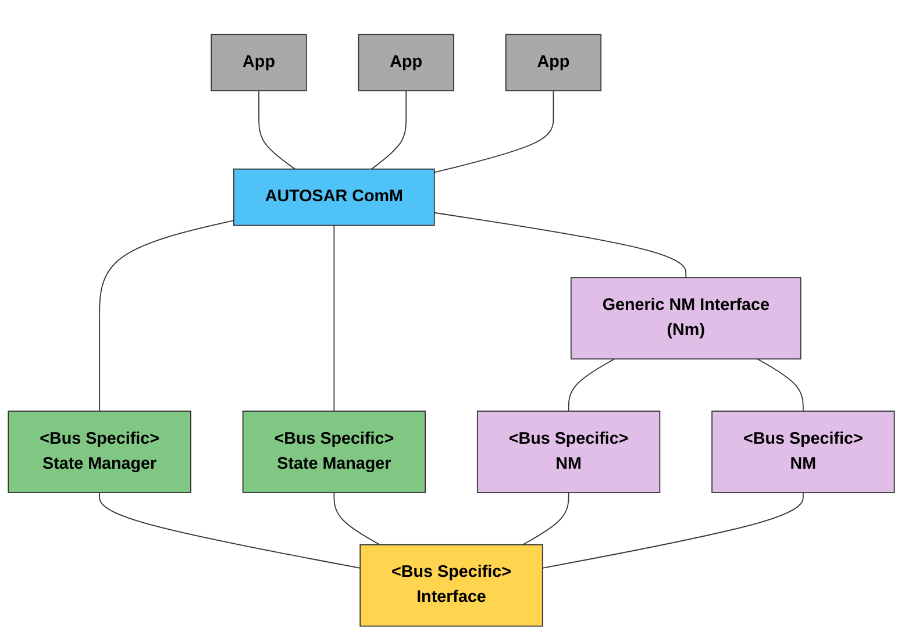

# 概述

> [!tip]  
>
> 标准文件可参见[Specification of CAN Network Management (autosar.org)](https://www.autosar.org/fileadmin/standards/R21-11/CP/AUTOSAR_SWS_CANNetworkManagement.pdf)
>
> CanNm模块还有一大堆的细节，大家如果想更深入了解CanNm模块，可参加文章[《AUTOSAR CAN NM（CAN网络管理）》](https://zhuanlan.zhihu.com/p/532263163)。再推荐一篇干货满满的文章：[《AUTOSAR架构下关于CanNm的几点思考》](https://mp.weixin.qq.com/s/JkbdlKvCSqMjq9ZRJoqnJg)。

首先来简单说说NM（网络管理）的概念，现在汽车上ECU非常之多令人乍舌，设备越多，这电就要越扣扣嗖嗖的用，那该怎么省电呢？有一种方法就是在某些用车场景用不到的ECU，那么就让你进入休眠不工作，当需要这个ECU时，再去把你唤醒，而NM就是为了去实现这个省电小技巧基于总线报文而创造出来的一个玩意。

在介绍CanNm模块之前，首先需要搞清楚CanNm模块和NM模块的关系。如下图所示，Nm 模块位于 AUTOSAR 的通信服务层，对上与ComM 交互，对下控制各总线网络管理模块，为 ComM 提供统一的网络管理功能，同时当开启网络协同功能时，协调各总线网络管理模块之间的状态关系。

CanNm模块其实只是CAN总线上的NM，而LIN, FlexRay也有其对应的NM，大家都大同小异，都实现着一模一样的目的，所以对于CanNm模块和NM模块的关系，说得再简单点，NM模块是一个经理，CanNm模块是真正打工人，那么站在NM之上的ComM模块则是老板了，ComM模块后面会介绍到，这里不多说。这里推荐一篇文章，里面详细的讲述了NM模块的一些基本理论知识：[《一文搞懂AUTOSAR CanNm模块》](https://mp.weixin.qq.com/s/GyGCdNZu3_0E2ZN6KnD-EQ)。

CanNm 模块主要功能如下：

1. 初始化
2. 网络管理报文发送
3. 网络管理报文接收处理
4. 同步睡眠和唤醒功能
5. 向应用层提供网络上节点信息
6. 降低总线负载机制

CanNM和其他层的依赖关系为：

 **CanNm (CAN Network Management)** 的核心原理是基于一种**去中心化（Decentralized）**的直接网络管理策略，即每个节点只根据总线上接收或发送的 NM PDU（网络管理报文）来独立决定自己的状态。

1. 核心机制：周期性 NM PDU 与“保持唤醒”，CanNm 的运行逻辑可以类比为一种“心跳”机制：
   1. **广播通信**：每个节点周期性地向网络发送 NM PDU。

   2. **保持唤醒信号**：只要一个节点接收到来自其他任何节点的 NM PDU，就意味着集群中仍有节点需要通信。
   3. **节点的独立性**：节点不需要知道集群中有多少个节点，也不需要主从节点（Master/Slave）的概念。它只关心“总线上是否还有人在说话”。
2. 进入 Bus-Sleep Mode 的逻辑：从正常运行到进入休眠，必须经过严格的计时逻辑，以确保整个网络同步关闭：
   1. **主动释放**：当节点本身不再需要通信时，它会停止发送自己的 NM PDU。
   2. **被动等待**：即使停止了发送，节点仍必须监听总线。只要收到别人的 NM PDU，就必须维持唤醒状态。
   3. **计时触发**：只有当总线上没有任何 NM PDU 出现，且经过了以下两个时间段的累加后，节点才会进入 Bus-Sleep Mode：
      - **CanNmTimeoutTime**：检测不到 NM PDU 的超时时间。
      - **CanNmWaitBusSleepTime**：进入休眠前的准备/等待时间（用于确保所有节点都已准备就绪）。
3. 核心需求：
   1. 发送准则：只要节点需要总线通信，就必须发送周期性的 NM PDU；不需要时，必须停止发送。
   2. 休眠准则：如果没有外部报文且自身已释放，经过 Timeout + WaitBusSleep 时间后，必须切换至 Bus-Sleep。
4. CanNm 状态机概览
   1. CanNm 的状态机是理解其行为的关键。一个节点通常在以下主要状态间切换：

      - **Bus-Sleep Mode**：网络完全静默，控制器可能处于低功耗模式。
      - **Network Mode**：包含以下子状态：
        - **Repeat Message State**：节点刚启动或检测到唤醒时进入，确保所有节点都能看到彼此。
        - **Normal Operation State**：节点正常发送和接收 NM PDU。
        - **Ready Sleep State**：节点自身已准备好休眠，但仍在监听总线上其他节点的报文。
      - **Prepare Bus-Sleep Mode**：总线活动已停止，节点正在等待进入物理休眠。

CanNm 的精髓在于其**自发性**：

1. **唤醒**：任何节点发送 NM PDU 都能拉起整个集群。
2. **维持**：只要有人发，大家都不能睡。
3. **关闭**：只有当所有人都不发且计时结束，大家才整齐划一地睡去。

这种设计具有极高的鲁棒性，因为任何一个节点的故障（只要不乱发报文）都不会阻止其他节点进入休眠或保持唤醒。

# 操作模式

操作模式转换图如下：

## Network Mode

网络模式是 CanNm 状态机中最活跃的部分，其核心职责是通过发送和接收 NM PDU 来维持集群的唤醒状态。网络模式包含三个核心子状态，它们决定了节点是主动“发言”还是被动“监听”：

- **Repeat Message State (重复消息状态)**：通常是进入网络模式的第一站，确保节点在线。
- **Normal Operation State (常规运行状态)**：应用层需要通信时保持心跳的状态。
- **Ready Sleep State (准备休眠状态)**：自身已释放通信，等待其他节点关闭。

1. ⏱️ NM-Timeout Timer：网络存活的“呼吸灯”，在网络模式中，所有的活动都围绕着 **NM-Timeout Timer** 展开。
   - **启动与重置**：
     - **进入模式**：一旦从休眠或准备休眠进入网络模式，计时器立即启动。
     - **发送确认**：每成功发出一个 NM PDU，计时器重置。
     - **成功接收**：只要收到总线上其他节点的 NM PDU，计时器重置。
   - **重要意义**：只要计时器在不断重置（因为收到了或发送了报文），节点就会留在网络模式。如果计时器归零，说明总线已经静默，节点将尝试滑向休眠状态。
2. 🔄 进入网络模式的默认路径
   - **默认入口** ：无论是从 Bus-Sleep（冷启动）还是 Prepare Bus-Sleep（唤醒重连）进入网络模式，默认都必须先进入 Repeat Message State，这确保了该节点的存在能够被网络上其他所有节点检测到。
   - **上层通知**：进入模式时，CanNm 必须通过回调 `Nm_NetworkMode` 通知 `Nm` 模块。
3. 🧬 部分网络 (Partial Networking) 的动态映射
   - PN Learning (PN 学习请求)：当系统需要重新映射 PNC 与通道的关系时，会触发学习请求。
   - 强制跳转：如果收到或发起了 PN 学习请求，CanNm 必须在 CBV (Control Bit Vector) 字节中设置 Repeat Message Bit 和 Partial Network Learning Bit 为 1，并强制重新进入（Restart） Repeat Message 状态。
   - **意义**：这通过强制所有相关节点进入重复消息阶段，确保新的网络配置信息能被快速广播并同步。
4. 🚫 逻辑约束
   - 被动启动限制：如果节点已经在 Network Mode 运行，此时调用 CanNm_PassiveStartUp（通常用于被动唤醒）是非法的，函数会返回 E_NOT_OK。因为节点已经在线，不需要再执行“启动”逻辑。

### Repeat Message State

**Repeat Message State（重复消息状态）** 是网络管理的“声明阶段”，确保节点在进入网络时不仅能被其他节点发现，还能在总线上保持足够的活跃时间。

1. 📡 Repeat Message State 的核心作用

   1. **可见性（Visibility）**：确保从休眠（Bus-Sleep）或准备休眠（Prepare Bus-Sleep）转换过来的节点能通过发送 NM PDU 让全网感知。
   2. **节点检测（Node Detection）**：通过保持一段时间的活跃，方便诊断工具或主节点识别当前总线上有哪些节点在线。
   3. **最小活跃时间**：强制节点至少运行 `CanNmRepeatMessageTime` 这么久，防止网络频繁地在唤醒和休眠之间剧烈抖动。

2. 🛠️ 关键行为与需求解析

   1. **报文发送** ：一旦进入此状态，CanNm 必须开始（或重新开始）发送周期性的 NM PDU。这是“我已上线”的物理宣告。

      > 注意：如果配置为被动模式（Passive Mode）或通信被禁用，则不发送。

   2. **定时器与超时处理**:在 Repeat Message 状态下，如果 `NM-Timeout Timer` 到期：

      - **不会导致休眠**：CanNm 会立即**重启**该计时器。

      - **错误报告**：它会向 DET 报告 `CANNM_E_NETWORK_TIMEOUT`。

      - **逻辑意义**：这说明在 Repeat Message 期间，节点没能从总线上收到任何 NM PDU（包括自己发出的确认），暗示总线可能存在硬件故障或只有自己一个节点。

   3. **状态退出与去向**:该状态的停留时间固定由配置参数 **`CanNmRepeatMessageTime`** 决定。时间一到，节点根据自身的“网络请求状态”决定去向：

      - **进入 Normal Operation**：如果应用层还需要通信（Network Requested）。
      - **进入 Ready Sleep**：如果应用层已经释放了请求（Network Released）。

3. 🏁 离开状态时的清理工作

   1. 当计时结束准备退出 Repeat Message State 时，CanIf 需要清理控制位向量（CBV）中的相关标志：
      - **Repeat Message Bit **：如果启用了节点检测，将此位清零。
      - **Partial Network Learning Bit **：如果启用了动态 PNC 映射，将学习位清零。

4. 🚫 禁止操作

   如果在 **Repeat Message State**、**Prepare Bus-Sleep** 或 **Bus-Sleep** 期间调用 `CanNm_RepeatMessageRequest`：

   - **结果**：函数直接返回 `E_NOT_OK`。
   - **原因**：在这些状态下，系统要么已经在执行重复消息逻辑，要么正处于不可触发该请求的状态。该 API 通常只在 `Normal Operation` 或 `Ready Sleep` 状态下使用，用于强制所有节点重新进入 Repeat Message 阶段。

### Normal Operation State

 **Normal Operation State（常规运行状态）** 是 CanNm 的核心业务状态：只要应用层（通过 ComM）请求了网络，节点就会留在此状态发送“心跳”，确保整个网络不掉线。

1. 🚀 Normal Operation State 的核心职责
   1. **主动保活**：只要本地 ECU 需要使用总线（Network Requested），它就通过周期性发送 NM PDU 来阻止其他节点进入休眠。
   2. **双向通信**：既发送自己的 NM PDU，也监听别人的 NM PDU。
2. 🛠️ 关键行为与需求解析
   1. 恢复发送：如果节点是从 **Ready Sleep**（只听不发）返回到 **Normal Operation**（又听又发）：
      1. **动作**：CanNm 必须立刻重新开启 NM PDU 的周期性发送。
      2. **意义**：这通常发生在 ECU 本来准备睡觉，但突然应用层又要发数据的情况。
   2. 定时器异常处理 ：在 Normal Operation 状态下，理想情况是不断收到自己发送成功的确认或别人的报文来重置 `NM-Timeout Timer`。
      - **异常**：如果该计时器到期，说明总线上完全没有通信反馈。
      - **处理**：CanNm 会重启计时器并向 DET 报告 `CANNM_E_NETWORK_TIMEOUT`。
      - **注意**：这**不会**导致状态跳转，节点会倔强地继续尝试在 Normal Operation 状态发送。
   3. 释放网络
      1. **触发**：当上层 ComM 调用 `Nm_NetworkRelease`，表明应用层不再需要总线。
      2. **动作**：节点从 Normal Operation 跳转到 **Ready Sleep State**。
      3. **结果**：节点停止发送报文，但开始等待全网静默。
   4. 强制重入重复消息状态：如果启用了 **节点检测（Node Detection）**：
      - **外部触发**：收到其他节点发来的 NM PDU，且其 CBV（控制位向量）中的 `Repeat Message Request Bit` 位为 1。
      - **内部触发**：本地软件调用了 `CanNm_RepeatMessageRequest()`。
      - **动作**：节点必须立即跳回 **Repeat Message State**，并在发送的报文中将 `Repeat Message Bit` 置 1。
      - **意义**：这用于同步全网节点，让大家一起进入“点名模式”，方便相互识别。

>  [!note] 
>
>  💡 深入思考
>
>  在 Normal Operation 状态下，发送周期由 `CanNmMsgCycleTime` 决定。如果在这个状态下发生 **Bus-Off**，CanNm 的状态机本身不会直接崩溃，但由于无法成功发送（收不到 TxConfirmation），`NM-Timeout Timer` 可能会频繁到期并触发 DET 报错。

### Ready Sleep State

 **Ready Sleep State（就绪休眠状态）**是网络管理中实现“同步关机”的关键环节。在这个状态下，本节点已经不想“说话”了，但它必须留下来陪着总线上其他还在“说话”的节点，直到全场静默。

1. 🤫 Ready Sleep State 的核心逻辑

   这个状态可以形象地理解为：**“我已经准备好睡觉了，但我得等最后一个人关灯。”**

2. 停止主动发言

   1. **行为**：一旦从 Repeat Message 或 Normal Operation 进入此状态，CanNm 必须**停止发送** NM PDU。
   2. **目的**：通过停止自己的心跳，告诉网络其他节点“我已经不再请求网络了”。
   3. **例外**：如果涉及部分网络（Partial Networking），为了确保同步关闭，可能仍会发送特殊的 PN 关闭报文。

3. 监听与计时 

   - **关键动作**：节点虽然不发报文，但仍在接收总线上的 NM PDU。
   - **重置计时**：每当收到总线上其他节点发来的 NM PDU，`NM-Timeout Timer` 就会重置。
   - **跳转条件**：只有当 `NM-Timeout Timer` **彻底耗尽（Expire）**，意味着在配置的时间内总线上没有任何节点发声了，本节点才会进入 **Prepare Bus-Sleep Mode**。

4. 🔄 状态的逆转与中断

   1. 即使处于准备睡觉的状态，节点也可以被随时拉回活跃状态：
      - 应用层反悔：如果在 Ready Sleep 期间，本地应用层（ComM）突然又请求了网络，节点会立即跳回 Normal Operation State 并重新开始发送报文。
      - 被要求“点名” ：如果启用了节点检测，且收到了带有 Repeat Message Bit 的报文，或者本地触发了 CanNm_RepeatMessageRequest，节点必须跳回 Repeat Message State。

5. 📊 状态行为对比

   | **维度**             | **Normal Operation**  | **Ready Sleep**              |
   | -------------------- | --------------------- | ---------------------------- |
   | **发送 NM PDU**      | ✅ 周期性发送          | ❌ 停止发送                   |
   | **接收 NM PDU**      | ✅ 接收并重置计时器    | ✅ 接收并重置计时器           |
   | **超时后果**         | 报 DET 错误，保持原状 | **跳转至 Prepare Bus-Sleep** |
   | **本地网络请求状态** | Requested (需要总线)  | Released (释放总线)          |

## Prepare Bus-Sleep Mode

**Prepare Bus-Sleep Mode（准备总线休眠模式）**。如果说 `Ready Sleep` 是在等别人关灯，那么 `Prepare Bus-Sleep` 就是**“最后一次扫除”**——确保所有节点的缓存都清空，总线彻底静默。

1. 🧹 Prepare Bus-Sleep Mode 的核心目的
   1. 在进入物理休眠（Bus-Sleep）之前，必须给硬件驱动和收发器留出一点时间来处理尾声工作：
      1. **平息总线活动**：确保队列中积压的普通应用报文（Application PDUs）全部发出，让所有 Tx-buffers 变为空。
      2. **软着陆**：防止 ECU 还没发完报文就突然断电或进入休眠导致错误。
2. 🛠️ 关键行为与需求解析
   1. 通知与计时 
      1. **通知上层**：进入该模式时，通过 `Nm_PrepareBusSleepMode` 回调通知上层（通常是 `ComM` 或 `CanSm`）。
      2. **停留时间**：由参数 **`CanNmWaitBusSleepTime`** 决定。
      3. **无限停留模式**：如果配置了 `CanNmStayInPbsEnabled = TRUE`，节点将永远停留在此模式而不会进入 Bus-Sleep。这常用于某些需要保持控制器供电但不通信的特殊测试或特定 ECU 电源策略。
   2. 紧急唤醒与重返 :即使是在“清扫阶段”，节点也可以被随时拉回：
      1. **外部唤醒**：只要在总线上收到了 NM PDU，说明其他节点还没睡，必须立刻返回 **Network Mode**（进入 Repeat Message 状态）。
      2. **内部请求**：本地应用层突然请求网络，同样跳回 **Network Mode**。
   3. 立即重启机制 :这是为了应对一个**竞争风险**：
      1. **场景**：当本节点在 Prepare Bus-Sleep 模式下收到请求准备重回网络时，**其他节点可能还在 Prepare Bus-Sleep 模式中**，并且很快就要滑入真正的休眠了。
      2. **策略**：如果开启了 `CanNmImmediateRestartEnabled`，节点在切换到 Network Mode 的瞬间会**立即**发送一条 NM PDU。
      3. **意义**：NM PDU 通常有发送偏移（Offset），如果等周期发送可能太慢了。通过立即发送，可以“大喊一声”叫醒那些正准备睡觉的其他节点，防止网络意外中断。
3. 📋 模式对比：Ready Sleep vs. Prepare Bus-Sleep

| **特性**        | **Ready Sleep**             | **Prepare Bus-Sleep**   |
| --------------- | --------------------------- | ----------------------- |
| **计时器**      | `NM-Timeout Timer`          | `CanNmWaitBusSleepTime` |
| **总线活动**    | 可能还有其他节点在发报文    | 理论上总线已经静默      |
| **主要动作**    | 监听并重置计时器            | 等待缓冲区清空          |
| **收到 NM PDU** | 留在 Ready Sleep (重置计时) | **跳回 Network Mode**   |

`Prepare Bus-Sleep` 是进入休眠前的**“安全检查站”**。它确保了：

1. 通信是**优雅地停止**而非骤停。
2. 只要网络有变，能以**最快速度（Immediate Tx）**恢复通信。

## Bus-Sleep Mode

**Bus-Sleep Mode（总线休眠模式）**是网络管理的终点，也是 ECU 节能的核心阶段。在此模式下，节点不仅停止了所有通信，还开启了“监听唤醒”的低功耗监控逻辑。

1. 🔋 Bus-Sleep Mode 的核心目的与行为
   1. **节能降耗**：CAN 控制器切换到 Sleep 状态，硬件唤醒机制（如收发器的 WUP 检测）被激活，ECU 功耗降至最低。
   2. **全网同步休眠**：
      - **计算公式**：进入休眠的总时间 = $CanNmTimeoutTime + CanNmWaitBusSleepTime$。
      - **同步性**：如果全网节点配置了相同的这两个参数，理论上它们会**几乎同时**进入休眠。
      - **抖动（Jitter）因素**：实际上受晶振漂移（Drift）、任务周期（Task Cycle）以及发送确认延迟的影响，各节点进入休眠的时间点会有微小差异。
2. 🚨 唤醒逻辑：为什么不自动跳转？
   1. 这是一个非常关键的设计点 ：如果在 Bus-Sleep 模式下收到了 NM PDU（由于硬件可能已部分唤醒或正在启动），CanNm 不会直接跳回 Network Mode。
      - **处理方式**：它仅调用回调函数 `Nm_NetworkStartIndication` 通知上层。
      - **设计初衷（Rationale）**：
        - 为了防止**竞态条件（Race Conditions）**。
        - 唤醒决策权属于上层模块（如 `EcuM` 或 `ComM`）。上层需要判断当前 ECU 是正在执行关机序列还是刚准备启动，从而决定是否允许网络层重新激活。
      - **异常记录 **：在休眠状态下收到报文会被视为一种异常指示，会向 DET 报告 `CANNM_E_NET_START_IND`。
3. 🔄 离开休眠模式的路径:离开 Bus-Sleep 进入 Network Mode（默认进入 Repeat Message 状态）只有两种合规途径：
   1. 被动启动 
      - **触发**：上层调用 `CanNm_PassiveStartUp`。
      - **含义**：这通常意味着 ECU 检测到了外部唤醒源（如总线上的 NM 报文），上层决定响应该请求并启动网络管理。
   2. 主动请求
      - **触发**：本地应用层（ComM）请求网络（Network Requested）。
      - **含义**：ECU 自身需要发送数据，因此主动唤醒并请求进入网络。
4. 📝 CanNm 状态切换总结表

| **模式**              | **控制器状态** | **报文发送** | **接收处理**              | **跳转至下一步的触发点**     |
| --------------------- | -------------- | ------------ | ------------------------- | ---------------------------- |
| **Network**           | `STARTED`      | ✅ 周期发送   | ✅ 重置 $NM-Timeout$       | 本地释放且 $NM-Timeout$ 到期 |
| **Prepare Bus-Sleep** | `STARTED`      | ❌ 停止发送   | ✅ 收到报文则跳回 Network  | $WaitBusSleepTime$ 到期      |
| **Bus-Sleep**         | `SLEEP`        | ❌ 彻底静默   | 🔔 仅通知上层 (Indication) | 收到请求或被动启动 API 调用  |

# 相关参数

## 时间参数

| **计时参数**                | **功能描述**                                                 | **核心作用**                                   |
| --------------------------- | ------------------------------------------------------------ | ---------------------------------------------- |
| **CanNmTimeoutTime**        | **NM 超时时间**。在该时间内如果没有收到或发出 NM PDU，则认为总线已静默。 | 判定总线上是否还有其他活跃节点。               |
| **CanNmRepeatMessageTime**  | **重复消息时间**。节点处于 `Repeat Message State` 的固定持续时间。 | 确保节点上线后有足够的曝光时间，用于节点发现。 |
| **CanNmWaitBusSleepTime**   | **等待总线休眠时间**。从检测到总线静默到进入物理休眠之间的缓冲时间。 | 确保所有节点清空缓冲区，实现“软着陆”同步休眠。 |
| **CanNmRemoteSleepIndTime** | **远端休眠指示时间**。如果在该时间内没收到某节点的 NM 报文，则认为该远端节点已准备休眠。 | 用于检测网络中其他节点是否已经释放了网络请求。 |

通过过程可以清晰地看到这些时间参数如何驱动状态机的跳转：

1. **启动阶段**：进入网络模式后，强制停留 `CanNmRepeatMessageTime` 时长。
2. **运行阶段**：每次收到或发送 NM PDU，内部的 `NM-Timeout Timer` 就会被重置为 `CanNmTimeoutTime`。
3. **准备阶段**：当 `NM-Timeout Timer` 减到 0 时，说明总线静默，进入 `Prepare Bus-Sleep`，启动 `CanNmWaitBusSleepTime` 计时。
4. **休眠阶段**：`WaitBusSleep` 计时结束，进入 `Bus-Sleep`。

> [!note]  
>
> 🔍 什么是 Remote Sleep Indication (远端休眠指示)?
>
> 这是一个经常被误解的参数。
>
> - **逻辑**：如果一个节点在 `CanNmRemoteSleepIndTime` 时间内没有收到任何其他节点的 NM 报文，它会向应用层发送一个“远端休眠指示”通知。
> - **应用**：这并不直接导致状态跳转，但它可以告诉应用层（通过 `Nm_RemoteSleepIndication` 回调）：“目前总线上似乎只有我一个人想保持唤醒了，其他人可能都已经释放了请求。”

⚠️ 配置一致性要求

为了保证全网同步，通常要求同一个 CAN 网络（NM Cluster）中所有节点的以下两个参数**必须完全一致**：

- **CanNmTimeoutTime**
- **CanNmWaitBusSleepTime**

如果配置不一致，会导致某些节点过早进入休眠（产生“僵尸节点”）或某些节点迟迟不肯休眠，从而导致蓄电池耗尽。

- `T1`: T_NM_ImmediateCycleTime 快速发送子状态下，网络管理报文发送周期；
- `T2`: T_NM_MessageCycle 正常发送子状态下，网络管理报文发送周期；
- `T3`: T_REPEAT_MESSAGE 节点对于网络上的其他节点的可视时间；
- `T4`: NmAsrCanMsgCycleOffSet 被动唤醒节点收到主动唤醒节点的第一帧网络管理报文到自身发出网络管理报文的时间间隔，用于避免网络堵塞。
- `T5`: T_STARTx_AppFrame 成功发送第一帧网络管理报文后开始发送应用报文最大间隔时间。
- `T6`: T_NM_TIMEOUT 当此定时器到期时，节点将进入预睡眠模式；
- `T7`: T_WAIT_BUS_SLEEP 确保所有节点有时间停止其网络活动。

## PDU格式

通过**控制位向量 (CBV)** ，网络中的 ECU 可以交换关键信息，如：谁发出的报文、是否请求重启计时、以及哪些“部分网络”需要激活。

📦 NM PDU 的结构布局为：

| 字节序列 | 数据描述               |
| -------- | ---------------------- |
| Byte 7   | PNC data 3             |
| Byte 6   | PNC data 2             |
| Byte 5   | PNC data 1             |
| Byte 4   | PNC data 0             |
| Byte 3   | User data 1            |
| Byte 2   | User data 0            |
| Byte 1   | Control Bit Vector     |
| Byte 0   | Source Node Identifier |

1. 系统字节 (System Bytes)
   1. **SNI (Source Node Identifier) **: 发送节点的 ID。位置可配置在 Byte 0、Byte 1 或关闭（Off）。如果关闭，该字节可腾给用户数据。
   2. **CBV (Control Bit Vector) **: 控制位向量。位置同样可配置在 Byte 0、Byte 1 或关闭。
2. 部分网络向量 (PNC Bit Vector)
   1. 如果开启了 **Partial Networking (PN)**，报文中会包含 PNC 位向量。它的起始位置（Offset）和长度（Length）都是可调的。
3. 用户数据 (User Data)
   1. 除去系统字节和 PNC 向量后，剩余的字节统称为用户数据。
   2. **布局规则**：用户数据必须是连续的，通常位于系统字节之后、PNC 向量之前，或者 PNC 向量之后直到报文末尾。

🕹️ 控制位向量 (CBV) 位定义:CBV 是 NM PDU 的“指挥中心”，每一位（Bit）都承载特定的控制逻辑：

| **位 (Bit)** | **名称**                   | **描述**                                                    |
| ------------ | -------------------------- | ----------------------------------------------------------- |
| **Bit 0**    | **Repeat Message Request** | **1**: 请求全网进入重复消息状态（点名模式）。               |
| **Bit 1**    | **PN Shutdown Request**    | **1**: 包含同步的部分网络关闭请求。                         |
| **Bit 3**    | **NM Coordinator Sleep**   | **1**: 协调器请求开始同步关机。                             |
| **Bit 4**    | **Active Wakeup Bit**      | **1**: 本节点是主动唤醒者（即因为自己需要通信而唤醒总线）。 |
| **Bit 5**    | **PN Learning Bit**        | **1**: 请求进行部分网络学习/映射。                          |
| **Bit 6**    | **PN Information Bit**     | **1**: 表示报文中包含有效的 PNC 激活信息。                  |
| **Bit 7**    | **Res**                    | 保留                                                        |

对于 CBV 中的 bit 说明如下：

1. Bit 0 ：重复消息请求
   - 0：未请求进入 Repeat Message State
   - 1：请求进入 Repeat Message State
2. Bit 1,2：保留位，当配置项 CanNmCoordinatorEnabled 使能时，该位等于配置的 CanNmCoordinatorId 的值
3. Bit 3 NM 协调器休眠位
   - 0：主协调器不要求启动同步休眠
   - 1：主协调员请求启动同步休眠
4. Bit 4 主动唤醒位
   - 0：节点尚未唤醒网络
   - 1：节点唤醒了网络
5. Bit 6： 局部网络信息位（PNI）
   - 0：NM 消息不包含局部网络请求信息
   - 1：NM 消息包含局部网络请求信息,该位由配置决定，运行阶段不改变
6. Bit5 Bit7 为保留位

NmPdu 中的 UserData 可以通过 CanNm 的配置引用 EcuC 中的 Pdu。未使用的情况下默认全 0xFF，通过 Nm 的接口去抓取当前接收与发送的 UserData。

> [!tip]  
>
> 🚀 主动唤醒位 (Active Wakeup Bit) 的逻辑
>
> 这是一个非常重要的诊断和逻辑标志：
>
> - **设置时机**：当 ECU 从 `Bus Sleep` 或 `Prepare Bus Sleep` 切换到 `Network Mode` 是因为本地调用了 `CanNm_NetworkRequest`（即本地应用需要唤醒总线）时，CBV 中的 **Active Wakeup Bit** 被置为 1。
> - **清除时机**：当节点离开网络模式（准备休眠）时，该位被清零。
> - **意义**：这允许网络中的其他节点通过查看 NM 报文知道“是谁把大家叫醒的”。

假设一个典型的 8 字节报文配置：

1. **Byte 0**: 发送者 ID (SNI)。
2. **Byte 1**: 控制标志 (CBV)，例如 `0x10` 表示主动唤醒。
3. **Byte 2-3**: 自定义的用户数据（如车辆状态信息）。
4. **Byte 4-7**: PNC 位向量，标志着哪些局部网络簇需要保持工作。

# 工作流

## 网络状态

除了模式（Network, Bus-Sleep）这种全局状态外，CanNm 还维护着一个**内部意图状态**。这反映了本地 ECU “主观上”是否想留在总线上。

- **Requested (已请求) **：
  - **触发**：上层（ComM）调用 `CanNm_NetworkRequest`。
  - **意义**：本地应用 SWC 需要发送数据。即使总线上没有别人，我也要通过发 NM 报文来保持网络唤醒。
- **Released (已释放) **：
  - **触发**：上层调用 `CanNm_NetworkRelease`。
  - **意义**：本地应用不需要总线了。
  - **重要特性**：网络被释放**不代表**通信立刻停止。如果总线上还有其他 ECU 在发报文（即其他 ECU 处于 Requested），本节点仍会留在 Network Mode 并保持监听。

## 初始化

初始化是将 CanNm 从未定义状态带入确定的、安全的初始状态的过程。

1. 核心状态设置

   1. **默认模式 **：初始化成功后，节点必须进入 **Bus-Sleep Mode**。
   2. **默认意图 **：网络状态默认为 **Released**（即默认不想主动唤醒总线）。

2. 静态配置与重置

   1. **配置选择 **：通过指针选择预定义的配置集（如波特率、计时器数值等）。
   2. **禁止发送 **：初始化后必须停止 `Message Cycle Timer`。此时不准发送任何 NM PDU，直到被明确请求。
   3. **总线负载 **：停用“总线负载降低（Bus Load Reduction）”功能，确保初始通信的鲁棒性。

3. 数据与控制位的初始值：初始化时，CanNm 会对报文中的控制信息进行“清零”或“预置”：

   | 字段**                       | **初始值** | **备注**                                             |
   | ---------------------------- | ---------- | ---------------------------------------------------- |
   | **User Data**                | **0xFF**   | 每个字节均设为 0xFF。                                |
   | **Control Bit Vector (CBV)** | **0x00**   | 初始不设置任何标志位（如 Repeat Message 或 PN 位）。 |
   | **PNC Bit Vector **          | **0x00**   | 如果启用了部分网络（PN），所有的 PNC 位向量清零。    |

4. 关于部分网络 (PN) 的特殊逻辑

   1. 如果启用了 **`CanNmGlobalPnSupport`**，初始化时会停止 `NM Message Tx Timeout Timer`。
   2. **原因**：在 PN 场景下，报文的发送往往由特定的过滤逻辑触发。在系统未完全启动并确定哪些“部分网络”需要激活之前，不应启动发送监控计时器，以避免产生错误的超时上报。

规范特别指出了一点：**CanNm 必须在 CanIf 初始化之后进行初始化。**

1. **CanIf_Init**: 准备好 CAN 通道。
2. **CanNm_Init**: 状态机进入 `Bus-Sleep`，意图设为 `Released`，CBV 清零。
3. **ComM/CanSm**: 随后调用 API 来真正开启网络。

#### 发送

CanNm 的发送行为主要取决于节点当前处于状态机的哪个位置。

1. 核心发送模式:
   1. **周期性发送 (Periodic Transmission) **：
      - **适用状态**：Repeat Message State 和 Normal Operation State。
      - **机制**：根据 `CanNmMsgCycleTime` 定时器循环发送 NM PDU。
   2. **总线负载降低模式 (Bus Load Reduction) **：
      - **适用状态**：仅限 Normal Operation State。
      - **机制**：采用特殊算法（如基于特定位变化的发送）来减少总线报文总量，优化带宽。
2. 立即发送机制 (Immediate NM Transmissions):这是为了解决“唤醒太慢”的问题。在传统的周期性发送中，第一条报文可能因为 Offset 延迟。
   1. **触发场景**：
      - 由于本地调用 `CanNm_NetworkRequest`（主动唤醒）进入 Repeat Message 状态。
      - 配置了 `CanNmPnHandleMultipleNetworkRequests` 且在网络模式下再次收到请求。
   2. **行为**：
      - **跳过 Offset**：第一条报文立即发出。
      - **爆发式发送 (Burst)**：随后的 `CanNmImmediateNmTransmissions` 次发送将使用更短的 `CanNmImmediateNmCycleTime`。
      - **重试逻辑**：如果 `CanIf_Transmit` 返回失败，CanNm 会在下个 `MainFunction` 中立即重试，直到成功发完指定的 Burst 次数。
3. 定时器管理与冲突处理
   1. **启动偏移**：如果不是因为主动唤醒进入状态，第一条报文会延迟 `CanNmMsgCycleOffset` 再发出，以错开网络中不同节点的发送峰值。
   2. **同步 PNC 关闭优先 **：
      - 如果启用了 **Synchronized PNC Shutdown** 且当前有待处理的关闭请求，周期性的 NM 报文发送会**推迟**。
      - **原因**：关闭指令具有最高优先级，必须立即发送，哪怕会延误一个 MainFunction 周期。
      - **安全余量**：设计时需确保 $(CanNmPnResetTime - CanNmMsgCycleTime) > n * MainFunctionPeriod$，以容忍这种推迟。
4. 虚拟发送确认 (Immediate Tx Confirmation)
   - **常规方式**：CanNm 发出请求 -> CanIf 转发 -> CanDrv 发出成功 -> 回调 CanIf -> 回调 CanNm（TxConfirmation）。
   - **立即确认模式**：CanNm 调用 `CanIf_Transmit` 后，系统**立即模拟**一个发送成功的回调给 CanNm。
   - **适用场景**：离线设计已经规划好 arbitration time 的系统，不关心硬件层面的实际确认，以节省中断处理和函数调用链产生的执行开销。

📝 关键参数汇总

| **配置参数**                        | **描述**                                        |
| ----------------------------------- | ----------------------------------------------- |
| **`CanNmMsgCycleTime`**             | 常规周期发送间隔（通常为 100ms - 1000ms）。     |
| **`CanNmImmediateNmCycleTime`**     | 快速爆发发送的间隔（通常为 10ms - 20ms）。      |
| **`CanNmImmediateNmTransmissions`** | 进入 Repeat Message 后立即发送的报文数量。      |
| **`CanNmMsgCycleOffset`**           | 节点启动发送时的随机/固定偏移量，防止总线拥堵。 |

CanNm 的发送逻辑非常严密：平时按部就班地发“心跳”（周期发送）；遇到唤醒或紧急需求时，立刻开启“大声呼喊”模式（立即发送）；在面临 PNC 关闭等关键操作时，懂得“让路”优先保障核心指令。

## 接收

当 **CanIf** 模块在总线上识别并接收到一条网络管理报文时，它会触发 `CanNm_RxIndication`。这是 CanNm 处理外部网络状态的起点。

📥 接收指示（RxIndication）的核心行为

CanNm 在收到该回调时的首要任务是**数据同步**：

- **原子性拷贝**：CanNm 必须立即将接收到的 NM PDU 数据（包含控制位 CBV、节点 ID 以及用户数据）从 CanIf 指向的临时缓冲区拷贝到 **CanNm 内部定义的影子缓冲区（Internal Buffer）** 中。
- **目的**：
  - **数据一致性**：CanIf 的缓冲区可能会在下一个 MainFunction 周期之前被新的报文覆盖。拷贝到内部确保了 CanNm 在后续的逻辑处理（如状态机跳转判断）中使用的是最新且完整的快照。
  - **解耦处理**：允许接收中断快速返回，而复杂的协议逻辑（如 PNC 位向量分析、节点检测等）可以在 `CanNm_MainFunction` 中异步处理。

🔄 接收后的连锁反应

成功接收还会触发以下逻辑：

1. 重启计时器 ：

   如果当前处于 Network Mode，NM-Timeout Timer 会被重置，防止节点进入休眠。

2. 状态监控：

   如果当前处于 Bus-Sleep，会触发 Nm_NetworkStartIndication 通知上层有外部唤醒。

3. 解析控制位 (CBV)：

   CanNm 会检查拷贝后的数据中 Repeat Message Bit 是否为 1。如果是，且启用了节点检测，本地节点将准备跳转回 Repeat Message State。

4. 部分网络 (PN) 过滤：

   如果启用了 PN，CanNm 会解析 PDU 中的 PNC Bit Vector。只有当收到的 PNC 与本地感兴趣的 PNC 匹配时，才会进一步重置对应的 PnResetTimer。

📝 CanNm 处理报文的“三步走”

1. **触发**：硬件接收 -> `CanIf_RxIndication` -> `CanNm_RxIndication`。
2. **拷贝**：将数据存入内部 Buffer。
3. **处理**：在下一个周期中，根据 Buffer 里的 CBV 和数据更新计时器和状态机。

## 降低总线负载机制

在大型网络（如拥有 30 个 ECU 的 CAN 网络）中，如果每个节点都在 `Normal Operation` 状态下每 100ms 发送一次 NM PDU，总线负载会非常高。该机制的核心目标是：**无论网络中有多少个节点，确保每个周期内总线上最多只出现两条 NM 报文。**

⚖️ 总线负载削减的核心算法

这个算法利用了每个节点配置的微小时间差异（`CanNmMsgReducedTime`）来实现“优胜劣汰”：

1. **发送后行为**：当本节点**发送**了一条 NM PDU，它将定时器重置为标准周期 **`CanNmMsgCycleTime`**。
2. **接收后行为**：当本节点**收到**别人的 NM PDU，它将定时器重置为一个缩短的时间 **`CanNmMsgReducedTime`**。
   - **约束条件**：$\frac{1}{2} CanNmMsgCycleTime < CanNmMsgReducedTime < CanNmMsgCycleTime$。

> [!note]
>
> - 由于 $ReducedTime < CycleTime$，那些收到报文的节点会比刚发完报文的节点**更早**触发定时器。
> - 通过精细配置每个节点的 `CanNmMsgReducedTime`，系统会自动演变成：**只有两个 `ReducedTime` 最小的节点在交替发送报文**。
> - 其他节点因为一直在接收报文并不断重置较短的定时器，它们的 `CycleTime` 永远无法归零，从而保持沉默。

🔄 状态切换与机制激活

该机制并不是一直开启的，它只在稳定的通信阶段生效：

- 进入 Repeat Message 禁用 ：进入 Repeat Message State 时必须禁用此机制。
  - *原因*：该状态是为了“节点发现”，必须让所有节点都有机会发声，不能被削减。
- 进入 Normal Operation 启用：进入 Normal Operation 且配置开启时，激活此机制。
  - *原因*：此时网络已稳定，只需维持唤醒，不需要所有人都发声。

📋 负载削减逻辑对比

| **场景**                  | **定时器重置值**                           | **结果**                             |
| ------------------------- | ------------------------------------------ | ------------------------------------ |
| **未启用负载削减**        | 无论是发还是收，均设为 `CanNmMsgCycleTime` | 所有节点周期性齐射报文。             |
| **启用负载削减 (发送后)** | `CanNmMsgCycleTime`                        | 刚发完的节点暂时进入长周期等待。     |
| **启用负载削减 (接收后)** | `CanNmMsgReducedTime`                      | 听众节点进入短周期等待，准备“抢答”。 |

🛡️ 鲁棒性保障

该算法具有**自动冗余**特性：

- 如果当前负责发送的两个节点中有一个故障（停止发送），下一个 `CanNmMsgReducedTime` 最小的节点会发现定时器归零，从而**自动接替**成为新的“发言人”。
- 如果整个网络只有本节点需要通信，它会退化为每 `CanNmMsgCycleTime` 发送一次的标准模式。

总线负载削减机制通过简单的**“谁听到了报文，谁就缩短下一次发送等待时间”**的逻辑，实现了分布式竞选。它既保证了总线永远有“心跳”维持唤醒，又避免了节点过多导致的通信拥堵。

## 远程睡眠指示

 **Remote Sleep Indication（远端休眠指示）** 机制是一种“软检测”功能，让一个依然处于活跃状态的节点能够感知到：**“虽然我还在发报文保活，但总线上其他所有人都已经想睡觉了。”**

🧐 什么是远端休眠指示？

在复杂的网络中，可能只有一个 ECU（例如网关）因为某些后台任务需要保持总线唤醒，而其他 ECU 已经完成了工作并进入了 `Ready Sleep State`（只听不发）。

- **核心逻辑**：如果一个处于 `Normal Operation` 的节点在 **`CanNmRemoteSleepIndTime`** 时间内没有收到来自任何其他节点的 NM PDU，它就推断出其他节点都已经释放了网络请求。

1. 触发通知 
   1. **触发条件**：在 `Normal Operation State` 下，连续 `CanNmRemoteSleepIndTime` 时间未收到 NM PDU。
   2. **动作**：调用回调函数 `Nm_RemoteSleepIndication` 通知上层（Nm/ComM）。
   3. **配置**：必须将 `CanNmRemoteSleepIndEnabled` 设置为 TRUE 才能启用此检测。
2. 状态取消（Cancellation）
   1. 如果之前已经检测到了远端休眠，但在以下情况发生时，必须调用 `Nm_RemoteSleepCancellation` 通知上层“有人醒了”：
      - **收到报文 **：在 `Normal Operation` 或 `Ready Sleep` 状态下再次收到了 NM PDU。
      - **进入点名模式 **：节点重新进入了 `Repeat Message State`（这通常意味着有新的节点加入或有人发起了重置请求）。
3. API 调用限制 
   1. **约束**：只有在 `Normal Operation` 或 `Ready Sleep` 状态下检查远端休眠才有意义。
   2. **禁止**：在 `Bus-Sleep`、`Prepare Bus-Sleep` 或 `Repeat Message` 状态下调用 `CanNm_CheckRemoteSleepIndication` 将直接返回 `E_NOT_OK`。

------

📊 为什么需要这个功能？

**Remote Sleep Indication** 对系统设计有以下几个重要帮助：

1. **诊断与监控**：帮助网关或主节点监控网络节点的活跃度。
2. **电源管理优化**：上层 ComM 可以根据此指示决定是否可以提前关闭某些非必要的后台服务，因为除了自己，没有其他 ECU 需要这些服务了。
3. **防止“僵尸”节点**：如果一个节点一直请求网络却不知道其他人都想睡了，这可能暗示某种系统级的逻辑设计问题。

为了防止混淆，请看这两个相似但用途完全不同的计时器：

| **计时器参数**                | **监控对象**   | **超时后果**                               |
| ----------------------------- | -------------- | ------------------------------------------ |
| **`CanNmTimeoutTime`**        | 整个网络的存活 | 判定总线静默，触发**状态跳转**（去睡觉）。 |
| **`CanNmRemoteSleepIndTime`** | 其他节点的意图 | 仅发送**回调通知**，不改变节点当前状态。   |

> **注意：** 通常配置 $RemoteSleepIndTime < TimeoutTime$，这样节点可以在网络真正关闭之前，先得到“远端已准备好休眠”的预警。

## 用户数据

1. **传统 API 方式：Set/Get User Data**：这是最直接的数据交换方式，通过 CanNm 模块提供的专用 API 手动管理数据。
   1. **发送 ：上层调用 `CanNm_SetUserData`。CanNm 会将这些数据存入内部 Buffer，并在**下一次发送 NM PDU 时将其发出。
   2. **接收：上层调用 `CanNm_GetUserData`。CanNm 返回**最近一次收到的 NM PDU 中的数据。
   3. **状态约束**：
      - **Repeat Message**：肯定会发送用户数据。
      - **Normal Operation**：如果开启了负载削减，只有“胜出”的发送节点会发出用户数据。
      - **Ready Sleep**：不发送用户数据（因为停止了发送）。
2. **COM 映射方式：COM User Data**：在现代 AUTOSAR 架构中，更常见的做法是将 NM 用户数据直接映射到 **COM 栈**。这样应用层可以像处理普通信号一样处理 NM 数据，无需直接调用 CanNm API。
   1. 核心逻辑与约束
      - **API 互斥 **：一旦启用了 `CanNmComUserDataSupport`，手动设置数据的 API `CanNm_SetUserData` 将失效。
      - **触发获取**：当 CanNm 准备发送报文时，它会通过 PduR_CanNmTriggerTransmit 向上层（COM 模块）“索取”最新的 I-PDU 数据，并将其与 NM 控制字节（SNI/CBV）合并。
      - **错误处理 **：如果 PduR 获取数据失败，CanNm 会使用**上一次发送成功**的旧数据。
   2. 确认与同步
      - **发送确认** ：当硬件确认报文发出后，CanNm 会调用 `PduR_CanNmTxConfirmation`，最终由 COM 模块更新其信号状态。
      - **长度匹配 **：在配置工具生成代码时，NM PDU 中预留的用户数据字节数必须与 COM 中定义的 I-PDU 长度完全匹配，否则会报错。
3. 数据流对比：API vs COM

| **特性**       | **API 方式 (CanNm_SetUserData)** | **COM 方式 (CanNmComUserDataSupport)** |
| -------------- | -------------------------------- | -------------------------------------- |
| **数据源**     | 应用层手动调用 API               | COM 模块的 I-PDU 信号                  |
| **数据更新**   | 异步（调用即更新 Buffer）        | 同步（在发送瞬间通过 PduR 抓取）       |
| **上层透明度** | 需要感知 NM 模块                 | 就像读写普通 CAN 信号一样              |
| **典型应用**   | 简单的节点 ID 或基础状态         | 复杂的跨模块协同信息                   |

> [!note] 
>
> 💡 关键提示：TriggerTransmit (触发发送)
>
> 规范中提到的 **TriggerTransmit** 机制非常重要。
>
> 1. 如果 `CanIfTxPduTriggerTransmit` 为 **FALSE**：CanNm 主动通过 PduR 拉取数据再发送。
> 2. 如果为 **TRUE**（通常用于 TTCAN 或严格时间触发网络）：CanNm 只发出长度请求，实际数据会在更底层的 `CanNm_TriggerTransmit` 回调中从 PduR 获取。

通过 `CanNmComUserDataSupport`，AUTOSAR 实现了 **“管理面” (NM)** 与 **“数据面” (COM)** 的解耦。这使得开发人员可以利用已有的信号处理逻辑（如信号超时监控、信号过滤）来处理网络管理报文里的负载数据。

# PN

在汽车电子（AUTOSAR）领域，**PN (Partial Networking，部分网络)** 的核心作用是：**“按需唤醒，节能减排”**。

在没有 PN 技术的传统网络中，只要总线上一台 ECU 发出唤醒信号，全车几十个甚至上百个 ECU 都会被同时叫醒。这种“一人开灯，全家不睡”的模式在电动化和高度智能化的今天，会产生严重的电能浪费。

以下是 PN 解决的核心问题和工作机制：

1. PN 的核心用途：实现“局部待机”
   1. PN 允许将整车的 ECU 划分为多个逻辑上的 **PNC (Partial Network Cluster，局部网络簇)**。
      - **传统模式（全网唤醒）**：你只是想在车里听个歌，结果发动机控制单元（ECU）、雷达控制单元、座椅控制单元全都得通电待命，即使它们根本不干活。
      - **PN 模式（局部唤醒）**：你听歌时，只有娱乐系统相关的几个 ECU 保持活跃，其他不相关的 ECU（如底盘、动力系统）继续在“深度休眠”中省电。
2. PN 是如何工作的？（报文过滤机制）
   1. PN 的实现依赖于一种特殊的硬件（支持 PN 的 CAN 收发器）和软件（CanNm 过滤算法）。
      - **PNC 位向量 (Bit Vector)**：在 NM 报文（网络管理报文）中，有一段专门的位域，每一位代表一个 PNC。
      - **掩码匹配 (Filter Mask)**：每个 ECU 内部都存有一个“掩码”，记录了自己属于哪几个 PNC。
      - **精准判断**：当一个 ECU 收到 NM 报文时，它会对比报文里的位向量。
        - 如果报文里请求的 PNC 与自己无关 $\rightarrow$ **忽略报文，继续睡觉**。
        - 如果报文里请求的位正好命中了自己 $\rightarrow$ **重置计时器，保持唤醒**。
3. PN 的关键优势
   1. **降低静态电流（Quiescent Current）**：对于新能源汽车（EV）尤为重要。在充电或远程空调预热时，只需唤醒少量 ECU，能显著延长电池续航。
   2. **减少总线负载**：不活跃的节点不发报文，总线带宽利用率更高。
   3. **符合环保标准**：有助于汽车厂商满足日益严苛的碳排放和能效限制。

## RX处理

当 CanNm 接收到一条 NM PDU 时，它会根据配置和报文控制位（CBV）进入不同的处理分支：

1. 当 PN 功能禁用时

   如果 `CanNmPnEnabled` 为 **FALSE**，不做任何过滤。所有的 NM PDU 都会按常规流程处理（重启超时计时器）。

2. 当 PN 功能启用时 

   1. **PNI (Partial Network Information)** 位为 0 表示该报文不包含特定的 PNC 激活信息。
      - **Case A**: 如果 `CanNmAllNmMessagesKeepAwake` 为 **TRUE**（通常用于网关），报文被接受，节点保持唤醒。
      - **Case B**: 如果该参数为 **FALSE**，报文被**丢弃**。节点不会因为这条报文而重启计时器。
   2. **PNI (Partial Network Information)** 位为 1是 PN 逻辑的核心。CanNm 会提取 **PNC Bit Vector**（位向量）并交给上层（Nm 模块）进行过滤匹配。
      1. **转发逻辑**：CanNm 根据偏移量提取位向量，调用 `Nm_PncBitVectorRxIndication`。
      2. **处理条件**：只有满足以下之一，报文才会被进一步处理（即维持唤醒）：
         - `CanNmAllNmMessagesKeepAwake` 为 TRUE。
         - CanSM 尚未确认 PN 的可用性（初始化阶段为了安全，默认全部接受）。
         - **关键点**：`RelevantPncRequestDetectedPtr` 返回 TRUE。这意味着报文中请求的某个 PNC 正好是本 ECU 感兴趣的。

🛑 同步 PNC 关闭 (Synchronized PNC Shutdown) 逻辑：这是针对更高级场景（如网关协调关闭）的保护机制：

1. 非法请求处理 

   如果一个**主动协调器（Active Coordinator）**收到了带有 `PNSR`（Shutdown Request）位的报文，这是逻辑冲突的。

   - **动作**：忽略该报文，向 DET 报运行时错误。
   - **反应**：如果开启了错误反应机制，它会立即发送一条包含当前正确 PN 信息的报文来“纠正”总线状态。

2. 合法转发 

   当 PNI=1 且 PNSR=1 时，CanNm 提取位向量并通过 `Nm_ForwardSynchronizedPncShutdown` 转发。这确保了关闭指令能跨拓扑传递，实现整个网络簇的同时休眠。

📊 报文布局示例解析

规范中提供了一个清晰的 8 字节 PDU 示例，展示了数据是如何挤在一起的：

| **字节 (Byte)** | **字段名称**         | **示例值** | **含义**                                                     |
| --------------- | -------------------- | ---------- | ------------------------------------------------------------ |
| **0**           | **CBV**              | `0x40`     | 二进制 `0100 0000`：**PNI=1**, PNSR=0。表示包含 PN 信息。    |
| **1**           | **NID**              | `0x00`     | 发送节点 ID。                                                |
| **2 - 3**       | **User Data**        | `0xFF`     | 填充的用户数据。                                             |
| 4               | **PNC Vector Data1** | `0x12`     | **PNC 位向量**。用于匹配过滤掩码（Filter Mask）。            |
| 5               | **PNC Vector Data2** | `0x8E`     | 二进制数据为0001 0010，那么PNC ID就对应1和4（bit1和bit4为1） |
| 6               | **PNC Vector Data3** | `0x80`     | 二进制数据为1000 1110，那么PNC ID对应9, 10, 11, 15 。这里需要注意的是，位是从第8bit开始的，所以PNC id是从8开始 |
| 7               | **PNC Vector Data4** | `0x01`     | 以此类推                                                     |

## Tx的处理

**CanNm 发送报文时 PN（部分网络）标志位的设置**，以及一个非常关键的机制：**同步 PNC 关闭（Synchronized PNC Shutdown）**。其核心目标是：当某个功能（PNC）不再需要时，通知全网相关 ECU 同时关闭该功能，以达到最高效的省电效果。

1. PN 标志位的基本设置 

   在 NM 报文的 **CBV（控制位向量）** 中，有一个 **PNI (Partial Network Information)** 位：

   - **启用 PN 时**：发送的报文中 PNI 位必须设为 **1**。
   - **禁用 PN 时**：发送的报文中 PNI 位必须设为 **0**。

2. 正常发送流

   当需要发送一条普通的 NM 报文（非关闭请求）时，CanNm 遵循以下精密顺序：

   1. **获取状态**：调用 `Nm_PncBitVectorTxIndication` 获取本地当前哪些 PNC 是活跃的。
   2. **组装向量**：将获取到的 PNC 状态填入报文的 **PNC Bit Vector** 区域。
   3. **合并用户数据**：如果开启了用户数据，从 COM 或内部缓存抓取数据填入。
   4. **执行发送**：调用 `CanIf_Transmit` 发射报文。

3. 同步 PNC 关闭机制 (Synchronized PNC Shutdown)

   这是该规范最复杂也最重要的部分。当网关或主节点决定关闭某个 PNC 时，它不能只是自己闭嘴，必须发一个“撤退命令”。

---

触发与存储

上层调用 `CanNm_RequestSynchronizedPncShutdown`。CanNm 会把这个关闭请求存起来，等待在 `MainFunction` 中异步处理。

---

构造关闭报文 (PNSR Bit) 

关闭报文与普通报文的不同点：

- **PNSR 位 = 1**：在 CBV 中将“PN 关闭请求位”置 1。
- **精准位图**：将需要关闭的 `PncId` 转换成位图。例如 `PncId 10` 对应 `byteIndex = 1` (10/8), `bitIndex = 2` (10%8)。
- **覆盖写入**：在此报文中，只有请求关闭的 PNC 位设为 1，其他设为 0。

---

重传与错误处理 

由于关闭指令至关重要，CanNm 引入了重传计时器：

- **重传启动**：第一次发关闭报文时，启动 `CanNmPnShutdownMessageRetransmissionDuration` 计时器。
- **确认机制**：
  - 收到 **E_OK**：任务完成，清除存储的关闭请求，停止重传计时器。
  - 收到 **E_NOT_OK** 或发送失败：如果在重传周期内，下个周期立刻**重试**。
  - **超时失败**：如果计时器到期还没发成功，上报 DET 错误 `CANNM_E_TRANSMISSION_OF_PN_SHUTDOWN_MESSAGE_FAILED`。

---

冲突预防

如果一个 PNC 正准备关闭，但此时突然：

- **外部唤醒**：收到了别人发来的该 PNC 激活报文。
- **内部请求**：本地应用突然又需要这个 PNC 了。
- **动作**：CanNm 必须立刻从“待关闭列表”中移除该 PNC，取消关闭行动。

---

📊普通 NM 报文 vs PN 关闭报文

| **特性**           | **普通 NM PDU**    | **PN 关闭 (Shutdown) PDU**   |
| ------------------ | ------------------ | ---------------------------- |
| **CBV PNI 位**     | 1                  | 1                            |
| **CBV PNSR 位**    | 0                  | **1**                        |
| **PNC 位向量内容** | 当前所有活跃的 PNC | **仅包含请求关闭的 PNC**     |
| **优先级**         | 正常周期           | 高优先级（可能推迟普通报文） |
| **重传机制**       | 依赖下个周期       | 专门的重传计时器快速重试     |