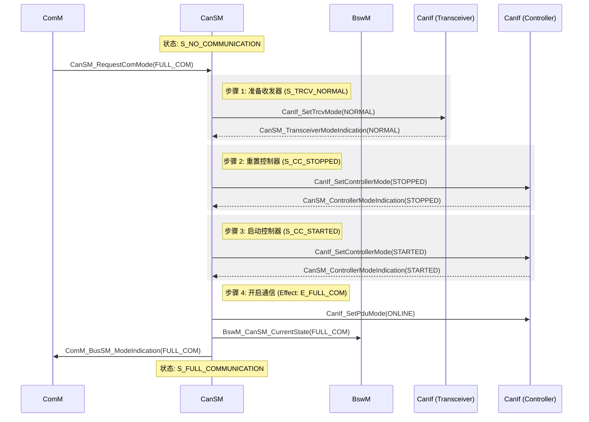
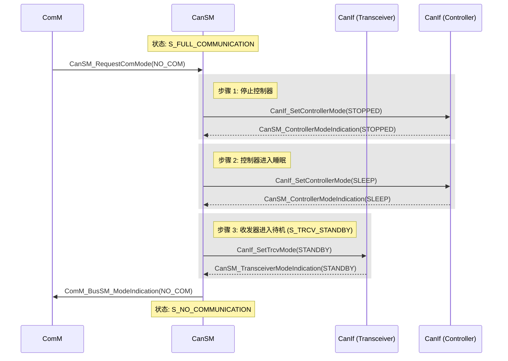
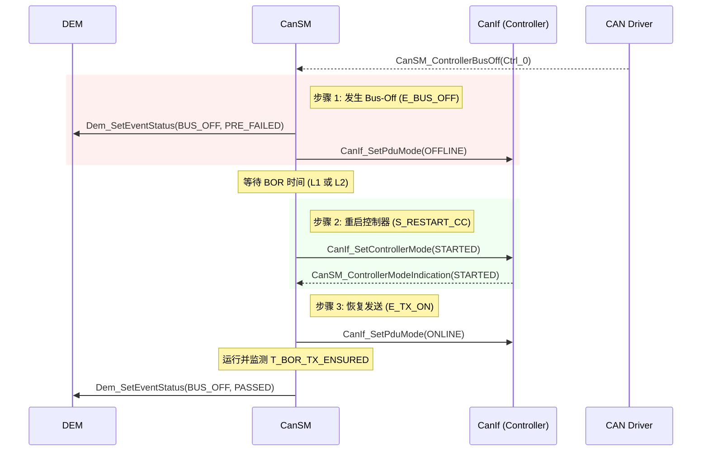

# 概述

> [!tip]  
>
> 标准文件请参见[Specification of CAN State Manager (autosar.org)](https://www.autosar.org/fileadmin/standards/R20-11/CP/AUTOSAR_SWS_CANStateManager.pdf)

CanSM和上一章介绍的CanNm是两兄弟，都是基于interface层，对上则服务于ComM服务。只不过两兄弟所实现的功能不一样，在具体介绍CanSM模块之前，得先搞清楚状态管理是个什么玩意。首先这里管理的状态其实是对应其**总线的通信状态**，所以CanSM模块管理的就是CAN总线的通信状态，而这里的通信状态则包含能不能发送报文，能不能接收报文，总线上有没有错误等。CanSM提供的主要功能主要有：

1. 总线模式切换
2. Busoff 恢复管理
3. 切换波特率
4. 唤醒确认管理

# 模块交互

CanSM模块针对CAN总线状态而言，由上而下，CanSM接收其他模块的总线状态切换请求并通知CanIf模块去执行，由下而上，CanSM接收CanIf模块的总线状态切换反馈并汇报给其他模块。下图显示了在AUTOSAR的BSW层中其他模块与CanSM的交互情况：

1. ECuM模块会初始化CanSM模块，并与CanSM模块交互进行CAN总线唤醒的验证。
2. ComM模块使用CanSM模块请求CAN网络的通信模式，CanSM模块会将其CAN网络的当前通信模式通知给ComM模块。
3. CanSM模块使用Canlf模块来控制CAN控制器和CAN收发器工作模式，Canlf模块通知CanSM模块CAN总线相关事件。
4. CanSM模块向Dem模块报告总线特定的故障信息。
5. CanSM将总线特定的模式更新通知到BswM模块。
6. CanSM模块将部分网络可用性通知给CanNm模块，并在部分联网的情况下处理已通知的CanNm超时异常。
7. CanSM模块向Det模块报告开发和运行时错误。

# 通信模式

在CAN通信（基于AUTOSAR架构）中，有三种通信模式：

1. 完全通信模式（FULL_COMMUNICATION）：节点**正常收发数据**，参与总线通信（如ECU运行时）。
   - 控制器：`CANIF_CS_STARTED`（启动状态，处理协议层）。
   - 收发器：`TRCVMODE_NORMAL`（主动驱动差分信号）。
2. 静默通信模式（SILENT_COMMUNICATION）：节点**仅接收数据，不发送数据**，避免干扰总线（如诊断监听）。
   - 控制器：`CANIF_TX_OFFLINE`（发送关闭，仅接收）。
   - 收发器：仍保持`TRCVMODE_NORMAL`（需接收物理层信号）。
3. 无通信模式（NO_COMMUNICATION）： 节点**完全离线**，进入低功耗状态（如车辆熄火后）。
   - 控制器：`CANIF_CS_STOPPED`（协议层停止运行）。
   - 收发器：`TRCVMODE_STANDBY`（待机模式，仅保留唤醒能力）。

模式切换逻辑为：

1. **唤醒事件**（如总线活动）： `NO_COMMUNICATION` → **唤醒** → `FULL_COMMUNICATION`。
2. **诊断需求**： `FULL_COMMUNICATION` → **静默** → `SILENT_COMMUNICATION`。
3. **休眠指令**： `FULL_COMMUNICATION` → **关闭** → `NO_COMMUNICATION`。

> [!tip] 
>
> 在上面的状态机中实际上还有其他的状态，对于通信模式而言只有三种稳定状态，其余都是中间状态。
>
> - NOT_INITIALIZED 状态下，只能调用 CanSM_Init。
> - PRENOCOM/WUVALIDATION/PRE_FULLCOM/CHANGE_BAUDRATE/SILENTCOM_BOR 为中间状态，正常情况下，CanSM不会停留在这些状态中，在这些状态下，调用 CanSM_RequestComMode 会被拒绝。
> - NOCOM\FULLCOM\SILENTCOM 为稳定状态，处于这些状态下，可接受新的CanSM_RequestComMode 请求。

> [!Note] 
>
> 在以上状态机图中，不同的前缀条件代表不同的条件：
>
> - T: Trigger
> - G: Guarding condition
> - E: Effect

在图中详细描述了 **CanSM** 模块的状态机触发条件（Trigger）、判定条件（Guard）以及产生的效应（Effect）。CanSM 通过这些机制在 **ComM**（通信管理器）和 **CanIf**（CAN 接口）之间起到承上启下的作用。

1. 状态机触发条件 (Triggers)：状态机的跳转由外部 API 调用或底层回调触发：
   - **系统初始化与去初始化**：
     - **PowerOn**: 初始状态为 `CANSM_BSM_NOT_INITIALIZED`。
     - **CanSM_Init**: 触发所有配置网络的初始化流程。
     - **CanSM_DeInit**: 触发去初始化，前提是网络已处于 `NO_COMMUNICATION`。
   - **唤醒源控制**：
     - **T_START_WAKEUP_SOURCE**: 由 `CanSM_StartWakeUpSource` 成功返回后触发。
     - **T_STOP_WAKEUP_SOURCE**: 由 `CanSM_StopWakeUpSource` 成功返回后触发。
   - **模式请求 (来自 ComM)**：
     - **T_FULL_COM_MODE_REQUEST**: 请求进入全通信模式。
     - **T_SILENT_COM_MODE_REQUEST**: 请求进入静默模式（通常用于准备进入总线睡眠）。
     - **T_NO_COM_MODE_REQUEST**: 请求关闭通信。
   - **异常监控**：
     - **T_BUS_OFF**: 底层检测到控制器 Bus-Off 时通过回调触发。
2. 判定条件 (Guarding Conditions)：在执行某些跳转前，状态机会检查最近一次被接受的模式请求：
   1. **G_FULL_COM_MODE_REQUESTED**: 检查最后一次请求是否为 `COMM_FULL_COMMUNICATION`。
   2. **G_SILENT_COM_MODE_REQUESTED**: 检查最后一次请求是否为 `COMM_SILENT_COMMUNICATION`。
3. 执行效应 (Effects)：当状态跳转发生时，CanSM 会通过一系列 API 调用来配置底层硬件并通知上层模块。
   1. 进入全通信模式 (E_FULL_COM)：这是最复杂的效应，包含多个步骤：
      1. **设置 PDU 模式**：
         - 若 **ECU Passive** 为 FALSE：调用 `CanIf_SetPduMode` 为 `CANIF_ONLINE`。
         - 若 **ECU Passive** 为 TRUE：设置为 `CANIF_TX_OFFLINE_ACTIVE`。
      2. **通知 ComM**：调用 `ComM_BusSM_ModeIndication` 指示 `COMM_FULL_COMMUNICATION`。
      3. **通知 BswM**：调用 `BswM_CanSM_CurrentState` 指示 `CANSM_BSWM_FULL_COMMUNICATION`。
   2. 进入静默模式 (E_FULL_TO_SILENT_COM)：执行步骤如下：
      1. **通知 BswM**：设置为 `CANSM_BSWM_SILENT_COMMUNICATION`。
      2. **设置 PDU 模式**：调用 `CanIf_SetPduMode` 为 `CANIF_TX_OFFLINE`。
      3. **通知 ComM**：指示 `COMM_SILENT_COMMUNICATION`。
   3. 关闭通信流程 (E_PRE_NOCOM & E_NOCOM)
      - **E_PRE_NOCOM**: 预关闭阶段，通知 BswM 状态为 `CANSM_BSWM_NO_COMMUNICATION`。
      - **E_NOCOM**:
        - 更新内部存储的模式为 `COMM_NO_COMMUNICATION`。
        - 若请求确实是关闭通信，则向 ComM 发送最终的模式指示。

📝 效应汇总表

| **效应名称**             | **目标通信模式** | **主要动作**                              |
| ------------------------ | ---------------- | ----------------------------------------- |
| **E_FULL_COM**           | Full Com         | 开启 PDU 传输（Online），通知 ComM/BswM。 |
| **E_FULL_TO_SILENT_COM** | Silent Com       | 禁用发送（TX_Offline），通知 ComM/BswM。  |
| **E_NOCOM**              | No Com           | 更新内部状态，通知 ComM。                 |

## 子状态机

> [!note] 
>
> 如果观察下面的所有状态机，就会发现，在设置控制器模式之前都需要将先设置为Stop模式，将收发器设置为Nomal模式。这是因为控制器可能在上电后默认处于未初始化状态，需先复位到“停止模式”作为启动前的统一基准状态。同理，收发器状态也需要做基准。

### CANSM_BSM_WUVALIDATION

以下是唤醒校验的状态机图：

该状态机确保在进入全通信模式之前，CAN 收发器（Transceiver）和控制器（Controller）能够正确、安全地切换到目标工作状态。

1. 收发器状态操作：S_TRCV_NORMAL

   当状态机处于收发器模式设置阶段时，必须确保硬件已准备就绪。

   - **状态行为 (DO Action)**：只要处于 `S_TRCV_NORMAL` 状态，CanSM 就必须重复调用 `CanIf_SetTrcvMode`，请求将收发器模式设置为 `CANTRCV_TRCVMODE_NORMAL`。
   - **判定条件**：只有当 `CanIf_SetTrcvMode` 返回 `E_OK` 时，判定条件 `G_TRCV_NORMAL_E_OK` 才算通过。
   - **成功触发**：当 CanSM 收到底层确认回调（模式指示），证明收发器已成功进入 Normal 模式，触发 `T_TRCV_NORMAL_INDICATED` 进行状态跳转。
   - **超时触发**：如果等待指示的时间超过了配置的 `CANSM_MODEREQ_REPEAT_TIME`，则触发 `T_TRCV_NORMAL_TIMEOUT`。

2. 控制器停止操作：S_CC_STOPPED

   在某些唤醒或重置流程中，需要先将控制器置于停止状态。

   - **状态行为**：如果当前控制器模式不是 `CAN_CS_STOPPED`，CanSM 必须持续请求 `CanIf_SetControllerMode` 为停止模式。
   - **判定条件**：所有配置的控制器请求都返回 `E_OK` 后，`G_CC_STOPPED_OK` 判定通过。
   - **成功与超时**：
     - 收到所有控制器的停止模式指示后，触发 `T_CC_STOPPED_INDICATED`。
     - 若在 `CANSM_MODEREQ_REPEAT_TIME` 时间内未完成，触发 `T_CC_STOPPED_TIMEOUT`。

3. 控制器启动操作：S_CC_STARTED

   这是唤醒校验的关键步骤，确保控制器能够正常启动。

   - **状态行为**：CanSM 重复调用 `CanIf_SetControllerMode`，请求将模式设置为 `CAN_CS_STARTED`。
   - **判定条件**：所有启动请求返回 `E_OK` 后，`G_CC_STARTED_E_OK` 判定通过。
   - **跳转逻辑**：
     - **成功指示**：所有控制器均反馈已启动，触发 `T_CC_STARTED_INDICATED`。
     - **超时反馈**：超时未启动则触发 `T_CC_STARTED_TIMEOUT`。

💡唤醒校验的核心机制：请求-确认-重试

CanSM 在管理底层硬件时遵循一个严密的**闭环逻辑**：

1. **Do Action**: 持续发起请求（Do Action），直到获得 API 的 `E_OK`。
2. **Wait for Indication**: 等待异步回调（Indication）来确认硬件实际状态已切换。
3. **Timeout Guard**: 使用统一的重复间隔时间 `CANSM_MODEREQ_REPEAT_TIME` 监控每一个阶段，防止因硬件故障导致状态机死锁。

所以收发器的变化过程为：`Normal`->`Stop`->`start`

### CANSM_BSM_S_PRE_NOCOM

以下是预备无通信状态的状态机：

首先根据硬件配置判断是否支持 **PN（部分网络）**。这是因为支持 PN 的收发器在休眠前需要额外的操作（如清除唤醒标志)。

1. 判定条件：不支持 PN (`G_PN_NOT_SUPPORTED`)

   当满足以下任一条件时，状态机认为该网络不支持 PN 功能：

   - **未配置收发器**：在配置参数 `CanSMTransceiverId` 中没有关联任何 CAN 收发器。

   - **收发器未开启 PN**：虽然配置了收发器，但其对应的硬件配置参数 `CanTrcvPnEnabled` 被设置为 `FALSE`。

   **后果**：状态机将跳过所有与 PN 相关的子状态（如清除 WUF 标志），直接执行常规的控制器停止和收发器进入 Standby 的流程。

2. 判定条件：支持 PN (`G_PN_SUPPORTED`)

   只有同时满足以下两个条件，状态机才会进入 PN 处理流程：

   - **已配置收发器**：`CanSMTransceiverId` 引用了一个有效的收发器。

   - **收发器开启 PN**：该收发器的 `CanTrcvPnEnabled` 参数设置为 `TRUE`。

   **后果**：状态机会进入更复杂的子状态机（通常涉及 `S_PN_CLEAR_WUF` 等状态），确保在收发器进入睡眠模式前，硬件的唤醒帧过滤器已正确重置。

在这个状态机中，对于支持PN功能的程度不同走了两个不同的分支，但是实际上控制器和收发器的最终状态是一致的，改变过程为：

- 设置CAN控制器为Stopped状态，CanIf_SetControllerMode(CAN_CC_STOPPED)
- 设置CAN控制器为Sleep状态，CanIf_SetControllerMode(CAN_CC_SLEEP)
- 设置CAN收发器为Normal状态，CanIf_SetTrcvMode(CANTRCV_TRCVMODE_NORMAL)
- 设置CAN收发器为Standy状态，CanIf_SetTrcvMode(CANTRCV_TRCVMODE_STANDBY)

所以最终的收发器状态为`Standy`，控制器状态为`Sleep`。

---

其中CANSM_BSM_DeInitPnSupported状态机为：

其核心逻辑仍然遵循 **“执行 DO Action -> 检查 Guard -> 等待 Indication -> 超时重试”** 的闭环模式。

在支持 PN 的路径下，关机序列比普通路径多出了“清除唤醒标志”和“检查唤醒标志”的关键步骤：

1. 第一阶段：清除唤醒标志 (WUF)

   - **S_PN_CLEAR_WUF**: CanSM 持续调用 `CanIf_ClrTrcvWufFlag`。
   - **跳转条件**: 当 API 返回 `E_OK` 且收到 `CanSM_ClearTrcvWufFlagIndication` 回调时，触发 `T_CLEAR_WUF_INDICATED` 进入下一阶段。

2. 第二阶段：硬件状态同步（停止与 Normal 化）

   - **S_CC_STOPPED**: 将所有控制器设置为 `CAN_CS_STOPPED`。
   - **S_TRCV_NORMAL**: 将收发器暂时切回 `NORMAL` 模式（这是为了确保后续能正确检测唤醒标志）。

3. 第三阶段：进入深度休眠

   - **S_TRCV_STANDBY**: 将收发器置于 `STANDBY` 模式。
   - **S_CC_SLEEP**: 将所有控制器设置为 `CAN_CS_SLEEP` 模式。

4. 第四阶段：最终唤醒标志检查

   **S_CHECK_WFLAG_...**: 在控制器处于休眠或非休眠状态下，再次调用 `CanIf_CheckTrcvWakeFlag` 以确认没有挂起的唤醒请求。

执行 DO Action 后，状态机的流转规律如下：

| **当前执行的 DO Action**   | **成功跳转条件 (Next State)** | **超时处理 (Retry)**                   |
| -------------------------- | ----------------------------- | -------------------------------------- |
| **DO_CLEAR_TRCV_WUF**      | 收到 `ClearWuf` 指示          | 重复执行直到成功或达到 RepetitionMax   |
| **DO_SET_CC_MODE_STOPPED** | 收到所有控制器 `STOPPED` 指示 | 触发 `T_CC_STOPPED_TIMEOUT` 重新尝试   |
| **DO_SET_TRCV_STANDBY**    | 收到收发器 `STANDBY` 指示     | 触发 `T_TRCV_STANDBY_TIMEOUT` 重新尝试 |
| **DO_CHECK_WFLAG**         | 收到 `CheckWakeFlag` 指示     | 触发 `T_CHECK_WFLAG_TIMEOUT`           |

超时机制与状态机退出

- **内部重试**: 每个子状态都有对应的 `T_..._TIMEOUT`。如果硬件在 `CANSM_MODEREQ_REPEAT_TIME` 时间内没有给出 Indication 回调，状态机会跳回该子状态的入口，重新执行 DO Action。
- **最终退出**: 只有当整个 `DeinitPnSupported` 链条上的所有 Indication 全部按序到齐，状态机才会从该子状态机“出去”，回到主状态机并最终进入 `CANSM_BSM_S_NOCOM`。

---

CANSM_BSM_DeInitPnNotSupported的状态机为：

在不支持部分网络（PN）的情况下，`CANSM_BSM_DeinitPnNotSupported` 子状态机负责执行简化的关机序列。与 PN 路径类似，它遵循 **“发起请求（DO Action） -> 确认成功（Guard OK） -> 等待硬件反馈（Indication）”** 的闭环控制逻辑。

关机序列该子状态机通过以下四个核心阶段，将 CAN 控制器和收发器逐步置于休眠状态：

1. 第一阶段：控制器停止 (S_CC_STOPPED)
   - **动作**：如果当前模式不是 `STOPPED`，CanSM 会持续调用 `CanIf_SetControllerMode` 将控制器设为停止状态。
   - **跳转**：API 返回 `E_OK` 后进入等待，收到所有控制器的模式确认回调（Indication）后触发 `T_CC_STOPPED_INDICATED`。
2. 第二阶段：收发器 Normal 化 (S_TRCV_NORMAL)
   - **动作**：将收发器设为 `NORMAL` 模式。
   - **特殊逻辑**：如果没有配置收发器，状态机会直接触发 `T_TRCV_NORMAL_INDICATED` 跳过此步。
3. 第三阶段：收发器待机 (S_TRCV_STANDBY)
   - **动作**：将收发器设为 `STANDBY` 模式。
   - **特殊逻辑**：若无收发器配置，直接触发 `T_TRCV_STANDBY_INDICATED` 跳转。
4. 第四阶段：控制器休眠 (S_CC_SLEEP)
   - **动作**：最后将所有控制器设置为 `CAN_CS_SLEEP` 模式。
   - **完成**：收到所有休眠确认指示后，触发 `T_CC_SLEEP_INDICATED`。

执行 DO Action 后,在子状态机内部，执行完 **DO Action** 后的流转严格受 Guard 和 Trigger 控制：

| **当前状态**       | **执行的 DO Action**       | **跳转至 WAIT 或下一状态的条件**                    | **超时处理 (Retry)**                   |
| ------------------ | -------------------------- | --------------------------------------------------- | -------------------------------------- |
| **S_CC_STOPPED**   | `DO_SET_CC_MODE_STOPPED`   | 所有调用返回 `E_OK` 且收到 `T_CC_STOPPED_INDICATED` | 触发 `T_CC_STOPPED_TIMEOUT` 重新执行   |
| **S_TRCV_NORMAL**  | `DO_SET_TRCV_MODE_NORMAL`  | 调用返回 `E_OK` 且收到 `T_TRCV_NORMAL_INDICATED`    | 触发 `T_TRCV_NORMAL_TIMEOUT` 重新执行  |
| **S_TRCV_STANDBY** | `DO_SET_TRCV_MODE_STANDBY` | 调用返回 `E_OK` 且收到 `T_TRCV_STANDBY_INDICATED`   | 触发 `T_TRCV_STANDBY_TIMEOUT` 重新执行 |
| **S_CC_SLEEP**     | `DO_SET_CC_MODE_SLEEP`     | 所有调用返回 `E_OK` 且收到 `T_CC_SLEEP_INDICATED`   | 触发 `T_CC_SLEEP_TIMEOUT` 重新执行     |

与 PN 路径的主要区别为：

- **流程简化**：去掉了清除和检查唤醒标志（WUF/WFLAG）的复杂步骤。
- **硬件兼容性**：通过 `SWS_CanSM_00556` 和 `SWS_CanSM_00557` 显式处理了没有收发器的情况，确保纯控制器环境下的逻辑闭环。

### CANSM_BSM_S_SILENTCOM_BOR

在该状态机中，BOR表示**Bus-Off Recovery**（总线离线恢复），需要将Can设备重启（控制器为`S_RESTART_CC`状态）。同时应该调用Dem_SetEventStatus报告Bus Off事件。

当 CAN 网络发生 **Bus-Off** 错误且处于 `SILENTCOM`（静默通信）模式时，状态机会进入 `CANSM_BSM_S_SILENTCOM_BOR` 子状态机进行恢复处理。

关于执行 **DO Action** 后的跳转逻辑及其效应，解析如下：

1. Bus-Off 初始效应：E_BUS_OFF

   当检测到 Bus-Off 时，CanSM 首先会执行故障上报：

   - **故障上报**：调用 `Dem_SetEventStatus` 将 `CANSM_E_BUS_OFF` 事件的状态设置为 `DEM_EVENT_STATUS_PRE_FAILED`。

2. 执行 DO Action：S_RESTART_CC (控制器重启)

   在 `SILENTCOM_BOR` 子状态机中，核心任务是将因 Bus-Off 停止的控制器重新启动：

   - **执行 DO Action**：只要处于 `S_RESTART_CC` 状态，CanSM 就会持续检查各控制器的状态。如果当前模式不是 `STARTED`，则重复调用 `CanIf_SetControllerMode` 请求进入 `CAN_CS_STARTED`。
   - **跳转逻辑 (Guard)**：一旦所有的 API 请求都返回了 `E_OK`，判定条件 `G_RESTART_CC_OK` 就会通过，状态机进入**等待（WAIT）**环节。

3. 退出与重试机制

   执行完重启请求后，状态机的下一步流转取决于硬件的反馈：

   - **成功退出**：当 CanSM 收到了所有配置控制器的模式指示回调（Indication）时，触发 `T_RESTART_CC_INDICATED`。这标志着控制器已成功恢复，子状态机完成使命并退出。
   - **超时重试**：如果在 `CANSM_MODEREQ_REPEAT_TIME` 时间内未收到所有指示，则触发 `T_RESTART_CC_TIMEOUT`。此时状态机会**跳回 `S_RESTART_CC` 状态**，重新开始执行 DO Action（即再次请求启动控制器）。

4. 特殊效应：E_TX_OFF

   由于控制器在 Bus-Off 重启后的默认 PDU 模式已经是 **TX OFF**（符合 `SILENTCOM` 要求的只听不发状态），因此该效应**不执行任何操作**。

在 `SILENTCOM_BOR` 流程中，执行完 DO Action 后的逻辑是：

1. **不直接退出**，而是跳转到内部的等待逻辑。
2. **依赖反馈**：只有硬件指示（Indication）到齐后才真正退出子状态机。
3. **循环尝试**：如果超时，它会不断循环执行 DO Action 尝试拉起控制器，直到硬件响应或达到全局的最大重试次数限制。

### CANSM_BSM_S_PRE_FULLCOM

`CANSM_BSM_S_PRE_FULLCOM`（预备全通信状态），其中正常的状态转移为：

- 设置CAN收发器为Normal状态，CanIf_SetTrcvMode(CANTRCV_TRCVMODE_NORMAL)
- 设置CAN控制器为Stopped状态，CanIf_SetControllerMode(CAN_CS_STOPPED)
- 设置CAN控制器为Started状态，CanIf_SetControllerMode(CAN_CS_STARTED)

所以最终的收发器状态为`Normal`，控制器状态为`Started`。

1. 核心运行逻辑：请求与反馈

   在 `S_PRE_FULLCOM` 中，CanSM 的目标是确保硬件（收发器和控制器）在正式开启 PDU 传输前达到工作状态。

   - **执行 DO Action**：只要处于对应的 `S_...` 状态，CanSM 就会持续尝试发起模式请求（如 `CanIf_SetTrcvMode` 或 `CanIf_SetControllerMode`）。
   - **Guard 判定**：执行完 API 调用后，状态机会立即检查 Guard 条件。只有当 API 返回 `E_OK` 时，才会认为“请求已成功发出”，并允许逻辑停留在该状态或进入等待环节。
   - **Indication 触发跳转**：执行完 DO Action 且 API 返回成功后，状态机**不会自动进入下一个功能阶段**。它必须等待底层的异步回调通知（Indication）。一旦收到确认，相应的 `T_..._INDICATED` 触发器才会将状态机推向序列的下一步。

2. 状态机内部跳转序列

   该子状态机按照以下顺序强制执行硬件初始化：

   | **阶段**          | **状态 (State)** | **执行的 DO Action**      | **退出到下一阶段的条件**    |
   | ----------------- | ---------------- | ------------------------- | --------------------------- |
   | **1. 收发器**     | `S_TRCV_NORMAL`  | `DO_SET_TRCV_MODE_NORMAL` | 收到收发器 Normal 指示      |
   | **2. 控制器停止** | `S_CC_STOPPED`   | `DO_SET_CC_MODE_STOPPED`  | 收到所有控制器 Stopped 指示 |
   | **3. 控制器启动** | `S_CC_STARTED`   | `DO_SET_CC_MODE_STARTED`  | 收到所有控制器 Started 指示 |

3. 超时与容错处理

   - **循环重试**：如果在等待 Indication 的过程中触发了 `T_..._TIMEOUT`（即超过了 `CANSM_MODEREQ_REPEAT_TIME`），状态机会返回到当前阶段的起始点，重新执行 DO Action。
   - **无硬件兼容性**：如果没有配置收发器，`S_TRCV_NORMAL` 状态会直接模拟收到 `T_TRCV_NORMAL_INDICATED` 指示，从而直接跳转到控制器处理阶段。

4. 最终退出点

   当最后的 `T_CC_STARTED_INDICATED` 被触发后，该子状态机执行完毕。

   根据主状态机图（图 7-1），此时会产生效应 **`E_FULL_COM`**。这意味着 CanSM 此时才会调用 `CanIf_SetPduMode(CANIF_ONLINE)` 来真正允许报文在总线上发送，并最终向 ComM 模块发送模式指示。

### CANSM_BSM_S_FULLCOM

该状态机的核心功能是在CAN通信正常激活后，**监控总线状态（如总线离线、发送超时）、处理故障恢复（如Bus-Off恢复）以及支持波特率切换**，确保CAN总线持续稳定通信。

- **E_TX_OFF/ON**:总线结果为TX_OFFLINE/TX_ONLINE
- **G_BUS_OFF_PASSIVE**：如果CANSM_BOR_TX_CONFIRMATION_POLLING禁能且E_TX_ON持续时间大于等于CANSM_BOR_TIME_TX_ENSURED；或如果CANSM_BOR_TX_CONFIRMATION_POLLING使能且API：CanIf_GetTxConfirmationState返回CANIF_TX_RX_NOTIFICATION则满足条件G_BUS_OFF_PASSIVE。
- **T_SILENT_COM_MODE_REQUEST**：CanSM_RequestComMode(COMM_SILENT_COMMUNICATION)
- **T_BUS_OFF**：如果回调函数CanSM_ControllerBusOff，则以T_BUS_OFF触发状态切换。
- **T_RESTART_CC_INDICATED**：在重启CAN控制器后，CanSM获得状态指示，则以T_RESTART_CC_INDICATED触发状态切换。
- **G_TX_ON**：如果参数CanSMEnableBusOffDelay是FALSE：当bus-off恢复次数小于CanSMBorCounterL1ToL2时，经过时间CanSMBorTimeL1；或当bus-off恢复次数大于等于CanSMBorCounterL1ToL2时，经过时间CanSMBorTimeL2则满足G_TX_ON。

CanSM 通过分层恢复策略（L1 和 L2）来平衡网络的可用性与稳定性。

1. Bus-Off 恢复的分层策略 (L1 vs L2)

   当 CAN 控制器发生 Bus-Off 时，CanSM 不会盲目重启，而是根据重试次数采用不同的等待时间：

   - **L1 (快速恢复)**：如果 Bus-Off 重试次数未达到 `CanSMBorCounterL1ToL2`，则等待 `CanSMBorTimeL1`（较短时间）后尝试恢复。

   - **L2 (慢速恢复)**：如果连续失败次数过多，则进入 L2 阶段，等待 `CanSMBorTimeL2`（较长时间），以避免在故障严重时频繁冲击总线。

   - **随机延迟**：如果开启了 `CanSMEnableBusOffDelay`，会在上述时间基础上增加一个随机抖动，防止多个 ECU 同时重启导致总线再次冲突。

     

2. Bus-Off 发生时 (E_BUS_OFF)

   一旦收到 `CanSM_ControllerBusOff` 回调：

   1. **通知 BswM**：状态切至 `CANSM_BSWM_BUS_OFF`。
   2. **通知 ComM**：通信模式降级为 `COMM_SILENT_COMMUNICATION`（只听不发）。
   3. **记录故障**：向 DEM 报告 `PRE_FAILED`。
   4. **联动停止**：如果一个网络有多个控制器，其中一个 Bus-Off，其他控制器也会被一并停止。

3. 恢复通信 (E_TX_ON)

   当等待时间结束并成功重启控制器后：

   - **开启 PDU**：根据 ECU Passive 状态，将 `CanIf` 设为 `ONLINE` 或 `TX_OFFLINE_ACTIVE`。
   - **模式回升**：通知 BswM 恢复全通信，并向 ComM 发送 `COMM_FULL_COMMUNICATION` 指示。

4. 恢复成功判定 (G_BUS_OFF_PASSIVE)

   这是 BOR 逻辑闭环的关键点。只有满足以下条件，Bus-Off 计数器才会重置，DEM 才会上报 `PASSED`：

   - **基于时间**：从开启发送（E_TX_ON）起，正常运行超过 `CANSM_BOR_TIME_TX_ENSURED`。
   - **基于确认**：或者开启了轮询模式，且 `CanIf` 确认所有控制器都有成功的发送或接收记录。

5. 波特率更改 (T_CHANGE_BR_REQUEST)

   在全通信状态下，CanSM 允许通过 `CanSM_SetBaudrate` 异步更改波特率。

   - 触发 `T_CHANGE_BR_REQUEST` 后，会通知 BswM 进入 `CANSM_BSWM_CHANGE_BAUDRATE` 状态进行流程同步。

🔄 状态流转汇总表

| **触发/状态**         | **动作 (Action) / 效应 (Effect)** | **目的**                     |
| --------------------- | --------------------------------- | ---------------------------- |
| **T_BUS_OFF**         | `E_BUS_OFF`                       | 停止发送，降级模式，上报 DEM |
| **S_RESTART_CC**      | `DO_SET_CC_MODE_STARTED`          | 尝试重启 CAN 硬件控制器      |
| **G_TX_ON** (Wait)    | 根据计数器选择 L1 或 L2 时间      | 故障恢复间隔控制             |
| **E_TX_ON**           | `CanIf_SetPduMode(ONLINE)`        | 重新开启总线通信             |
| **G_BUS_OFF_PASSIVE** | 重置计数器，DEM PASSED            | 确认 Bus-Off 故障已真正消除  |

---

其中子状态CANSM_BSM_S_TX_TIMEOUT_EXCEPTION为：

`CANSM_BSM_S_TX_TIMEOUT_EXCEPTION`（发送超时异常）子状态机旨在通过**重启控制器**的方式来尝试恢复异常的发送功能。当底层驱动检测到发送超时并触发 `CanSM_TxTimeoutException` 回调时，状态机会进入此流程。

其核心逻辑依然遵循 CanSM 典型的“请求-确认”循环，但目的变为“冷启动”硬件：

1. 核心异常恢复流程

   该子状态机通过先“停止”后“启动”控制器的序列，尝试重置控制器的发送逻辑：

   第一阶段：强制停止控制器 (S_CC_STOPPED)

   - **动作 (DO Action)**：只要处于 `S_CC_STOPPED` 状态，CanSM 会持续检查并调用 `CanIf_SetControllerMode` 将控制器设为 `CAN_CS_STOPPED`。
   - **跳转逻辑**：
     - **API 成功**：当 API 调用返回 `E_OK` 时，满足 `G_CC_STOPPED_E_OK` 判定条件。
     - **确认指示**：收到所有控制器的停止指示回调后，触发 `T_CC_STOPPED_INDICATED` 跳转到下一阶段。
     - **超时处理**：如果超过 `CANSM_MODEREQ_REPEAT_TIME` 未收到反馈，则触发 `T_CC_STOPPED_TIMEOUT` 重新尝试。

   第二阶段：重新启动控制器 (S_CC_STARTED)

   - **动作 (DO Action)**：持续请求 `CanIf_SetControllerMode` 为 `CAN_CS_STARTED`。
   - **跳转逻辑**：
     - **API 成功**：满足 `G_CC_STARTED_E_OK`。
     - **确认指示**：收到所有控制器的启动指示回调后，触发 `T_RESTART_CC_INDICATED`。

2. 最终退出效应 (ExitPoint: TxTimeout)

   与常规 Bus-Off 恢复不同，发送超时异常恢复在退出时有一个关键的自动操作：

   - **自动恢复通信**：一旦收到 `T_CC_STARTED_INDICATED` 信号，在退出子状态机时，CanSM 会**自动调用** `CanIf_SetPduMode(CANIF_ONLINE)`。

   这确保了控制器在重启后，报文传输（PDU Mode）能够立即回到正常工作状态。

在这个子状态机中，执行完 **DO Action** 后的行为是：

1. **挂起等待**：在 Guard 条件满足（API 返回 `E_OK`）后，状态机保持在当前状态（或逻辑上的 WAIT 状态）。
2. **不直接退出**：必须等到硬件层给出 Indication（指示）。
3. **循环直到成功**：如果硬件没反应，通过 TIMEOUT 机制不断回到 DO Action 重新发起请求。

### CANSM_BSM_S_CHANGE_BAUDRATE

CanIf_SetBaudrate() 如果直接设置波特率失败，执行

- 设置CAN控制器为Stopped状态，CanIf_SetControllerMode(CAN_CS_STOPPED)
- 设置CAN控制器为Started状态，CanIf_SetControllerMode(CAN_CS_STARTED)

`CANSM_BSM_CHANGE_BAUDRATE` 子状态机负责处理波特率的动态更改。CanSM 提供了两种路径：一种是**直接更改**（Direct），另一种是通过**重启序列**（Stop-Change-Start）进行的异步更改。

1. 路径一：直接更改 (Direct Change)

   当调用 `CanSM_SetBaudrate` 时，状态机会首先尝试“最快”的方式：

   - **DO Action**: 执行 `DO_SET_BAUDRATE_DIRECT`，立即调用 `CanIf_SetBaudrate`。
   - **跳转逻辑**:
     - **成功 (G_SET_BAUDRATE_DIRECT_OK)**: 如果 API 返回 `E_OK`，逻辑直接结束，认为波特率已生效。
     - **失败 (G_SET_BAUDRATE_DIRECT_NOT_OK)**: 如果 API 返回 `E_NOT_OK`，说明当前硬件状态不支持直接修改，状态机会自动切换到“路径二”进行处理。

2. 路径二：异步重启更改 (Async Change Sequence)

   如果直接更改失败，CanSM 会通过标准的“停止-修改-启动”序列来确保硬件正确重置：

   阶段 A：停止控制器 (S_CC_STOPPED)

   - **DO Action**: 持续请求 `CAN_CS_STOPPED`。
   - **反馈跳转**: 收到所有控制器的 `T_CC_STOPPED_INDICATED` 后向下流转。

   阶段 B：执行效应 (E_CHANGE_BAUDRATE)

   这是**核心动作点**，在跳转过程中执行：

   1. **模式降级**: 通知 ComM 进入 `COMM_NO_COMMUNICATION`（因为重启期间总线不可用）。
   2. **再次修改**: 在控制器停止状态下，再次调用 `CanIf_SetBaudrate`。

   阶段 C：重新启动 (S_CC_STARTED)

   - **DO Action**: 持续请求 `CAN_CS_STARTED`。
   - **反馈跳转**: 收到 `T_CC_STARTED_INDICATED` 后，准备退出子状态机。

3. 最终出口判定 (Guarding conditions)

   当硬件重启完成后，子状态机会检查外部的通信请求，决定下一步去向：

   - **返回 FullCom**: 如果最新的请求是 `FULL` 或 `SILENT` 模式，通过 `G_NO_COM_MODE_NOT_REQUESTED` 路径回到主状态机的通信流程中。
   - **保持 NoCom**: 如果此时已经请求了 `COMM_NO_COMMUNICATION`，则通过 `G_NO_COM_MODE_REQUESTED` 路径跳转，这避免了不必要的通信恢复。

📝 执行 DO Action 后的状态流转

| **执行的 DO Action**       | **API 返回 E_OK 后** | **最终跳转触发点**                | **超时处理**            |
| -------------------------- | -------------------- | --------------------------------- | ----------------------- |
| **DO_SET_BAUDRATE_DIRECT** | 判定 Guard 条件      | 无需等待 Indication               | 若失败则转入异步序列    |
| **DO_SET_CC_MODE_STOPPED** | 满足 Guard           | **等待** `T_CC_STOPPED_INDICATED` | 触发 `TIMEOUT` 重新执行 |
| **DO_SET_CC_MODE_STARTED** | 满足 Guard           | **等待** `T_CC_STARTED_INDICATED` | 触发 `TIMEOUT` 重新执行 |

## 模式切换

==启动流程：No Communication → Full Communication==

这是最标准的硬件初始化序列。它严格遵循“收发器 Normal -> 控制器 Stopped -> 控制器 Started”的逻辑。

==关机流程：Full Communication → No Communication (不支持 PN)==

关机时，CanSM 会先停止控制器，再将收发器置于 Standby 模式，以节省功耗。

==异常恢复：Bus-Off 恢复流程 (BOR)==

当硬件发生 Bus-Off 时，CanSM 会暂时关闭发送功能，并尝试重启控制器。

状态切换中的组件变化规律

| **切换类型**       | **控制器 (Controller) 变化** | **收发器 (Transceiver) 变化** | **PDU 传输状态**          |
| ------------------ | ---------------------------- | ----------------------------- | ------------------------- |
| **启动 (Go Full)** | Stopped → Started            | Standby → Normal              | Offline → Online          |
| **关机 (Go No)**   | Started → Stopped → Sleep    | Normal → Standby              | Online → Offline          |
| **Bus-Off 恢复**   | Started (Error) → Started    | 保持 Normal                   | Online → Offline → Online |
| **波特率切换**     | Started → Stopped → Started  | 保持 Normal                   | Online → Offline → Online |

# Busoff

除了上面所说的总线状态机，CanSM模块还有另外一个小型状态机，那就是用来实现的Busoff 恢复机制。

当CanSM模块从CanIf模块收到 Busoff 通知时，将会进入 Busoff 恢复的状态，恢复机制如下：

1. 快恢复，产生 Busoff 后，延时 CanSMBorTimeL1 时间尝试恢复；
2. 快恢复次数达到 CanSMBorCounterL1ToL2 后，进行慢恢复；
3. 慢恢复，产生 Busoff 后，延时 CanSMBorTimeL2 时间尝试恢复；
4. 慢恢复次数为无限次。

尝试恢复指的是，重新打开Can的发送能力，并从Busoff Recovery状态切换至CHECK_BUS_OFF状态。在首次进行快恢复和慢恢复时，CanSM模块会分别给出回调函数通知用户。

当 CanSM 尝试恢复 Busoff 后，有两种方法对总线是否恢复进行确认。

1. 若 CanSMBorTxConfirmationPolling 为 false，停留在BUS_OFF_CHECK状态没有超过时间参数CanSMBorTimeTxEnsured，在此时间段内，没有新的 Busoff 事件产生，则认为 Busoff恢复成功。
2. 若 CanSMBorTxConfirmationPolling 为 true，停留在 BUS_OFF_CHECK状态，直到检测到确实有一帧 Can 报文发送成功并给出了发送确认则认为 Busoff 恢复成功。这种情况下，需要调用 CanIf 的CanIf_GetTxConfirmationState 接口。

Busoff 恢复成功后，BUS_OFF_CHECK状态将切换为 NO_BUS_OFF状态，总线通信恢复正常（**注**：BUS_OFF_CHECK和NO_BUS_OFF是FULLCOM状态中的两个小状态）。

如果Busoff 恢复不成功，节点一直在慢恢复期，意味着该节点不会外报文(应用报文和网络管理报文均不会外发)，其他节点会上报对应的节点丢失故障。

## 概述

> **什么是Can Bus Off**
>
> 车上有一个ECU 1, 一直向总线发送消息，可怎么都发送不出去。
>
> 如果这个累计到一定的次数（255），按照CAN总线协议： ECU 1自己进入 BUSOFF模式，这个时候ECU 1 一时半会是不能发送信息了。
>
> 

> **BusOff 后如何处理**
>
> ECU 1在自己内部检测到BUS OFF后，默默的从逻辑上退出了总线，暂时他没妨碍大家，ECU 1他自己也搞不明白啥回事，于是ECU 1拿着小本子，记下了 x年x月x日x时x分x秒, 汽车电压，里程，xxx 是多少多少，我bus off 了。
>
> 写完备案后，ECU 1 开始数时间，等待 5 秒后，重启自己的CAN模块

> **BusOff时计数的变化规律**
>
> bus off是个非常集体的概念：
>
> - ECU自己发送失败，TX error count + 8，
> - ECU自己发送成功，TX error count - 1，
>
>  这个TX error count 超过255，ECU就必须进入Bus Off 状态，并需要逻辑上断开总线

> **Can Frame的一些常见错误**
>
> 1. 发送ECU检查
>    - 有无ACK
>    - CRC检查，CRC Delimiter, ACK Delimiter，EOF等
>    - BIT监控， 送的那个ECU，自己校对每个BIT，看有没有都送对（ID区域，和ACK区域除外）
> 2. 接收ECU检查
>    - CRC检查，CRC Delimiter, ACK Delimiter，EOF等
>    - 检查有无连续6比特是全0、或全1的

## 故障界定

为了避免某个设备因为自身原因（例如硬件损坏）导致无法正确收发报文而不断的破坏总线的数据帧，从而影响其它正常节点通信，CAN网络具有严格的错误诊断功能，CAN通用规范中规定每个CAN控制器中有一个发送错误计数器和一个接收错误计数器。根据计数值不同，节点会处于不同的错误状态，并根据计数值的变化进行状态转换，状态转换如下图所示。

以上三种错误状态表示发生故障的严重程度，总线关闭是节点最严重的错误状态。并且，节点在不同的状态下具有不同的特性，在总线关闭状态下，节点不能发送报文或应答总线上的报文，也就意味着不能再对总线有任何影响。

状态跳转和错误计数的规则使得节点在发生通信故障时有了较好的自我错误处理和恢复机制，从一种较严重的错误状态跳转到另一种严重性相对较低的状态，本质上就是一种恢复过程。上图所呈现的转换过程是CAN通用规范所要求的，我们从设备供应商买回来的CAN控制器已经把这些功能固化在硅片之中。

在通信过程中，错误主动和错误被动两种状态下节点的恢复过程一般不需要MCU进行额外的编程处理，直接使用CAN控制器固有功能即可。但对于总线关闭状态，往往不直接使用CAN控制器固有的恢复过程，而是对其进行编程控制，以实现“快恢复”和“慢恢复”机制。

## 快恢复和慢恢复

当节点进入总线关闭状态后，如果MCU仅是开启自动恢复功能，CAN控制器在检测到128次11个连续的隐性位后即可恢复通信，在实际的CAN通信总线中，这一条件是很容易达到的。以125K的波特率为例，12811（1/125000）= 0.011264s。这意味着如果节点所在的CAN总线的帧间隔时间大于0.011264s，节点在总线空闲时间内便可轻易恢复通信。我们已经知道，当进入总线关闭状态时，节点已经发生了严重的错误，处于不可信状态，如果迅速恢复参与总线通信，具有较高的风险，因此，在实际的应用中，往往会通过MCU对CAN控制器总线关闭状态的恢复过程进行编程处理，以控制节点从总线关闭状态恢复到错误主动状态的等待时间，达到既提高灵活性又保证节点在功能上的快速响应性的目的。具体包括“快恢复”和“慢恢复”策略，两种策略一般同时应用。

通过以上的讨论，我们可以知道，节点进入总线关闭状态后，存在以下几种恢复情况：

1. MCU仅开启CAN控制器的自动恢复功能，节点只需检测到128次11个连续的隐性位便可以恢复通信，恢复过程如[上节图](##故障界定)所示。

2. MCU没有开启CAN控制器的自动恢复功能，也不主动干预总线关闭错误，节点将一直无法“自动”恢复总线通信，只能通过重新上电的方式使节点恢复, 恢复过程如下图所示。

   

3. MCU对CAN控制器的恢复过程进行编程处理，这时，节点的恢复行为由具体的编程逻辑决定，各厂家普遍采用了先“快恢复”后“慢恢复”的恢复策略，恢复过程如下图所示。

   

MCU编程实现总线关闭“快恢复”和“慢恢复”的一般过程可用以下流程图描述：

节点以正常发送模式发送报文的过程中，如果出现了发送错误，发送错误计数会增加，只要发送错误计数没有超过255， CAN控制器便会自动重发报文，如果出现多次发送错误，使发送错误计数累加超过255，则节点跳转为总线关闭状态。MCU能够第一时间知道节点进入了总线关闭状态（例如在错误中断处理逻辑中查询状态寄存器的相应位），这时MCU控制CAN控制器进入“快恢复”过程，即控制CAN控制器停止报文收发，并进行等待，计时达到需要的时间T1（如100ms）后，MCU重新启动恢复CAN控制器参与总线通信，这样便完成了一次“快恢复”过程。

节点每进入一次“快恢复”过程时，MCU会对此进行计数，当节点“快恢复”计数达到设定的值N（如5次），则后续再次进入总线关闭状态时MCU把恢复总线通信的等待时间T2进行延长（如1000ms），这样便实现了“慢恢复”过程。“快恢复”和“慢恢复”过程的主要区别就在于恢复节点参与总线通信的等待时间的不同。

通过MCU对于总线关闭后的恢复行为进行编程控制，实际上是对CAN控制器的错误管理和恢复机制进行了补充，使得总线关闭状态后的恢复过程更加灵活，更能适应实际应用的需要。对于 “快恢复”和“慢恢复”的等待时间，以及“快恢复”计数多少次后进入“慢恢复”过程，不同厂家可根据具体的需求进行编程实现。

> [!note]  
>
> 当我们进行干扰的时候，不用Rx口就可以知道数据帧发送是否正确，以下使用Ack干扰来举例：
>
> CAN总线采用"线与"逻辑，发送节点在ACK槽（ACK Slot）发送隐性位（逻辑1），而正确接收的节点会覆盖为显性位（逻辑0）。发送节点通过**实时回读总线电平**与自身发送的电平对比：
>
> - 成功应答：若回读到显性位（0），说明至少有一个节点正确接收。
> - 应答错误：若回读到隐性位（1），说明无节点应答，触发ACK错误。
>
> 此过程由CAN控制器硬件自动完成，无需软件干预。发送节点在TX发送的同时通过内部回环检测总线实际状态，而非依赖RX口 。
>
> 问题：不走Rx是怎么知道发出去的报文是正确的‼‼‼‼‼‼‼‼