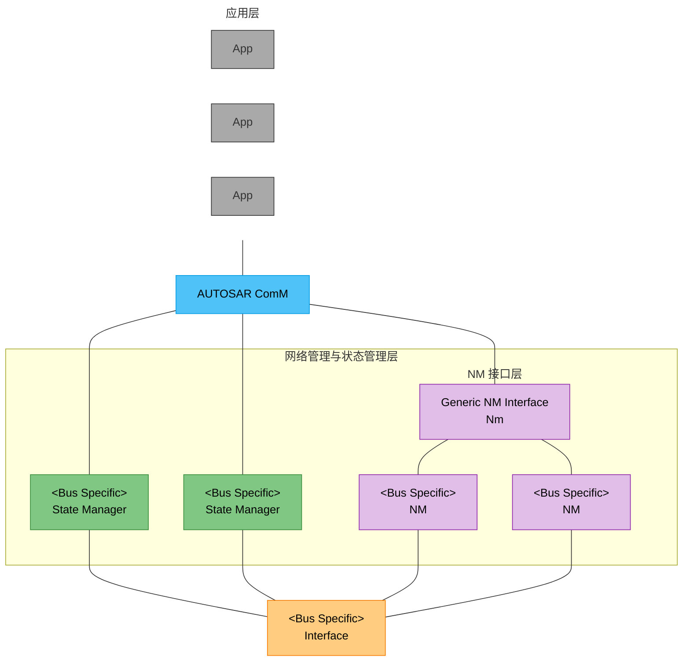
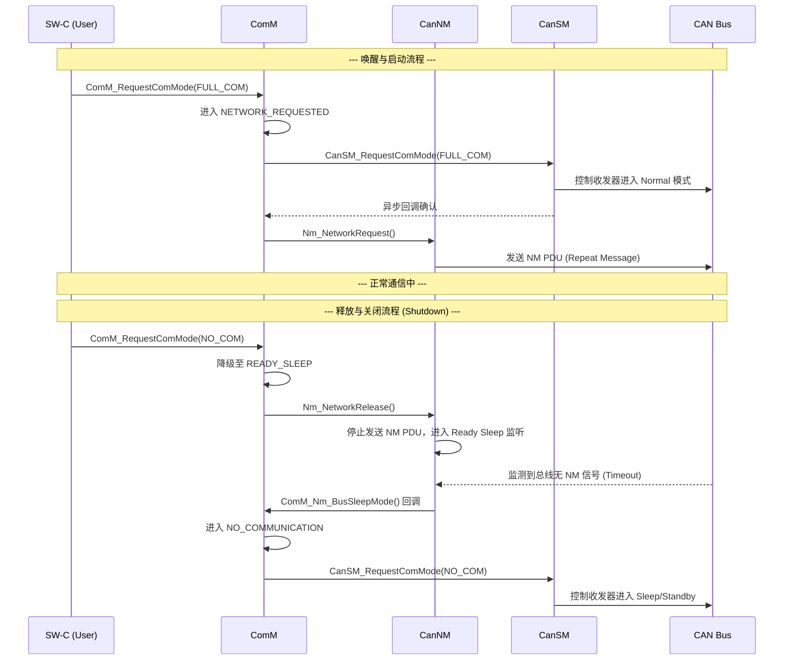

# 概述

> [!tip] 
>
> 标准文件请参考[Specification of Communication Manager (autosar.org)](https://www.autosar.org/fileadmin/standards/R19-11/CP/AUTOSAR_SWS_COMManager.pdf)

 前面分别介绍了ComNm和ComSM两兄弟，这一章则来看看两兄弟的老板，那就是Communication Stack中管理层中最核心的一个模块，那就是ComM模块。

前面已经分别介绍了干活两兄弟NM模块和SM模块，NM模块主要负责的是基于总线报文管理ECU休眠，SM模块则是控制总线通信状态，这两兄弟其实都是实际执行者，ComM模块则是真正的总线管理者，用户只要对ComM模块告知自己想要的通信模式，ComM模块则会直接协调NM和SM两兄弟直接干活以达到用户想要的通信模式。

ComM 模块位于 AUTOSAR 的系统服务层，透过 RTE 与用户（这里的用户指的是可以对ComM模块下达请求的模块，可以是BswM，SWC, Runables等）直接交互。向下控制各总线状态管理器和网络管理器（SM 和 Nm），为用户提供统一的通信管理功能，同时协调SM 和 Nm 之间的状态关系。

ComM 定义了三种基本的通信状态，但对外部用户（如应用软件组件 SW-C 或诊断 DCM）的请求权限做了严格区分：

- **COMM_FULL_COMMUNICATION (全通信)**：最高模式，允许物理通道进行数据的发送和接收。
- **COMM_NO_COMMUNICATION (无通信)**：最低模式，强制停止物理通道的所有发送和接收活动。
- **COMM_SILENT_COMMUNICATION (静默通信)**：中间模式。**用户不能直接请求此模式**，它仅由系统内部用于与网络管理（NM）进行同步。

ComM 作为一个协调者，需要处理来自多个独立用户的请求：

- **仲裁原则**：如果多个用户对同一个通道提出了不同的请求，ComM 遵循“最高者胜”策略。例如，只要有一个用户请求“全通信”，那么该通道的最终目标状态就是“全通信”，即使其他用户请求的是“无通信”。
- **覆盖机制**：ComM 不会给用户请求排队。如果同一个用户连续发送了两次请求，后一次请求会立即覆盖前一次，无论前一次请求是否已经处理完成。
- **诊断特权**：当诊断模块（DCM）发出诊断激活指示时，ComM 会将其自动视为一个“全通信”请求。

目标模式与实际模式的分离：强调了“想变”和“变完”之间的区别：

- **目标状态**：ComM 根据用户请求计算出一个“目标模式”。
- **实际状态**：真正的物理总线状态由各个总线状态管理器（如 CanSM）控制。由于硬件切换需要时间，或者可能存在模式禁止（Inhibition），目标模式与实际模式在时间上可能不一致。
- **查询机制**：
  - 用户可以查询自己请求过什么模式。
  - 用户也可以查询通道当前的真实模式。当调用查询接口时，ComM 会向底层的总线状态管理器获取最新状态并反馈。

除了用户请求外，ComM 还有一个底层的权限开关：

- **初始化保护**：ComM 初始化后，默认所有通道的“通信许可”标志位均为 `FALSE`（不允许通信）。
- **动态控制**：系统必须通过专门的 API 指示（通常来自 EcuM 或 BswM）将该标志位显式设为 `TRUE`，该通道才具备开启通信的前提条件。

ComM 模块主要功能如下：

1. 初始化
2. 用户或 DCM 请求通信模式
3. 通知应用通信模式切换
4. 限制通道或 ECU 的通信功能
5. 与 EcuM 的唤醒功能协同、与 BswM 控制通信协同
6. 控制各通道的总线状态
7. 请求或释放网络管理服务

# 模块交互

1. 模式请求的传递路径 (RTE & ComM)

   - **RTE **: 充当“中转站”，将上层应用（User）的通信模式请求传达给 `ComM` 模块，并将 `ComM` 的状态反馈给用户。
   - **ComM **: 它是核心决策者，负责收集所有用户（包括应用、DCM、总线网络管理等）的请求，并仲裁出当前网络应处于的状态（如 `FULL`、`SILENT` 或 `NO` 通信）。

2. 状态控制与仲裁 (BswM & EcuM)

   - **BswM **: 负责“模式仲裁”和“模式控制”。
     - 它可以根据配置转发请求给 `ComM`。
     - **核心权力**：它通过调用 `Com_IpduGroupControl` 来实际控制 PDU 组的开启或关闭。
     - **状态接收**：`ComM` 必须向 `BswM` 指示所有通道主状态和 PNC（部分网络簇）状态的变化。
   - **EcuM **: 负责基础的唤醒验证，并将验证后的指示发给 `ComM`。它与 `BswM` 协同处理 ECU 的停机和允许通信的逻辑。

3. 总线状态管理器 (Bus State Managers)

   各类总线管理器（LIN, CAN, FlexRay, Ethernet SM）的共同职责：

   - 它们负责将 `ComM` 的抽象请求（通信模式）映射为具体的总线物理状态。
   - 例如，`CanSM` 负责控制 CAN 控制器和收发器的实际模式。

4. 特殊模块的交互逻辑

   - **DCM **: 诊断模块被视为一个特殊的“用户”。当需要执行诊断时，它会请求 `COMM_FULL_COMMUNICATION` 以确保通信链路处于激活状态。
   - **NVRAM Manager **: 负责存储和读取非易失性配置数据。
     - **初始化顺序**：`NVRAM` 必须在 `ComM` 之前完成初始化，否则 `ComM` 无法读取配置。
     - **去初始化**：当 `ComM` 停止工作时，会将当前数据写入 `NVRAM`。
   - **NM**: 用于网络协同，确保网络中的多个节点能够同步启动和关闭。
   - **COM **: 主要用于通过信号分发 PNC（部分网络簇）的状态信息。

交互图勾勒出了一个 **“三层架构”**：

1. **需求层 (App/DCM/NM)**: 发出通信需求。
2. **管理层 (ComM/BswM/EcuM)**: 接收并仲裁需求，决定“该不该通”以及“什么时候通”。
3. **执行层 (CanSM/LinSM等)**: 将决策转化为具体的硬件驱动调用，实现总线的实际开启或关闭。

# PNC状态管理

**部分网络簇管理（Partial Network Cluster Management, PNC）** 是 AUTOSAR 通信管理器（ComM）的一项核心功能，旨在通过仅激活必要的网络节点来降低功耗。

- **状态机管理**：ComM 为每个 PNC 实现了一个独立的状态机，用以代表该簇的通信模式。
- **用户交互**：ComM 用户通过“请求（Request）”和“释放（Release）”操作来控制 PNC 的激活状态。
- **状态映射**：每个 PNC 的状态定义与 ComM 的整体状态相关联，以便进行简单的逻辑映射。

状态交换机制（比特向量）：

PNC 的状态信息通过网络管理（NM）用户数据在系统节点间交换：

- **专用比特位**：每个 PNC 在 NM 用户数据的比特向量中拥有一个固定的位置。
  - **激活**：当本地用户请求某 PNC 时，节点将对应比特位置为 **1**。
  - **释放**：当不再有用户请求该 PNC 时，对应比特位被置为 **0**。
- **数据聚合**：总线网络管理模块（BusNms）收集并汇总这些数据，通过 **COM 信号** 将比特向量提供给 ComM。
- **向量类型**：ComM 使用两种比特向量来交换状态：
  - **EIRA (External Internal Request Aggregate)**：外部/内部请求聚合。
  - **ERA (External Request Aggregate)**：外部请求聚合。

> [!note] 
>
> 总线支持与物理执行:
>
> - **支持的总线类型**：部分网络管理目前仅支持 **CAN** 和 **FlexRay** 总线。
> - **通道控制**：ComM 根据 PNC 的需求，请求或释放节点所需的系统通信总线通道。
> - **PDU 组管理**：
>   - 在 FlexRay 节点上，必须激活或停用 PNC 相关的 **I-PDU 组**，以避免产生错误的超时错误。
>   - **BswM** 负责实际执行 COM 模块中 I-PDU 组的启动与停止。

## 功能细节

**部分网络簇管理（PNC）的功能细节**主要集中在配置、信号交换以及如何在比特向量中定位特定 PNC 的逻辑上。

1. 开启与配置要求

   - **启用开关**：只有当 `ComMPncSupport` 参数设置为 `TRUE` 时，PNC 功能才存在。
   - **后构建配置**：PNC 功能的启用或禁用必须支持 **Post-build**（后构建）阶段配置。
   - **状态通知**：ComM 状态机每当发生状态变化时，都会通过调用 `BswM_ComM_CurrentPncMode()` 来通知 **BswM**。

2. 比特向量（Bit Vector）交换逻辑

   为了在各节点间交换 PNC 状态，ComM 使用了紧凑的比特向量：

   - **容量限制**：比特向量被定义为单一信号，最多包含 **56 个 PNC 状态位**。

   - **数据类型**：ComM 要求该比特向量被配置为 `uint8_t` 类型的数组。

   - **位置计算 (byteIndex & bitIndex)**：

     对于一个特定的 `ComMPncId`，其在数组中的位置通过以下公式计算：

     - **字节索引**：

       $$byteIndex = ComMPncId ÷ 8 - \text{Offset}$$

     - **位索引**：

       $$bitIndex = ComMPncId \mod 8$$

     > *注：Offset 值可从网络管理（NM）模块的配置中获得。*

3. 信号接收与分发

   - **信号接收**：ComM 通过 `Com_ReceiveSignal()` 接收比特向量信号，这些信号可以是 **EIRA**（外部/内部请求聚合）或 **ERA**（外部请求聚合）类型。
   - **变化回调**：ComM 提供 `ComM_COMCbk_<SignalName>()` 回调 API，用于在模块通信中指示信号发生变化。
   - **状态分发**：ComM 能够通过一个或多个通信总线分发 PNC 状态（即 PNC 状态机运行的结果）。它是通过配置为 `TX` 方向的比特向量信号（COM Signal）来完成的。

PNC 信号处理流向为：

1. **输入**：通过 `Com_ReceiveSignal` 获取 EIRA/ERA 信号。
2. **处理**：根据 `byteIndex` 和 `bitIndex` 提取对应 `ComMPncId` 的状态。
3. **反馈**：状态机变化后通知 BswM。
4. **输出**：将本地请求状态通过 `TX` 方向的比特向量发送至总线。

## PNC状态机

1. 状态机结构与容量

   - **数量限制**：ComM 模块最多支持 **56 个** PNC 状态机。
   - **实现原则**：每个 Partial Network 仅实现一个 PNC 状态机，无论它关联了多少个通信通道（ComMChannels）。
   - **状态层次**：
     - **两大主状态**：`COMM_PNC_FULL_COMMUNICATION` 和 `COMM_PNC_NO_COMMUNICATION`。
     - **子状态**：在全通信主状态下，包含 `COMM_PNC_REQUESTED`（已请求）、`COMM_PNC_READY_SLEEP`（准备睡眠）和 `COMM_PNC_PREPARE_SLEEP`（预备睡眠）三个子状态。
2. 状态切换与通知机制
   - **执行时机**：由 `ComM_RequestComMode()` 触发的状态切换必须仅在 `ComM_MainFunction` 中执行。
   - **优先级顺序**：如果 PNC 功能开启，PNC 相关的动作必须在通道（Channel）相关动作之前执行。
   - **外部通知**：除了从 PowerOff 进入 `COMM_PNC_NO_COMMUNICATION` 外，所有的状态变更都必须通过 `BswM_ComM_CurrentPncMode()` 通知 BswM。
3. 请求处理优先级 (Handling Order)
   在处理映射到一个或多个 PNC 的通道时，`ComM_MainFunction` 必须按照以下严格顺序处理请求状态：
   - **映射到 PNC 的用户请求**：本地 SW-C 等用户对 PNC 的请求。
   - **直接映射到通道的用户请求**：不通过 PNC 直接请求通道的用户。
   - **ERA (External Request Aggregate)**：外部请求聚合信号（需开启网关功能）。
   - **EIRA (External Internal Request Aggregate)**：外部/内部请求聚合信号。
4. 信号聚合与触发源
   - **EIRA/ERA 逻辑**：
     - 如果 Rx 比特向量中对应 PNC 的任何位为 '1'，则 ComM 中该 PNC 的 EIRA 位设为 '1'。
     - 只有在开启 `ComMPncGatewayEnabled` 且配置了网关类型的通道上，Rx 比特向量中的 ERA 位才会被处理并映射到 ComM 的 ERA 位。
   - **触发定义**：
     - **ComM_COMCbk**：代表来自 COM 模块的通知，指示收到了包含 ERA 或 EIRA 信息的信号。
     - **ComMUser**：代表来自应用层的通信请求（通过 `ComM_RequestComMode`）。
5. 特殊规则
   - **多信号分配**：允许将多个包含 PNC 位的 COM 信号分配给同一个 PNC（例如一个 EIRA 和多个 ERA），这支持跨多个物理通道（如 FlexRay、多个 CAN 链路）的 ID 配置。
   - **等效性**：在处理“通信允许（Communication allowed）”和模式抑制（mode inhibitions）时，来自 PNC 状态机的请求被视为等同于对应通道的用户请求。

### COMM_NO_COMMUNICATION 

1. 默认与初始状态

   - **上电默认值**：在 ECU 上电或切换电源供应后，`COMM_PNC_NO_COMMUNICATION` 是默认的初始状态。
   - **维持条件**：只要该 PNC 既没有被 ECU 内部请求，也没有被外部请求，它就会保持在这个目标状态。

2. 唤醒指示引发的跳转 (Wake-up)

   当系统处于无通信状态时，不同的唤醒指示决定了状态机的去向：

   - **同步唤醒 (Synchronous Wake-up)**：
     - 如果调用了 `ComM_EcuM_WakeUpIndication()` 且配置参数 `ComMSynchronousWakeUp` 为 **TRUE**，状态机会离开无通信状态并进入 `COMM_PNC_PREPARE_SLEEP`。
   - **异步唤醒 (Asynchronous Wake-up)**：
     - 如果 `ComMSynchronousWakeUp` 为 **FALSE**，调用上述 API 后状态将保持在 `COMM_PNC_NO_COMMUNICATION`，直到收到明确的 PNC 请求（即 EIRA 位变为 '1'）。
   - **特定 PNC 唤醒**：
     - 如果调用了专门的 `ComM_EcuM_PNCWakeUpIndication()`，状态机将直接进入 `COMM_PNC_PREPARE_SLEEP`。

3. 用户请求与信号触发的跳转

   除了唤醒事件，主动请求和网络信号也会触发状态机的升级：

   - **本地用户请求**：
     - 当至少一个分配给该 PNC 的 `ComMUser` 请求“全通信”模式时，状态机进入 `COMM_PNC_REQUESTED` 子状态。
   - **外部 EIRA 信号**：
     - 当 EIRA 比特向量中代表该 PNC 的位变为 '1' 时，状态机进入 `COMM_PNC_READY_SLEEP`。
   - **外部 ERA 信号（网关模式）**：
     - 如果开启了 `ComMPncGatewayEnabled` 且对应的通道配置了网关类型，当 ERA 比特向量中对应位变为 '1' 时，状态机进入 `COMM_PNC_REQUESTED`。

下表总结了从 `COMM_PNC_NO_COMMUNICATION` 出发的不同跳转路径：

| **触发源**        | **条件/配置**              | **目标子状态**             |
| ----------------- | -------------------------- | -------------------------- |
| **ComMUser 请求** | 至少一人请求 FULL_COM      | **COMM_PNC_REQUESTED**     |
| **ERA 信号**      | 开启网关功能               | **COMM_PNC_REQUESTED**     |
| **EIRA 信号**     | 对应位变为 '1'             | **COMM_PNC_READY_SLEEP**   |
| **通用唤醒指示**  | 同步唤醒 = TRUE            | **COMM_PNC_PREPARE_SLEEP** |
| **PNC 唤醒指示**  | 调用 `PNCWakeUpIndication` | **COMM_PNC_PREPARE_SLEEP** |

### COMM_PNC_REQUESTED

1. 进入状态时的动作 (On Entry)

   当 PNC 状态机进入 `COMM_PNC_REQUESTED` 时，ComM 会立即执行以下操作：

   - **物理通道请求**：无论通道当前处于什么状态，ComM 必须为该 PNC 关联的所有配置通道请求 `COMM_FULL_COMMUNICATION`。
   - **发送激活信号 (TX Bit = 1)**：
     - **非网关模式**：如果未开启网关功能，直接通过 `Com_SendSignal` 将该 PNC 对应的 TX 位设为 **'1'**。
     - **网关模式**：如果开启了网关（`ComMPncGatewayEnabled = TRUE`），则仅在 `COMM_GATEWAY_TYPE_ACTIVE`（主动网关）类型的通道上将 TX 位设为 **'1'**。

2. 网关模式下的行为 (Gateway Behavior)

   在 `COMM_PNC_REQUESTED` 状态中，针对 `PASSIVE`（被动）类型的网关通道，信号的发送逻辑由动态条件决定：

   - **转发/激活 (TX = 1)**：在被动网关通道上发送 '1' 的前提是：至少有一个本地用户请求全通信，**或者**从主动网关通道（`ACTIVE`）收到了该 PNC 的 `ERA` 信号（RX = 1）。
   - **停止/去激活 (TX = 0)**：如果在被动网关通道上，既没有本地用户请求，也没有来自主动网关通道的外部 `ERA` 信号，则通过 `Com_SendSignal` 将 TX 位设为 **'0'**。
   - **向量规避 (Vector Avoidance)**：如果开启了 `ComM0PncVectorAvoidance` 且上述 TX 信号变为 '0'，ComM 会释放该物理通道以节省资源；一旦信号恢复为 '1'，则重新请求该通道。

3. 状态维持与退出条件

   `COMM_PNC_REQUESTED` 状态的维持取决于本地和远程的请求聚合：

   - **维持条件**：
     1. 只要有至少一个本地 `ComMUser` 请求 `FULL_COM`。
     2. 或者开启了网关功能且远程 `ERA` 信号指示该 PNC 仍被请求。
   - **退出到 READY_SLEEP**：
     - **非网关环境**：当**所有**本地用户都释放了请求（请求 `NO_COM`）时，进入 `COMM_PNC_READY_SLEEP`。
     - **网关环境**：必须满足**所有**本地用户释放请求 **且** 所有关联通道的 `ERA` 信号位均为 **0** 时，才能进入 `COMM_PNC_READY_SLEEP`。

网关类型对信号的影响：

| **网关类型 (GatewayType)** | **进入时的动作 (TX)**  | **运行时的逻辑**                                 |
| -------------------------- | ---------------------- | ------------------------------------------------ |
| **NONE (非网关)**          | 立即设为 '1'           | 仅随本地用户请求状态维持                         |
| **ACTIVE (主动)**          | 立即设为 '1'           | 作为源头，将状态同步给其他通道                   |
| **PASSIVE (被动)**         | 不在进入时强制设为 '1' | 只有本地有请求或来自 ACTIVE 通道的信号时才发 '1' |

### COMM_PNC_READY_SLEEP

其核心特征是**停止本地请求但保持总线监听**。

1. 进入状态时的动作 (On Entry)

   当状态机从 `COMM_PNC_REQUESTED` 切换至 `COMM_PNC_READY_SLEEP` 时，ComM 必须立即执行以下退避操作：

   - **停止发送激活信号 (TX Bit = 0)**：调用 `Com_SendSignal()` 将该 PNC 在所有关联通道上的 TX 比特位设为 **'0'**。这意味着该节点不再主动要求总线保持唤醒。
   - **释放物理通道请求**：ComM 必须针对该 PNC 涉及的所有配置通道，释放之前的 `COMM_FULL_COMMUNICATION` 请求。

2. 状态维持与运行行为

   在 `COMM_PNC_READY_SLEEP` 状态下，系统处于一种“待命观察”模式：

   - **维持条件**：只要外部信号（EIRA 比特向量）中该 PNC 的位仍为 **'1'**（意味着网络上其他节点仍在请求该 PNC），且本地没有用户提出新的 `FULL_COM` 请求，状态机就会保持在该状态。
   - **逻辑意义**：此时本节点不再发话（TX=0），但因为总线还在活动（EIRA=1），它会保持接收能力，随时准备被重新激活。

3. 状态退出触发

   该状态有三个主要去向，取决于本地用户意图和外部网络状态：

   | **触发条件**     | **条件细节**                                  | **目标子状态**             |
   | ---------------- | --------------------------------------------- | -------------------------- |
   | **外部请求结束** | EIRA 比特向量中对应位全部变为 **'0'**         | **COMM_PNC_PREPARE_SLEEP** |
   | **本地新请求**   | 至少有一个本地 `ComMUser` 再次请求 `FULL_COM` | **COMM_PNC_REQUESTED**     |
   | **网关外部请求** | 开启网关功能且对应的 `ERA` 信号位变为 **'1'** | **COMM_PNC_REQUESTED**     |

`COMM_PNC_READY_SLEEP` 实际上是 **“逻辑上的释放”** 与 **“物理上的关闭”** 之间的一个缓冲区：

- 本节点已经“释放”了请求（因此 TX=0，并释放了通道请求）。

- 但只要总线上还有人在用这个 PNC（EIRA=1），本节点就不能真正进入睡眠，必须留在 `READY_SLEEP` 等待。

- 只有当全网都没有人再请求这个 PNC（EIRA=0）时，它才会进入 `PREPARE_SLEEP` 倒计时阶段。

### COMM_PNC_PREPARE_SLEEP

这个状态本质上是一个**延时观察期**，旨在确保在全网彻底关闭该 PNC 通信前，给各节点留出统一的缓冲时间，防止因信号抖动导致网络频繁唤醒。

1. 进入状态时的动作 (On Entry)

   一旦进入 `COMM_PNC_PREPARE_SLEEP`：

   - **启动计时器**：系统必须启动一个名为 `ComMPncPrepareSleepTimer` 的计时器，其初值由配置参数 `ECUC_ComM_00841` 决定。

2. 状态维持逻辑 (Behavior)

   - **静默等待**：只要计时器还在运行，且本地用户请求、外部 EIRA 或 ERA 信号都没有发生变化，状态机就保持在 `COMM_PNC_PREPARE_SLEEP` 状态。
   - **超时自动退出**：一旦计时器倒计时结束（Expire），状态机将彻底离开全通信主状态，回到最初的 **`COMM_PNC_NO_COMMUNICATION`**。

3. 中途被重新唤醒的跳转 (Interruption)
   如果在计时器运行期间，系统收到了新的请求或信号，计时器将立即**停止**，并根据来源跳转到相应的激活状态：

   | **触发源**    | **跳转条件**                        | **目标子状态**           |
   | ------------- | ----------------------------------- | ------------------------ |
   | **本地用户**  | 至少一个 `ComMUser` 请求 `FULL_COM` | **COMM_PNC_REQUESTED**   |
   | **外部 EIRA** | 收到 EIRA 信号（位变为 '1'）        | **COMM_PNC_READY_SLEEP** |
   | **网关 ERA**  | 开启网关功能且收到对应 ERA 信号     | **COMM_PNC_REQUESTED**   |

在部分网络（Partial Networking）中，`PREPARE_SLEEP` 扮演着“维稳”的角色：

1. **防止总线负载颠簸**：如果没有这个延时，当最后一个节点释放请求时，总线可能立即尝试关闭。但如果此时某个节点突然又有了瞬时请求，会导致总线反复在开启和关闭之间切换（抖动），增加功耗并消耗 CPU 资源。
2. **全网同步**：由于不同节点的处理速度和采样周期不同，这个计时器给全网络提供了一个“冷静期”，确保所有节点在真正进入 `NO_COMMUNICATION` 前都达成了一致。
3. **优先级区分**：
   - 收到 **EIRA** 跳回 `READY_SLEEP`：说明网络上有人还在用，但我本地没请求，所以我继续“陪跑”监听。
   - 收到 **用户请求或 ERA** 跳回 `REQUESTED`：说明本地或网关对端需要主动发话，我必须立刻恢复“主动请求”身份。

## PNC Gateway

**主动（Active）**与**被动（Passive）**网关类型在多通道环境下的职责分工。其核心目标是确保跨越多个通信通道（如 CAN1 和 CAN2）的 Partial Network 在请求和释放时间上保持同步。

1. PNC 网关的基本原则

   - **多通道协调**：如果一个 PNC 连接到多个 `ComMChannel`，它们必须作为一个整体被协调。应用层不应该感知底层通道的具体状态，只需请求 PNC，ComM 负责确保所有关联通道同步请求或释放。
   - **一致性要求**：如果没有 PNC 网关进行协调，必须通过其他手段确保所有受影响的通道在同一时间点被请求或释放。

2. 主动 PNC 网关 (Active PNC Gateway)

   - **行为一致性**：即使作为主动网关，其核心行为逻辑仍遵循标准的 **PNC 状态机**（即你之前看到的 `REQUESTED` -> `READY_SLEEP` 等过程）。
   - **决策权威**：主动网关通常是系统通道上**最后一个释放 PNC 的节点**。
   - **状态判定**：如果所有关联通道的 `ERA`（外部请求聚合）信号位都为 **0**，则意味着除了该网关本地外，没有其他外部节点在请求这个 PNC。

3. 被动 PNC 网关 (Passive PNC Gateway)

   被动协调通常出现在一个通道连接了两个不同网关的复杂拓扑中。

     -  **唯一性原则**：如果一个通道映射到两个 PNC 网关，只能有**一个网关将其设为 Active** 进行主动协调，另一个网关则必须设为 **Passive**。
     -  **映射关系**：一个 PNC 网关必须至少映射到一个 `Active` 类型的通道，同时可以映射到一个或多个 `Passive` 类型的通道。
     -  **请求逻辑**：被动网关在以下任一条件满足时请求 PNC：
        - . 本地有 `ComMUser` 提出了请求。
          - 或者，来自该网关**主动协调通道**的 `ERA` 信号位不为 0（即将主动通道的请求转发至被动通道

4. 信号计算规则

   - **ERA TX 比特计算**：被动网关在计算要发送到被动通道的 `ERA` 比特位时，计算方式与主动通道一致。
   - **强制置零规则**：虽然计算方式一致，但必须遵循 **SWS_ComM_00959** 的规则（即当本地无请求且主动通道也无外部请求时，强制将该位设为 '0'），以允许该分支网络进入睡眠。

💡 Active vs Passive 的本质区别

| **特性**     | **主动网关 (Active)**          | **被动网关 (Passive)**                   |
| ------------ | ------------------------------ | ---------------------------------------- |
| **控制权**   | 负责主导该通道的唤醒与保持     | 仅作为信号的“跟随者”或“转发者”           |
| **拓扑角色** | 通道状态的源头，最后一个释放者 | 辅助网关，防止多网关冲突                 |
| **信号转发** | 将本地请求/外部请求广播至通道  | 仅在本地或其主动侧有请求时才向被动侧转发 |

## PNC处理示例

假设你的 ECU 充当网关，连接了 **CAN1（配置为 Active）** 和 **CAN2（配置为 Passive）**，且两者都属于同一个 `PNC_01`。

当 CAN1 上的外部节点发出唤醒请求时，信号在你的网关 ECU 内部会经历从物理层到逻辑层、再回流到物理层的闭环。

第一阶段：信号接收与识别 (RX)

1. **物理层感知**：CAN1 上的外部节点发送包含 PNC 向量的 NM 报文（比特位为 1）。
2. **CanIf / CanNm 提取**：`CanIf` 接收报文，`CanNm` 提取其中的用户数据（NM User Data），识别出 `PNC_01` 对应的比特位。
3. **ComM 接收 EIRA/ERA**：通过 `Com_ReceiveSignal`，ComM 获取到该位。
   - 此时，网关检测到 CAN1（Active 侧）的 **ERA** 信号由 `0` 变为 `1`

第二阶段：PNC 状态机跳转 (Logic)

1. **状态切换**：`PNC_01` 的状态机感应到外部请求（ERA=1），从 `PNC_NO_COMMUNICATION` 直接跳转到 **`PNC_REQUESTED`**。 
2. **联动 BswM**：ComM 调用 `BswM_ComM_CurrentPncMode`，通知 BswM 该 PNC 已激活。
3. **开启通道**：由于 `PNC_01` 进入了请求状态，ComM 会向 **CAN2** 的通道请求 `COMM_FULL_COMMUNICATION`（如果 CAN2 还没开）。 

第三阶段：信号转发与唤醒 (TX)

1. **计算被动侧信号**：因为 CAN2 被配置为 `PASSIVE` 网关类型，ComM 检查跳转条件：
   - 条件：本地有用户请求 **或者** 来自 `ACTIVE` 侧（CAN1）的 ERA 信号为 1。 
   - 结果：满足条件，ComM 决定在 CAN2 上也发送 '1'。
2. **触发发送**：ComM 调用 `Com_SendSignal`，将 `PNC_01` 在 CAN2 对应的 TX 比特位置为 **1**。 
3. **总线传播**：`CanNm` 将此比特位装入发送缓存，通过 `CanIf` 发往 CAN2 总线。此时，CAN2 上的所有 PNC 成员节点感应到该位，完成唤醒。

| **步骤** | **组件**              | **动作**                     | **目的**                     |
| -------- | --------------------- | ---------------------------- | ---------------------------- |
| **1**    | **CanIf/CanNm**       | 采样并解析 NM 报文           | 捕获原始唤醒物理信号         |
| **2**    | **ComM (EIRA/ERA)**   | 聚合各通道位向量             | 将物理信号转为逻辑请求       |
| **3**    | **PNC State Machine** | `NO_COM` -> `REQUESTED`      | 驱动 PNC 核心逻辑跳转        |
| **4**    | **ComM (Gateway)**    | 根据 Active/Passive 路由信号 | 决定是否要“透传”请求到另一侧 |
| **5**    | **Com / CanNm**       | `Com_SendSignal` -> 总线发送 | 物理唤醒目标网段（CAN2）     |

网关 ECU 在这里扮演了**“逻辑映射器”**的角色：

1. 它把 CAN1 的 **Input (ERA)** 变成了自己内部 PNC 状态机的 **Request**。
2. 它又把内部状态机的 **Result** 变成了 CAN2 的 **Output (TX)**。

# Channel状态管理

与之前的 PNC 状态机不同，通道状态机直接面向物理总线和对应的总线状态管理器（如 CanSM）。

1. 通道独立性与优先级

   - **独立控制**：ComM 为每个通信通道实现一个独立的状态机。这允许不同通道拥有不同的通信能力（例如，LIN 通道在采集传感器数据时处于全通信状态，而 CAN 通道保持非活动状态）。
   - **PNC 优先**：如果启用了 PNC 功能，所有 PNC 相关的动作必须在通道动作之前执行。
   - **强推 NM 请求**：如果配置了 `ComMPncNmRequest`，当 PNC 状态机切换到 `COMM_PNC_REQUESTED` 时，ComM 必须调用 `Nm_NetworkRequest()`。这确保了 NM 报文能立即发送，从而同步唤醒网络上的所有 PNC 节点。

2. 状态结构与子状态

   通道状态机由三个主状态组成，涵盖了通信的不同阶段：

   | **主状态**                    | **子状态**                                           | **说明**                                                     |
   | ----------------------------- | ---------------------------------------------------- | ------------------------------------------------------------ |
   | **COMM_NO_COMMUNICATION**     | `NO_COM_NO_PENDING_REQUEST` `NO_COM_REQUEST_PENDING` | 默认状态。在 `REQUEST_PENDING` 子状态下，系统会检查 `CommunicationAllowed` 标志位。 |
   | **COMM_FULL_COMMUNICATION**   | `FULL_COM_NETWORK_REQUESTED` `FULL_COM_READY_SLEEP`  | 允许正常的发送和接收。`READY_SLEEP` 用于同步总线关闭过程。   |
   | **COMM_SILENT_COMMUNICATION** | (无子状态)                                           | 仅允许接收，禁止发送。主要用于 NM 的同步关闭流程。           |

3. 通信能力映射 (Mode vs Capability)

   根据上表，不同模式下的物理能力对比如下：

   - **FULL**：发送 **On**，接收 **On**。请求总线通信。
   - **SILENT**：发送 **Off**，接收 **On**。已释放总线通信，仅保持监听。
   - **NO**：发送 **Off**，接收 **Off**。总线完全释放。

   

4. 关键运行机制

   - **用户透明性**：状态机的内部逻辑（如“最高者胜”仲裁）对用户（SW-C）是不可见的。用户只需提出模式请求，无需关心内部如何处理冲突。
   - **许可检查 (CommunicationAllowed)**：这是一个重要的安全锁。状态机只有在 `COMM_NO_COM_REQUEST_PENDING` 子状态下才会评估这个标志位。这意味着如果通道已经在运行中，即便该标志变为 `FALSE`，通道也不会立即关停。
   - **用户通知 (Fan-out)**：每当主状态发生变化，ComM 必须通知所有关联该通道的用户。如果一个通道对应多个用户，通知会进行分发（Fan-out）。

5. 状态机的职责界限

   通道状态机直接与其连接的 **Bus State Manager**（如 CanSM）通信，负责处理特定通道/网络的硬件状态映射，而其他跨模块接口则由 ComM 模块统一处理。

状态机如下：

 ComM 中 存在**“管理通道（Managing Channel）”** 与 **“被管理通道（Managed Channel）”** 。这种机制主要用于处理**跨通道的通信协调**，特别是在一个通道拥有网络管理（NM）能力而另一个通道没有的情况下。

1. 管理关系与配置

   - **引用关系**：通过配置参数 `ComMManageReference`，一个通道可以引用其他通道。
   - **角色定义**：
     - **Managing Channel (管理通道)**：引用的发起方（源）。
     - **Managed Channel (被管理通道)**：被引用的目标。
   - **数量限制**：
     - 一个管理通道可以管理 **0 到多个** 被管理通道。
     - 一个被管理通道只能被 **0 到 1 个** 管理通道所管理。

2. 典型使用场景 (Use Case)

   这种设计主要为了支持以下场景：

   **管理通道负责处理 NM 模块的交互（如同步唤醒、协调关机），而被管理通道本身没有 NM 功能。** 例如：一个 CAN 通道作为 Managing Channel 运行完整的 AUTOSAR NM，同时带动一个没有 NM 的 LIN 子网（Managed Channel）同步启动或关闭。

3. 配置约束 (Limitations)

   为了确保这种管理关系逻辑正常，规范设定了严格的配置约束：

   - 对于管理通道 (Managing Channel):
     - **NM 变体限制**：其 `ComMNmVariant` 必须设置为 **FULL**。这意味着管理通道必须具备完整的网络管理能力，才能承担起协调者的职责。
   - 对于被管理通道 (Managed Channel):
     - **NM 变体限制**：其 `ComMNmVariant` 必须设置为 **LIGHT**。因为它的通信生命周期（尤其是与 NM 相关的部分）已经交由管理通道来处理了。
     - **PNC 网关限制**：被管理通道的 `ComMPncGatewayType` **不能** 设置为 `ACTIVE` 或 `PASSIVE`。这意味着被管理通道不能同时作为 PNC 网关参与复杂的跨段协调，其状态纯粹随管理通道而变。

这种“父子”式的管理关系，实际上是将**网络管理的复杂性**集中在了 Managing Channel 上。

- **同步逻辑**：当 Managing Channel 进入 `COMM_FULL_COMMUNICATION` 并触发 NM 请求时，其下的 Managed Channels 会被带动进入相应的通信状态。
- **简化设计**：对于开发者而言，这简化了那些不支持 NM 协议（如 LIN 或某些简单的私有 CAN 协议）的通道与系统主网同步的难度。

## COMM_NO_COMMUNICATION

这是 ECU 关机、休眠或初始化后的基准状态。

1. 初始化与默认子状态
   - **默认子状态**：一旦进入 `COMM_NO_COMMUNICATION`，状态机必须首先进入 `COMM_NO_COM_NO_PENDING_REQUEST`（无待处理请求）子状态。
   - **初始化静默**：在上电初始化进入此状态时，ComM **不应** 向 RTE 或 BswM 发出模式变更指示。这是因为此时 RTE 可能尚未完成初始化，无法处理回调。
2. 硬件与总线请求
   - **关闭通信能力**：进入该状态的核心动作是关闭发送和接收能力。ComM 通过向底层的总线状态管理器（如 CanSM）请求 `COMM_NO_COMMUNICATION` 模式来实现物理层的切断。
   - **网络管理释放 (NM Release)**：如果该通道的 NM 变体配置为 `FULL`，ComM 必须调用 `Nm_NetworkRelease()` 来释放网络。这确保了如果之前请求过网络唤醒，现在能够正确通知网络管理模块进入休眠序列。
3. 设计原理与限制
   - **不可中断性**：对于 FlexRay 等总线，关闭过程不能被中断，以避免出现局部网络运行不一致的情况。
   - **禁止请求**：在此状态下，通道状态机**不允许**向总线状态管理器请求任何形式的总线通信。
   - **局部性原则**：
     - **本地运行**：ECU 可以在不参与总线通信的情况下执行本地控制功能（例如仅进行传感器采样而不发送数据）。
     - **通道独立**：无通信状态是针对单一通道的。即使通道 A 处于 `NO_COM`，ECU 依然可以通过通道 B 进行通信。

进入 `NO_COM` 后的链式反应

1. **逻辑层**：进入子状态 `NO_PENDING_REQUEST`。
2. **服务层**：调用 `Nm_NetworkRelease`（若为 FULL NM）。
3. **抽象层**：调用 `XXSM_RequestComMode(COMM_NO_COMMUNICATION)` 通知硬件管理器。
4. **硬件层**：控制器停止 PDU 收发，收发器可能进入低功耗模式。

### COMM_NO_COM_NO_PENDING_REQUEST 

ComM 通道状态机从“静默”的初始子状态 **`COMM_NO_COM_NO_PENDING_REQUEST`** 触发并跳转到 **`COMM_NO_COM_REQUEST_PENDING`**。这是系统从休眠或空闲走向通信激活的“第一步”。

1. 主动请求触发 (User & DCM)

   - **本地用户请求**：当用户请求 `COMM_FULL_COMMUNICATION` 且未开启通信限制时，通道状态机立即跳转。
     - **联动逻辑**：如果该通道是被管理通道（Managed Channel），ComM 会自动请求其关联的管理通道（Managing Channel）进入全通信模式。
   - **诊断激活**：当 DCM 指示 `ComM_DCM_ActiveDiagnostic` 时，无论是否存在通信限制，状态机都会跳转。诊断请求具有高优先级，会自动使通信限制暂时失效。

2. 外部总线唤醒 (Wake-up)

   为了保证总线唤醒后能尽快恢复通信，规范定义了多种唤醒处理方式：

   - **同步唤醒 (`ComMSynchronousWakeUp = TRUE`)**：
     - 一旦调用 `ComM_EcuM_WakeUpIndication`，**所有**通道状态机都会跳转到 `REQUEST_PENDING`。
   - **异步唤醒 (`ComMSynchronousWakeUp = FALSE`)**：
     - 仅**被指示唤醒的特定通道**发生跳转。同样，如果该通道是 Managed Channel，其对应的 Managing Channel 也会同步跳转。
   - **NM 重启指示**：如果网络管理模块指示 `Nm_RestartIndication`，状态机立即跳转。

3. 部分网络 (PNC) 唤醒指示

   针对启用了 PNC 功能的系统，唤醒逻辑更加精细：

   - **特定 PNC 唤醒 (`PNCWakeUpIndication`)**：
     - **异步模式**：仅将引用了该 PNC 的通道（包括管理通道和被管理通道）切换到 `REQUEST_PENDING`。
     - **同步模式**：将**所有**通道切换到 `REQUEST_PENDING`。

4. 关键防止抖动机制

   在进入 `COMM_FULL_COM_NETWORK_REQUESTED` 后，即使暂时没有用户请求，系统也不会立刻跳回 `NO_COM`：

   - **计时器保护**：参数 `ComMTMinFullComModeDuration` 会强制通道在全通信模式下保持一段时间。
   - **目的**：克服系统启动/初始化过程中的延迟，防止状态机在“开启”和“关闭”之间剧烈抖动。

跳转触发矩阵

| **触发源**          | **通道范围 (Synchronous=FALSE)** | **通道范围 (Synchronous=TRUE)** |
| ------------------- | -------------------------------- | ------------------------------- |
| **User Request**    | 仅请求通道 (+其 Managing 通道)   | 仅请求通道                      |
| **DCM Diagnostic**  | 仅关联通道                       | 仅关联通道                      |
| **General Wake-up** | 仅指示唤醒的通道                 | **所有**通道                    |
| **PNC Wake-up**     | 仅引用该 PNC 的通道              | **所有**通道                    |
| **NM Restart**      | 仅指示重启的通道                 | 仅指示重启的通道                |

### COMM_NO_COM_REQUEST_PENDING 

**ComM 通道状态机** 在关键中间状态 **`COMM_NO_COM_REQUEST_PENDING`**（无通信-请求待处理）下的逻辑。这个状态充当了“请求发起”与“硬件开启”之间的**安全审查层**。

1. 通信许可评估 (The Gatekeeper)

   即便有了用户请求或唤醒指示，通道也不会盲目开启。

   - **权限检查**：在此子状态下，状态机必须评估 `CommunicationAllowed` 标志位。
   - **跳转条件**：只有当 `CommunicationAllowed == TRUE` 时，状态机才会真正跨越门槛，进入 **`COMM_FULL_COMMUNICATION`** 主状态。
   - **设计意图**：这允许系统（例如通过 BswM 或 EcuM）根据整车电源状态或安全约束，在物理层面上“锁死”或“放行”通信。

2. 请求撤销与退回逻辑

   如果在等待许可的过程中请求消失了，系统需要具备“回撤”能力：

   - **普通通道退回**：如果没有有效的 `FULL_COM` 挂起请求（例如用户改主意请求了 `NO_COM`，或诊断会话结束），状态机会跳回默认的 `COMM_NO_COM_NO_PENDING_REQUEST`。
   - **管理通道 (Managing Channel) 特殊规则**：
     - 一个管理通道只有在满足以下两个条件时才能退回：
       1. 本身没有有效的 `FULL_COM` 请求。
       2. **所有**由它管理且未被 PNC 引用的从属通道（Managed Channels）也都没有 `FULL_COM` 请求。
   - **典型场景**：用户调用了 `ComM_RequestComMode(FULL)` 触发了跳转，但在 `CommunicationAllowed` 变为 `TRUE` 之前，又调用了 `COMM_NO_COMMUNICATION` 撤销了请求。

3. 诊断请求的特殊性

   正如之前提到的，DCM 的 `ActiveDiagnostic` 指示也会触发进入此状态。如果诊断仪取消了会话（`InactiveDiagnostic`），而此时还没有获得通信许可，状态机也会根据上述规则安全退回。

`REQUEST_PENDING` 的三种结局

| **结局**     | **触发条件**                                     | **后续动作**                         |
| ------------ | ------------------------------------------------ | ------------------------------------ |
| **开启通信** | `CommunicationAllowed` 变为 **TRUE**             | 进入 `FULL_COM`，通知 BusSM 开启总线 |
| **保持等待** | `CommunicationAllowed` 为 **FALSE** 且请求仍存在 | 停留在该子状态，总线保持关闭         |
| **放弃请求** | 用户/诊断撤回请求 (请求变回 `NO_COM`)            | 退回 `NO_PENDING_REQUEST`            |

## COMM_SILENT_COMMUNICATION

这个状态的主要目的是支持**协调关机 (Coordinated Shutdown)**，特别是在使用 AUTOSAR 网络管理 (NM) 时。在这种模式下，ECU 就像一个“只听不说的观察员”。

1. 核心行为：单向通信

   - **动作**：进入该状态时，ComM 会向底层总线状态管理器（XXSM）请求 `COMM_SILENT_COMMUNICATION` 模式。
   - **效果**：
     - **发送 (TX)**：强制关闭。
     - **接收 (RX)**：保持开启。
   - **典型用途**：在 NM 准备进入总线睡眠（Prepare Bus Sleep）之前，确保 ECU 不再主动发送应用报文，但仍能监听网络上是否有其他节点再次唤醒总线。

2. 状态的升级与恢复 (Upgrade)

   如果 ECU 处于静默状态，但突然产生了通信需求，它会立即恢复“全通信”：

   - **用户请求**：当本地用户请求 `COMM_FULL_COMMUNICATION` 且无限制时，直接跳回全通信主状态。
   - **诊断激活**：当 DCM 触发 `ActiveDiagnostic` 指示时，状态机会忽略任何通信限制并跳回全通信主状态。

3. 与网络管理 (NM) 的深度联动

   在静默状态下，NM 的指示决定了通道是彻底关闭还是重新激活：

   - **彻底关闭 (`SILENT` -> `NO_COM`)**：

     当 NM 模块发出 `ComM_Nm_BusSleepMode()` 指示（意味着全网已达成一致，可以睡觉了），通道状态机切换到 **`COMM_NO_COMMUNICATION`**。

   - **重新激活 (`SILENT` -> `FULL_COM`)**：

     当 NM 模块发出 `ComM_Nm_NetworkMode()` 指示（意味着总线上有其他节点再次请求了网络），状态机切换回 **`COMM_FULL_COMMUNICATION`**，并进入其子状态 **`READY_SLEEP`**。

静默状态的“守门人”角色

| **外部输入**            | **逻辑含义**                   | **结果状态**           |
| ----------------------- | ------------------------------ | ---------------------- |
| **NM 指示 BusSleep**    | 外部节点全安静了，可以放心关机 | **NO_COMMUNICATION**   |
| **NM 指示 NetworkMode** | 外部有人发话了，我得赶紧醒过来 | **FULL_COMMUNICATION** |
| **本地 User/DCM 请求**  | 我自己有话要说，不能再保持沉默 | **FULL_COMMUNICATION** |

> [!tip] 
>
> 🔍 为什么需要这个状态？
>
> 设想如果没有 `SILENT` 状态，ECU 可能会直接从 `FULL_COM` 跳到 `NO_COM`。如果此时总线上其他 ECU 还没准备好关机，它们会因为收不到这个 ECU 的信号而报出“通信丢失”的故障。通过 `SILENT` 状态，ECU 停止了发话，但还在“听”着大家的动静，直到 NM 确认全网都已经同步准备好入睡，才会真正切断电源。

## COMM_FULL_COMMUNICATION

ComM 通道状态机中最活跃的主状态：**`COMM_FULL_COMMUNICATION`（全通信状态）**。在该状态下，节点拥有完整的发送和接收能力，并详细规定了如何从这一状态安全“降级”以关闭通信。

1. 进入全通信状态的动作

   当通道状态机跨入全通信门槛时：

   - **默认子状态**：通常进入 **`COMM_FULL_COM_NETWORK_REQUESTED`**。除非是从静默状态（Silent）由于 NM 重新检测到网络模式而跳回，这种情况下可以直接进入 `READY_SLEEP`。
   - **开启硬件能力**：ComM 必须向底层的 `BusSM`（如 CanSM）请求 `COMM_FULL_COMMUNICATION` 模式，从而激活 PDU 的发送和接收。

2. 状态的“降级”与退出逻辑

   全通信状态不会永久持续，它通过以下路径根据网络情况退回到低功耗状态：

   - 降级到静默状态 (To SILENT)

     - **触发条件**：对于配置为 `FULL` 或 `PASSIVE` 网络管理的通道，当 NM 模块指示 **`PrepareBusSleepMode`**（准备总线睡眠）时，状态机切换到 `COMM_SILENT_COMMUNICATION`。
     - **逻辑背景**：这通常发生在本地已经调用了 `Nm_NetworkRelease()`，且全网其他节点也表现出睡眠意图时。进入静默模式是为了停止发送应用报文，避免干扰正在进行的网络关断过程。

   - 直接退回到无通信状态 (To NO_COM)

     在某些特殊或精简的配置下，状态机会跳过静默状态：

     - **强行同步**：如果 NM 已经指示 **`BusSleepMode`**，即便本地用户请求可能“来晚了”（NM 已达成关断共识），状态机也必须切换到 `COMM_NO_COMMUNICATION`。
     - **特定变体 (LIN Slave)**：对于 LIN 从节点，其通信完全由主节点控制。如果 `BusSM` 指示总线进入睡眠，状态机直接切换到 `COMM_NO_COMMUNICATION`。

全通信状态的生命周期

| **阶段**             | **动作/事件**              | **目的**                               |
| -------------------- | -------------------------- | -------------------------------------- |
| **激活 (Entry)**     | 请求 `XXSM_FULL_COM`       | 开启收发器，允许 PDU 传输。            |
| **维持 (Running)**   | 用户持续请求或 NM 保持激活 | 保证应用层数据的正常交互。             |
| **退让 (To SILENT)** | 收到 `PrepareBusSleep`     | 停止“发声”，仅保持监听，配合全网关断。 |
| **关断 (To NO_COM)** | 收到 `BusSleep`            | 彻底切断通信，进入省电模式。           |

> [!tip] 
>
> 🔍 为什么 NM 的指示如此关键？
>
> 在 `FULL_COMMUNICATION` 状态下，ComM 高度依赖 NM 的指示。这是因为在多节点网络中，**“什么时候可以关机”**不是由一个 ECU 说了算的，而是全网共同决定的。
>
> - 如果本地想睡但别人还在发数据，ECU 进入 `READY_SLEEP` 观察。
> - 如果全网都准备睡了（`PrepareBusSleep`），ECU 进入 `SILENT`。
> - 只有全网达成共识熄火了（`BusSleep`），ECU 才进入 `NO_COM`。

### COMM_FULL_COM_NETWORK_REQUESTED

在这个子状态下，ECU 不仅仅是在线，而且是在**主动请求总线保持唤醒**。

1. 进入动作：如何与 NM 模块交互？

   当状态机进入该子状态时，ComM 会根据触发源的不同，向网络管理（NM）模块发出不同的指令：

   - **被动启动 (`Nm_PassiveStartup`)**：
     - 如果是由 **EcuM 唤醒指示**（普通或 PNC 唤醒）触发进入的。
     - 如果由 **NM 重启**（`RestartIndication`）或 **网络启动**（`NetworkStartIndication`）触发。
     - **原则**：被动启动意味着 ECU 准备好参与通信，但它本身不一定是那个“带头唤醒”的人。
   - **主动请求 (`Nm_NetworkRequest`)**：
     - 如果 **本地用户请求** 了全通信。
     - 如果 **DCM 诊断激活** 了。
     - **原则**：这会触发 NM 立即并多次发送 NM 报文，强制要求总线保持在 Network 模式。

2. 时间保护：防止状态抖动

   对于没有复杂 NM 协议（如 `LIGHT` 或 `NONE` 变体）的通道，系统引入了强制计时：

   - **启动计时**：进入该状态时，启动 `ComMTMinFullComModeDuration` 计时器。
   - **目的**：即使请求瞬间消失，ECU 也必须在该状态停留一段时间。这能确保系统有足够的时间完成启动和同步，防止状态机在 `NO_COM` 和 `FULL_COM` 之间剧烈“打摆子”。

3. 退回到 READY_SLEEP 的条件

   一旦主动请求消失，状态机将降级到 `READY_SLEEP`（即“我已经做完我的事了，但我陪你们保持唤醒”）：

   | **NM 变体类型**  | **退出跳转到 READY_SLEEP 的条件**                            |
   | ---------------- | ------------------------------------------------------------ |
   | **LIGHT / NONE** | 计时器超时 **且** 无本地用户/诊断请求。                      |
   | **FULL**         | 只要无本地用户/诊断请求即可（不需要计时器，因为 FULL NM 协议内部有类似保护）。 |
   | **LIN SLAVE**    | 只要无本地用户请求即可。                                     |
   | **PASSIVE**      | 始终保持跳转（被动通道从不主动请求网络）。                   |

4. 特殊管理规则

   - **管理通道联动**：如果一个管理通道（Managing Channel）要退回到 `READY_SLEEP`，它不仅要检查自己没请求，还要确保它下面所有**未绑定 PNC** 的被管理通道（Managed Channels）也都没有请求。
   - **通信限制 (Communication Limitation)**：如果此时系统收到了通信限制请求，且当前没有活动的诊断会话，状态机会立即无视计时器，强行跳入 `READY_SLEEP`。

`NETWORK_REQUESTED` 的本质

这个子状态代表了 ECU 的**“主观能动性”**：

1. **我在发话**：通过 `Nm_NetworkRequest` 告诉全网我需要用总线。
2. **我有底线**：通过 `MinFullComModeDuration` 保证一旦开启就不会闪退。
3. **我能让步**：一旦我的事情做完了（用户释放、诊断结束），我会退到 `READY_SLEEP`，把关掉总线的权利交给全网。

### COMM_FULL_COM_READY_SLEEP

在这个状态下，ECU 处于一种“**逻辑释放但物理在线**”的状态。这意味着本节点已经完成了自己的通信任务，不再主动要求总线保持开启，但它必须留在该状态，等待全网络（通过 NM 协议）达成一致后再关机。

1. 进入状态时的动作：释放请求

   一旦从 `NETWORK_REQUESTED` 降级到 `READY_SLEEP`，ComM 会根据 NM 变体执行不同的操作：

   - **FULL NM (标准网管)**：调用 `Nm_NetworkRelease()`。这会告诉 NM 模块：“本节点不再需要总线了，你可以开始进入准备睡眠的投票流程了。”
   - **LIGHT NM (简化网管)**：启动 `ComMNmLightTimeout` 计时器。由于没有复杂的 NM 握手协议，这种变体通过简单的超时机制来决定何时关机。

2. 状态退出与“降级”路径

   在 `READY_SLEEP` 状态下，通道会根据配置和总线类型决定去向：

   | **条件 / 变体**   | **触发事件**                                   | **目标状态**                  |
   | ----------------- | ---------------------------------------------- | ----------------------------- |
   | **LIGHT NM**      | `ComMNmLightTimeout` 计时器超时                | **COMM_NO_COMMUNICATION**     |
   | **INTERNAL 总线** | 只要进入 `READY_SLEEP`                         | **立即进入 NO_COMMUNICATION** |
   | **FULL NM**       | 收到 `PrepareBusSleep` (见前文 SWS_ComM_00826) | **COMM_SILENT_COMMUNICATION** |

3. 被重新“拉回”激活状态 (Re-activation)

   如果在准备睡觉的过程中，本地突然又有了新的通信需求，状态机会立即升级回 `NETWORK_REQUESTED`：

   - **本地用户再次请求**：如果 `CommunicationAllowed` 允许，立即跳回 `NETWORK_REQUESTED`。如果是被管理通道，其管理通道也会同步被拉回激活状态。
   - **诊断激活 (DCM)**：一旦诊断会话激活，立即忽略通信限制并跳回 `NETWORK_REQUESTED`。
   - **计时器处理 (针对 LIGHT NM)**：如果在计时器运行期间发生了上述重新激活，必须立即取消 `ComMNmLightTimeout` 计时器。

`READY_SLEEP` 的“待命”哲学

1. **不再主动**：通过 `Nm_NetworkRelease` 或启动超时计时器，表达了“我想关机”的意图。
2. **服从大局**：它不会立刻关机，而是留在 `FULL_COM` 模式下。这样如果总线上其他节点还在发数据，本节点依然可以正常接收，不会产生通信丢失（Timeout）错误。
3. **随时待命**：一旦用户或诊断仪在最后一秒改变主意，它可以瞬间从“准备睡”切换回“全力发话”状态。

PNC 状态机与通道状态机的关联

至此，我们已经完整梳理了 PNC 逻辑和通道逻辑。简单来说：

- **PNC 状态机** 决定了某个**功能集群**是否需要通信。
- **通道状态机** 决定了具体的**物理导线**是否需要通电发信号。
- 当 PNC 进入 `REQUESTED` 时，它会驱动关联的通道状态机进入 `NETWORK_REQUESTED`。

# 通信抑制

ComM 的**扩展功能：通信抑制（Communication Inhibition）**。如果说之前的状态机决定了“如何运行”，那么通信抑制则决定了“**是否允许运行**”。这种机制通常用于特殊的车辆状态（如展厅模式、生产线刷写或极端低电压保护），允许系统强制限制某些通道的通信能力。

1. 核心概念：抑制与限制 (Inhibition & Limitation)

   通信抑制主要分为两类逻辑，通过不同的 API 进行控制：

   - **限制至无通信 (Limit to NoCom)**：
     - **控制 API**：`ComM_LimitChannelToNoComMode()` 或 `ComM_LimitECUToNoComMode()`。
     - **效果**：即便用户请求了 `FULL_COM`，ComM 也会强制通道保持在 `NO_COMMUNICATION` 状态。
   - **唤醒抑制 (Wakeup Inhibition)**：
     - **控制 API**：`ComM_PreventWakeUp()`。
     - **效果**：防止总线上的外部请求（如接收到 NM 报文）将 ECU 从休眠中唤醒，但本地用户主动请求通常不受此限。

2. 配置与控制：三位一体

   抑制功能的生效取决于三个要素的综合作用：

   1. **请求位 (Request Bit)**：通过上述 API 设置的 `ComMNoCom` 或 `ComMNoWakeup` 标志位。
   2. **掩码位 (Mask Bits)**：`ComMEcuGroupClassification`。这是一个全局开关，决定了当前 ECU 属于哪一类分组（例如：是否受抑制影响）。
   3. **运行时 API**：`ComM_SetECUGroupClassification()`。可以在运行时改变 ECU 的分类，从而动态开启或关闭抑制功能（例如：通过诊断命令切换模式）。

3. 关键运行逻辑

   - **状态存储与“记忆”功能 **

     这是 ComM 设计中非常人性化的一点：

     - **静默记录**：当通信被抑制时，如果用户发送了 `FULL_COM` 请求，ComM **不会丢弃**这个请求，而是将其记录下来。
     - **自动恢复**：一旦抑制功能被解除（例如诊断仪发出了允许通信的指令），ComM 会立即检查之前的存储状态，并自动将通道切入用户请求的 `FULL_COM` 模式。

   - **诊断优先原则** 

     **诊断会话是最高优先级的例外。**

     - 当 DCM 调用 `ComM_DCM_ActiveDiagnostic()` 时，所有的通信抑制逻辑会**暂时失效**。
     - **理由**：必须确保在诊断期间 ECU 不会因为抑制逻辑而强行进入睡眠，否则会导致诊断中断或刷写失败。

4. 角色定义：谁在控制抑制？

   规范特别提到：**ComM 模块本身不会触发这些抑制功能 **。

   - 通常由 **特权 SW-C**（如电源管理应用）或 **OEM 特有的 BSW 模块** 负责调用这些 API。
   - 这是一种典型的“策略与机制分离”的设计：ComM 提供“限制”的**机制**，而其他模块决定执行“限制”的**策略**。

抑制功能的层级

| **功能类型**   | **影响对象** | **核心目的**               | **绕过条件**   |
| -------------- | ------------ | -------------------------- | -------------- |
| **NoCom 限制** | 本地用户请求 | 极端省电或生产安全         | 活跃的诊断会话 |
| **唤醒抑制**   | 外部总线请求 | 防止意外唤醒（如展厅模式） | 活跃的诊断会话 |

## 总线唤醒抑制

**总线唤醒抑制（Bus Wake Up Inhibition）** 的核心逻辑其精髓在于：**防止一个“可能有故障”的 ECU 因为内部错误的触发而意外唤醒整个车载网络。**

1. 核心定义：什么是唤醒抑制？

   唤醒抑制并不是关闭 ECU 的接收能力，而是**限制 ECU 的“主动发言权”**。

   - **初衷**：如果某个传感器损坏或线路短路，导致 ECU 误以为需要通信，如果不加限制，这个 ECU 会发出网络管理报文，进而把全车几十个 ECU 全部叫醒，造成电池耗尽。
   - **手段**：通过**“假装没听见”**本地用户的请求来实现。

2. 核心行为逻辑：忽略但不丢弃 

   - **接受请求**：当 `ComMNoWakeup = TRUE` 时，如果 SW-C 请求 `FULL_COM`，ComM 会记录下这个请求。
   - **不执行**：ComM 不会触发状态机跳转，总线保持静默。
   - **延时生效**：一旦抑制位被解除，之前缓存的请求会立即触发“最高优先级胜出”逻辑，使通道进入全通信模式。

3. 生效的临界条件

   唤醒抑制只有在“总线还没醒”的时候才管用：

   - **生效区间**：通道处于 `COMM_NO_COMMUNICATION` 或 `COMM_SILENT_COMMUNICATION` 时。
   - **无效区间**：如果通道已经处于 `COMM_FULL_COMMUNICATION`，抑制逻辑**不起作用**。
   - **逻辑背后的哲学**：既然总线已经醒了（大家都在说话），这时候再限制某个节点说话已经没有“节能”或“防干扰”的意义了，所以不干预当前的活动通信。

4. 被动唤醒：永远的例外 

   **ComM 绝不会抑制“被动唤醒（Passive Wake-up）”能力。**

   - **含义**：即便开启了唤醒抑制，如果外部总线（如其他 ECU）发来了唤醒信号，本 ECU 必须能够正常响应并进入通信状态。
   - **理由**：唤醒抑制是为了防止“我害别人”，但不能变成“我自闭”。ECU 必须始终具备对外部网络请求的反应能力。

5. 持久化存储

   - **要求**：`ComMNoWakeup` 的状态必须存储在 **非易失性存储器（如 NvM/Flash）** 中。
   - **必要性**：抑制状态必须在 ECU 上电初始化那一刻就生效。如果在启动后还需要等其他 ECU 告诉它是否抑制，那么在等待的过程中，故障请求可能已经把总线唤醒了。

唤醒抑制 vs. 普通通信限制

| **特性**     | **唤醒抑制 (Wake Up Inhibition)**    | **限制至 NoCom (Limit to NoCom)**  |
| ------------ | ------------------------------------ | ---------------------------------- |
| **主要目标** | 防止 ECU 成为唤醒源                  | 强制 ECU 保持静默（如刷写模式）    |
| **抑制对象** | 仅抑制从 `NO_COM` 发起的**主动**跳转 | 抑制**所有**进入 `FULL_COM` 的尝试 |
| **外部唤醒** | **允许**（被动唤醒）                 | **禁止**（除非诊断激活）           |
| **存储要求** | 必须非易失存储                       | 视 OEM 需求而定                    |

🛠️ 典型应用案例

在**运输模式（Transport Mode）**下，为了防止车辆在船运或卡车运输过程中因为震动触发某些传感器唤醒总线，OEM 会通过诊断仪设置 `ComMNoWakeup = TRUE`。这样，即便传感器乱跳，ECU 也会乖乖睡觉，直到诊断仪解除该标志。

## 限制至无通信模式

如果说“唤醒抑制”是防患于未然的“拒之门外”，那么本节定义的 **限制至无通信模式（Limit to NoCom）** 就是针对运行中故障的“强制熔断”。

这种机制赋予了系统一种**强制关机**的能力，即便本地有应用软件（SW-C）死抓着总线不放，ComM 也能通过逻辑强行切断通信。

1. 强制关机的核心逻辑 

   当 `ComMNoCom = TRUE` 被触发时，ComM 不会暴力直接切断硬件，而是采用**优雅的降级流程**：

   - **强制跳转**：即便用户还在请求 `FULL_COM`，状态机会强行从 `NETWORK_REQUESTED` 切换到 **`READY_SLEEP`**。
   - **启动关机序列**：进入 `READY_SLEEP` 后，ComM 会调用 `Nm_NetworkRelease()`，通知网络管理模块开始关机投票。
   - **忽略新请求**：在限制生效期间，任何新的 `FULL_COM` 请求都会被记录但被立即忽略。

2. 生效范围与精准打击

   这是一把只针对“主动请求”的利剑：

   - **目标状态**：该限制逻辑仅在通道处于 **`COMM_FULL_COM_NETWORK_REQUESTED`**（即本地正在主动请求总线）时才会被触发跳转。
   - **被动唤醒不受限**：如果通道是被外部远程唤醒的（Passive Wake-up），`Limit to NoCom` **不会**执行强制跳转。
   - **设计意图**：这确保了限制功能只用来对付“本地不听话的软件”，而不是切断节点对外部合法请求的响应。

3. 故障恢复：强制重启 

   当一个 SW-C 发生故障导致它无法释放总线请求时，简单的状态跳转可能解决不了根本问题。

   - **强制复位**：如果配置了 `ComMResetAfterForcingNoComm=TRUE`，在通道进入 `NO_COMMUNICATION` 后，ComM 会通过 BswM 触发 **ECU 重置**。
   - **理由**：假设用户代码陷入死循环持续发送请求，重置是清除这种顽固故障状态的最终手段。
   - **请求清理**：一旦所有通道都回到了 `NO_COM` 模式，ComM 会清空该用户的所有挂起请求。

4. 存储与初始化特性

   与“唤醒抑制”不同，`Limit to NoCom` 具有不同的生存周期：

   - **非持久化**：`ComMNoCom` 状态**不要求**非易失性存储（NvM）。
   - **初始化重载**：每次 ECU 重启初始化时，该标志位都会恢复为配置工具中设定的默认值。
   - **逻辑哲学**：这种限制通常是针对运行时检测到的临时异常（如监控模块发现某个 SW-C 逻辑异常），因此不需要像“唤醒抑制”那样具备跨上电周期的记忆。

两类限制功能的对比

| **特性**       | **唤醒抑制 (Wakeup Inhibition)** | **限制至无通信 (Limit to NoCom)**         |
| -------------- | -------------------------------- | ----------------------------------------- |
| **主要动作**   | **拦截**进入全通信的尝试         | **中断**当前正在进行的全通信              |
| **状态机行为** | 停留在 `NO_COM` 或 `SILENT`      | 从 `NETWORK_REQUESTED` 强跳 `READY_SLEEP` |
| **针对故障**   | 传感器/硬件误唤醒                | 软件组件（SW-C）逻辑挂死                  |
| **极端手段**   | 忽略请求                         | 重置 ECU (`BswM_InitiateReset`)           |
| **存储**       | NvM 存储（上电生效）             | 初始化重载（运行时生效）                  |

🔍 实际应用案例

在一个多网关复杂的系统中，如果“网络大师（Network Master）”检测到某个 ECU 即使在全网都该睡觉时仍在疯狂发报文，它会通过诊断指令给这个 ECU 发送“禁言令”。ComM 接收到指令后设置 `ComMNoCom`，强制本地状态机释放 NM 信号，并可能通过重启来尝试修复那个“发疯”的应用软件。

# 与SM和NM联动

在 AUTOSAR 通信栈中，**ComM（Communication Manager）** 是最高层的管理者，它不直接操作硬件，而是通过驱动 **CanNM（Network Management）** 和 **CanSM（State Manager）** 来实现业务需求。

三者的角色分配如下：

- **ComM**：决策者（决定“我要不要通信”）。
- **CanNM**：协调者（决定“全网是否都同意睡觉”）。
- **CanSM**：执行者（决定“控制收发器和控制器的上下电/物理模式”）。

它们之间的状态切换存在明显的层级联锁关系：

1. **ComM 请求 Full Com**：
   - ComM 进入 `FULL_COM_NETWORK_REQUESTED`。
   - **联动 CanSM**：ComM 调用 `CanSM_RequestComMode(FULL)`，让 CanSM 将控制器的物理状态切换到能够收发 PDU 的模式。
   - **联动 CanNM**：ComM 调用 `Nm_NetworkRequest()`，让 CanNM 开始在总线上发 NM 报文（告知别人：我醒了，你们也别睡）。
2. **ComM 释放请求（准备睡眠）**：
   - ComM 进入 `FULL_COM_READY_SLEEP`。
   - **联动 CanNM**：ComM 调用 `Nm_NetworkRelease()`。此时 CanNM 进入 `Ready Sleep` 状态，停止发送自己的 NM 报文，开始监听总线上是否还有别人的 NM 报文。
3. **全网同步入睡**：
   - **CanNM 反馈**：当总线上所有人都不发 NM 报文了，CanNM 进入 `Bus Sleep`，并回调通知 ComM：`ComM_Nm_BusSleepMode()`。
   - **ComM 降级**：ComM 收到回调后，状态机跳往 `NO_COMMUNICATION`。
   - **最终执行**：ComM 调用 `CanSM_RequestComMode(NO_COM)`，由 CanSM 真正关闭收发器物理供电。

关键状态对应关系表

| **阶段**       | **ComM 状态**                | **CanNM 状态**                        | **CanSM 状态**           |
| -------------- | ---------------------------- | ------------------------------------- | ------------------------ |
| **初始/休眠**  | `NO_COMMUNICATION`           | `Bus Sleep Mode`                      | `CANSM_BSM_S_NOT_READY`  |
| **主动唤醒**   | `FULL_COM_NETWORK_REQUESTED` | `Repeat Message` / `Normal Operation` | `CANSM_BSM_S_FULL_COM`   |
| **本地释放**   | `FULL_COM_READY_SLEEP`       | `Ready Sleep Mode`                    | `CANSM_BSM_S_FULL_COM`   |
| **协调关机中** | `SILENT_COMMUNICATION`       | `Prepare Bus Sleep`                   | `CANSM_BSM_S_SILENT_COM` |
| **彻底关闭**   | `NO_COMMUNICATION`           | `Bus Sleep Mode`                      | `CANSM_BSM_S_NO_COM`     |

🔍 总结

- **ComM 是“大脑”**：它汇总所有 User 的需求，决定逻辑状态。
- **CanNM 是“嘴巴”**：它负责跟总线上其他 ECU “商量”能不能睡。
- **CanSM 是“手脚”**：它负责开关硬件开关。
- **关联点**：ComM 的子状态跳转往往是由 User 的 API 调用触发的，而主状态（如从 Full Com 跳回 No Com）通常是由 CanNM 的回调（`BusSleepMode`）触发的。