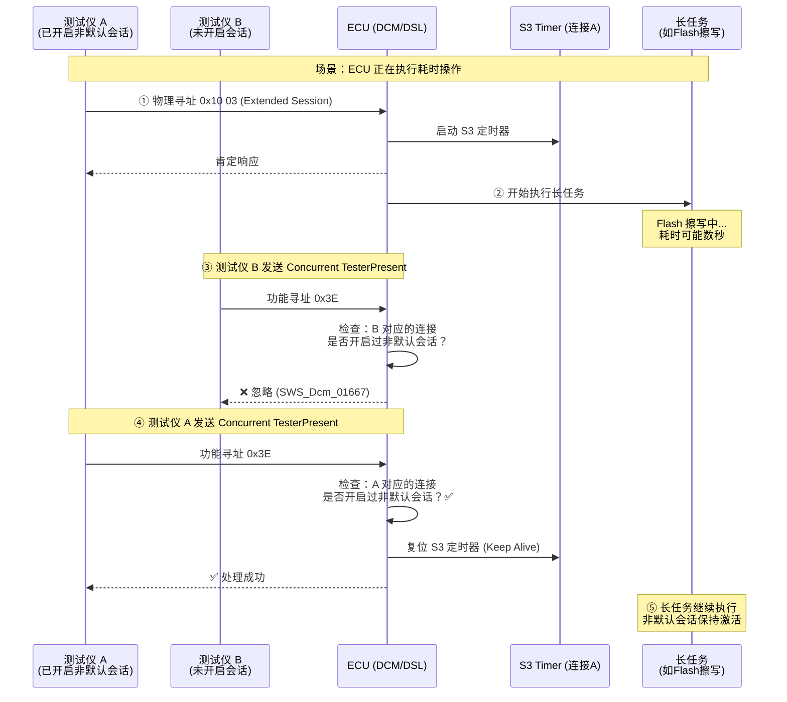
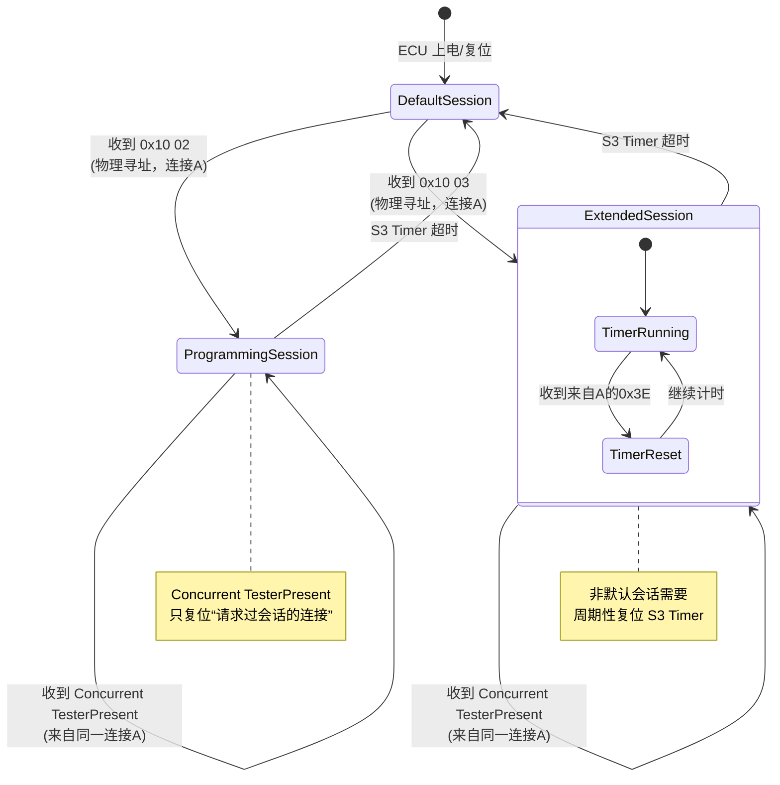
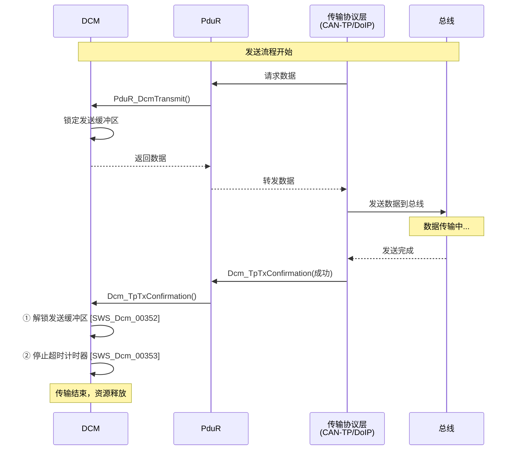
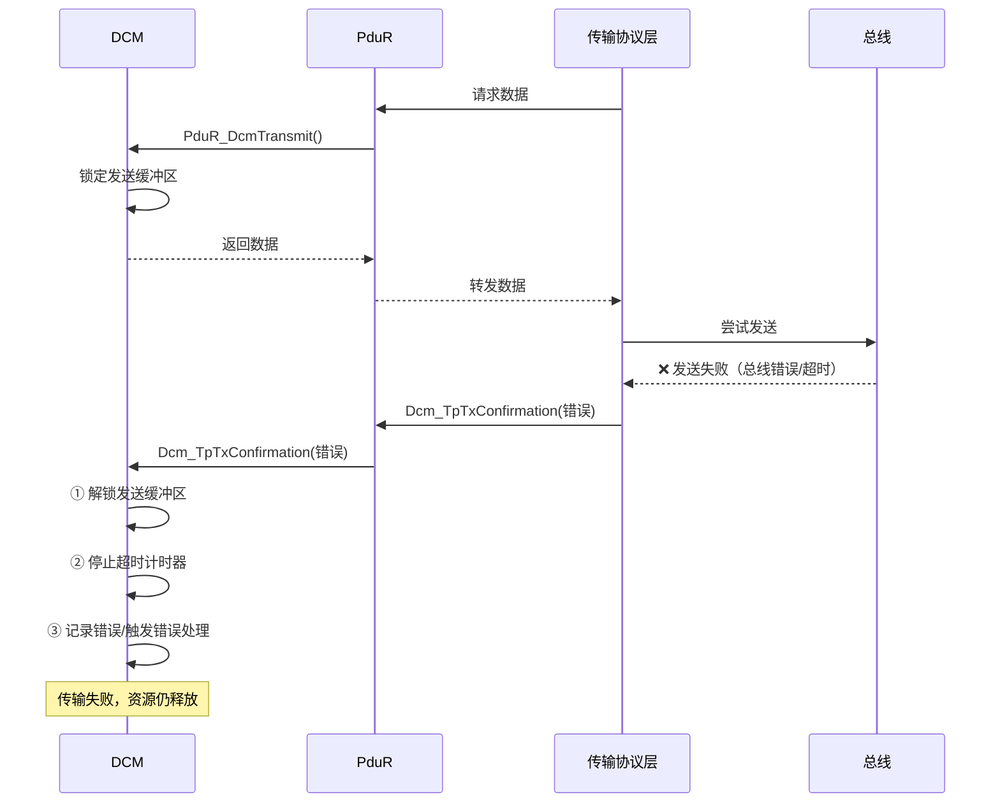
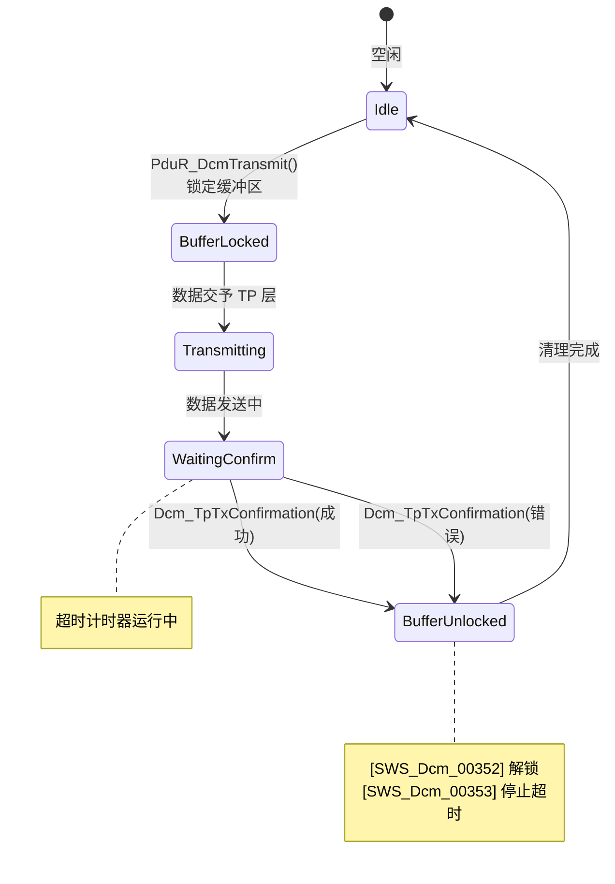

# 概述

> [!tip] 
>
> 标准文件请参见[Specification of Diagnostic Communication Manager](https://www.autosar.org/fileadmin/standards/R24-11/CP/AUTOSAR_CP_SWS_DiagnosticCommunicationManager.pdf) 

AUTOSAR **Dcm (Diagnostic Communication Manager)** 模块被划分为三个核心子模块：**DSL**、**DSD** 和 **DSP**。这种分层架构类似于 OSI 模型，将网络传输管理、请求分发和具体业务逻辑解耦。


1. DSL (Diagnostic Session Layer) —— “看门人”与“计时员”

   DSL 是 Dcm 的最底层，直接与 PduR（PDU Router）交互。它的职责不是理解诊断命令是什么，而是确保通信管道的合规性。

   - **数据流监控**：负责接收来自底层的原始诊断数据，并处理物理寻址（Physical）和功能寻址（Functional）的逻辑。
   - **会话与安全管理**：管理当前处于哪个诊断会话（如 Default, Extended）以及安全解锁状态（Security Level）。
   - **协议计时（Timing）**：这是 DSL 最关键的任务。它负责监控 $P2_{Server}$ 和 $P2^*_{Server}$ 等时间参数，确保 ECU 在规定时间内给出响应，或者在必要时发送“等候（Pending）”响应。

2. DSD (Diagnostic Service Dispatcher) —— “调度员”

   DSD 位于中间层，起到承上启下的作用。

   - **有效性检查**：当 DSL 把一串原始字节传给 DSD 时，DSD 会根据当前会话和安全等级，检查这个服务 ID（SID）是否被允许执行。
   - **分发请求**：如果检查通过，DSD 会识别 SID（例如 `0x22` 读数据），并将其转发给 DSP 中对应的处理函数。
   - **响应触发**：当 DSP 处理完逻辑后，DSD 会封装响应报文并通知 DSL 发送出去。

3. DSP (Diagnostic Service Processing) —— “业务员”

   DSP 是处理具体诊断业务的地方，它真正“读懂”诊断命令。

   - **子服务处理**：例如诊断命令 `0x31 01 AA BB`（启动例程），DSP 会解析出 `01` 是启动，`AA BB` 是具体的 Routine ID。
   - **应用层交互**：DSP 通过接口调用 RTE 中的 SW-C（软件组件）或者直接访问其他 BSW 模块（如 Dem, NvM）来获取数据或执行动作。

> [!tip] 
>
> 为了让你更直观地理解它们的关系，我们可以模拟一次 **0x22（读取 DID）** 的过程：
>
> 1. **物理层 -> DSL**：PduR 收到总线数据，交给 DSL。DSL 启动 $P2$ 定时器，并确认当前的会话允许诊断。
> 2. **DSL -> DSD**：DSL 把数据包传给 DSD。DSD 发现 SID 是 `0x22`，查询配置表发现当前安全等级允许读数据，于是把请求传给 DSP。
> 3. **DSD -> DSP**：DSP 解析出具体的 DID（例如 `0xF190` VIN 码），发现这个数据存在 NvM 里，于是调用相应接口读取。
> 4. **DSP -> DSD**：DSP 把 VIN 码的数据给 DSD。
> 5. **DSD -> DSL**：DSD 加上肯定响应标识（`0x62`），打包好给 DSL。
> 6. **DSL -> 物理层**：DSL 停止 $P2$ 定时器，通过 PduR 发送响应。


# 一般设计

## NRC

在诊断协议中，**NRC（Negative Response Code，否定响应码）** 是 ECU 与诊断仪之间沟通的“错误语言”。在诊断开发中极易被忽略但又极其重要的原则：**NRC 的优先级排序**。

1. 为什么 NRC 的顺序很重要？

   根据 ISO 14229-1 (UDS标准)，当一个诊断请求同时触发多个错误时，ECU 不能随机返回一个 NRC，必须按照协议规定的**优先级**进行判定。

   例如，如果你发送了一个长度错误且安全状态未解锁的请求：

   - 如果先判定安全（返回 `0x33`），再判定长度（返回 `0x13`），这在某些 OEM 看来是不合规的。
   - 要求 Dcm 的实现必须严格遵循 ISO 14229-1 附录中的流程图顺序。

2. Dcm 内部典型的 NRC 判定顺序

   通常情况下，Dcm 子模块（DSL -> DSD -> DSP）会按照以下逻辑链条依次检查：

   1. **SID 检查**：ECU 是否支持该服务？（不支持返回 `0x11 ServiceNotSupported`）
   2. **格式检查**：请求长度是否正确？（不正确返回 `0x13 IncorrectMessageLengthOrInvalidFormat`）
   3. **会话检查**：当前会话（Session）是否允许此操作？（不允许返回 `0x7F ServiceNotSupportedInActiveSession`）
   4. **安全检查**：是否解锁？（未解锁返回 `0x33 SecurityAccessDenied`）
   5. **条件检查**：当前车辆状态（如车速、转速）是否允许？（返回 `0x22 ConditionsNotCorrect`）
   6. **业务逻辑检查**：具体的参数是否超出范围？（返回 `0x31 RequestOutOfRange`）

3. 数据类型：Dcm_NegativeResponseCodeType

   在代码实现中，你会经常在接口中看到这个类型。它本质上是一个 `uint8`。

   - 如果你在开发一个 **SW-C（软件组件）** 来处理某个特定的 DID（0x22 服务），当你的代码逻辑发现数据异常时，你会通过 RTE 接口返回一个 `Dcm_NegativeResponseCodeType` 给 Dcm。
   - **注意**：你不需要在代码里手动加上 `0x7F` 前缀，你只需要返回类似 `0x31` 这样的代码，Dcm 的 **DSD 子模块** 会自动帮你封装成 `7F 22 31` 这样的标准报文格式。

> [!tip] 
>
> 在看 Dcm 规范时，可以尝试把 NRC 分为两类：
>
> - **Dcm 自动处理的 NRC**：如 `0x11`（服务不支持）、`0x13`（长度错误）、`0x7E`（子服务不支持）。这些通常在 DSD 层就直接判定并拦截了，请求甚至传不到应用层。
> - **应用层（SW-C）触发的 NRC**：如 `0x31`（数值不合法）、`0x22`（条件不满足）。这些需要你在 DSP 处理函数中，通过逻辑判定后主动传给 Dcm。

## 与Nvm之间的交互

在诊断系统中，许多信息必须在掉电后保持，比如**诊断会话状态（Session）**、**安全解锁状态（Security Level）**、**DTC 老化计数器**或某些**特定的 DID 数据**。

1. 非易失性信息的初始化与依赖

   - **实现特定性**：AUTOSAR 并没有强制规定 Dcm 必须通过哪种具体 API 去“拿”这些数据，或者这些数据是否必须在 `Dcm_Init` 之前就准备好。这属于系统集成的范畴，通常在配置 BswM 状态机时，会确保 NvM 先执行 `NvM_ReadAll`，待数据加载完成后再初始化 Dcm。
   - **读取校验**：Dcm 必须具备“容错逻辑”。如果 NvM 数据读取失败（比如 CRC 校验错误），Dcm 不能直接崩溃，而必须执行 **Default Reaction（默认反应）**。
     - *典型场景*：如果安全访问（Security Access）的尝试次数存储在 NvM 中但读取失败，默认反应通常是：强制锁定一段时间，防止暴力破解。

2. 服务取消与任务清理

   这是一个关于“收尾”的重要规定。诊断服务有时会因为异常情况被中止：

   - **RCRRP 超限**：当 ECU 发送了过多的 `0x78`（ResponsePending）报文，达到了配置的上限（$P2_{Server}$ 超时限制）。
   - **协议抢占（Protocol Preemption）**：例如，一个低优先级的 OBD 请求正在执行（涉及 NvM 读写），此时突然来了一个高优先级的 UDS 物理请求。

   **核心操作**：如果此时 Dcm 正在访问 NvM，它必须显式调用 `NvM_CancelJobs()`。

   - **原因**：NvM 是一个异步处理模块。如果不取消，NvM 可能会在 Dcm 已经跳转到新协议后，继续修改之前的缓冲区数据，导致内存冲突或逻辑错误。

> [!tip] 
>
> 当你深入研究 Dcm 配置时，可以留意以下几个典型的 NvM 应用场景：
>
> 1. **Programming Counter / Attempt Counter**：记录刷写次数或解锁失败次数，防止非法篡改。
> 2. **Diagnostic Session Persistence**：某些 OEM 要求在非预期复位（如看门狗复位）后，ECU 能够恢复到之前的诊断会话（如仍保持在 Programming Session）。
> 3. **Active Protocol**：记录当前正在运行的诊断协议栈状态。

## 数据类型

1. 非整型与不透明数据处理

   在诊断中，数据并不总是简单的数字（如 `uint16` 的电压值），有时是序列号、指纹信息或复杂的结构体。

   - **匹配解释**：对于 `uint8[n]` 类型的数组，Dcm 可以将其视为与其总大小匹配的整型进行处理（例如，`uint8[2]` 可能会被当做 `uint16` 进行字节序转换）。
   - **OPAQUE（不透明）模式**：
     - **定义**：如果 `DcmDspDataEndianness` 配置为 `OPAQUE`，Dcm **不会尝试解释**其中的内容。
     - **处理逻辑**：数据被视为原始的字节流（`uint8[n]`），并直接映射到对应长度的信号中。
     - **应用场景**：当你需要处理 VIN 码（字符串）、加密密钥或由应用层 SW-C 自行解析的自定义协议数据时，必须配置为 `OPAQUE`，以防止 Dcm 错误地调换字节顺序。

2. 字节序转换的扩展

   传统的诊断标准（如早期的一些定义）有时只明确了无符号整型的字节序转换。AUTOSAR Dcm 对此进行了明确扩展：

   - **支持有符号类型**：Dcm 必须支持对有符号整型（如 `sint8`, `sint16`, `sint32`）执行大端（Big-endian/MSB first）或小端（Little-endian/LSB first）转换。
   - **配置项**：具体的转换规则由 `DcmDspData` 中的 `DcmDspDataEndianness` 参数决定。在 UDS 协议中，通常默认使用 **大端模式（Big-endian）**。

> [!tip] 
>
> 在进行 Dcm 配置（例如配置一个用于读取车速的 DID）时，这几个需求对应的实战意义如下：
>
> 1. **高低字节反了？**
>
>    如果你在诊断仪上看到的十六进制值是 `01 02`，但应用层收到的值是 `0x0201`，这通常是因为 `DcmDspDataEndianness` 配置成了小端，而诊断协议通常期望大端。
>
> 2. **字符串乱码？**
>
>    处理像 VIN 码这样的 ASCII 字符串时，**千万不要使能字节序转换**。必须将该 Data 配置为 `OPAQUE`，否则 Dcm 可能会为了“转换字节序”而把你的字符串顺序前后颠倒。
>
> 3. **对齐问题**：
>
>    必须映射到 $n$ 字节信号。这意味着 Dcm 不会对 `OPAQUE` 数据进行位偏移（Bit-shifting）或压缩，它必须是整字节对齐的。

### 原子类型数据

|                      | ATOMIC           | ==    | ==     | ==     | ==    | ==     | ==     |
| -------------------- | ---------------- | ----- | ------ | ------ | ----- | ------ | ------ |
| Data bit size        | 1 (Byte aligned) | 8     | 16     | 32     | 8     | 16     | 32     |
| DcmDspDidDataType    | BOOLEAN          | UINT8 | UINT16 | UINT32 | SINT8 | SINT16 | SINT32 |
| DcmDspDataEndianness | N/A              | N/A   | LE,BE  | LE,BE  | N/A   | LE,BE  | LE,BE  |
| DcmDspDataUSe Port   | S/R, C/S and I/O | ==    | ==     | ==     | ==    | ==     | ==     |
| resulting ImplType   | BOOLEAN          | UINT8 | UINT16 | UINT32 | SINT8 | SINT16 | SINT32 |

1. 字节序（Endianness）的适用范围

   - **N/A (不适用)**：可以看到 `BOOLEAN`、`UINT8` 和 `SINT8` 的字节序配置都是 **N/A**。
     - **原理**：因为它们只占用 1 个字节（或更少），不存在多字节排列顺序的问题。
   - **LE, BE (支持切换)**：只有位宽 $\ge 16$ 位的类型（`UINT16/32`, `SINT16/32`）才需要配置 `DcmDspDataEndianness`。

2. 布尔型的特殊对齐

   **1 (Byte aligned)**：虽然 `BOOLEAN` 逻辑上只有 1 位，但在 Dcm 处理诊断数据（DID）时，它被定义为 **字节对齐**。

   - **实战意义**：在 UDS 报文中，如果你定义一个 DID 包含一个布尔值，它通常会占用 1 个完整的 Byte，而不是和其他位挤在一起（除非使用了特殊的位偏移配置）。

3. 端口接口（Use Port）

   表格中提到 `S/R (Sender/Receiver)`、`C/S (Client/Server)` 和 `I/O`。

   - 这说明这些原子类型在 Dcm 与应用层 SW-C 交互时，可以通过多种 RTE 接口实现。
   - 例如：你读取一个 VIN 码（UINT8 数组），Dcm 可能会通过 **Client/Server** 接口调用你的 `Data_Read` 函数。

4. 最终实现类型（resulting ImplType）

   这一行告诉你编译器（如你的 IAR）最终看到的变量类型：

   - 在 Dcm 配置工具（如 DaVinci Configurator）中选定 `DcmDspDidDataType` 后，生成的代码会自动使用 `uint16`、`sint32` 等标准类型。

> [!tip] 
>
> - **Atomic vs OPAQUE**：这张表里都是 **Atomic（原子）** 类型，意味着 Dcm “认识”这些数据，并能帮你做字节序转换和符号扩展。
> - **如果你配置为 OPAQUE**：它就不会出现在这个原子类型表里。对于 Dcm 来说，OPAQUE 就是一串 `uint8` 数组，它不关心里面是 `float` 还是几个 `uint16` 的组合。


### 数组数据类型

|                      | Field (Static)            | ==                        | ==                          | ==                         | ==                    | ==                         | Field (Dynamic)          |
| -------------------- | ------------------------- | ------------------------- | --------------------------- | -------------------------- | --------------------- | -------------------------- | ------------------------ |
| Data bit size        | 8-8*N                     | ==                        | 16-16*N                     | ==                         | 32-32*N               | ==                         | 8-8*N                    |
| DcmDspDataByteSize   | Any                       | ==                        | (size MOD 2)==0             | ==                         | (size MOD 4)==0       | ==                         | Any                      |
| DcmDspDidDataType    | UINT8_N                   | SINT8_N                   | UINT16_N                    | SINT16_N                   | UINT32_N              | SINT32_N                   | UINT8_DYN                |
| DcmDspDataEndianness | N/A                       | ==                        | LE,BE                       | ==                         | ==                    | ==                         | N/A                      |
| DcmDspDataUSe Port   | S/R, C/S, FNC, NVM        | S/R,C/S                   | ==                          | ==                         | ==                    | ==                         | C/S,FNC                  |
| resulting ImplType   | DataArrayTypeUint8_(Data) | DataArrayTypeSint8_(Data) | DataArrayTypeUint16_(Data） | DataArrayTypeSint16_(Data) | taArrayTypeUint32_(Da | DataArrayTypeSint32_(Data) | DataArrayTypeUint8_(Data |

1. 静态数组 vs. 动态数组 (Field Static vs. Dynamic)

   这是最关键的区别，决定了内存分配和数据交换的方式。

   - **静态数组 (Field Static)**：
     - 长度在配置阶段就是**固定**的（如 $8 \cdot N$）。
     - 适用于 VIN 码、硬件版本号等长度永远不变的数据。
   - **动态数组 (Field Dynamic - `UINT8_DYN`)**：
     - 报文长度在运行时可以变化。
     - **限制**：你会发现动态数组只支持 `UINT8_DYN`。这意味着如果你要传输动态长度的数据，Dcm 默认将其视为原始字节流（类似 OPAQUE 处理）。
     - **接口限制**：动态数据仅支持 `C/S` (Client/Server) 和 `FNC` (Function调用)，不支持 `S/R` (Sender/Receiver)，因为标准的 S/R 接口通常要求固定长度。

2. 字节对齐与对齐约束 (`size MOD X == 0`)

   这是在集成开发中最容易出错的地方。为了确保 Dcm 能够正确执行字节序转换（LE/BE），数组的总字节数必须符合其基本类型的倍数：

   - **`UINT16_N` / `SINT16_N`**：总字节数必须是 2 的倍数 (`size MOD 2 == 0`)。
   - **`UINT32_N` / `SINT32_N`**：总字节数必须是 4 的倍数 (`size MOD 4 == 0`)。
   - **原理**：如果一个 `UINT32_N` 的数组总长度是 7 个字节，Dcm 就无法完整地将最后一个元素按 4 字节进行大端或小端反转。

3. 数据使用端口 (DcmDspDataUse Port)

   这张表增加了一个重要的选项：**`NVM`**。

   - 对于 `UINT8_N` 或 `SINT8_N`（静态数组），Dcm 可以直接与 NvM 模块交互。
   - **应用场景**：比如某些写入后需要永久保存的配置参数。你可以直接在配置工具里把这个 DID 映射到 NvM 的一个 Block，而**不需要写任何应用层 C 代码**（通过 `NvM_ReadBlock` / `NvM_WriteBlock` 自动完成）。

4. 最终生成的 ImplType

   注意到底部的类型定义变成了 `DataArrayType...`。在 IAR 编译环境中，这通常会被定义为一个结构体或数组别名。例如：

   ```c
   typedef uint8 DataArrayTypeUint8_17[17]; // 假设 N=17
   ```

- **原子类型** 关注的是“这一个数怎么解析”。
- **数组类型** 关注的是“这一堆数怎么排布，以及内存够不够分”。

### 嵌套数据类型

AUTOSAR Dcm 处理复杂数据结构的核心哲学：**通过“池化引用”实现无限嵌套**。

在传统的诊断开发中，DID 通常是扁平的（一串信号排开）。但现代汽车电子需要处理如“传感器序列”或“配置快照”这类具有逻辑层次的数据。为了在配置（ARXML）中描述这种层级，Dcm 引入了 **CompositePool（复合池）** 机制。

1. 嵌套机制的“三位一体”结构

   嵌套配置由三个关键组件构成：

   - **Anchor Object（锚点对象）**：这是嵌套结构的**根（Root）**。
     - 如果它是一个简单的 `uint8`，它就是终点。
     - 如果它代表一个结构体，它就变成了一个“容器”，指向池中的元素。
   - **Composite Pool（复合池）**：这是一个**备选零件库**。它存储了所有可能被嵌套引用的子元素（信号、数组或子结构体）。
   - **Composite Reference（复合引用）**：这是**连接线**。它定义了父结构体具体包含了池中的哪些元素。

2. 核心逻辑：从配置到内存的映射，这种设计解决了两个棘手问题：

   1. 递归嵌套

      由于池中的元素（Pool Element）本身又可以作为新的“锚点”并引用更深层的池元素，这允许你定义极其复杂的 C 语言结构，例如：

      > `Structure A` -> 包含 `Array B` -> `Array B` 的每个元素是 `Structure C` -> `Structure C` 包含 `Primitive D`。

   2. 位置解耦与绝对偏移

      无论嵌套多深，子元素的 `ByteOffset` 必须是**相对于整个 DID 开头的绝对偏移量**。

      - **好处**：Dcm 在运行时解析数据时，不需要进行复杂的递归地址计算，直接根据绝对偏移量从缓存区取数即可，极大地提高了诊断响应的实时性。

3. 约束与边界保护（防止配置冲突）

   规范中提到的几个 [SWS] 编号实际上是在为这种灵活性划定“红线”：

   - **独占性 [SWS_Dcm_01633]**：如果一个信号变成了嵌套容器，它就不能再拥有自己的 `DataRef`（因为它的数据是由子元素构成的）。
   - **空间包含 [SWS_Dcm_01635]**：父结构体定义的 `ByteSize` 必须像一个信封，把所有子元素严丝合缝地包裹在内，不允许子元素“溢出”到父节点定义的空间之外。
   - **唯一性 [SWS_Dcm_01637]**：池里的每个元素只能被引用一次，防止在同一个结构体里出现两个完全重叠的物理定义。

> [!note] 
>
> 你可能会觉得这比在 IAR 里写一个 `struct` 麻烦得多。但 AUTOSAR 这样设计的目的是为了**工具链的自动化**：
>
> 1. **诊断调查问卷（CDD/ODX）对接**：这种嵌套定义可以自动导出为 ODX 文件，让诊断仪知道如何拆解这个复杂的 DID。
> 2. **RTE 自动生成**：基于这些引用关系，RTE 会自动生成复杂的 C 结构体定义和映射代码，确保应用层 SW-C 拿到的数据结构与总线上的原始字节流完全一致。


由上图可知，存在三个逻辑岛：

1. 核心容器岛：DcmDspDid 与 DcmDspDidSignal

   - **DcmDspDid**: 这是最外层的容器。它包含多个 `DcmDspDidSignal`。
   - **DcmDspDidSignal**: 这是最核心的配置项，代表 DID 中的一个“数据段”。它有两个基础参数：
     - **`DcmDspDidByteOffset`**: 决定该信号在报文中的绝对位置（起始字节）。
     - **`DcmDspDataByteSize`**: 决定该信号占用的总长度。

2. 传统/简单模式：DcmDspDidDataRef

   这是你最开始接触的那种扁平定义：

   - **路径**：`DcmDspDidSignal` -> `DcmDspDidDataRef` -> `DcmDspData`。
   - **逻辑**：它直接引用一个具体的数据类型定义（如 `UINT16`、`UINT8_N`）。
   - **互斥规则**：注意图中 `DcmDspDidDataRef` 的 `upperMultiplicity = 1`。根据规范 [SWS_Dcm_01633]，如果一个信号使用了这种直接引用，它通常就不再使用嵌套引用。

3. 嵌套/复合模式：CompositePool 与 CompositeRef

   - **DcmDspDidSignalCompositePool**: 它是 `DcmDspDid` 下属的一个子容器，类似于一个“零件箱”。
   - **DcmDspDidSignalCompositeRef**: 这是一个引用（Reference）。
   - **嵌套实现**：
     - 一个 `DcmDspDidSignal`（作为父结构体）可以通过 `CompositeRef` 指向 `CompositePool` 里的元素。
     - 关键点在于递归：你会发现 `DcmDspDidSignalCompositePool` 下面又可以包含 `DcmDspDidSignal`。
     - **这正是实现“无限嵌套”的 UML 表达：信号包含引用，引用指向池，池里又是信号。**

> [!tip] 
>
> 假设我们要定义一个读取“动力电池组状态”的 DID。
>
> 1. 核心容器 (DcmDspDid)
>
>    这是最外层的结构，代表整个诊断数据包。
>
>    ```c
>    /* 对应 DcmDspDid：地基/大箱子 */
>    typedef struct {
>        /* 这里的每一个成员，在配置里都是一个 DcmDspDidSignal */
>    
>        // 方案 A：传统简单模式
>        uint16 BatteryVoltage; 
>    
>        // 方案 B：嵌套复合模式（结构体 A）
>        BatteryPack_t PackStatus; 
>    
>    } Dcm_Did_BatteryInfo_t;
>    ```
>
> 2. 传统简单模式 (Simple Mode)
>
>    这种模式下，`DcmDspDidSignal` 直接通过 `DataRef` 指向一个基础类型。
>
>    ```c
>    /* 这就是【传统简单模式】
>       在配置中：Signal_BatteryVoltage -> DataRef -> UINT16
>       它直接就是一个物理值，没有内部结构。
>    */
>    uint16 BatteryVoltage; // 占 2 个字节，Offset = 0
>    ```
>
> 3. 嵌套复合模式 (Nested/Composite Mode)
>
>    这就是“零件池”与“引用”发挥作用的地方。它对应 C 语言中的嵌套结构体。
>
>    ```c
>    /* 这就是【DcmDspDidSignalCompositePool】：零件池
>       这里定义了“电池组”这个大零件内部包含哪些小零件。
>    */
>    typedef struct {
>        uint16 Temp_Sensor1; // 零件 X (池元素)
>        uint16 Temp_Sensor2; // 零件 Y (池元素)
>        uint8  FanStatus;    // 零件 Z (池元素)
>    } BatteryPack_t;
>          
>    /* 这就是【嵌套复合模式】的锚点信号
>       在配置中：Signal_PackStatus -> CompositeRef -> 引用了上面的池元素
>    */
>    BatteryPack_t PackStatus; // 占 5 个字节，Offset = 2
>    ```
>
> 我们可以把整个报文的内存布局写出来，你会看得更清楚：
>
> | **字节偏移** | **变量名**              | **模式类别**     | **逻辑岛关系**             |
> | ------------ | ----------------------- | ---------------- | -------------------------- |
> | **0**        | `BatteryVoltage` (High) | **传统简单模式** | 信号直接映射到 `uint16`    |
> | **1**        | `BatteryVoltage` (Low)  | **传统简单模式** | 直接引用基础类型           |
> | ---          | ---                     | ---              | ---                        |
> | **2**        | `PackStatus.Temp1` (H)  | **嵌套复合模式** | `Signal_PackStatus` (锚点) |
> | **3**        | `PackStatus.Temp1` (L)  | **嵌套复合模式** | 通过 `CompositeRef`        |
> | **4**        | `PackStatus.Temp2` (H)  | **嵌套复合模式** | 引用 `CompositePool`       |
> | **5**        | `PackStatus.Temp2` (L)  | **嵌套复合模式** | 中的子信号                 |
> | **6**        | `PackStatus.FanStatus`  | **嵌套复合模式** | 最终构成一个 `struct`      |

实际上，规范中还划定了原子信号（Leaf Signal）**与**复合信号（Nested/Composite Signal）之间的严格界限。

1. “容器信号”的身份转变 [SWS_Dcm_01633]

   当你决定让一个 `DcmDspDidSignal` 包含子元素时（即引用了 `CompositeRef`），它的角色就从“数据载体”变成了“空间描述符”。

   - **参数剥离**：它被禁止拥有 `DcmDspDidDataRef`。这意味着这个父信号本身不再具备 `UINT8` 或 `UINT16` 等具体的数据类型属性。
   - **唯一职责**：它只负责声明自己在整个 DID 报文里**占多大坑**（Size）以及**从哪开始**（Offset）。具体的数据解析交由它包含的子信号完成。

2. 绝对坐标系的强制要求 [SWS_Dcm_01636]

   这是 Dcm 配置中最容易产生逻辑偏差的地方。通常我们在 C 语言中处理结构体偏移是相对父节点的，但 AUTOSAR Dcm 坚持使用**绝对偏移（Absolute Offset）**。

   > **举例说明：**
   >
   > 假设一个 DID 报文。
   >
   > - **根结构体 A**：Offset = 10, Size = 4。
   > - **子信号 B**（位于 A 内部）：它的 Offset 必须写成 **10**（如果它是第一个字节），而**不能**写成 0。
   > - **子信号 C**（位于 A 内部）：它的 Offset 必须写成 **12**（如果是第三个字节），而**不能**写成 2。

   **这种设计的好处**：Dcm 的内部引擎（DSP 子模块）在提取数据时，可以实现“扁平化搜索”。它不需要递归计算地址，只需要遍历当前 DID 下的所有叶子信号，直接根据绝对地址去缓冲区拿数即可。

3. 池化元素的唯一性与闭环 [SWS_Dcm_01637] & [SWS_Dcm_01638]

   - **禁止重叠引用**：`CompositePool` 里的元素就像物理存在的零件，一个零件不能同时装在两个支架上。这保证了 DID 报文内存布局的唯一性，防止出现“一个内存字节被两个不同信号定义”的配置逻辑冲突。
   - **作用域闭环**：引用不能跨越 DID。你不能在读取 DID `0xF190` 时，去引用定义在 `0xF180` 池子里的信号。

4. 逻辑映射表 [SWS_Dcm_01639]

   规范中提到的这一段非常有价值，它告诉我们这套嵌套逻辑是**高度复用**的。你可以直接把这套理解平移到其他服务中：

   | **DID 配置项**    | **Routine (0x31) 对应项**             | **含义**             |
   | ----------------- | ------------------------------------- | -------------------- |
   | `DcmDspDidSignal` | `DcmDsp<Action>Routine<In/Out>Signal` | 结构体/信号锚点      |
   | `CompositePool`   | `...SignalCompositePool`              | 零件池（子元素仓库） |
   | `CompositeRef`    | `...SignalCompositeSignalRef`         | 嵌套连接线           |

并且在规范中明确告诉我们：你在 DID（0x22/0x2E 服务）中学会的那套复杂的嵌套逻辑，可以无缝平移到 **Routine Control（0x31 服务）** 的所有输入输出场景中。

1. 为什么 Routine 需要这种复杂的嵌套？

   在简单的 ECU 中，启动一个例程（Routine）可能只需要一个简单的 ID。但在复杂的控制器（如网关、智驾域控）中，`0x31` 服务往往承载着极重的任务：

   - **输入 (In)**：比如“请求指纹校验”，输入参数可能包含：`{算法ID, 公钥长度, 公钥数据[], 随机数}`。
   - **输出 (Out)**：例程完成后返回的数据，可能包含：`{校验结果, 错误代码, 剩余尝试次数}`。

   如果不用嵌套结构，开发者只能将这些参数定义为一串扁平的、难以维护的字节数组。使用嵌套结构后，Dcm 可以自动根据配置完成**字节序转换**和**数据对齐**。

2. 映射关系深度拆解

   我们可以将这种对应关系看作是“换汤不换药”的逻辑映射：

   | **逻辑角色** | **DID 领域 (Data Identifier)** | **Routine 领域 (Service 0x31)**                |
   | ------------ | ------------------------------ | ---------------------------------------------- |
   | **容器主体** | `DcmDspDid`                    | `DcmDspStartRoutineIn` (及其 Out/Stop 等)      |
   | **信号锚点** | `DcmDspDidSignal`              | `DcmDspStartRoutineInSignal`                   |
   | **零件池**   | `DcmDspDidSignalCompositePool` | `DcmDspStartRoutineInSignalCompositePool`      |
   | **连接引用** | `DcmDspDidSignalCompositeRef`  | `DcmDspStartRoutineInSignalCompositeSignalRef` |

3. 以 `StartRoutineIn` 为例

   当你配置一个 Routine 的输入参数时，遵循这套映射逻辑会带来以下好处：

   1. **一致的偏移量算法**：

      根据 **[SWS_Dcm_01636]**，即使是 `StartRoutineInSignal` 的嵌套子元素，其 `ByteOffset` 也是相对于整个诊断请求报文（即 `SID + SubFunction + RoutineID` 之后的部分）的**绝对位置**。

   2. **自动接口生成**：

      RTE 会根据这些嵌套定义，为应用层的 Routine 处理函数（如 `Rte_Call_RoutineServices_..._Start`）生成结构化良好的 C 语言参数类型。

   3. **支持 RCRRP (0x78) 响应**：

      由于 Routine 往往耗时较长，如果参数配置为结构化数据，Dcm 在发送 `Pending` 响应及最终结果回复（RequestResults）时，能更精确地管理内存缓冲区。

具体的对应关系为：

1. DcmDspDid 对应
   1.  DcmDspStartRoutineIn
   2.  DcmDspStartRoutineOut
   3.  DcmDspStopRoutineIn
   4.  DcmDspStopRoutineOut
   5.  DcmDspRequestRoutineResultsIn
   6.  DcmDspRequestRoutineResultsOut
2. DcmDspDidSignal 对应
   1. DcmDspStartRoutineInSignal
   2. DcmDspStartRoutineOutSignal
   3. DcmDspStopRoutineInSignal
   4. DcmDspStopRoutineOutSignal
   5. DcmDspRequestRoutineResultsInSignal
   6. DcmDspRequestRoutineResultsOutSignal
3. DcmDspDidSignalCompositePool对应
   1. DcmDspStartRoutineInSignalCompositePool
   2. DcmDspStartRoutineOutSignalCompositePool
   3. DcmDspStopRoutineInSignalCompositePool
   4. DcmDspStopRoutineOutSignalCompositePool
   5. DcmDspRequestRoutineResultsInSignalCompositePool
   6. DcmDspRequestRoutineResultsOutSignalCompositePool
4. DcmDspDidSignalCompositeRef 对应
   1. DcmDspStartRoutineInSignalCompositeSignalRef
   2. DcmDspStartRoutineOutSignalCompositeSignalRef
   3. DcmDspStopRoutineInSignalCompositeSignalRef
   4. DcmDspStopRoutineOutSignalCompositeSignalRef
   5. DcmDspRequestRoutineResultsInSignalCompositeSignalRef
   6. DcmDspRequestRoutineResultsOutSignalCompositeSignalRef

我们可以看以下例子：


在图中，整个诊断请求报文就像一把尺子。

- **结构体 A (锚点)**：
  - `Pos = 2`：从尺子的刻度 2 开始。
  - `Size = 4`：一直占到刻度 6 之前。
- **信号 X (叶子节点)**：
  - 注意！它的 `Pos` 也是 **2**（绝对位置），而不是相对于 A 的 0。
  - `Size = 1`，类型是 `UINT8`。
- **信号 Y (叶子节点)**：
  - `Pos = 4`（绝对位置）。
  - `Size = 2`，类型是 `UINT16`。
- **Gap (间隙)**：刻度 3 的位置被空出来了，这在诊断协议里很常见，比如保留位。

这张图展示了在配置工具里，把这个结构描述给 Dcm 听。


1. 第一岛：核心容器 (The Root)

   左上角的 **DcmDspStartRoutineIn** 就是大箱子。它是 `Signal_A` 和 `Pool_X/Y` 的共同父节点。

2. 第二岛：锚点信号 (The Anchor) —— 绿色的 Signal_A

   它是入口。它不直接连数据类型，而是干了两件事：

   1. **占位**：告诉 Dcm 它在 `Pos=2`，大小为 `4`。
   2. **引用**：通过两个蓝色的 **CompositeSignalRef**，像磁铁一样把池子里的零件 X 和 Y 吸过来。

3. 第三岛：零件池 (The Pool) —— 橙色的 ContainedPool

   这就是你之前不太理解的“零件池”。

   - **Pool_X** 和 **Pool_Y** 住在池子里。
   - 每个池子元素下面都挂着一个真正的叶子信号（底部的绿色方块）。这些叶子信号才真正定义了 `Pos`、`Size` 和具体的 `DataType` (如 `UINT16`)。

如果 Dcm 根据这两张图生成代码，你会得到类似这样的定义：

```
/* 对应 Figure 7.5 的内存布局 */
typedef struct {
    /* Offset 0, 1: 可能是其他信号或 Routine ID */
    uint8 _reserved_0_1[2]; 

    /* 下面是结构体 A 的内容 (Offset 2 到 5) */
    struct {
        uint8  Signal_X;     /* Pos: 2, Size: 1 (UINT8)  */
        uint8  _gap;         /* Pos: 3, 这是一个空隙 */
        uint16 Signal_Y;     /* Pos: 4, Size: 2 (UINT16) */
    } Signal_A;

    /* Offset 6 之后是其他内容 */
} StartRoutineIn_t;
```

> [!tip] 
>
> 你可能会问：“我直接定义一个结构体 A 不就行了吗？为什么要搞出 Pool 和 Ref 这种弯弯绕？”
>
> 1. **绝对位置的强制性**：通过 `Pool` 和 `Ref`，配置工具可以强制校验 `Signal_X` 的位置（2）是否真的在 `Signal_A` 的范围（2~6）内。
> 2. **跨服务的统一性**：正如 [SWS_Dcm_01639] 所说，这套逻辑可以原封不动地搬到 `StopRoutine` 或 `RequestResults` 里。只要你学会了这一套，所有的复杂诊断数据你都能配出来。

### 数据类型限制


1. 数组必须声明“总体大小”

   - **规则 [SWS_Dcm_CONSTR_06002/06012]**：

     如果你用的是 `_N` 结尾的数组类型（如 `UINT16_N`），你必须明确填写 `DcmDspDataByteSize`。

   - **逻辑解释**：

     对于单体（Primitive）类型（如 `UINT16`），Dcm 知道它肯定是 2 字节。但对于数组，Dcm 必须知道这个数组到底包含多少个元素，才能分配内存。

2. 对齐铁律：不许“切断”基本单元

   - **规则 [SWS_Dcm_CONSTR_06035/06036]**：

     - 如果是 `UINT16_N` 数组，总字节数必须是 **2 的倍数**。
     - 如果是 `UINT32_N` 数组，总字节数必须是 **4 的倍数**。

   - **逻辑解释**：

     Dcm 需要对数组里的每个元素做字节序转换（Endianness Conversion）。如果一个 `UINT32_N` 数组你只给 7 个字节，最后一个元素就只剩 3 个字节了，Dcm 没法对这个“残缺”的 32 位数进行大端转小端的翻转。

3. 动态长度的“排队”原则

   - **规则 [SWS_Dcm_CONSTR_06011]**：

     在 Routine（0x31 服务）的参数列表中，`VARIABLE_LENGTH`（变长参数）只能出现在**最后一个**。

   - **逻辑解释**：

     这和 C 语言的变参函数（如 `printf`）逻辑一致。如果变长参数放在中间，Dcm 就无法通过偏移量（Offset）定位到它后面的参数了。

4. 通信接口的“死板”要求

   - **规则 [SWS_Dcm_CONSTR_06026]**：

     如果你配置 DID 的方式是通过 **Sender/Receiver (S/R)** 接口、**NvM** 访问或者直接访问 **ECU 信号**，那么**严禁使用变长数据**。

   - **逻辑解释**：

     RTE 的 S/R 接口和 NvM 的 Block 都是基于**静态内存分配**的。它们在编译时就需要确定固定的大小。如果你想传动态长度的数据，只能使用 **Client/Server (C/S)** 接口，因为 C/S 接口允许在调用时传递一个长度参数（Length）。

如果你违反了这些约束，通常会发生以下两种情况：

1. **配置工具报错**：在你生成代码（Generate）之前，工具会弹出一堆 Error，告诉你“Size must be a multiple of 4”。
2. **代码运行异常**：如果你强行绕过检查，生成的 `Rte_Type.h` 里的数组长度可能与你预想的不符，导致诊断仪读取时出现 `0x13` (NRC IncorrectMessageLength)。

| **约束场景** | **关键参数**   | **强制要求摘要**     |
| ------------ | -------------- | -------------------- |
| **16位数组** | `UINT16_N`     | `ByteSize % 2 == 0`  |
| **32位数组** | `UINT32_N`     | `ByteSize % 4 == 0`  |
| **变长信号** | `UINT8_DYN`    | 必须放在参数列表最后 |
| **S/R 接口** | `USE_DATA_S/R` | 必须是固定长度       |

### Dcm操作状态类型


作为嵌入式软件开发人员，你可以把 `Dcm_OpStatusType` 理解为 Dcm 与应用层（SW-C）之间的一种“握手协议”。它主要解决一个矛盾：诊断服务（如刷写、复杂的 Routine 运算）可能需要几秒钟，但 `Dcm_MainFunction` 必须毫秒级循环，不能死等。

1. DCM_INITIAL：第一次亲密接触 [SWS_Dcm_00527]
   - **场景**：当 Dcm 刚收到一个诊断请求（如 `0x31` 启动 Routine），第一次调用你的回调函数时。
   - **逻辑**：此时 `OpStatus` 必定为 `DCM_INITIAL`。
   - **你的任务**：在这个状态下进行初始化，比如检查参数合法性、开启定时器或触发底层驱动。
2. DCM_E_PENDING：让 Dcm “等一下” [SWS_Dcm_00530]
   - **场景**：你的任务还没做完（比如正在擦除 Flash），无法立刻给诊断仪回复。
   - **逻辑**：你向 Dcm 返回 `DCM_E_PENDING`。
   - **后续调用**：Dcm 会在下一个 `Dcm_MainFunction` 循环中再次调用你，此时 `OpStatus` 变为 `DCM_PENDING`。
   - **注意**：只要你一直返回 `PENDING`，Dcm 就会一直用这个状态“骚扰”你，直到你返回 `E_OK` 或错误 NRC。
3. DCM_E_FORCE_RCRRP：主动申请“缓期执行” [SWS_Dcm_00528]
   - **场景**：你预感到这次操作时间很长（超过了 $P2_{Server}$ 时间），为了防止诊断仪超时报错误，你需要给诊断仪发一个 **NRC 0x78 (Response Pending)**。
   - **逻辑**：你返回 `DCM_E_FORCE_RCRRP`。
   - **Dcm 动作**：Dcm 收到后会立刻向总线发送一帧 `7F XX 78`。在这个过程中，它**不会**再调用你的函数，避免重入冲突。
4. DCM_FORCE_RCRRP_OK：你可以继续了 [SWS_Dcm_00529]
   - **场景**：上一步提到的 NRC 0x78 已经成功发到了总线上。
   - **逻辑**：Dcm 确认发送成功后，会再次调用你的函数，此时 `OpStatus` 变为 `DCM_FORCE_RCRRP_OK`。
   - **你的任务**：看到这个状态，说明你已经成功“续命”了，可以接着上次中断的地方继续干活。

假设你在编写一个 Routine 的处理函数：

```c
Std_ReturnType MyRoutine_Start(Dcm_OpStatusType OpStatus, ...) {
    switch (OpStatus) {
        case DCM_INITIAL:
            // 步骤 1: 启动异步硬件操作
            Start_Async_Hardware_Job();
            return DCM_E_PENDING; // 告诉 Dcm：我刚开始，还要等

        case DCM_PENDING:
            // 步骤 2: 轮询硬件状态
            if (Check_Hardware_Job_Done()) {
                return E_OK; // 任务完成！
            } else if (Is_Almost_Timeout()) {
                return DCM_E_FORCE_RCRRP; // 快超时了，赶紧申请发 0x78
            }
            return DCM_E_PENDING; // 还没完，继续等

        case DCM_FORCE_RCRRP_OK:
            // 步骤 3: 0x78 发完了，重置内部计时器，继续轮询
            Reset_Internal_Timer();
            return DCM_E_PENDING;

        default:
            return E_NOT_OK;
    }
}
```

- **INITIAL** 是开始。
- **PENDING** 是中间循环。
- **FORCE_RCRRP** 是“发救命信号”。
- **FORCE_RCRRP_OK** 是“救命信号发完了，继续工作”。

这种设计确保了嵌入式系统不会因为诊断操作而导致主循环卡死，同时也保证了诊断协议的时间合规性。

### 生成符号

Dcm 模块通过生成符号名（Symbolic Names）来简化应用层（SWC）对 **CEMR（Control Enable Mask Record）** 的操作。

在 UDS 协议的 **0x2F (InputOutputControlByIdentifier)** 服务中，CEMR 是一个非常关键的掩码，用于告知 ECU 哪些信号应该受诊断仪控制，哪些应该维持原样。

1. 为什么要生成符号名？

   手动处理 CEMR 位掩码在嵌入式开发中非常容易出错，原因有三：

   - **大端序与位顺序的矛盾**：规范提到，网络上发送的第一个位控制 DID 的第一个参数，但在多字节内存布局中，这个位可能是最高有效位（MSB）。开发者很容易在进行 `(1 << n)` 操作时算错位置。
   - **配置变更的鲁棒性**：如果 DID 的参数长度发生变化，对应的位偏移（Bit Offset）也会随之改变。使用符号名可以确保代码在配置更新后只需重新编译，而不需要手动修改位掩码数值。
   - **代码可读性**：相比于 `Mask = 0x80`，使用 `Dcm_Cemr_MyDid_SignalA` 显然更直观。

2. Dcm_Cemr_{DID}Type 的实现逻辑

   根据 **[SWS_Dcm_91087]**，Dcm 会为具有 IO Control 功能的 DID 的每个数据元素生成一个文本表（Text Table）或枚举。

   - **生成规则**：对于每一个受控信号，Dcm 都会计算其在 CEMR 字节流中的准确位置。
   - **使用方式**：SWC（应用层软件组件）通过这些生成的符号名作为掩码（Mask），对接收到的控制请求进行位运算，从而提取出具体的控制许可。

假设你有一个名为 `CoolingFan` 的 DID，包含两个控制位：`FanSpeed` 和 `FanRelay`。

**不使用符号名（危险且难读）：**

```c
/* 开发者必须自己根据规范计算掩码 */
if (ControlMask & 0x80) { // 假设第一个位对应 FanSpeed
    // 执行控制
}
```

**使用 Dcm 生成的符号名（安全且标准）：**

```c
/* Dcm 会在 Dcm_Cfg.h 或 Rte_Dcm_Type.h 中生成类似定义 */
#define Dcm_Cemr_CoolingFan_FanSpeed  ((uint8)0x80)
#define Dcm_Cemr_CoolingFan_FanRelay  ((uint8)0x40)

/* 应用层代码 */
if (ControlMask & Dcm_Cemr_CoolingFan_FanSpeed) {
    // 自动映射到正确的网络位，无需担心字节序问题
}
```

# DSL：诊断服务层

**DSL (Diagnostic Session Layer)** 是 Dcm 模块的门卫，它不关心 DID 里具体是什么数，它只关心诊断仪和 ECU 之间的**状态、时间和权限**。

根据你提供的规范描述，我们可以将 DSL 的核心职责拆解为以下四个关键领域：

1. 会话管理 (Session Handling) [SWS_Dcm_00030]

   这是 DSL 最基础的功能，完全遵循 ISO 14229-1 和 ISO 15765-3 标准。

   - **状态维护**：DSL 负责管理 ECU 当前处于哪种会话模式（如 `Default`、`Programming` 或 `Extended`）。
   - **会话超时 (S3 Timer)**：如果诊断仪在一段时间内没有发送任何请求，DSL 会负责将 ECU 自动切回 `Default Session` 以确保安全。

2. 应用层时间处理 (Timing Handling)

   时间是诊断协议的灵魂。DSL 负责监控和执行所有的 $P2$ 时间参数：

   - **$P2_{Server}$**：ECU 接收到请求后，必须在此时间内给出响应（或者发 0x78 续命）。
   - **$P2^{*}_{Server}$**：发送 0x78 响应后的扩展等待时间。
   - **职责分工**：DSL 负责计秒表，如果应用层（SWC）处理太慢，DSL 就会根据时间戳触发 NRC 0x78 或 0x10（响应超时）。

3. 特定响应行为 (Response Behavior)

   DSL 决定了在某些特殊情况下如何回复诊断仪：

   - **多路请求处理**：当多个诊断请求同时到达（例如物理寻址和功能寻址冲突）时，DSL 负责仲裁优先级。
   - **响应抑制 (Suppress Pos Response)**：如果请求中设置了 `SuppressPosResponseBit`，DSL 会拦截掉本该发出的肯定响应。

4. 认证状态管理 (Authentication State)

   这是 ISO 14229-1:2018 引入的新特性，比传统的 0x27 安全访问更先进：

   - **连接绑定**：DSL 为每个诊断连接（Connection）独立维护认证状态。
   - **状态转换**：DSL 管理从“未认证”到“已认证”的转换过程，并为 DSP（诊断服务处理）提供权限检查的依据。

我们可以把 Dcm 的三个子模块想象成一个**餐厅**：

1. **DSL (门卫/前台)**：检查你有没有预约（Session），看你进店多久了（Timing），确保一次只进一个客人（Connection Handling）。
2. **DSD (服务员)**：看你的菜单（SID），判断这个菜能不能做（NRC 检查），然后把单子传给后厨。
3. **DSP (后厨)**：真正切菜、炒菜（解析数据、读取 NvM、执行 Routine）。

DSL 的核心意义在于它**屏蔽了底层网络的差异性**（Network-independent）。无论你是走 CAN、LIN 还是 Ethernet (DoIP)，对于 DSL 来说，它看到的都是一套标准的 ISO 时间参数和状态迁移规则。

## 与其他模块的交互

DSL（诊断会话层）在 AUTOSAR Dcm 架构中扮演着“通信枢纽”的角色。它负责协调底层网络、上层应用以及 Dcm 内部其他子模块之间的交互。 

1. 与 PduR 模块的交互

   - **输入流**：PduR 模块负责接收来自总线（如 CAN, LIN, Ethernet）的原始诊断请求数据，并将其提供给 DSL 子模块。
   - **输出流**：DSL 子模块负责触发诊断响应的发送过程。

2. 与 DSD (诊断服务调度器) 子模块的交互

   - **请求分发**：DSL 子模块在接收到请求后，会通知 DSD 子模块有新请求到达，并负责传输相关数据。
   - **响应触发**：当 DSD 完成服务识别后，会触发 DSL 执行最终诊断响应的输出操作。

3. 与 SW-Cs / DSP 子模块的交互

   **权限与状态共享**：DSL 子模块为应用层软件组件（SW-Cs）以及 DSP（诊断服务处理）子模块提供访问当前安全状态（Security State）**和**会话状态（Session State）的接口。这确保了只有在正确的会话或安全级别下，特定的诊断操作（如写入 DID 或执行 Routine）才会被允许。

4. 与 ComM (通信管理) 模块的交互

   **通信一致性**：DSL 子模块负责保证符合 ComM 模块所要求的通信行为。例如，当 ComM 要求进入低功耗状态时，DSL 需确保诊断通信能够正确挂起或关闭。

为什么 DSL 位于 DSD 之前？

这种设计的核心目的是为了实现**协议无关性**。

- **DSL 处理的是“通道”**：它关心的是数据包是否完整、时间是否超时、当前的 Session 是否允许建立连接。
- **DSD 处理的是“语义”**：它只在 DSL 确认连接有效后，才开始解析请求里的 `SID` 是 `0x22` 还是 `0x31`。

## 请求处理(PduR->DSD)

**DSL 子模块**作为 PduR（协议数据单元路由）与 Dcm 内部 **DSD 子模块**之间的桥梁。它不仅涉及数据的搬运，还包含了关键的**缓冲区保护**和**多路访问限制**逻辑。

1. 接收阶段：握手与拷贝

   当底层网络（如 CAN TP）收到诊断数据时，PduR 会通过以下 API 与 Dcm 交互：

   - **`Dcm_StartOfReception`**：
     - **触发时机**：收到首帧（FF）或单帧（SF）时。
     - **功能**：告知 Dcm 数据的总大小。Dcm 会在此处检查缓冲区是否足够，或判断服务是否可用，从而决定是接受还是拒绝（Reject）这次接收。
     - **元数据处理**：对于通用连接（Generic Connections），寻址信息（MetaData）会在此处传递给 Dcm，DSL 必须存储这些信息以便后续响应或识别同一测试仪。
   - **`Dcm_CopyRxData`**：
     - **功能**：Dcm 被要求将数据从 PduR 提供的缓冲区拷贝到自己的内部缓冲区中。

2. 验证与转发：隔离机制

   这是 DSL 履行“交通警察”职责的核心：

   - **转发时机 [SWS_Dcm_00111]**：DSL **只有**在收到 `Dcm_TpRxIndication` 且结果为 `E_OK`（表示整包诊断数据已完整、正确接收）之后，才会将数据转发给 DSD 子模块。
   - **资源锁定 [SWS_Dcm_00241]**：
     - 一旦 `Dcm_TpRxIndication` 成功返回，DSL 会阻塞（Block）对应的 `DcmPduId`。
     - 这种锁定状态会一直持续，直到响应报文发送完毕（即收到 `Dcm_TpTxConfirmation`）为止。
     - **排他性**：在处理当前请求期间，同一连接（Connection）不允许接收其他请求（例如 OBD 抢占 UDS 会话），除非是并发的 `TesterPresent` 请求。

3. PduId 与寻址配置

   DSL 支持为不同的诊断应用配置独立的 PduId，这决定了数据的流向和处理方式：

   - **多应用隔离**：可以分别为 OBD（接收/发送）、UDS 物理寻址和 UDS 功能寻址配置不同的 `DcmPduId`。
   - **寻址类型固定**：寻址类型（物理或功能）是直接配置在 `DcmDslProtocolRxPduId` 上的。
   - **配置灵活性**：无论传输层使用何种寻址格式（扩展寻址或正常寻址），物理和功能接收总是对应不同的 `RxPduId`，这使得 Dcm 能够从入口处就区分请求的属性。

在嵌入式开发中，这一层逻辑主要体现在生成的 `Dcm_Lcfg.c` 或 `Dcm_PBcfg.c` 中：

1. **缓冲区溢出**：如果你的 `Dcm_StartOfReception` 返回了错误，通常是因为你在配置工具中给 `DcmDslBufferSize` 分配的空间小于诊断仪发送的 `FF_DL`。
2. **多路处理失败**：如果你发现诊断仪在发送 0x2E（写数据）后立刻发送 0x22（读数据）导致 ECU 无响应，通常是因为第一个请求还没收到 `TxConfirmation`，DSL 还在执行 [SWS_Dcm_00241] 规定的阻塞逻辑。
3. **TesterPresent 的特殊性**：只有 $0x3E 80$ (Concurrent TesterPresent) 能够穿透这种阻塞机制，这也是为了维持非默认会话（Non-default session）而设计的“绿色通道”。

### Dcm_StartOfReception

1. 缓冲区与基础协议映射 (Buffer & ISO Mapping)

   DSL 必须严格遵守 ISO 14229-2 的会话层定义，确保与底层传输层（TP）的握手逻辑一致：

   - **溢出处理 [SWS_Dcm_00444]**：如果诊断仪请求的数据长度（TpSduLength）超过了 Dcm 预留的缓冲区大小，`Dcm_StartOfReception` 必须返回 `BUFREQ_E_OVFL`。
   - **非法长度 [SWS_Dcm_00642]**：如果收到的长度为 0，则返回 `BUFREQ_E_NOT_OK`。
   - **标准映射 [SWS_Dcm_01671, 01672, 01673]**：Dcm 的 API 与 ISO 14229-2 有明确的映射关系。`Dcm_StartOfReception` 对应 **T_DataSOM.ind**（消息开始接收），而 `Dcm_TpRxIndication` 对应 **T_Data.ind**（消息接收完成）。

2. 多客户端并发处理 (Multi-client Handling)

   这是 Dcm 最复杂的逻辑之一，遵循 ISO 14229-1 附录 J 的流程图。它允许 ECU 同时面对多个诊断客户端（例如：OBD 扫描仪 + 售后诊断仪）：

   - **资源分配 [SWS_Dcm_01675]**：Dcm 会为每个配置的协议行（`DcmDslProtocolRow`）分配独立的协议资源和缓冲区，从而实现在默认会话（Default Session）下的并行处理。
   - **第二请求的处理 (NRC 0x21) [SWS_Dcm_01676, 01677]**：当 Dcm 已经忙于处理一个请求，又收到来自**另一个连接**的请求时，其行为取决于配置参数 `DcmDslDiagRespOnSecondDeclinedRequest`：
     - **TRUE**：回复 **NRC 0x21** (Busy Repeat Request)，告知客户端稍后再试。
     - **FALSE**：直接忽略该请求，不发回任何响应。

3. 同一连接的“防重入”限制 [SWS_Dcm_01678]

   对于来自**同一个连接**（Same Connection）的并行请求，Dcm 采取了更严格的限制策略：

   - **拒绝逻辑**：如果 Dcm 正在处理某个连接上的请求，而该连接又发来了新的请求，Dcm 必须拒绝这个新请求。
   - **静默拒绝**：与多客户端不同，在这种情况下，Dcm 不会发送任何响应，甚至不发 NRC 0x21。这弥补了 ISO 标准在同一连接并发请求定义上的空白。

在进行嵌入式开发和测试时，这些规范对应以下常见场景：

| **现象**                 | **规范依据**    | **原因分析**                                                 |
| ------------------------ | --------------- | ------------------------------------------------------------ |
| **刷写时缓冲区报错**     | [SWS_Dcm_00444] | 传输层分段数据总长超过了 `DcmDslBuffer` 的配置值。           |
| **两个诊断仪冲突**       | [SWS_Dcm_01676] | 若配置为 TRUE，第二个诊断仪会看到 `7F XX 21`；若为 FALSE，它会表现为超时。 |
| **同一工具连发两条指令** | [SWS_Dcm_01678] | 诊断工具在收到上一条指令的确认响应前发出了新指令，ECU 会直接丢弃新指令。 |

### Dcm_CopyRxData

1. 数据拷贝与缓冲区更新 [SWS_Dcm_00443]

   当底层传输层（TP）分段发送诊断请求时，它会多次调用 `Dcm_CopyRxData`：

   - **任务**：Dcm 必须将 `info` 参数指向的原始数据拷贝到其内部预留的接收缓冲区（Rx Buffer）中。
   - **反馈机制**：每次拷贝完成后，Dcm 必须更新 `bufferSizePtr`。这个值告诉 TP 层：**“我这儿还剩下多少空位”**。这决定了 TP 层后续发送流控制帧（Flow Control）时的行为。

2. 零长度请求的处理 [SWS_Dcm_00996]

   如果 TP 层调用 `Dcm_CopyRxData` 且 `SduLength` 为 **0**：

   - **响应**：Dcm 必须返回 `BUFREQ_OK`。
   - **信息查询**：此时不发生拷贝，但 Dcm 仍需在 `bufferSizePtr` 中填入当前缓冲区剩余的可用空间。这通常被传输层用来探测接收端的实时负载。

3. “只读/锁定”安全协议 [SWS_Dcm_00342]

   这是保证诊断数据完整性的关键锁机制：

   - **锁定状态**：一旦 Dcm 开始通过 `Dcm_CopyRxData` 填充数据，整个接收缓冲区就进入了“不可触碰”状态。
   - **禁止访问**：在收到 `Dcm_TpRxIndication` 明确告知接收成功或失败之前，Dcm 模块的任何其他部分（如 DSD 或 DSP）都**严禁**访问该缓冲区。
   - **逻辑前提**：只有在 `Dcm_StartOfReception` 成功返回后，系统才会期待并处理 `Dcm_TpRxIndication`。

如果你在调试 0x36（分段传输）或长 DID 写入时遇到问题，可以参考以下场景：

- **数据被截断**：检查 `Dcm_StartOfReception` 返回的 `RxBufferSizePtr`。如果这个初始容量给小了，后续的 `Dcm_CopyRxData` 就会因为剩余空间不足（`bufferSizePtr` 变小）导致接收失败。
- **竞态条件（Race Condition）**：[SWS_Dcm_00342] 保证了 Dcm 不会去解析一个“还没收全”的数据包。如果你发现代码在 `Dcm_TpRxIndication` 之前就开始尝试解析 SID，说明你的 DSL 层状态机实现违背了这条规范。
- **性能优化**：由于 `Dcm_CopyRxData` 会在 `MainFunction` 之外被频繁调用（通常在中断上下文中），拷贝逻辑的执行效率直接影响了总线上的响应间隔时间（STmin）。

### Dcm_TpRxIndication

1. 核心逻辑：失败即丢弃 [SWS_Dcm_00344]

   当底层传输层（TP）完成一个数据包的接收（无论是单帧还是多帧）并调用 `Dcm_TpRxIndication` 时：

   - **触发条件**：如果参数 `Result` **不等于 `E_OK`**（例如发生了 `NTFRSLT_E_TIMEOUT_CR` 接收超时或 `NTFRSLT_E_WRONG_SN` 序列号错误）。
   - **Dcm 动作**：Dcm 必须**严禁评估或解析**该 `DcmRxPduId` 对应的接收缓冲区。
   - **后果**：该请求会被直接忽略，不会转发给 DSD 子模块进行处理，也不会发送任何响应。

2. 设计原理（Rationale）

   - **数据不确定性**：在接收失败的情况下，缓冲区中哪些部分是正确的数据、哪些是残余的旧数据或乱码是无法确定的。
   - **安全性**：如果 Dcm 尝试解析一个损坏的数据包，可能会导致错误的诊断操作（如误写 DID 或执行了错误的 Routine）。

💡 针对嵌入式开发的实战意义

- **诊断仪显示“Timeout”但 ECU 没回 NRC**：

  通常是因为总线干扰导致 CAN-TP 接收失败（如丢帧）。此时 TP 会给 DSL 发送 `Result != E_OK`。根据 [SWS_Dcm_00344]，Dcm 会直接装死（不解析缓冲区），因此你不会在后续的 DSD 处理中看到任何记录。

- **缓冲区重用**：

  由于 Dcm 在此时不会清理缓冲区，如果下一条成功的指令较短，缓冲区后半部分可能还留着上次失败的数据。但只要你遵循规范不跨界访问，这不会产生问题。

## 会话保持

在 UDS 诊断中，如果 ECU 处于非默认会话（如扩展会话或编程会话），且在一段时间（$S3$ 时间）内没有收到任何请求，它会自动跳回默认会话。

为了防止这种情况，测试仪会周期性发送 `TesterPresent` ($0x3E 80$)。而 **Concurrent TesterPresent**（并发 TesterPresent）特指在 ECU 正在处理一个耗时请求（比如正在擦除 Flash 或执行复杂的 Routine）时，依然能够并行处理的保活指令。

1. 核心定义与目的

   - **别名**：在规范中也被称为“旁路逻辑 (Bypass Logic)”。
   - **主要功能**：其唯一目的是重置 ISO 14229-2 定义的 **$S3$ 定时器**，从而保持非默认会话的激活状态。
   - **触发方式**：通常通过**功能寻址 (Functional Addressing)** 发送。

2. “并发”处理的独立性

   - **并行性**：这种请求的处理与当前正在进行的物理寻址请求或服务处理（比如正在进行的 $0x2E$ 或 $0x31$ 服务）是完全**相互独立**的。
   - **不阻塞**：即使 DSL 模块因为 [SWS_Dcm_00241] 锁定了某个 PduId 来处理长任务，`TesterPresent` 依然可以被处理。

3. 安全限制：连接绑定 [SWS_Dcm_01666, 01667]

   AUTOSAR 对 ISO 标准进行了增强，增加了严格的连接限制：

   - **同连接原则**：Dcm 只处理来自**开启了非默认会话的同一个连接**的 `Concurrent TesterPresent`。
   - **设计目的**：这是为了防止其他测试仪（未开启会话的第三方设备）干扰当前正在进行的诊断协议和时间行为。

在配置和调试时注意：

1. **功能寻址配置**：确保你的 `UDS_func_DcmDslProtocolRxPduId` 能够正确接收并触发 DSL 内部的保活逻辑。
2. **$S3_{Server}$ 超时**：如果在 IAR 调试时发现单步执行时间太长导致 ECU 自动退出了扩展会话，通常是因为主循环（`Dcm_MainFunction`）停止运行，导致 $S3$ 定时器溢出且无法处理 `TesterPresent`。
3. **多客户端干扰**：如果你同时接入了两个诊断工具，A 工具开启了会话，B 工具发送的 `0x3E` 会被 Dcm 忽略（根据 [SWS_Dcm_01667]），不会重置 A 工具开启的 $S3$ 计数器。

多测试仪的时序如下：



$S3$定时器与会话状态转换时序流程为：




### Dcm_CopyTxData

> **Dcm_CopyTxData** 是 DCM 模块中用于**分段传输数据拷贝**的回调函数。当上层（PduR/传输协议）准备好发送下一段数据时，调用此函数让 DCM 将待发送数据拷贝到指定缓冲区中。它实现了发送场景下的**流式数据传递**机制。


1. 核心定义与目的

   - **函数角色**：DCM 作为数据提供方，通过此函数将待发送数据**分块**提供给传输协议层
   - **典型场景**：读取大数据块（如 `$0x22$` 读取长 DID、`$0x19$` 读取 DTC 信息）时，一次响应无法承载全部数据，需要分段传输
   - **触发方**：传输协议层（如 CAN TP、DoIP）在准备好发送下一段时调用

   > 可以理解为：**传输协议每发完一段数据，就找 DCM 要下一段**，直到全部发完。

2. 函数行为规范 [SWS_Dcm_00346]

   当 `Dcm_CopyTxData` 被调用，且 DCM 成功将数据拷贝到 `info` 参数指向的缓冲区时，函数应返回 `BUFREQ_OK`。

   - **成功条件**：DCM 成功将数据拷贝到 `info` 参数指定的缓冲区中
   - **返回值**：`BUFREQ_OK`

   | 返回值            | 含义                                   |
   | ----------------- | -------------------------------------- |
   | `BUFREQ_OK`       | 数据拷贝成功，传输协议可以继续发送     |
   | `BUFREQ_E_NOT_OK` | 数据拷贝失败（见下文 [SWS_Dcm_00350]） |

3. 注意事项与约束 [SWS_Dcm_00350]

   数据长度限制

   - `availableDataPtr` 参数的值**不得超过剩余待发送字节数**
   - 即：不能向传输协议声称“还有 X 字节可发”但实际上没那么多数据

   错误处理与完成确认

   当 `Dcm_CopyTxData` 返回 `BUFREQ_E_NOT_OK` 时：

   - 之前通过 `PduR_DcmTransmit()` 发起的传输请求**尚未完成**
   - 需要一个**最终确认**（调用 `Dcm_TpTxConfirmation` 指示错误）来结束本次传输
   - 只有收到这个最终确认后，才能开始下一次传输（再次调用 `PduR_DcmTransmit()`）

   - **责任归属**：由**传输协议层**负责确认传输的中止（abort）

4. 正常分段发送流程

   ```mermaid
   sequenceDiagram
       participant App as 应用层 (SWC/DSP)
       participant DCM as DCM
       participant PduR as PduR
       participant TP as 传输协议 (CAN-TP/DoIP)
       participant Bus as 总线
   
       Note over App,Bus: 场景：响应大数据块（如长 DID 读取）
   
       App->>DCM: 请求读取长数据
       DCM->>DCM: 准备完整响应数据<br/>(假设 1500 字节)
       
       Note over DCM,TP: 第一段发送 (TP 层请求)
       TP->>PduR: 请求发送数据
       PduR->>DCM: PduR_DcmTransmit()
       DCM->>DCM: 准备第一段数据 (如 500 字节)
       DCM-->>PduR: 返回数据
       PduR-->>TP: 转发数据
       TP->>Bus: 发送第一段
   
       Note over DCM,TP: 第二段发送 (继续请求)
       TP->>PduR: 请求下一段
       PduR->>DCM: Dcm_CopyTxData()
       DCM->>DCM: 拷贝第二段数据 (500 字节)<br/>到 info 缓冲区
       DCM-->>PduR: 返回 BUFREQ_OK
       PduR-->>TP: 转发数据
       TP->>Bus: 发送第二段
   
       Note over DCM,TP: 第三段发送 (最后一段)
       TP->>PduR: 请求下一段
       PduR->>DCM: Dcm_CopyTxData()
       DCM->>DCM: 拷贝第三段数据 (500 字节)
       DCM-->>PduR: 返回 BUFREQ_OK<br/>(且剩余字节为 0)
       PduR-->>TP: 转发数据
       TP->>Bus: 发送第三段
   
       Note over DCM,TP: 传输完成确认
       TP->>PduR: 传输完成
       PduR->>DCM: Dcm_TpTxConfirmation()
       DCM->>App: 响应发送完成
   ```

   

5. 错误场景（拷贝失败/传输中止）

   ```mermaid
   sequenceDiagram
       participant DCM as DCM
       participant PduR as PduR
       participant TP as 传输协议
   
       Note over DCM,TP: 正常传输进行中...
   
       TP->>PduR: 请求下一段数据
       PduR->>DCM: Dcm_CopyTxData()
       DCM->>DCM: 尝试拷贝数据<br/>❌ 失败（如数据被破坏）
       DCM-->>PduR: 返回 BUFREQ_E_NOT_OK
       
       Note over DCM,TP: 错误处理阶段
       PduR-->>TP: 透传错误状态
       TP->>TP: 决定中止传输
       TP->>PduR: 传输中止确认
       PduR->>DCM: Dcm_TpTxConfirmation(错误)
       
       Note over DCM: 本次传输结束<br/>可以开始下一次传输
   ```

   

6. 发送事务生命周期

   ```mermaid
   stateDiagram-v2
       [*] --> Idle: 空闲
   
       Idle --> TransmitStarted: PduR_DcmTransmit()<br/>开始发送
   
       TransmitStarted --> SendingData: 发送第一段数据
   
       SendingData --> MoreData: 还有数据待发送
   
       MoreData --> CopyingData: Dcm_CopyTxData() 被调用
   
       CopyingData --> SendingData: 返回 BUFREQ_OK<br/>数据拷贝成功
   
       CopyingData --> ErrorPending: 返回 BUFREQ_E_NOT_OK
   
       ErrorPending --> TransmitFinished: Dcm_TpTxConfirmation(错误)
   
       SendingData --> TransmitFinished: Dcm_TpTxConfirmation(成功)<br/>全部发送完成
   
       TransmitFinished --> Idle: 清理，准备下次传输
   ```

   

7. 与其他函数/模块的关联

   | 函数/模块                       | 关系     | 说明                                       |
   | ------------------------------- | -------- | ------------------------------------------ |
   | `PduR_DcmTransmit()`            | 前置调用 | 由传输协议调用，触发 DCM 准备第一段数据    |
   | `Dcm_TpTxConfirmation()`        | 后续确认 | 传输完成后，传输协议调用此函数通知 DCM     |
   | `Dcm_CopyRxData()`              | 对应函数 | 接收方向的类似机制（分段接收时的数据拷贝） |
   | `BUFREQ_OK` / `BUFREQ_E_NOT_OK` | 返回值   | 状态码定义                                 |

与接收方向 `Dcm_CopyRxData` 的对比

| 特性           | Dcm_CopyTxData                  | Dcm_CopyRxData                  |
| -------------- | ------------------------------- | ------------------------------- |
| **方向**       | 发送 (Tx)                       | 接收 (Rx)                       |
| **数据流向**   | DCM → 传输协议缓冲区            | 传输协议缓冲区 → DCM            |
| **调用时机**   | 每段数据发送前                  | 每段数据接收后                  |
| **典型返回值** | `BUFREQ_OK` / `BUFREQ_E_NOT_OK` | `BUFREQ_OK` / `BUFREQ_E_NOT_OK` |

### Dcm_TpTxConfirmation

> **Dcm_TpTxConfirmation** 是传输协议层（TP）通知 DCM **发送完成确认**的回调函数。当一帧或多帧数据已成功发送到总线上（或至少已提交给控制器），TP 层调用此函数，DCM 据此释放资源并停止相关的超时计时器。

1. 核心定义与目的

   - **函数角色**：传输协议层（如 CAN-TP、FlexRay TP）向 DCM 报告“发送已完成”的异步确认
   - **典型场景**：DCM 通过 `PduR_DcmTransmit()` 请求发送一段响应数据，TP 层处理完传输后（成功或失败），调用此函数通知 DCM
   - **触发方**：传输协议层（PduR 下层）

   > 可以理解为：**快递员（TP）把包裹送达后，打电话通知发件人（DCM）“已送达”**。

2. 函数行为规范

   1. 解锁发送缓冲区 [SWS_Dcm_00352]

      > **[SWS_Dcm_00352]**：当 `Dcm_TpTxConfirmation` 被调用时，DCM 模块应**解锁发送缓冲区**。

      - **目的**：发送缓冲区在传输期间被锁定，防止被其他请求覆盖
      - **动作**：释放缓冲区锁，使其可以被后续的新传输请求使用
      - **关联概念**：`PduId` 级别的锁机制，与 [SWS_Dcm_00241] 中的长任务锁类似

   2. 停止超时处理 [SWS_Dcm_00353]

      > **[SWS_Dcm_00353]**：当 `Dcm_TpTxConfirmation` 被调用时，DCM 模块应停止以下错误处理：
      >
      > - 页面缓冲区超时 (Page buffer timeout)
      > - $P2_{ServerMax}$ / $P2^*_{ServerMax}$ 超时

      - **目的**：确认已收到响应，无需继续监控超时
      - **停止的超时类型**：

      | 超时类型               | 说明                                    |
      | ---------------------- | --------------------------------------- |
      | **页面缓冲区超时**     | 分段传输中，等待后续数据段超时          |
      | **$P2_{ServerMax}$**   | ECU 响应最大允许时间（含应用处理）      |
      | **$P2^*_{ServerMax}$** | 发送 0x78（待处理响应）后的扩展等待时间 |

      > 当传输确认到达时，意味着响应已发出，这些计时器自然应当停止。

   3. FlexRay 特殊限制

      > **For FlexRay**：由于 FlexRay 规范不强制要求存在发送中断，`Dcm_TpTxConfirmation` 的确切含义取决于：
      >
      > - FlexRay 通信控制器的能力
      > - FlexRay 接口的配置

      | 可能性                 | 含义                                          | 对 DCM 的影响                          |
      | ---------------------- | --------------------------------------------- | -------------------------------------- |
      | **"已存入发送缓冲区"** | 数据仅提交给 FlexRay 控制器，未必已发送到总线 | DCM 认为传输完成，但实际总线可能未收到 |
      | **"已发送到网络"**     | 数据确实已出现在 FlexRay 总线上               | 更可靠，但依赖硬件支持                 |

      > ⚠️ **注意**：配置 FlexRay 时，需要明确确认语义，避免 DCM 过早释放缓冲区导致数据丢失。

正常发送完成流程



错误场景（传输失败）




与其他函数/模块的关联

| 函数/模块              | 关系     | 说明                                               |
| ---------------------- | -------- | -------------------------------------------------- |
| `PduR_DcmTransmit()`   | 前置调用 | 发起传输，此时 DCM 锁定缓冲区                      |
| `Dcm_CopyTxData()`     | 配套函数 | 分段传输时，TP 层通过此函数获取后续数据段          |
| `Dcm_TpRxIndication()` | 对应函数 | 接收方向的通知（收到数据时调用）                   |
| 超时管理模块           | 被操作   | 停止 $P2_{ServerMax}$、$P2^*_{ServerMax}$ 等计时器 |
| 缓冲区管理器           | 被操作   | 解锁发送缓冲区                                     |

发送事务与确认的关系




与接收方向 `Dcm_TpRxIndication` 的对比

| 特性         | Dcm_TpTxConfirmation | Dcm_TpRxIndication             |
| ------------ | -------------------- | ------------------------------ |
| **方向**     | 发送完成确认 (Tx)    | 接收指示 (Rx)                  |
| **调用时机** | 数据发送到总线后     | 数据从总线接收后               |
| **主要动作** | 解锁缓冲区、停止超时 | 触发数据解析、启动 $P2$ 计时器 |
| **典型来源** | TP 层确认            | TP 层指示                      |


## 响应处理（DSD->PduR）

> DCM 内部 **DSD** 和 **DSL** 两个子模块在**响应发送**过程中的协作关系：DSD 请求发送，DSL 执行发送，并通过 `PduR` 模块将响应数据传递到传输层。同时定义了**周期传输**和**无响应**两种特殊场景的处理规则。

1. 核心流程：DSD 请求 DSL 发送响应

   1. DSD 请求 DSL 发送响应 [SWS_Dcm_00114]

      DSD 子模块应请求 DSL 子模块进行响应的传输。

      - **职责划分**：
        - **DSD**：负责构造响应数据、确定发送的必要性
        - **DSL**：负责执行实际的传输动作（调用 `PduR` 接口）

   2. DSL 触发传输 [SWS_Dcm_00115]

      当某个 `DcmDslMainConnection` 的诊断响应准备好后，DSL 子模块应通过调用 `PduR_DcmTransmit()` 来触发响应的传输，使用对应的 `DcmDslProtocolTxPduRef` 配置参数作为 `PduId`。

      - **关键点**：
        - 每个诊断主连接 (`DcmDslMainConnection`) 有独立的响应准备状态
        - 用于发送的 `PduId` 来源于配置参数 `DcmDslProtocolTxPduRef`

2. 响应 PDU 的标识与路由

   响应使用 `DcmTxPduId` 发送，该 ID 在 DCM 模块配置中与接收请求时使用的 `DcmDslProtocolRxPduId` 相关联。

   **核心映射关系**：发送 PDU ID 与接收 PDU ID 在配置中绑定——用哪个 ID 收到的请求，就用对应的 ID 发送响应。

   | 方向         | 配置参数                | 说明                                |
   | ------------ | ----------------------- | ----------------------------------- |
   | **接收**     | `DcmDslProtocolRxPduId` | 标识收到请求的 PDU                  |
   | **发送**     | `DcmTxPduId`            | 标识发送响应的 PDU                  |
   | **映射关系** | 配置中与 Rx ID 绑定     | 响应使用与请求配对的 Tx PDU ID 发送 |

   > 简单理解：**来时的路，就是回去的路**。

3. 特殊传输模式

   1. 周期传输 [SWS_Dcm_01072]

      在周期传输模式下，DCM 在调用 `PduR_DcmTransmit()` 时应**提供完整的负载数据**，并且**不应期望** `Dcm_CopyTxData` 被回调。

      **周期传输与普通传输的区别**：

      | 特性                      | 普通传输                                                     | 周期传输           |
      | ------------------------- | ------------------------------------------------------------ | ------------------ |
      | **数据提供方式**          | 先调用 `PduR_DcmTransmit()`，后通过 `Dcm_CopyTxData()` 分次拷贝 | 一次性提供完整负载 |
      | **`Dcm_CopyTxData` 回调** | 会发生                                                       | **不会发生**       |
      | **典型场景**              | 单次响应（如读取 DID）                                       | 周期发送的响应     |

   2. 周期传输的完成确认 [SWS_Dcm_01073]

      在周期传输模式下，DCM 将通过 `Dcm_TxConfirmation` 被调用，以指示传输结果。

      > 注意区分：普通传输使用 `Dcm_TpTxConfirmation`，周期传输使用 `Dcm_TxConfirmation`（命名上省略了 `Tp` 前缀）。

4. 完整传输链路中的后续步骤

   DCM 成功调用 `PduR_DcmTransmit()` 后，`PduR` 模块将依次执行以下动作：

   1. **调用 `Dcm_CopyTxData`**：请求 DCM 提供待发送的数据
   2. **调用 `Dcm_TpTxConfirmation`**：在整个 PDU 成功发送完毕或发生错误后进行确认

   **发送流程的三步走**：

   ```mermaid
   sequenceDiagram
       participant DSD as DSD
       participant DSL as DSL
       participant DCM as DCM (整体)
       participant PduR as PduR
       participant TP as 传输协议层
   
       DSD->>DSL: ① 请求发送响应 [SWS_Dcm_00114]
       DSL->>DCM: 响应已准备好
       DCM->>PduR: ② 调用 PduR_DcmTransmit() [SWS_Dcm_00115]
       Note over DCM,PduR: 传入 DcmDslProtocolTxPduRef 作为 PduId
   
       PduR->>DCM: ③ 回调 Dcm_CopyTxData() 请求拷贝数据
       DCM-->>PduR: 返回数据
       PduR-->>TP: 转发数据
   
       TP->>TP: 传输中...
       TP->>PduR: 传输完成或发生错误
       PduR->>DCM: ④ 回调 Dcm_TpTxConfirmation()
   ```

5. 确认转发与错误处理

   1. 确认转发 [SWS_Dcm_00117]

      当 DSL 子模块通过 `Dcm_TpTxConfirmation` 回调收到传输完成（成功或失败）的确认后，DSL 应将该确认**转发给 DSD 子模块**。

      - **数据流向**：`Dcm_TpTxConfirmation` → DSL → DSD
      - **目的**：让 DSD 知道响应已发出（或发送失败），以便进行后续状态更新或错误处理

   2. 失败时不允许重试 [SWS_Dcm_00118]

      在以下情况下，DSD 子模块**不得重复发送**诊断响应：

      - 调用 `PduR_DcmTransmit()` 失败
      - `Dcm_TpTxConfirmation` 回调带有错误指示

      - **设计原则**：一次请求对应一次响应尝试，失败后由上层（测试仪）负责重试
      - **补充说明**：`Dcm_TpTxConfirmation` 仅在 `PduR_DcmTransmit()` 调用成功时才会被回调

6. 无响应配置 [SWS_Dcm_01166]

   如果 `DcmDslProtocolTx` 的多重性配置为 **零**，DCM 应处理接收到的诊断请求但**不发送响应**。

   - **适用场景**：
     - 仅需 ECU 执行动作、无需返回数据的请求（如某些特定的例程控制）
     - 测试或调试模式
   - **配置含义**：发送 PDU 数量为零 → 没有可用的发送通道

7. 完整的响应发送流程（成功场景）

   ```mermaid
   sequenceDiagram
       participant Test as 测试仪
       participant Bus as 总线
       participant PduR as PduR
       participant DSL as DSL
       participant DSD as DSD
       participant App as 应用层
   
       Test->>Bus: 发送诊断请求
       Bus->>PduR: 转发请求
       PduR->>DSL: 指示收到请求
   
       DSL->>DSD: 转发请求进行处理
       DSD->>App: 请求数据
       App-->>DSD: 返回响应数据
   
       Note over DSD: 响应数据已准备好
       DSD->>DSL: ① 请求发送响应 [SWS_Dcm_00114]
       
       DSL->>PduR: ② 调用 PduR_DcmTransmit() [SWS_Dcm_00115]
       Note over DSL,PduR: 使用 DcmDslProtocolTxPduRef 作为 PduId
   
       PduR->>DSL: ③ 回调 Dcm_CopyTxData()
       DSL-->>PduR: 返回响应数据
   
       PduR->>Bus: 发送响应数据
       Bus-->>Test: 返回诊断响应
   
       PduR->>DSL: ④ 回调 Dcm_TpTxConfirmation(成功)
       DSL->>DSD: ⑤ 转发确认 [SWS_Dcm_00117]
       
       Note over DSD: 响应发送完成
   ```

8. 错误场景（无重试）

   ```mermaid
   sequenceDiagram
       participant DSD as DSD
       participant DSL as DSL
       participant PduR as PduR
   
       DSD->>DSL: 请求发送响应
   
       DSL->>PduR: 调用 PduR_DcmTransmit()
       PduR-->>DSL: ❌ 调用失败
   
       Note over DSL: 传输启动失败
       DSL->>DSD: 转发失败状态
   
       DSD->>DSD: 不进行重试 [SWS_Dcm_00118]
       
       Note over DSD: 静默结束，等待下一个请求
   ```

   

9. 响应发送状态机

   ```mermaid
   stateDiagram-v2
       [*] --> 空闲: 初始化
   
       空闲 --> 响应就绪: DSD 构造好响应
   
       响应就绪 --> 已请求发送: DSD 请求 DSL 发送
   
       已请求发送 --> 等待拷贝数据: 调用 PduR_DcmTransmit() 成功
   
       已请求发送 --> 发送失败: 调用 PduR_DcmTransmit() 失败 [不重试]
   
       等待拷贝数据 --> 传输中: 完成 Dcm_CopyTxData() 回调
   
       传输中 --> 等待确认: 数据交予传输协议层
   
       等待确认 --> 发送完成: 收到 Dcm_TpTxConfirmation(成功)
   
       等待确认 --> 发送失败: 收到 Dcm_TpTxConfirmation(错误)
   
       发送完成 --> 空闲: 清理完成
   
       发送失败 --> 空闲: 不重试 [SWS_Dcm_00118]
   
       note right of 发送失败: 无论成功或失败<br/>均不重复发送响应
   ```

   配置参数速查

| 配置参数                 | 所属容器            | 说明                             |
| ------------------------ | ------------------- | -------------------------------- |
| `DcmDslProtocolTxPduRef` | `DcmDslProtocol`    | 发送响应时使用的发送 PDU ID      |
| `DcmDslProtocolRxPduId`  | `DcmDslProtocol`    | 接收请求的接收 PDU ID            |
| `DcmDslProtocolTx`       | `DcmDslProtocol`    | 发送配置容器，多重性为零时无响应 |
| `DcmDslMainConnection`   | `DcmDslConnections` | 诊断主连接，关联接收和发送 PDU   |


流程中的角色分工总结

| 子模块     | 职责                                                         |
| ---------- | ------------------------------------------------------------ |
| **DSD**    | 构造响应内容、判断是否需要发送、**请求** DSL 发送            |
| **DSL**    | 执行发送（调用 `PduR_DcmTransmit()`）、**转发**确认回 DSD    |
| **PduR**   | 路由数据、回调 `Dcm_CopyTxData` 获取数据、回调 `Dcm_TpTxConfirmation` 确认 |
| **传输层** | 实际总线发送、硬件确认                                       |


## 通用连接处理

> **通用连接** 是 DCM 中一种特殊的诊断连接类型，它使用元数据项在**运行时**动态携带测试仪的实际地址信息。这使得 DCM 能够支持需要显式寻址的诊断协议（如 DoIP、FlexRay 以及部分 CAN 寻址模式），从而实现同一配置下处理来自不同测试仪的请求。

1. 核心定义与适用范围

   1. 什么是通用连接

      通用连接通过带有 `SOURCE_ADDRESS_16` 和 `TARGET_ADDRESS_16` 元数据项的 DCM PDU 来标识。这些连接在**运行时**携带实际的测试仪地址信息。

      **支持的技术**：

      | 诊断技术                          | 是否支持通用连接 | 说明                     |
      | --------------------------------- | ---------------- | ------------------------ |
      | **DoIP**（基于 IP 的诊断）        | ✅ 支持           | 以太网诊断的标准寻址方式 |
      | **FlexRay** 诊断                  | ✅ 支持           |                          |
      | **CAN** 诊断（29位混合寻址）      | ✅ 支持           | 符合 ISO 15765-2 标准    |
      | **CAN** 诊断（11位扩展/混合寻址） | 视情况支持       | 取决于 CAN ID 的实际布局 |

   2. 重要特性

      - **地址格式无关性**：DCM 不需要感知 `CanTp` 层实际使用的寻址格式
      - **多连接共享**：多个连接可以引用同一个 DCM PDU

      > 可以理解为：通用连接就像**带收件人和发件人标签的快递包裹**——DCM 不需要知道快递员是怎么送的，只需要读取和填写地址标签即可。

2. 通用连接的一致性约束 [SWS_Dcm_CONSTR_06044]

   > **约束**：通用连接必须保持一致。这意味着同一个 `DcmDslConnection` 中引用的所有 PDU（包括接收 PDU、发送 PDU、周期发送 PDU）的**元数据项**和**PDU 长度**必须完全相同。

   **涉及的配置参数**：

   | 参数                     | 含义               |
   | ------------------------ | ------------------ |
   | `DcmDslProtocolRxPduRef` | 引用的接收 PDU     |
   | `DcmDslProtocolTxPduRef` | 引用的发送 PDU     |
   | `DcmDslPeriodicTxPduRef` | 引用的周期发送 PDU |

   **一致性要求**：所有这些 PDU 的元数据类型和长度必须一致。

   ```mermaid
   flowchart LR
       subgraph Connection [同一个 DcmDslConnection]
           Rx[接收 PDU<br/>RxPduRef]
           Tx[发送 PDU<br/>TxPduRef]
           Periodic[周期发送 PDU<br/>PeriodicTxPduRef]
       end
   
       Rx --> Check{元数据项一致?<br/>PDU长度一致?}
       Tx --> Check
       Periodic --> Check
       Check -->|✅ 是| Valid[有效配置]
       Check -->|❌ 否| Invalid[❌ 配置错误]
   ```

   

3. 接收请求时的源地址处理

   1. 存储源地址 [SWS_Dcm_00848]

      通过通用连接接收到的诊断请求中的**源地址必须被存储**。该地址通过 `Dcm_StartOfReception()` 回调的 `SOURCE_ADDRESS_16` 元数据项提供。

      **数据流向**：

      ```mermaid
      sequenceDiagram
          participant TP as 传输协议层
          participant PduR as PduR
          participant DCM as DCM
          participant Storage as 存储的源地址
      
          TP->>PduR: 接收诊断请求
          PduR->>DCM: Dcm_StartOfReception(SOURCE_ADDRESS_16)
          Note over DCM: SOURCE_ADDRESS_16 = 测试仪地址
          DCM->>Storage: 存储源地址
          Note over Storage: 用于后续发送响应
      ```

   2. 目标地址验证 [SWS_Dcm_01347]

      如果通过 `Dcm_StartOfReception()` 收到了 `TARGET_ADDRESS_16` 元数据项，DCM 应进行地址验证：当目标地址与配置的 ECU 地址 `DcmDspProtocolEcuAddr` **不相等**时，DCM 应**忽略**该物理请求。

      ```mermaid
      flowchart TD
          Start[收到诊断请求] --> HasTarget{元数据中包含<br/>TARGET_ADDRESS_16?}
          HasTarget -->|否| Process[正常处理请求]
          HasTarget -->|是| Compare{TARGET_ADDRESS_16 ==<br/>配置的 ECU 地址?}
          Compare -->|相等| Process
          Compare -->|不相等| Ignore[忽略该物理请求]
          
          Ignore --> Note[不发送响应，静默丢弃]
      ```

      > **设计目的**：防止将发送给其他 ECU 的请求误处理。

4. 发送响应时的地址设置

   1. 设置目标地址 [SWS_Dcm_00849]

      当 DCM 准备为通用连接请求发送**响应**、**事件响应**或**周期消息**时，DCM 应将 `TARGET_ADDRESS_16` 设置为**之前存储的源地址值**，并在调用 `PduR_DcmTransmit()` 时通过元数据指针传递。

      ```mermaid
      flowchart LR
          Storage[存储的源地址<br/>= 测试仪 A 的地址] --> SetTarget
          SetTarget[设置 TARGET_ADDRESS_16<br/>= 存储的源地址] --> Transmit
          Transmit[调用 PduR_DcmTransmit<br/>携带元数据] --> Reply
          
          Reply[响应发送给<br/>测试仪 A]
      ```

      > **简单理解**：把之前收到的“发件人地址”填到“收件人地址”栏，让响应能够正确返回给发起请求的测试仪。

   2. 设置源地址 [SWS_Dcm_01348]

      发送响应时，响应的**源地址**从配置参数 `DcmDspProtocolEcuAddr` 读取。如果发送 PDU 配置了 `SOURCE_ADDRESS_16` 元数据项，DCM 应将其提供给 `PduR_DcmTransmit()`。

      | 配置方式                     | 行为                        | 适用场景                         |
      | ---------------------------- | --------------------------- | -------------------------------- |
      | **配置 `SOURCE_ADDRESS_16`** | DCM 自动填入配置的 ECU 地址 | 所有响应使用同一源地址           |
      | **省略 `SOURCE_ADDRESS_16`** | 由下层协议配置地址          | 同一连接的不同消息需要不同源地址 |

      > **灵活性说明**：如果同一 `DcmDslProtocolRow` 下不同诊断消息需要不同的源地址，可以在 PDU 中省略 `SOURCE_ADDRESS_16`，改由下层协议配置地址。同理，物理请求中的 `TARGET_ADDRESS_16` 也可以省略。

5. 应用层接口：源地址透传 [SWS_Dcm_01429]

   通过通用连接接收到的诊断请求中的**源地址**应通过以下参数传递给应用层：

   - 参数名称：`TesterSourceAddress`
   - 关联规范：`SWS_Dcm_01341`、`SWS_Dcm_01342`、`SWS_Dcm_00694`、`SWS_Dcm_00698`

   ```mermaid
   flowchart LR
       Request[诊断请求] --> DCM
       DCM --> |提取 SOURCE_ADDRESS_16| App
       
       subgraph DCM [DCM 内部]
           Storage[存储源地址]
       end
       
       subgraph App [应用层]
           Logic[诊断业务逻辑<br/>可识别具体测试仪<br/>读取 TesterSourceAddress]
       end
   ```

   > **价值**：应用层可以根据源地址区分不同的测试仪，实现**多客户端隔离**或**基于测试仪 ID 的差异化处理**。

6. 通用连接的完整交互流程

   ```mermaid
   sequenceDiagram
       participant Tester as 测试仪 A<br/>(地址 0x1234)
       participant Bus as 总线
       participant TP as 传输协议层
       participant PduR as PduR
       participant DCM as DCM
       participant App as 应用层
   
       Note over Tester,App: 阶段一：接收请求，存储源地址
   
       Tester->>Bus: 诊断请求<br/>(目标 ECU，源地址 0x1234)
       Bus->>TP: 转发
       TP->>PduR: 传输确认
       PduR->>DCM: Dcm_StartOfReception(<br/>SOURCE_ADDRESS_16=0x1234)
       
       DCM->>DCM: [SWS_Dcm_00848]<br/>存储源地址 0x1234
       
       DCM->>DCM: [SWS_Dcm_01347]<br/>验证 TARGET_ADDRESS_16<br/>(如存在)
       
       DCM->>App: 转发请求<br/>TesterSourceAddress=0x1234
   
       Note over Tester,App: 阶段二：发送响应，使用存储的地址
   
       App->>DCM: 返回响应数据
       
       DCM->>DCM: [SWS_Dcm_00849]<br/>设置 TARGET_ADDRESS_16<br/>= 存储的源地址 (0x1234)
       
       DCM->>DCM: [SWS_Dcm_01348]<br/>设置 SOURCE_ADDRESS_16<br/>= ECU 配置地址
       
       DCM->>PduR: PduR_DcmTransmit(<br/>TARGET_ADDRESS_16=0x1234)
       PduR->>TP: 转发
       TP->>Bus: 发送响应
       Bus-->>Tester: 诊断响应<br/>(目标地址 0x1234)
   ```

7. 地址处理逻辑总结

   | 场景     | 方向 | 地址类型 | 地址来源                                | 规范            |
   | -------- | ---- | -------- | --------------------------------------- | --------------- |
   | 接收请求 | Rx   | 源地址   | 从元数据 `SOURCE_ADDRESS_16` 读取并存储 | [SWS_Dcm_00848] |
   | 接收请求 | Rx   | 目标地址 | 从元数据 `TARGET_ADDRESS_16` 读取并验证 | [SWS_Dcm_01347] |
   | 发送响应 | Tx   | 目标地址 | 使用存储的源地址（即请求方的地址）      | [SWS_Dcm_00849] |
   | 发送响应 | Tx   | 源地址   | 从配置 `DcmDspProtocolEcuAddr` 读取     | [SWS_Dcm_01348] |
   | 应用层   | -    | 源地址   | 通过 `TesterSourceAddress` 参数透传     | [SWS_Dcm_01429] |

配置参数速查

| 配置参数                 | 所属容器           | 说明                                     |
| ------------------------ | ------------------ | ---------------------------------------- |
| `DcmDslProtocolRxPduRef` | `DcmDslConnection` | 引用的接收 PDU                           |
| `DcmDslProtocolTxPduRef` | `DcmDslConnection` | 引用的发送 PDU                           |
| `DcmDslPeriodicTxPduRef` | `DcmDslConnection` | 引用的周期发送 PDU                       |
| `DcmDspProtocolEcuAddr`  | `DcmDspProtocol`   | ECU 的诊断地址（用于填充响应中的源地址） |
| `SOURCE_ADDRESS_16`      | PDU 元数据         | 16 位源地址元数据项                      |
| `TARGET_ADDRESS_16`      | PDU 元数据         | 16 位目标地址元数据项                    |


通用连接 vs 非通用连接

| 特性             | 通用连接                    | 非通用连接     |
| ---------------- | --------------------------- | -------------- |
| **地址来源**     | 运行时动态（元数据）        | 静态配置       |
| **支持的协议**   | DoIP、FlexRay、部分 CAN     | 传统 CAN、LIN  |
| **多测试仪支持** | ✅ 支持（通过源地址区分）    | ❌ 需要多个连接 |
| **地址验证**     | 可选（`TARGET_ADDRESS_16`） | 不需要         |
| **配置复杂度**   | 较高                        | 较低           |


## 安全管理

在安全管理模块中，有以下功能：

- 管理安全级别
- 处理Key和Seed

DSL提供Dcm_GetSecurityLevel()、DslInternal_SetSecurityLevel()两个函数分别用于获取当前的安全等级和设置安全等级。

对于配置层面而言，DSL菜单主要是配置诊断帧，包括物理寻址和功能寻址，单次通信的最大Buffer，以及时间参数，包括回复0x78的时间和为了防止诊断服务异常，允许0x78的最大次数等。


在 Dcm 初始化期间，安全级别设置为值 0x00 （DCM_SEC_LEV_LOCKED）， 在满足下列条件其中之一时，DSL会将安全级别重置为值 0x00：

- 从任意**非默认会话**切换到另一个**非默认会话**（包括当前已激活的会话）。
- 从任意**非默认会话**切换到**默认会话**（当使用UDS 的0x10服务或 S3 Server 超时执行）

> [!note] 
>
> 一次只能激活一个安全级别

 每次安全级别更改时，Dcm 应更新 ModeDeclarationGroup 的DcmSecurityAccess

DcmDspSecurityResetAttemptCounterOnTimeout参数应该在仅当 DcmDspSecurityRow 的 DcmDspSecurityAttemptCounterEnabled 设置为 TRUE 时，才应存在。

### 会话管理

会话（session）一般有三种：

1. 缺省会话（0x00, Default session）
2. 编程会话（0x01, Programming session）
3. 扩展会话（0x02Extended session）

DCM的会话管理有以下几个功能：

- 管理会话状态处理当前激活的Session以及设置新的Sesstion
- 管理权限状态分为权限模式和默认的模式
- 跟踪活动的非默认会话
- 允许修改时间。

DSL子模块保存当前活动会话的状态，为了访问这个变量，DSL子模块提供了以下接口:

- 获取当前活动会话:Dcm_GetSesCtrlType ()
- 设置会话:DslInternal_SetSesCtrlType()

初始化DCM时，会话状态设置为0x01(“DefaultSession”)。调用Dcm_ResetToDefaultSession()允许应用程序将当前会话重置为默认会话，并调用ModeDeclarationGroupPrototype DcmDiagnosticSessionControl的模式切换SchM_Switch__DcmDiagnosticSessionControl（RTE_MODE_DcmDiagnostic）SessionControl_DEFAULT_SESSION)。示例:超出速度限制时自动终止扩展诊断会话。

> [!note]
>
> 每种会话下可以进行的诊断服务不同，根据实际需求由OEM自己定义。一般来说诊断（UDS）刷写功能需要在编程会话下进行，涉及到NVM关键存储数据的写功能需要在扩展会话下进行。根据实际需求可以自己定义会话，比如定义0x60（EOL session）专门用于EOL工厂下线处理。

**会话保持将**在一个单独的DcmRxPduld (UDS功能DcmRxPduld)上接收，该DcmRxPduld与物理请求属于同一个DcmDslConnection。在这种情况下，使用了未显式配置的dcm内部接收缓冲区。由于这个原因，函数testpresent(并且只有没有响应的函数testpresent)以以下方式处理:

> [!tip]
>
> 当PduR模块调用Dcm_TpRxIndication并返回E_OK时，如果请求是“testpresent”命令，且“抑制正响应位”设置为TRUE ，则DSL子模块将重置会话超时定时器(S3Server)，并且不会将此请求转发给DSD。
>
> 由于绕过了DSL子模块中的功能“testpresent”，Dcm模块能够毫无延迟地接收和处理下一个物理请求。

#### 诊断协议处理

- 处理不同的诊断协议
- 处理设置诊断协议服务Table， 根据UDS或者OBD链接到不同的诊断协议
- 设置不同服务协议的优先级
- 支持优先级抢占机制
- 并行处理OBD和UDS协议， 可以忽略优先级和抢占机制

**管理资源**

给服务分配对应的Buffer，

1. 在Dcm模块中只允许使用和分配一个诊断缓冲区，这个缓冲区随后用于处理诊断请求和响应
2. NRC 0x78 (Response pending)响应的输出是通过一个单独的缓冲区完成的
3. 支持分页缓冲处理

#### 通信模式处理

DCM模块和ComM模块的交互由DSL子模块完成。ComM模块把每个通信通道（channel）的当前通信状态（No-com, Full-com, Silent-com）通知给Dcm模块。Dcm模块的诊断功能将会调用ComM模块的接口功能可能会阻止Ecu进入shutdown模式（ActiveDiagnostic ==’DCM_COMM_ACTIVE’时ECU必须保持唤醒状态，也就是不允许 进入shutdown/sleep）。

应用程序可以调用Xxx_SetActiveDiagnostic()接口通知Dcm模块ActiveDiagnostic的当前状态

- 处理通信要求（Full/Silent/No）:ComM会通知DCM当前的通道， DCM会进行模式的请求， 避免通信进入Sleep；在Silent和NO下， DCM禁止通信
  - No Communication：ComM模块调用 Dcm_ComM_NoComModeEntered接口通知Dcm模块通信关闭。Dcm模块收到通知后就会Disable所有的诊断接收/传输。
  - Silent Communication:ComM模块调用 Dcm_ComM_SilentComModeEntered接口通知Dcm模块通信静默。Dcm模块收到通知后就会Disable所有的诊断传输。
  - Full Communication:ComM模块调用 Dcm_ComM_FullComModeEntered接口通知Dcm模块通信静默。Dcm模块收到通知后就会Enable所有的诊断接收/传输。
- 指示活动/非活动诊断
- 启用/禁用所有类型的诊断传输

在DSL里面可以配置多路诊断通道，假设诊断ID有2个以上，通过DcmDslProtocolRows容器实现。

# DSD：诊断调度服务

DSD(Diagnostic Service Dispatche)子模块负责检查传入诊断请求的有效性(诊断会话/安全访问级别/应用程序权限的验证)，并跟踪服务请求执行的进度。

DSD和DSL的交互为：

| 描述      | 解释                         |
| --------- | ---------------------------- |
| 双向      | 诊断消息的交换 (接收/发送)   |
| DSD到DSL  | 获取最新的诊断会话和安全级别 |
| DSL 到DSD | 诊断报文传输确认             |

DSD和DSP的交互为：

| 描述      | 解释                       |
| --------- | -------------------------- |
| DSD 到DSP | 委托诊断处理 ·确认传输消息 |
| DSP 到DSD | 处理结束的信号             |

## 检查

DSD模块会检查诊断服务标识和适配诊断消息：

- DSD接收来自DSL的数据， 根据具体的配置参数决定接收到的信号是否在DCM中进行处理
- 基于ID进行识别
- 可以选择诊断的ID Table
- 对于不支持的ID进行Negative 响应

1. 当DSL接收到新的诊断请求，DSL通过内部接口通知DSD。DSD调用Dcm_GetSesCtrlType()、Dcm_GetSecurityLevel()获取当前的Session和安全等级，DSD通过检查以上的参数会响应不同的数据：

   1. DSD模块会在当前Session的“Service Identifier Table”检查诊断请求SID是否在其中，如果不在table中，DSD会发送NRC **0x7F**。

      > 如果配置DcmRespondAllRequest=FALSE，那么当DCM模块收到包含0x40到0x7F或0xC0到0xFF范围内的服务ID的诊断请求，DCM将不响应这样的请求。因为此范围的SID在 ISO 14229-1（UDS）标准中定义是**响应 SID 范围**。

   2. 如果诊断服务支持，但当前Session不支持该子服务，DSD会发送NRC **0x7E**。

   3. 然后检查当前安全等级是否满足条件，如果当前安全等级不支持该诊断请求，DSD会发送NRC **0x33**。

   4. 最后检查数据的长度。

2. 当DSP模块完成诊断请求处理后，DSD负责将整理响应数据发送至DSL。

   1. DSD模块将服务标识符(SID)(如果是负反馈，则为0x7F)和响应的数据流添加至“Dcm_MsgContextType”。
   2. 然后DSD将其传送至缓冲区，并在缓冲区的第一个字节添加SID。

> 举个例子：**写VIN号**
>
> 1. DSL子模块接收到一条新的诊断消息。诊断信息WriteDataByldentifier = 0x2E,0xF1,0x90,0x57,0x30,0x4C,0x30,0x30,0x30,0x30,0x34,0x33,0x4D,0x42,0x35,0x34,0x31,0x33,0x32,0x36
> 2. DSL子模块向DSD子模块指示具有“数据指示”功能的新诊断消息。在诊断消息缓冲区中存储诊断消息(buffer = 0x2E,0xF1,0x90，…)。
> 3. DSD子模块使用传入诊断消息上确定的服务标识符(缓冲区0x2E的第一个字节)对受支持的服务执行检查。
> 4. 传入的诊断消息存储在DCM变量中Dcm MsgContextType。
>
> DcmDsdSidTabServiceld中配置的服务标识符的Id在一个DcmDsdServiceTable中必须是唯一的。


### 验证

DSD子模块只有在通过以下六项验证后才会接受服务:

1. 厂商权限验证(厂商接口inctnptn的调用）
2. SID的验证
3. 诊断会话的验证
4. 服务安全访问级别的验证
5. 供应商权限验证(调用供应商接口指示操作)
6. 验证服务id的Mode规则

> [!note]
>
> **当前**会话下服务不支持响应0x7F（注意区分0x11）,例如10 03下不支持2E一样，当前请求子服务不支持响应0x7E（注意区分0x12）,例如10 03下支持0x2E,但是不支持0x2E F1 89这样的F1 89子服务。一定要注意区分。校验安全等级，一般就是在某些服务下校验0x27是否能正常通过。

并且DSD还会检查格式与子服务：

- 服务权限（0x29服务可以改变权限）
- 诊断的Session（0x10服务实现不同的Session）
- Security Access Level（0x27）
- 服务的关联和依赖

#### 响应

响应主要有以下类型：

- Positive的响应
- Negative的响应
- 抑制响应

详细为：

1. **接收请求消息并发送积极响应消息**：服务端接收诊断请求消息。DSD子模块确保请求消息的有效性，将该请求转发到DSP子模块中相应的服务处理程序中。当服务处理函数完成所有数据处理动作后，触发DSD子模块发送响应消息。

   - 如果DSP作为请求指示函数的一部分，立即处理服务，则DSP可以触发该指示函数内部的传输(“同步”)。
   - 如果处理需要较长的时间(例如等待EEPROM驱动程序)，则数据处理器推迟一些处理(“异步”--使用pending)。响应挂起机制由DSL子模块涵盖。数据处理器显式地触发传输，但是是从数据处理器的上下文中触发的。一旦收到请求消息，相应的DcmPduld就会被DSL子模块阻塞。在处理此请求期间，不能接收其他相同协议类型的请求(例如，可以通过OBD会话结束增强会话)，直到发送相应的响应消息并再次释放DcmPduld。

2. **接收请求消息并抑制积极响应**：这是前一个用例的子用例。在UDS协议中，可以通过在请求消息中设置一个特殊的位来抑制正响应。这种特殊的抑制处理完全在DSD子模块中执行。

3. **接收请求消息并抑制负面响应**：在功能性寻址的情况下，DSD子模块应抑制NRC 0x11, 0x12, 0x31, 0x7E和0x7F的负响应.

4. **接收请求消息并发送否定响应消息**：拒绝请求消息和发送否定响应有许多不同的原因。如果诊断请求无效，或者在当前会话中可能不会执行请求，则DSD子模块将拒绝处理并返回否定响应。但是拒绝执行格式良好的请求消息甚至有很多原因，例如，如果ECU或系统状态不允许执行。在这种情况下，DSP子模块将触发一个否定响应，包括NRC提供该请求被拒绝的额外信息。

   如果请求由多个参数组成(例如，一个有多个标识符要读取的UDS Service ReadDataByldentifier (0x22)请求)，则每个参数被单独处理。每个参数都会返回一个错误。

   如果至少有一个参数被成功处理，这种请求将返回一个积极的响应。

5. **发送一个积极的响应消息，没有相应的请求**：UDS协议中有两种服务，对一个请求发送多个响应。通常，一个服务用于启用(和禁用)由事件或时间触发的另一个服务的传输，该服务再次由ECU发送，而不需要相应的请求.UDS Service readdatabyperiodicentifier (0x2A)。该服务允许客户端请求定期传输由一个或多个periodicDataldentifiers标识的服务器的数据记录值。类型1 = DcmTxPduld上的USDT消息已用于正常诊断响应(仅限单帧);类型2=单独的DcmTxPduld上的udt消息。对于类型1，传出消息必须与具有更高优先级的“正常传出消息”同步。ResponseOnEvent (Ox86)。此服务请求服务器启动或停止对指定事件的响应传输。方式1 = DcmTxPduld上的USDT消息已用于正常诊断响应;方式2 =在单独的DcmTxPduld上发送USDT消息。对于方式1，传出消息必须与具有更高优先级的“正常传出消息”同步。

   这种处理特别由DSL子模块控制。然而，DSD子模块还提供了在没有相应请求的情况下生成响应的可能性。

6. **分段反应**：在诊断协议中，一些服务允许交换大量的数据，例如UDS Service ReadDTCInformation (0x19)和UDS Service传输数据 （0x36）。在传统方法中，ECU内部缓冲区必须足够大，以保存要交换的最长数据消息(最坏情况)，并且在传输开始之前填满整个缓冲区。ECU中的RAM存储器通常是一个关键资源，特别是在较小的微处理器中。在一种更节省内存的方法中，缓冲区只被部分填充，部分传输，然后部分重新填充，以此类推。这种分页机制只需要显著减少的内存量，但需要定义良好的缓冲区重新填充反应时间。用户可以决定是使用“线性缓冲区”还是分页缓冲区进行诊断。

> [!note] 
>
> 可能出现的NRC为：
>
> - 0x11 (Service not supported)
> - 0x12(SubFunction not supported)
> - 0x31(Request out of range)
> - 0x7E (Subfunction not supported in active session)
> - 0x7F (Service not supported in active session)

响应过程为：

1. DSD子模块将诊断(响应)消息(正面或负面响应)转发给DSL子模块。
2. DSL子模块应通过执行DSL传输功能将诊断(响应)消息(正面或负面响应)进一步转发到PduR模块。
3. DSL子模块在转发数据时将收到PduR模块的确认。
4. DSL子模块将从PduR模块接收到的确认信息转发给DSD子模块。
5. DSD子模块应通过内部函数DspInternal_DcmConfirmation()将确认转发给DSP子模块。
   1. 如果不发送诊断(响应)消息(响应抑制)，则DSL子模块不发送任何响应。
   2. 在这种情况下，没有数据确认从DSL子模块发送到DSD子模块，但DSD子模块仍将调用内部函数DspInternal_DcmConfirmation （）。

### DSP：诊断服务处理

Diagnostic Service Processing：处理实际的诊断请求。当接收到来自DSD子模块的函数调用要求DSP子模块处理诊断服务请求时， DSP始终执行以下基本处理步骤：

- 分析收到的请求消息
  - 分析收到的 Service‑ID、子功能码以及报文长度、结构等信息。
  - 检查格式是否符合 UDS/OBD 规范，若不符合则产生负响应 NRC 0x13（“Message length or format incorrect”）
- 检查格式以及是否支持寻址的子功能
  - 判断当前诊断会话、权限、安全等级是否允许该服务；若不允许则返回 NRC 0x10（“General reject”）或其他对应的 NRC

- 在 DEM、 SW-C 或其他 BSW 模块上获取数据或执行所需的函数调用
  - 与 DEM（Diagnostic Event Manager）、其他 BSW 模块或应用层 SW‑C 交互，读取故障码、执行读/写 DID、进行编程、访问安全访问等功能。
  - 若使用分页缓冲区机制，DSP 必须先计算整体响应长度，再把数据分段交给 DSD/DSL 处理。

- 服务响应
  - 将响应 Service‑ID（原 Service‑ID + 0x40）以及相应的数据字段组织成完整的响应帧。
  - 对于负响应，按照 UDS 规范生成 0x7F 前缀 + 原 Service‑ID + NRC 码

> [!note]
>
> 在DSP和bootloader交互的时，如果满足所有先决条件并假设'suppressPosRspMsgIndicationBit标志设置为'false'，则已经确定了跳转到引导加载程序的4个不同用例:
>
> 1. 应用程序立即发送一个最终的积极响应，然后跳转到引导加载程序
> 2. 应用程序首先发送一个NRC 0x78响应，然后是最终的积极响应，然后跳转到引导加载程序
> 3. 应用程序立即跳转到引导加载程序，引导加载程序发送最终的积极响应
> 4. 应用程序首先发送一个NRC 0x78响应，然后跳转到引导加载程序，引导加载程序发送最终的积极响应
>
> 注意:如果'suppressPosRspMsgIndicationBit'标志被设置为'true'，用例'1'并且用例“3”不会发出积极响应。
>
> 
>
> 在接收服务诊断sessioncontrol时，如果提供的会话用于跳转到OEM引导加载程序(参数DcmDspSessionForBoot设置为DCM_OEM_BOOT或DCM_OEM_BOOT_RESPAPP)，Dcm应通过触发ModeDeclarationGroupPrototype DcmEcuReset的模式切换来准备跳转到OEM引导加载程序。
>
> 注意:通过这种模式切换，DCM通知BswM准备跳转到引导加载程序。
>
> 在DCM初始化时，DCM应该调用Dcm_GetProgConditions()来知道初始化是否是从引导加载程序/ ECUReset跳转的结果。注意:当调用Dcm_Init时，确保Dcm_ProgConditionsType中包含的数据有效是软件集成商的责任。例如，如果此数据存储在非易失性存储器中，则在ECU复位后可能需要一些时间才能使其可用。在设计ECU的启动过程时，必须考虑到这一点。

### 关联模块

1. RTE： 接收诊断相关的数据处理诊断相关的通信服务，Dcm模块在完成诊断功能的时候需要通过RTE接口来读写/函数调用其他SWC的数据/服务。
2. 如果Dcm模块无法直接处理诊断数据请求时，Dcm会把通过以下方式来转发请求并获得结果数据：
   - 通过SW-C的port-interface。
   - 通过直接调用BSW模块函数。
3. BswM：接收DCM的状态变化进行模式模式管理，如果Dcm的初始化是从引导加载程序跳转的结果，则Dcm通知BswM应用程序已被更新（UDS的0x11服务）。Dcm还向BswM表示通信模式的改变（UDS的0x28服务）。
4. SchM： 提供调度
5. PduR： 提供收发诊断数据的路由
6. ComM：处理诊断相关的通信请求，ComM模块提供了一些功能，如Dcm模块可以指示“活动”和“非活动”状态，以便进行诊断通信。Dcm模块提供了处理“Full-/ Silent-/ No-Communication”通信需求的功能。此外，如果ComM模块要求，Dcm模块提供启用和禁用诊断通信的功能。（UDS的0x28服务）
7. NvM： 存储诊断数据
8. DEM： 处理诊断事件，DEM模块提供检索与故障内存相关的所有信息的功能，以便Dcm模块能够通过从故障内存中读取数据来响应测试者的请求。通俗的讲就是Dcm能够读取Dem记录的DTC信息
9. EcuM： 诊断相关的唤醒以及模式切换
10. PDUR：PduR模块提供诊断数据的发送和接收功能。PduR模块接收和发送诊断数据。PduR为Dcm模块提供一个与具体通信协议无关的接口。