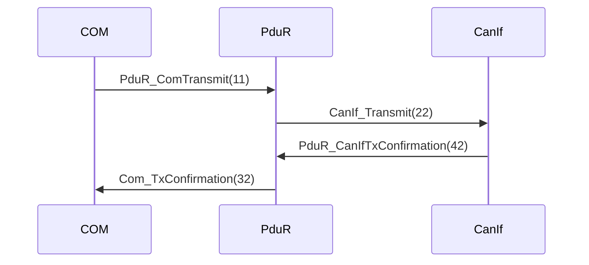
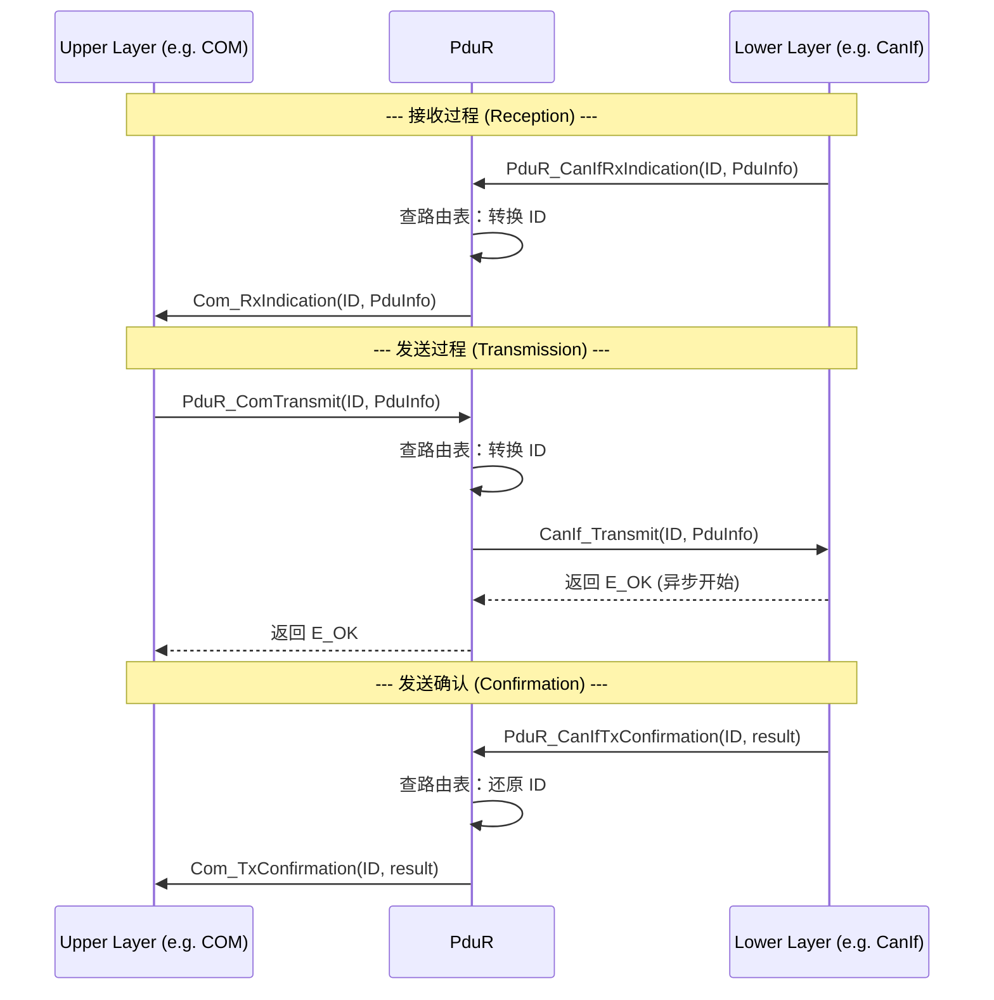
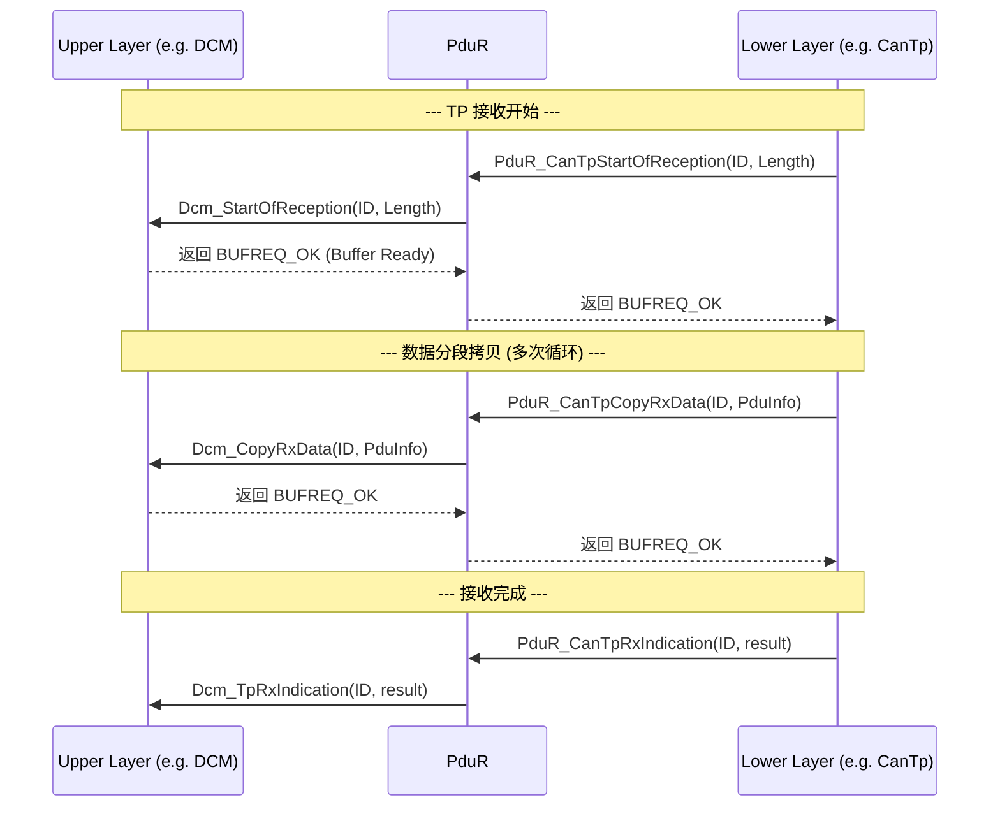
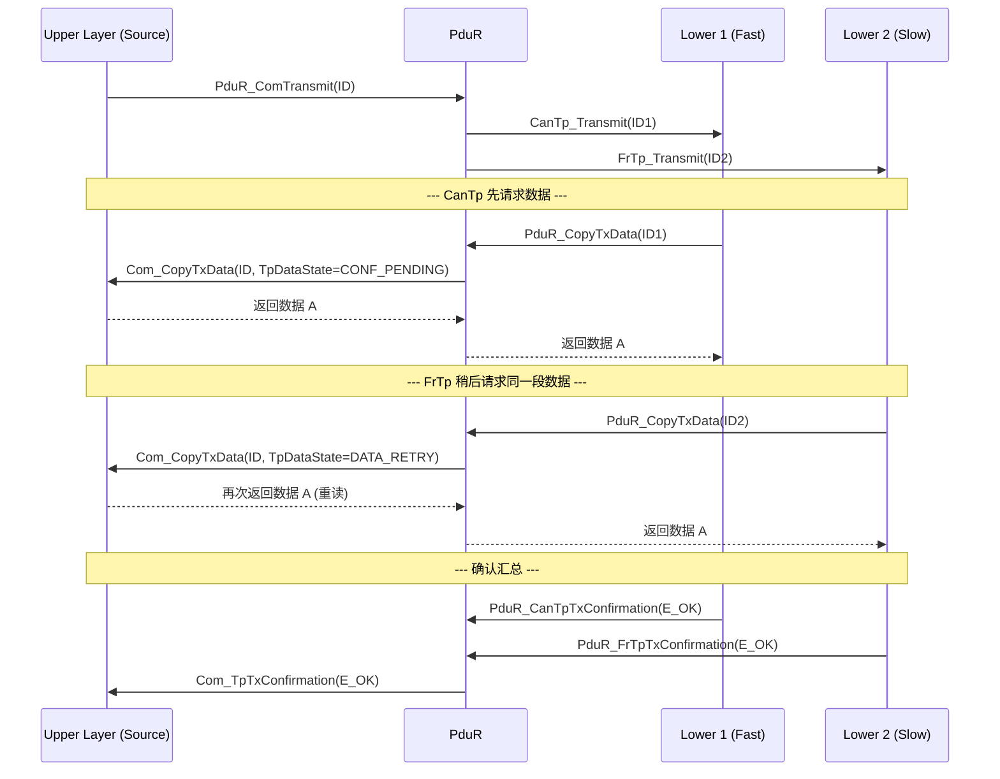

# 概述

> [!tip] 
>
> 标准文件请参见[Specification of PDU Router](https://www.autosar.org/fileadmin/standards/R19-11/CP/AUTOSAR_SWS_PDURouter.pdf)

如果说 ComM 是“司令部”，那么 PduR 就是 ECU 内部的“**物流转运中心**”。它不关心数据包（PDU）里装的是什么信号，它只根据“路由表”决定这个包该发往哪里。

1. PduR 的层级位置：承上启下

   PduR 处于一个非常特殊的中间位置，它切断了应用层与底层总线之间的直接耦合：

   - **上层模块 (Upper Layers)**：数据的源头或终点。
     - **COM**：信号层，处理应用数据。
     - **DCM**：诊断层，处理诊断协议。
   - **下层模块 (Lower Layers)**：数据的物理传输路径。
     - **Interface 模块** (如 CanIf, LinIf)：处理短报文（单帧）。
     - **TP 模块** (如 CanTp)：处理需要分包重组的长报文（如诊断数据）。

2. PduR 的三大核心业务逻辑

   1. 本地接收 (PDU Reception)

      - **方向**：下层 $\rightarrow$ 上层。
      - **逻辑**：总线上来了一个报文，PduR 查表发现本 ECU 需要它，于是分发给 COM 或 DCM。
      - **特性 (Fan-out)**：支持“一对多”。一个报文进来，可以同时分发给多个上层模块。

   2. 本地发送 (PDU Transmission)

      - **方向**：上层 $\rightarrow$ 下层。
      - **逻辑**：COM 或 DCM 产生数据，请求 PduR 发送。PduR 根据 ID 找到对应的总线接口（CAN、LIN 等）并传达发送指令。

   3. 网关转发 (PDU Gateway)

      这是 PduR 最强大的功能，数据**不经过上层应用**，直接在底层模块间流转。

      - **Interface 级网关**：CAN1 的报文直接转到 CAN2（适用于实时性要求高的 L-PDU）。
      - **TP 级网关**：诊断长报文在不同网段间转发。PduR 会管理中间缓存，实现一边收一边发的“流水线”操作。

3. 关键点解析：灵活的混合模式

   规范中特别提到一个极具代表性的场景：**接收与网关并存**。

   > **举例**：一个网关 ECU 收到发动机转速报文。
   >
   > 1. **动作 A (接收)**：PduR 把报文给本机的 **COM**，供仪表盘显示当前转速。
   > 2. **动作 B (网关)**：同时，PduR 把这个报文转发给 **LIN 总线**，供后排娱乐系统显示。
   >
   > **结论**：这两个动作在 PduR 内部是并行触发的，互不干扰，极大地提高了路由效率。

💡 PduR 的本质：

PduR 本质上是一个**静态的、无状态的路由矩阵**：

1. **它是无感的**：它不解析 PDU 里的具体信号（如温度、转速）。
2. **它是高效的**：基于 I-PDU ID 的查表转发，逻辑路径在配置阶段（arxml）就已固定。
3. **它是解耦的**：上层模块不需要知道报文是走 CAN 还是以太网，只需要把 PDU 交给 PduR，剩下的路径寻找由 PduR 完成。


1. 核心路由准则：静态 ID 路由

   - **非动态路由**：PduR 绝对不会在运行时根据 PDU 的**有效载荷（Payload）**去决定路由方向。
   - **静态标识符**：所有的路由决定都是基于预先配置好的 **I-PDU ID**。
   - **意义**：这意味着 PduR 的执行效率极高，且行为是确定性的（Deterministic），符合汽车电子对实时性和安全性的要求。

2. 模块分类：接口类 vs. 传输协议类

   PduR 处理两类本质不同的通信接口：

   | **模块类型**                 | **处理对象**          | **典型模块**                             |
   | ---------------------------- | --------------------- | ---------------------------------------- |
   | **通信接口模块 (Interface)** | 短报文 / 单帧 (L-PDU) | `CanIf`, `LinIf`, `FrIf`, `Com`, `IpduM` |
   | **传输协议模块 (TP)**        | 长报文 / 分段 (N-PDU) | `CanTp`, `DCM`, `J1939Tp`, `FrTp`        |

   - **技术细节**：PduR 需要区分这两类，因为 TP 路由涉及分段传输、流控制（Flow Control）和缓冲区管理，而 Interface 路由通常只是简单的直接转发。

3. 最常见的路由组合 (Case Studies)

   1. **DCM $\leftrightarrow$ TP 模块**：处理诊断仪与 ECU 之间的多帧长报文交互。
   2. **COM $\leftrightarrow$ Interface 模块**：处理最基础的循环信号报文（如车速、转速）。
   3. **COM $\leftrightarrow$ TP 模块**：处理大数据的信号传输。
   4. **IpduM $\leftrightarrow$ Interface 模块**：处理多路复用报文的收发。

# I-Pdu处理

它的工作本质可以概括为：**ID 转换（ID Conversion）** 与 **透明传输（Transparent Transfer）**。

1. 核心原则：数据一致性与透明性

   - **无修改传输**：PduR 必须在不修改数据内容的情况下，将 I-PDU 从源模块传输到目标模块。
   - **一致性**：确保数据在搬运过程中不会被截断或损坏。PduR 扮演的是“管道”角色，不感知负载（Payload）的具体含义。

2. I-PDU 的身份识别：ID 与 符号名

   规范区分了两种识别方式，这主要取决于你的编译策略：

   - **I-PDU ID**：主要用于 **Post-build**（后编译配置）。因为在代码编译后，只有通过固定的 ID 才能在内存中定位和识别 PDU。
   - **Symbolic Name (符号名)**：主要用于 **Pre-compile**（预编译配置）。在源代码阶段，开发者可以使用具有可读性的名称（如 `Engine_Speed_PDU`），由工具链最终映射为具体的 ID。

3. 核心机制：ID 转换 (ID Conversion) 

   这是 PduR 最重要的功能。每个 BSW 模块（Com, CanIf, LinIf）都有自己的一套 I-PDU ID 查表。

   - **逻辑转换**：PduR 就像一个翻译官。
     - **发送路径**：COM 调用 `PduR_ComTransmit(ID_A)`，PduR 查表发现对应的目标是 CanIf，于是将其转换为 CanIf 认识的 `ID_B`，然后调用 `CanIf_Transmit(ID_B)`。
     - **确认/指示路径**：当底层反馈 `PduR_CanIfTxConfirmation(ID_B)` 时，PduR 再将其反向转换回 `ID_A` 并告诉上层 `Com_TxConfirmation(ID_A)`。

4. 路由路径的唯一性

   - **唯一识别**：一条路由路径是由 **源模块 I-PDU ID** 和 **目标模块 I-PDU ID** 的组合唯一确定的。

   - **多路分发 (Fan-out) 示例**：

     如规范所述，如果 COM 发送一个 PDU 给 CanIf 和 LinIf：

     1. COM 提供一个源 ID 给 PduR。
     2. PduR 将其转换为 **两个不同的目标 ID**：一个给 CanIf，一个给 LinIf。
     3. 原始的数据指针（`PduInfoType`）被原封不动地传递给这两个模块。

5. 严格的静态约束

   - **严禁动态路由**：PduR 只能根据配置好的路径干活。如果配置里没写这条路，PduR 绝对不会转发。
   - **MetaData 类型检查**：如果两个 I-PDU 的 `MetaDataTypes`（元数据类型，常用于带地址信息的通信，如 J1939 或以太网）不一致，生成工具必须报错。这保证了路由两端的数据结构是兼容的。

PduR 到底在做什么？

为了方便理解，我们可以把 PduR 处理 I-PDU 的过程想象成 **“拨号转发”**：

| **步骤**            | **动作**                                       | **类比**                                 |
| ------------------- | ---------------------------------------------- | ---------------------------------------- |
| **1. 接收请求**     | 模块 A 发起 Transmit(ID_1)                     | 邮局收到一封发往“北京”的信               |
| **2. 查表转换**     | PduR 查找路由表，发现 ID_1 对应模块 B 的 ID_99 | 邮局确认“北京”对应的邮编是“100000”       |
| **3. 数据透明搬运** | 将数据指针原样传给模块 B                       | 把信件装进发往“100000”的邮袋，内容不准看 |
| **4. 反馈转换**     | 模块 B 回复确认(ID_99)，PduR 转换回 ID_1 给 A  | 投递成功后，告诉发信人“北京”的信到了     |

通信样例为：



## 接收数据

 **PduR (PDU Router)** 在“接收”场景下，根据底层模块的类型（Interface vs. TP）采取不同的转发策略。

核心差异在于：**Interface（接口类）是“直接投递”，而 TP（传输协议类）是“流式握手”**。

1. 通信接口接收 (Communication Interface)

   对于像 `CanIf` 这样处理短报文的模块，接收逻辑非常简单、直接。

   - **1:n 路由 (Fan-out) **：

     这是 Interface 路由的一大特色。底层收到的一个 I-PDU，可以同时分发给多个上层模块（如同时给 `COM` 和 `DCM`）。

   - **不检查长度 **：

     由于 PduR 在这种路径下**不提供缓冲区（Buffer）**，它只是一个“传声筒”。因此，它不会检查报文长度是否符合配置，直接原样转交给上层。

   - **动作**：底层调用 `PduR_RxIndication` $\rightarrow$ PduR 调用所有目标上层的 `_RxIndication` 。

2. 传输协议接收 (Transport Protocol)

   对于处理长报文（分段传输）的 TP 模块，逻辑要复杂得多，涉及多步握手过程。

   - **1:1 路由**：

     不同于 Interface，TP 接收通常只能路由给**一个**上层目标（例如诊断请求只能给 `DCM`）。

   - **三步走流程**：

     1. **开始接收 (`StartOfReception`)**：当收到首帧（FF）或单帧（SF）时，通知上层准备缓存。PduR 负责转发该调用并传回上层的返回值（如 BUFREQ_OK） 。
     2. **数据拷贝 (`CopyRxData`)**：后续的每一个分段（N-PDU）都会触发此调用，将数据从 TP 层搬运到上层定义的缓冲区中 。
     3. **最终指示 (`TpRxIndication`)**：所有分段收齐后，TP 层通知 PduR，PduR 再通知上层传输完成 。

   - **错误处理**：如果 TP 层上报了错误，PduR 同样只负责“透传”，不负责具体的错误纠正逻辑。

3. 特殊机制：未知长度处理 (Unknown Length)

   在某些流式数据传输（Streaming）中，接收方在开始时并不知道总长度。

   - **TpSduLength = 0**：这是 AUTOSAR 中表示“未知长度”的特殊标识。
   - **透明转发**：如果 `PduR_StartOfReception` 传入的长度为 0，PduR 必须原封不动地将这个 0 传给上层，让上层决定如何分配初始空间。

Interface vs. TP 接收对比

| **特性**     | **通信接口 (Interface)**                     | **传输协议 (TP)**                                            |
| ------------ | -------------------------------------------- | ------------------------------------------------------------ |
| **路由比例** | **1:n** (支持多路分发)                       | **1:1** (单一目标)                                           |
| **数据量**   | 短报文 (通常 $\le 8$ 字节或 CAN FD $\le 64$) | 长报文 (支持分段，最高可达 4GB)                              |
| **缓冲处理** | PduR **不缓冲**，直接转发                    | 数据通过 `CopyRxData` **拷贝**至上层缓存                     |
| **握手过程** | 一步到位 (`RxIndication`)                    | 三步握手 (`Start` $\rightarrow$ `Copy` $\rightarrow$ `Indication`) |

## 发送数据

无论是基础的接口类通信还是复杂的传输协议，其本质都是 **“异步透传”**。

1. 异步传输机制 (Asynchronous Transmission)

   在 AUTOSAR 架构中，PduR 的发送操作被设计为异步的。

   - **立即返回**：当上层模块（如 COM）调用发送函数时，PduR 将请求转发给底层（如 CanIf）后会**立即返回**，而不会等待数据真正发送到物理总线上。
   - **确认机制**：真正的发送结果（成功或失败）会在稍后通过 **TxConfirmation** 链路异步返回。
     - **接口类**：底层调用 `PduR_TxConfirmation` $\rightarrow$ PduR 查表并转换 ID $\rightarrow$ 调用上层 `_TxConfirmation`。
     - **协议类 (TP)**：底层调用 `PduR_TxConfirmation` $\rightarrow$ PduR 调用上层 `_TpTxConfirmation`。

2. PduR 的“零缓存”原则

   这是一个非常关键的性能和架构约束：

   - **不留痕迹**：在从上层发往下层的过程中，PduR **严禁缓存** I-PDU。
   - **设计意图**：
     1. **降低延迟**：避免了不必要的数据拷贝（Zero-copy）。
     2. **节省内存**：PduR 作为一个路由层，不需要像 COM 或 TP 那样开辟巨大的静态 Buffer 空间。
     3. **职责分离**：如果数据需要重发或持久化，那是上层（COM 的重发机制）或底层（CanIf 的硬件缓存）的职责，**PduR 只负责中转指针**。

3. 数据流向与逻辑总结

   对于本地发送（Transmission），数据流遵循以下路径：

   | **步骤**        | **模块动作**            | **关键接口示例**                 |
   | --------------- | ----------------------- | -------------------------------- |
   | **1. 发起**     | 上层发起请求            | `PduR_ComTransmit(ID_A)`         |
   | **2. 路由**     | PduR 转换 ID 并转发     | `CanIf_Transmit(ID_B)`           |
   | **3. 物理发送** | 底层操作硬件            | 总线 PDU 传输                    |
   | **4. 底层反馈** | 下层告知 PduR 发送结果  | `PduR_CanIfTxConfirmation(ID_B)` |
   | **5. 上层确认** | PduR 转换 ID 并反馈上层 | `Com_TxConfirmation(ID_A)`       |

PduR 发送的本质：我们可以把 PduR 的发送过程看作是一个 **“即拨即挂”** 的分拣动作：

1. **它是纯粹的搬运工**：它只传递数据的地址指针（`PduInfoType`），从不自己复印一份存起来。
2. **它是双向的 ID 翻译官**：发送时把逻辑 ID 变成物理 ID，反馈时把物理 ID 还原回逻辑 ID。
3. **它是非阻塞的**：它只负责把球传给下一位队员，至于球有没有进框，等裁判（确认回调）吹哨再说。

**由于 PduR 坚持“零缓存”，这也意味着如果底层模块返回 `E_NOT_OK`（例如 CAN 队列满），PduR 会直接把这个错误抛给上层，由上层自行决定是稍后重试还是放弃发送。**

### 传输机制


1. 多播发送 (Multicast: 1:n)

   多播允许上层的一个发送请求同时触发多个底层的发送。

   - **结果判定**：只要目标模块中有一个返回 `E_OK`，PduR 给上层的返回值就是 `E_OK`。这意味着即使部分总线发送失败，系统仍认为这次逻辑发送是成功的。
   - **同质化限制**：一个多播组内的所有目标必须“同质”。即：要么全是 **Interface**（如 CanIf + LinIf），要么全是 **TP**（如 CanTp + FrTp）。**绝对禁止混合路由**（例如 COM 同时发给 CanIf 和 CanTp）。
   - **确认逻辑**：只有当多播组中**所有**支持确认机制的底层模块都返回了 `TxConfirmation` 后，PduR 才会向上层触发最终的确认。
   - **ID 记忆**：由于多播涉及多个不同的目标 ID，PduR 必须在内部记录原始请求的 ID，以便在确认时能准确找回“发件人”。

2. 通信接口的三种发送方式

   规范梳理了数据从上层流向下层的三种模式：

   | **模式**                             | **描述**                                              | **关键点**                                                 |
   | ------------------------------------ | ----------------------------------------------------- | ---------------------------------------------------------- |
   | **1. 直接提供数据 (Direct)**         | 上层调用 `Transmit` 时，数据指针直接传给底层。        | 底层在调用瞬间完成数据拷贝。                               |
   | **2. 触发发送 (Trigger Transmit)**   | 底层（如 LinIf）主动调用 `TriggerTransmit` 请求数据。 | 上层被动提供数据。常用于周期性调度的总线（LIN, FlexRay）。 |
   | **3. 混合模式 (Transmit + Trigger)** | 上层先调 `Transmit` 通知底层，但底层当时不拿数据。    | 底层稍后通过 `TriggerTransmit` 异步获取数据。              |

3. 触发发送逻辑 (Trigger Transmit) 

   这是针对 LIN 或 FlexRay 等静态调度总线的核心机制：

   - **按需索取**：底层通信接口根据调度表到达发送点时，向 PduR 发起 `PduR_TriggerTransmit`。
   - **路由转发**：PduR 查表并将请求转发给对应的上层（如 COM）。
   - **数据填充**：上层模块将最新的信号数据填入 PduR 提供的缓冲区中。
   - **状态反馈**：PduR 将上层返回的成功/失败状态透传给底层。

4. 其他关键约束

   - **长度不检查**：与接收一致，发送时 PduR 也不检查 I-PDU 长度，因为 PduR 不负责分配发送 Buffer，长度合规性由上层和底层对接。
   - **确认转发**：底层上报的 `TxConfirmation`（包含成功或错误结果）会被 PduR 原样转发给上层。
   - **错误处理**：PduR 在发送链路上非常“被动”，不负责任何错误重传逻辑。如果返回 `E_NOT_OK`，它只是负责把这个坏消息转告给上层。

5. **多播是并行的**：PduR 像一个分线器，把一个信号分给多路，并汇总确认结果。

6. **传输是灵活的**：既支持上层“推”数据（Direct），也支持底层“拉”数据（Trigger）。

7. **身份是透明的**：PduR 在这个过程中只做 ID 翻译和调用跳转，不干预数据内容和错误恢复。

## 传输协议

由于 TP 报文（如诊断多帧）通常很大且需要分段，PduR 在此充当了复杂的“数据调度员”。

1. TP 发送的基本流程：单播 (1:1)

   与 Interface 直接发送不同，TP 发送是一个**拉取（Pull）**数据的过程：

   1. **初始化**：上层调用 `PduR_Transmit`。PduR 查表并转发给底层的 `_Transmit` 。
   2. **数据请求**：底层 TP 模块根据物理层的发送能力，多次调用 `PduR_CopyTxData`。
   3. **数据搬运**：PduR 收到请求后，反向调用上层的 `_CopyTxData`，将数据从上层缓存直接“拉”到底层。
   4. **最终确认**：底层完成最后一段发送后调用 `PduR_TxConfirmation`，PduR 再通知上层 `_TpTxConfirmation`。

2. TP 多播发送：复杂的“数据回滚” (1:n)

   多播长报文是 PduR 最复杂的操作之一。因为 PduR **不缓存数据**，但多个底层模块（如 CanTp 和 FrTp）都需要同一份数据。

   - **同一数据的多次查询**：

     由于不同的总线速度不同，底层模块请求数据的节奏也不一致。PduR 必须协调上层多次提供同一段数据。

   - **状态控制 (RetryInfoPtr) **：

     - **TP_CONFPENDING**：当第一个 TP 模块请求某段数据时，PduR 通知上层：“我要这段数据，请准备好”。
     - **TP_DATARETRY**：当后续其他 TP 模块请求**同一段**数据时，PduR 使用此标志通知上层：“刚才那段数据请再给我一份”。

   - **多播确认逻辑 **：

     - **汇总结果**：PduR 必须等待所有目标 TP 模块都返回确认。
     - **乐观判定**：只要其中**至少一个**底层模块成功发送（返回 `E_OK`），PduR 给上层的反馈就是 `E_OK`。

3. 未知长度传输 (Streaming) 

   - **定义**：当 `SduLength = 0` 时，表示这是一个流式传输，起始时不知道总字节数。
   - **透明转发**：PduR 不会拦截此状态，而是原封不动地转发给所有底层 TP 模块，由底层和上层协商如何通过多次 `CopyTxData` 完成流式读取。

关键点总结与差异

| **特性**      | **TP 单播 (Singlecast)**           | **TP 多播 (Multicast)**                    |
| ------------- | ---------------------------------- | ------------------------------------------ |
| **数据流向**  | 上层 $\rightarrow$ 下层 (按需拉取) | 上层 $\rightarrow$ 多个下层 (按需多次拉取) |
| **重试机制**  | 通常不涉及 PduR 层的重试           | **必须** 使用 `TP_DATARETRY` 机制          |
| **确认触发**  | 唯一的下层反馈即触发               | 最后一个下层反馈后汇总触发                 |
| **PduR 缓存** | **无缓存**                         | **无缓存** (依赖上层 Buffer 重读能力)      |

> [!tip] 
>
> 为什么 PduR 要用 `TP_DATARETRY`？
>
> 这是为了实现 **“零内存”网关/转发**。
>
> 如果 PduR 自己缓存一份 4KB 的诊断报文，会浪费宝贵的 RAM。通过 `TP_DATARETRY` 协议，PduR 强制要求上层（如 COM 或 DCM）在内存中保留这份数据，直到所有的底层（CAN、LIN、FlexRay）都确认读完了。
>
> **至此，我们已经完整梳理了 PduR 的路由、接收、发送以及 TP 处理逻辑。您是否需要我为您总结一份 PduR 配置中常见的坑点（例如多播配置时最容易忽略的 Buffer 或 TP 状态限制）？**


## 收发时序

Communication Interface 接收与发送 (1:1 单播)：这是最基础的短报文收发过程，特点是**直接转发，不带缓存**。



Transport Protocol (TP) 接收过程 (1:1 单播)：TP 接收涉及分段传输，PduR 在其中协调上层的缓冲区与底层的分段拷贝。



TP Multicast 发送过程 (1:N 多播)：这是最复杂的场景，PduR 必须协调一个上层同时供给多个下层，并利用 `TP_DATARETRY` 机制让上层重复提供同一段数据。



## I-PDU Gateway

与之前的本地收发（Local Reception/Transmission）不同，网关模式下 PduR 同时扮演了“接收者”和“发送者”的角色。数据不经过 COM 或 DCM，直接在底层模块之间流转。

1. 通信接口网关 (Interface Gateway)

   针对像 `CanIf` 这样的小数据报文路由：

   - **1:n 路由**：一个源总线（如 CAN）的报文可以路由到多个目标总线（如 LIN 或另一个 CAN 频道）。
   - **灵活缓存 [FIFO]**：PduR 允许为每个目标通道配置**缓冲区深度**。如果总线繁忙，PduR 可以通过 FIFO（先进先出）队列暂时存住这些报文。
   - **并行接收**：支持“网关+接收”混合模式。数据在转发给其他总线的同时，也可以传给本地的 `COM` 模块。

2. 传输协议网关 (TP Gateway)

   针对诊断长报文等大数据块的跨网段路由：

   - **"On-the-fly" (即时转发)**：这是 TP 网关最强大的特性。PduR 不需要等整个 4KB 的诊断包收完才转发。当收到前几个分段（N-PDU）时，PduR 就可以立即启动目标侧的发送。这大大降低了跨网段诊断的延迟。
   - **独占性限制**：对于多帧 TP 报文，网关转发和本地接收是**互斥**的。即一个长报文要么转给别的 TP 模块，要么给本地 `DCM` 接收，不能同时进行（单帧 SF 除外）。

3. 网关的核心约束与高级特性

   1. **严禁异构路由**
      - **同质原则**：数据只能在 Interface 之间或 TP 之间流转。
      - **反例**：绝对不能把从 `CanIf` 接收到的单帧报文直接路由给 `LinTp`。这种跨协议类型的转换超出了 PduR 的职责，需要 COM 层参与。
   2. **n:1 路由与时序保证**
      - **多合一**：支持多个源总线的报文汇聚到一个目标总线。
      - **保序性**：PduR 必须确保先到达的报文先被发送到目标总线，维持原始的时序。
   3. **动态路径控制**
      - **API 控制**：通过 `PduR_EnableRouting` 和 `PduR_DisableRouting` 可以在运行时动态开启或关闭某条网关路径。
      - **互斥保证**：在 n:1 场景下，可以通过这两个 API 确保同一时刻只有一个源在工作（避免总线负载冲突）。
   4. **元数据缓存**
      - **MetaData 搬运**：如果报文带有元数据（如以太网的 IP 地址或 J1939 的源地址），当 PduR 需要缓存该 PDU 时，必须**连同元数据一起缓存**，否则转发出去时会丢失关键的寻址信息。

本地收发 vs. 网关

| **特性**       | **本地收发 (Local)**                              | **网关 (Gateway)**              |
| -------------- | ------------------------------------------------- | ------------------------------- |
| **路径**       | 下层 $\rightarrow$ 上层 / 上层 $\rightarrow$ 下层 | 下层 $\rightarrow$ 下层         |
| **缓存**       | PduR 内部**无缓存**                               | PduR **提供缓存** (FIFO)        |
| **实时性**     | 依赖上层处理速度                                  | 高实时性，支持 TP 现场转发      |
| **数据一致性** | 依赖上层 Buffer                                   | PduR 负责 Buffer 与元数据一致性 |

💡 核心解读：PduR 为什么要提供缓存？

在本地发送时，PduR 认为上层（如 COM）有自己的 Buffer。但在网关模式下，数据是从底层的接收缓冲区（Rx Buffer）直接过来的，底层驱动（CanIf）在处理完中断后会立即释放该空间。**如果此时目标总线由于仲裁失败没发出去，数据就会丢失**。因此，PduR 必须在这个“立交桥”的转弯处（网关路径上）建立自己的仓库（FIFO Buffer）。

### 通信接口

1. 核心网关行为：即时路由与频率限制

   - **即时性**：PduR 侧重于报文的快速转发。它**不支持**在路由过程中改变报文的周期（Rate Conversion）。
   - **限制**：如果你需要将一个 10ms 的 CAN 报文转发为 50ms 的 LIN 报文，PduR 无法直接实现，必须路由到 **COM 模块**，利用信号网关（Signal Gateway）来处理。

2. 两种数据提供方式（核心配置点）

   根据目标总线的特性（是事件触发还是调度触发），PduR 提供两种模式：

   | **模式**       | **配置参数 (PDUR_DIRECT)**                   | **配置参数 (PDUR_TRIGGERTRANSMIT)**              |
   | -------------- | -------------------------------------------- | ------------------------------------------------ |
   | **工作原理**   | PduR 收到报文后，立即调用下层的 `Transmit`。 | PduR 先把报文存入自己的 Buffer，等待下层来“拉”。 |
   | **数据拷贝**   | 下层在 `Transmit` 调用时同步完成拷贝。       | 下层通过 `TriggerTransmit` 回调时异步完成拷贝。  |
   | **缓存必要性** | 仅在配置 FIFO 队列时需要。                   | **必须配置缓存**，用于保存最新的报文数据。       |
   | **典型场景**   | CAN 总线（事件触发）。                       | LIN/FlexRay（按调度表执行）。                    |

3. 缓冲区逻辑与溢出保护

   PduR 的网关 Buffer 管理非常严谨，涉及长度校验以防止内存越界：

   - **Last-is-best (覆盖写) **：在触发发送模式下，如果 `PduRQueueDepth` 为 1，新到的报文会覆盖旧报文，确保总线发出的是最新数据。
   - **FIFO 行为**：如果配置了深度 > 1 的队列，当下层来要数据但队列为空时，返回 `E_NOT_OK`。
   - **长度截断 **：
     - 如果收到的报文 > PduR 配置的 `PduRPduMaxLength`，PduR **只拷贝前一段数据**，多余的部分丢弃。
     - 发送时（Direct 模式），PduR 告诉下层实际存入 Buffer 的长度（`SduLength`）。

4. 异常处理与反馈

   - **空间不足**：当下层模块调用 `TriggerTransmit` 时，如果它提供的接收缓冲区比 PduR 存的数据还小，PduR 会拒绝拷贝并返回错误，且**不会**从 Buffer 中移除该报文（留待下次重试）。
   - **TX 确认忽略 **：对于网关报文，PduR 通常不关心发送确认回调（除非是带 FIFO 的 Direct 模式），因为它不需要像本地发送那样通知上层应用。

5. PduR 接口网关接收与发送过程 

   ```mermaid
   sequenceDiagram
       participant Src as Source (CanIf)
       participant PduR as PduR Buffer
       participant Dst as Destination (LinIf)
   
       Note over Src, Dst: --- 场景 1: Direct Gateway (CAN to CAN) ---
       Src->>PduR: PduR_CanIfRxIndication(ID)
       PduR->>Dst: CanIf_Transmit(Converted_ID, PduInfo)
       Dst-->>PduR: E_OK (数据立即从 Src 拷贝到 Dst)
       
       Note over Src, Dst: --- 场景 2: Trigger Transmit Gateway (CAN to LIN) ---
       Src->>PduR: PduR_CanIfRxIndication(ID)
       PduR->>PduR: 存入内部 Buffer (Last-is-best)
       Note right of Dst: 根据调度表到达发送槽位
       Dst->>PduR: PduR_LinIfTriggerTransmit(Converted_ID)
       PduR->>Dst: 拷贝 Buffer 数据到 Dst 缓冲区
       Dst-->>PduR: 返回 E_OK
   ```

PduR 在接口网关中的核心价值在于**适配不同的总线节奏**。它通过内部 Buffer 解决了“异步总线”与“调度总线”之间的数据同步问题，同时利用严格的长度校验保障了嵌入式内存的安全。

### 错误处理

PduR 在网关模式下的**“无责任转发”**原则。在嵌入式通信中，PduR 被设计为一个高效的数据分拣器，而不是一个复杂的错误管理模块。

1. 核心逻辑：不重试，直接丢弃

   - 当 PduR 执行网关操作（Gateway）并尝试向目标通信接口（如 `CanIf`）发送报文时，如果下层接口返回了 `E_NOT_OK`：
   - **执行动作**：PduR 会立即**丢弃**该 I-PDU 实例。
   - **严禁重试**：PduR 绝对不会尝试再次调用发送函数。
   - **理由**：下层模块（如 CAN 驱动）返回错误通常意味着硬件繁忙、队列溢出或物理总线故障。PduR 没有足够的上下文信息来判断何时重试是安全的，盲目重试可能会加剧总线负载或导致死循环。

2. 错误处理的职责边界

   PduR 在这里表现得非常“冷酷”，其设计背后的哲学是**职责解耦**：

   | **模块**        | **职责**                                                     |
   | --------------- | ------------------------------------------------------------ |
   | **PduR**        | 仅负责将数据从 A 搬到 B。如果 B 不接，PduR 的任务就此结束。  |
   | **下层模块**    | 目标模块（如 `CanIf` 或 `LinIf`）本身会通过诊断事件（DEM）或内部状态机上报硬件层面的错误。 |
   | **上层/系统层** | 如果数据非常重要，通常由发送端的源节点通过应用层协议（如超时监控、请求重传机制）来确保数据到达。 |

3. 网关丢包时序逻辑

   ```mermaid
   sequenceDiagram
       participant Src as Source (e.g. CanIf)
       participant PduR as PduR
       participant Dst as Destination (e.g. LinIf)
   
       Src->>PduR: PduR_CanIfRxIndication(ID, PduInfo)
       PduR->>PduR: 查表并转换 ID
       PduR->>Dst: LinIf_Transmit(Converted_ID, PduInfo)
       
       Note right of Dst: 发生故障（如总线繁忙或队列满）
       Dst-->>PduR: 返回 E_NOT_OK
       
       Note over PduR: 立即丢弃数据，不进行重试
       PduR-->>PduR: 清理本次路由任务
   ```

> [!tip] 
>
> 为什么 PduR 不像 COM 一样支持重传？
>
> 1. **资源开销**：如果 PduR 需要支持网关重传，它必须为每一个正在路由的报文准备额外的 Buffer 和定时器，这会极大地消耗 RAM 资源。
> 2. **实时性**：网关转发往往要求极高的实时性。对于陈旧的数据，在某些汽车控制逻辑中（如转向或制动信号），**丢弃它并等待下一帧最新数据**通常比重传一帧已经过时的数据更安全。
>
> 在配置 PduR 网关时，如果你的系统对丢包非常敏感，通常建议在目标接口层（如 `CanIf`）配置足够的 **Transmit Queue**，或者在应用层增加数据完整性校验。

### 传输协议

**PduR (PDU Router)** 在 **TP (传输协议)** 网关场景下的高级特性，重点在于如何平衡数据传输的完整性与实时性。

1. 两种网关模式：直接转发 vs. 现场转发

   TP 网关（处理长报文）有两种截然不同的策略，根据配置决定：

   - **直接转发 (Direct Gateway/Store-and-Forward)**：
     - **逻辑**：PduR 必须接收完所有的分段（所有的 N-PDU），在内存中拼凑成完整的 I-PDU 后，才启动目标总线的发送。
     - **优点**：数据最稳妥，可以进行完整的校验。
     - **缺点**：延迟极高（Latency），适合对时间不敏感的大数据。
   - **现场转发 (On-the-fly / Fragmented Gateway)**：
     - **逻辑**：PduR 不需要等全部收完。只要接收到的数据达到一个**阈值（Threshold）**，就立即启动目标侧的发送。
     - **优点**：显著降低端到端的延迟。
     - **技术细节**：这种模式下，PduR 实际上在扮演一个“管道”的角色，一边在 `CopyRxData`，另一边已经在 `CopyTxData`。

2. 元数据处理 (MetaData Handling) 

   对于带地址信息的通信（如 J1939 或以太网中的 IP/端口信息），MetaData 至关重要：

   - **存储与透传**：在 TP 接收的第一阶段（`StartOfReception`），源 TP 模块会提供 MetaData。PduR 必须**先将其存入缓冲区**。
   - **发送关联**：当 PduR 调用目标侧的 `_Transmit` 开启网关发送时，必须把这段存好的 MetaData 塞进去，确保报文发往正确的目标地址。

3. 多播与地址转换的复杂性

   规范提到了两个典型的 TP 网关用例：

   1. **物理寻址 (Physical Addressing)**：通常是 1:1 的，对应多帧（Multi-frame）长报文网关。
   2. **功能寻址 (Functional Addressing)**：通常是 1:n 的多播（Multicast），且往往是单帧（SF）。
      - **挑战：总线载荷不兼容**。
      - **示例**：从 CAN 转发单帧到 LIN。CAN 的单帧可能携带 6 字节有效数据，但 LIN 的单帧由于协议限制可能只能带 5 字节。
      - **结果**：如果发生这种网关行为，数据的长度会被限制在较小的那个总线上（即 5 字节），多出的部分会被丢弃。

4. 另一种“暴力”网关：帧对帧转发 (Frame-by-Frame)

   除了在 TP 层做网关，规范还提到了一个“降维打击”的方案：

   - **原理**：直接把 CAN TP 的每一帧 N-PDU 当作普通的 **Interface PDU** 进行转发。
   - **前提条件**：源总线和目标总线的 N-PDU 打包格式必须**完全一致**（例如 CAN 到 CAN，且分段逻辑相同）。
   - **优点**：对 PduR 来说，这只是最简单的 `RxIndication` 到 `Transmit` 的路由，不需要维护复杂的 TP 状态机和缓冲区水位。

TP网关和接口级网关的对比如下：

| **特性**     | **TP 网关 (TP Gateway)**                 | **接口级网关 (Interface Gateway)** |
| ------------ | ---------------------------------------- | ---------------------------------- |
| **处理层次** | 协议层 (不关心 N-PDU 细节，只管 Payload) | 驱动接口层 (把 N-PDU 当成普通报文) |
| **实时性**   | **On-the-fly** 模式支持极速转发          | 最快（不涉及 TP 逻辑开销）         |
| **灵活性**   | 支持不同总线间的长报文转换               | 仅限同类总线或格式完全一致的总线   |
| **内存占用** | 较高（需要较大的 TP 缓冲区）             | 较低（仅需小额 FIFO）              |

**PduR 的 TP 网关设计真正体现了 AUTOSAR 的解耦思想：它不关心 N-PDU 的 PCI 信息或单/多帧细节，它只负责高效、透明地在不同网段之间搬运有效载荷。**

###### 缓冲分配

**PduR (PDU Router)** 在执行 TP（传输协议）网关任务时核心策略是：**“专款专用”以保证高优先级任务，配合“动态分配”以处理大数据。**


1. 两种缓存池的设计思想

   PduR 将 TP 网关缓存分为两类，这种设计直接服务于汽车诊断的实时性要求：

   | **缓存类型**                        | **配置项**            | **适用对象**  | **设计目的**                                                 |
   | ----------------------------------- | --------------------- | ------------- | ------------------------------------------------------------ |
   | **专用缓存 (Dedicated Buffer)**     | `PduRDestTxBufferRef` | **单帧 (SF)** | 保证 **OBD (车载诊断)** 和 **功能寻址请求**。这类报文优先级极高，不能因为没有内存而延迟。 |
   | **大报文缓存池 (Large TP Buffers)** | `PduRTpBuffers`       | **多帧 (MF)** | 用于处理刷写数据或长诊断响应。内存通过 `PduRRoutingPaths` 定义，根据需求动态申请。 |

2. 缓存分配策略：根据长度决定归宿

   当底层 TP 模块通过 `PduR_StartOfReception` 宣告一个新报文到来时，PduR 会根据报文长度 `TpSduLength` 执行以下逻辑：

   1. **优先尝试专用缓存**：
      - 如果长度 $\le$ 专用缓存的最大长度（通常对应各总线最大单帧长度，如 CAN FD 的 64 字节），则分配专用缓存。
   2. **动态申请大缓存**：
      - 如果长度超过了专用缓存，PduR 会转而从 `PduRTxBuffer` 资源池中动态查找并分配一块足够大的空间。
   3. **失败处理**：
      - 如果专用缓存被占用且大缓存池也满了，PduR 必须立即终止该 PDU 的接收，并返回 `BUFREQ_E_OVFL`（缓冲区溢出）。

3. 网关中的水位管理

   在网关传输过程中，底层发送模块会不断调用 `PduR_CopyTxData` 来提取数据。

   - **剩余数据指引**：PduR 会通过 `availableDataPtr` 参数实时告知底层 TP 模块，目前缓冲区里还有多少字节是已经收齐并等待发送的。
   - **意义**：这对于 **On-the-fly (现场转发)** 模式至关重要。发送侧可以据此判断是否需要等待接收侧进一步填充数据。

4. 缓冲区大小的配置原则

   规范明确了对缓冲区最小尺寸的要求，这直接关系到网关能否成功运行：

   - **对于 Direct Gateway (存储转发)**：缓存必须能够容纳 **整个 I-PDU**。
   - **对于 On-the-fly Gateway (现场转发)**：缓存至少要能容纳 **一个数据块 (One Block)**，以支持边收边发的流水线操作。

> [!tip] 
>
> 为什么要区分专用和动态缓存？
>
> 想象 ECU 正在进行复杂的诊断刷写（长报文，占用大缓存池）。此时，交警或环保检测仪突然发送了一个高优先级的 **OBD 查询（单帧）**。
>
> - 如果只有一种缓存池，单帧可能因为缓冲区被刷写报文占满而无法接收，导致检测失败。
> - **AUTOSAR PduR 方案**：OBD 单帧会直接被分配到预留好的“专用缓存”中，从而不受刷写任务的影响，确保了法规件的强制响应能力。
>
> **这就是 PduR 的精髓：通过静态配置与动态管理相结合，既兼顾了大数据传输，又捍卫了关键诊断任务的“VIP 路径”。**


###### 存储转发网关

**PduR (PDU Router)** 在 **Direct Gateway (存储转发网关)** 模式下，针对 TP（传输协议）长报文和单帧的数据调度细节。核心逻辑在于：**单帧允许重试（Retry），而多帧要求所有目标步调一致。**

1. 触发时机：全收完再发

   在 Direct Gateway 模式下，PduR 的行为非常严谨：

   - **时机**：只有当源 TP 模块调用 `PduR_TpRxIndication` 且结果为 `E_OK`（表示整包数据已完整、正确存入 PduR 缓存）时，PduR 才会调用目标模块的 `_Transmit` 开启发送。
   - **对比**：这与 "On-the-fly"（现场转发）不同，后者是在收到的数据达到阈值时就启动发送。

2. 单帧网关 (Single-frame) 的数据拷贝

   单帧由于数据量小且存放在专用缓存，PduR 提供了更灵活的容错机制：

   - **常规拷贝**：
     - 在正常状态下（`TP_CONFPENDING` / `TP_DATACONF` / 无重试信息），PduR 尝试拷贝数据。
     - 如果缓存数据不够，返回 `BUFREQ_E_BUSY`。
   - **支持重试 (Retry) **：
     - 如果底层请求 `TP_DATARETRY`，PduR 会将当前的读取指针**回退** `TxTpDataCnt` 字节，重新拷贝。这允许底层在物理层发送失败时（例如收到无应答 NACK）重新尝试发送当前帧。

3. 多帧网关 (Multi-frame) 的同步逻辑

   多帧网关涉及多个分段，且可能涉及多播（1:N）。PduR 必须确保多个目标模块在同一个 Buffer 上“步调一致”：

   - **步调同步**：
     - **指针增加**：当有多个目标模块（多播）时，只有**最后一个**目标模块调用 `PduR_CopyTxData` 完成拷贝后，PduR 才会真正增加缓冲区读取指针的位置。
     - **等待机制**：如果某个目标模块跑得太快，而其他模块还没读完上一帧，PduR 会返回 `BUFREQ_E_BUSY` 强制其等待。
   - **严禁重试**：
     - 在多帧模式下，如果底层请求 `TP_DATARETRY`，PduR 会直接返回 `E_NOT_OK`。
     - **原因**：多帧网关的缓冲区通常较大，且涉及多路同步。回退指针会干扰其他目标模块的读取进度，逻辑极其复杂且开销巨大，因此 AUTOSAR 规定多帧网关不支持 TP 层的重试。

单帧与多帧的区别对待

| **特性**     | **单帧网关 (SF)**       | **多帧网关 (MF)**               |
| ------------ | ----------------------- | ------------------------------- |
| **启动时机** | 收完 SF 后启动          | 收完所有 FF/CF 后启动           |
| **重试支持** | **支持 `TP_DATARETRY`** | **不支持** (返回 `E_NOT_OK`)    |
| **读取指针** | 每次拷贝即移动          | **仅最后一个目标读完才移动**    |
| **多路同步** | 相对独立                | 强同步 (一人没读完，全队等一等) |

PduR 的这一套规则保证了在**不增加额外内存拷贝**的情况下，实现可靠的跨总线长报文转发。单帧的重试保证了诊断请求的高成功率，而多帧的强同步机制则通过牺牲重试换取了对 Buffer 管理的简单高效。

**如果你需要实现一个具备 TP 网关功能的驱动，步调一致是最容易造成“死锁”的地方：如果一个目标模块因为某种原因不再调用 `CopyTxData`，会导致 PduR 的 Buffer 指针永远不更新，从而阻塞其他所有目标模块。**

###### 本地并行处理和现场转发


 PduR 在 TP 网关中的两个进阶场景：**本地接收的并行处理** 以及 **"On-the-fly"（现场转发）**。

1. 存储转发中的本地接收 

   当一个 TP 报文被配置为“直接网关”（存储转发）时，它可以同时被转发给底层和本地上层（如 DCM）。

   - **解耦原则**：如果上层接收失败（例如 `StartOfReception` 报错），PduR 可以通过 DET 报错，但**绝对不能中断**发往下层的网关操作。
   - **顺序调用**：与普通接收不同，在网关模式下，只有当 PduR **完整收完** 底层的报文后，才会启动对上层的调用：`Start` $\rightarrow$ `Copy` $\rightarrow$ `Indication`。
   - **错误处理机制**：
     - 如果 `StartOfReception` 发现上层 Buffer 根本放不下整包数据，PduR 会直接调 `_RxIndication(E_NOT_OK)` 结束本地会话。
     - 如果在拷贝过程中 `CopyRxData` 报错，同样会触发 `E_NOT_OK` 的最终指示。

2. "On-the-fly" 现场转发

   这是 TP 网关为了追求极限实时性而设计的“边收边发”模式。

   - **唯一目标限制**：现场转发**只允许 1:1 路由**。不允许将一个正在流式转发的报文多播给多个目标。
   - **阈值启动机制**：
     - PduR 会监控接收缓冲区。一旦缓存的数据量达到配置的 **Threshold (阈值)**，立即调用目标的 `_Transmit`。
     - 如果 `Threshold = 0`，则在收到首帧（FF）或单帧（SF）的 `StartOfReception` 时立即启动发送。
   - **收尾保证**：即使报文很短，一直没达到阈值，只要接收端收到了最终的 `RxIndication(E_OK)`，PduR 也会强制启动发送，确保数据不被憋在 Buffer 里。

3. 数据拷贝与重试约束

   - **不支持重试**：在现场转发模式下，PduR 像流水一样处理数据，不保留已经发出的数据段。
   - **状态处理 **：
     - 当底层调用 `CopyTxData` 时，PduR 只处理 `TP_DATACONF` 或无重试信息（NULL）的请求。
     - 这意味着如果在现场转发时发生物理层错误，由于 PduR 已经释放了之前的 Buffer 水位，**无法执行回退重发**。

Direct vs. On-the-fly 的时序差异

| **特性**       | **Direct Gateway (存储转发)**    | **Gateway On-the-fly (现场转发)** |
| -------------- | -------------------------------- | --------------------------------- |
| **发送启动点** | **收齐整包** 后的 `RxIndication` | **达到阈值** 后的瞬间             |
| **本地接收**   | 支持并行给上层                   | **不支持** (通常只用于转发)       |
| **目标数量**   | 支持多播 (1:n)                   | **仅限 1:1**                      |
| **延迟**       | 高 (总接收时间 + 总发送时间)     | **极低** (几乎是并发的)           |

PduR 的设计非常务实：如果你需要 **“多播”** 或 **“本地备份”**，请选择 **Direct** 模式（虽然慢，但稳）；如果你需要 **“极限速度”**（如跨网段刷新），请选择 **On-the-fly** 模式（虽然牺牲了多播和重试能力，但赢得了时间）。

### FIFO

在 PduR 中，FIFO 队列不仅是简单的缓冲区，它是**源总线**与**目标总线**之间进行速率匹配（Rate Matching）和处理并发冲突的关键组件。

当 `PduRQueueDepth` > 1 时，PduR 将使用 FIFO 机制，将发送请求排队，从而防止在目标通道繁忙时数据丢失。

1. 核心运行机制

   PduR FIFO 的运作取决于数据提供方式（Direct vs. Trigger Transmit），其核心逻辑在于确保 **FIFO 的先进先出顺序** 与 **物理总线的发送状态** 保持同步。

2. 通信接口（Communication Interface）FIFO 逻辑

   | **数据提供方式**     | **状态**                | **行为**                                                 |
   | -------------------- | ----------------------- | -------------------------------------------------------- |
   | **Direct**           | FIFO 为空 且 通道空闲   | 直接调用 `_Transmit()`，不进入队列。                     |
   | **Direct**           | FIFO 有数据 或 通道繁忙 | 将新 I-PDU 入队（Enqueue），等待 `TxConfirmation` 触发。 |
   | **Trigger Transmit** | 总是                    | 将 I-PDU 存入 FIFO，等待底层（如 LIN/FlexRay）调度触发。 |

   - **发送确认 (TxConfirmation) 的联动**：在 Direct 模式下，当 `PduR_TxConfirmation` 收到时，PduR 会自动检查 FIFO，若队列非空，则立刻取出队首元素调用 `_Transmit()` 发送下一帧。

3. 传输协议（TP）FIFO 逻辑

   TP 网关中的 FIFO 行为更为复杂，因为涉及分段（N-PDU）的完整性。

   - **缓冲区预留**：一旦 FIFO 使能，PduR 会从 `PduRTxBuffer` 预留足够空间以处理 1:n 路由。
   - **触发机制**：
     - **阈值触发 (On-the-fly)**：如果 FIFO 为空，且达到 `PduRTpThreshold`，立即调用 `_Transmit()`；如果 FIFO 非空，新来的报文直接存入 FIFO，排队等待。
     - **完整接收触发**：如果未达到阈值，但收到 `PduR_RxIndication`（整包收齐），也会立即触发传输。
   - **后续发送**：每当收到 `TxConfirmation`，PduR 会自动开始 FIFO 中下一条 TP 报文的发送。

4. 错误处理与 FIFO 溢出策略

   这是该章节中最严谨的部分。PduR 定义了两种截然不同的错误处理路径：

   1. 传输错误 (E_NOT_OK)

      当调用下层 `_Transmit()` 返回 `E_NOT_OK` 时：

      - **动作**：PduR 假设该帧已损毁，**直接将其从 FIFO 中移除**，并尝试发送 FIFO 中的下一条数据。
      - **通知**：通过 DET 报告 `PDUR_E_PDU_INSTANCES_LOST`。
      - **影响范围**：仅针对当前失败的 Destination，不影响其他 Destination 的正常路由。

   2. FIFO 溢出 (Queue Full)

      当 FIFO 已满，且有新的 `PduR_RxIndication` 到达时：

      - **动作 (Flush)**：PduR 会**清空整个 FIFO**。
      - **处理新数据**：新到达的 I-PDU 被视为 FIFO 为空时的第一条数据进行处理（即直接发送或存入空队列）。
      - **通知**：报告 `PDUR_E_PDU_INSTANCES_LOST`。

      > **注意**：这种 "FIFO Flush" 机制在 `PduRQueueDepth == 1` 时表现为典型的 **"Last-is-best" (最新数据覆盖)** 行为，确保系统在资源紧张时，发送给总线的永远是最新状态。

5. 关键实现注意事项

   - **并发保护**：由于 `PduR_RxIndication` (Rx 上下文) 和 `PduR_TxConfirmation` (Tx 上下文) 可能发生中断嵌套，FIFO 操作**必须受到原子保护（如中断锁或 Mutex）**，否则队列指针容易出现竞争条件（Race Condition）。
   - **资源消耗**：使用 FIFO 意味着必须为每个 Routing Path 预分配固定的内存空间。在资源受限（RAM 受限）的 ECU 上，应谨慎设定 `PduRQueueDepth`。
   - **LIN 限制**：规范特别提到 FIFO 路由到 LIN 零星帧（Sporadic frames）是不支持的，这一点在设计网关时需要特别确认。

PduR 的 FIFO 设计实现了 **“异步流量整形”**。它将突发的接收请求平滑地转化为受控的总线发送序列。如果 FIFO 满了，PduR 选择“牺牲旧数据以换取最新数据”，这是符合汽车电子控制逻辑中“状态监控优于历史追溯”的设计哲学。

# 取消发送

 **取消发送（Cancel Transmission）**是一个可选功能，主要用于在紧急情况下中断不再需要的通信任务，以释放系统资源。

1. 核心职能：转发取消请求

   PduR 在取消发送过程中充当“指令分发器”。当上层模块（如 COM 或 DCM）意识到某个正在发送的 I-PDU 已无意义时（例如诊断超时或应用逻辑变更），它会调用 PduR 的接口。

   - **适用范围**：同时支持 **接口模块 (Communication Interface)** 和 **传输协议模块 (Transport Protocol)**。
   - **配置使能**：此功能是**可选的**。只有在配置参数 `PduRCancelTransmit` 开启的情况下，PduR 才会包含此逻辑。

2. 路由逻辑：单播与多播的处理

   PduR 根据预定义的路由路径转发取消请求：

   | **场景**       | **PduR 的行为**                                            |
   | -------------- | ---------------------------------------------------------- |
   | **单播 (1:1)** | 直接调用该 ID 对应的唯一目标模块的 `_CancelTransmit`。     |
   | **多播 (1:n)** | 遍历所有路由路径，调用每一个目标模块的 `_CancelTransmit`。 |

   **路径状态检查**：

   如果该 I-PDU 所在的路由路径目前处于 **Disabled** 状态（通过 `PduR_DisableRouting` 禁用），PduR 会直接返回 `E_NOT_OK`，而不会尝试向下层发送取消指令。

3. 返回值判定逻辑

   这是开发者在处理上层逻辑时最需要关注的地方，尤其是多播场景：

   - **单播判定**：
     - **逻辑简单**：下层返回什么，PduR 就向上层透传什么。
   - **多播判定**：
     - **严格模式**：只有当 **所有 (All)** 目标模块都成功执行了取消操作并返回 `E_OK` 时，PduR 才会向上层返回 `E_OK`。
     - **失败判定**：只要有一个目标模块拒绝取消（返回 `E_NOT_OK`），PduR 给上层的反馈就是 `E_NOT_OK`。

4. 网关模式下的取消 (Gatewaying)

   在网关逻辑中，`CancelTransmit` 具有优化资源的重要意义：

   - **资源释放**：如果网关的目标总线（Destination Bus）出现故障或不再可用，PduR 的网关部分可以主动发起取消，从而释放其内部为该路由分配的 FIFO 或 TP 缓冲区。

5. 取消发送过程时序图

   ```mermaid
   sequenceDiagram
       participant UL as Upper Layer (e.g. COM)
       participant PduR as PduR
       participant DL1 as Lower Layer 1 (e.g. CanIf)
       participant DL2 as Lower Layer 2 (e.g. LinIf)
   
       Note over UL, DL2: --- 场景: 多播取消 (Multicast Cancel) ---
       UL->>PduR: PduR_CancelTransmit(PduId)
       
       par 并行转发
           PduR->>DL1: CanIf_CancelTransmit(PduId_A)
           DL1-->>PduR: E_OK
       and
           PduR->>DL2: LinIf_CancelTransmit(PduId_B)
           DL2-->>PduR: E_OK
       end
   
       Note over PduR: 所有目标均返回 E_OK
       PduR-->>UL: E_OK
   ```


💡 核心总结与注意事项

1. **它不保证成功**：调用 `PduR_CancelTransmit` 并不代表发送一定会停止。如果底层驱动（如 CanIf）已经把报文写入了硬件发送邮箱，或者 TP 模块已经发送完了最后一帧，取消请求通常会失败。
2. **异步确认的清理**：一旦取消成功，通常不会再收到对应的 `TxConfirmation` 回调。
3. **对 TP 的影响**：在 TP 网关中，取消发送非常关键。因为 TP 传输可能持续数百毫秒，及时取消可以防止无用的数据流继续占用总线带宽。

**在实际的嵌入式开发中，如果你的 ECU 需要处理高频的诊断请求切换，合理配置并使用 `CancelTransmit` 可以显著减少 PduR 缓冲区被“幽灵报文”占用的情况。**

# 取消接收

这一机制主要针对 **TP (传输协议)** 模块，因为只有长报文分段传输（多帧接收）才存在“正在进行中”的状态，从而有必要中途取消。

1. 核心应用场景

   - **针对 TP 模块**：取消接收通常用于诊断（UDS）场景。例如，DCM 发现当前收到的诊断请求由于某种原因（如会话变更或超时）已不再合法，可以通过此接口通知底层的 `CanTp` 或 `DoIP` 停止接收并释放缓存。
   - **非接口类功能**：对于 `CanIf` 等通信接口模块，接收通常是瞬时的（RxIndication），因此不存在“取消接收”的概念。

2. ID 的特殊处理逻辑

   在普通的接收过程中，数据流向是从 **下层 $\rightarrow$ 上层**。但调用 `CancelReceive` 时：

   - **反向寻址**：上层模块发起请求，调用 PduR。
   - **身份识别**：虽然请求是从上层发下的，但传入的 ID 必须是该报文对应的 **Rx I-PDU ID**。PduR 必须能够根据这个接收 ID 找到对应的路由路径，并反向定位到底层的源 TP 模块。

3. 取消接收的流程控制

   | **环节**     | **规则要求**                                              |
   | ------------ | --------------------------------------------------------- |
   | **路径检查** | 若路由路径被禁用（Disabled），PduR 直接返回 `E_NOT_OK` 。 |
   | **指令转发** | PduR 查表后，调用目标下层 TP 模块的 `_CancelReceive`。    |
   | **状态透传** | 下层 TP 模块（如 CanTp）的执行结果原样透传回上层 。       |

4. 为什么“取消接收”对 TP 网关至关重要？

   在 **TP 网关（Gatewaying）** 场景下，PduR 可能正在为一个长报文分配巨大的缓冲区（如 4KB）。

   1. 如果发送端突然停止发送，或者源网段总线出现异常。
   2. 上层或网关管理逻辑意识到该次传输已失败。
   3. 通过 `PduR_CancelReceive` 通知 PduR，PduR 转发给底层 TP。
   4. **最终目的**：底层 TP 停止分段接收逻辑，PduR 立即释放分配的 **TP Buffer**。

   如果没有这一机制，PduR 的缓冲区可能会被一个“挂起”的坏报文长期占用，导致其他正常的诊断请求由于 BUFREQ_E_OVFL（溢出）而失败。

💡 核心总结

- **方向**：指令流向是 **上层 $\rightarrow$ PduR $\rightarrow$ 下层**（反向操作）。
- **对象**：仅适用于 **TP 模块**（如 CanTp, J1939Tp, DoIP）。
- **价值**：它是系统**资源回收**的重要手段，确保异常发生时内存能及时释放。

**至此，我们已经覆盖了 PduR 规范中关于“发送/接收”的正常操作、网关转发、以及“取消”操作的所有章节。这些逻辑共同构成了一个稳定、高效且具备容错能力的 AUTOSAR 通信路由系统。**

# 0操作成本

AUTOSAR PduR 架构中一种极具吸引力的极致性能优化手段——**零成本操作 (Zero Cost Operation)**。它打破了 PduR 作为一个独立模块存在的“传统思维”，在特定条件下直接消除了函数调用的开销。

1. 什么是零成本操作？

   在标准的 AUTOSAR 架构中，数据路由的路径通常是：`Upper Layer -> PduR -> Lower Layer`。即使 PduR 内部逻辑非常简单（例如仅仅是 ID 转换），它仍然涉及到一次函数入栈、出栈以及可能的跳转逻辑。

   **“零成本操作”通过以下方式消除开销：**

   - **宏转换**：如果满足特定条件，PduR 将不再作为一个实际的“模块”存在，而是被转化为一组宏（Macro）或者内联函数。
   - **直接调用**：上层模块（如 COM）可以直接调用底层模块（如 CanIf）的接口，中间没有任何逻辑层代码的执行。

2. 实现的严苛前提 

   这种优化并非随处可用，它要求极为严苛的配置约束：

   1. **源与目标唯一性**：必须是 1:1 的直接路由，没有多播（Multicast）或复杂的网关处理。
   2. **源码可见性**：参与路由的模块中，必须至少有一个提供源代码（以允许生成器插入胶水代码或直接链接）。
   3. **配置类一致性**：**这是最重要的门槛**。所有的路由路径必须是 **Pre-Compile（预编译）** 时间配置的。
      - 这意味着所有的路由关系在编译时刻就已经定死，编译器可以在编译期对这些函数调用进行常量折叠和优化。

3. 错误预防机制

   为了防止配置上的误用，规范强制规定：如果启用了 `PduRZeroCostOperation`，但却配置了非预编译（如 Link-Time 或 Post-Build）的路由路径，**代码生成器必须报错并终止生成**。这保证了系统在启动时刻的可靠性，防止因为动态配置导致的优化失效。

4. 优化带来的影响与折中

   | **特性**     | **标准 PduR 模式**           | **零成本操作模式**         |
   | ------------ | ---------------------------- | -------------------------- |
   | **执行效率** | 略有函数调用开销             | 极致高效（接近直接调用）   |
   | **灵活性**   | 支持动态路径、复杂路由、多播 | 仅限静态 1:1 路由          |
   | **可维护性** | 模块化强，逻辑清晰           | 将路由逻辑硬编码进上层模块 |
   | **内存占用** | PduR 占有代码空间            | 省去了 PduR 的逻辑代码空间 |

💡 核心解读：为什么需要这个功能？

在那些微控制器（MCU）资源极其受限，或者对实时通信延迟有极端要求的场景下（例如某些底层的动力总成控制），即使是 `PduR_Transmit` 调用带来的几百个 CPU 指令周期的开销也是不能接受的。

**这实际上是 AUTOSAR 设计的一种“性能让步于灵活性”的典型。** 开启此功能后，虽然 PduR 的代码逻辑消失了，但你也失去了在后期通过修改配置来调整路由路径的能力（因为一切都已经编译进指令流里了）。

**如果您正在评估是否在自己的嵌入式项目中开启此功能，建议检查您的系统是否包含任何需要动态改变（比如通过诊断改变）的路由路径。如果有，则千万不能开启；如果没有，这是榨干硬件性能的极佳手段。**


# 状态管理

作为一个负责整车数据分发的“枢纽”，PduR 的状态管理非常简单且严谨，目的是为了防止在系统尚未准备好或处于异常状态时，错误地转发任何数据。

1. 核心状态机 (State Machine)

   PduR 仅包含两个全局状态，且在整个模块中**仅允许存在一个**状态机实例：

   - **PDUR_UNINIT (未初始化)**：
     - **触发点**：上电或复位后的默认状态 。
     - **行为限制**：禁止执行任何路由操作。此时调用任何收发接口（如 `PduR_Transmit`），模块通常会直接返回错误或通过 DET 报错。
   - **PDUR_ONLINE (在线)**：
     - **触发点**：成功执行 `PduR_Init` 函数后。
     - **行为能力**：根据配置好的路由表进行正常的报文分发。

1. 初始化函数 (`PduR_Init`) 的关键任务

   `PduR_Init` 不仅仅是切换一个状态位，它还承担着系统“清道夫”和“装载员”的角色：

   - **缓存清理**：

     初始化时，PduR 必须释放所有已分配的缓冲区。这确保了系统重启后，不会有上次运行残留的陈旧数据被错误地发送出去。

   - **默认值填充**：

     如果配置了发送缓存（如用于网关的 FIFO 或 TriggerTransmit 缓存），初始化函数负责将这些缓存区填充为配置好的默认值（Default Value）。

1. 工程实践中的含义

   在嵌入式开发（如GD32 或 FM33 微控制器项目）中，这种状态管理直接影响系统的启动序列（Startup Sequence）：

   1. **启动时机**：通常在 `EcuM` (ECU Manager) 中，必须先初始化底层驱动（CanIf）和内存，然后才能调用 `PduR_Init`。
   2. **安全防护**：如果你的代码在 `PduR_Init` 之前就收到了总线报文并尝试调用路由，PduR 会因为处于 `UNINIT` 状态而拦截该操作，从而避免了在系统上下文尚未完全建立时访问空指针或未初始化的路由表。
   3. **多核考量**：虽然 PduR 逻辑上只有一个状态机，但在多核系统中，必须确保所有核心看到的 PduR 状态是同步的，通常通过同步屏障（Barrier）来保证。

PduR 的状态管理遵循 **“先初始化，后干活”** 的铁律。

- **UNINIT** = 沉默模式（静默且安全）。
- **ONLINE** = 工作模式（激活路由）。


# 路由路径组

这是实现 ECU 动态通信管理的关键，通常由 **BswM (Basic Software Mode Manager)** 调用，用于在特定条件下（如休眠准备、网络管理状态切换或诊断模式切换）开启或关闭特定的通信路径。

1. 核心概念：控制的是“目的地”

   一个非常关键的细节是：路由路径组包含的是 **目标 I-PDU (Destination I-PDU)**，而不是路由路径本身。

   - **原因**：支持多播（Multicast）。一个源报文可能同时转发到总线 A 和总线 B。通过控制“目的地”，你可以单独禁用发往总线 A 的路径，而保持发往总线 B 的路径正常。

2. 运行时行为约束

   1. 立即生效 

      启用（Enable）操作必须是**立即**的。一旦调用成功，下一个 `PduR_Transmit` 或接收指示必须能够正常处理。

   2. 禁用后的拦截 

      当路由组被禁用（Disable）后，PduR 会在 API 入口处直接拦截相关操作：

      - **拦截范围**：涵盖了发送、接收、触发发送以及 TP 所有的分段拷贝接口。
      - **返回值**：
        - `Std_ReturnType` 接口返回 `E_NOT_OK`。
        - `BufReq_ReturnType`（TP 类接口）返回 `BUFREQ_E_NOT_OK`。

3. 停止后的现场清理 (Buffer Handling)

   当路由路径停止时，PduR 需要决定如何处理缓冲区中残留的数据：

   - **单缓存情况 (QueueDepth == 1) **：
     - 如果调用 `PduR_DisableRouting` 时参数 `initialize` 为 **true**：缓冲区恢复为初始默认值。
     - 如果为 **false**：保留当前值，等到下次重新启用时继续使用。
   - **FIFO 情况 (QueueDepth > 1) **：
     - 只要禁用，FIFO 必须**立即清空（Flush）**。
     - 同时通过 DET 报告 `PDUR_E_PDU_INSTANCES_LOST`。

4. 路由路径组的状态图

   ```mermaid
   graph TD
       %% 定义节点
       Init((PduR Init)) --> Enabled[Enabled 状态]
       
       Enabled -->|PduR DisableRouting| Disabled[Disabled 状态]
       
       %% 使用更稳定的标注方式
       Disabled --- NoteD[拦截API: 返回 E_NOT_OK <br/> BUF_REQ E_NOT_OK<br/> 缓冲区: FIFO 清空 <br/> 单Buffer重置]
       
       Disabled -->|PduR EnableRouting| Enabled
       
       %% 样式美化
       style Enabled fill:#e1f5fe,stroke:#01579b
       style Disabled fill:#fff3e0,stroke:#e65100
       style NoteD fill:#fafafa,stroke:#9e9e9e,stroke-dasharray: 5 5
   ```

   

5. 实际应用场景示例

   - **ECU 休眠准备**：当系统准备进入低功耗模式时，BswM 会调用 `PduR_DisableRouting` 禁用应用报文组，只保留网络管理（NM）报文的路由。
   - **诊断安全限制**：在刷写（Flashing）过程中，为了保证总线带宽，BswM 可以临时禁用所有非诊断类的路由路径组。

# 支持CDD

1. CDD 的“多重身份”：上层还是下层？

   PduR 不歧视模块，它只看配置。通过 `PduRBswModules` 里的参数，CDD 可以扮演两种角色：

   - **作为上层模块 (Upper Layer)**：
     - **地位**：等同于 COM 或 DCM。
     - **行为**：CDD 主动调用 `PduR_Transmit`。当数据从总线返回时，PduR 调用 CDD 的接收回调。
   - **作为下层模块 (Lower Layer)**：
     - **地位**：等同于 CanIf 或 CanTp。
     - **行为**：PduR 负责把数据“喂”给 CDD，或者从 CDD 接收 `RxIndication`。

2. 灵活的 API 适配：Interface 还是 TP？

   除了位置，CDD 还可以选择它要用的“接口语言”：

   - **Communication Interface API**：用于单帧报文。CDD 只需要实现简单的 `RxIndication`、`TxConfirmation` 等。
   - **Transport Protocol (TP) API**：用于长报文分段。CDD 必须像 CanTp 一样处理 `StartOfReception`、`CopyRxData` 等复杂的流控接口。

3. API 服务前缀 (apiServicePrefix)

   这是 CDD 接入 PduR 的核心技术细节。为了避免函数名冲突，PduR 不会给所有 CDD 都起名叫 `CDD_RxIndication`。

   - **逻辑**：在配置工具中，你会为 CDD 定义一个 `apiServicePrefix`（例如：`MySpecialSpi`）。
   - **生成结果**：PduR 内部调用的函数名就会变成 `MySpecialSpi_RxIndication`。这实现了代码层面的解耦和唯一性。

4. 路由路径的“血缘”判断：谁在发？谁在收？

   PduR 必须搞清楚一个 PDU 到底跟 CDD 有什么关系。它通过检查 **EcuC (ECU Configuration)** 模块中的 PDU 引用关系来判断：

   | **引用关系**                      | **逻辑结论**                            |
   | --------------------------------- | --------------------------------------- |
   | **源 PDU** 被 **上层 CDD** 引用   | 数据是由 CDD **发送**出去的 (Transmit)  |
   | **目标 PDU** 被 **上层 CDD** 引用 | 数据是由 CDD **接收**到的 (Receive)     |
   | **源 PDU** 被 **下层 CDD** 引用   | 数据是从 CDD **传上来**的 (From Lower)  |
   | **目标 PDU** 被 **下层 CDD** 引用 | 数据是要**通过** CDD 发送的 (Via Lower) |

5. 实际开发中的意义

   假设你在 GD32 上做了一个自定义的 **CDD_Sensor**，通过 SPI 读取传感器数据并想通过 CAN 发送给仪表。

   1. **角色定义**：将 **CDD_Sensor** 配置为 PduR 的 **Upper Layer**。
   2. **API 配置**：使用 `apiServicePrefix = "Sensor"`, 类型选 `Communication Interface`。
   3. **路由逻辑**：
      - **发送**：你的 CDD 逻辑读完 SPI 后，直接调 `PduR_SensorTransmit()`。
      - **回调**：PduR 在 CAN 发送成功后，会反向调用你的 `Sensor_TxConfirmation()`。

💡 核心总结

CDD 在 PduR 中的交互遵循 **“配置决定身份”** 的原则。它既可以作为数据的源头（上层），也可以作为数据的物理载体（下层）。通过 `apiServicePrefix`，PduR 能够自动生成符合 CDD 命名规范的胶水代码。

# 参数检查

1. 错误检测：ID 合法性

   这是 BSW 健壮性的基础：

   - **规则**：如果开启了 `PduRDevErrorDetect`，一旦传入的 PDU ID 超出了配置范围（Range），PduR 必须向 DET 模块报告 `PDUR_E_PDU_ID_INVALID`。
   - **意义**：防止因 ID 越界导致的路由表非法内存访问。

2. 多核分布与分区调度 (Multicore Distribution)

   PduR 在多核系统中扮演着“跨核调度员”的角色。它分布在所有分区（Partition）上，处理分区间的 I-PDU 转发。

   1. 分区判定逻辑 

      配置生成器会根据源（Source）和目标（Target）I-PDU 的分区分配来决定通信模式：

      - **分区内通信 (Intra-partition)**：如果源和目标在同一个分区，PduR 走简单的函数调用流程。
      - **分区间通信 (Inter-partition)**：如果二者在不同分区，PduR 必须处理跨核调度（通常通过 **IOC - Inter-OS-Application Communication** 机制）。

   2. 分区分配的优先级

      如何确定一个 PDU 属于哪个核？生成器遵循以下顺序：

      1. **专项引用**：优先检查 `EcucPduDedicatedPartition`，看该 PDU 是否明确指定了某个 BSW 模块的分区。
      2. **默认引用**：如果没有专项指定，则采用该 I-PDU 的默认分区参考。

   3. 多实例初始化

      在多核环境下，单一的初始化可能无法覆盖所有核心的上下文。

      - **规范允许**：PduR 可以在每个分区提供一个独立的初始化函数（`PduR_Init` 的分区版本），确保每个核心上的 PduR 实例都能正确建立自己的局部路由环境。

3. 路由路径组的限制

   为了降低复杂度和保证原子性，规范对“动态开关”路由组加了一个硬性约束：

   - **约束**：一个 `PduRRoutingPathGroup`（路由路径组）内的所有目标 I-PDU **必须分配到同一个分区**。
   - **逻辑原因**：如果一个组跨了核，由于不同核的调度时序不同，很难保证“立即同时启用/禁用”的同步性。

4. 分区内路由 (Intra-partition)

   即使系统中存在跨分区的其他模块，对于源和目标都在同一分区的路由路径，其行为不应受到任何干扰。

   - **TriggerTransmit 约束 **：对于上层模块发起的触发传输（TriggerTransmit）路由，PduR **仅接受**分区内路由。这是因为触发传输对时序要求极高，跨分区调用引入的延迟可能导致底层驱动无法在特定时间窗内获取数据。

5. 分区间路由 (Inter-partition) 

   当目标 PDU 被映射到与源 PDU 不同的 ECUC 分区时，即触发分区间路由。PduR 必须在数据传输和调用上下文中执行实际的跨分区通信。

   1. 上下文解耦与代码执行原则

      为了保证分区安全性，PduR 遵循严格的隔离原则：

      - **同分区执行**：对于分区间路由，`PduR_Transmit`、`PduR_CancelTransmit`、`PduR_CancelReceive` 以及 `RxIndication` 等函数的调用，**只能执行**分配给当前分区的代码。
      - **禁止同步跨区调用**：PduR **不得**在同一个上下文（Context）中直接调用位于另一个分区的目标模块接口（如 `_Transmit` 或 `_RxIndication`）。这意味着 PduR 必须通过某种中间机制（如跨核通信或缓冲区）来解耦请求。

   2. 返回值的含义

      由于存在异步解耦，分区间路由的 API 返回值具有特殊含义：

      - **状态反馈**：`PduR_Transmit`、`PduR_CancelTransmit` 和 `PduR_CancelReceive` 的返回值仅反映 **PduR 本身**是否接受了该请求，而不代表目标分区模块的最终执行状态。

6. 分区间 TP 路由的特殊处理

   对于传输协议（TP）的分区间路由，PduR 的角色转变为一个**强制性的中继站**。

   - **网关化处理 [SWS_PDUR_00860]**：PduR 必须将分区间 TP 模块的交互视为 **网关路由（Gateway Routings）**。
   - **中间缓冲 [SWS_PDUR_00859]**：为了解耦不同核心之间的调用上下文，PduR 必须在 User 模块和 Provider 模块之间通过 **中间缓冲区（Intermediate Buffering）** 进行转发。
   - **接口隔离**：
     - 在调用 `PduR_CopyRxData`、`PduR_StartOfReception` 或 `PduR_CopyTxData` 时，PduR 不会在同一上下文中调用另一分区的对应接口。
     - 这些接口返回的 `BufReq_ReturnType` 仅反映 PduR 缓冲区的状态，而不是上层 TP 模块的状态。

💡 性能与时序警告

规范特别提醒开发者，跨分区的 TP 交互会对系统性能产生影响：

1. **延迟增加**：跨分区通信必然引入额外的时延。
2. **总线行为改变**：由于上下文解耦，可能会出现接收端（User）尚未准备好接收数据，但源端总线已经开始传输的情况，这可能导致接收过程在后期被强行中止。
3. **设计对策**：如果应用对时序波动极其敏感，必须将所有相关的通信模块映射到 **同一个分区**。