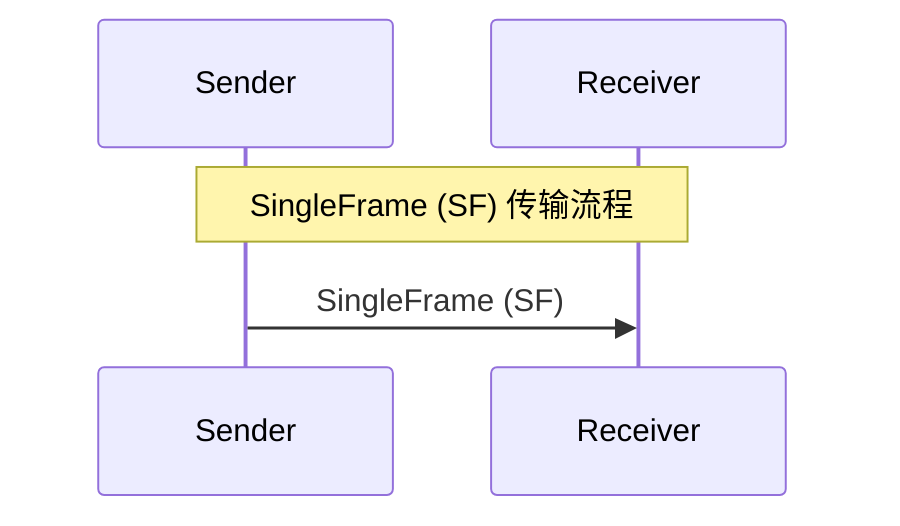
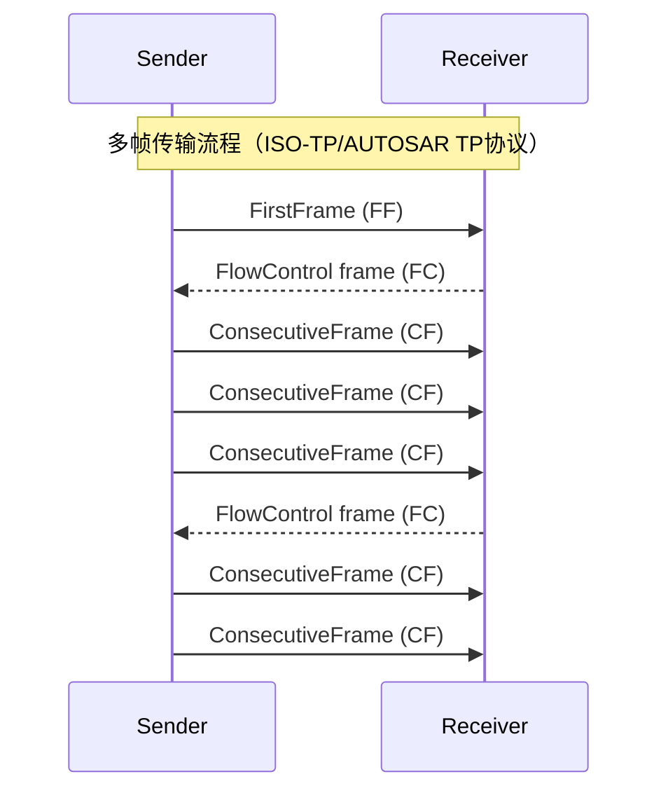

# 概述

> [!tip] 
>
> 可参见http://main.weike-iot.com:2211/ebooks/can/%E8%BD%A6%E8%BD%BD%E8%AF%8A%E6%96%AD%E6%A0%87%E5%87%86ISO_15765-2_cn.pdf

# CanTp

 CanTp位于CanIf与PDUR之间，主要目的是对大于8字节的CAN I-PDU，大于64字节的CANFD I-PDU进行分段与重组。位置如下图。

CAN接口(Canlf)提供了平等的机制来访问CAN总线通道，而不管它的位置(uC内部/外部)。从CAN控制器的位置(片上/板上)提取ECU硬件布局和CAN驱动程序的数量。由于CanTp只处理传输协议帧(即SF, FF, CF和FC pdu)，根据N-PDU ID, CAN接口必须将I-PDU转发给CanTp或PduR。根据AUTOSAR的基本软件架构，CanTp提供以下服务:

1. 传输方向的数据分割;
2. 接收方向的数据重组;
3. 数据流控制;
4. 检测分段会话中的错误
5. 传输取消
6. 接收取消

# 名词缩写

## 前缀

| 前缀 | 描述                                                         |
| ---- | ------------------------------------------------------------ |
| I-   | 关联AUTOSAR COM交互层                                        |
| L-   | 关联Canlf，相当于逻辑链路层，上层是数据链路层下层为介质访问控制，介质 其实就是硬件抽象 |
| N-   | 关联CanTp，可以认为是网络层，个人理解N代表多个               |

| ISO Layer                          | Layer Prefix | AUTOSAR Modules            | PDUName | CAN/ TTCAN prefix                    | LIN prefix                           | FlexRay prefix                    |
| ---------------------------------- | ------------ | -------------------------- | ------- | ------------------------------------ | ------------------------------------ | --------------------------------- |
| Layer 6 Presentation (Interaction) | I            | COM,DCM                    | I-PDU   | N/A                                  | ==                                   | ==                                |
| :                                  | I            | PDU router,PDU multiplexer | I-PDU   | N/A                                  | ==                                   | ==                                |
| Layer 3 Network Layer              | N            | TP Layer                   | N-PDU   | CAN SF CAN FF CAN CF CAN FC | LIN SF LIN FF LIN CF LIN FC | FR SF  FR FF FR CF FR FC |
| Layer 2: Data LinkLayer            | L            | Driver,Interface           | L-PDU   | CAN                                  | LIN                                  | FR                                |

## 协议数据缩写

关联CanTp的缩写词, PDU是“协议数据单元”的缩写。PDU包含SDU和PCI。在传输端，PDU从上层传递到下层，下层将这个PDU解释为它的SDU。    

| 缩写词                   | 描述                                                         |
| ------------------------ | ------------------------------------------------------------ |
| CAN L-SDU                | 属于CanIf模块，与N-PDU类似                                   |
| CAN LSduId               | CanIf内独一无二的ID，用于引用L-SDU的路由属性，因此为了通过API与CanIf交互，上层可以引用CAN L-SDU的结构体以此进行数据传递 |
| CAN N-PDU                | 这是CANTP的PDU。它包含唯一标识符、数据长度和数据(协议控制信息加上整个N-SDU或其中的一部分)。 |
| CAN N-SDU                | 这是CANTP的SDU。在AUTOSAR体系结构中,它是来自PDU路由器的一组数据。 |
| CAN N-SDU Info Structure | 这是一个CANTP内部常量结构，包含特定的CAN传输层信息，用于处理相关CAN N-SDU的发送、接收、分段和重组。 |
| I-PDU                    | 这是AUTOSAR COM模块的PDU                                     |
| PDU                      | 在分层系统中，它指的是在给定层的协议中指定的数据单元。它包含该层(SDU)的用户数据以及可能的协议控制信息。X层的PDU为其下层X-1层的SDU，即(X)-PDU =(x-1)-SDU)。 |
| PduInfo Type             | 该类型是指用于存储处理PDU(或SDU)收发基本信息的结构，即指向其在RAM中的有效载荷的指针及其长度(以字节为单位)。 |
| SDU                      | 在分层系统中，这是指由给定层的服务用户发送的一组数据，并将其传输给对等服务用户，同时保持语义不变。 |

> [!tip]  
>
> 对于PDU和SDU，PDU 是协议数据单元，表示在 **特定通信层** 中传输的数据单元，包含该层的协议控制信息和有效载荷。SDU 是服务数据单元，表示 **上一层传递给当前层的数据**，不包含当前层的协议信息。可以看作是$PDU = PCI + SDU$ （当前层的协议控制信息 + 上一层的数据单元）

# 帧类别

N-PDU的格式为

| 地址信息 | 协议控制信息 | 数据域 |
| -------- | ------------ | ------ |
| N_AI     | N_PCI        | N_Data |

1. 地址信息(N_AI):N_AI用于标识对等网络实体间的通信。N_AI信息在N_SDU-N_SA,N_TA,N_TAtype,N_AE中接收，应当复制包含在P_PDU中。如果接收到的NSDU中 < MessageData>及< Length>信息很长，需要网络层拆分这些数据以发送完整的信息，N_AI应当被复制并包含在每一个要发送的NPDU中。该域包含地址信息标识交互信息类型，数据交互的接收方和发送方。地址信息包含信息地址。
2. 协议控制信息(N_PCI):该域标识交互的N_PDUs的类型。它也用来交互在网络层对等实体通信的其它控制参数。
3. 数据域(N_Data):NPDU中的N_Data用于发送在< MessageData>参数中从服务使用者使用N_USData.request服务接收的数据。如果必要的话，会在网络发送之前拆分为更小的部分，以适应NPDU数据域。N_Data的大小依赖N_PDU的类型及地址格式的选取。

所有的N_PDU通过N_PCI来标识：

| N_PDU名      | N_PCI字节     | ==    | ==    | ==    |
| ------------ | ------------- | ----- | ----- | ----- |
| ：           | 字节1         | ==    | 字节2 | 字节3 |
| ：           | 7-4位         | 3-0位 | ：    | ：    |
| 单帧（SF）   | N_PCItype=0   | SF_DL | N/A   | N/A   |
| 首帧（FF)    | N_PCItype = 1 | FF_DL | ==    | N/A   |
| 连续帧（CF） | N_PCItype = 2 | SN    | N/A   | N/A   |
| 流控（FC）   | N_PCItype=3   | FS    | BS    | STmin |

其中N_PCItype参数的定义为

| 16进制值 | 描述                                                         |
| -------- | ------------------------------------------------------------ |
| 0        | 单帧 (SF) 对于未拆分的信息，网络层提供了一个优化的网络协议，即将信息长度值仅放置在PCI字节里。单帧（SF）应当能支持在单个CAN帧中的信息传输。 |
| 1        | 首帧(FF)  首帧只支持一条信息无法在单个CAN帧中发送时使用。例如，拆分的信息。拆分信息的第一帧编码为FF，在接收到FF时，接受网络层实体应重组这些信息。 |
| 2        | 连续帧 (CF) 当发送拆分数据时，所有的连续帧跟着FF编码为连续帧（CF）。在接收到一个 连续帧，接受网络层实体应当重组接收到的数据字节直到整个信息被接收到。 接收实体在接收最后一帧信息并无接收错误之后，应传递这些信息到相邻的上 层。 |
| 3        | 流控帧(FC)  流控制的目的是调整CF N_PDUs发送的速率。流控协议数据单元的3种类型用 于支持这些功能。这些类型由协议控制信息的流状态（FS）域指示。 |
| 4-F      | 保留 该范围的值为该协议保留。                             |

## SF

N_PDU的格式为:

| byte  | ==   | ==   | ==   | ==    | ==   | ==   | ==   |
| ----- | ---- | ---- | ---- | ----- | ---- | ---- | ---- |
| Byte1 | ==   | ==   | ==   | ==    | ==   | ==   | ==   |
| 7     | 6    | 5    | 4    | 3     | 2    | 1    | 0    |
| 0     | 0    | 0    | 0    | SF_DL | ==   | ==   | ==   |

SF_DL值的定义为

| 16进制值 | 说明                                                         |
| -------- | ------------------------------------------------------------ |
| 0        | 保留 该范围的值为该协议保留。                             |
| 1-6      | 单帧数据长度值（SF_DL） SF_DL应编码在N_PCI字节低位，并分配服务参数的值。 |
| 7        | 单帧数据长度（SF_DL）中标准地址 SF_DL=7时，只允许标准地址    |
| 8-F      | 无效的 该范围值无效                                       |

如果网络层接收到一个SFDL=0的单帧(SF),网络层应当忽略接收SF N_PDU。如果网络层接收到使用标准地址且一个S℉DL大于7的单帧，或大于6且使用扩展或混合地址时，网络层应当忽略该SF N PDU。

## FF

N_PDU的格式为:

| byte  | ==   | ==   | ==   | ==    | ==   | ==   | ==   | ==    |
| ----- | ---- | ---- | ---- | ----- | ---- | ---- | ---- | ----- |
| Byte1 | ==   | ==   | ==   | ==    | ==   | ==   | ==   | Byte2 |
| 7     | 6    | 5    | 4    | 3     | 2    | 1    | 0    |       |
| 0     | 0    | 0    | 1    | FF_DL | ==   | ==   | ==   | ==    |

FF_DL值的定义为:

| 16进制数 | 说明                                                         |
| -------- | ------------------------------------------------------------ |
| 0-6      | 无效的 该范围值无效                                       |
| 7        | 首帧数据字节（FF_DL）支持扩展地址及混合地址  FF_DL=7只允许扩展地址及混合地址 |
| 8 -FFF   | 首帧数据字节（FF_DL）  拆分信息在12个位的长度（FF_DL）上编码，并NPCI字节2中最低位置位“0”， NPCI字节1中最高位置为“3”。拆分信息最大数据长度支持4095个用户数据。 该数据当被分配到服务参数< Length>中。 |

如果网络层接收到FF_DL大于接收方缓冲区的首帧时，应当被认为是错误情况。网络层应当放弃该信息的接收，并且发送包含参数FlowStatus=Overflow的FC N_PDU。如果网络层接收到FF_DL小于8并且使用标准地址，或小于7并且使用扩展地址或混合地址时，网络层应当忽略该首帧并且不必发送一个FC N_PDU。

## CF

N_PDU的格式为:

| byte  | ==   | ==   | ==   | ==   | ==   | ==   | ==   |
| ----- | ---- | ---- | ---- | ---- | ---- | ---- | ---- |
| Byte1 | ==   | ==   | ==   | ==   | ==   | ==   | ==   |
| 7     | 6    | 5    | 4    | 3    | 2    | 1    | 0    |
| 0     | 0    | 1    | 0    | SN   | ==   | ==   | ==   |

SN参数的定义：

| 16进制值 | 描述                                                         |
| -------- | ------------------------------------------------------------ |
| 0-F      | 连续号（SN） 连续号应当在N_PCI字节1的低字位编码。SN设置值范围在0到15. |

CF N_PDU中参数SN用以说明连续帧的顺序。

- 对于所有拆分信息，SN开始于0。首帧应当分配值0，它不是明确地包含在NPCI域中，但应当按拆分信息顺序号为0。
- 紧随FF的第一个CF的SN应该被设置为1
- 在同一个拆分信息上，每一个新增的连续帧编号(SN)增1：
- 连续帧编号(SN)的值不受流控帧的影响。
- 当连续帧编号(SN)到达值15时，它在下一个连续帧中重置为0：

顺序编号为

| N_PDU    | FF   | CF   | CF   | CF   | CF   | CF   | CF   |
| -------- | ---- | ---- | ---- | ---- | ---- | ---- | ---- |
| SN (hex) | 0    | 1    | ·... | E    | F    | 0    | 1    |

如果接收到一个连续号错误的CF N_PDU信息，网络层则进行出错处理。信息的接收被终止，并且网络层发送一个<N_Result>参数=N_WRONG_SN的N_USData.indication指示服务至相邻上层。

## FC

N_PDU的格式为:

| byte  | ==   | ==   | ==   | ==   | ==   | ==   | ==   | ==    | ==    |
| ----- | ---- | ---- | ---- | ---- | ---- | ---- | ---- | ----- | ----- |
| Byte1 | ==   | ==   | ==   | ==   | ==   | ==   | ==   | Byte2 | Byte3 |
| 7     | 6    | 5    | 4    | 3    | 2    | 1    | 0    |       |       |
| 0     | 0    | 1    | 1    | FS   | ==   | ==   | ==   | BS    | STmin |

**FS参数定义**：流状态参数(FS)指示发送网络实体是否继续信息的发送，发送网络层实体应当支持所有FS参数规定（不是保留的）的值。

| 16进制值 | 说明                                                         |
| -------- | ------------------------------------------------------------ |
| 0        | 继续发送（CTS）  流控帧继续发送参数，通过编码N_PCI第1字节为“0”，表示继续发送。它会促使发送方重新发送连续帧，该值意味着接收者准备好接收最大BS个连续帧。 |
| 1        | 等待（WT）  流控帧等待参数通过编码N_PCI第1字节为“1”。它会促使发送方继续等待新的流控帧(NPDU)的到来，并重新设置N_BS定时器。 |
| 2        | 溢出（OVFLW）  流控帧溢出参数通过编码NPCI第1字节为“2”。它会促使发送方中止拆分信息的发送并且做传递参数=N_BUFFER_OVFLW的N_USData.confirm指 示服务。该NPCI流控参数值仅能在跟在首帧NPDU的流控帧中使用，并且仅能在首帧中FF_DL信息的长度超过了接收实体缓冲区大小时使用。 |
| 3-F      | 保留  该范围的值为该协议保留                              |

如果接收到的FC N_PDU信息参数出错，网络层进行出错处理。信息的发送被中止，并且网络层传递一个参数< N_Result>=N_INVALID_FS的N_USData.confirm指示服务至相邻的上层。

**BS参数定义：** 

| 16进制值 | 说明                                                         |
| -------- | ------------------------------------------------------------ |
| 00       | 块大小（BS）  BS参数为0用于指示发送者在拆分数据的发送期间,流控制帧不再发送流控制帧了。发送网络层实体应当不停的发送剩下的连续帧以便接收网络层实体另外的流控帧，也就是说可以一直发送连续帧。 |
| 01-FF    | 块大小（BS） 该范围的BS参数值用于指示发送方在没有接收网络实体的流控帧期间能发送 的最大数目的连续帧。 |

**STmin参数定义**：间隔时间(STmin)参数应当编码在FC N_PCI字节3。该时间在拆分数据发送过程中，由接收实体指定，并且由发送网络实体遵守。==STmin参数值指定了连续帧协议数据单元发送的最小时间间隔==。

| 16进制值 | 说明                                                         |
| -------- | ------------------------------------------------------------ |
| 00-7F    | 间隔时间（STmin）范围：0ms-127ms  该STmin单元的范围00－7F为绝对单位毫秒（ms） |
| 80-F0    | 保留  该范围值为该协议保留                                |
| F1-F9    | 间隔时间（STmin）范围100us－900us  该STmin单元的范围F1-F9最小分编为100微秒（us），参数值F1代表100us， 参数值F9代表900us。 |
| FA-FF    | 保留  该范围值为该协议保留                                |

STmin的度量是在一个连续帧发送完开始到请求下一个连续帧时的间隔时长。例如, 如果STmin=10(十进制)，则连续帧网络协议数据单元最小时间间隔=10ms。

在拆分数据发送期间，如果FC N_PDU信息接收到ST参数值为保留值，发送网络实体则使用最长的ST值，即(7F-127ms),而不使用从接收网络实体接收到的值。

**FC.Wait帧传递的最大值(N_WFTmax)**:该变量用于避免在通信发送方出现潜在错误挂起的时候，后者可能会持续等待。该参数用于对等通信并不被传递，因此不包含在FC的协议数据单元里。

- N_WFTmax参数应当指示一组能有多少个FC N_PDU WT能被接收者接收。
- N_WFTmax参数的上限由用户根据系统时钟定义。
- N_WFTmax参数仅由接收网络实体在接收信息的时候使用。
- 如果N_WFTmax参数值设置为0,流控应当继续仅使用FC N_PDU CTS。流控等待(FC N_PDU WT)不应再该网络实体中使用。

# 数据传输

**单帧传输**

**多帧传输**

> [!tip] 
>
> 多帧传输过程为：
>
> 首帧-->流控(其中需要传入bs参数)-->连续帧发送bs大小-->流控（传入接下来的bs大小）-->连续帧...以此类推
>
> 当bs为0的时候表示中间不需要流控，可以一直发送。 

# 时间参数

不同的层级有不同的时间参数管理：

1. 传输层

   | 参数  | 含义                                                         |
   | ----- | ------------------------------------------------------------ |
   | BS    | BlockSizeECU发送流控帧后，Tester被允许发送 连续帧最大帧数据，为0可以一直发。 |
   | STmin | ECU发送流控帧后，连续帧之间的最大时间间隔                    |

2. 网络层

   | 定时 参数            | 描述                                                         | 数据链路服务                                                 | ==                     | 超时（ms） | 运行需求 (ms)           |
   | -------------------- | ------------------------------------------------------------ | ------------------------------------------------------------ | ---------------------- | ---------- | ----------------------- |
   | ：                   | ：                                                           | Start                                                        | End                    | ：         | ：                      |
   | N_As                 | 发送方从请求发送到发送完成的时间间隔，超过这个时间发送中断 举例上位机发03 22 F1 84接收方CAN 帧发送时间（任何 N_PDU) ECU响应10 01 62 F1 84 这段时间直至下一 个流控帧接收的时间 | L_Data.request                                               | L_Data.confirm         | 70         | N/A                     |
   | N_Ar                 | 传输流控帧到发送方的时间                                     | L_Data.request                                               | L_Data.confirm         | 70         | N/A                     |
   | N_Bs                 | 首帧发送成功的时间节点到流控帧接收成功的时间节点，也就是说从数据确认发送到收到流控帧的最大时间间隔 | L_Data.confirm(FF)  L_Data. confirm (FC) L_Data.indicate(FC) | L_Data.indicate(FC)    | 150        | N/A                     |
   | N_Br                 | 接收到首帧到发送流控帧的时间                                 | L_Data.indicate(FF) L_Data.confirm(FC)                       | L_Data.request (FC)    | 50         | (N_Br+ N_Ar)<(0.9*N_Bs) |
   | N_Cs                 | 接收到流控帧到发送连续帧的最大时间间隔，此处注意不是STmin的含义 | L_Data.confirm(FC) L_Data.indication(CF)                     | L_Data.request (CF)    | 50         | (N_Cs+ N_As)<(0.9*N_Cr) |
   | N_Cr                 | 接受方成功发送流控帧到接收到连续帧的时间                     | L_Data.confirm(FC) L_Data.indication(CF)                     | L_Data.indication (CF) | 150        | --                      |
   | S:发送者 R:接收者 | ==                                                           | ==                                                           | ==                     | ==         | ==                      |

3. 会话层

   | 参数      | 含义                                                |
   | --------- | --------------------------------------------------- |
   | S3_Tester | 发送方维持非默认会话的最大时间                      |
   | S3_Sever  | 接收方未接受到任何诊断报文维持在非默认会话下 的时间 |

4. 应用层

   | 参数         | 含义                                                         |
   | ------------ | ------------------------------------------------------------ |
   | P2_Client    | 发送方发送完请求消息后等待服务器响应超时的时 间              |
   | P2*_Client   | 发送方收到否定响应码为0x78的否定响应后等待接 受方发送响应的增强型超时时间设置。 |
   | P2_Sever     | 接收方收到请求后发出响应的实际时间                           |
   | P2*_Sever    | 接收方发送0x78否定响应到发出否定响应的实际时 间。 (此处很少用) |
   | P3_ClientPyh | 发送方在收到物理寻址（phy）的肯定响应下允许发 送下一条物理寻址请求的最小时间间隔 |
   | P3_ClientFun | 发送方在收到物理寻址（phy）的肯定响应下允许发 送下一条功能寻址（fun）的最小时间间隔 |

## 单帧传输

1. 发送方N_USData.req：会话层向传输网络层发出未分段的消息

   发送方L_Data.req：传输网络层将单帧传输到数据链路层并启动N_As计时器。

2. 接收器L_Data.ind：数据链路层向传输网络层发出CAN帧的接收。

   接收方N_USData.ind：传输网络层向会话层下发未分段的完成信息。

   发送方 L_Data.con：数据链路层向传输网络层确认 CAN 帧已被发送已确认。发送方停止 N_As 计时器。

   发送方N_USData.con：传输网络层向会话层发出未分段的完成信息

## 多帧传输

1. 发送方N_USData.req：会话层向传输网络层发出分段消息。

   发送方L_Data.req：传输网络层将首帧传输到数据链路层并启动N_As定时器。

2. 接收方L_Data.ind：数据链路层向传输网络层发出CAN帧的接收。接收器启动 N_Br 定时器。

   接收方N_USDataFF.ind：传输网络层向会话层发出接收第一个帧的消息分段消息。

   发送方L_Data.con：数据链路层向传输网络层确认 CAN 帧已被发送，发送方停止N_As 定时器并启动N_Bs 定时器。

3. 接收方L_Data.req：传输网络层传输流控（ContinueToSend和BlockSize，值为2d)到数据链路层并启动N_Ar定时器。

4. 发送方 L_Data.ind：数据链路层向传输/网络层发出CAN 帧的接收。发送方停止 N_Bs 计时器并启动 N_Cs 计时器。
   接收方 L_Data.con：数据链路层向传输/网络层确认CAN帧已确认。接收器停止 N_Ar 定时器并启动 N_Cr 定时器。

5. 发送方 L_Data.req：传输/网络层将第一个 ConsecutiveFrame 传输到数据链路层并启动 N_As 定时器。

6. 接收方 L_Data.ind：数据链路层向传输/网络层发出 CAN 帧的接收。接收器重新启动 N_Cr 定时器。
   发送方 L_Data.con：数据链路层向传输/网络层确认 CAN 帧已被确认。发送方停止 N_As 定时器，并根据前一个 FlowControl 的分离时间值 （STmin） 启动 N_Cs 定时器。

7. 发送方 L_Data.req：当 N_Cs 定时器经过时（STmin），传输/网络层将下一个 ConsecutiveFrame 传输到数据链路层，并启动 N_As 定时器。

8. 接收方 L_Data.ind：数据链路层向传输/网络层发出 CAN 帧的接收。接收器停止 N_Cr 定时器并启动 N_Br 定时器。
   发送方 L_Data.con：数据链路层向传输/网络层确认 CAN 帧已被确认。发送方停止 N_As 计时器并启动 N_Bs 计时器。发送方正在等待下一个 FlowControl。

9. 接收方 L_Data.req：传输/网络层将 FlowControl（等待）传输到数据链路层并启动 N_Ar 定时器。

10. 发送方 L_Data.ind：数据链路层向传输/网络层发出 CAN 帧的接收。发送方重新启动 N_Bs 计时器。
    接收方 L_Data.con：数据链路层向传输/网络层确认 CAN 帧已确认。接收器停止 N_Ar 定时器并启动 N_Br 定时器。

11. 接收方 L_Data.req：传输/网络层将 FlowControl （ContinueToSend） 传输到数据链路层并启动 N_Ar 计时器。

12. 发送方 L_Data.ind：数据链路层向传输/网络层发出 CAN 帧的接收。发送方停止 N_Bs 计时器并启动 N_Cs 计时器。
    接收方 L_Data.con：数据链路层向传输/网络层确认 CAN 帧已确认。接收器停止 N_Ar 定时器并启动 N_Cr 定时器。

13. 发送方 L_Data.req：传输/网络层将 ConsecutiveFrame 传输到数据链路层，启动 N_As 定时器。

14. 接收方 L_Data.ind：数据链路层向传输/网络层发出 CAN 帧的接收。接收器重新启动 N_Cr 定时器。
    发送方 L_Data.con：数据链路层向传输/网络层确认 CAN 帧已被确认。发送方停止 N_As 定时器，并根据前一个 FlowControl 的分离时间值 （STmin） 启动 N_Cs 定时器。

15. 发送方 L_Data.req：当 N_Cs 定时器（STmin）过去时，传输/网络层将最后一个 ConsecutiveFrame 传输到数据链路层，并启动 N_As 定时器。

16. 接收方 L_Data.ind：数据链路层向传输/网络层发出 CAN 帧的接收。接收器停止 N_Cr 计时器。
    接收方 N_USData.ind：传输/网络层向会话层发出分段消息的完成。

更清晰的时间参数图为：

## 超时处理

| 超时 | 触发                                                         | 动作                                                         |
| ---- | ------------------------------------------------------------ | ------------------------------------------------------------ |
| N_As | 发送方没有及时发送N_PDU                                      | 放弃信息的接收并传递< N_Result>= N_TIMEOUT_A的N_USData.confirm指示 |
| N_Ar | 接收方没有及时发送N_PDU                                      | 放弃信息的接收并传递< N_Result>= N_TIMEOUT_A 的N_USData.confirm指示 |
| N_Bs | 发送方没有接收到流控帧（丢失， 覆盖）或在首帧前收到，或连续 帧没有被接收方接收到。 | 放弃信息的发送并传递< N_Result>= N_TIMEOUT_Bs的N_USData.confirm指示 |
| N_Cr | 接收方没有收到连续帧或之前流 控帧未被发送方收到。            | 放弃信息的接收并传递< N_Result>= N_TIMEOUT_Cr的N_USData.confirm指示 |

# 地址映射

网络层数据交互有三种地址格式的支持：

1. 标准
2. 扩展
3. 混合

不同的地址格式需要不同数据长度的CAN帧对包含数据的地址信息进行打包。因此，选择单个CAN帧的数据长度依赖于地址格式类型的选取。

> [!note] 
>
> 注意：这里的地址和数据格式中的Can ID不同，标准地址并不是标准帧中的CAN id

## 标准地址

标准地址的组成格式如下：

| N_PDU类型    | CAN标识 | CAN帧数据域 | ==     | ==     | ==    | ==    | ==    | ==    | ==    |
| ------------ | ------- | ----------- | ------ | ------ | ----- | ----- | ----- | ----- | ----- |
|              |         | 字节1       | 字节2  | 字节3  | 字节4 | 字节5 | 字节6 | 字节7 | 字节8 |
| 单帧（SF)    | N_AI    | N_PCI       | N_Data | ==     | ==    | ==    | ==    | ==    | ==    |
| 首帧（FF)    | N_AI    | N_PCI       | ==     | N_Data | ==    | ==    | ==    | ==    | ==    |
| 连续帧（CF） | N_AI    | N_PCI       | N_Data | ==     | ==    | ==    | ==    | ==    | ==    |
| 流控帧（FC)  | N_AI    | N_PCI       | ==     | ==     | ==    | N/A   | ==    | ==    | ==    |

在标准地址中，不同的N_SA、N_TA、N_TAtype的每个组合，都会分配一个唯一的Can标识符，即一个CAN id就已经定义了这些参数，所以可以将N_AI等价为Can ID。

> [!tip] 
>
> 注意：以上表格是功能和物理寻址，但是实际上，功能寻址只有单帧数据格式，没有其他的数据格式。

标准混合地址是标准地址的子格式，也就是映射到CAN标识的地址信息更多一层定义。对于标准混合通信只允许有29bit的CAN标识。

标准混合地址物理寻址的数据格式为：

| N_PDU类型    | 29bitCAN标识，位地址 | ==   | ==   | ==       | ==     | ==    | CAN数据域位地址 | ==     | ==     | ==   | ==   | ==   | ==   | ==   |
| ------------ | -------------------- | ---- | ---- | -------- | ------ | ----- | --------------- | ------ | ------ | ---- | ---- | ---- | ---- | ---- |
|              | 28...26              | 25   | 24   | 23..·16  | 15...8 | 7...0 | 1               | 2      | 3      | 4    | 5    | 6    | 7    | 8    |
| 单帧(SF)     | 110 (bin)            | 0    | 0    | 218(dec) | N_TA   | N_SA  | N_PCI           | N_Data | ==     | ==   | ==   | ==   | ==   | ==   |
| 首帧(FF)     | 110 (bin)            | 0    | 0    | 218(dec) | N_TA   | N_SA  | N_PCI           | ==     | N_Data | ==   | ==   | ==   | ==   | ==   |
| 连续帧(CF)   | 110 (bin)            | 0    | 0    | 218(dec) | N_TA   | N_SA  | N_PCI           | N_Data | ==     | ==   | ==   | ==   | ==   | ==   |
| 流控帧（FC） | 110 (bin)            | 0    | 0    | 218(dec) | N_TA   | N_SA  | N_PCI           | ==     | ==     | N/A  | ==   | ==   | ==   | ==   |

> [!tip] 
>
> 注意：功能寻址仅有单帧数据格式，且23...16位域位219（dec）

## 拓展地址

对于N_SA,N_TA,N_TAtype,,一个特定的CAN标识符被分配。N_TA安置在CAN帧数据域第一个字节，N_PCI和N_Data安置在CAN帧数据域剩下的字节。

| N_PDU类型    | CAN标识     | CAN帧数据域 | ==    | ==     | ==     | ==    | ==    | ==    | ==    |
| ------------ | ----------- | ----------- | ----- | ------ | ------ | ----- | ----- | ----- | ----- |
|              |             | 字节1       | 字节2 | 字节3  | 字节4  | 字节5 | 字节6 | 字节7 | 字节8 |
| 单帧（SF)    | N_AI,无N_TA | N_TA        | N_PCI | N_Data | ==     | ==    | ==    | ==    | ==    |
| 首帧（FF)    | N_AI,无N_TA | N_TA        | N_PCI | ==     | N_Data | ==    | ==    | ==    | ==    |
| 连续帧（CF)  | N_AI,无N_TA | N_TA        | N_PCI | N_Data | ==     | ==    | ==    | ==    | ==    |
| 流控帧（FC） | N_AI,无N_TA | N_TA        | N_PCI | ==     | ==     | N/A   | ==    | ==    | ==    |

## 混合地址

混合地址是将Mtype设置为远程诊断的地址格式。混合地址物理寻址的数据格式为：

| N_PDU类型    | 29bitCAN标识，位地址 | ==   | ==   | ==       | ==     | ==     | CAN数据域位地址 | ==    | ==     | ==     | ==   | ==   | ==   | ==   |
| ------------ | -------------------- | ---- | ---- | -------- | ------ | ------ | --------------- | ----- | ------ | ------ | ---- | ---- | ---- | ---- |
|              | 28...26              | 25   | 24   | 23...16  | 15...8 | 7...01 | 1               | 2     | 3      | 4      | 5    | 6    | 7    | 8    |
| 单帧(SF)     | 110 (bin)            | 0    | 0    | 206(dec) | N_TA   | N_SA   | N_AE            | N_PCI | N_Data | ==     | ==   | ==   | ==   | ==   |
| 首帧(FF)     | 110 (bin)            | 0    | 0    | 206(dec) | N_TA   | N_SA   | N_AE            | N_PCI | ==     | N_Data | ==   | ==   | ==   | ==   |
| 连续帧(CF)   | 110 (bin)            | 0    | 0    | 206(dec) | N_TA   | N_SA   | N_AE            | N_PCI | N_Data | ==     | ==   | ==   | ==   | ==   |
| 流控帧（FC） | 110(bin)             | 0    | 0    | 206(dec) | N_TA   | N_SA   | N_AE            | N_PCI | ==     | ==     | N/A  | ==   | ==   | ==   |

> [!tip] 
>
> 注意：功能寻址仅有单帧数据格式，且23...16位域位205（dec）