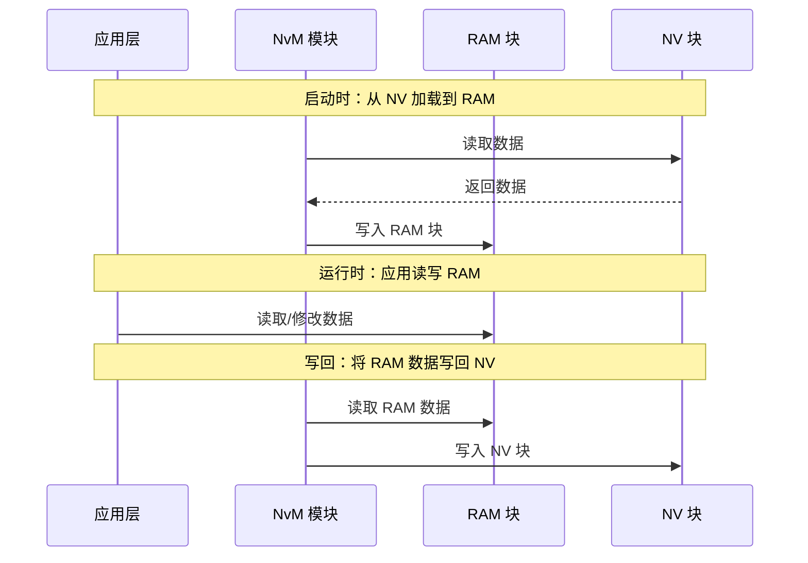
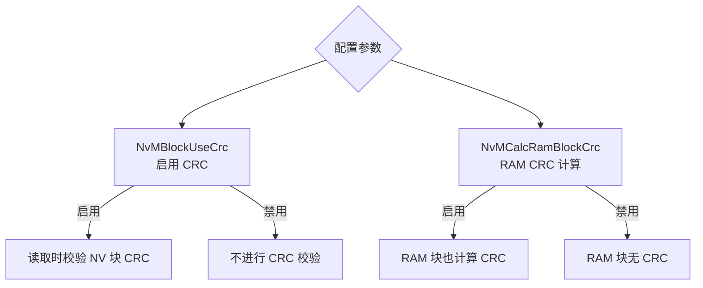
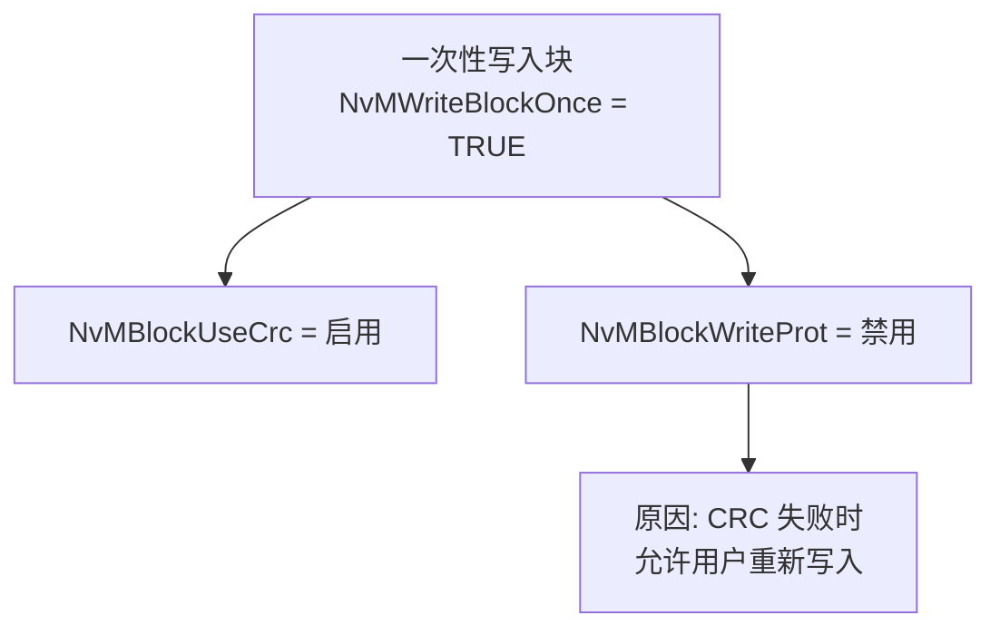
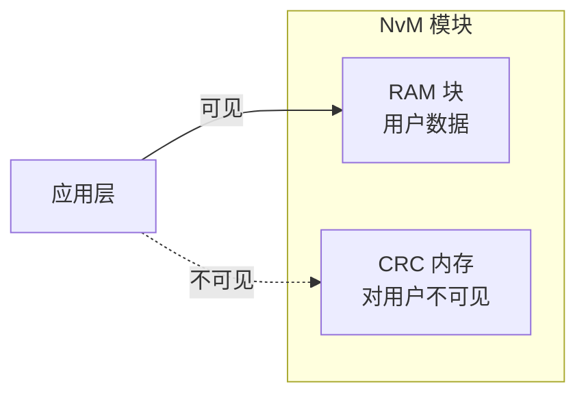
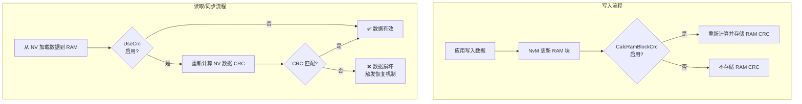

# 概述

> [!tip]
>
> 标准文件请参见[Specification of NVRAM Manager (autosar.org)](https://www.autosar.org/fileadmin/standards/R21-11/CP/AUTOSAR_SWS_NVRAMManager.pdf)

> **NVRAM Manager (NvM)** 是 AUTOSAR 基础软件中的非易失性存储管理模块。它为上层的应用和组件提供了统一的接口，用于管理非易失性数据（如校准参数、配置信息、故障码等），同时屏蔽了底层存储介质（EEPROM、Flash 模拟 EEPROM）的差异。

1. 核心目的与职责

   NVRAM 管理器的主要目标是：根据各个非易失性数据的**个体需求**，在汽车环境中确保数据的存储和维护。

   **核心职责清单**：

   | 职责         | 说明                                      |
   | ------------ | ----------------------------------------- |
   | **数据存储** | 将数据写入非易失性存储介质                |
   | **数据维护** | 确保数据的完整性、一致性和可靠性          |
   | **介质管理** | 同时管理 EEPROM 和 Flash 模拟 EEPROM 设备 |
   | **请求服务** | 提供同步/异步的读写和控制接口             |

2. 支持的服务类型

   NVRAM 管理器为上层提供以下四类服务：

   ```mermaid
   flowchart LR
       subgraph Services [NvM 服务]
           Init[初始化<br/>Init]
           Read[读取<br/>Read]
           Write[写入<br/>Write]
           Control[控制<br/>Control]
       end
       
       subgraph Modes [执行模式]
           Sync[同步<br/>Synchronous]
           Async[异步<br/>Asynchronous]
       end
       
       Init --> Sync
       Read --> Sync
       Read --> Async
       Write --> Sync
       Write --> Async
       Control --> Sync
       Control --> Async
   ```

   | 服务类型   | 说明                                      | 典型场景                       |
   | ---------- | ----------------------------------------- | ------------------------------ |
   | **初始化** | 模块启动时的初始化和配置加载              | 系统启动时                     |
   | **读取**   | 从非易失性存储器读取数据                  | 读取校准参数、配置信息         |
   | **写入**   | 将数据写入非易失性存储器                  | 存储诊断结果、学习值、配置变更 |
   | **控制**   | 控制 NVRAM 的行为（如写立即执行、刷新等） | 强制写入、块管理操作           |

3. 执行模式

   NVRAM 管理器支持两种执行模式：

   | 模式     | 说明                                       | 特点                             |
   | -------- | ------------------------------------------ | -------------------------------- |
   | **同步** | 请求发出后，等待操作完成才返回             | 调用方阻塞，简单但可能影响实时性 |
   | **异步** | 请求发出后立即返回，操作完成后通过回调通知 | 调用方非阻塞，适合长耗时操作     |

   > **设计原则**：同一个接口通常同时提供同步和异步两种版本，让上层根据场景选择。

4. NVRAM 管理器在 BSW 中的位置

   ```mermaid
   flowchart TD
       subgraph APP [应用层 ASW]
           SWC1[软件组件 1]
           SWC2[软件组件 2]
           SWC3[软件组件 3]
       end
       
       subgraph RTE [运行时环境 RTE]
           RTE_Box[RTE]
       end
       
       subgraph BSW [基础软件层 BSW]
           subgraph Services [服务层]
               NvM[NVRAM Manager<br/>NvM]
               MemInt[Memory Interface<br/>MemIf]
           end
           
           subgraph ECU [ECU 抽象层]
               EEP[EEPROM 抽象<br/>EEP]
               Fls[Flash 抽象<br/>Fls]
           end
           
           subgraph MCAL [微控制器抽象层]
               EEP_Drv[EEPROM 驱动]
               Fls_Drv[Flash 驱动]
           end
       end
       
       SWC1 & SWC2 & SWC3 --> RTE
       RTE --> NvM
       NvM --> MemInt
       MemInt --> EEP
       MemInt --> Fls
       EEP --> EEP_Drv
       Fls --> Fls_Drv
   ```

   **层次关系说明**：

   | 层次           | 模块                     | 职责                               |
   | -------------- | ------------------------ | ---------------------------------- |
   | **应用层**     | SWC                      | 通过 RTE 调用 NvM 服务             |
   | **服务层**     | NvM                      | 提供存储服务抽象、块管理、数据保护 |
   | **服务层**     | MemIf                    | 抽象不同存储介质的差异             |
   | **ECU 抽象层** | EEP / Fls                | 具体存储介质的抽象接口             |
   | **MCAL**       | EEPROM 驱动 / Flash 驱动 | 硬件直接访问                       |

5. NvM 在不同 AUTOSAR 分层中的角色定位

   ```mermaid
   flowchart LR
       subgraph Layers [AUTOSAR 分层架构]
           direction TB
           APP[应用层 ASW<br/>业务逻辑、应用数据]
           RTE[运行时环境 RTE<br/>应用与 BSW 的桥梁]
           NvM[NVRAM 管理器 NvM<br/>☑️ 数据存储服务<br/>☑️ 块管理<br/>☑️ 数据完整性保护]
           LL[下层驱动<br/>MemIf / EEP / Fls]
       end
       
       APP <--> RTE
       RTE <--> NvM
       NvM --> LL
   ```

   **NvM 在分层中的定位**：

   - **向上**：通过 RTE 为应用层提供存储服务
   - **向下**：通过 MemIf 调用具体的存储驱动
   - **同级**：与其他服务层模块（如 DCM、COM）协作，提供诊断存储、配置存储等功能

6. NvM 核心功能概览

   ```mermaid
   flowchart TD
       subgraph NvM [NVRAM Manager]
           direction TB
           
           subgraph Management [块管理]
               InitBlock[初始化块]
               ReadBlock[读块]
               WriteBlock[写块]
               EraseBlock[擦除块]
           end
           
           subgraph Protection [数据保护]
               CRC[CRC 校验]
               Redundancy[冗余存储]
               InvalidBlock[无效块处理]
           end
           
           subgraph Policy [存储策略]
               Immediate[立即写入]
               Background[后台写入]
               Polling[轮询模式]
               Priority[优先级管理]
           end
           
           subgraph DatasetMgt [数据集管理]
               DatasetConfig[数据集配置]
               Index[数据集索引]
           end
       end
   ```

7. 典型使用场景

   | 场景         | 数据示例                     | NvM 作用                   |
   | ------------ | ---------------------------- | -------------------------- |
   | **系统启动** | 配置参数、校准值             | 读取初始配置               |
   | **诊断服务** | 故障码存储 ($0x19$/$0x14$)   | 写入/读取/清除 DTC         |
   | **学习功能** | 自适应学习值、传感器漂移补偿 | 运行时写入，下次启动读取   |
   | **标定**     | 校准参数                     | 通过标定工具写入，ECU 读取 |
   | **配置管理** | 车辆配置、功能开关           | 存储用户配置               |

NvM 与相关模块的关系

| 关联模块        | 关系说明                                                     |
| --------------- | ------------------------------------------------------------ |
| **MemIf**       | NvM 通过 MemIf 统一访问不同存储介质                          |
| **EEPROM 驱动** | 直接操作 EEPROM 硬件                                         |
| **Flash 驱动**  | 操作 Flash 硬件，用于模拟 EEPROM                             |
| **DCM**         | NvM 为诊断服务（如 $0x22$ 读取 DID、$0x2E$ 写入 DID）提供数据存储 |
| **COM**         | NvM 可存储通信相关的配置或网关路由信息                       |

# 基础架构

## 内存硬件抽象的寻址方案

> NvM 模块通过**内存抽象接口**（MemIf）与底层存储交互，底层向 NvM 提供一个**虚拟的线性 32 位地址空间**。该地址空间由 **16 位块编号**和 **16 位块内偏移**组成，实现了逻辑块到物理存储的映射。


1. 虚拟地址空间结构 [SWS_NvM_00051]

   底层模块（内存抽象接口、Flash EEPROM 仿真层、EEPROM 抽象层）向 NvM 提供统一的虚拟地址空间：

   | 组成部分                            | 位宽  | 范围      | 说明           |
   | ----------------------------------- | ----- | --------- | -------------- |
   | **块编号** (Block Number)           | 16 位 | 0 - 65535 | 标识一个逻辑块 |
   | **块内偏移** (Block Address Offset) | 16 位 | 0 - 65535 | 块内的字节偏移 |

   **理论最大值**：

   | 资源                   | 最大值   | 计算                  |
   | ---------------------- | -------- | --------------------- |
   | **逻辑块数量**         | 65536 个 | $2^{16}$= 65536       |
   | **单个逻辑块最大尺寸** | 64 KB    | $2^{16}$ = 65536 字节 |

   ```mermaid
   flowchart LR
       subgraph VirtualAddress [32位虚拟地址]
           BlockNum[16位块编号<br/>Block Number]
           Offset[16位偏移<br/>Offset]
       end
       
       BlockNum --> |索引| Block[逻辑块<br/>最大 64KB]
       Offset --> |定位| Byte[块内字节]
   ```

2. 块编号的进一步细分 [SWS_NvM_00122]

   NvM 将 16 位的 `Fee/Ea` 块编号进一步细分为两个部分：

   ```mermaid
   flowchart TD
       subgraph FeeBlockNum [16位 Fee/Ea 块编号]
           BaseBits[高位<br/>NV块基编号<br/>NVM_NV_BLOCK_BASE_NUMBER]
           IndexBits[低位<br/>数据索引<br/>Data Index]
       end
       
       BaseBits --> |位宽 = 16 - N| BaseNum[确定基础块]
       IndexBits --> |位宽 = N| DataSet[选择数据集]
       
       Note[N = NVM_DATASET_SELECTION_BITS]
   ```

   **字段说明**：

   | 字段            | 位宽                              | 配置参数                     | 作用                       |
   | --------------- | --------------------------------- | ---------------------------- | -------------------------- |
   | **NV 块基编号** | 16 - `NVM_DATASET_SELECTION_BITS` | `NVM_NV_BLOCK_BASE_NUMBER`   | 标识一组相关的块           |
   | **数据索引**    | `NVM_DATASET_SELECTION_BITS`      | `NVM_DATASET_SELECTION_BITS` | 在一组块中选择具体的数据集 |

   **示例**：假设 `NVM_DATASET_SELECTION_BITS = 2`

   | 位域     | 位宽  | 取值范围  | 含义                 |
   | -------- | ----- | --------- | -------------------- |
   | 基编号   | 14 位 | 0 - 16383 | 块组标识             |
   | 数据索引 | 2 位  | 0 - 3     | 选择组内第几个数据集 |

3. 基编号的位位置 [SWS_NvM_00123]

   > NV 块基编号位于 `Fee/Ea` 块编号的**最高有效位**（Most Significant Bits）。

   **16 位块编号的位分配**：

   ```mermaid
   flowchart LR
       subgraph BitLayout [16位块编号]
           MSB[高位<br/>MSB] 
           direction LR
           BaseBits[NV块基编号<br/>NVM_NV_BLOCK_BASE_NUMBER<br/>高位]
           IndexBits[数据索引<br/>Data Index<br/>低位]
           LSB[低位<br/>LSB]
       end
       
       MSB --> BaseBits
       BaseBits --> IndexBits
       IndexBits --> LSB
   ```

   | 位位置   | 内容                       | 说明           |
   | -------- | -------------------------- | -------------- |
   | **高位** | `NVM_NV_BLOCK_BASE_NUMBER` | 确定基础块     |
   | **低位** | 数据索引                   | 选择具体数据集 |

4. 数据集和冗余块的处理 [SWS_NvM_00343]

   > 冗余 NVRAM 块的寻址方式与数据集 NVRAM 块**相同**，都通过配置参数 `NvMDatasetSelectionBits` 进行管理。

   **统一寻址模型**：

   ```mermaid
   flowchart TD
       subgraph NvMBlock [NvM 逻辑块]
           BaseNumber[块基编号<br/>Base Number]
       end
       
       BaseNumber --> |+ DataSetIndex| DataSetBlock[数据集块]
       BaseNumber --> |+ RedundancyIndex| RedundantBlock[冗余块]
       
       Note1[数据集块：同一基编号下<br/>不同索引对应不同数据集]
       Note2[冗余块：同一基编号下<br/>不同索引对应冗余副本]
   ```

   | 块类型       | 寻址方式            | 索引含义               |
   | ------------ | ------------------- | ---------------------- |
   | **数据集块** | 基编号 + 数据集索引 | 选择组内的不同数据集   |
   | **冗余块**   | 基编号 + 冗余索引   | 选择同一数据的冗余副本 |

5. 块标识符的配置 [SWS_NvM_00442, SWS_NvM_00443]

   1.  配置工具职责 [SWS_NvM_00442]

      > 配置工具负责配置**块标识符**。

      **典型配置流程**：

      ```mermaid
      flowchart LR
          Tool[配置工具] --> |计算/分配| BlockID[块标识符<br/>Block Identifiers]
          BlockID --> |生成| Config[配置文件<br/>.arxml / .c / .h]
          Config --> |编译时固定| NvM[NvM 模块]
      ```

   2. 运行时不变性 [SWS_NvM_00443]

      > NvM 模块**不得修改**已配置的块标识符。

      | 允许的操作           | 禁止的操作           |
      | -------------------- | -------------------- |
      | 读取配置的块标识符   | ❌ 修改块标识符的值   |
      | 使用块标识符进行寻址 | ❌ 动态重新分配块编号 |
      | 将块标识符传递给下层 | ❌ 覆盖配置的标识符   |

      > **设计原则**：块标识符在配置时确定，编译后即固化。NvM 运行时只读使用，保证存储布局的**确定性**和**可预测性**。

6. 完整寻址层次图

   ```mermaid
   flowchart TD
       subgraph AppLayer [应用层]
           SWC[软件组件<br/>请求读写特定数据]
       end
       
       subgraph NvMLayer [NvM 层]
           LogicalBlock[逻辑块<br/>如：校准数据块]
           BlockID[块标识符<br/>配置时分配]
       end
       
       subgraph AddressTranslation [地址转换]
           BaseNum[提取基编号<br/>NVM_NV_BLOCK_BASE_NUMBER]
           DataIndex[提取数据索引<br/>NVM_DATASET_SELECTION_BITS]
       end
       
       subgraph MemIfLayer [内存抽象层]
           FeeBlockNum[16位 Fee/Ea 块编号<br/>= 基编号 + 索引]
           Offset[16位偏移]
       end
       
       subgraph PhysLayer [物理层]
           EEPROM[EEPROM]
           Flash[Flash 模拟 EEPROM]
       end
       
       SWC --> LogicalBlock
       LogicalBlock --> BlockID
       BlockID --> BaseNum
       BlockID --> DataIndex
       BaseNum --> FeeBlockNum
       DataIndex --> FeeBlockNum
       FeeBlockNum --> MemIfLayer
       Offset --> MemIfLayer
       MemIfLayer --> EEPROM
       MemIfLayer --> Flash
   ```

   

7. 完整寻址转换流程图

   ```mermaid
   flowchart LR
       subgraph Input [输入]
           BlockBase["块基编号<br/>如: 0x100"]
           DatasetIdx["数据集索引<br/>如: 0x2"]
           Offset["块内偏移<br/>如: 0x50"]
       end
       
       subgraph Combine [组合]
           Combined["组合: (BlockBase << DatasetBits) + DatasetIdx"]
       end
       
       subgraph Output [输出到下层]
           FeeBlock["16位 Fee/Ea 块编号<br/>如: 0x402"]
           Final["32位虚拟地址<br/>= (FeeBlock << 16) + Offset"]
       end
       
       BlockBase --> Combined
       DatasetIdx --> Combined
       Combined --> FeeBlock
       FeeBlock --> Final
       Offset --> Final
   ```

   

8.  设计意图

   | 设计点                      | 目的                                   |
   | --------------------------- | -------------------------------------- |
   | **32 位虚拟地址空间**       | 统一 EEPROM 和 Flash 的访问方式        |
   | **16 位块编号 + 16 位偏移** | 支持最多 64K 个块，每块最大 64KB       |
   | **块编号进一步细分**        | 原生支持数据集和冗余块，无需额外配置   |
   | **基编号位于高位**          | 物理相邻的块共享高位，便于存储布局优化 |
   | **配置工具分配标识符**      | 避免运行时计算开销和不确定性           |
   | **块标识符运行时不变**      | 确保存储布局稳定，支持断电恢复         |

> > 例子
>
> 
>
> 核心计算公式：
> $$
> FEE / EA 块编号 = (NvM 块基编号 << NvM 数据集选择位宽) + 数据索引
> $$
>
> | 参数                      | 说明                                         |
> | ------------------------- | -------------------------------------------- |
> | `NvMNvBlockBaseNumber`    | NvM 侧的块基编号                             |
> | `NvMDatasetSelectionBits` | 数据集选择位宽，用于寻址不同数据集或冗余副本 |
> | `数据索引` (DataIndex)    | 0 到 (2^位宽 - 1) 范围内的索引值             |
> | `FEE/EA_BLOCK_NUMBER`     | 传递给下层（Fee/Ea）的实际块编号             |
>
> 
>
> 1. 示例 A：位宽 = 2
>
>    1. 配置参数
>
>       | 参数                      | 值    | 说明                       |
>       | ------------------------- | ----- | -------------------------- |
>       | `NvMDatasetSelectionBits` | 2     | 数据集选择位宽为 2 位      |
>       | 可用于基编号的位数        | 14 位 | 16 位总宽度 - 2 位 = 14 位 |
>
>    2. 取值范围
>
>       | 参数                   | 范围             | 计算                                             |
>       | ---------------------- | ---------------- | ------------------------------------------------ |
>       | `NvMNvBlockBaseNumber` | `0x1` ~ `0x3FFE` | 14 位有效范围（最大值 2^14 - 2）                 |
>       | 数据索引               | `0x0` ~ `0x3`    | 2 位范围：0, 1, 2, 3                             |
>       | `FEE/EA_BLOCK_NUMBER`  | `0x4` ~ `0xFFFB` | 基编号最小值 1 对应 4，最大值 0x3FFE 对应 0xFFFB |
>
>    3. 具体计算示例
>
>       ```mermaid
>       flowchart LR
>           subgraph Formula [计算公式]
>               Step1["(NvMNvBlockBaseNumber << NvMDatasetSelectionBits)"]
>               Step2["+ DataIndex"]
>               Result["= FEE/EA_BLOCK_NUMBER"]
>           end
>       ```
>
>       **示例 1：原生 NVRAM 块**
>
>       | 参数                       | 值                    |
>       | -------------------------- | --------------------- |
>       | `NvMNvBlockBaseNumber`     | 2                     |
>       | `NvMDatasetSelectionBits`  | 2                     |
>       | 左移结果                   | 2 << 2 = 8            |
>       | 数据索引（原生块固定为 0） | 0                     |
>       | **计算结果**               | **FEE/EA 块编号 = 8** |
>
>       **示例 2：冗余 NVRAM 块（基编号 = 3）**
>
>       | 数据索引 | 计算过程              | FEE/EA 块编号 |
>       | -------- | --------------------- | ------------- |
>       | 索引 0   | (3 << 2) + 0 = 12 + 0 | **12**        |
>       | 索引 1   | (3 << 2) + 1 = 12 + 1 | **13**        |
>
>       **示例 3：数据集 NVRAM 块（基编号 = 4，共 3 个数据集）**
>
>       | 数据集编号 | 数据索引 | 计算过程              | FEE/EA 块编号 |
>       | ---------- | -------- | --------------------- | ------------- |
>       | 块 #0      | 0        | (4 << 2) + 0 = 16 + 0 | **16**        |
>       | 块 #1      | 1        | (4 << 2) + 1 = 16 + 1 | **17**        |
>       | 块 #2      | 2        | (4 << 2) + 2 = 16 + 2 | **18**        |
>
> 2. 示例 B：位宽 = 4
>
>    1. 配置参数
>
>       | 参数                      | 值    | 说明                       |
>       | ------------------------- | ----- | -------------------------- |
>       | `NvMDatasetSelectionBits` | 4     | 数据集选择位宽为 4 位      |
>       | 可用于基编号的位数        | 12 位 | 16 位总宽度 - 4 位 = 12 位 |
>
>    2. 取值范围
>
>       | 参数                   | 范围              | 计算                                               |
>       | ---------------------- | ----------------- | -------------------------------------------------- |
>       | `NvMNvBlockBaseNumber` | `0x1` ~ `0xFFE`   | 12 位有效范围                                      |
>       | 数据索引               | `0x0` ~ `0xF`     | 4 位范围：0 ~ 15                                   |
>       | `FEE/EA_BLOCK_NUMBER`  | `0x10` ~ `0xFFEF` | 基编号最小值 1 对应 0x10，最大值 0xFFE 对应 0xFFEF |
>
>       > **计算公式验证**：基编号最小值 1 → (1 << 4) + 0 = 0x10；基编号最大值 0xFFE → (0xFFE << 4) + 15 = 0xFFE0 + 15 = 0xFFEF
>
> 3. 参数关系图
>
>    ```mermaid
>    flowchart TD
>        subgraph NvMConfig [NvM 配置参数]
>            BaseNum[NvMNvBlockBaseNumber<br/>块基编号]
>            SelBits[NvMDatasetSelectionBits<br/>数据集选择位宽]
>        end
>        
>        subgraph Derivation [派生参数]
>            IndexBits[数据索引位宽 = SelBits]
>            BaseBits[基编号位宽 = 16 - SelBits]
>            MaxIndex[最大索引 = 2^SelBits - 1]
>        end
>        
>        subgraph Mapping [映射到下层]
>            FeeBlock[FEE/EA_BLOCK_NUMBER<br/>= BaseNum << SelBits + DataIndex]
>        end
>        
>        subgraph Example [示例 A 取值]
>            ExSel[SelBits = 2]
>            ExBase[BaseNum 范围: 0x1 ~ 0x3FFE]
>            ExFee[Fee 块编号: 0x4 ~ 0xFFFB]
>        end
>        
>        BaseNum --> Mapping
>        SelBits --> Mapping
>        Mapping --> FeeBlock
>        
>    ```
>
> 4. 块类型与索引对应关系
>
>    | 块类型       | 数据索引使用方式 | 说明                             |
>    | ------------ | ---------------- | -------------------------------- |
>    | **原生块**   | 固定为 0         | 单个逻辑块，无需区分数据集或冗余 |
>    | **冗余块**   | 0, 1, 2...       | 每个索引对应一个冗余副本         |
>    | **数据集块** | 0, 1, 2...       | 每个索引对应一个独立的数据集     |
>
>    ```mermaid
>    flowchart LR
>        subgraph Base [块基编号 = X]
>            direction LR
>            N0["索引 0<br/>原生块"]
>        end
>                    
>        subgraph Redundant [块基编号 = Y]
>            direction LR
>            R0["索引 0<br/>冗余副本 0"]
>            R1["索引 1<br/>冗余副本 1"]
>        end
>                    
>        subgraph Dataset [块基编号 = Z]
>            direction LR
>            D0["索引 0<br/>数据集 0"]
>            D1["索引 1<br/>数据集 1"]
>            D2["索引 2<br/>数据集 2"]
>        end
>                    
>        Note["同一基编号下的不同索引<br/>映射到连续的 Fee/Ea 块编号"]
>    ```
>
>    
>
> 5. 数值验证表
>
>    1. 示例A
>
>       | 块类型           | 基编号 | 数据索引 | 左移结果 | +索引 | Fee 块编号 |
>       | ---------------- | ------ | -------- | -------- | ----- | ---------- |
>       | 原生块           | 2      | 0        | 8        | 8     | **8**      |
>       | 冗余块 (第1副本) | 3      | 0        | 12       | 12    | **12**     |
>       | 冗余块 (第2副本) | 3      | 1        | 12       | 13    | **13**     |
>       | 数据集块0        | 4      | 0        | 16       | 16    | **16**     |
>       | 数据集块1        | 4      | 1        | 16       | 17    | **17**     |
>       | 数据集块2        | 4      | 2        | 16       | 18    | **18**     |
>
>    2. 示例 B
>
>       | 参数                      | 示例 A       | 示例 B        |
>       | ------------------------- | ------------ | ------------- |
>       | `NvMDatasetSelectionBits` | 2            | 4             |
>       | 基编号位宽                | 14 位        | 12 位         |
>       | 基编号范围                | 0x1 ~ 0x3FFE | 0x1 ~ 0xFFE   |
>       | 索引范围                  | 0 ~ 3        | 0 ~ 15        |
>       | Fee 块编号范围            | 0x4 ~ 0xFFFB | 0x10 ~ 0xFFEF |
>
> 
>
> 
>
> 


## 基础存储对象

### NV block

> **NV 块**是 NVRAM 管理器中的基本存储对象，代表一个由**用户数据**、**可选 CRC 校验值**和**可选块头**组成的内存区域。它是 NvM 管理数据的最小逻辑单元。


1. 核心定义 [SWS_NvM_00125]

   NV 块是 NvM 模块中的**基本存储对象**，包含以下组成部分：

   | 组成部分        | 是否必选 | 说明                             |
   | --------------- | -------- | -------------------------------- |
   | **NV 用户数据** | ✅ 必选   | 实际存储的应用数据               |
   | **CRC 校验值**  | 可选     | 用于数据完整性校验               |
   | **NV 块头**     | 可选     | 包含块的元信息（如状态、版本等） |

2. NV 块的逻辑结构

   ```mermaid
   flowchart TD
       subgraph NVBlock [NV 块]
           direction TB
           
           subgraph Optional [可选部分]
               Header[NV 块头<br/>可选]
               CRC[CRC 校验值<br/>可选]
           end
           
           UserData[NV 用户数据<br/>必选]
       end
       
       Header --> UserData
       UserData --> CRC
       
       Note1["逻辑顺序示意<br/>实际物理布局可能因配置而异"]
   ```

   

3. 组成部分详解

   | 组件         | 说明                                                         | 典型用途                           |
   | ------------ | ------------------------------------------------------------ | ---------------------------------- |
   | **块头**     | 存储块的元信息，如数据状态（有效/无效/待写入）、版本号、长度等 | 支持数据完整性检查和恢复机制       |
   | **用户数据** | 应用层实际需要存储的数据内容                                 | 校准参数、配置信息、学习值、DTC 等 |
   | **CRC 校验** | 对用户数据（可能包含块头）计算的循环冗余校验值               | 检测数据损坏，支持错误恢复         |

4. 逻辑布局示意图

   ```mermaid
   flowchart LR
       subgraph LogicalView [逻辑视图]
           direction LR
           A[块头<br/>可选] --> B[用户数据<br/>必选] --> C[CRC<br/>可选]
       end
       
       subgraph Examples [配置示例]
           Ex1["配置1: 仅用户数据"]
           Ex2["配置2: 用户数据 + CRC"]
           Ex3["配置3: 块头 + 用户数据"]
           Ex4["配置4: 块头 + 用户数据 + CRC"]
       end
   ```

### RAM block

> **RAM 块**是 NVRAM 管理器中的基本存储对象，代表 RAM 中由**用户数据**、**可选 CRC 校验值**和**可选块头**组成的内存区域。它是 NvM 管理数据在 RAM 中的缓存副本。


1. 核心定义 [SWS_NvM_00126]

   RAM 块是 NvM 模块中的**基本存储对象**，包含以下组成部分：

   | 组成部分       | 是否必选 | 说明                                            |
   | -------------- | -------- | ----------------------------------------------- |
   | **用户数据**   | ✅ 必选   | 应用层访问的数据，与 NV 块中的用户数据对应      |
   | **CRC 校验值** | 可选     | 用于数据完整性校验，与对应 NV 块的 CRC 配置关联 |
   | **块头**       | 可选     | 包含块的元信息，与对应 NV 块的块头配置关联      |

2. RAM 块的逻辑结构

   ```mermaid
   flowchart TD
       subgraph RAMBlock [RAM 块]
           direction TB
           
           subgraph Optional [可选部分]
               Header[块头<br/>可选]
               CRC[CRC 校验值<br/>可选]
           end
           
           UserData[用户数据<br/>必选]
       end
       
       Header --> UserData
       UserData --> CRC
       
       Note1["逻辑结构与 NV 块保持一致<br/>便于数据交换"]
   ```

   

3.  CRC 使用限制 [SWS_NvM_00127]

   RAM 块的 CRC 使用受到以下限制：

   | 限制条件     | 说明                                                |
   | ------------ | --------------------------------------------------- |
   | **前提条件** | 仅当对应的 NV 块也配置了 CRC 时，RAM 块才能使用 CRC |
   | **类型一致** | RAM 块的 CRC 类型必须与对应 NV 块的 CRC 类型相同    |

   ```mermaid
   flowchart LR
       subgraph NVBlock [NV 块]
           NV_Data[用户数据]
           NV_CRC[CRC<br/>可选]
       end
       
       subgraph RAMBlock [RAM 块]
           RAM_Data[用户数据]
           RAM_CRC[CRC<br/>可选]
       end
       
       NV_Data <-.-> RAM_Data
       NV_CRC -.->|类型必须一致| RAM_CRC
       
       Note["如果 NV 块有 CRC<br/>则 RAM 块也必须有 CRC<br/>且类型相同"]
   ```

4. 用户数据区的独立性 [SWS_NvM_00129]

   > RAM 块的**用户数据区**可以与 RAM 块的**状态区**位于不同的 RAM 地址位置（不同的全局数据段）。

   | 区域           | 说明                                  | 位置独立性     |
   | -------------- | ------------------------------------- | -------------- |
   | **用户数据区** | 存储实际的应用数据                    | 可独立配置地址 |
   | **状态区**     | 存储 RAM 块的状态信息（如是否已修改） | 可独立配置地址 |

5. 数据访问的可见性 [SWS_NvM_00130]

   > RAM 块的数据区应**同时可被** NVRAM 管理器和**应用层**访问。

   ```mermaid
   flowchart LR
       subgraph Access [数据访问]
           RAM[RAM 块<br/>数据区]
       end
       
       NvM[NVRAM 管理器] --> RAM
       App[应用层<br/>SWC] --> RAM
   ```

   **双向访问的含义**：

   | 访问方向            | 操作           | 典型场景                 |
   | ------------------- | -------------- | ------------------------ |
   | **应用层 → RAM 块** | 写入/修改数据  | 应用更新校准参数或学习值 |
   | **RAM 块 → 应用层** | 读取数据       | 应用读取配置参数         |
   | **NvM → RAM 块**    | 从 NV 加载数据 | 启动时恢复存储的数据     |
   | **RAM 块 → NvM**    | 写回 NV        | 数据变化后持久化存储     |

6. 用户数据的类型 [SWS_NvM_00373]

   > RAM 块的数据应包含**永久分配**或**临时分配**的用户数据。

   ```mermaid
   flowchart TD
       UserData[RAM 块用户数据] --> Permanent[永久分配<br/>Permanently Assigned]
       UserData --> Temporary[临时分配<br/>Temporarily Assigned]
       
       Permanent --> KnownAddr[配置时地址已知<br/>SWS_NvM_00370]
       Temporary --> UnknownAddr[配置时地址未知<br/>运行时传递<br/>SWS_NvM_00372]
   ```

7. 永久分配 [SWS_NvM_00370]

   > 对于永久分配的用户数据，RAM 块数据的地址在**配置时已知**。

   | 特性             | 说明                           |
   | ---------------- | ------------------------------ |
   | **地址确定时机** | 配置阶段（编译时/链接时）      |
   | **地址传递方式** | 通过配置参数静态指定           |
   | **典型场景**     | 全局变量、静态分配的数据缓冲区 |

8. 临时分配 [SWS_NvM_00372]

   > 对于临时分配的用户数据，RAM 块数据的地址在**配置时未知**，需要在**运行时**传递给 NvM 模块。

   | 特性             | 说明                                   |
   | ---------------- | -------------------------------------- |
   | **地址确定时机** | 运行时动态确定                         |
   | **地址传递方式** | 通过 API 参数传递                      |
   | **典型场景**     | 动态分配的数据块、栈上分配的临时缓冲区 |

   ```mermaid
   sequenceDiagram
       participant App as 应用层
       participant NvM as NvM 模块
       participant RAM as RAM 块数据区
   
       App->>App: 运行时分配/获取数据缓冲区地址
       App->>NvM: 调用 NvM_WriteBlock(地址参数)
       NvM->>RAM: 使用传入的地址访问数据
       NvM-->>App: 操作完成
   ```

9. RAM 块地址分配约束 [SWS_NvM_00088]

   > 每个 RAM 块可以在全局 RAM 区域中**无地址约束**地分配。所有配置的 RAM 块**不需要**位于连续的地址空间中。

   | 特性           | 说明                                |
   | -------------- | ----------------------------------- |
   | **地址约束**   | 无约束，可在任意地址分配            |
   | **地址连续性** | 不需要连续，可分散在 RAM 的不同区域 |
   | **灵活性**     | 编译器/链接器可自由优化内存布局     |

   ```mermaid
   flowchart LR
       subgraph RAM [全局 RAM 区域]
           direction TB
           Block1[RAM 块 1<br/>地址 A]
           Block2[RAM 块 2<br/>地址 C]
           Block3[RAM 块 3<br/>地址 X]
           Other[其他数据]
       end
       
       Note["块之间可以不连续<br/>任意顺序排列"]
   ```

10. 对齐说明

    > NvM 模块不支持对齐，可通过**配置管理**实现对齐需求，即通过添加填充（Padding）来扩大块长度以满足对齐要求。

    | 概念             | 说明                   |
    | ---------------- | ---------------------- |
    | **NvM 对齐支持** | 不支持自动对齐         |
    | **解决方案**     | 配置时手动添加填充字节 |
    | **操作方法**     | 将块长度扩大到对齐边界 |

11. RAM 块与 NV 块的对比

    | 特性           | RAM 块                 | NV 块                    |
    | -------------- | ---------------------- | ------------------------ |
    | **存储介质**   | RAM（易失性）          | EEPROM/Flash（非易失性） |
    | **访问速度**   | 快                     | 慢                       |
    | **数据持久性** | 掉电丢失               | 掉电保留                 |
    | **CRC 限制**   | 必须与 NV 块一致       | 独立配置                 |
    | **地址分配**   | 运行时确定或配置时确定 | 由下层模块管理           |
    | **主要用途**   | 运行时数据缓存         | 数据持久化存储           |

12. 逻辑结构图

    ```mermaid
    flowchart TD
        subgraph RAMBlock [RAM 块]
            direction TB
            
            UserData[用户数据<br/>必选<br/>可被 NvM 和应用访问]
            
            subgraph OptionalRAM [可选部分]
                Header[块头<br/>可选<br/>需与 NV 块对应]
                CRC[CRC 校验值<br/>可选<br/>必须与 NV 块类型一致]
            end
        end
        
        subgraph Location [地址特性]
            Perm[永久分配<br/>配置时地址已知]
            Temp[临时分配<br/>运行时地址传递]
            NoConstraint[无地址约束<br/>可不连续]
        end
        
        UserData --> Location
    ```

    

RAM 块的典型生命周期



### ROM Block

> **ROM 块**是 NVRAM 管理器中的基本存储对象，位于 ROM（通常指代码所在的 Flash）中，用于在 NV 块**为空**或**损坏**时提供**默认数据**，作为数据恢复的兜底机制。

1. 核心定义 [SWS_NvM_00020]

   ROM 块是 NvM 模块中的**基本存储对象**，具有以下特征：

   | 特征         | 说明                             |
   | ------------ | -------------------------------- |
   | **存储位置** | ROM（通常为代码 Flash）          |
   | **数据特性** | 只读，运行时不可修改             |
   | **核心用途** | 为空的或损坏的 NV 块提供默认数据 |
   | **角色定位** | 数据恢复的最后一道防线           |

2. ROM 块在数据恢复流程中的位置

   ```mermaid
   flowchart TD
       Start[读取 NV 块] --> Check1{NV 块<br/>有效？}
       
       Check1 -->|有效| ReadNV[使用 NV 块数据]
       Check1 -->|无效/损坏| Check2{ROM 块<br/>存在？}
       
       Check2 -->|存在| UseROM[使用 ROM 块数据<br/>作为默认值]
       Check2 -->|不存在| Error[返回错误/使用零值]
       
       UseROM --> Optional[可选：将默认数据<br/>写入 NV 块进行恢复]
       
       ReadNV --> Done[完成]
       Optional --> Done
       Error --> Done
   ```

   

3. 典型使用场景

   | 场景             | 说明                                            |
   | ---------------- | ----------------------------------------------- |
   | **首次上电**     | NV 块从未被写入过，ROM 块提供出厂默认配置       |
   | **数据损坏**     | NV 块 CRC 校验失败，ROM 块提供备用数据          |
   | **存储介质故障** | EEPROM/Flash 物理损坏，ROM 块确保 ECU 仍可工作  |
   | **版本回退**     | 当 NV 块数据版本不兼容时，使用 ROM 块中的默认值 |

4. ROM 块与 NV 块、RAM 块的关系

   ```mermaid
   flowchart LR
       subgraph Storage [存储层次]
           ROM[ROM 块<br/>默认数据<br/>只读]
           NV[NV 块<br/>运行时数据<br/>可读写]
           RAM[RAM 块<br/>运行时的数据副本<br/>可读写]
       end
       
       ROM -->|提供默认数据<br/>用于恢复| NV
       NV -->|加载到| RAM
       RAM -->|写回| NV
       
       Note1["ROM 块只作为数据来源<br/>不会被 NvM 修改"]
   ```

   | 关系             | 说明                                        |
   | ---------------- | ------------------------------------------- |
   | **ROM → NV**     | 当 NV 块无效时，NvM 将 ROM 数据复制到 NV 块 |
   | **NV → RAM**     | 正常启动时，NV 数据加载到 RAM 供应用使用    |
   | **ROM 不可修改** | NvM 不会向 ROM 块写入任何数据               |

5. 典型配置示例

   ```mermaid
   flowchart LR
       subgraph Config [配置关系]
           ROMBlock[ROM 块<br/>默认数据]
           NVBlock[NV 块<br/>运行时数据]
       end
       
       ROMBlock -->|块 ID 关联| NVBlock
       NVBlock -->|数据长度一致| ROMBlock
       NVBlock -->|数据结构相同| ROMBlock
   ```

### Administrative Block

> **管理块**是位于 RAM 中的一个特殊存储对象，用于管理数据集 NV 块的**块索引**，以及存储对应 NVRAM 块的**属性/错误/状态信息**。它对应用层不可见，专供 NvM 内部使用。

1. 核心定义 [SWS_NvM_00134]

   管理块是 NvM 模块内部使用的 RAM 数据结构，包含以下内容：

   | 组成部分     | 说明                                         |
   | ------------ | -------------------------------------------- |
   | **块索引**   | 与数据集 NV 块关联使用，用于定位具体的数据集 |
   | **属性信息** | 如写保护状态等                               |
   | **错误信息** | 最近一次操作产生的错误码                     |
   | **状态信息** | RAM 块的有效/无效状态                        |

2. 管理块的位置与可见性 [SWS_NvM_00135]

   | 特性               | 说明                            |
   | ------------------ | ------------------------------- |
   | **存储位置**       | RAM                             |
   | **对应用层可见性** | ❌ **不可见**，仅供 NvM 内部使用 |
   | **用途**           | 安全和内部管理目的              |

   > 应用层（SWC）无法直接访问管理块，这是 NvM 模块的**私有数据结构**。

3. 状态信息：RAM 块的有效性 [SWS_NvM_00128]

   NvM 使用**永久 RAM 块**或 **RAM 镜像**的状态信息来确定 RAM 块用户数据的有效性。

   | 状态值             | 含义                                      | [SWS_NvM_00132] |
   | ------------------ | ----------------------------------------- | --------------- |
   | **有效 (Valid)**   | RAM 块的数据区数据有效，可被应用读取/使用 |                 |
   | **无效 (Invalid)** | RAM 块的数据区数据无效，不可使用          |                 |

   **有效值的判断规则 [SWS_NvM_00133]** ：

   | 状态     | 表示方式                   |
   | -------- | -------------------------- |
   | **有效** | 使用一个特定的预定义值表示 |
   | **无效** | 除"有效"值以外的所有其他值 |

   > 这样的设计保证了一个比特位的误翻转不会意外导致状态从"无效"变为"有效"（只有精确匹配特定值才被识别为有效）。

4. 属性信息：写保护管理 [SWS_NvM_00054]

   NvM 使用**属性字段**来管理 NV 块的写保护，用于保护/解除保护 NV 块的数据区。

   ```mermaid
   flowchart LR
       subgraph NVBlock [NV 块]
           Data[数据区]
           Protection[写保护状态]
       end
       
       Protection -->|受保护| ReadOnly[❌ 不可写入]
       Protection -->|未保护| Writable[✅ 可写入]
   ```

   **写保护的应用场景**：

   | 场景             | 说明                           |
   | ---------------- | ------------------------------ |
   | **关键参数保护** | 防止运行时意外修改关键校准数据 |
   | **启动阶段锁定** | 特定阶段完成后锁定配置数据     |
   | **安全策略**     | 与功能安全相关的数据保护       |

5. 错误/状态字段 [SWS_NvM_00136]

   NvM 使用**错误/状态字段**来管理最近一次请求的执行结果。

   | 信息类型   | 用途                                                   |
   | ---------- | ------------------------------------------------------ |
   | **错误码** | 记录最近一次操作失败的原因（如写入失败、CRC 错误等）   |
   | **状态值** | 记录最近一次操作的执行状态（如进行中、已完成、超时等） |

6. 管理块的逻辑结构

   ```mermaid
   flowchart TD
       subgraph AdminBlock [管理块]
           direction TB
           
           subgraph Index [块索引]
               DatasetIndex[数据集索引<br/>用于关联 Dataset NV 块]
           end
           
           subgraph Status [状态信息]
               RamValid[RAM 块有效/无效标志]
           end
           
           subgraph Attribute [属性信息]
               WriteProtect[写保护状态]
           end
           
           subgraph Error [错误/状态]
               LastError[最近错误码]
               LastStatus[最近操作状态]
           end
       end
   ```

7. 管理块与 NVRAM 块的关系

   ```mermaid
   flowchart LR
       subgraph NVRAMBlock [NVRAM 块]
           NV[NV 块]
           RAM[RAM 块]
           Admin[管理块]
       end
       
       subgraph Management [管理关系]
           Admin -->|管理| NV
           Admin -->|管理| RAM
           Admin -->|包含| Index[数据集索引]
           Admin -->|记录| Error[错误状态]
           Admin -->|记录| Status[有效性状态]
       end
   ```

8. 管理块的状态机

   ```mermaid
   stateDiagram-v2
       [*] --> 初始化: 系统启动
       
       初始化 --> 检查RAM状态
       
       检查RAM状态 --> RAM有效: 状态 = 有效
       检查RAM状态 --> RAM无效: 状态 ≠ 有效
       
       RAM有效 --> 正常运行: 应用可访问数据
       
       RAM无效 --> 从NV加载: 触发读取
       
       从NV加载 --> 加载成功: NV 数据有效
       从NV加载 --> 加载失败: NV 数据无效
       
       加载成功 --> RAM有效: 更新状态为有效
       加载失败 --> 使用ROM默认值: 回退机制
       
       使用ROM默认值 --> RAM有效: 加载默认值
       
       正常运行 --> 写入操作: 应用修改数据
       写入操作 --> 写回NV: 触发同步
       写回NV --> 更新状态: 记录错误/状态
   ```

### NV Block Header

> **NV 块头**是 NV 块开头的可选元数据区域。当**静态块标识符**机制启用时，NV 块头必须位于 NV 块的**最前面**。

1. 核心定义 [SWS_NvM_00522]

   当启用静态块标识符机制时，NV 块头必须作为 NV 块的**第一个字段**出现。

   ```mermaid
   flowchart LR
       subgraph NVBlock [NV 块布局]
           direction LR
           Header[NV 块头<br/>必须位于最前面]
           UserData[用户数据]
           CRC[CRC 校验值<br/>可选]
       end
       
       Header --> UserData
       UserData --> CRC
   ```

2. 功能目的

   **静态块标识符**的核心价值在于：

   | 特性           | 说明                                               |
   | -------------- | -------------------------------------------------- |
   | **块 ID 固化** | 将块标识符存储在 NV 块内部（而非仅由上层配置管理） |
   | **健壮性增强** | 即使配置丢失或更新，仍可通过块头中的 ID 识别数据   |
   | **调试友好**   | 直接从存储内容即可识别块身份                       |

   **启用静态块标识符时，块头通常包含**：

   | 字段         | 说明                         |
   | ------------ | ---------------------------- |
   | **块 ID**    | 唯一标识该 NV 块的编号       |
   | **版本号**   | 数据格式版本，用于兼容性检查 |
   | **长度**     | 块数据长度信息               |
   | **状态标记** | 写入状态、有效性标记等       |

3. NV 块的整体布局

   ```mermaid
   flowchart TD
       subgraph NVBlock [NV 块完整布局]
           direction TB
           
           subgraph Optional [可选部分]
               Header["块头<br/>(静态块 ID 启用时必选)"]
               CRC["CRC 校验值<br/>(可选)"]
           end
           
           UserData["用户数据<br/>(必选)"]
       end
       
       Header --> UserData
       UserData --> CRC
       
       Note["注意：图中为逻辑布局，<br/>实际物理布局可能受对齐影响"]
   ```

   

4. 静态块 ID 机制启用时的完整数据流

   ```mermaid
   flowchart LR
       subgraph Write [写入流程]
           W1[应用请求写入] --> W2[NvM 构建 NV 块数据]
           W2 --> W3["包含块头<br/>(含静态块 ID)"]
           W3 --> W4[写入底层存储]
       end
       
       subgraph Read [读取流程]
           R1[应用请求读取] --> R2[NvM 从底层读取 NV 块]
           R2 --> R3[解析块头<br/>验证静态块 ID]
           R3 --> R4{ID 匹配?}
           R4 -->|匹配| R5[返回有效数据]
           R4 -->|不匹配| R6[数据无效/使用默认值]
       end
   ```

## 块管理类型

> NvM 模块支持三种 NVRAM 存储块类型：**原生块**、**冗余块**和**数据集块**。每种类型由不同的基本存储对象组合而成，以满足不同的可靠性、灵活性和存储需求。

1. 支持的块类型总览 [SWS_NvM_00137]

   | 块类型       | 宏定义                | 典型用途                        |
   | ------------ | --------------------- | ------------------------------- |
   | **原生块**   | `NVM_BLOCK_NATIVE`    | 标准数据存储，单份拷贝          |
   | **冗余块**   | `NVM_BLOCK_REDUNDANT` | 高可靠性数据，双份拷贝          |
   | **数据集块** | `NVM_BLOCK_DATASET`   | 多版本/多配置数据，通过索引选择 |

2. 各类型的存储对象组成

   1. 原生块 (Native Block) [SWS_NvM_00557]

      > 最基础的块类型，一份 NV 数据对应一个 RAM 副本。

      | 基本存储对象 | 数量  | 说明                 |
      | ------------ | ----- | -------------------- |
      | **NV 块**    | 1     | 一份非易失性存储副本 |
      | **RAM 块**   | 1     | 一个 RAM 缓存副本    |
      | **ROM 块**   | 0 ~ 1 | 可选默认数据         |
      | **管理块**   | 1     | 内部状态管理         |

      ```mermaid
      flowchart LR
          subgraph Native [原生块 NVM_BLOCK_NATIVE]
              NV1[NV 块<br/>1个]
              RAM1[RAM 块<br/>1个]
              ROM1[ROM 块<br/>0~1个]
              Admin1[管理块<br/>1个]
          end
      ```

   2. 冗余块 (Redundant Block) [SWS_NvM_00558]

      > 为高可靠性场景设计，NV 层保存**两份独立副本**，提供数据冗余保护。

      | 基本存储对象 | 数量  | 说明                     |
      | ------------ | ----- | ------------------------ |
      | **NV 块**    | **2** | **两份**非易失性存储副本 |
      | **RAM 块**   | 1     | 一个 RAM 缓存副本        |
      | **ROM 块**   | 0 ~ 1 | 可选默认数据             |
      | **管理块**   | 1     | 内部状态管理             |

      ```mermaid
      flowchart LR
          subgraph Redundant [冗余块 NVM_BLOCK_REDUNDANT]
              NV2a[NV 块 副本0<br/>1个]
              NV2b[NV 块 副本1<br/>1个]
              RAM2[RAM 块<br/>1个]
              ROM2[ROM 块<br/>0~1个]
              Admin2[管理块<br/>1个]
          end
          
          NV2a <-.->|冗余| NV2b
      ```

      

   3. 数据集块 (Dataset Block) [SWS_NvM_00559]

      > 为多配置/多版本场景设计，一个 RAM 块可以对应**多个 NV 块**，通过索引动态切换。

      | 基本存储对象 | 数量              | 说明                                     |
      | ------------ | ----------------- | ---------------------------------------- |
      | **NV 块**    | **1 ~ (m < 256)** | 多个数据集副本，数量由配置决定           |
      | **RAM 块**   | 1                 | 一个 RAM 缓存副本（当前选中的数据集）    |
      | **ROM 块**   | 0 ~ n             | 可选默认数据                             |
      | **管理块**   | 1                 | 包含数据集索引，用于选择当前活跃的数据集 |

      > **数据集数量上限**：由配置参数 `NvMDatasetSelectionBits` 决定，最多不超过 255 个（m < 256）。

      ```mermaid
      flowchart LR
          subgraph Dataset [数据集块 NVM_BLOCK_DATASET]
              NV3a[NV 块 数据集0]
              NV3b[NV 块 数据集1]
              NV3c[NV 块 数据集2]
              NV3d[...]
              RAM3[RAM 块<br/>1个<br/>当前选中]
              ROM3[ROM 块<br/>0~n个]
              Admin3[管理块<br/>包含数据集索引]
          end
          
          Admin3 -->|索引选择| RAM3
          RAM3 <--> NV3a
          RAM3 <--> NV3b
          RAM3 <--> NV3c
      ```

3. 三种块类型对比总览

   | 特性           | 原生块       | 冗余块           | 数据集块          |
   | -------------- | ------------ | ---------------- | ----------------- |
   | **NV 块数量**  | 1            | 2                | 1 ~ 255           |
   | **RAM 块数量** | 1            | 1                | 1                 |
   | **ROM 块数量** | 0 ~ 1        | 0 ~ 1            | 0 ~ n             |
   | **管理块数量** | 1            | 1                | 1（含数据集索引） |
   | **数据可靠性** | 标准         | **高（双备份）** | 标准              |
   | **存储开销**   | 低           | **高（2倍）**    | 中至高            |
   | **典型场景**   | 常规配置数据 | 安全关键数据     | 多模式/多标定数据 |

4. 块类型选择决策流程图

   ```mermaid
   flowchart TD
       Start[选择 NVRAM 块类型] --> Q1{是否需要<br/>多份数据副本?}
       
       Q1 -->|是，需要冗余备份| Redundant[冗余块]
       Q1 -->|否| Q2{是否需要存储<br/>多套不同数据?}
       
       Q2 -->|是，不同配置/版本| Dataset[数据集块]
       Q2 -->|否，单份数据即可| Native[原生块]
       
       Native --> NativeDesc[基础存储<br/>1 NV + 1 RAM]
       Redundant --> RedundantDesc[高可靠性<br/>2 NV + 1 RAM]
       Dataset --> DatasetDesc[多配置支持<br/>多 NV + 1 RAM]
   ```

   

5. 配置参数速查

   | 参数                      | 适用类型 | 说明                         |
   | ------------------------- | -------- | ---------------------------- |
   | `NvMDatasetSelectionBits` | 数据集块 | 决定数据集数量上限 = 2^N - 1 |
   | `NvMNvBlockNum`           | 所有类型 | NVRAM 块编号                 |
   | `NvMNvBlockBaseNumber`    | 数据集块 | 块基编号                     |
   | `NvMBlockManagementType`  | 所有类型 | 选择块管理类型               |

6. 性能影响

   | 块类型   | 写入性能          | 读取性能       | 存储开销 |
   | -------- | ----------------- | -------------- | -------- |
   | 原生块   | 快                | 快             | 低       |
   | 冗余块   | **慢（2次写入）** | 快（但有校验） | **高**   |
   | 数据集块 | 与原生相同        | 与原生相同     | 中~高    |

7. 三种块类型与存储对象的关系总结

   | 存储对象 | 原生块 | 冗余块 | 数据集块    |
   | -------- | ------ | ------ | ----------- |
   | NV 块    | 1      | 2      | 1~255       |
   | RAM 块   | 1      | 1      | 1           |
   | ROM 块   | 0~1    | 0~1    | 0~n         |
   | 管理块   | 1      | 1      | 1（含索引） |

### NVRAM 块结构

> **NVRAM 块**是 NvM 模块管理的最高层级存储对象，由**必选**的基本存储对象（NV 块、RAM 块、管理块）和**可选**的 ROM 块组合而成。其组成在配置时通过 **NVRAM 块描述符**固定。

1. 核心定义

   1. NVRAM 块的组成 [SWS_NvM_00138]

      NVRAM 块由以下基本存储对象组成：

      | 组成对象   | 必选/可选            | 说明                                 |
      | ---------- | -------------------- | ------------------------------------ |
      | **NV 块**  | ✅ 必选               | 非易失性存储（EEPROM/Flash）         |
      | **RAM 块** | ✅ 必选               | RAM 中的运行时数据副本               |
      | **管理块** | ✅ 必选               | 内部状态管理（索引、状态、错误码等） |
      | **ROM 块** | 可选 [SWS_NvM_00139] | 默认数据（用于恢复空/损坏的 NV 块）  |

      ```mermaid
      flowchart TD
          subgraph NVRAMBlock [NVRAM 块]
              direction TB
              
              subgraph Mandatory [必选部分]
                  NV[NV 块]
                  RAM[RAM 块]
                  Admin[管理块]
              end
              
              subgraph Optional [可选部分]
                  ROM[ROM 块<br/>SWS_NvM_00139]
              end
          end
          
          NV <--> RAM
          Admin -->|管理| NV
          Admin -->|管理| RAM
          ROM -->|提供默认值| NV
      ```

   2. 组成固定性 [SWS_NvM_00140]

      > 任何 NVRAM 块的组合在**配置时**通过对应的 **NVRAM 块描述符**固定，**运行时不可更改**。

      | 特性         | 说明                    |
      | ------------ | ----------------------- |
      | **固定时机** | 配置阶段（编译/生成时） |
      | **定义方式** | NVRAM 块描述符          |
      | **运行时**   | 组合固定，不可动态变更  |

2. 地址偏移规则 [SWS_NvM_00141]

   > 所有地址偏移都是相对于 NVRAM 块描述符中 RAM 或 ROM 的**起始地址**给出的，起始地址被假定为 **0**。

   ```mermaid
   flowchart LR
       subgraph Descriptor [NVRAM 块描述符]
           Start[起始地址 = 0]
           RAM_Offset[RAM 偏移量]
           ROM_Offset[ROM 偏移量]
       end
       
       RAM_Offset --> RAM_Base[RAM 基地址]
       ROM_Offset --> ROM_Base[ROM 基地址]
       
       Note["设备特定的基地址或偏移<br/>由相应的设备驱动程序在需要时添加"]
   ```

   **关键点**：

   | 概念             | 说明                                         |
   | ---------------- | -------------------------------------------- |
   | **相对地址**     | 描述符中的地址是相对于块起始地址的偏移量     |
   | **起始地址假定** | 块起始地址视为 0                             |
   | **物理地址计算** | 设备驱动会根据需要加上设备特定的基地址或偏移 |

3. 完整结构示意图

   ```mermaid
   flowchart TD
       subgraph NVRAM_Block [NVRAM 块]
           direction TB
           
           subgraph Mandatory2 [必选基本存储对象]
               NV2[NV 块<br/>用户数据 + 可选 CRC + 可选块头]
               RAM2[RAM 块<br/>用户数据 + 可选 CRC + 可选块头]
               Admin2[管理块<br/>数据集索引 + 状态/错误/属性]
           end
           
           subgraph Optional2 [可选基本存储对象]
               ROM2[ROM 块<br/>默认数据]
           end
           
           NV2 <-->|数据同步| RAM2
           Admin2 -->|管理| NV2
           Admin2 -->|管理| RAM2
           ROM2 -->|恢复/初始化| NV2
       end
   ```

   

4. 三种块管理类型的实例化对比

   | 块管理类型   | NV 块 | RAM 块 | 管理块            | ROM 块 |
   | ------------ | ----- | ------ | ----------------- | ------ |
   | **原生块**   | 1     | 1      | 1                 | 0~1    |
   | **冗余块**   | 2     | 1      | 1                 | 0~1    |
   | **数据集块** | 1~255 | 1      | 1（含数据集索引） | 0~n    |

   ```mermaid
   flowchart LR
       subgraph Native [原生块]
           NV1[NV]
           RAM1[RAM]
           Admin1[管理]
           ROM1[ROM<br/>可选]
       end
       
       subgraph Redundant [冗余块]
           NV2a[NV 0]
           NV2b[NV 1]
           RAM2[RAM]
           Admin2[管理]
           ROM2[ROM<br/>可选]
       end
       
       subgraph Dataset [数据集块]
           NV3a[NV 数据集0]
           NV3b[NV 数据集1]
           NV3c[NV ...]
           RAM3[RAM]
           Admin3[管理<br/>含索引]
           ROM3[ROM<br/>可选]
       end
   ```

5. 数据流示意

   ```mermaid
   flowchart LR
       subgraph App [应用层]
           SWC[软件组件]
       end
       
       subgraph NvM [NvM 模块]
           NVRAM[NVRAM 块]
           RAM[RAM 块]
           Admin[管理块]
           NV[NV 块]
           ROM[ROM 块]
       end
       
       subgraph HW [硬件层]
           EEPROM[EEPROM/Flash]
       end
       
       SWC -->|读写| RAM
       RAM -->|同步| NV
       NV <--> EEPROM
       Admin -->|管理| RAM
       Admin -->|管理| NV
       ROM -->|初始化/恢复| NV
   ```

6. 与基本存储对象的关系总结

   | 层级       | 对象              | 角色                           |
   | ---------- | ----------------- | ------------------------------ |
   | **最高层** | NVRAM 块          | 完整存储单元，由基本对象组成   |
   | **中间层** | NV/RAM/ROM/管理块 | 基本存储对象，各自承担不同职责 |
   | **底层**   | 物理存储介质      | EEPROM/Flash/RAM               |

### NVRAM 块描述符表

> **NVRAM 块描述符表**是 NvM 模块内部的核心数据结构，在配置阶段生成并存放于 ROM（Flash）中。应用层通过 **块 ID** 在 API 中指定要操作的 NVRAM 块，NvM 通过该表查找对应块的描述符信息。


1. 块 ID 选择机制 [SWS_NvM_00069]

   > 通过 NvM 模块 API 操作单个 NVRAM 块时，通过提供一个**后续分配的块 ID** 来选择目标块。

   **关键点**：

   | 概念         | 说明                                                  |
   | ------------ | ----------------------------------------------------- |
   | **块 ID**    | 每个 NVRAM 块在配置时被分配的唯一标识符               |
   | **传递方式** | 作为 API 参数传入（如 `NvM_ReadBlock(BlockID, ...)`） |
   | **用途**     | 在运行时唯一标识一个 NVRAM 块                         |

   ```c
   // 示例：通过块 ID 调用 NvM API
   NvM_ReadBlock(NVM_BLOCK_ID_CALIBRATION, &data_buffer);
   ```

2. 描述符表的生成 [SWS_NvM_00143]

   > 所有与 NVRAM 块描述符表相关的结构及其在 ROM（Flash）中的地址，都必须在 NvM 模块**配置时生成**。

   | 特性         | 说明                        |
   | ------------ | --------------------------- |
   | **生成时机** | 配置阶段（编译/代码生成时） |
   | **存放位置** | ROM（Flash）                |
   | **内容**     | 所有 NVRAM 块的描述符信息   |
   | **运行时**   | 只读访问，不可修改          |

   ```mermaid
   flowchart LR
       subgraph Config [配置阶段]
           Tool[配置工具] --> |生成| Table[NVRAM 块描述符表]
           Table --> |存放于| ROM[ROM / Flash]
       end
       
       subgraph Runtime [运行时]
           App[应用层] -->|传入 Block ID| API[NvM API]
           API -->|查表| ROM
           ROM -->|返回描述符| API
       end
   ```

3. NVRAM 块描述符的典型内容

   每个 NVRAM 块描述符通常包含以下信息：

   ```mermaid
   flowchart TD
       subgraph Descriptor [NVRAM 块描述符]
           BlockID[块 ID<br/>唯一标识]
           BlockType[块管理类型<br/>原生/冗余/数据集]
           NV_Info[NV 块信息<br/>地址/大小/CRC配置]
           RAM_Info[RAM 块信息<br/>地址/大小]
           ROM_Info[ROM 块信息<br/>地址/大小/是否存在]
           Admin_Info[管理块信息<br/>数据集索引位宽/状态]
           Protection[保护属性<br/>写保护等]
       end
   ```

4. 块 ID 与描述符表的映射关系

   ```mermaid
   flowchart LR
       subgraph API [NvM API 调用]
           Input[块 ID]
       end
       
       subgraph DescriptorTable [NVRAM 块描述符表]
           Entry1[块 ID = 0<br/>描述符 0]
           Entry2[块 ID = 1<br/>描述符 1]
           Entry3[块 ID = 2<br/>描述符 2]
           EntryN[...]
       end
       
       subgraph Result [查找结果]
           Descriptor[对应块的描述符]
           RAM[RAM 地址]
           NV[NV 地址]
           Type[块类型]
           CRC[CRC 配置]
       end
       
       Input -->|索引| Entry2
       Entry2 --> Descriptor
       Descriptor --> RAM
       Descriptor --> NV
       Descriptor --> Type
       Descriptor --> CRC
   ```

   

5. 描述符表的作用

   ```mermaid
   flowchart TD
       subgraph Roles [描述符表的作用]
           Mapping[块 ID → 块属性映射]
           Config[集中管理所有块配置]
           Dispatch[运行时 API 路由]
       end
   ```

### 原生 NVRAM 块

> **原生 NVRAM 块**是最简单的块管理类型。它允许以最小的开销进行 NV 存储的写入和读取。


1. 核心定义 [SWS_NvM_00000]

   原生 NVRAM 块由以下基本存储对象组成：

   | 组成对象   | 数量        | 说明                   |
   | ---------- | ----------- | ---------------------- |
   | **NV 块**  | 1           | 非易失性存储副本       |
   | **RAM 块** | 1           | RAM 中的运行时数据副本 |
   | **管理块** | 1           | 内部状态管理           |
   | **ROM 块** | 0~1（可选） | 默认数据（用于恢复）   |

   ```mermaid
   flowchart LR
       subgraph NativeBlock [原生 NVRAM 块]
           direction LR
           NV[NV 块<br/>1个]
           RAM[RAM 块<br/>1个]
           Admin[管理块<br/>1个]
           ROM[ROM 块<br/>0~1个<br/>可选]
       end
       
       NV <-->|同步| RAM
       Admin -->|管理| NV
       Admin -->|管理| RAM
       ROM -->|初始化/恢复| NV
   ```

2. 结构图

   ```mermaid
   flowchart TD
       subgraph NativeNVRAM [原生 NVRAM 块]
           direction TB
           
           subgraph Mandatory [必选部分]
               NV_Block[NV 块<br/>用户数据 + 可选 CRC]
               RAM_Block[RAM 块<br/>用户数据 + 可选 CRC]
               Admin_Block[管理块<br/>状态/错误/属性]
           end
           
           subgraph Optional [可选部分]
               ROM_Block[ROM 块<br/>默认数据]
           end
       end
       
       ROM_Block -.->|可选| NV_Block
   ```

3. 数据流

   ```mermaid
   flowchart LR
       subgraph App [应用层]
           SWC[软件组件]
       end
       
       subgraph Native [原生 NVRAM 块]
           RAM[RAM 块]
           Admin[管理块]
           NV[NV 块]
           ROM[ROM 块<br/>可选]
       end
       
       subgraph HW [硬件]
           Storage[EEPROM/Flash]
       end
       
       SWC -->|读取/写入| RAM
       RAM -->|同步| NV
       Admin -->|管理| RAM
       Admin -->|管理| NV
       NV <--> Storage
       ROM -->|初始化/恢复| NV
   ```

4. 操作流程

   ```mermaid
   flowchart LR
       subgraph Read [读取流程]
           R1[应用调用 NvM_ReadBlock] --> R2{RAM 块<br/>有效?}
           R2 -->|有效| R3[直接返回 RAM 数据]
           R2 -->|无效| R4[从 NV 块加载数据到 RAM]
           R4 --> R5[标记 RAM 块为有效]
           R5 --> R3
       end
       
       subgraph Write [写入流程]
           W1[应用调用 NvM_WriteBlock] --> W2[更新 RAM 块数据]
           W2 --> W3[标记 RAM 块为已修改]
           W3 --> W4[NvM_MainFunction 中<br/>写回 NV 块]
           W4 --> W5[标记 RAM 块为未修改]
       end
   ```

   

### 冗余 NVRAM 块

> 在原生 NVRAM 块的基础上，**冗余 NVRAM 块**提供了增强的**容错能力**、**可靠性**和**可用性**。它通过维护两份 NV 副本，提高了对数据损坏的抵抗能力。


1. 核心定义 [SWS_NvM_00001]

   冗余 NVRAM 块由以下基本存储对象组成：

   | 组成对象   | 数量        | 说明                       |
   | ---------- | ----------- | -------------------------- |
   | **NV 块**  | **2**       | 两份独立的非易失性存储副本 |
   | **RAM 块** | 1           | RAM 中的运行时数据副本     |
   | **管理块** | 1           | 内部状态管理               |
   | **ROM 块** | 0~1（可选） | 默认数据（用于恢复）       |

   ```mermaid
   flowchart LR
       subgraph RedundantBlock [冗余 NVRAM 块]
           direction LR
           NV0[NV 块<br/>副本 0]
           NV1[NV 块<br/>副本 1]
           RAM[RAM 块<br/>1个]
           Admin[管理块<br/>1个]
           ROM[ROM 块<br/>0~1个<br/>可选]
       end
       
       NV0 <-->|冗余| NV1
       NV0 <--> RAM
       NV1 <--> RAM
       Admin -->|管理| NV0
       Admin -->|管理| NV1
       Admin -->|管理| RAM
       ROM -->|初始化/恢复| NV0
       ROM -->|初始化/恢复| NV1
   ```

   

2. 逻辑结构图

   ```mermaid
   flowchart TD
       subgraph RedundantNVRAM [冗余 NVRAM 块]
           direction TB
           
           subgraph NV_Blocks [两份 NV 块]
               NV0[NV 块 副本 0<br/>用户数据 + 可选 CRC]
               NV1[NV 块 副本 1<br/>用户数据 + 可选 CRC]
           end
           
           subgraph RAM_Block [RAM 块]
               RAM[RAM 块<br/>用户数据 + 可选 CRC]
           end
           
           subgraph Admin_Block [管理块]
               Admin[管理块<br/>状态/错误/属性]
           end
           
           subgraph ROM_Block [可选 ROM 块]
               ROM[ROM 块<br/>默认数据]
           end
       end
       
       NV0 <--> NV1
       NV0 <--> RAM
       NV1 <--> RAM
       Admin -->|管理| NV0
       Admin -->|管理| NV1
       Admin -->|管理| RAM
       ROM -.->|可选| NV0
       ROM -.->|可选| NV1
   ```

   

3. 冗余恢复机制 [SWS_NvM_00531]

   > 当与冗余 NVRAM 块关联的某一个 NV 块被判定为**无效**时（如在读取期间），NvM 应尝试使用**未损坏的 NV 块**中的数据来恢复无效的 NV 块。

   ```mermaid
   flowchart TD
       Read[读取请求] --> Check0{副本 0<br/>有效?}
       
       Check0 -->|有效| Check1{副本 1<br/>有效?}
       Check0 -->|无效| Check1
       
       Check1 -->|有效| BothValid[两份副本均有效<br/>正常使用]
       Check1 -->|无效| OneValid[只有一份副本有效]
       
       OneValid --> Recover[尝试恢复]
       Recover --> Recovery{恢复<br/>成功?}
       
       Recovery -->|成功| Recovered[恢复成功<br/>冗余重新建立]
       Recovery -->|失败| ReportDEM[报告 DEM<br/>NVM_E_LOSS_OF_REDUNDANCY]
       
       BothValid --> Done[完成]
       Recovered --> Done
       ReportDEM --> Done
   ```

   

4. 错误报告 [SWS_NwM_00546]

   > 如果恢复失败，应使用错误码 **`NVM_E_LOSS_OF_REDUNDANCY`** 向 **DEM**（诊断事件管理器）报告。

   **错误码说明**：

   | 错误码                     | 含义     | 触发条件                                     |
   | -------------------------- | -------- | -------------------------------------------- |
   | `NVM_E_LOSS_OF_REDUNDANCY` | 冗余丢失 | 两份 NV 副本中有一份损坏，且无法用另一份恢复 |

   > **注意**："恢复"指的是**重新建立冗余**，通常意味着将恢复后的数据**写回到无效的 NV 块**中。

5. 正常读写场景

   ```mermaid
   flowchart LR
       subgraph Read [读取场景]
           R1[应用请求读取] --> R2[读取 NV 副本 0]
           R2 --> R3[读取 NV 副本 1]
           R3 --> R4{两者一致?}
           R4 -->|是| R5[返回数据到 RAM]
           R4 -->|否| R6[触发恢复机制]
           R6 --> R5
       end
       
       subgraph Write [写入场景]
           W1[应用请求写入] --> W2[更新 RAM 块]
           W2 --> W3[写入 NV 副本 0]
           W3 --> W4[写入 NV 副本 1]
           W4 --> W5[更新完成]
       end
   ```

   

6. 时序图

   ```mermaid
   sequenceDiagram
       participant App as 应用层
       participant NvM as NvM 模块
       participant NV0 as NV 块 副本0
       participant NV1 as NV 块 副本1
       participant DEM as DEM
   
       App->>NvM: 读取请求
       
       par 并行读取
           NvM->>NV0: 读取副本 0
           NvM->>NV1: 读取副本 1
       end
       
       NV0-->>NvM: 数据 (有效)
       NV1-->>NvM: ❌ 数据损坏 (无效)
       
       NvM->>NvM: 检测到副本1无效
       NvM->>NvM: 尝试使用副本0恢复副本1
       
       alt 恢复成功
           NvM->>NV1: 写入恢复的数据
           NV1-->>NvM: 写入成功
           NvM->>App: 返回有效数据
           Note over NvM,DEM: 冗余重新建立
       else 恢复失败
           NvM->>DEM: 报告 NVM_E_LOSS_OF_REDUNDANCY
           NvM->>App: 返回有效数据 (仅来自副本0)
           Note over NvM,DEM: 冗余丢失，需要上层处理
       end
   ```

### 数据集 NVRAM 块

> **数据集 NVRAM 块**是由多个等大小的数据块（NV/ROM）组成的**数组**。应用在任意时刻只能访问其中的**一个**元素。


1. 核心定义 [SWS_NvM_00006]

   数据集 NVRAM 块由以下基本存储对象组成：

   | 组成对象                | 数量               | 说明                                 |
   | ----------------------- | ------------------ | ------------------------------------ |
   | **NV 块（含用户数据）** | 多个               | 每个数据集一个 NV 块                 |
   | **CRC 区域**            | 可选（每个 NV 块） | 数据完整性校验                       |
   | **NV 块头**             | 可选（每个 NV 块） | 静态块标识符等元信息                 |
   | **RAM 块**              | 1                  | 当前选中的数据集的运行时副本         |
   | **管理块**              | 1                  | 包含数据集索引，指向当前选中的数据集 |

   ```mermaid
   flowchart LR
       subgraph DatasetBlock [数据集 NVRAM 块]
           direction LR
           subgraph NVBlocks [NV 块数组]
               NV0[NV 块 数据集0]
               NV1[NV 块 数据集1]
               NV2[NV 块 数据集2]
               NVN[NV 块 ...]
           end
           
           RAM[RAM 块<br/>当前选中]
           Admin[管理块<br/>数据集索引]
           ROM[ROM 块<br/>可选默认数据集]
       end
       
       Admin -->|索引选择| RAM
       RAM <--> NV0
       RAM <--> NV1
       RAM <--> NV2
       ROM -.->|只读| RAM
   ```

2. 数据集索引 [SWS_NvM_00144]

   > 数据集的索引位置通过对应的管理块中的**独立字段**来记录。

   ```mermaid
   flowchart LR
       subgraph AdminBlock [管理块]
           Index[数据集索引<br/>当前选中]
           Status[状态/错误/属性]
       end
       
       Index -->|指向| Dataset[选中的数据集]
   ```

   

3. 读写操作限制

   1. 读取 [SWS_NvM_00374]

      NvM 模块应能够**读取所有已分配的 NV 块**。

   2. 写入 [SWS_NvM_00375]

      > NvM 模块**仅当写保护被禁用时**，才能写入所有已分配的 NV 块。

      ```mermaid
      flowchart TD
          Write[写入请求] --> Check{写保护<br/>禁用?}
          Check -->|是| Allow[允许写入所有 NV 块]
          Check -->|否| Deny[❌ 禁止写入]
      ```

      

4. ROM 块作为数据集 [SWS_NvM_00146]

   > 如果 ROM 块被选为可选部分，用于选择数据集的**索引范围会扩展到 ROM**，使得选择 ROM 块而非 NV 块成为可能。索引覆盖所有构成 NVRAM 数据集块的 NV/ROM 块。

   ```mermaid
   flowchart LR
       subgraph IndexSpace [索引空间]
           direction LR
           NV_Index[NV 索引区]
           ROM_Index[ROM 索引区<br/>扩展]
       end
       
       NV_Index --> NV_Blocks[NV 块<br/>可读写]
       ROM_Index --> ROM_Blocks[ROM 块<br/>只读]
   ```

   | 块类型     | 访问权限                 | 说明         |
   | ---------- | ------------------------ | ------------ |
   | **NV 块**  | 可读写                   | 需写保护禁用 |
   | **ROM 块** | **只读** [SWS_NvM_00376] | 默认数据集   |

5. ROM 块的写入行为 [SWS_NvM_00377]

   > NvM 模块对 ROM 块的写入应如同对**受保护的 NV 块**的写入一样处理——即**写入被拒绝**。

   ```mermaid
   flowchart TD
       Write[写入请求] --> Target{目标块类型?}
       Target -->|NV 块| NVWrite[写入 NV 块]
       Target -->|ROM 块| ROMWrite[❌ 视为受保护块<br/>写入被拒绝]
   ```

   

6. 数据集数量限制 [SWS_NvM_00444]

   > 配置的数据集总数（**NV 块 + ROM 块**）应在 **1 ~ 255** 范围内。

   | 约束       | 说明                |
   | ---------- | ------------------- |
   | **最小值** | 1（至少一个数据集） |
   | **最大值** | 255（8 位索引限制） |

7. NV 块与 ROM 块的索引分配 [SWS_NvM_00445]

   > 当配置了可选的 ROM 块时，索引分配如下：

   | 索引范围                                                 | 块类型          | 访问权限 |
   | -------------------------------------------------------- | --------------- | -------- |
   | **0 ~ (NvMNvBlockNum - 1)**                              | NV 块（含 CRC） | 可读写   |
   | **NvMNvBlockNum ~ (NvMNvBlockNum + NvMRomBlockNum - 1)** | ROM 块          | **只读** |

   ```mermaid
   flowchart LR
       subgraph IndexMap [索引映射]
           direction LR
           I0[索引 0]
           I1[索引 1]
           I2[索引 ...]
           IN[NvMNvBlockNum - 1]
           IR0[NvMNvBlockNum]
           IR1[NvMNvBlockNum + 1]
           IRN[NvMNvBlockNum + NvMRomBlockNum - 1]
       end
       
       I0 --> NV0[NV 块 0]
       I1 --> NV1[NV 块 1]
       I2 --> NVN[NV 块 ...]
       IN --> NVLast[NV 块 N-1]
       
       IR0 --> ROM0[ROM 块 0<br/>只读]
       IR1 --> ROM1[ROM 块 1<br/>只读]
       IRN --> ROMLast[ROM 块 N-1<br/>只读]
   ```

8. 逻辑结构图

   ```mermaid
   flowchart TD
       subgraph DatasetNVRAM [数据集 NVRAM 块]
           direction TB
           
           subgraph NVArray [NV 块数组]
               NV0[NV 块 数据集 0<br/>用户数据 + 可选 CRC]
               NV1[NV 块 数据集 1<br/>用户数据 + 可选 CRC]
               NV2[NV 块 数据集 2<br/>用户数据 + 可选 CRC]
           end
           
           subgraph ROMArray [ROM 块数组<br/>可选]
               ROM0[ROM 块 数据集 N<br/>只读默认值]
               ROM1[ROM 块 数据集 N+1<br/>只读默认值]
           end
           
           RAM[RAM 块<br/>当前选中的数据]
           Admin[管理块<br/>数据集索引]
       end
       
       Admin -->|索引选择| RAM
       RAM <--> NV0
       RAM <--> NV1
       RAM <--> NV2
       ROM0 -.->|只读| RAM
       ROM1 -.->|只读| RAM
   ```

9. 数据集切换流程

   ```mermaid
   sequenceDiagram
       participant App as 应用层
       participant Admin as 管理块
       participant RAM as RAM 块
       participant NV as NV 块
   
       App->>Admin: 设置数据集索引 = 1
       Admin->>RAM: 通知切换
       
       RAM->>NV: 从 NV 块 1 加载数据
       NV-->>RAM: 返回数据
       
       RAM-->>App: 数据就绪
       App->>RAM: 读写数据
       
       Note over RAM: 后续操作针对<br/>当前选中的数据集
   ```

###  API 配置类别

> 为了将 NvM 模块适配到不同硬件资源限制的系统，定义了**三个 API 配置类别**。每个类别提供不同数量的 API 调用，从功能最全到最小集，以适应从高配到低配的各类 MCU 平台。


1. 设计目的 [SWS_NvM_00149]

   | 配置类别   | 设计目标                    | 适用场景               |
   | ---------- | --------------------------- | ---------------------- |
   | **类别 3** | 支持所有 API 调用，功能最全 | 资源充足的系统         |
   | **类别 2** | 提供中等数量的 API 调用     | 资源适中的系统         |
   | **类别 1** | 仅提供最小必需的 API 集     | 硬件资源极度受限的系统 |

   ```mermaid
   flowchart TD
       Class3[类别 3<br/>功能最全] -->|裁剪| Class2[类别 2<br/>功能适中] -->|裁剪| Class1[类别 1<br/>功能最小]
       
       Class3 -->|适用| High[高配 MCU<br/>大 RAM/Flash]
       Class2 -->|适用| Mid[中配 MCU<br/>资源适中]
       Class1 -->|适用| Low[低配 MCU<br/>资源极度受限]
   ```

2. API 分类说明

   规范将 API 分为四种类型（Type 1~4），各类别按需组合：

   | 类型       | 说明                                 |
   | ---------- | ------------------------------------ |
   | **Type 1** | 块管理和控制 API（索引、保护、状态） |
   | **Type 2** | 单块读写操作 API                     |
   | **Type 3** | 批量操作 API（所有块）               |
   | **Type 4** | 模块初始化 API                       |

3. 各类别的 API 列表

   1. 类别 3（功能最全）[SWS_NvM_00560]

      | 类型       | API                              | 功能说明              |
      | ---------- | -------------------------------- | --------------------- |
      | **Type 1** | `NvM_SetDataIndex()`             | 设置数据集索引        |
      |            | `NvM_GetDataIndex()`             | 获取当前数据集索引    |
      |            | `NvM_SetBlockProtection()`       | 设置块写保护          |
      |            | `NvM_GetErrorStatus()`           | 获取错误状态          |
      |            | `NvM_SetRamBlockStatus()`        | 设置 RAM 块有效状态   |
      |            | `NvM_SetBlockLockStatus()`       | 设置块锁定状态        |
      | **Type 2** | `NvM_ReadBlock()`                | 读取单个块            |
      |            | `NvM_WriteBlock()`               | 写入单个块            |
      |            | `NvM_RestoreBlockDefaults()`     | 恢复块默认值          |
      |            | `NvM_EraseNvBlock()`             | 擦除 NV 块            |
      |            | `NvM_InvalidateNvBlock()`        | 将 NV 块标记为无效    |
      |            | `NvM_CancelJobs()`               | 取消所有待处理作业    |
      |            | `NvM_ReadPRAMBlock()`            | 读取永久 RAM 块       |
      |            | `NvM_WritePRAMBlock()`           | 写入永久 RAM 块       |
      |            | `NvM_RestorePRAMBlockDefaults()` | 恢复永久 RAM 块默认值 |
      | **Type 3** | `NvM_ReadAll()`                  | 读取所有块            |
      |            | `NvM_WriteAll()`                 | 写入所有块            |
      |            | `NvM_CancelWriteAll()`           | 取消写所有操作        |
      |            | `NvM_ValidateAll()`              | 验证所有块            |
      |            | `NvM_FirstInitAll()`             | 所有块首次初始化      |
      | **Type 4** | `NvM_Init()`                     | 模块初始化            |

   2. 类别 2（功能适中）[SWS_NvM_00561]

      | 类型       | API                              | 与类别 3 的差异        |
      | ---------- | -------------------------------- | ---------------------- |
      | **Type 1** | `NvM_SetDataIndex()`             | ✅ 保留                 |
      |            | `NvM_GetDataIndex()`             | ✅ 保留                 |
      |            | `NvM_GetErrorStatus()`           | ✅ 保留                 |
      |            | `NvM_SetRamBlockStatus()`        | ✅ 保留                 |
      |            | `NvM_SetBlockLockStatus()`       | ✅ 保留                 |
      |            | ~~`NvM_SetBlockProtection()`~~   | ❌ **移除**             |
      | **Type 2** | `NvM_ReadBlock()`                | ✅ 保留                 |
      |            | `NvM_WriteBlock()`               | ✅ 保留                 |
      |            | `NvM_RestoreBlockDefaults()`     | ✅ 保留                 |
      |            | `NvM_CancelJobs()`               | ✅ 保留                 |
      |            | `NvM_ReadPRAMBlock()`            | ✅ 保留                 |
      |            | `NvM_WritePRAMBlock()`           | ✅ 保留                 |
      |            | `NvM_RestorePRAMBlockDefaults()` | ✅ 保留                 |
      |            | ~~`NvM_EraseNvBlock()`~~         | ❌ **移除**             |
      |            | ~~`NvM_InvalidateNvBlock()`~~    | ❌ **移除**             |
      | **Type 3** | `NvM_ReadAll()`                  | ✅ 保留                 |
      |            | `NvM_WriteAll()`                 | ✅ 保留                 |
      |            | `NvM_CancelWriteAll()`           | ✅ 保留                 |
      |            | `NvM_ValidatedAll()`             | ✅ 保留（拼写略有不同） |
      |            | ~~`NvM_FirstInitAll()`~~         | ❌ **移除**             |
      | **Type 4** | `NvM_Init()`                     | ✅ 保留                 |

   3. 类别 1（功能最小）[SWS_NvM_00562]

      | 类型       | API                        | 说明                                                         |
      | ---------- | -------------------------- | ------------------------------------------------------------ |
      | **Type 1** | `NvM_GetErrorStatus()`     | 获取错误状态                                                 |
      |            | `NvM_SetRamBlockStatus()`  | 设置 RAM 块状态（仅当 `NvMSetRamBlockStatusApi` 启用时可用） |
      |            | `NvM_SetBlockLockStatus()` | 设置块锁定状态                                               |
      |            | ~~`NvM_SetDataIndex()`~~   | ❌ 移除                                                       |
      |            | ~~`NvM_GetDataIndex()`~~   | ❌ 移除                                                       |
      | **Type 2** | —                          | **完全移除**                                                 |
      | **Type 3** | `NvM_ReadAll()`            | 读取所有块                                                   |
      |            | `NvM_WriteAll()`           | 写入所有块                                                   |
      |            | `NvM_CancelWriteAll()`     | 取消写所有操作                                               |
      | **Type 4** | `NvM_Init()`               | 模块初始化                                                   |

      **类别 1 特殊限制**：

      | 限制               | 说明                                             |
      | ------------------ | ------------------------------------------------ |
      | **无队列**         | 不支持作业队列，所有操作必须等待完成             |
      | **无立即写入**     | 不支持立即数据写入                               |
      | **不支持数据集块** | `NVM_BLOCK_DATASET` 类型不被支持 [SWS_NvM_00365] |

4. 三类 API 配置对比总览

   ```mermaid
   flowchart LR
       subgraph Class3 [类别 3 功能最全]
           T1_3[Type 1: 6 个 API]
           T2_3[Type 2: 9 个 API]
           T3_3[Type 3: 5 个 API]
           T4_3[Type 4: 1 个 API]
       end
       
       subgraph Class2 [类别 2 功能适中]
           T1_2[Type 1: 5 个 API]
           T2_2[Type 2: 7 个 API]
           T3_2[Type 3: 4 个 API]
           T4_2[Type 4: 1 个 API]
       end
       
       subgraph Class1 [类别 1 功能最小]
           T1_1[Type 1: 2~3 个 API]
           T2_1[Type 2: 无]
           T3_1[Type 3: 3 个 API]
           T4_1[Type 4: 1 个 API]
       end
   ```

5. 代码裁剪 [SWS_NvM_00150]

   > NvM 模块应**仅包含处理已配置块类型所需的代码**。

   ```mermaid
   flowchart TD
       Config[配置阶段] --> Type{配置的<br/>块类型?}
       
       Type -->|原生块| GenNative[生成原生块代码]
       Type -->|冗余块| GenRedundant[生成冗余块代码]
       Type -->|数据集块| GenDataset[生成数据集块代码]
       
       GenNative --> Build[链接最终可执行文件]
       GenRedundant --> Build
       GenDataset --> Build
       
       Build --> Result[仅包含必要代码<br/>最小化资源占用]
   ```

6. 选择指南

   | 考虑因素                      | 推荐类别    |
   | ----------------------------- | ----------- |
   | **功能完整性要求高**          | 类别 3      |
   | **需要单块读写 + 批量操作**   | 类别 2      |
   | **仅需批量操作 + 最小代码量** | 类别 1      |
   | **RAM/Flash 资源极度受限**    | 类别 1      |
   | **需要使用数据集块**          | 类别 2 或 3 |
   | **需要写保护和擦除功能**      | 类别 3      |

## 扫描顺序/优先级方案

> NvM 模块支持**基于优先级的作业处理**机制。通过配置参数启用后，系统使用两个独立队列分别处理**紧急写入作业**和**其他作业**；禁用时则回退为**先来先服务**顺序。

1. 优先级支持 [SWS_NvM_00032]

   > NvM 模块应支持**基于优先级的作业处理**。

2. 优先级启用/禁用 [SWS_NvM_00564]

   > 通过配置参数 `NvMJobPrioritization` 启用或禁用基于优先级的作业处理。

   ```mermaid
   flowchart TD
       Config{配置参数<br/>NvMJobPrioritization}
       
       Config -->|启用| Priority[优先模式]
       Config -->|禁用| FCFS[先来先服务模式]
       
       Priority --> Queue[双队列机制]
       FCFS --> Single[单队列<br/>无紧急写入支持]
   ```

3. 双队列机制（优先级模式）[SWS_NvM_00378]

   > 启用优先级模式时，NvM 使用**两个队列**：
   >
   > - **队列 1**：紧急写入作业（崩溃数据/即时写入）
   > - **队列 2**：所有其他作业（包括即时读取、擦除等）

   ```mermaid
   flowchart LR
       subgraph PriorityMode [优先级模式 - 双队列]
           direction TB
           Q1[队列 1: 紧急写入作业<br/>Immediate Write Jobs<br/>最高优先级]
           Q2[队列 2: 其他作业<br/>读取/擦除/普通写入]
       end
       
       Q1 -->|优先处理| CPU[作业处理]
       Q2 -->|排队等待| CPU
   ```

   | 队列             | 包含作业类型                   | 优先级 |
   | ---------------- | ------------------------------ | ------ |
   | **紧急写入队列** | 崩溃数据、强制立即持久化的数据 | **高** |
   | **普通队列**     | 常规读取、写入、擦除作业       | 低     |

4. 先来先服务模式（优先级禁用）[SWS_NvM_00379]

   > 如果通过配置禁用基于优先级的作业处理：
   >
   > - NvM **不支持紧急写入作业**
   > - 所有作业按 **先来先服务** 顺序处理

   ```mermaid
   flowchart LR
       Job1[作业 A<br/>先到达] --> Process1[先处理]
       Job2[作业 B<br/>后到达] --> Process2[后处理]
       Job3[作业 C<br/>最后到达] --> Process3[最后处理]
   ```

5. 批量操作的队列长度 [SWS_NvM_00380]

   > 来自 `NvM_ReadAll`、`NvM_ValidateAll`、`NvM_FirstInitAll` 和 `NvM_WriteAll` 的**多块请求**，其队列长度固定为 **1**（即同一时刻只有一个多块作业在队列中）。

   | 批量 API             | 队列长度 |
   | -------------------- | -------- |
   | `NvM_ReadAll()`      | 1        |
   | `NvM_ValidateAll()`  | 1        |
   | `NvM_FirstInitAll()` | 1        |
   | `NvM_WriteAll()`     | 1        |

6. 批量操作的不可中断性

   1. ReadAll 不可中断 [SWS_NvM_00381]

      > NvM 模块**不应被其他请求中断**来自 `NvM_ReadAll` 的作业。

   2. WriteAll 不可中断 [SWS_NvM_00567]

      > NvM 模块**不应被其他请求中断**来自 `NvM_WriteAll` 的作业。

      ```mermaid
      flowchart LR
          ReadAll[ReadAll 作业执行中] --> Other[其他请求到来]
          Other --> Queue[排队等待]
          ReadAll --> Complete[完成后执行队列中的请求]
      ```

7. 唯一例外：紧急写入可抢占 [SWS_NvM_00381 注释]

   > **唯一例外**：具有**紧急优先级**的写入作业可以抢占正在运行的读/写作业。被抢占的作业随后会被 NvM 恢复/重新启动 [SWS_NvM_00182]。

   ```mermaid
   flowchart TD
       Running[正在执行的作业<br/>ReadAll/WriteAll/单块] --> Emerg[紧急写入请求到达]
       Emerg --> Preempt[抢占当前作业]
       Preempt --> Execute[执行紧急写入]
       Execute --> Resume[恢复/重新启动<br/>被抢占的作业]
   ```

8. 排队行为（非抢占）

   1. ReadAll 期间的其他请求

      | 请求类型     | 行为                     | 规范            |
      | ------------ | ------------------------ | --------------- |
      | **读取请求** | 排队，ReadAll 完成后执行 | [SWS_NvM_00568] |
      | **写入请求** | 排队，ReadAll 完成后执行 | [SWS_NvM_00725] |

   2. WriteAll 期间的其他请求

      | 请求类型     | 行为                      | 规范            |
      | ------------ | ------------------------- | --------------- |
      | **写入请求** | 排队，WriteAll 完成后执行 | [SWS_NvM_00569] |
      | **读取请求** | 排队，WriteAll 完成后执行 | [SWS_NvM_00726] |

      ```mermaid
      flowchart LR
          subgraph ReadAll [ReadAll 执行中]
              R1[读取请求到达] --> Queue1[排队]
              W1[写入请求到达] --> Queue1
          end
          
          subgraph After [ReadAll 完成后]
              Queue1 --> Process[依次执行队列中的请求]
          end
      ```

9. WriteAll 取消 [SWS_NvM_00238]

   > `NvM_WriteAll` 请求可通过调用 `NvM_CancelWriteAll` 中止。此时，**当前块会被完整处理**，但不再写入后续块。

   ```mermaid
   flowchart LR
       WriteAll[WriteAll 执行中] --> Cancel[调用 CancelWriteAll]
       Cancel --> Current[当前块继续处理完毕]
       Current --> Stop[停止后续块写入]
   ```

10. 请求出队 [SWS_NvM_00378 注释]

    > 如果请求因对应的 NVRAM 块操作完成而变得**过时**，允许将其**从队列中移除**。

11. 抢占后恢复 [SWS_NvM_00570]

    > 被抢占的作业应由 NvM 模块随后**恢复或重新启动**。此行为适用于**单块请求**和**多块请求**。

    ```mermaid
    flowchart TD
        Running[正在执行作业 A] --> Preempted[被紧急写入抢占]
        Preempted --> Store[保存作业 A 的上下文]
        Store --> Emerg[执行紧急写入]
        Emerg --> Resume[恢复/重新启动作业 A]
    ```

12. 优先级模式 vs 非优先级模式

    | 特性             | 优先级模式（启用）   | 非优先级模式（禁用） |
    | ---------------- | -------------------- | -------------------- |
    | **队列数量**     | 2（紧急写入 + 其他） | 1                    |
    | **紧急写入支持** | ✅ 支持               | ❌ 不支持             |
    | **调度方式**     | 紧急写入优先         | 先来先服务           |
    | **抢占**         | ✅ 支持               | ❌ 不支持             |

# 一般行为

## 功能需求

1. 异步通知 [SWS_NvM_00383]

   > 对于每个异步请求，是否在作业完成后调用通知回调应是**可配置**的选项。

   | 配置选项     | 行为                                   |
   | ------------ | -------------------------------------- |
   | **启用通知** | 作业完成后回调调用者                   |
   | **禁用通知** | 作业完成后无回调，调用者需主动查询状态 |

2. 回调接口 [SWS_NvM_00384]

   > NvM 模块应提供**回调接口** [SWS_NvM_00113]。

3. 环境访问限制

   > NvM 模块的环境应**仅通过 NvM 模块访问非易失性存储器**。除 NvM 模块外，**不允许任何模块**直接访问非易失性存储器。

   ```mermaid
   flowchart LR
       subgraph Allowed [✅ 允许]
           App[应用层] --> NvM[NvM 模块]
           NvM --> HW[非易失性存储器]
       end
       
       subgraph Forbidden [❌ 禁止]
           App2[应用层] -.->|直接访问| HW2[非易失性存储器]
           Other[其他模块] -.->|直接访问| HW2
       end
   ```

4. 隐式访问方式 [SWS_NvM_00038]

   > NvM 模块仅提供一种**隐式**访问 NVRAM 和共享内存（RAM）中块的方式。即 NvM 模块在 NVRAM 和 RAM 之间进行**整块拷贝**（一个或多个块）。

   ```mermaid
   flowchart LR
       subgraph ImplicitAccess [隐式访问]
           NVRAM[NVRAM] -->|拷贝| RAM[RAM]
           RAM -->|拷贝| NVRAM
       end
   ```

5. 应用直接访问 [SWS_NvM_00692]

   > 应用在遵守给定限制（如同步机制）的前提下，**直接访问 RAM 数据**。

   ```mermaid
   flowchart LR
       App[应用层] -->|直接读写| RAM[RAM 块数据]
       RAM -.->|后台同步| NVRAM[NVRAM]
   ```

6. 队列管理

   1. 去重排队 [SWS_NvM_00385]

      > 如果具有特定 ID 的块尚未在队列中或正在处理中，NvM 模块应将所有异步的"单块"读取/写入/控制请求**加入队列**（考虑多任务限制）。

      ```mermaid
      flowchart TD
          Request[单块请求到达] --> Check{该块ID<br/>已在队列中?}
          Check -->|是| Reject[拒绝/忽略]
          Check -->|否| Check2{该块ID<br/>正在处理中?}
          Check2 -->|是| Reject
          Check2 -->|否| Queue[加入队列]
      ```

   2. 多请求接受 [SWS_NvM_00386]

      > 只要不发生**队列溢出**，NvM 模块应接受多个异步"单块"请求。

   3. 串行化处理 [SWS_NvM_00155]

      > 最高优先级的请求由 NvM 模块从队列中取出，并按**串行顺序**处理。

      ```mermaid
      flowchart LR
          subgraph Queue [队列]
              Q1[请求 A<br/>高优先级]
              Q2[请求 B]
              Q3[请求 C]
          end
          
          Q1 -->|取出| Process[串行处理]
          Process -->|完成| Q2
          Process -->|完成| Q3
      ```

7. 一致性/完整性检查 [SWS_NvM_00040]

   > NvM 模块应实现用于检查 NV 内存中保存数据的**一致性/完整性**的隐式机制 [SWS_NvM_00165]。

8. 中断上下文

   > 根据内存堆栈的实现，NvM 模块提供和/或调用的回调例程可能在**中断上下文**中被调用。因此，NvM 模块必须确保其运行时间**合理短暂**。

   ```mermaid
   flowchart LR
       ISR[中断服务例程] --> Callback[NvM 回调]
       Callback --> Requirement[要求: 执行时间尽可能短]
   ```

9. 默认数据与首次初始化 [SWS_NvM_00085]

   > 如果配置时**没有可用的默认 ROM 数据**或**未定义 NvMInitBlockCallback 回调**，则应由**应用层负责提供默认初始化数据**。此时，应用必须使用 `NvM_GetErrorStatus()` 来区分**首次初始化**和**数据损坏**两种场景。

   ```mermaid
   flowchart TD
       Init[初始化请求] --> Check{ROM 默认数据<br/>或回调可用?}
       
       Check -->|是| Auto[由 NvM 自动加载默认数据]
       Check -->|否| AppResponsible[应用层负责提供默认值]
       
       AppResponsible --> GetStatus[使用 NvM_GetErrorStatus（）]
       GetStatus --> FirstInit[首次初始化: 提供默认值]
       GetStatus --> Corrupted[数据损坏: 使用默认值并记录错误]
   ```

10. ReadAll 中的检测机制

    1. 校验和检测 [SWS_NvM_00387]

       > 在处理 `NvM_ReadAll` 期间，NvM 模块应能够通过执行**校验和计算**来检测损坏的 RAM 数据 [ECUC_NvM_00476]。

    2. 无效数据检测 [SWS_NvM_00226]

       > 在处理 `NvM_ReadAll` 期间，NvM 模块应能够通过测试管理块中数据的有效性来检测无效的 RAM 数据 [ECUC_NvM_00476]。

11. ReadAll 中的错误恢复 [SWS_NvM_00388]

    > 在启动阶段和 `NvM_ReadAll` 正常运行期间，如果 NvM 模块检测到 NV 块中存在**不可恢复错误**，NvM 模块应将**默认数据**（如果已配置）复制到对应的 RAM 块中。

    ```mermaid
    flowchart TD
        ReadAll[NvM_ReadAll 处理] --> Check{检测到<br/>不可恢复错误?}
        Check -->|否| Normal[正常完成]
        Check -->|是| HasDefault{配置了<br/>ROM 默认数据?}
        
        HasDefault -->|是| Copy[将默认数据复制到 RAM 块]
        Copy --> Continue[继续处理]
        HasDefault -->|否| Error[返回错误状态]
    ```

12. OS 服务使用 [SWS_NvM_00332]

    > 为了使用 OS 服务，NvM 模块应**仅使用 BSW 调度器**，而不直接使用 OS 对象和/或相关 OS 服务。

    ```mermaid
    flowchart LR
        NvM[NvM 模块] -->|✅ 使用| Scheduler[BSW 调度器]
        Scheduler -->|访问| OS[操作系统]
        
        NvM -.->|❌ 禁止| Direct[直接调用 OS API/对象]
        Direct -.-> OS
    ```

13. 未对齐处理 [SWS_NvM_00985]

    > NvM 模块应将**内部镜像**作为缓冲区，用于所有读取和写入已配置**永久 RAM**（或通过 API 参数传入的 RAM）的 NVRAM 块的 RAM 块的操作，且这些 RAM（起始地址）**未对齐到 `NvMBufferAlignmentValue`**。

    ```mermaid
    flowchart TD
        Op[NvM 读写操作] --> Check{RAM 起始地址<br/>对齐到 NvMBufferAlignmentValue?}
        
        Check -->|对齐| Direct[直接操作 RAM 块]
        Check -->|未对齐| Mirror[使用内部镜像作为缓冲区]
        
        Mirror --> Copy[在镜像和实际 RAM 之间拷贝数据]
    ```

    


## NVRAM 管理器启动

> NvM 模块的启动分为两个阶段：**初始化**（`NvM_Init`）和 **数据加载**（`NvM_ReadAll`）。`NvM_Init` 仅完成模块内部数据结构初始化，不涉及具体 NVRAM 块的数据加载；数据加载由后续的 `NvM_ReadAll` 请求触发。**所有启动相关请求均由 BSW 模式管理器专用**。

1. NvM_Init 调用者 [SWS_NvM_00693]

   > `NvM_Init` 应**专由 BSW 模式管理器**调用。

   ```mermaid
   flowchart LR
       BswM[BSW 模式管理器] -->|专有调用| NvM_Init[NvM_Init]
       Other[其他模块] -.->|❌ 禁止调用| NvM_Init
   ```

2. 初始化与数据加载分离 [SWS_NvM_00091] [SWS_NvM_00158]

   > 由于 ECU 启动时间存在严格限制，`NvM_Init` 请求**不应包含**已配置 NVRAM 块的初始化。RAM 数据块的初始化由另一请求 `NvM_ReadAll` 完成。

   ```mermaid
   flowchart LR
       subgraph Startup [NvM 启动流程]
           Phase1[NvM_Init<br/>初始化内部数据结构<br/>不加载块数据]
           Phase2[NvM_ReadAll<br/>加载所有 RAM 数据块]
       end
   ```

3. 底层驱动初始化 [SWS_NvM_00157]

   > `NvM_Init` 请求**不负责**触发底层驱动和内存硬件抽象的初始化。这也由 **BSW 模式管理器**处理。

   ```mermaid
   flowchart LR
       BswM[BSW 模式管理器] -->|触发| Driver[底层驱动初始化]
       BswM -->|触发| NvM_Init[NvM_Init]
       NvM_Init -.->|不负责| Driver
   ```

   

4. NvM_ReadAll 调用者 [SWS_NvM_00158]

   `NvM_ReadAll` 应**专由 BSW 模式管理器**调用。

5. 启动状态监控 [SWS_NvM_00694]

   > 使用 NvM 模块的软件组件负责检查 NvM 模块启动产生的全局错误/状态信息。BSW 模式管理器通过以下方式获取启动结果：

   | 方式         | 说明                                      |
   | ------------ | ----------------------------------------- |
   | **轮询**     | 使用 `NvM_GetErrorStatus(块 ID = 0)` 查询 |
   | **回调通知** | 配置 `NvM_MultiBlockCallback`             |

   **启动状态值**：

   | 状态值            | 含义       |
   | ----------------- | ---------- |
   | `NVM_REQ_PENDING` | 启动进行中 |
   | `NVM_REQ_OK`      | 启动成功   |
   | `NVM_REQ_NOT_OK`  | 启动失败   |

   ```mermaid
   flowchart TD
       Start[NvM_ReadAll 执行中] --> Poll{轮询状态}
       
       Poll --> Pending[状态: NVM_REQ_PENDING<br/>继续等待]
       Poll --> OK[状态: NVM_REQ_OK<br/>启动成功]
       Poll --> NotOK[状态: NVM_REQ_NOT_OK<br/>启动失败]
       
       Pending -->|周期性查询| Poll
   ```

6. 提前启动 SWC（通过回调）

   > 如果为 `NvM_ReadAll` 中处理的每个 NVRAM 块配置了回调，RTE 可利用这些回调**提前启动**软件组件（如 SWC）。

   ```mermaid
   flowchart LR
       NvM_ReadAll -->|处理块 A| CallbackA[块 A 回调] --> StartSWC_A[启动 SWC A]
       NvM_ReadAll -->|处理块 B| CallbackB[块 B 回调] --> StartSWC_B[启动 SWC B]
       NvM_ReadAll -->|处理块 C| CallbackC[块 C 回调] --> StartSWC_C[启动 SWC C]
   ```

7. DEM 早期就绪（通过块 ID 顺序）

   > 为确保 DEM 在早期完全就绪（即其 NV 数据恢复到 RAM），**与 DEM 相关的 NVRAM 块应配置为低 ID**，以便在 `NvM_ReadAll` 中被优先处理。

   ```mermaid
   flowchart LR
       subgraph PriorityOrder [块处理顺序]
           LowID["低 ID 块<br/>(DEM 相关)"]
           MidID["中 ID 块"]
           HighID["高 ID 块"]
       end
       
       LowID -->|优先| Early[早期完成]
       MidID -->|其次| Normal
       HighID -->|最后| Late
   ```

8. 数据集索引的持久化 [SWS_NvM_00160]

   > NvM 模块**不会自动以持久化方式**存储当前使用的数据集索引。

   | 责任方       | 职责                                             |
   | ------------ | ------------------------------------------------ |
   | **软件组件** | 负责使用 `NvM_SetDataIndex()` 设置正确的索引位置 |
   | **软件组件** | 负责使用 `NvM_GetDataIndex()` 获取当前索引位置   |
   | **软件组件** | 可将当前索引位置存储在一个独立的 NVRAM 块中      |

   ```mermaid
   flowchart TD
       SWC[软件组件] -->|启动时| GetIndex[NvM_GetDataIndex<br/>获取当前索引]
       SWC -->|切换数据集| SetIndex[NvM_SetDataIndex<br/>设置新索引]
       SWC -->|持久化| Store[将索引存储到<br/>独立的 NVRAM 块]
   ```

9. 块有效性检查 [SWS_NvM_00160]

   > 软件组件应使用 `NvM_GetErrorStatus(特定块 ID)` 检查其负责的所有块的特定错误/状态，以确定对应 RAM 块的有效性。

   ```mermaid
   flowchart LR
       SWC[软件组件] -->|检查块 ID = X| NvM_GetErrorStatus
       NvM_GetErrorStatus -->|返回状态| SWC
       SWC --> Valid{状态判断}
       Valid -->|有效| Use[使用 RAM 数据]
       Valid -->|无效| Recover[执行恢复/默认值处理]
   ```

10. 数据集块的索引管理 [SWS_NvM_00695]

    > 对于 `NVM_BLOCK_DATASET` 类型的块，软件组件负责管理数据集索引：

    | API                  | 用途               | 调用方   |
    | -------------------- | ------------------ | -------- |
    | `NvM_SetDataIndex()` | 设置当前数据集索引 | 软件组件 |
    | `NvM_GetDataIndex()` | 获取当前数据集索引 | 软件组件 |

    > 例如：当前索引位置可由软件组件存储在**一个独立的 NVRAM 块**中以便持久化。

    ```mermaid
    flowchart LR
        subgraph DatasetBlock [数据集块]
            DS0[数据集 0]
            DS1[数据集 1]
            DS2[数据集 2]
        end
        
        SWC[软件组件] -->|NvM_SetDataIndex（1）| Index[索引 = 1]
        Index -->|选择| DS1
        
        SWC -->|持久化| Storage[独立 NVRAM 块<br/>存储当前索引]
        Storage -->|启动时读取| SWC
    ```

    

11. 启动阶段控制流程

    ```mermaid
    sequenceDiagram
        participant BswM as BSW 模式管理器
        participant Driver as 底层驱动
        participant NvM as NvM 模块
        participant DEM as DEM
        participant App as 应用层 SWC
    
        Note over BswM,App: 阶段 1：驱动初始化
        BswM->>Driver: 初始化底层驱动和硬件抽象
        
        Note over BswM,App: 阶段 2：NvM 内部初始化
        BswM->>NvM: NvM_Init()
        Note over NvM: 仅初始化内部数据结构<br/>不加载任何块数据
    
        Note over BswM,App: 阶段 3：数据加载启动
        BswM->>NvM: NvM_ReadAll() 启动
        Note over NvM: 按 ID 顺序处理所有块<br/>（低 ID 优先，支持 DEM 早期就绪）
    
        loop 每个块
            NvM->>NvM: 加载块数据到 RAM
            alt 配置了回调
                NvM->>App: 调用块回调
                App->>App: 提前启动（如适用）
            end
        end
    
        loop 轮询模式
            BswM->>NvM: NvM_GetErrorStatus(块ID=0)
            NvM-->>BswM: NVM_REQ_OK / NOT_OK / PENDING
        end
    
        alt 启动完成
            BswM->>App: 通知应用层可以访问数据
        end
    ```


## NVRAM 管理器关闭

> NvM 模块的关闭过程通过 `NvM_WriteAll` 请求执行，该请求将**所有已修改的 RAM 块数据写回非易失性存储器**，确保数据持久化。`NvM_WriteAll` 由 **BSW 模式管理器**调用。

1. 关闭流程 [SWS_NvM_00092]

   > 基本的关闭流程通过请求 `NvM_WriteAll` 完成。

   ```mermaid
   flowchart LR
       BswM[BSW 模式管理器] -->|调用| WriteAll[NvM_WriteAll]
       WriteAll -->|写回所有脏块| NVM[非易失性存储器]
   ```

   **`NvM_WriteAll` 的行为**：

   | 操作                  | 说明                                          |
   | --------------------- | --------------------------------------------- |
   | **遍历所有 NVRAM 块** | 检查每个块的 RAM 数据是否已被修改（"脏"状态） |
   | **写回脏块**          | 将所有已修改的数据写回 NV 存储                |
   | **完成通知**          | 所有块写入完成后，通过回调或轮询通知完成      |

2. 调用者 [SWS_NvM_00092 注释]

   > `NvM_WriteAll` 由 **BSW 模式管理器**调用。

   ```mermaid
   flowchart LR
       BswM[BSW 模式管理器] -->|专有调用| NvM_WriteAll
       Other[其他模块] -.->|❌ 禁止调用| NvM_WriteAll
   ```

3. 关闭时序图

   ```mermaid
   sequenceDiagram
       participant BswM as BSW 模式管理器
       participant NvM as NvM 模块
       participant RAM as RAM 块
       participant NV as 非易失性存储器
   
       Note over BswM,NV: 关闭阶段开始
   
       BswM->>NvM: NvM_WriteAll()
   
       loop 遍历所有 NVRAM 块
           NvM->>RAM: 检查块是否已修改（脏）
           alt 块已修改（脏）
               NvM->>RAM: 读取 RAM 数据
               NvM->>NV: 写入 NV 存储
               NV-->>NvM: 写入完成确认
           else 块未修改（干净）
               NvM->>NvM: 跳过该块
           end
       end
   
       NvM-->>BswM: 所有块写入完成（回调或轮询）
   
       Note over BswM,NV: 数据已持久化，可安全断电
   ```

## （准）并行写入访问

> NvM 模块通过**异步接口**接收请求，并使用**队列机制**管理这些请求。所有请求根据其**优先级**以**串行方式**依次处理，从而实现“准并行”的多请求并发提交能力。

1. 核心定义 [SWS_NvM_00162]

   > NvM 模块通过使用队列机制的**异步接口**接收请求。NvM 模块根据请求的优先级**串行处理**所有请求。

   ```mermaid
   flowchart LR
       subgraph Clients [调用方]
           App1[应用层 1]
           App2[应用层 2]
           App3[应用层 3]
       end
       
       subgraph NvM [NvM 模块]
           Queue[请求队列]
           Scheduler[串行调度器]
       end
       
       App1 -->|异步提交| Queue
       App2 -->|异步提交| Queue
       App3 -->|异步提交| Queue
       
       Queue -->|按优先级取出| Scheduler
       Scheduler -->|串行处理| Exec[执行作业]
   ```

2. 关键特性

   | 特性           | 说明                                              |
   | -------------- | ------------------------------------------------- |
   | **异步接口**   | 调用方提交请求后立即返回，不阻塞等待完成          |
   | **队列机制**   | 多个请求在队列中暂存，防止丢失                    |
   | **优先级调度** | 高优先级请求优先被处理（参见扫描顺序/优先级方案） |
   | **串行处理**   | 同一时刻只有一个作业在执行，保证数据一致性        |

3. 请求生命周期

   ```mermaid
   sequenceDiagram
       participant App as 应用层
       participant NvM as NvM 模块
       participant Queue as 请求队列
       participant Exec as 执行引擎
   
       App->>NvM: 提交请求 (异步)
       NvM->>Queue: 加入队列
       NvM-->>App: 立即返回 (请求已接受)
   
       Note over Queue,Exec: 队列调度循环
   
       Queue->>Exec: 取出最高优先级请求
       Exec->>Exec: 串行处理作业
       Exec-->>App: (可选) 完成回调通知
   ```

## NVRAM 块一致性检查

> NvM 模块通过**隐式技术**检查 NVRAM 块的数据一致性，主要方式是**重新计算对应 NV 块的 CRC 值**。CRC 的使用按块独立配置，NvM 会为所用 CRC 中最大的类型分配内存，且 CRC 内存对用户透明。


1. 隐式检查 [SWS_NvM_00164]

   > NvM 模块应提供用于检查 NVRAM 块数据一致性的**隐式技术**。

   | 特性         | 说明                             |
   | ------------ | -------------------------------- |
   | **检查方式** | 隐式（自动执行，无需应用层干预） |
   | **触发时机** | 读取 NV 块时自动进行             |
   | **校验方法** | 通过 CRC 重新计算（详见下文）    |

2. CRC 校验方式 [SWS_NvM_00571]

   > NVRAM 块的数据一致性检查通过对其对应的 NV 块进行 **CRC 重新计算**来完成。

   ```mermaid
   flowchart LR
       subgraph ReadProcess [读取流程]
           Start[读取 NV 块] --> GetData[获取用户数据]
           GetData --> Calc[重新计算 CRC]
           GetData --> StoredCRC[读取存储的 CRC]
           Calc --> Compare{比较}
           StoredCRC --> Compare
           Compare -->|匹配| Valid[✅ 数据有效]
           Compare -->|不匹配| Invalid[❌ 数据损坏]
       end
   ```

3. CRC 配置 [SWS_NvM_00165]


### 2. 

> 

### 3. 

> 隐式数据一致性检查通过内部函数的**可配置选项**提供。一致性检查可按每个 NVRAM 块独立配置，取决于以下参数：

| 配置参数             | 说明                    |
| -------------------- | ----------------------- |
| `NvMBlockUseCrc`     | 是否对该块使用 CRC 校验 |
| `NvMCalcRamBlockCrc` | 是否对 RAM 块计算 CRC   |



---

### 4. 一次性写入块的 CRC 建议 [SWS_NvM_00724]

> 对于 `NvMWriteBlockOnce = TRUE` 的 NVRAM 块，**应启用** `NvMBlockUseCrc`。同时，**应禁用** `NvMBlockWriteProt`，以便在 CRC 校验失败时用户仍能写入数据到该块。

| 参数                | 一次性写入块推荐配置 | 原因                       |
| ------------------- | -------------------- | -------------------------- |
| `NvMBlockUseCrc`    | **启用**             | 确保写入后数据完整性可验证 |
| `NvMBlockWriteProt` | **禁用**             | CRC 失败时允许重新写入恢复 |



---

### 5. CRC 内存分配 [SWS_NvM_00544]

> 根据 `NvMBlockUseCrc` 和 `NvMCalcRamBlockCrc` 的配置，NvM 模块应为**所用 CRC 中最大的类型**分配内存。

| 配置场景               | 内存分配                    |
| ---------------------- | --------------------------- |
| 多个块使用不同大小 CRC | 分配**最大** CRC 所需的内存 |
| 所有块 CRC 大小相同    | 分配该大小所需的内存        |
| 未启用 CRC             | 不分配 CRC 内存             |

---

### 6. CRC 内存对用户透明

> NvM 用户不应知道其 RAM 块中数据的 CRC 内存的任何信息（如大小、位置）。



---

### 7. 一致性检查流程



---

### 8. 配置与调试注意

#### 8.1 CRC 开销
- CRC 增加存储空间和计算时间开销
- 关键数据建议启用，非关键数据可禁用以优化性能

#### 8.2 一次性写入块
- `NvMWriteBlockOnce = TRUE` 的块建议启用 CRC
- 禁用写保护以便在 CRC 失败时进行恢复写入

#### 8.3 CRC 内存大小
- NvM 为所有块分配统一的 CRC 内存（最大尺寸）
- 调试时需确认内存分配足够容纳所有配置的 CRC

#### 8.4 CRC 类型一致性
- RAM 块和 NV 块的 CRC 类型必须一致
- 参见 RAM 块规范中的 CRC 限制 [SWS_NvM_00127]

---

### 9. 我的补充

#### 隐式 vs 显式检查

| 方式         | 说明                  | 调用方   |
| ------------ | --------------------- | -------- |
| **隐式检查** | NvM 自动执行 CRC 校验 | NvM 内部 |
| **显式检查** | 应用主动调用检查 API  | 应用层   |

#### 相关规范

| 规范             | 内容              |
| ---------------- | ----------------- |
| `ECUC_NvM_00476` | CRC 配置参数      |
| `SWS_NvM_00040`  | 一致性/完整性检查 |
| `SWS_NvM_00127`  | RAM 块 CRC 限制   |

---

以上内容可直接复制到 Typora 中使用。继续贴下一段规范！

