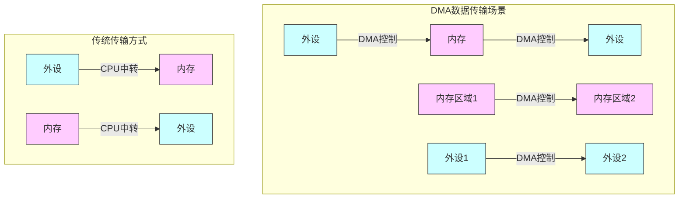
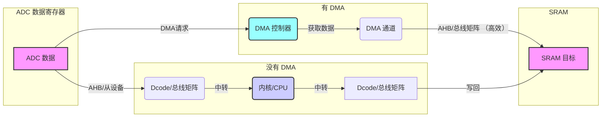
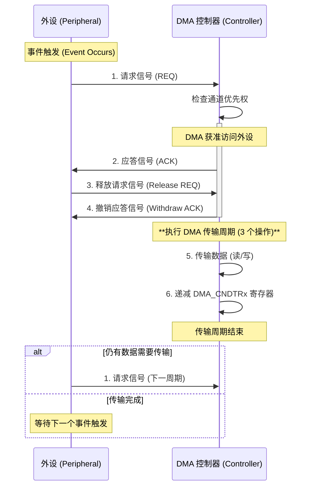

# 参考链接

[【STM32】 DMA原理，步骤超细详解，一文看懂DMA-CSDN博客](https://blog.csdn.net/as480133937/article/details/104927922?ydreferer=aHR0cHM6Ly9jbi5iaW5nLmNvbS8%3D)

# 概述

> [!IMPORTANT]
>
> DMA传输无需CPU直接控制传输，也没有中断处理方式那样保留现场和恢复现过程
>
> 通过硬件为RAM和IO设备开辟一条直接传输数据的通道，使得CPU的效率大大提高
>
> 作用：为CPU减负

一般而言，DMA控制器将包括一条地址总线、一条数据总线和控制寄存器。高效率的DMA控制器将具有访问其所需要的任意资源的能力，而==无须处理器==本身的介入，它必须能==产生中断==。最后，它必须能在控制器内部计算出地址。

一个处理器可以包含多个DMA控制器。每个控制器有多个DMA通道，以及多条直接与存储器站(memory bank)和外设连接的总线。在很多高性能处理器中集成了两种类型的DMA控制器：

1. 第一类通常称为“系统DMA控制器”，可以实现对任何资源(外设和存储器)的访问，对于这种类型的控制器来说，信号周期数是以系统时钟(SCLK)来计数的，以ADI的Blackfin处理器为例，频率最高可达133MHz。
2. 第二类称为内部存储器DMA控制器(IMDMA)，专门用于内部存储器所处位置之间的相互存取操作。因为存取都发生在内部(L1－L1、L1－L2，或者L2－L2)，周期数的计数则以内核时钟(CCLK)为基准来进行，该时钟的速度可以超过600MHz。


## DMA的传输方式

DMA的作用就是实现数据的直接传输，而去掉了传统数据传输需要CPU寄存器参与的环节，主要涉及四种情况的数据传输，但本质上是一样的，都是从内存的某一区域传输到内存的另一区域（外设的数据寄存器本质上就是内存的一个存储单元）。四种情况的数据传输如下：

- 外设到内存
- 内存到外设
- 内存到内存
- 外设到外设




## DMA传输参数

数据传输的核心参数：

1. 数据源地址
2. 数据传输位置的目标地址
3. 传递护具多少的数据传输量
4. 进行多少次传输的传输模式

当用户将参数设置好，主要涉及源地址、目标地址、传输数据量这三个，DMA控制器就会启动数据传输，当剩余传输数据量为0时 达到传输终点，结束DMA传输 ，当然，DMA 还有循环传输模式 当到达传输终点时会重新启动DMA传输。

> [!NOTE]
>
> 也就是说只要剩余传输数据量不是0，而且DMA是启动状态，那么就会发生数据传输。　

## DMA的主要特征

每个通道都直接连接专用的硬件DMA请求，每个通道都同样支持软件触发。这些功能通过软件来配置；

- 在同一个DMA模块上，多个请求间的优先权可以通过软件编程设置（共有四级：很高、高、中等和低），优先权设置相等时由硬件决定（请求0优先于请求1，依此类推）；
- 独立数据源和目标数据区的传输宽度（字节、半字、全字），模拟打包和拆包的过程。源和目标地址必须按数据传输宽度对齐；
- 支持循环的缓冲器管理；
- 每个通道都有3个事件标志（DMA半传输、DMA传输完成和DMA传输出错），这3个事件标志逻辑或成为一个单独的中断请求；
- 存储器和存储器间的传输、外设和存储器、存储器和外设之间的传输；
- 闪存、SRAM、外设的SRAM、APB1、APB2和AHB外设均可作为访问的源和目标；
- 可编程的数据传输数目：最大为65535。

## 存储器映像

| **类型** | **起始地址** | **存储器**      | **用途**                         |
| -------- | ------------ | --------------- | -------------------------------- |
| ROM      | 0x0800 0000  | 程序存储器Flash | 存储C语言编译后的程序代码        |
| :        | 0x1FFF F000  | 系统存储器      | 存储BootLoader，用于串口下载     |
| :        | 0x1FFF F800  | 选项字节        | 存储一些独立于程序代码的配置参数 |
| RAM      | 0x2000 0000  | 运行内存SRAM    | 存储运行过程中的临时变量         |
| :        | 0x4000 0000  | 外设寄存器      | 存储各个外设的配置参数           |
| :        | 0xE000 0000  | 内核外设寄存器  | 存储内核各个外设的配置参数       |

# 外设详解

## 工作原理

外设 DMA 为 Peripheral<>RAM 通道，采用**外设请求触发方式**进行数据传输，每个外设通道都可以支持外设->RAM 或者 RAM->外设的数据传输，并且根据目标外设类型的不同，自适应选择byte/half-word/word 传输方式。

- DMA 作为 Master，在收到 request 后将发起 AHB transactions 进行数据操作，外设目标地址根据通道接入选择自动定位，RAM 目标地址则根据寄存器配置定位。

- 每个 channel 可以从多个外设中选择一个作为 source 或 destination，同时软件可以设置通道优先级，当两个通道同时要访问 RAM 时，由优先级决定谁先访问，另一个通道将被挂起，直到优先通道访问完毕。

  ```mermaid
  flowchart TD
      subgraph DMA_Channel
          direction LR
          Request[外设请求触发] --> Arbitration{仲裁判断}
          Arbitration -->|优先级胜出| AHB_Trans[AHB总线操作]
          AHB_Trans -->|数据传输| Periph[外设寄存器]
          AHB_Trans -->|数据传输| RAM[内存区域]
          Arbitration -->|优先级失败| Pending((挂起等待))
      end
  
      CPU -->|配置参数| DMA_Channel
      DMA_Channel -->|中断信号| CPU
  ```

- 外设请求可以是准备发送（RAM/Flash->Peripheral）或接收完成（Peripheral->RAM），数据传输通过 AHB 总线完成，当 DMA 访问外设时，CPU 对同一个外设的访问将引起冲突，哪个 Master 访问被挂起取决于 BusMatrix 设置的仲裁优先级。这里需要注意的是，由于大部分外设都被挂在 APB 总线上，APB 映射到 AHB 仅为一个 slave，因此当 DMA 访问 APB 中任意外设时，CPU 即使访问 APB下的其他外设，也同样会引起总线仲裁。通过 DIR 寄存器可以配置每个通道的传输方向，软件必须保证传输方向配置与实际挂载到这个通道上的外设请求相一致。比如通道 1 当前挂载的外设请求是UART0 接收，则必须将 DIR 寄存器配置为 0（数据从外设读出，写入 RAM），每次 UART0 接收完一帧数据，将发送 RXD0 请求给 DMA，DMA 响应请求后，从 UART0 接收缓存寄存器读取数据，如果 DIR 被错误的配置为 1，则 DMA 对 UART0 接收缓存寄存器的写操作将被 UART0 忽略。

  ```mermaid
       graph LR
           DMA访问APB -->|总线占用| CPU访问APB外设
           CPU访问RAM -->|总线仲裁| DMA访问RAM
  ```

  

- 软件可设置 DMA 的存储器指针，用于配置 DMA 传输的起始地址，可以选择指针递增或递减方式。另有 TSIZE 寄存器配置传输次数，根据起始地址和传输次数，计算得到终止地址，当存储器指针指向终止地址时，本次传输结束，关闭通道。

- 当 channel 被使能后，DMA 就准备好接受通道所选中的外设请求。当配置传输长度一半的字节被传输后，一个 CHHT 中断置位；当配置传输长度全部完成后，CHHT 中断置位。上述中断都可以被相应的中断使能寄存器屏蔽。

- 在 DMA 一个完整 transfer block 完成之前，软件随时可以关闭 channel 使能，此时 DMA 将被挂起，如果软件此后重新使能通道，则 DMA 继续执行之前挂起的操作。但是 TSIZE 还是原始的设置值没有更新，需要注意。

## 系统框图


- 一方面，CPU可以对寄存器进行读写，就像是读写运行内存一样
- 另一方面，寄存器的每一位背后，都连接了一根导线，这些导线可以控制外设的电路状态，如置引脚高低电平、导通和断开开关、切换数据选择器

在总线矩阵的左端，是主动单元，也就是拥有存储器的访问权，总线矩阵的右端，是被动单元，它们的存储器只能被左边的主动单元读写

## 工作流程 

DMA 对请求响应分成两部分处理：通道请求处理过程和数据搬运过程。

1. 通道请求处理
   1. DMA 接受到请求，跳到步骤 b
   2. 判断是否有其他通道正在搬运数据，若有，则停留在步骤 b 直至其他通道当次搬运完成；若无，进一步判断是否有其他同时置起的请求信号，若有，则判断当前通道优先级是否高于其他通道，若是，则跳到步骤 c 并向数据搬运过程发起请求，若否，则停留在步骤 b 直至其他通道当次搬运完成
   3. 并等待数据搬运完成响应信号，得到响应则，跳到步骤 d，否则停在步骤 c
   4. 数据搬运长度+1，判断是否达到设定长度，若是则关闭通道使能；判断请求是否释放，若是，则跳到步骤 a，若否，则停留在步骤 d 判断数据传输达到设定长度，否则跳到步骤 a
2. 数据搬运
   1. 等待通道请求处理过程发起请求
   2. 从源地址读取数据
   3. 将读到的数据写到目标地址
   4. 向通道请求处理过程发出搬运完成响应，并跳到步骤 a

DMA工作的流程如下图所示：


## 数据流动

在有无DMA时，ADC采集的数据是如何流动的？

数据流动方向*==ADC数据寄存器->SRAM==*

*`没有`DMA*

1. CPU传输数据需要以内核作为中转站
2. 内核作为主机通过*==Dcode->总线矩阵->AHB从设备中存储的外设ADC采集的数据==*

3. 内核再通过*==Dcode->总线矩阵->SRAM将得到的数据放到SRAM中==*


*`有`DMA*

1. DMA传输时外设对DMA控制器（DMA1，DMA2）发送请求

2. DMA控制器收到请求，出发DMA工作

3. DMA控制器从AHB外设获取的ADC采集的数据，存储到DMA通道中（通道1-7）

4. DMA控制器的DMA总线与总线矩阵协调，使用AHB把外设ADC采集的数据经由DMA通道存放到SRAM中，这个数据传输过程中，完全不需要内核参与




## DMA请求

在发生一个事件后，外设向DMA控制器发送一个请求信号。DMA控制器根据通道的优先权处理请求。当DMA控制器开始访问发出请求的外设时，DMA控制器立即发送给它一个应答信号。当从DMA控制器得到应答信号时，外设立即释放它的请求。一旦外设释放了这个请求，DMA控制器同时撤销应答信号。DMA传输结束，如果有更多的请求时，外设可以启动下一个周期。

总之，每次DMA传送由3个操作组成：

1. 从外设数据寄存器或者从当前外设/存储器地址寄存器指示的存储器地址取数据，第一次传输时的开始地址是DMA_CPARx或DMA_CMARx寄存器指定的外设基地址或存储器单元；
2. 存数据到外设数据寄存器或者当前外设/存储器地址寄存器指示的存储器地址，第一次传输时的开始地址是DMA_CPARx或DMA_CMARx寄存器指定的外设基地址或存储器单元；
3. 执行一次DMA_CNDTRx寄存器的递减操作，该寄存器包含未完成的操作数目。




## DMA通道

1. DMA资源数量

   1. 对于大容量的STM32芯片有2个DMA控制器
   2. DMA1有七个通道，DMA2有5个通道，每个通道都可以配置一些外设的地址

2. DMA传输通道

   1. 每个通道都可以有固定地址的外设寄存器和存储器地址之间执行DMA传输，DMA传输的数据量是可编程的，最大可达到65535，包含要传输的数据向数量的寄存器，在每次传输后递减

3. 存储器到存储器模式

   1. DMA通道的操作可以在没有外设请求的情况下进行，这种操作就是存储器到存储器模式
   2. 当设置了DMA_CCRx寄存器中的MEM2MEM位之后，在软件设置了DMA_CCRx寄存器中的EN位启动DMA通道时，DMA传输将马上开始。当DMA_CNDTRx寄存器变为0时，DMA传输结束。存储器到存储器模式不能与循环模式同时使用。
   3. 这里要注意仅 DMA2 的外设接口可以访问存储器，所以仅 DMA2 控制器支持存储器到存储器的传输，DMA1 不支持。
   4. 存储器到存储器模式不能与循环模式同时使用。

4. DMA1 control

   1. 从外设（TIMx[x=1、2、3、4]、ADC1、SPI1、SPI/I2S2、I2Cx[x=1、2]和USARTx[x=1、2、3]）产生的7个DMA请求，通过逻辑或输入到DMA1控制器 其中每个通道都对应着具体的外设：

      | 外设    | 通道1    | 通道2     | 通道3            | 通道4              | 通道5     | 通道6              | 通道7             |
      | ------- | -------- | --------- | ---------------- | ------------------ | --------- | ------------------ | ----------------- |
      | ADC1    | ADC1     |           |                  |                    |           |                    |                   |
      | SPI/IIS |          | SPI1_RX   | SPI1_TX          | SPI/2S2_RX         | SP/2S2_TX |                    |                   |
      | USART   |          | USART3_TX | USART3_RX        | USART1_TX          | USART1_RX | USART2_RX          | USART2_TX         |
      | IIC     |          |           |                  | 12C2_TX TIM1_TX4   | 12C2_RX   | I2C1_TX            | I2C1_RX           |
      | TIM1    |          | TIM1_CH1  | TIM1_CH2         | TIM1_TRIG TIM1_COM | TIM1_UP   | TIM1_CH3           |                   |
      | TIM2    | TIM2_CH3 | TIM2_UP   |                  |                    | TIM2_CH1  |                    | TIM2_CH2 TIM2_CH4 |
      | TIM3    |          | TIM3_CH3  | TIM3_CH4 TIM3_UP |                    |           | TIM3_CH1 TIM3_TRIG |                   |
      | TIM4    | TIM4_CH1 |           |                  | TIM4_CH2           | TIM4_CH3  |                    | TIM4_UP           |

## DMA优先级

仲裁器

- 仲裁器的作用是确定各个DMA传输的优先级
- 仲裁器根据通道请求的优先级来启动外设/存储器的访问

DMA优先级

- 仲裁器管理DMA通道请求分为两个阶段：
  1. 第一阶段（软件阶段）：每个通道的优先级可在DMA_CCRx寄存器中设置，有四个等级：最高、高、中和低优先级。
  2. 第二阶段（硬件阶段）：如果两个请求有相同软件优先级，较低偏号的通道比较高偏号的通道有较高的优先级。(大容量芯片中，DMA1控制器拥有高于DMA2控制的优先级)
- 注意：多个请求通过逻辑或输入到DMA控制器，只能有一个请求有效。


## DMA的内存占用

在STM32控制器中，芯片采用Cortex-MX架构，总线结构有了很大的优化，DMA占用另外的地址总线，并不会与CPU的系统总线发生冲突。也就是说，DMA的使用不会影响CPU的运行速度

但是要注意：

DMA 控制器和Cortex-M3核共享系统数据总线执行直接存储器数据传输。当CPU和DMA同时访问相同的目标(RAM或外设)时，DMA请求可能会停止 CPU访问系统总线达若干个周期，总线仲裁器执行循环调度，以保证CPU至少可以得到一半的系统总线(存储器或外设)带宽。

# 实验

DMA寄存器的配置参数包括：通道地址、优先级、数据传输方向、存储器/外设数据宽度、存储器/外设地址是否增量、循环模式、数据传输量。

配置流程

1. 在DMA_CPARx寄存器中设置外设寄存器的地址。发生外设数据传输请求时，这个地址将 是数据传输的源或目标。
2. 在DMA_CMARx寄存器中设置数据存储器的地址。发生外设数据传输请求时，传输的数 据将从这个地址读出或写入这个地址。
3. 在DMA_CNDTRx寄存器中设置要传输的数据量。在每个数据传输后，这个数值递减。
4. 在DMA_CCRx寄存器的PL[1:0]位中设置通道的优先级。
5. 在DMA_CCRx寄存器中设置数据传输的方向、循环模式、外设和存储器的增量模式、外 设和存储器的数据宽度、传输一半产生中断或传输完成产生中断。
6. 设置DMA_CCRx寄存器的ENABLE位，启动该通道。

```c

void adc_init(void)
{
    RCC_APB2PeriphClockCmd(RCC_APB2Periph_ADC3,ENABLE);
    RCC_APB2PeriphClockCmd(RCC_APB2Periph_GPIOF,ENABLE);
    RCC_ADCCLKConfig(RCC_PCLK2_Div6);

    GPIO_InitTypeDef GPIO_InitStruct;
    GPIO_InitStruct.GPIO_Pin = ADC_PIN;
    GPIO_InitStruct.GPIO_Mode = GPIO_Mode_AIN;
    GPIO_InitStruct.GPIO_Speed = GPIO_Speed_50MHz;

    GPIO_Init(ADC_PORT,&GPIO_InitStruct);

    ADC_RegularChannelConfig(ADC3,ADC_Channel_4,1,ADC_SampleTime_55Cycles5);        //配置规则通道组，填充菜单列表

    ADC_InitTypeDef ADC_InitStruct;
    ADC_InitStruct.ADC_ContinuousConvMode = DISABLE;
    ADC_InitStruct.ADC_DataAlign = ADC_DataAlign_Right;
    ADC_InitStruct.ADC_ExternalTrigConv = ADC_ExternalTrigConv_None;        //软件触发
    ADC_InitStruct.ADC_Mode = ADC_Mode_Independent;
    ADC_InitStruct.ADC_NbrOfChannel = 1;
    ADC_InitStruct.ADC_ScanConvMode = DISABLE;
    ADC_Init(ADC3,&ADC_InitStruct);

    ADC_Cmd(ADC3,ENABLE);

    //开始校准
    ADC_ResetCalibration(ADC3);        //复位校准
    while(ADC_GetResetCalibrationStatus(ADC3) != RESET);        //等待复位校准完成
    ADC_StartCalibration(ADC3);        //开始校准
    while(ADC_GetCalibrationStatus(ADC3) == SET);//等待校准完成

}

u16 ad_getValue(void)
{
    ADC_SoftwareStartConvCmd(ADC3,ENABLE);
    while(ADC_GetFlagStatus(ADC3,ADC_FLAG_EOC) == RESET);        //等待转换完成，也就是EOC信号
    return ADC_GetConversionValue(ADC3);        //读取完数据将会自动清除数据位
}


u8 data1[] = {0x01, 0x02, 0x03, 0x04};
u8 data2[] = {0, 0, 0, 0};

int main(void){

    char str[50];

    serial_init(); 

    sprintf(str,"addr1: %x origin 1: %u %u %u %u\n",(u32)data1,data1[0],data1[1],data1[2],data1[3]);
    send_string(str);
    sprintf(str,"addr2: %x origin 2: %u %u %u %u\n",(u32)data2,data2[0],data2[1],data2[2],data2[3]);
    send_string(str);
    dma_init((u32)data1,(u32)data2,4);

    while(1){
        data1[0]++;
        data1[1]++;
        data1[2]++;
        data1[3]++;
        dma_transfer();
        sprintf(str,"addr1: %x origin 1: %u %u %u %u\n",(u32)data1,data1[0],data1[1],data1[2],data1[3]);
        send_string(str);
        sprintf(str,"addr2: %x origin 2: %u %u %u %u\n",(u32)data2,data2[0],data2[1],data2[2],data2[3]);
        send_string(str);
        dma_init((u32)data1,(u32)data2,4);
        Delay_s(2);
    }
}
```


 