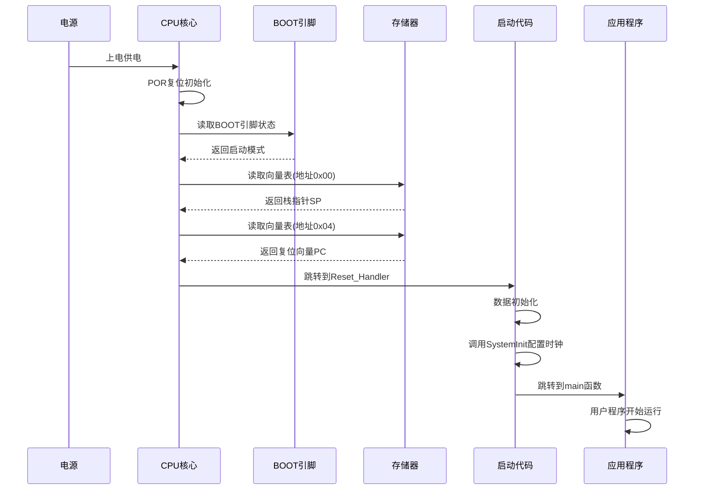
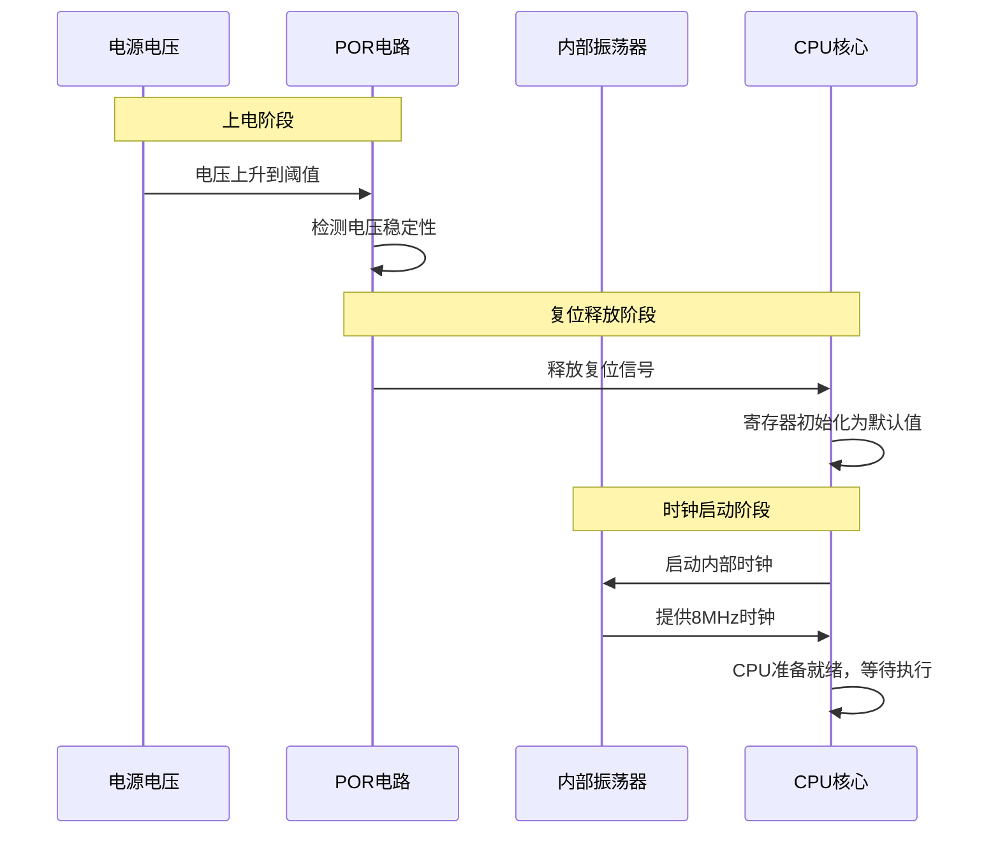
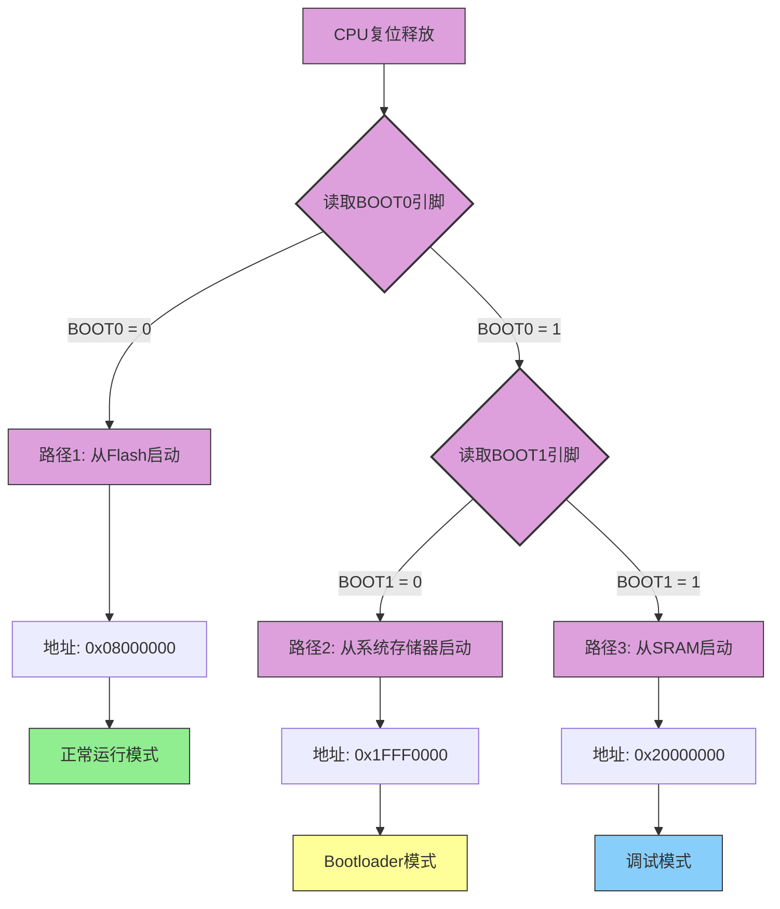
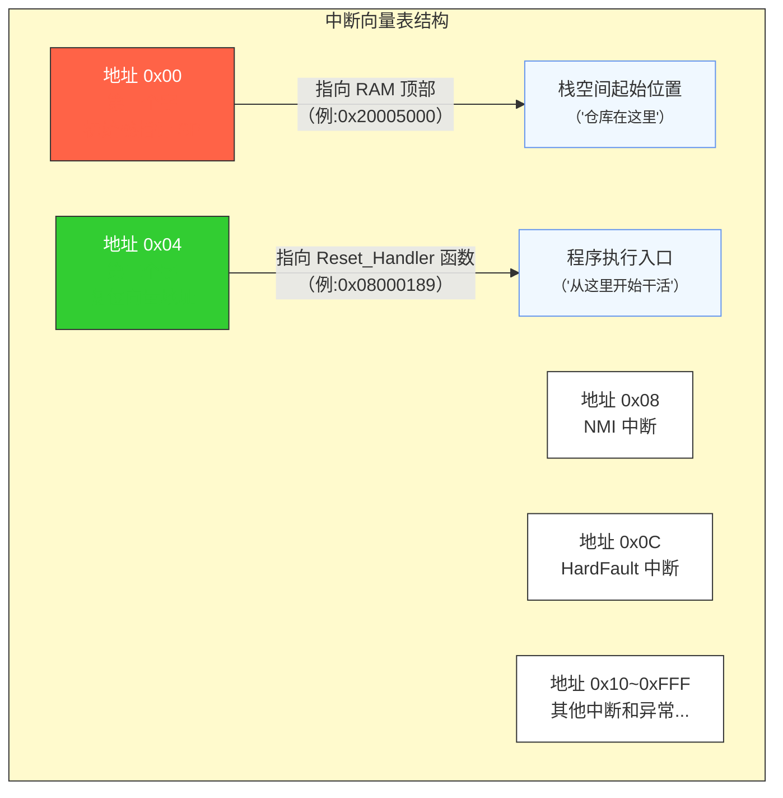
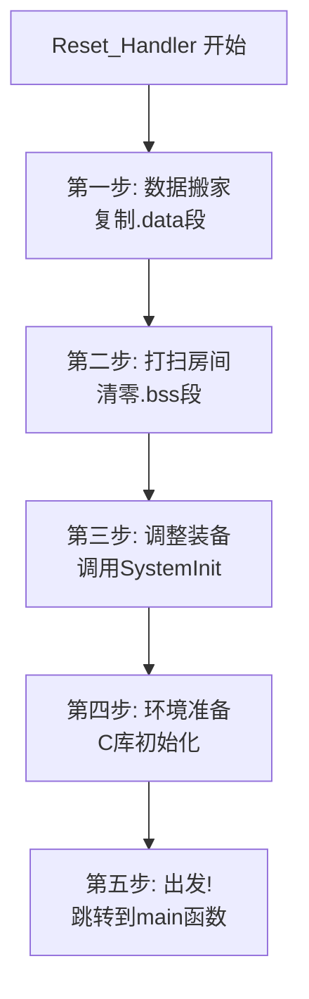
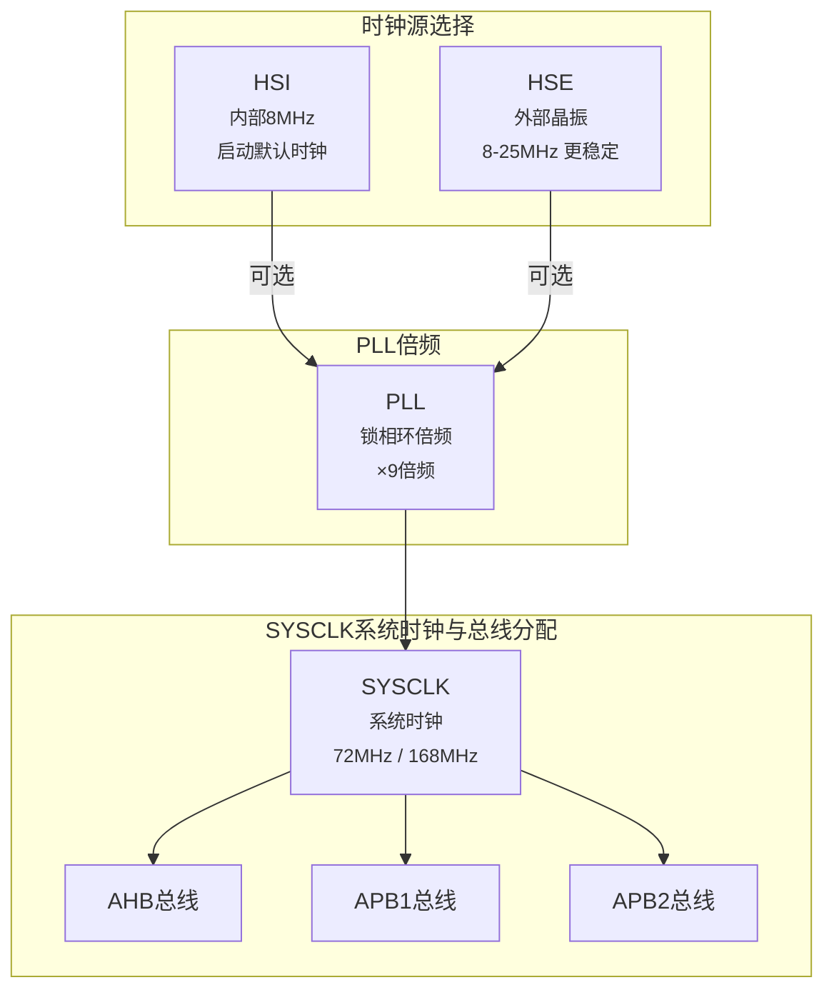

# 参考链接

[mcu 启动流程_mcu启动过程-CSDN博客](https://blog.csdn.net/weixin_42734533/article/details/131812546)

[嵌入式开发系列教程（二） MCU启动过程 - 简书 (jianshu.com)](https://www.jianshu.com/p/57c6006e637a)

[STM32启动之旅：从上电到main函数的奇妙历程 (qq.com)](https://mp.weixin.qq.com/s/0pbeLH3uO1mDkZModu-bGg)

# 启动流程

启动过程如下：



## 上电复位


**硬件的"晨间仪式“**

就像你早上被闹钟叫醒，芯片的"觉醒"也需要一个过程。当电源接通的瞬间，芯片并不会立即开始工作，而是要经历一个称为**上电复位（Power-On Reset, POR）**的过程。这个过程就像人从深度睡眠中醒来：

1. **睁开眼睛**：电源电压逐渐升高，达到工作阈值（通常是 2.0V 左右）
2. **意识清醒**：内部复位电路工作，确保所有寄存器都回到初始状态
3. **大脑启动**：内部 RC 振荡器开始工作，提供最基本的 8MHz 时钟信号（HSI）



此时的 STM32 就像一个刚醒来的人，处于最基本的工作状态：

- • ⏰ **时钟**：使用内部 8MHz RC 振荡器（HSI）
- • 🧠 **CPU 状态**：所有寄存器清零，程序计数器 PC 等待赋值
- • 💾 **存储器**：还未映射到具体位置
- • ⚡ **功耗**：基本工作模式，等待进一步配置

**这个阶段耗时**：约 1-5 毫秒


## 启动方式

**三岔路口的抉择**

复位释放后，CPU 面临一个重要选择：**从哪里开始执行代码？**这就是 BOOT 引脚的作用——它就像路口的指示牌，告诉 CPU 该走哪条路。

芯片上有 BOOT0（部分型号还有 BOOT1）引脚，通过硬件电平配置，可以选择三种不同的"起点"：

1. flash启动（最常用）：stm32的flash能够擦写数十万次，用户通过JTAG或SWD模式，将程序下载至此，重新启动从此处启动
2. sytem memory （系统存储器启动）：系统存储器是芯片内的一块特定的区域，系统存储器中预置了一段bootloader,bootloder将程序下载到flash区，通过flash启动
3. 内嵌SRAM启动：从内存中直接启动代码，避免因小修改反复擦写flash内存，一般用于高速调试



## 中断向量

**神秘的"任务清单"**

当 CPU 确定了起点（比如 0x08000000），接下来要做的第一件事就是查看这个位置的**中断向量表（Vector Table）**。

把向量表想象成一本"任务清单"或"地址簿"，里面记录了各种重要信息。而在这本"清单"的最开头，有两个最关键的条目--第一个字和第二个字。



CPU 硬件会**自动**完成以下两步（不需要任何软件代码）：

1. 加载栈指针

   ```c
   SP = *((uint32_t*)0x00000000);  // 从地址0x00读取值，加载到栈指针寄存器
   ```

   栈指针就像是告诉 CPU："你的工作仓库在 RAM 的这个位置，所有临时数据都放这里"。

2. 加载程序计数器

   ```c
   PC = *((uint32_t*)0x00000004);  // 从地址0x04读取值，加载到程序计数器
   ```

   程序计数器装载的是**Reset_Handler 函数的地址**，CPU 会立即跳转到这里开始执行第一条指令。

> [!note]
>
> 为什么是这两个值？
>
> 想象你要开始一天的工作：
>
> - • **栈指针（SP）**：告诉你办公桌在哪里（工作空间）
> - • **复位向量（PC）**：告诉你今天第一个任务是什么（从哪开始）
>
> 有了这两个信息，CPU 就可以愉快地开始工作了！

## 启动代码

**Reset_Handler：幕后英雄**

当 CPU 跳转到 Reset_Handler 函数时，真正的"准备工作"才开始。这个函数通常定义在**启动文件**（s文件中有具体的操作步骤）中，它的任务就像搬家公司——把所有东西摆放到正确的位置。



1. 任务一：数据搬家（复制.data 段）

   在 C 语言中，如果你写了：

   ```c
   int counter = 100;  // 已初始化的全局变量
   ```

   这个变量的**初始值（100）存储在 Flash 中，但程序运行时需要在RAM**中读写它。所以启动代码要做的第一件事就是：

   > 把 Flash 中的初始数据复制到 RAM 中

   用伪代码表示：

   ```c
   // 把初始化数据从Flash搬到RAM
   uint8_t* src = &_sidata;   // Flash中的数据起点
   uint8_t* dst = &_sdata;    // RAM中的数据起点
   while (dst < &_edata) {
       *dst++ = *src++;       // 逐字节复制
   }
   ```

   **比喻**：就像你搬家时，把储物柜里的行李搬到新家的房间里。

2. 任务二：打扫房间（清零.bss 段）

   如果你写了：

   ```c
   int buffer[100];  // 未初始化的全局变量
   ```

   C 语言标准规定，未初始化的全局变量必须自动清零。启动代码负责把这块 RAM 区域全部填充为 0：

   ```c
   // 把未初始化变量的内存清零
   uint8_t* dst = &_sbss;
   while (dst < &_ebss) {
       *dst++ = 0;            // 逐字节清零
   }
   ```

   **比喻**：就像搬进新家前，先把空房间打扫干净。

3. 任务三：调整装备（调用 SystemInit）

   数据准备好后，启动代码会调用**SystemInit()**函数，这是用户可以自定义的配置函数，主要用于：

   - • 配置系统时钟（稍后详细讲解）
   - • 设置 Flash 访问参数
   - • 配置总线分频器

   ```c
   // 启动代码中的调用
   SystemInit();     // 系统初始化
   __main();         // C库初始化，最终会跳转到main
   ```

## 配置时钟

还记得第一站提到的内部 8MHz 时钟吗？这个频率对于现代应用来说太慢了！这就像一辆汽车还在用起步档行驶——虽然能动，但效率低下。体现真正性能需要更高的时钟频率：

- • **STM32F1 系列**：最高 72MHz
- • **STM32F4 系列**：最高 168MHz
- • **STM32H7 系列**：最高 480MHz

时钟的"换挡加速"过程：SystemInit 函数会执行一系列时钟配置，把系统从"起步档"切换到"高速档"：



SystemInit 函数的典型操作：

1. **启用外部晶振（HSE）**：切换到更稳定的外部时钟源
2. **配置 PLL 倍频**：比如 8MHz × 9 = 72MHz
3. **选择系统时钟源**：从 PLL 获取时钟
4. **配置总线分频**：为不同外设分配合适的时钟频率
5. **设置 Flash 延迟**：高速运行需要调整 Flash 读取时序

**比喻**：就像赛车手在起跑后，迅速从 1 档换到 5 档，释放引擎的全部性能！

## 进入主函数

当所有准备工作完成后，启动代码最终会调用你熟悉的**main()函数**：

```c
int main(void) {
    // 🎉 恭喜！你的代码终于开始执行了
    while(1) {
        // 你的应用逻辑
    }
}
```

从按下复位键到进入 main 函数，整个过程通常只需要**5-20 毫秒**——就在你眨眼的瞬间，STM32 已经完成了这场精彩的"启动之旅"！

| 阶段            | 典型耗时   | 主要工作           |
| --------------- | ---------- | ------------------ |
| 上电复位（POR） | 1-5ms      | 电源稳定、复位电路 |
| 读取向量表      | <1μs       | 硬件自动完成       |
| 启动代码执行    | 1-3ms      | 数据初始化         |
| 时钟配置        | 2-10ms     | HSE/PLL 稳定       |
| **总计**        | **5-20ms** | 完整启动流程       |

# 不同IDE的启动过程

## IAR

IAR使用ICF文件链接

### 启动过程

在IAR的启动文件中会定义一个`__iar_program_start`的handler，这个handler实际上就是Reset Handler。

```assembly
__vector_table
        DCD     sfe(CSTACK)               ; Top of Stack
        DCD     __iar_program_start       ; Reset Handler
        DCD     NMI_Handler               ; NMI Handler
        DCD     HardFault_Handler         ; Hard Fault Handler
```

当程序启动时，会从0x0000_0000中读取读取msp的值，向后偏移4得到PC的值，此时开始从PC值开始运行。

在调试过程中`__iar_program_start`中存放了启动地址,也就是`0x00004725`。

```assembly
Disassembly
	0x0:	0x18		DC8		24
_vector_table:
	0x1:	0x13		DC8		19
	0x2:	0x2000		DC16	8192
	0x4:	0x00004725	DC32	__iar_program_start
	0x8:	0x00003981	DC32	NMI Handler
	0x0c:	0x000025ff	DC32	ACMPO_IRQHandler
```

接下来跳转到`0x00004725`的位置

```assembly
__iar_program_start:
0x4724:	0xbf00			NOP
0x4726:	0xbf00			NOP
0x4728:	0xbf00			NOP
0x472a:	0xbf00			NOP
0x472c:	0xf7ff 0xffbe	BL ?main
0x4730:	0x50			DC8	80
0x4731:	0x30			DC8	48
0x4732:	0x01			DC8	_vector_table
0x4733:	0xf4			DC8	244
0x4734:	0x01			DC8	_vector_table
0x4735:	0xf4			DC8	244
0x4736:	0x00			DC8	0
0x4737:	0x00			DC8	0
```


## Keil

### MAP文件

MAP文件是MDK编译代码后，产生的集程序、数据及IO空间的一种映射列表文件，简单说就是包括了：各种.c文件、函数、符号等的地址、大小、引用关系等信息，分析各.c文件占用FLASH和RAM的大小，方便优化代码。

| **文件类型** | **简介**                                                     |
| ------------ | ------------------------------------------------------------ |
| **.o**       | 可重定向对象文件，每个.c/.s文件都对应一个.o文件              |
| **.axf**     | 可执行对象文件，由.o文件链接生成，仿真的时候需要用到此文件   |
| **.hex**     | INTEL Hex格式文件，用于下载到MCU运行，由.axf转换而来         |
| **.map**     | **连接器生成的列表文件，对分析程序存储占用情况非常有用**     |
| **其他**     | .crf、.d、.dep、.lnp、.lst、.htm、.build_log.htm等一般用不到 |

### map文件的组成部分

| **组成部分**               | **简介**                                                |
| -------------------------- | ------------------------------------------------------- |
| **程序段交叉引用关系**     | 描述各文件之间函数调用关系                              |
| **删除映像未使用的程序段** | 描述工程中未用到而被删除的冗余程序段(函数/数据)         |
| **映像符号表**             | 描述各符号（程序段/数据）在存储器中的地址、类型、大小等 |
| **映像内存分布图**         | 描述各个程序段（函数）在存储器中的地址及占用大小        |
| **映像组件大小**           | 给出整个映像代码（*.o）占用空间汇总信息                 |


