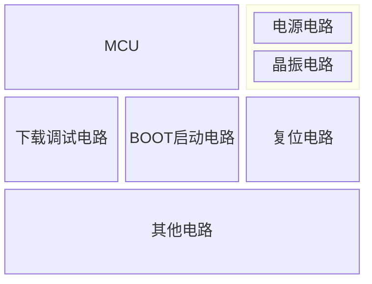

# 是什么

最小系统是保障MCU正常工作的最小电路的组成单元

# 管脚定义

| 类型 | 引脚名称             | 说明                                                         |
| ---- | -------------------- | ------------------------------------------------------------ |
| 电源 | VDD/VSS              | 电源正（VDD）/负（VSS）引脚，给STM32供电                     |
|      | VDDA/VSSA            | 模拟部分电源正/负引脚，给STM32内部模拟部分供电 参考电压正/负引脚，给STM32内部ADC/DAC提供参考电压 |
|      | VREF+/VREF-          | 100脚及以上的STM32F103型号才有这两个脚                       |
|      | VBAT                 | RTC&后备区域供电引脚，给RTC和后备区域供电。一般VBAT 接电池，用于断电维持RTC工作，如不需要，直接将VBAT 接VDD即可 |
| 复位 | NRST                 | 复位引脚，用于复位STM32，低电平复位 启动选择引脚，一般这两个脚各接一个下拉电阻即可 |
| 启动 | BOOT0/BOOT1          | 其他启动配置说明详见后续分析                                 |
| 晶振 | OSC_IN/ OSC_OUT      | 外部HSE晶振引脚，用于给STM32提供高精度系统时钟 如果使用内部HSI能满足使用需求，这两个脚可以不接晶振 |
|      | OSC32_IN / OSC32_OUT | 外部LSE晶振引脚，用于给STM32内部RTC提供时钟 如果使用内部LSI能满足使用需求，这两个脚可以不接晶振 |
| 调试 | SWCLK/SWDIO          | SWD调试引脚，用于调试STM32程序，同时STM32还支持 JTAG调试，不过我们不推荐使用！因为SWD省IO！ |

# 电源电路

在`GND`和`POWER`之间一般会连接一个滤波电容，该电容==保证供电电压的稳定性==，一般遇到供电都会加上滤波电容

`BAT`一般使用纽扣电池，备用电池是给`RTC`和备份寄存器服务的，如果不需要这些则可以不使用纽扣电池，`VBAT`可以直接接`POWER`或者直接悬空

# 复位电路

1. 手动复位：当按下复位按键，`NRST`直接接地，变成低电平开始复位，反之，则为高电平

2. 上电复位：当芯片开始上电的时候，`vcc`将会给电容充电，电容相当于短路，这时`NRST`与地直接相连，变成低电平开始复位，当电容充满电时，将会变成高电平，实现了上电复位的功能

   > 电容==充电==过程：当电容开始充电时，它的两极板之间存在电势差，电路中的电流开始流动，电容逐渐储存电荷。刚充电时，电容像是==导线==。
   >
   > 电容==充满==电时：当电容两端的电压与电源电压相等时，电容停止继续储存电荷，电流也随之停止。此时，电容器相当于==开路==，因为没有电流流过它。

# BOOT启动电路

通过连接引脚或者开关就可以配置`BOOT`的高低电平，比如接13，BOOT0就变成了高电平

# 晶振电路

在晶振的两侧还需要接两个电容作为==起振电容==，如果需要RTC功能，那么还需要额外接一个晶振，OSC32就是32.768KHz（32768为2的15次方），内部RTC电路通过2的15次方分频就可以生成1秒的时间信号了

> [!TIP]
>
> 起振电容的==作用==：
>
> **稳定振荡频率**：起振电容与晶振一起形成一个谐振电路（通常是并联谐振电路），用于确定晶振的振荡频率。通过调整电容的值，可以细微调整振荡频率，使其符合预期的设计。
>
> **辅助启动振荡**：起振电容为晶体提供适当的相移，使得反馈回路中的正反馈条件满足，从而启动振荡。它们在起振过程中的作用是提供合适的相位补偿，使得振荡可以迅速建立。
>
> 起振电容的==原理==：
>
> **与晶振和回路形成谐振回路**：晶体具有一定的等效电感和电容，外部的起振电容与其一起形成谐振回路，决定晶体的工作频率。外部的起振电容值越大，振荡频率会略微降低；电容值越小，频率会略微升高。
>
> **实现正反馈**：振荡电路的基本工作条件是需要正反馈，即输入信号和反馈信号的相位相同或相差整数倍的360°。起振电容通过提供适当的相移，使晶体振荡器电路的正反馈得以满足，从而维持振荡。常见的振荡器电路，如Pierce振荡器，正是依赖这些电容来实现所需的相移。
>
> **稳定电路工作状态**：晶振电路中的负载电容可以起到稳定电压和电流的作用，避免电路因高频信号波动而产生不稳定的振荡。

# 下载和调试电路

# 串口一键下载电路

