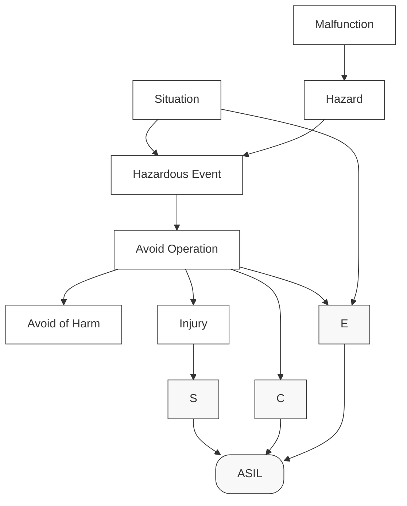
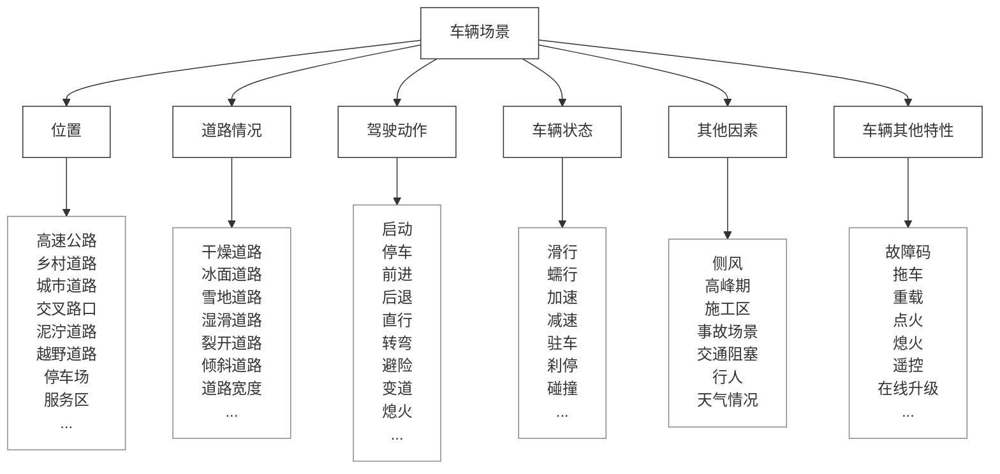
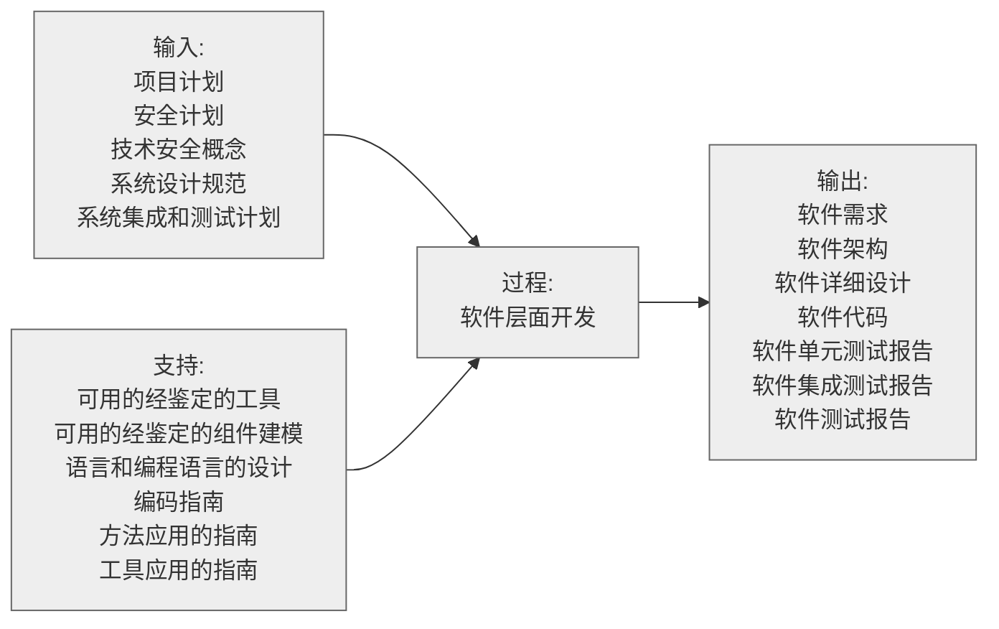
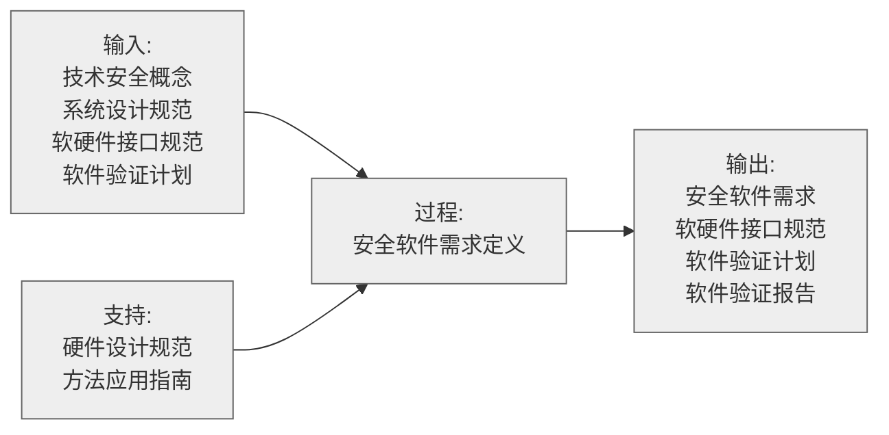
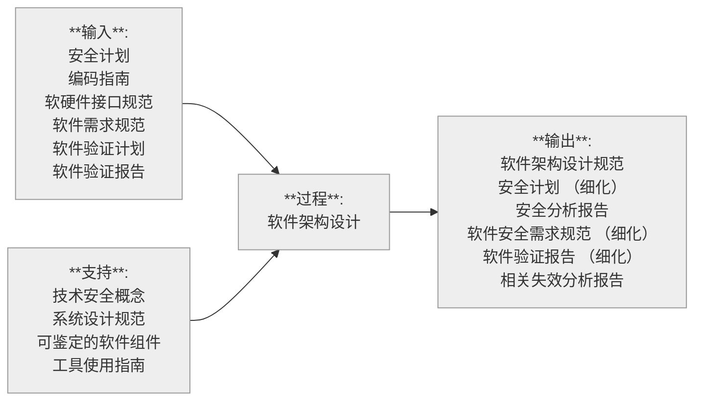
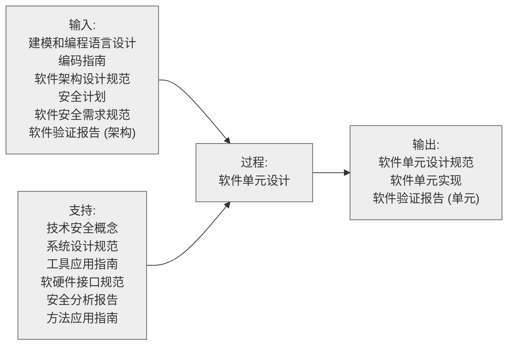
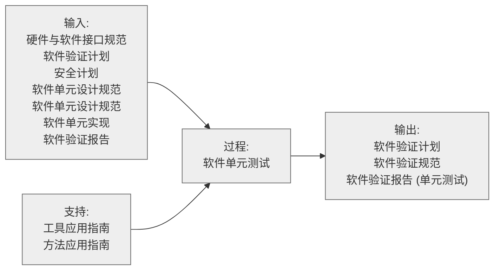
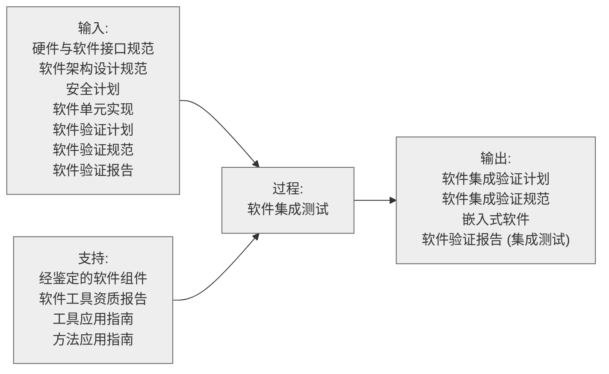

# 参考链接

[功能安全 ISO 26262](https://mp.weixin.qq.com/mp/appmsgalbum?__biz=MzkzMDM0NjE4Ng==&action=getalbum&album_id=2357683539976290305&scene=21#wechat_redirect)

[ 穷困潦倒的资本家 - 知乎](https://www.zhihu.com/people/qiong-kun-liao-dao-de-zi-ben-jia-59/posts)


# 术语

##  基础概念
| **术语（中文）** | **术语（英文）**  | **缩写** | **定义/描述**                                  |
| ---------------- | ----------------- | -------- | ---------------------------------------------- |
| 功能安全         | Functional Safety | FS       | 系统或设备在执行功能时避免不可接受风险的能力。 |
| 安全完整性       | Safety Integrity  | SI       | 系统执行安全功能的可靠性水平。                 |
| 风险             | Risk              | 无       | 危害发生概率与严重性的组合。                   |
| 危害             | Hazard            | 无       | 可能导致伤害或损害的潜在事件。                 |
| 可接受风险       | Acceptable Risk   | 无       | 被认为可以容忍的风险水平。                     |
| 残余风险         | Residual Risk     | RR       | 实施安全措施后剩余的风险。                     |
| 安全状态         | Safe State        | 无       | 系统失效时不会造成危害的状态。                 |

## 安全等级与标准
| **术语（中文）**   | **术语（英文）**                  | **缩写** | **定义/描述**                         |
| ------------------ | --------------------------------- | -------- | ------------------------------------- |
| 安全完整性等级     | Safety Integrity Level            | SIL      | 衡量安全功能可靠性的等级（SIL 1-4）。 |
| 汽车安全完整性等级 | Automotive Safety Integrity Level | ASIL     | 汽车行业安全等级（QM 至 ASIL D）。    |
| 安全目标           | Safety Goal                       | SG       | 为避免危害设定的顶层安全要求。        |
| 安全需求           | Safety Requirement                | SR       | 实现安全目标的具体要求。              |

## 失效与故障
| **术语（中文）** | **术语（英文）**        | **缩写** | **定义/描述**                        |
| ---------------- | ----------------------- | -------- | ------------------------------------ |
| 失效模式         | Failure Mode            | FM       | 系统或组件可能失效的方式（如短路）。 |
| 单点故障         | Single Point Failure    | SPF      | 一个故障导致安全功能失效。           |
| 系统性失效       | Systematic Failure      | 无       | 人为错误（如设计失误）导致的失效。   |
| 随机硬件失效     | Random Hardware Failure | RHF      | 硬件老化或不可预测因素导致的失效。   |
| 危险失效         | Dangerous Failure       | DF       | 可能导致危害的失效。                 |
| 安全失效         | Safe Failure            | SF       | 不导致危害的失效。                   |
| 共因失效         | Common Cause Failure    | CCF      | 多个组件因同一原因同时失效。         |
| 独立失效         | Independent Failure     | 无       | 无关联的单独失效事件。               |
| 失效概率         | Probability of Failure  | PoF      | 系统或组件失效的统计概率。           |
| 失效频率         | Failure Rate            | FR       | 单位时间内失效的频率。               |

## 安全机制与设计
| **术语（中文）** | **术语（英文）**         | **缩写** | **定义/描述**                          |
| ---------------- | ------------------------ | -------- | -------------------------------------- |
| 安全功能         | Safety Function          | SF       | 为降低风险而设计的功能（如紧急停机）。 |
| 容错             | Fault Tolerance          | FT       | 系统在故障时仍能执行安全功能的能力。   |
| 失效保护         | Fail-Safe                | FS       | 系统失效时进入安全状态的设计特性。     |
| 冗余             | Redundancy               | 无       | 添加额外组件以提高可靠性。             |
| 安全机制         | Safety Mechanism         | SM       | 用于检测或控制失效的措施。             |
| 失效检测         | Failure Detection        | FD       | 识别系统故障的过程或技术。             |
| 失效缓解         | Failure Mitigation       | 无       | 减少失效后果的措施。                   |
| 硬件故障裕度     | Hardware Fault Tolerance | HFT      | 系统容忍硬件故障的能力。               |

## 系统与评估
| **术语（中文）**   | **术语（英文）**                    | **缩写** | **定义/描述**                        |
| ------------------ | ----------------------------------- | -------- | ------------------------------------ |
| 安全相关系统       | Safety-Related System               | SRS      | 与安全功能执行直接相关的系统。       |
| 非安全相关系统     | Non-Safety-Related System           | NSRS     | 不直接影响安全功能的系统。           |
| 诊断覆盖率         | Diagnostic Coverage                 | DC       | 系统检测潜在故障的能力（百分比）。   |
| 平均无故障时间     | Mean Time Between Failures          | MTBF     | 系统平均连续无故障运行时间。         |
| 平均失效前时间     | Mean Time To Failure                | MTTF     | 系统从开始运行到首次失效的平均时间。 |
| 危害分析与风险评估 | Hazard Analysis and Risk Assessment | HARA     | 识别危害和评估风险的方法。           |
| 失效模式与影响分析 | Failure Mode and Effects Analysis   | FMEA     | 分析失效模式及其影响的方法。         |
| 故障树分析         | Fault Tree Analysis                 | FTA      | 用树形图分析失效原因的方法。         |
| 事件树分析         | Event Tree Analysis                 | ETA      | 分析事件后果的逻辑方法。             |

## 管理与过程
| **术语（中文）** | **术语（英文）**             | **缩写** | **定义/描述**                      |
| ---------------- | ---------------------------- | -------- | ---------------------------------- |
| 安全生命周期     | Safety Lifecycle             | SLC      | 从设计到退役的整个安全过程。       |
| 功能安全管理     | Functional Safety Management | FSM      | 确保功能安全的过程和组织措施。     |
| 安全计划         | Safety Plan                  | SP       | 实施功能安全的详细计划。           |
| 安全案例         | Safety Case                  | SC       | 证明系统安全的论证和证据集合。     |
| 配置管理         | Configuration Management     | CM       | 管理设计和开发中的变更。           |
| 工具认证         | Tool Qualification           | TQ       | 验证开发工具的适用性和可靠性。     |
| 验证             | Verification                 | 无       | 确认系统是否按设计正确构建。       |
| 确认             | Validation                   | 无       | 确认系统是否满足安全需求。         |
| 安全审计         | Safety Audit                 | SA       | 检查安全过程和系统的独立评估。     |
| 安全文化         | Safety Culture               | 无       | 组织对安全的重视和行为模式。       |
| 可追溯性         | Traceability                 | 无       | 需求、设计和验证之间的可追踪关系。 |
| 安全测试         | Safety Testing               | ST       | 验证安全功能的测试活动。           |

# 概述

## DIA

首先我们要知道什么是DIA，DIA的全称是Development Interface Agreement，中文名开发接口协议，这个文件的目的是分布式开发时，定义客户与供应商之间的开发接口，其实就是在项目开始阶段定义好哪些文件需要交付，交付的具体时间，版本，类型，以及交付的细节等等，避免因为前期没有谈清楚而导致后期扯皮，所以DIA这个文件中有功能安全各个环节的交付产物的清单，我的想法是先把DIA的所有清单全部列出来，然后就像做项目一样，按照顺序逐个讲解剖析每个交付文件，这样一遍下来起码我们知道在项目中功能安全需要做什么，怎么做，避免出现上一章节中提到了学习功能安全之后还是一头雾水的情况。

DIA定义的基本内容有：

1. 交付成果：是指OEM根据功能安全标准定的交付物；
2. 交付方向：是指交付的产物，是客户交给供应商，还是供应商交付给客户；（一般需求类的文档像Safety Goal，FSR是客户交付给供应商的）
3. 交付时间：这要根据项目的开发阶段去沟通时间，所以切记一定要和项目经理协调好时间，防止出现时间到了没有交付物的尴尬；
4. 交付版本和类型：是指每个交付成果的版本信息，如
5. 完整版本——完整文档，包含所有需要的细节；
6. 简要版本——文档的摘要或总结；
7. 现场版本——不能交付文档，只能进行现场的评审；
8. 不交付——不交付文档，也不参与评审；

这些叫法只是个例子，一般公司都有的标准，大部分交付物都是现场评审，不交付文档；个别文档需要简要版本，交付完整版本除了DIA文件之外，几乎没有。

> [!tip]
>
> 为什么要做DIA？
>
> 其实在文章开头也提到了，这里再重申一遍，功能安全是一个技术与流程并重的东西，流程一般只能通过文档展现出来，所以这就导致功能安全需要很多技术文档来证明，要求的文档多了难免会有些纰漏或是扯皮的事情出现，公说公有理，婆说婆有理。
>
> 所以做DIA的目的就是为了客户与供应商双方在项目初始阶段就将交付成果和交付细节确认好，避免项目开发到后面扯皮浪费时间，又没有证据，有DIA之后，交付和审核都直接照章办事，秉公执法，对双方来说都是事半功倍，当然这也体现了DIA的重要意义。


> [!tip]
>
> 在什么阶段做DIA？
>
> 之前提到了是在项目开始阶段，并不精准，一般当项目拿下定点后，客户会给供应商释放需求，这部分需求里会包括功能安全需求（FSR），之后客户可能会主动发出DIA的评估与讨论，在评估过程中，功能安全软件、硬件、系统、生产、管理都需要介入，因为这些需要交付的产物都需要指定的部门来完成。


> [!tip]
>
> 谁负责编辑和释放DIA？谁负责签字？
>
> DIA一般由公司的功能安全经理或者是项目的功能安全经理编辑和释放，这里有个很重要的点，就是签字，功能安全经理一定要切记不能随便签字，要每个交付物的每个细节都要谈清楚，公司是否有能力交付，交付的东西和客户要求的产物是否匹配，一定尽最大努力为公司争取最大化的主动，这才是你存在的意义，和所有部门确认好交付物的细节之后才能签字。

下面按照标准文件的章节列举DIA文件：

| 大章节                     | 子章节                                 | 交付产物                                                     |
| -------------------------- | -------------------------------------- | ------------------------------------------------------------ |
| **功能安全管理**           | 全面安全管理                           | 安全计划（组织特定的功能安全规则和过程）<br />胜任能力管理证据（培训计划、培训记录、证书）<br />质量管理系统证据（IATF6949证书）<br />安全异常报告 |
| ：                         | 项目相关安全管理                       | 相关项影响分析<br />要素级影响分析<br />安全计划<br />安全档案报告<br />认可措施报告<br />生产报告发布 |
| ：                         | 生产、运行、服务和报废的安全管理       | 生产、运行、服务、报废的安全管理证据（标准化监控数据库，标准化监控过程） |
| **概念阶段**               | 功能安全概念                           | 功能安全概念（FSC）<br />功能安全概念验证报告（FSC评审记录） |
| **系统级产品开发**         | 技术安全概念                           | 技术安全需求规范（TSR规范）<br />技术安全概念（TSC）<br />系统架构设计规范（系统架构设计）<br />硬件软件接口规范（HSI）<br />生产运行服务和报废需求规范 |
| ：                         | 系统，相关项集成和测试                 | 集成和测试策略（集成和测试策略规范）<br />集成和测试报告     |
| ：                         | 安全确认                               | 安全确认规范，安全确认环境描述<br />安全确认报告             |
| **硬件级产品开发**         | 硬件安全需求规范                       | 硬件安全需求规范（包括测试和评估）<br />硬件-软件接口规范<br />硬件安全需求验证报告（硬件安全需求评审记录） |
| ：                         | 硬件设计                               | 硬件设计规范（硬件架构规范）<br />硬件安全分析报告（硬件FMEA，FTA）<br />硬件设计验证报告（硬件设计评审记录）<br />生产运行服务和报废相关的需求规范 |
| ：                         | 硬件架构度量评估                       | 相关项架构应对随机硬件失效有效性分析（FMEDA）<br />相关项架构应对硬件失效有效性评估的验证评审报告（FMEDA评审报告） |
| ：                         | 随机硬件失效导致的安全目标的违规评估   | 随机硬件失效导致的安全目标违规分析（FMEDA/定量FTA/割集）<br />硬件专用措施规范（FMEDA/定量FTA割集）<br />硬件随机失效导致的功能安全违规分析验证评审报告（FMEDA评审记录） |
| ：                         | 硬件集成和验证                         | 硬件集成和验证规范硬件集成和验证报告                         |
| **软件级开发**             | 软件级开发环境的文档                   | 软件开发环境文档                                             |
| ：                         | 软件安全需求规范                       | 软件安全需求规范<br />硬件软件规范（细化，HSI）<br />软件验证报告 |
| ：                         | 软件架构设计                           | 软件架构设计规范<br />软件安全分析报告<br />相关失效分析报告软件<br />验证报告 |
| ：                         | 软件单元设计与实现                     | 软件单元设计规范<br />软件单元实施                           |
| ：                         | 软件单元验证                           | 软件验证规范<br />软件单元验证报告                           |
| ：                         | 软件集成和验证                         | 软件集成验证规范<br />嵌入式软件<br />软件集成验证报告       |
| ：                         | 嵌入式软件测试                         | 软件验证规范<br />软件验证报告                               |
| **生产、运行、服务和报废** | 计划生产、运行、服务和报废             | 生产计划安全相关内容<br />生产控制计划安全相关内容（含测试计划）<br />可生产性需求规范<br />生产过程能力报告<br />服务计划安全相关内容<br />服务说明安全相关内容<br />向用户提供的与安全相关的信息内容<br />报废说明安全相关内容<br />运行、服务和报废需求规范<br />救援服务说明中与安全相关的内容 |
| ：                         | 生产                                   | 控制措施报告<br />生产过程能力报告                           |
| **支持过程**               | 分布式开发中的接口                     | 供应商选择报告<br />开发接口协议<br />供应商安全计划<br />功能安全评估报告<br />供应商协议 |
| ：                         | 配置管理                               | 配置管理计划                                                 |
| ：                         | 变更管理                               | 变更管理计划<br />变更请求<br />影响分析和变更请求计划<br />变更报告 |
| ：                         | 验证                                   | 验证计划<br />验证规范<br />验证报告                         |
| ：                         | 文档管理                               | 文档管理计划<br />文档指南要求                               |
| ：                         | 对使用软件工具的置信度                 | 软件工具准则评估报告<br />软件工具鉴定报告                   |
| ：                         | 软件组件鉴定                           | 软件组件文档<br />软件组件鉴定报告<br />软件组件鉴定验证报告 |
| ：                         | 硬件要素评估                           | 硬件要素评估<br />硬件要素计划<br />针对硬件要素的硬件要素评估报告 |
| ：                         | 在用证明论证                           | 在用证明论证的候选项的描述<br />在用证明分析报告             |
| ：                         | 接口超出ISO26262范围的应用程序         | 基本车辆制造商或供应商指南                                   |
| ：                         | 为根据ISO26262开发的安全相关系统的集成 | 安全原理                                                     |
| **汽车安全完整性等级**     | 关于ASIL裁剪的需求分析                 | 架构信息更新<br />作为安全需求和要素属性的ASIL更新           |
| ：                         | 要素共存的准则                         | 更新ASIL作为要素的子要素的属性                               |
| ：                         | 相关失效分析                           | 相关失效分析<br />相关失效分析验证报告                       |
| ：                         | 安全分析                               | 安全分析<br />安全分析验证报告                               |

## 功能安全

为什么需要功能安全？

在这个世界上，人和物都不是完美的。(愿望很美好，现实很残酷）

1. 人不是完美的 => 系统性失效

   汽车开发工程师在汽车E/E系统开发中，包括软件和控制器硬件，不可避免地存在人为疏忽或错误，引起系统功能功能失效，进而导致故障并产生危害。这部分人为疏忽导致的失效为系统性失效。(注: 硬件也有系统失效)

2. 物不是完美的 => 随机硬件失效

   制器硬件，由于自身老化，外部环境因素等引发功能失效，导致相应故障并产生危害。硬件失效带有随机性，符合一定概率分布，因此称为硬件随机失效。

为了避免上述两种失效，功能安全由此诞生。

---

功能安全在解决什么问题？

1. 除通常质量管理(QM)外，对汽车E/E系统软硬件全生命周期安全开发流程，方法等进行约束和规范(主要是通过ASIL)，尽可能降低人为结构性的系统失效
2. 对控制器硬件部分进行概率化度量，尽可能降低随机硬件失效
3. 除过程约束外，设定安全状态，一旦系统发生故障，在故障容错时间内将系统导入安全状态，避免对人身、财产造成伤害

---

汽车功能安全法规

1. ISO 26262: 2018版，属于第二版

   下载链接: [ISO 26262-2018](https://mp.weixin.qq.com/s?__biz=MzkzMDM0NjE4Ng==&mid=2247484546&idx=1&sn=78dcd97a78e3e96600955d3f567d1ab9&chksm=c27ae127f50d6831e7530beb4d60e04989af4a33ad9f22d3e60423244df08a091bd63f5c89e4&scene=21)

2. 中文国标: GB/T 34590，于2017年发布，属于ISO 26262第一版的中文版，英文不是太好的朋友可以先看中文版，但和 ISO 26262: 2018最新版存在一定差异

   下载链接: [GBT-34590](https://mp.weixin.qq.com/s?__biz=MzkzMDM0NjE4Ng==&mid=2247484546&idx=1&sn=78dcd97a78e3e96600955d3f567d1ab9&chksm=c27ae127f50d6831e7530beb4d60e04989af4a33ad9f22d3e60423244df08a091bd63f5c89e4&scene=21)

ISO 26262属于方法论模型，抽象又具体:

**抽象在于:** 除了个别开发流程方法外，其他过程并没明确如何具体操作，这导致功能安全开发相对难以落地，不同开发商对功能安全理解也不近相同，不同企业产品功能安全无法直接横向对比。

**具体在于**: 开发大的流程及工作输出产物明确，和ASPICE过程参考模型相比还是具体很多。

可能是其魅力吧！通过抽象又具体的方法论，一方面对功能安全开发大的流程和方法提供了指南，另一方面，考虑了不同企业技术及Know How差异，为技术施行多样性提供了可能。

---

汽车功能安全特点包括:

1. 旨在尽可能避免由系统功能异常导致的危害，不是为了提高系统原有功能或非安全性能(如动力性)或避免系统本身功能不足导致的危害(属预期功能安全)
2. 不关注本质安全(即通过消除危险的原因确保安全的方式)
3. 既基于系统功能实现(基于现有功能进行危害分析和风险评估，定义目标及安全需求并采取安全措施)，又有所区别(一般独立开发，ASIL要求贯穿全过程，直接决定功能安全开发工作量和内容)
4. 系统，软件，硬件开发遵寻各自V模型，都是从需求，到架构，再到设计实现，最后验证及系统确认(确认只有在系统层面)。为了加速迭代过程，可以和敏捷过程相结合(后续细聊)

---

功能安全真的有必要吗？

虽然目前大部分开发商对功能安全越来越重视，但对很多企业而言，功能安全难以落地，投入产出比不高，项目进度受阻等等。因此，也有一些质疑的声音，如：

- 为了覆盖极少数可能发生的安全问题，功能安全是否在浪费项目开发时间和资源？
- 标准化的安全规范ISO 26262是否必须执行？

针对以上相关问题，以下仅谈谈我个人看法：

1. 安全问题重视程度取决于企业价值排序。个人觉得，安全第一，须竭尽全力保障汽车产品安全，先发布再以牺牲用户利益为代价的市场测试，至少有违道德
2. 条条道路通罗马，ISO 26262只是其中一条，非强制执行。只要企业安全文化到位，产品开发流程有效覆盖功能安全问题，也能走出自己的一条功能安全之路
3. 规范的存在既是门槛，也是为了让普通工程师在规范的约束下，有可能开发出一流的符合功能安全的产品(我这么说不要打我，我也是普通工程师)
4. 功能安全不是形式主义，不为死抠标准，不为通过评审而做，不会短期见效，却能避免企业陷入重大安全召回
5. 系统优化企业组织架构和交流接口，优化开发流程，将功能安全融入企业各自开发流程中，实现不同平台，项目间的最大化复用，是功能安全实施的关键之一

## 安全计划

安全计划，其实本质上就是给功能安全的活动和输出产物定义一个开发时间，但是因为功能安全开发本身是依赖于项目的，所以安全计划应该隶属于项目计划，它是项目计划的一部分。所以只需要做好三件事：

1. 定义输出物和活动
2. 定义交付的最终版本要求
3. 定义每个时间点的交付状态

举个例子：

1. 项目交付物：软件单元测试报告
2. 最终版本内容要求：因为是ASILD的项目，要求做MC/DC，覆盖率100%
3. 项目分为两次交付：第一个版本：MCDC覆盖率做到80%，第二个版本：MCDC覆盖率做到100% 或者第一个版本：不交付MCDC报告，只做函数覆盖率和分支覆盖率100%，第二个版本：MCDC覆盖率做到100%

> [!tip]
>
> 为什么做？
>
> 在DIA中提到了很多交付物，上面也提到，项目交付过程中，会有多个版本，如果一次性做完的话，从技术的角度来看，当然最好，可以保证每个交付版本的产品都更安全；但是从项目管理的角度来看，这样未免功能安全的代价过高，在一些基础版本，OEM并不会进行路试，只是做基本的HIL测试或者台架测试，从功能安全的角度来看，除了一些紧急的自我保护和，并不会造成过大的风险，所以也确实没有一次性做完的必要，况且客户的需求像是夏天的天气一样，说变就变，牵一发而动全身，有的功能还没开发完，即使完成的功能做了也要再改，长此以往，大家都总结出来，功能安全输出物要做，但是可以分阶段做，只要在量产前将所有的输出物的状态做到100%就可以了。

> [!tip]
>
> 谁来做？
>
> 一般安全计划是由功能安全经理或者功能安全项目经理完成，安全计划需要和项目计划保持一致，所以需要和项目经理做好同步，同时也需要和各个部门的经理做好同步，确认所有的时间点是否能够交付定义状态，这样才能保证计划是有意义的。

> [!tip]
>
> 什么阶段做？
>
> 在DIA中提到，其实在DIA结束之后，确定了交付物之后，就可以安排计划了，计划吗，肯定是先安排计划，然后再做事，当然我承认国内做的计划一般都没有国外做的好，因为国内太卷了，有些公司安排的计划和实际做事没啥直接关系，就只是为了做计划而做，有些小公司甚至觉得安排计划没有意义，反正也不会按照这个去执行，做计划还浪费时间，不如直接开干，我都经历过，我对计划的理解在于如果对于项目开发很熟悉，可以评估出大致准确的时间，是可以在项目中规避一些风险，也有利于项目组和各个部门井然有序的安排工作任务，可以预防资源短缺，技术储备不足，人手短缺等问题造成的不必要的风险，在项目初始阶段就可以识别出来，防止项目开发过程中的措手不及。

安全计划需按以下步骤来做：

1. 明确功能安全输出物和活动

   1. 明确产品功能和功能安全范围:简单描述产品的功能，工作环境，整车架构图之类的描述，从整车和系统的角度去分析功能安全需要考虑的范围。
   2. 明确功能安全输入:描述整车层面相关项定义，危害分析以及风险评估，安全目标，功能安全概念
   3. 明确功能安全裁剪范围:软件和硬件是否有复用模块，技术上关于复用模块的安全分析，在用证明等等（如果平台功能复用的话，有些流程工作是可以裁剪的）

2. 明确时间

   1. 明确交付状态:发布等级定义
      1. RL1:发布产品只能用于台架测试，整车静态测试，整车低速行驶，驾驶员负有全部责任，功能安全没有实施或部分实施，没有功能安全相关文档也没有其他文档覆盖ISO26262。（也就是说不建议路试，如果非要路试，那出问题了自己负责）
      2. RL2:发布产品只能用于封闭道路，授权驾驶员进行整车原型测试，车辆不能交付给终端客户，功能安全只部分实施，驾驶员能够有特殊的安全机制或方法控制车辆，功能安全文档结构被定义，但是只有最重要的模块文档符合ISO26262（例如紧急关断）
      3. RL3:发布产品可以用于开放道路，授权驾驶员进行整车圆形测试，车辆不能交付给终端客户，功能安全根据客户需求全部实施，产品没有已知的高功能安全风险，功能安全技术评估报告不完全交付，功能安全文档包含所有重要的方面，ISO26262部分实施。
      4. RL4:发布产品可以用于开放道路正常行驶，车辆可以交付给终端客户。根据客户需求功能安全已经完全实施和验证，功能安全技术评估释放，只能运行允许存在较小的差异，功能安全相关模块符合ISO2626，功能安全文档释放，并且完全符合ISO26262。
   2. 明确项目时间计划：
      1. 列出具体交付物，给出具体时间（各个环节的交付物在DIA中已经明确）

3. 明确相关负责人：明确负责人，出问题后可以快速找到相关人员，各个环节的输出物也需要相关负责人提供

   1. 流程工具负责人
   2. 功能安全负责人
   3. 系统负责人
   4. 测试负责人
   5. 软件负责人
   6. 硬件负责人

4. 明确支持过程

   1. 文档和配置管理
   2. 变更和问题管理
   3. 模块认证
   4. SOP后功能安全管理

5. 裁剪的功能安全活动和方法

   这里主要定义功能安全管理，系统，软件，测试，应该交付哪些文档，实施哪些安全机制以及原因是什么，功能安全交付物在DIA中已经定义，也可以根据实际情况自行调整。

6. 明确验证策略

   验证策略主要包括三部分

   1. 认可检查（Confirmation Review）

   2. 功能安全审查（Functional Safety Audit）

   3. 功能安全评估（Functional Safety Assessment）

      | 认可措施                  | 认可检查                                  | 功能安全审查                                       | 功能安全评估                                                 |
      | ------------------------- | ----------------------------------------- | -------------------------------------------------- | ------------------------------------------------------------ |
      | 对象                      | 安全活动的产物                            | 功能安全所需流程的实施                             | 相关项定义中的相关项                                         |
      | 结果                      | 检查报告                                  | 功能安全审查报告                                   | 功能安全评估报告                                             |
      | 执行确认措施人员 的责任   | 评估产物是否与 ISO26262中的相应的要求符合 | 评估所需流程的实施情况                             | 评估已实现的的功能安全，并为验收与否提供建议                 |
      | 安全生命周期内的 时间规划 | 完成相应安全活动 之后，在产品发布 前完成  | 所需流程的实施过程中                               | 开发过程中逐步完善，或者在产品发布前完成                     |
      | 范围和深度                | 与安全计划一致                            | 针对安全计划中提到和指定的所定义活动的流程实施情况 | 安全计划所需的工作产出物，所需流程的实施情况以及在相关项开发过程中做评估的安全措施的检查情况 |

      （上表中的相关项就是正在做的产品）

      以上三种检查其实在safety plan中的定义很简单，

      1. 公司可以支持做哪些检查（理论上功能安全要求三种都要支持）
      2. 什么时间可以做这三个验证和检查，也就是检查计划和状态
      3. 从DIA中提取出来检查内容，来定义一些更细节的检查项,检查方式以及检查具体时间等等

      当然标准里还有验证措施独立性的要求，公司自己定义的review的细节必须符合功能安全要求。总共有四个级别：

      1. I0：作者和review人员可以是同一个人，也可以是不同的人，(没有强制要求)

      2. I1：作者和review人员必须是不同的人员，(一般同组的同事就可以review)

      3. I2：作者和review人员必须来自于不同的团队，(不是同一个直属领导/经理)

      4. I3：作者和review人员必须来自于不同的部门/公司，(不同的总监或者老板)

         | 认可措施                                            | ASIL | ==   | ==   | ==   | 适用范围                                                     |
         | --------------------------------------------------- | ---- | ---- | ---- | ---- | ------------------------------------------------------------ |
         | ：                                                  | A    | B    | C    | D    | ：                                                           |
         | 危险分析和风险评估的 认可评审（Confirmation review) | I3   | ==   | ==   | ==   | 对已识别的危害的ASIL和 QM评级的正确性，安全目 标的检查       |
         | 安全计划的确认检查                                  | -    | I1   | I2   | I3   | 适用于安全目标中的最高 ASIL等级                              |
         | Item集成和测试计划的 确认检查                       | I0   | I1   | I2   | I3   | :                                                            |
         | Validation plan的确认检 查                          | I0   | I1   | I2   | I3   | :                                                            |
         | 安全分析的确认检查                                  | I1   | I1   | I2   | I3   | :                                                            |
         | 软件工具认证报告的确 认检查                         | -    | I0   | I1   | I1   | 适用于最高ASIL等级的要 求，且这些要求是由于软 件工具的使用而被违反的 |
         | 有关“在用证明”论证的 确认检查                       | I0   | I1   | I2   | I3   | 适用于该功能或行为所对 应的功能安全目标/需求 适用于安全目标中最高ASIL等级 |
         | 安全案例完成情况的确 认检查                         | I0   | I1   | I2   | I3   | :                                                            |
         | 功能安全审查 (Audit)                                | -    | I0   | I2   | I3   | :                                                            |
         | 功能安全评估 (Assessment)                           | -    | I0   | I2   | I3   | :                                                            |

   

# 概念阶段

ISO 26262 基于V模型，汽车功能安全开发活动始于概念阶段，该阶段主要包含以下内容:

- **相关项定义(Item Definition)**，即定义研究对象
- **危害分析和风险评估(HARA)**，即导出安全目标及ASIL等级
- **功能安全方案开发(FSC)**，即形成系统化概念阶段工作方案输出

很多朋友可能疑惑，为啥它叫概念阶段，听着好像很不专业，接下来我们来看它的本质。

汽车产品开发基于需求，需求是产品开发的基础。好的需求一定程度直接决定产品性能和质量，对汽车功能安全开发也不例外。我们所熟知的功能实现的需求多源于用户需求，而功能安全开发的需求源于功能实现部分。在不同开发阶段，需求根据其细化程度可分为:

- **功能层面的需求**: 相对抽象的逻辑功能需求(就是大爷大妈们也能看得懂)，需细化至技术需求
- **技术层面的需求**: 技术可实施的需求，可直接转化为软硬件开发

功能安全概念阶段开发本质就是，在相对抽象的逻辑功能层面，通过安全分析提出功能安全开发最初的安全需求。因此，被称为概念阶段。

具体而言，就是通过对相关相所实现的功能进行危害分析和风险评估(HARA)，导出功能安全开发最初安全目标(Safety Goal)以及功能安全需求(FSR)。

## 相关项定义


相关项定义的本质为确定功能安全研究的对象，内容比较简单，方便理解直接上个人理解公式:

$$
相关项 = 结构 + 功能描述 + 对象属性特征
$$
**结构**: 研究对象是什么，由哪些系统及组件构成，一般采用UML或SysML结构视图表达(实在不行就上PPT)。

**功能描述**: 研究对象实现了哪些系统级别的功能，是后续危害分析和风险评估(HARA)基础。

**对象属性特征**: 对象预期的功能危险，内部以及对外依赖关系(以接口体现)，相关法律法规。

**注**: 可对相关项进行裁剪，复用类似相关项工作输出产物，以此降低产品开发周期和成本。

## HARA


简单来说，HARA(Hazard Analysis and Risk Assessment)是在概念阶段为导出功能安全目标及其ASIL等级的系统安全分析方法。

具体而言，根据相关项定义的功能，分析其功能异常表现，识别其可能的潜在危害(Hazard)及危害事件(Hazard Event)，并对其风险进行量化(即确定ASIL等级)，导出功能安全目标(Safety Goal)和ASIL等级，以此作为功能安全开发最初最顶层的安全需求。

### HARA流程



根据上面的流程框图进行总体描述：

1. Malfunction：指的是电气电子产品的功能故障；

   故障导致了整车危害（Hazard），危害结合整车的驾驶场景（Situation），会得到一个危害事件（Hazardous Event），然后针对危害，自然需要一些规避措施（Avoid operation），如果危害被完全避免，则无伤害（Avoid of harm），否则会产生伤害(Injury)。

2. 根据驾驶场景（Situation）确定发生概率（Exposure），也就是E

3. 根据规避措施（Avoid operation）确定可控性（Controllability），也就是C

4. 根据伤害（Injury）确定严重度，也就是S

5. 最后根据S、E、C的值来确定功能安全等级ASIL。

下面举个例子直接带入上面的公式：

1. Malfunction：EPS 转矩传感器故障
2. Hazard：非预期转向
3. Situation：城市场景
4. Hazardous Event：当驾驶在城市道路上，车辆因非预期的转向而偏离道路外侧，并撞入路边建筑物。
5. Avoid operation：踩刹车踏板，进行刹车操作

直接套用上面的公式得到：

ESP转矩传感器故障导致了非预期转向，此时车辆驾驶在城市道路，车辆因非预期的转向而偏离道路外侧，并撞入路边建筑物，可以通过踩刹车踏板，进行刹车操作，避免伤害发生，如果危害被完全避免，则无伤害，否则对产生的伤害进行评估。最后根据概率，可控性和伤害程度进行功能安全等级评估。

### 功能故障（Malfunction）

Malfunction就是指功能故障，但是这些故障怎么定义呢？

其实在SAE J2980中有相关的描述来帮助我们理解和使用。这里我们可以用**HAZOP分析法**，基于功能列举一些关键词。

| 序号 | 引导词             | 说明                                                         |
| ---- | ------------------ | ------------------------------------------------------------ |
| 1    | 无（No）           | 完全否定了设计意图：意图的任何部分都没有实现，也没有发生其他事情。 |
| 2    | 增量（More）       | 发生了定量增加                                               |
| 3    | 减量（Less）       | 发生了定量减少                                               |
| 4    | 伴随（As well as） | 所有设计意图都实现，同时额外带来了其他内容                   |
| 5    | 部分（Part of）    | 只有部分设计意图得到实现                                     |
| 6    | 反向（Reverse）    | 实现了和设计意图逻辑相反的结果                               |
| 7    | 替代（Other than） | 发生了完全替换：原设计意图完全没有实现，而是发生了完全不同的结果 |
| 8    | 提前（Early）      | 相对时钟时间，事件发生比预期更早                             |
| 9    | 延后（Late）       | 相对时钟时间，事件发生比预期更晚                             |
| 10   | 超前（Before）     | 相对顺序/序列，事件在预期节点之前发生                        |
| 11   | 滞后（After）      | 相对顺序/序列，事件在预期节点之后发生                        |

因为这些关键词在分析中稍显晦涩，所以需要将这些关键词结合实际的功能，例如加速、制动、换挡、转向等等来进行分析，得到相关功能的失效，也就是整车层面的危害（Hazard），这个过程等同于自己找自己的问题，避免分析的遗漏。

与功能结合之后的功能偏差分析表示例如下：

| Function vs Guidewords | Loss of function | More than intended  function | Less than intended function | Wrong direction | Function provided when not intended | Failure of function to update as intended |
| ---------------------- | ---------------- | ---------------------------- | --------------------------- | --------------- | ----------------------------------- | ----------------------------------------- |

翻译为中文的意思是：

| 功能vs引导词 | 功能丧失 | 超预期功能（功能过量） | 低于预期功能（功能不足） | 方向错误 | 非预期触发功能（不该工作时工作） | 功能未按预期更新 |
| ------------ | -------- | ---------------------- | ------------------------ | -------- | -------------------------------- | ---------------- |

下面举两个实际的案例：助力转向功能和刹车控制功能

| Function vs Guidewords | Loss of function | More than intended function | Less than intended function | Wrong direction      | Function provided when not intended | Failure of function to update as intended |
| ---------------------- | ---------------- | --------------------------- | --------------------------- | -------------------- | ----------------------------------- | ----------------------------------------- |
| 助力转向功能           | 助力转向功能丢失 | 助力转向力矩过大            | 助力转向力矩过小            | 助力转向力矩方向相反 | 未提供助力转向力矩                  | 助力转向卡滞                              |
| 刹车控制功能           | 刹车功能丢失     | 刹车力过大                  | 刹车力过小                  | -                    | 未提供刹车力                        | 刹车功能卡滞                              |

这只是一个例子，具体的情况失效有很多，譬如助力转向功能不稳定，刹车功能震荡，刹车功能延时等等，这些都属于产品的malfunction，考虑的失效情况越多越好，多进行头脑风暴，使自己对产品功能失效考虑的更全面，更深入。


### 场景组合

危害需要与整车的驾驶场景结合，才能产生完整的整车危害事件，驾驶场景大致的分布图：



组合的过程也比较简单，从每个场景中选择一个关键词组合在一起即可，当然不是每一个场景都必选，毕竟有些场景不适用，下面举一个例子：

1. 位置：城市道路
2. 道路情况：湿滑道路
3. 驾驶动作：前进
4. 车辆状态：加速
5. 其他因素：行人，阴天小雨
6. 车辆其他特性：无
7. 场景组合描述：阴雨天，车辆在湿滑的城市道路上加速向前行驶，路边和人行道有很多行人

和Malfunction生成的危害结合场景组合，就生成了危害事件（Hazardous Event）！！！

危害事件：阴雨天，车辆在湿滑的城市道路上加速向前行驶，路边和人行道有很多行人，此时车辆刹车功能丢失。

针对自己的产品进行整车危害事件的列举，这些事件可以穷举很多例，只是需要注意场景组合需要有针对性，大家可以自己尝试一下

例如，对驱动电机控制器

- 危害事件1：车辆在冰雪交加的交叉路口向左转弯，此时车辆的输出转矩过大。
- 危害事件2：车辆在高速公路向前加速行驶，此时车辆的转矩输出功能丢失

### 暴露度（Exposure）

关于E的描述定义，对于每一个危害事件，应给予确定的理由预估每个运行场景的暴露概率。说明它和车辆运行场景息息相关。

关于E的分级定义，共有5级，分别定义为E0，E1，E2，E3，E4；，从E0到E4，发生概率逐渐提高。

|      | E0     | E1           | E2     | E3       | E4     |
| ---- | ------ | ------------ | ------ | -------- | ------ |
| 描述 | 不可能 | 非常低的概率 | 低概率 | 中等概率 | 高概率 |

在这里我们需要注意标准里提到的一些细节：

1. 两个相邻的E等级间的概率差异是一个数量级；
2. 暴露概率的确定基于目标市场中有代表性的运行场景样本；(P.S.纯电动车在冰天雪地的黑龙江运行的概率确实比较小)
3. 当估计暴露概率时，不应该考虑装备该产品的车辆数量；(P.S.按照单个车辆进行评估)
4. 当暴露概率等级为E0时，被认为是几乎不可能发生或难以置信的场景，无需跟进，也不需要分配ASIL等级。(P.S.几乎不可能发生的概率，也确实没有必要评估,,例如：车辆遭遇到高速公路上降落飞机的事故，或者地震，飓风，森林大火等自然灾害)

上面的分级很抽象，具体的分级可以按照地理位置或者使用类型来定义，一般会使用给定场景的持续时间或者场景发生概率来定义，下面描述关于E的具体示例和解释：

1. 如果E按照场景的持续时间分级，暴露概率可以根据时间（所考虑的场景）与总运行时间的比值来预估。总运行时间可以是汽车的整个生命周期（包括下电）。具体见下表，

   |                                  | E1                                           | E2                                                           | E3                          | E4                                                           |
   | -------------------------------- | -------------------------------------------- | ------------------------------------------------------------ | --------------------------- | ------------------------------------------------------------ |
   | 持续时间（平均运行时间的百分比） | 无定义                                       | <1%平均运行时间                                              | 1%-10%平均运行时间          | >10%平均运行时间                                             |
   | 道路类型                         | -                                            | 1.山路，带有不安全的陡峭的斜坡<br /> 2.乡间道路的交叉口 <br />3.高速公路的入口匝道 <br />4.高速公路的出口匝道 | 单行道（城市街道）          | 1.高速公路 <br />2.二级公路 <br />3.乡间道路                 |
   | 路面                             | -                                            | 1.冰雪路面<br />2.有很多光滑树叶的路面                       | 湿滑路面                    | -                                                            |
   | 附近的物体                       | 在行驶道路（高速公路）上被遗弃的货物或障碍物 | 1.在洗车店 <br />2.靠近拥堵的末端（高速公路）                | 1.在隧道中 <br />2.交通阻塞 |                                                              |
   | 车辆静止状态                     | 1.车辆启动 <br />2.在修理厂转动台            | 1.连接挂车 <br />2.装备了车顶行李架 <br />3.车辆正在加油 <br />4.在修理厂正在维修 <br />5.在升降机上 | 车辆停在斜坡上              |                                                              |
   | 驾驶操控                         | 下坡时关闭发动机                             | 1.倒车（停车位或城市街道） <br />2.超车 <br />3.停车（在车中又睡着的人或有挂车连接） | 交通繁忙（频繁启停）        | 1.加速 <br />2.减速 <br />3.转向 <br />4.停车 <br />5.变换车道 <br />6.停在交通灯前 |
   | 能见度                           | -                                            | -                                                            | 晚上没有路灯的道路          | -                                                            |

2. 如果E按照场景发生频率分级，因为有些事件按照频率去确定更合适，详见下表：

   |              | E1                                                           | E2                                  | E3                                           | E4                                                           |
   | ------------ | ------------------------------------------------------------ | ----------------------------------- | -------------------------------------------- | ------------------------------------------------------------ |
   | 场景频率     | 对于绝大多数驾驶员小于一年发生一次                           | 对于绝大多数驾驶员一年发生几次      | 对于绝大多数驾驶员一个月发生一次或多次       | 对于绝大多数驾驶平均几乎发生在每次驾驶中                     |
   | 道路类型     | -                                                            | 1.山路，带有不安全的陡峭的斜坡      | -                                            | -                                                            |
   | 路面         | -                                                            | 冰雪路面                            | 湿滑路面                                     | -                                                            |
   | 附近的物体   | -                                                            | -                                   | 1.在隧道中 <br />2.交通阻塞 <br />3.在洗车店 | -                                                            |
   | 车辆静止状态 | 1.停车，需要重新启动发动机（在铁路道口） <br />2.车辆在被拖的过程中 <br />3.车辆在上电启动中 | 1.连接挂车 <br />2.装备了车顶行李架 | 1.车辆停在斜坡上 <br />2.车辆在加油          | -                                                            |
   | 驾驶操控     | -                                                            | 驾驶躲闪，偏离预期的路线            | 超车                                         | 1.加速 <br />2.制动 <br />3.转向 <br />4.倒车 <br />5.换挡 <br />6.使用指示器 <br />7.倒车 <br />8.驾驶车辆停车 |

驾驶场景可能同时具有持续特性和频率特性，譬如在停车场驾驶，在这种情况下，两张表的例子无法得出相同的暴露等级，所以最合适的暴露等级是根据对所考虑的驾驶场景的分析而选取的。

如果失效维持在潜伏状态的时间长度与危害事件预期发生之前的时间长度是相当的，那么暴露概率的预估应考虑这个时间长度。典型的这会涉及到按需动作的设备，比如安全气囊。在这种情况下，暴露概率可通过来预估: 是危害事件的发生率，T 是失效未被感知的持续时间（可能长达车辆的整个生命周期）。当乘积结果较小时，近似值是有效的。

下面举一个完整的例子，也是之前文章中提到的

- 危害事件：车辆在高速公路向前加速行驶，此时车辆的转矩输出功能丢失
- 场景在高速公路向前加速行驶，我们根据持续时间进行评估，该事件场景发生概率为E4，也就是最高概率。

### 严重度（Severity）

关于S的定义：对于每一个危害事件，应基于一个已确定的理由来预估前在伤害的严重度。

关于S的分级：S0，S1，S2，S3；从S0到S3严重度依次升高。

|      | 等级   | ==             | ==                                    | ==                                       |
| ---- | ------ | -------------- | ------------------------------------- | ---------------------------------------- |
| :    | S0     | S1             | S2                                    | S3                                       |
| 描述 | 无伤害 | 轻度和中度伤害 | 严重的和危及生命的伤害 (有存活的可能) | 危及生命的伤害（存活不确定），致命的伤害 |

下面是关于S评估的注意事项：

1. 如果经过危害分析，确定相关项的故障行为的后果明显局限于物质损坏并不涉及对人员的伤害，则该危害的严重度等级可为S0。如果一个危害的严重度等级为S0，则无需分配 ASIL等级；（没有伤害当然不需要评估）
2. 危害事件的风险评估关注的是潜在的处于风险中的每个人受到的伤害情况—包括引起危害事件的车辆的驾驶员或乘客，以及其他潜在的处于风险中的人员，如骑自行车的人员、行人或其他车辆上的人。（注意：被伤害的关注的主体应是所有的交通参与者）
3. 严重度等级的评估可基于对多个伤害的综合性的考量，相比只考虑单一伤害的评估结果而言，这样可能会导致一个较高的严重度评估。
4. 对被评估中的场景，严重度预估应考虑事件发生的合理顺序。（需要符合逻辑且合情合理）
5. 严重度的确定基于目标市场中有代表性的个体样本。

下面是关于S的评估示例和解释：

潜在伤害作为危害的结果，其评估针对驾驶员、乘客、车辆周围人员或周边车辆中人员，用于确定相应危害的严重度等级。

由于事故的复杂性以及事故场景的多样性，所提供的例子仅代表对事故后果的一个大概估计。它们代表根据过往事故分析所得到的预期值，因此，不能通过这些单独的描述来得出一个普遍有效的结论。事故统计可用于确定不同类型事故中预期发生的伤害的分布。

关于伤害的参考标准有很多，例如AIS，MAIS，ISS，特定伤害等级的使用依赖于同期所进行的医学研究的进展情况。因此，不同伤害等级，例如AIS、ISS和NISS的适用性可以随时间而变化。

我们拿AIS举例，使用AIS分级来描述严重度，它代表受伤的严重程度等级，是由汽车事故医学高级协会发布的，该指南的创建使得国际间的严重度的标准成为可能，AIS等级共分为7级：

1. AIS 0：无人员伤亡
2. AIS 1：轻伤，例如皮肤表面伤口、肌肉疼痛、挥鞭样损伤等;
3. AIS2：中度伤害，例如深度皮肉伤、脑震荡长达15分钟无意识、单纯性长骨骨折、单纯性肋骨骨折等;
4. AIS 3: 严重，但未危及生命的伤害，例如无脑损伤的颅骨骨折、没有脊髓损伤的第四颈椎以下脊柱错位、没有呼吸异常的超过一根的肋骨骨折等;
5. AIS 4: 严重受伤（危及生命、生存的可能），例如伴随或不伴随颅骨骨折的脑震荡引起的长达12小时的昏迷、呼吸异常;
6. AIS 5: 危险伤害（危及生命，生存不确定），例如伴随脊髓损伤的第四颈椎以下脊柱骨折、肠道撕裂、心脏撕裂、伴随颅内出血的超过12 小时的昏迷等;
7. AIS 6:极度危险或致命伤害，例如伴随脊髓损伤的第三颈椎以上脊柱骨折、极度危险的体腔（胸腔和腹腔）开放性伤口等。

|                                  | S0                                                           | S1                                                           | S2                                                           | S3                                                           |
| -------------------------------- | ------------------------------------------------------------ | ------------------------------------------------------------ | ------------------------------------------------------------ | ------------------------------------------------------------ |
| 对单一伤害的参 考（根据AIS分 级) | 1.AIS0及AIS1-6 可能性小于10%<br />2.不能被归为安 全相关的损失 | AIS1-6可能性大 于10%（不包含 S2，S3范围）                    | AIS3-6可能性大 于10%（不包含 S3范围）                        | AIS5-6可能性大 于10%                                         |
| 示例                             | 1.冲撞路边设施<br />2.撞到路边邮筒 ，围栏等 <br />3.轻微碰撞 <br />4.轻微刮痕损害 <br />5.在进入或退出 停车位置时损害 <br />6.没有碰撞或者 侧翻的情景下离 开道路 | 1.侧面碰撞一个 狭窄的静止物体，例如以非常低 的速度撞上一棵 树（影响到乘员 舱） <br />2.以非常低的速 度侧面碰撞轿车 （例如侵入乘车 舱） <br />3.以非常低的速 度和其他轿车后 碰/正碰 <br />4.最小的配置碰 撞（10%-20%） <br />5.正面碰撞（例 如追尾其他车 辆、半挂车）没 有乘员舱变形 | 1.侧面碰撞一个 狭窄的静止物体，例如以低速撞 上一棵树（影响 到乘员舱） <br />2.低速侧面碰撞 轿车（侵入乘客 舱) <br />3.以低速和其他 轿车后碰/正碰 <br />4.由于转弯造成 的行人或自行车 事故（城市路口 街道） | 1.侧面碰撞一个 狭窄的静止物体，例如以中 速撞上一颗 树（影响到乘员 舱）<br />2.中速侧面碰撞 轿车（例如侵 入乘客舱） <br />3.以中速和其他 轿车后碰/正碰 <br />4.行人/自行车事 故（例如两 车道） <br />5.正面碰撞乘员 舱变形（例如 追尾其他车辆、 半挂车） |

根据上表，我们举一个实际的例子：

在城市道路左转路口，左转时，转向柱锁死，车辆以10km/h与其他转弯车辆发生了侧碰。此时这里对S的评估大概率为S1。

### 可控性（Controllability）

关于C的定义：对于每一个危害事件，应基于一个确定的理由预估驾驶员或其他潜在处于风险的人员对该危害事件的可控性。

关于C的分级，共分为4个等级，C0，C1，C2，C3；从C0到C3可控性逐渐降低，也就是越来越不可控。

|      | 等级                            | ==       | ==               | ==               |
| ---- | ------------------------------- | -------- | ---------------- | ---------------- |
|      | CO                              | C1       | C2               | C3               |
| 描述 | 原则上可控（一般， 易控），可控 | 简单可控 | 正常可控（一般） | 难以控制或不可控 |

关于C的评估注意事项：

1. 两个相邻的C等级之间差异是一个数量级；
2. 可控性评估指预估驾驶员或其他潜在处于风险的人员能够充分控制危害事件以避免特定伤害的概率。因此假设驾驶员在正常的条件下驾驶（例如驾驶员不疲劳），经过相应的驾驶员培训（有驾照），并遵守所有适用的法律法规，包括应有的谨慎以避免为其他交通参与者带来风险，考虑合理地可预见的误操作；（后面会举例子）
3. 当危害事件与车辆方向和速度的控制无关时，例如肢体卡在运动部件中，该可控性是对涉险人员能够移出自身，或被该危害场景中的其他人员移出的概率的预估。当考虑可控性时，注意涉险人员可能不熟悉相关项的运行。或被其他人员移出危害场景概率的预估。
4. 当可控性涉及多个交通参与者的行为时，可控性的评估可基于带有故障相关项的车辆的可控性，以及其他参与者的可能的行为。（评估目标车辆与车辆周围的交通参与者，主要关注人员伤害）
5. 如果相关项失效的危害不影响车辆的安全运行（例如一些驾驶员辅助系统），可控性等级可为C0。如果已经有专门法规规定了针对一个既定危害的功能表现，则该危害的可控性等级可为 C0，但是，通过应用现有的经验认为达到了充分的可控性，通过讨论而定义为C0等级。如果一个危害的可控性等级为C0，则无需分配ASIL等级。

关于可控性的示例和解释：

确定一个给定危害的可控性等级，需要预估如果这个给定的危害将要发生，具有代表性的驾驶员能够保持或者重新控制车辆的可能性。

这种可能性预估包括：如果这个给定的危害将要发生，具有代表性的驾驶员能够保持或者重新控制车辆的可能性，或者在这个危害发生范围内的个体能够通过他们的行动来避免危害的可能性。这种考量基于这样的假设，即危害场景中的个体为保持或者重新控制当前情况采取的必要控制行为，以及所涉及的驾驶员采取有代表性的驾驶行为。（这可能与目标市场、个体年龄、手眼配合、驾驶经验、文化背景等有关）。

为了有助于这些评估，下面这些示例给出了故障发生后，对应的能够避免伤害的控制行为的假设。这些场景对应到可控性的分级，明确了用于判断参与者控制能力水平90%和99%的分隔点。

| 驾驶因素和场景                                               | C0               | C1                                                 | C2                                               | C3                                                      |
| ------------------------------------------------------------ | ---------------- | -------------------------------------------------- | ------------------------------------------------ | ------------------------------------------------------- |
| ：                                                           | 常规可控         | 99%或者更多的驾驶员或者交通参与者通常能够避免危 害 | 90%或者更多的驾驶员或交 通参与者通常能够避免危害 | 少于90%的驾驶员或交通参与者通常能够或者勉强能够避免伤害 |
| 精神注意力不集中                                             | 保持既定行驶路线 | -                                                  | -                                                | -                                                       |
| 非预期的收音机音量增大                                       | 保持既定行驶路线 | -                                                  | -                                                | -                                                       |
| 报警信息-油量不足                                            | 保持既定行驶路线 | -                                                  | -                                                | -                                                       |
| 驾驶辅助系统失效                                             | -                | -                                                  | -                                                | -                                                       |
| 驾驶过程中座椅位置错误调整                                   | -                | 制动减速/停止车辆                                  | -                                                | -                                                       |
| 车辆启动时转向柱锁止                                         | -                | 制动减速/停止车辆                                  | -                                                | -                                                       |
| 紧急制动情况下ABS失效                                        | -                | -                                                  | 保持既定行驶                                     | -                                                       |
| 夜晚无照明道路上中高速行驶中大灯失效                         | -                | -                                                  | 路线靠边或停车                                   | -                                                       |
| 高速向加速度时发动机失效（高速路出口）                       | -                | -                                                  | 保持既定行驶路线                                 | -                                                       |
| 在低附路面上制动并转向时ABS失效                              | -                | -                                                  | -                                                | 保持既定行驶路线，留在车道里面                          |
| 制动失效                                                     | -                | -                                                  | -                                                | 制动减速/停止车辆                                       |
| 车辆中速或高速行驶中高角速度的不正确 转向角（转向角的变化不符合驾驶员的预期） | -                | -                                                  | -                                                | 保持既定行驶路线， 留在车道里面                         |
| 高速行驶中驾驶员安全气囊误触发                               | -                | -                                                  | -                                                | 保持既定行驶路线 ，留在车道里面，驱动减速停车           |

- 对于C1:通过一个测试去提供一个 99%的驾驶员都能够在特定的驾驶环境下“通过”这个测试的理由是不可行的，因为必须要有大量的测试项目作为这个理由的适当的证据。
- 对于C2：需要通过实际的测试经验，如果能够证明 85%的可控性水平（达到一个通常能被人为因素测试接受的 95%的置信度）。这为 C2 预估的合理性提供了适当的证据。
- 对于C3：由于 C3 等级假定为没有可控性，所以对于这个分类理由不需要提供相关的适当证据。

通过以上的描述，大家应该能够感觉到，关于可控性的评价没有绝对统一的标准，这也是它的难点所在，相比暴露度和严重度而言，拥有更多的主观性，所以我们在实际评估可控性时，可以稍微偏向保守。

下面还是举一个例子：

危害事件：阴雨天，车辆在城市道路上加速向前行驶（50km/h），路边和人行道有很多行人，此时车辆刹车功能丢失。那这里的可控性直接为C3，就是不可控。暴露度为E3，严重度为E4，

### ASIL

ASIL的定义：它的全称为Automotive Safety Integrity Level，也就是汽车安全完整性等级。

ASIL的分级：ASIL A，ASIL B，ASIL C，ASIL D，共分为4个等级，从A到D依次提高，ASIL等级是根据严重度，暴露度和可控性三个指标来去确定的，在ASIL等级之外，还有个等级叫做QM，就是quality management，不属于功能安全关注的范围。

评价危害事件的风险，即ASIL等级。首先，通过以下三个参数，对其进行赋值，对危害事件的风险进行量化评估：

- 严重度（Severity）
- 暴露度（Exposure）
- 可控度（Controllability）

ASIL等级确定可以通过以下的表进行划分：

|      | Probability class | Controllability class | ==   | ==   |
| ---- | ----------------- | --------------------- | ---- | ---- |
| ：   | ：                | C1                    | C2   | C3   |
| S1   | E1                | QM                    | QM   | QM   |
| ：   | E2                | QM                    | QM   | QM   |
| ：   | E3                | QM                    | QM   | A    |
| ：   | E4                | QM                    | A    | B    |
| S2   | E1                | QM                    | QM   | QM   |
| ：   | E2                | QM                    | QM   | A    |
| ：   | E3                | QM                    | A    | B    |
| ：   | E4                | A                     | B    | C    |
| S3   | E1                | QM                    | QM   | A    |
| ：   | E2                | QM                    | A    | B    |
| ：   | E3                | A                     | B    | C    |
| ：   | E4                | B                     | C    | D    |

为了免去查表的麻烦，这里分享个简单的ASIL等级计算公式：

$$
S + E + C =10 => ASIL D\\
S + E + C = 9 => ASIL C\\
S + E + C = 8 => ASIL B\\
S + E + C = 7 => ASIL A\\
S + E + C < 7 => QM
$$

下面是关于ASIL等级确定的注意事项：

1. 应确保运行场景列表的详细程度选择不会导致相应安全目标的ASIL等级不适当的降低。（PS.评估过程要认真仔细，要拿出具体场景和工况，不要泛泛而谈，导致ASIL等级评估不客观）
2. 应为具有ASIL等级的每个危害事件确定一个安全目标，该 ASIL等级从危害分析中得出，安全目标需要连同ASIL等级属性。如果所确定的安全目标是类似的，可将其合并为一个安全目标。 （PS.评估ASIL等级不是最终目的，需要通过危害事件输出功能安全目标，关于安全目标我们下一章后面会分享）
3. 应将为危害事件所确定的ASIL等级分配给对应的安全目标。如果将类似的安全目标合并为一个安全目标，应将最高的ASIL等级分配给合并后的安全目标。 （PS.合并之后的安全等级需要继承合并前的最高功能安全等级，如果合并后的安全目标是针对不同场景下的相同的危害，那么安全目标的ASIL等级是每种场景下所考虑的安全目标中最高的一个。）
4. 如果一个安全目标可以通过转移到或保持一个或多个安全状态来实现，那么应明确说明对应的安全状态。（先记住这个结论，安全状态后面文章会分享）

现使用一个例子：

危害事件：阴雨天，车辆在城市道路上加速向前行驶（50km/h），路边和人行道有很多行人，此时车辆刹车功能丢失（无制动力）。

那这里的可控性直接为C3，暴露度为E3，严重度为E4，那么此时功能安全等级是多少呢？

S + E + C = 10 --> ASIL D, 同时生成安全目标：避免非预期刹车功能失效，当然随着安全目标的生成，还需要其他的指标来准确定义这个安全目标。

### 安全目标

危害事件的反面即为安全目标，其中:

- 可以对相似的危害事件进行组合和分类，再导出安全目标，以此降低分析工作量
- 针对分类后的每一个危害事件导出对应的安全目标
- 若导出的安全目标存在相似，可对其进行合并，并继承其中最高的ASIL等级

## FSR&FSC

### 什么是FSR


功能安全需求(Functional Safety Requirements, FSR)是我们在概念阶段最常听到的概念之一，那什么是FSR呢？

功能安全目标(SG)属于基于车辆或系统级别的安全需求，过于抽象，我们需要将其进行细化，得到为满足安全目标，基于组件级别的相对比较具体的，但依旧还是基于功能层面的逻辑功能需求，这个就是FSR。

大家可能好奇，为什么非要搞得这么麻烦，直接细化到技术层面，信号层面不好吗?

是的，不好！一方面，研究分析工作需要循序渐进，一口吃不成大胖子，对于简单或者非常熟悉的研究对象，在大牛加持下可能可以直接从安全目标导出技术层面的安全需求，但对于大部分系统或者大部分工程师而言，这个很难做到，很容易出现错误或缺失。另外一方面，没有中间工作产物，功能安全评审也过不了。

那么我们应该从哪些方面去定义组件层面的功能安全需求或者功能安全需求应该解决哪些问题呢？根据ISO 26262-3-2018，功能安全需求应该针对以下几个方面，提出相应功能级别的解决方案，作为FSR: 

- 故障预防
- 故障探测，控制故障或功能异常
- 过渡到安全状态
- 容错机制
- 发生错误时功能的降级及与驾驶员预警的相互配合
- 将风险暴露时间减少到可接受的持续时间所必需的驾驶员预警
- 驾驶员预警，以增加驾驶员对车辆的可控性
- 车辆级别时间相关要求，即故障容错时间间隔，故障处理时间间隔，和仲裁逻辑，从不同功能同时生成的多种请求中选择最合适的控制请求。

如何理解呢？通俗的讲，FSR无非就是基于以下两个角度定义安全需求: 

- 事前预防: 从设计的角度出发，为尽可能避免系统中软件和硬件相关的失效，系统中的组件应该实现或具备哪些功能。
- 事后补救: 如果系统还是发生了失效，及时探测，显示，控制故障。尽早给驾驶员警示故障，让驾驶员有效干预，或控制车辆系统进入一个安全状态，防止或减轻伤害产生。

此外，针对FSR，还需要注意以下几点:

1. FSR本质是需求，一般是甲方(主机厂)对供应商提出的安全要求，只考虑为满足安全目标及ASIL等级，系统应该怎么正常工作，不涉及具体的技术实现方式。
2. 针对每个SG，应该至少导出一个FSR。
3. FSR应该继承对应安全目标的ASIL等级。如果存在ASIL等级分解，则需要遵循ISO 26262-9:2018中独立性(Independence)要求。(注意独立性和免于干扰(FFI)的区别)
4. 如果FSR涉及事后补救措施，则该FSR需要定义相应的安全状态，故障容错时间间隔(如果安全状态需要过渡，还需定义紧急运行时间间隔)。很多朋友搞不清楚到底这些东西属不属于安全需求。
5. FSR需要分配至系统架构，并作为FSC的组成部分，这个我们后续详细介绍。

例如，功能安全需求示例: 制动踏板开度必须正确反映驾驶员制动意图(ASIL D)。至于应该采用什么传感器，具体怎么反应意图都不是功能层面考虑的问题。

### 什么是FSC


Functional Safety Concept(FSC)一般翻译为功能安全方案或概念，个人觉得功能安全方案更合理些，FSC本质上是概念阶段所有开发工作进行系统化汇总后形成的工作输出产物。

ISO 26262 对FSC定义比较模糊，即为了满足安全目标，FSC包括安全措施(含安全机制)。

那到底什么是安全措施(Safety measure)呢? 它和安全机制(Safety mechanism)有什么区别，这里给朋友们做个辨析: 

1. 安全措施: 事前预防+事后补救，较为广泛，一切用以避免或控制系统性失效、随机硬件失效的技术解决方案的统称。
2. 安全机制: 事后补救部分，只是安全措施的一部分，针对系统功能出现异常后，为探测，显示，控制故障的所采取的措施。一般涉及具体技术手段，在概念阶段不做具体要求，在系统阶段进行定义。

所以理论上讲，只要是为保证相关项功能安全，所有在功能层面采取的解决方案都属于功能安全方案。一般来讲，一个完整的FSC应该包含以下主要内容:


其中，安全状态主要包括: 关闭功能，功能降级，安全运行模式，Limp Home等Fail to safe策略，目前Fail to operational，如冗余运行等策略相对较少。

系统一旦违反安全目标，安全机制必须在容错时间间隔(FTTI)将系统转移到安全状态。

> 这里简单说说怎么确定故障容错时间间隔(FTTI): 
>
> 一般可以根据安全目标所对应的代表性危害事件(一般是ASIL等级最高的危害事件)，通过对应运行场景定量或定性评估得到，包括历史数据，仿真计算，实际测试等。
>
> 在实际操作中，如果难以计算确定，可以根据经验对其进行预设，然后对代表性危害事件进行实车运行场景模拟，最后根据测试数据和安全确认指标(Validation criteria)确定假设合理性。
>
> 对于ASIL等级较高的安全需求，理论上都应该进行车辆测试确认。

最后聊聊，FSR和FSC形式和书写工具问题: 

1. FSR一般都是直接包含在FSC之中，多采用需求管理或者文本工具，如Doors，Word进行书写和管理，方便进行版本管理和评审。
2. FSC内容没有统一的结构要求，将所需内容合理组织形成输出结果且保证分析结果可追溯性即可。


### 怎么从SG得到FSR

和安全目标(SG)导出，即HARA过程相比，从安全目标(SG)到功能安全需求(FSR)，也需要进行安全分析，其区别在于:

- 安全分析的对象基于组件层次，非车辆或系统级别。
- 除了归纳分析法(Inductive analysis)，还可采取演绎(Deductive analysis)分析方法。

其中，FMEA(Failure Mode and Effects Analysis, 即失效模式与影响分析)和FTA(Fault Tree Analysis, 即故障树分析)是归纳和演绎最具代表性的分析方法，也是功能安全开发最常用的安全分析方法。

---


==FMEA==

- 典型的归纳分析法: 是从多个个别的事物中获得普遍的规则。
- 定性分析。
- 自下而上，从原因到结果，即从可能的故障原因，分析可能的危害结果。

==FTA==

- 典型的演绎分析方法: 从已知的定律经过逻辑推演得到新的定律的方法。
- 定性和定量分析，概念和系统阶段多定性分析，硬件度量分析多定量分析。
- 自上而下，从结构到原因，即从危害结果或事件，分析可能导致其产生的原因。

---

从SG到FSR，多采用FTA分析方法进行分析，主要原因在于:

1. 首先，FMEA在设计阶段一般指DFMEA，即Design FMEA。FMEA一般用于产品设计或工艺在真正实现之前，对其进行安全分析发现产品弱点，并优化改进。所以FMEA意味着事件发生之前的行为，尽可能避免危害产生，只包括事前预防，这一点和功能安全安全机制需求完全不同，事后补救是功能安全重要的保证安全的措施。
2. 其次，FTA自上而下，从结果到原因的分析方法和从SG到FSR的导出方向一致，操作更为便捷，更容易完整地识别故障原因和影响。

那接下来我们一起看看FTA操作步骤:

1. 步骤一: 确定分析边界，包括分析对象，范围，抽象级别。
2. 步骤二: 选择分析的故障，即顶部事件，通常将违反的安全目标(SG)作为FTA顶层事件。
3. 步骤三: 根据顶层事件，确认直接，必要和充分导致故障产生的原因，建立故障树，直至分析的最低抽象级别，即底层基本事件(对于FSR，一般为组件级别，如传感器，执行器，控制单元等) 。
4. 步骤四: 根据底层基本事件，采取安全措施以消除相关故障路径，制定相应的FSR。

### FSR分配至系统架构


根据ISO 26262-3-2018要求，FSR必须分配至系统架构，作为FSC的重要组成部分。其主要目的在于:

- 将不同安全目标对应的安全需求及ASIL落实到架构中具体的软件或硬件组件当中去，进而确定不同组件开发对应的所有安全需求及最高ASIL等级要求，以便于后续系统，软件和硬件的进一步开发。
- 架构作为需求和具体软/硬件实现之间的桥梁，是基于模型的系统工程开发(MBSE)重要内容，能有效改善基于文本或文档开发的弊端，实现模型统一的管理，维护，及需求和测试的可追溯性，可验证性。

一般来讲，系统架构一般采用通用化建模语言UML或SysML在相关架构开发软件，如Enterprise Architect， Cameo等，进行开发，作为功能安全概念开发的输入内容。但可惜的是，目前大部分车企都没有完整的系统架构或多基于PowerPoint等形式的简单架构描述。这就导致一方面安全分析没有办法依据架构开展，另一方面，没有办法将安全需求分配至系统架构。

架构是门艺术，是当前软件定义汽车大背景下，解决系统及软件复杂度一大利器。

# 系统阶段

## 技术安全需求(TSR)及安全机制

我们在概念开发阶段，通过组件层别的安全分析(FTA, FMEA)对功能安全开发最初的安全需求，即安全目标(SG)，进行细化，得到了组件级别的功能安全需求(FSR)和方案(FSC)。

但FSR本质上还是属于功能层面的逻辑安全需求，属于"需要做什么"的层次，无法具体实施，所以需要将FSR进一步细化为技术层面的安全需求(TSR)，即"怎么做"，为后续的软件和硬件的安全开发奠定技术需求基础。

根据ISO 26262，功能安全系统阶段开发内容可以分为两大部分:

- 技术安全需求及方案开发及验证
- 系统集成测试及安全确认(Validation)

它们在开发过程中并不连续，分别隶属于系统开发V模型的左边和右边，中间穿插了硬件和软件开发。系统阶段技术安全需求(TSR)和方案(TSC)开发和概念阶段功能安全需求(FSR)和方案(FSC)一脉相承，和概念开发开发紧密衔接。只有硬件和软件开发完成，才能进行系统层面集成测试和需求确认。

针对第一个大的部分，即技术安全需求(TSR)和方案(TSC)，我们主要聊以下内容:

- 什么是技术安全需求TSR
- 安全机制的本质
- 怎么从FSR到TSR
- 什么是技术安全方案TSC
- 系统安全架构设计
- 安全分析
- 技术安全需求分配至系统架构

### 什么是TSR

总体而言，技术安全需求(TSR: Technical Safety Requirement)是为满足安全目标SG或功能安全需求(FSR)，由功能安全需求(FSR)在技术层面派生出的可实施的安全需求。

那到底什么是由FSR派生出的技术安全需求呢？

根据ISO 26262的定义，技术安全要求(TSR)应该明确功能安全需求在各自层级的技术实现; 考虑相关项定义和系统架构设计，解决潜在故障的检测、故障避免、安全完整性(即满足ASIL等级)以及产品生产和服务方面的必要安全问题。

公式如下：
$$
技术安全需求(TSR) = 由FSR技术化的安全需求 + 安全机制 + Stakeholder需求
$$
==由FSR技术化的安全需求==

将FSR进一步技术化，得到可以实施的技术安全需求，是TSR的重要来源，但它只是TSR其中一个组成部分。

所谓FSR技术化的安全需求就是，基于系统架构中组件分配得到的FSR，根据该组件内部以及对外的依赖关系和限制条件，将FSR定义的逻辑功能需求进行技术性转化和体现。

这部分技术需求属于相对基础的TSR，不涉及深层次的探测，显示，控制或减轻系统出现故障的安全措施，所以并不能保证系统功能安全。它的主要的目的是为后续相关安全机制的开发或者需求的提出奠定技术基础。

例如，由FSR技术化的安全需求包括，定义逻辑功能需求中所涉及的软件组件，硬件组件(传感器，控制单元，执行单元)，组件接口技术信息(如信号名称，来源等)，传输方式(CAN总线等)，计算周期，软件组件不同平台复用配置需要的标定数据，硬件组件指标要求等。


==安全机制==

安全机制(Safety Mechanism)目的在于探测，显示和控制故障，属于功能安全事后补救措施，是TSR非常重要的组成部分，是实现功能安全，防止安全目标SG或者功能安全需求FSR违反的重要技术实现手段之一。

安全机制应该包含：

- 检测系统性及随机硬件故障的措施。例如，针对系统I/O，总线信号范围检查，冗余校验，有效性检测，逻辑计算单元数据流及程序流监控，控制器硬件底层软件监控等。
- 显示故障。例如，对驾驶员进行声音，不同类型及颜色的指示灯，提示文字等预警，增加驾驶员对车辆的可控性。
- 控制故障的措施。例如，Fail to safe: 将系统在指定的故障容错时间间隔(FTTI)导入安全状态，包括降级，故障仲裁，故障记录等。如果不能，还需要定义紧急运行时间间隔及运行状态。或者Fail to operational，通过并行冗余系统，当一个系统失效后，进入另外一个并行系统继续提供全部或部分功能。少。


==Stakeholder需求==

Stakerholder需求主要包括车辆使用，法律法规，生产和服务方面相关的安全需求。一般都是以具体技术细节直接进行呈现，所以会直接并入TSR之中。

例如，车辆发生碰撞后，相关项应该采取的哪些应对措施，可能是转矩输出非使能，高压系统断电等。

此外，针对TSR，还需要注意以下几点:

1. 技术安全要求和非安全要求不能互相矛盾。
2. 对于使相关项达到或保持安全状态的每个安全机制，应指定以下内容: 切换到安全状态的条件，时间间隔(FTTI)，必要的话，紧急运行状态及时间间隔。
3. 对于ASIL(A)、(B)、C 和 D 等级的技术安全需求，应该制定防止故障潜伏安全机制。
4. 对于 ASIL(A)、(B)、C和 D 等级的TSR: 用于防止双点故障变成潜伏故障的安全机制的开发应符合以下ASIL安全等级要求: 
   -  ASILB(对于分配为ASILD的技术安全要求); 
   -  ASILA(对于分配为ASILB和ASILC的技术安全要求); 
   - QM(对于分配 ASILA的技术安全要求)。

这个就是安全机制的安全机制ASIL等级的约束，该约束的本质是对TSR对应ASIL等级的分解，主要是为防止由安全机制失效导致的双点故障潜伏。

### 安全机制的本质


**接下我们聊聊困惑很多朋友的一个问题:** **安全机制到底是什么，它和TSR到底有什么区别?**

在ISO 26262-4:2018中，TSR和安全机制这两部分内容独立成章节，并没有合在一起进行阐述，这给很多朋友造成一种误解，认为安全机制和TSR好像是不一样的存在，它们之类的区别也不够清楚。下面我从三个方面来阐述一下安全机制的本质: 

1. 安全机制属于更深层次的TSR

   安全机制是为防止SG或FSR的违反，基于由FSR技术化的安全需求，提出的更深层次的事后补救技术安全措施，它包括:

   - 由FSR技术化得到的TSR的安全机制，主要是防止系统性故障，或硬件单点故障潜伏提出的技术安全需求。
   - 以及安全机制的安全机制。例如针某TSR提出了已经有了安全机制A，但由于该TSR的ASIL等级较高(C或D)，安全机制A本身也可能失效，此时如果原有功能正常，系统不会违反安全目标SG，但安全机制A的失效就会潜伏，变成双点故障，所以需要对安全机制A的功能安全进行监控，提出针对安全机制A的相应的技术安全需求，防止安全机制A的故障潜伏。

   一般来讲，考虑到系统实现的成本和复杂度，安全机制不超过两层。根据ISO 26262，三点及以上故障就可以认为安全故障，否则就会出现无穷的安全机制嵌套。

2. 安全机制是实现相应ASIL等级的关键之一

   除ISO 26262对不同开发过程的约束(包括方法，验证等)外，在系统，软件和硬件开发阶段，不同ASIL等级直接决定了应该采取哪些安全措施，以及安全措施的类型(或高级层度)。

   越高的ASIL等级对应的安全措施，在数量和质量的要求越高。例如，对于ASILB的系统，可能具有单独时间Base的Watchdog可能就够了，但是对ASILD系统而言，可能需要上程序流逻辑监控才能满足。

   当然不同的安全机制在实施难度和成本上都有所不同，这部分内容我会在后续的专题里一步步讲解。

3. 安全机制多和系统安全架构设计相关，一定程度上决定了系统安全架构

   安全机制是保证系统功能安全的非常重要的技术手段，而这些技术手段，例如，硬件冗余，输入输出有效性检验，安全状态导入，或我们常见的控制器3层安全监控架构等等，这些都直接决定了我们系统的安全架构，会在架构设计中进行考虑，直接融入架构设计之中。这个也是为什么在功能安全在系统阶段开发过程中，花很大的篇幅来讲安全机制和架构设计的重要原因之一。

   为了方便理解安全机制，我们一起来看个关于加速踏板开度采集的例子:

   

   左边属于由FSR技术化的安全需求，主要是明确加速踏板技术信息，包括采用什么样传感器，输出信号有哪些，类型，采样周期等。

   在实际系统开发过程中，为实现相应的ASIL等级，控制系统一般进行分层设计，功能安全拥有独立的软件层和硬件层，开发过程相对独立，甚至独立的开发团队。

   为实现后续安全监控，需要将安全相关的应用层功能在监控层进行多样化设计复现，所以这部分TSR和我们正常的系统应用层功能开发需求有点类似，但不是完全复制，而是多样化，差异化的设计实现，所以这些信息或者需求会和应用层功能实现存在一定关联。

   右边是安全机制，是更深层次技术安全需求，这些都是保证系统功能安全的关键技术手段。

### 怎么从FSR到TSR


上面我们聊到TSR的具体组成部分，包括由FSR技术化的TSR，安全机制和Stakeholder需求。

前两部分TSR的导出，和概念阶段聊到的SG到FSR类似，都是通过安全分析(即FTA，FMEA分析方法)完成。

以FTA分析为例，主要是将违反的FSR作为顶层分析事件，进行原因分析，安全分析的具体细节我在这里就不重复了。

实际操作过程中，对于比较简单的FSR，即涉及的组件功能的比较简单，完全可以依据经验直接导出，对于相对比较复杂的FSR则需要进行完整的安全分析。

对于Stakeholder需求，一般需要根据Item Definition中定义的法律法规及之前项目经验进一步细化，一般情况下，该部分需求可以在不同项目中可以复用。

## 技术安全方案TSC及安全分析

### 什么是TSC

一般来讲，一个完整的TSC应该包含以下主要内容:


除此TSR之外，系统安全架构也是TSC不可或缺的重要内容，需要对系统架构功能安全部分内容进行开发，得到系统安全架构，作为系统阶段TSC的重要内容。

---

**对于FSC:**

FSC属于概念开发阶段主要工作输出产物，除技术文档基本的格式外(包括作者，版本记录，输入，适用范围，缩写等)，主要包含三大部分内容:

- 相关项定义内容进行描述。

- 安全目标SG和技术安全需求FSR: 一般是按照安全目标SG进行结构组织，分别罗列每个安全目标SG下，对应的功能安全需求FSR。

- 安全状态: 一般针对每个或者多个安全目标SG设定系统安全运行状态。

  

**对于TSC:**

TSC主要是描述由FSR导出的技术安全需求和安全机制。

由于FSR数目众多，所以TSC不太可能直接按照FSR进行罗列对应的TSR，并且考虑到后续需要将TSR分配至系统架构，所以TSC更多的是按照系统组件或功能集合进行结构组织，阐述每个组件或功能集合下，对应的TSR，并区分该需求由软件，硬件或二者共同实现。

关于书写工具，TSC和FSC类似，可以采用Word等基本文本工具，或采用相对比较专业的需求管理软件，例如Doors等。对于TSC最好可以结合架构设计工具，例如Enterprise Architect等，将需求和架构关联起来。

此外，在TSC中需要将TSR分配至系统架构，还需要保证TSR和FSR之间的关联，这样就可以形成了SG，FSR以及TSR之间完整的Traceability。还可以进一步将系统级别测试用例和TSR关联，这样就形成了不同类型需求之间完整的可追溯性和可验证性，这个在功能安全评审过程中非常重要。

---

### 安全分析

安全分析是功能安全最重要的内容之一，它伴随功能安全整个开发过程，是所有安全开发工作的基础，但在每个开发阶段侧重点有所不同。

在概念阶段，安全分析侧重整车功能分析，首先采用系统或者整车级别安全分析方法HAZOP导出SG，然后利用FMEA或FTA安全分析方法， 由SG导出FSR。

在系统阶段，安全分析，除了由FSR导出TSR以外，侧重点在于对系统架构的分析，主要有以下两个目的:

- 对系统安全架构进行分析，提供系统设计适合性的证据，确保系统架构可以实现安全相关的需求和属性，以及对应ASIL等级。
- 对系统进行复查，识别以系统架构没有覆盖的故障原因和风险。对于新识别出危害，必须重新按照HARA过程进行分析和更新，并对FSR和TSR和架构进行完善。

对于安全分析方法而言，不管在哪个开发阶段(包括概念，系统，软件，硬件)，无非就以下两种:

- 归纳分析法(Inductive analysis): FMEA(Failure Mode and Effects Analysis，即失效模式与影响分析)，定性分析。
- 演绎分析法(Deductive analysis): FTA(Fault Tree Analysis, 即故障树分析)，可定性和定量分析。定量分析多用于硬件指标计算。

概念阶段HAZOP也属于归纳分析法，其本质和FMEA一致，可以认为是整车级别简化的FMEA。

其实安全分析方法和过程都很明确，简单的说:

- FMEA就是从系统实现功能去分析它们可能存在的潜在失效情况和故障。
- FTA正好反过来，如果出现这种失效或者故障，可能是由系统哪些部件或功能导致。

很多朋友过于强化安全分析工具的作用，寄希望于通过特定安全分析工具来实现不同阶段的安全分析，认为有了分析工具就搞定了一切。

但这些分析工具只是支持手段，把我们安全分析的思路和过程记录下来而已，很多大企业目前还是采用Excel照样做安全分析。重点在于我们对系统的了解和认知程度，这些直接决定了安全分析的结果的可靠性和全面性，这个也是安全分析的难点。

当然，世面上也有些把车辆失效和故障情况集成到安全分析工具中，实现快速安全分析。但这样的分析工具很难和我们具体研究对象一致，可靠性也难以评估，也没有必要。安全分析是功能安全工作的基础，基础没有亲自去完成，做到充分了解，那后面工作很难开展。

所以，还是多花点时间去认识研究对象，安全分析自然水到渠成，这个才是核心。

### TSR分配至系统架构

根据ISO 26262-4-2018要求，TSR必须分配至系统架构，作为TSC的重要组成部分。

这样做的主要目的在于，通过将TSR及对应ASIL落实到架构中具体的软件或硬件组件当中去，就可以明确系统中不同组件后续开发需要的所有安全需求及对应的ASIL等级，为后续软件和硬件的开发提供需求基础。

那具体如果确定一个组件的ASIL等级呢？

系统架构中的组件的ASIL等级源于分配到组件的TSR的ASIL等级，具体来讲，应该满足以下约束:

1. 组件应该继承分配给它的所有TSR中的最高的ASIL等级，作为系统组件开发ASIL等级。
2. 如果一个组件由多个子部件构成，且分配给子部件的TSR对应的ASIL等级(包括QM)不同，则每个子部件应该按照以下两个原则之一进行开发:

- 所有子部件分别按照所有TSR中最高的ASIL等级。
- 如果各子部件满足要素共存或免于干扰原则，即FFI(Freedom From Interference)，则各子部件按各自ASIL等级开发。

这里需要注意免于干扰(FFI) 和ASIL等级分解独立性原则(Independence)区别:

**FFI**: 要避免在两个或者更多要素之间由于级联失效而导致的违反功能安全要求。

**ASIL等级分解独立性**: 除保证无级联失效外，还需要保证无共因失效问题。所以独立性要求更为广泛，需要通过相关失效分析(DFA)证明。

> [!note]
>
> 那为什么FFI只要求避免级联失效，而ASIL分解独立性要求，除避免级联失效外，还要求避免共因失效呢？
>
> 二者需要解决的问题不同: 
>
> - FFI旨在解决不同ASIL等级(包括QM)组件共存的问题，需要对不同ASIL等级组件进行有效隔离，防止低ASIL等级组件故障蔓延或者影响到其他高ASIL等级组件，即防止串联失效，这属于级联关系的失效。
> - ASIL分解旨在，在保证原有安全性的情况下，将高ASIL等级需求分解成两个独立的低ASIL等级需求，一般这两个低ASIL等级需求会分配至两个不同组件，由此降低组件开发难度。
>
> 共因失效，即共同外部因素错误导致的组件失效，可以简单理解为并联失效。不管组件之间是否进行了隔离，只要有共同的外部错误输入，涉及的组件一定会出现故障，所以共因失效和FFI无关。
>
> 

那怎么才能用低ASIL等级实现原有安全需求呢？

独立性，说白了是强调不一起发生故障，两个组件只有即不发生串联失效，也不发生并联失效的情况下，才可以保证不一起出现故障。

FFI是后续软件功能安全开发重要的内容，和控制器基础软件相关，ISO 26262中定义了以下几种要素干扰情况:

- 执行和时序(Timing &Execution)干扰
- 内存(Memory)干扰
- 信息交换(Exchange of information)干扰

## 系统安全架构

### 系统架构作用


架构是一门艺术，在整车汽车系统，软/硬件开发过程中非常重要，尤其在基于模型的系统开发(MBSE)中，架构是整个开发过程的核心之一。

一般来讲，系统架构一般采用通用化建模语言UML或SysML在相关架构开发软件，如Enterprise Architect， Cameo等，进行开发。但可惜的是，目前大部分车企都没有完整的系统架构或多基于PowerPoint等形式的简单架构描述。

在功能安全第三部分概念开发和第四部分系统开发过程中，都需要系统架构作为输入条件，借助系统架构进行安全分析，导出功能安全需求(FSR)和技术安全需求(TSR)，并将相应的安全需求分配至系统架构。

但在系统开发阶段，我们还需要对系统架构进行功能安全相关内容进一步开发，将架构相关的安全机制融入系统架构当中，形成系统安全架构(Safety Architecture)，以此勾勒出实现系统技术安全需求所需要的核心技术框架，为后续软件和硬件架构的详细设计提供基础。

### 系统架构相关安全机制


很多朋友一直有个疑问，对于不同的ASIL等级应该具体采取哪些安全机制呢?

这是个很好的问题，一般来说ASIL等级越高，需要采取的安全机制数目及质量要求越高。

但ISO 26262并没有，其实也没有办法明确哪个ASIL等级应该具体采取哪些安全机制，只有对硬件部分，不同覆盖率(中，高，低)对应的安全机制的推荐。

主要原因在于: 

- 虽然有一些通用的安全机制，但研究对象不同，采用的安全机制也不尽相同。
- 为功能安全技术实施多样性提供更多空间和选择，便于不同企业根据自身技术积累和开发条件进行实施。
- 为技术更新换代提供可能性。随技术发展，很多新的安全机制得以实现或得以在汽车行业应用。
- 如果ASIL等级和安全机制一一挂钩，强制执行，可能很多车企的车都没办法上市了(你懂的🤣)。

我们先看看不含安全机制的系统架构长什么样? 

系统架构旨在描述相关项组成和相互作用和约束。根据ISO 26262定义，相关项由一到多个系统构成，而一个系统应该至少包括一个传感器，一个控制单元，一个执行器。当然，一个系统也可以包含多个子系统。

所以一个最简单的系统架构如下:


那有哪些系统层面的安全机制可以融入系统架构，进而形成系统安全架构呢？

既然一个最简单的系统由三个部分构成，那么系统级别和架构相关的安全机制肯定也是和这三个部分以及三者之间的通讯安全相关。

下面我们一起看看系统层面和架构相关的常见的安全机制:

1. 传感器
   - 传感器硬件冗
   - 独立供电
   - 多通道冗余采集
   - 信号质量检测
2. 控制单元
   - 在线诊断
   - 比较器
   - 多数投票器
3. 执行器
   - 执行器硬件冗余
   - 执行器控制信号质量检测
4. 通讯
   - 冗余发送
   - 信息冗余(CRC)
   - 时间监控
   - 问答机制

需要注意的是，系统阶段的安全机制主要作用是勾勒出实现系统功能安全所需的核心技术框架，明确应该采取哪些技术手段实现相应的安全目标，不会涉及具体的实施细节，这个会在后续软件和硬件开发阶段进一步明确。

从上述安全机制可以看出，虽然安全机制的种类有很多，但无非都源于以下三个角度: 

1. 冗余性: 使用相同的功能组件(多指硬件)降低硬件随机失效，增加功能安全的可靠性，例如传感器，执行器冗余等。
2. 多重性: 多用于故障关闭路径，使用多个关闭路径或保护设备，提供了防止单个设备失效的保护。
3. 多样性: 使用不同类型的设备或者软件多样化设计，降低共因失效的可能性。

### 系统安全架构设计


了解系统架构相关的安全机制，接下来我们就将这些安全机制融入原有的系统架构，分别看看系统不同组成部分，融入安全机制后形成的系统安全架构长什么样？


**传感器部分**


首先，我们在系统中融入传感器部分安全机制，需要注意的是，此处的传感器代表广义的输入信息，可以是具体传感器信号，也可以是其他类型通讯信息，例如CAN，SENT等。

传感器的硬件冗余(当然传感器必须独立供电)多适用于对于ASIL等级要求非常高的信号，如ASIL  C, D，尤其是D，其主要目的是为避免传感器硬件随机失效，通过信号相互校验，增加系统输入信息可靠性。

这里的传感器硬件冗余采集，可以是利用相同的两个传感器，对同一信号进行重复采集(例如，踏板信号)，也可以是利用不同类型传感器，对强相关的两个信号分别进行采集(例如，制动踏板位置和压力信息等)。

当然，传感器输入冗余信息，在控制单元中，必须进行多路采集，除传感器本身提供诊断信息外，还需要对其信号有效性进行检验，包括数值有效范围检测，在线监控，Test Pattern，输入对比，相关性，合理性检测等。


**控制单元**


控制单元属于整个系统中最重要的部分，控制单元相关的安全机制其实很大程度上决定了系统安全架构和系统复杂程度。

提到控制单元相关的安全机制，很多朋友第一反应是，控制器软件分层，控制器硬件冗余(双控制器，Dual Core Lock Step双核锁步等)，看门狗，程序流监控等。

虽然这些都是控制单元常用的安全机制，但从系统角度而言，它们相对过于具体，只是针对某一类故障而设计的软件或硬件安全机制，需要在系统安全架构基础上具体明确。
接下来我们从系统角度，先看看系统级别安全架构，后续无非就是将具体的软件和硬件安全机制逐步应用于系统架构当中去。

一般来说，所有的安全机制本质上都服务于两类安全架构:

- Fail to safe 
- Fail to operational 

**执行器**


执行器属于系统功能实现终端，执行器冗余会极大增加系统成本，一般在Fail to operational 安全架构中才会采用。例如EPS系统，制动系统等，除电动执行单元外，还必须保留机械执行路径。这也是目前自动驾驶系统，为什么还必须保留驾驶员自主驾驶所需要的全部执行输入(例如，踏板，方向盘)的根本原因。


**通信安全**


系统组件之间以及组件内部的通信安全，也是系统功能安全的重要内容，一般都采用信息冗余(CRC)，时间监控，问答机制等安全保护机制，主要应用就是AUTOSAR中的E2E保护，利用数据控制信息，保证信息通讯安全。

#### Fail to safe 

Fail to safe是目前汽车行业应用最广泛的安全架构，最典型的应用就是在线监控，将整个控制单元分为功能实现和在线监控两部分，即所谓的的1oo1D类型系统，具体如下图所示:


其中: 

功能实现部分一般按正常开发流程就行开发，主要实现系统的功能性需求，不需要考虑功能安全需求(也就是全部QM)。

监控单元用于实现系统功能安全相关的需求，主要目的在于对功能实现部分进行安全监控，在线监测功能实现部分是否按照预期运行。一旦发现问题，就将系统导入安全状态，停止提供系统原有功能或者维持最必要的功能。

需要注意的是，监控单元非功能层全部功能的多样化复现，不能独立于功能实现部分单独存在，ASIL等级则直接决定了监控单元的硬件及软件复杂度。

对于ASIL等级要求较高的系统，监控单元软件一般独立于功能层。为实现有效监控，在监控单元不仅需要对功能层中，和功能安全相关的输入和输出进行诊断，还需要对功能安全相关的计算逻辑进行监控，计算执行器关键控制信号的安全输出范围，并和功能层计算结果进行对比，甚至需要对控制器硬件进行额外的硬件监控。

如下图所示，发动机控制单元最常见的E-Gas三层安全架构就属于典型的1oo1D的应用，包括功能应用层，功能监控层，控制器监控层。


E-Gas三层安全架构，虽然是针对发动机控制单元，但属于非常经典安全架构，广泛应用于传统控制系统(例如传动，整车控制)当中，三层分层架构本质为原有ASIL等级的分解，即QM (ASILD)+ X(ASILX):


1. 功能层: 功能实现部分，使得较为复杂的功能实现部分得以按照QM开发，无需考虑功能安全需求，专注于复杂功能软件的开发和复用。
2. 功能监控层: 按照原有ASIL等级进行独立开发，对功能层中功能安全相关部分进行监控，包括输入输出诊断，逻辑监控，故障分类及故障优先级仲裁等。
3. 控制器监控层: 对功能控制器，尤其是功能监控层控制器硬件进行监控，一般采用独立的监控单元(一般采用ASIC基础芯片)对功能控制器中内存，CPU，通讯，定时器等进行监测和保护。

当然，分层安全架构只是1oo1D其中一种实现方式，对于ASIL等级要求不高或者功能简单的控制系统，不一定非得采用分层架构，监控层也可以相应简化。

#### Fail to operational 


Fail to operational 属于相对高级的安全架构，比较器和多数投票器都属于这类安全架构，整个系统由相对独立的两条或多条功能链路构成，每条功能链路都有拥有自己独立的传感器，控制单元，甚至执行器。当其中一条功能链路出现异常，控制系统可以切换到其他功能链路，保证系统继续正常工作或者降级运行。

独立功能链路的实现需要大量的硬件冗余和多样化的软件设计，直接提高了系统成本，所以Fail to operational在汽车产品一般最多有两个独立功能链路，主要应用在对功能安全要求极高或者功能极为复杂的系统，例如自动驾驶。其中最典型的是1oo2架构，如果每个功能链路拥有独立的诊断单元(和在线监控类似)，则可以实现1oo2D安全架构，如下图所示:


其中: 

两条功能链路功能可以保持一致，通过多样化软件设计保证系统安全，或者形成主副功能链路，主功能链路利用高性能计算单元实现复杂的功能计算，副功能链路对控制器硬件安全性及可靠性要求高，承担系统功能安全任务，只实现系统功能安全相关的功能，一旦主功能链路出现故障，则系统切换至副功能链路。


# 硬件阶段

## 安全需求，安全设计及安全机制

正式聊之前，为便于理解，先说明以下几点:

1. 功能安全研究范围为电子电气系统，即E/E系统，所以这里的硬件特指控制器硬件，包括控制器I/O接口，控制器芯片等，非传统的机械硬件。
2. 硬件同样存在系统失效，即由于人为设计疏忽导致的失效，需要对设计过程进行相应约束，包括开发流程，方法，测试验证等，保证硬件安全。
3. ISO 26262中基于概率论的定量危害分析仅限适用于硬件部分，因为只有硬件存在随机失效，并符合概率分布原理。
4. 硬件开发和系统，软件开发一样，都基于V模型，但有两个过程区分于传统V模型开发流程，即概率论定量分析，包括硬件架构度量和随机硬件失效的评估。

### 什么是硬件安全需求？


功能安全硬件开发始于需求，即硬件安全需求(Hardware Safety Requirement, HWSR)，而HWSR源于分配至硬件组件的TSR，是硬件相关的TSR在硬件层面的进一步细化。

HWSR包括哪些内容呢？一般来讲: 
$$
硬件安全需求HWSR = 安全机制无关的硬件安全需求 + 硬件安全机制
$$
==安全机制无关的硬件安全需求==


1. 硬件架构度量及随机硬件失效目标值要求，一般根据可以直接查表即可确定。例如: SPFM，LFM，PMHF等，这部分会在硬件架构度量及失效评估中阐述。
2. 为避免特定行为的硬件安全要求。例如:一个特定传感器不应有不稳定输出。
3. 分配给硬件的预期功能要求。例如: 控制器必须能够外部reset。
4. 定义线束或接插件的设计措施的要求。例如: 线束或插件最大电流需求。

==硬件安全机制==

1. 针对内部硬件要素(包括传感器，控制器和执行器)失效的安全机制。例如: 看门狗，比较器，双核锁步 (dual-core lockstep)，传感及执行器诊断等。
2. 针对外部相关要素失效的容忍能力的安全机制。例如: ECU 的输入开路时，要求 ECU 应具备的功能表现。
3. 针对内外部要素失效对应安全机制的响应特性需求。例如: 安全机制中定义的硬件元器件的故障响应时间要符合ISO 26262-4:2018, 6.4.2中要求的故障容错时间间隔以及多点故障探测时间间隔。


### 怎么从TSR得到HSR呢？


HWSR属于由硬件相关的TSR细化得到硬件层面安全需求，只要在系统开发阶段有效识别出硬件相关的TSR，HWSR导出相对比较容易。

具体来说，根据硬件相关TSR，对其进行安全分析或直接根据经验，分别针对组成HWSR的三个部分进行分析：

- 为避免硬件内部失效措施
- 为避免外部相关失效对应的内部措施
- 为避免硬件随机失效的概率度量要求

将其作为HWSR即可，具体见下图:


### 硬件安全设计


硬件安全设计主要包括两个方面:

- 硬件安全架构设计
- 硬件安全详细设计

硬件安全架构和详细设计均基于HWSR，硬件安全架构的设计旨在描述硬件组件以及其彼此的相互关系，更重要的是将硬件架构相关的HWSR，尤其是安全机制应用于硬件架构，为后续硬件详细设计提供基础。

硬件安全机制是硬件安全设计中最核心的内容。除此之外，ISO 26262-5:2018第7部分还对硬件安全架构和详细实现设计提出了相关约束，主要包括:


**对硬件安全架构设计而言:**

- 硬件架构应能够承载HWSR。
- HWSR应该被分配至硬件架构中的组件。
- 不同或非ASIL等级硬件组件开发需满足以下原则之一:
  -  按最高ASIL等级
  - 要素共存FFI
- 对硬件安全要求和实施之间的可追溯性。

- 为避免系统失效, 硬件架构应具有下述特性:
  - 模块化;
  - 适当的粒度水平;
  - 简单性。

- 在硬件架构设计时，应考虑安全相关硬件组件失效的非功能性原因，例如: 温度、振动、水、灰尘、电磁干扰、来自硬件架构的其他硬件组件或其所在环境的串扰。


**对硬件详细实现设计而言:**

- 为了避免常见的设计缺陷, 可运用相关的经验总结。
- 在硬件详细设计时, 应考虑安全相关硬件元器件失效的非功能性原因, 可包括以下的影响因素:温度、振动、水、灰尘、电磁干扰、噪声因素、来自硬件组件的其他硬件元器件或其所在环境的串扰。
- 硬件详细设计中, 硬件元器件的运行条件应符合它们的环境和运行限制规范。
- 应考虑鲁棒性设计原则。

### 硬件安全机制


硬件相关安全机制是组成HWSR最重要组成部分，是硬件安全设计最重要的体现，也是功能安全ISO 26262中最晦涩难懂的内容之一。

ISO 26262-5:2018附录D中列出了控制器硬件可能存在的故障，对应的安全措施及覆盖率，为后续硬件概率度量提供了基础，基本上涵盖了硬件通用的安全机制，强烈建议多看几遍。

一般来讲，一个E/E系统中硬件主要包括: 传感器(D.9)，继电器/连接件(D.3)，Digital输入/输出(D.5)，Analog输入/输出(D.5)，总线(D.6)，处理器(D.4)，时钟(D.8)，执行器(D.10)，具体如下图所示: 


由于内容过多，我们接下来以其中最重要的硬件之一，即处理器(D.4)为例，介绍处理器相关的硬件安全机制。

处理器(CPU)是微控制器(MCU)的核心，是负责读取指令，对指令译码并执行指令的核心部件，ISO 26262-5:2018附录D中，处理器相关的安全机制及诊断覆盖率如下所示: 


CPU主要由运算器，控制器，寄存器组成，所以针对处理器的安全机制也主要针对这三大部分。由于表格里的处理器相关安全机制分类存在一定重叠，且不是很好理解，个人将其进行总结分类如下: 

- 自检
- 硬件冗余
- 看门狗
- 程序流监控

#### 自检


**根据自检方法，自检安全机制一般可以分为:** 

1. 软件自检：对安全相关路径中的使用到的指令，利用预先设置好或自动生成的数据或代码，对物理存储(例如，数据和地址寄存器)或运算器及控制器(例如，指令解码器)，或者它们两者进行检测。
2. 硬件自检：在控制单元内部集成专用自检硬件，最常见的就是内建自测试(BIST)，通过在芯片设计中加入额外自测试电路，测试时从外部施加控制信号，运行内部自测试硬件和软件，检查电路缺陷或故障，是防止故障潜伏的重要安全机制。

BIST一般仅在处理单元初始化或者下电时运行，所以不能覆盖瞬态故障，根据其自检时间一般可以分为:

1. Online Self-test: 在车辆启动时间限制内尽可能多地进行测试。
2. Offline Self-test: 车辆停机或诊断测试，最大的测试覆盖率，车辆断电时没有时间限制。
3. Periodic Self-test: 车辆在正常操作模式下，进行的诊断测试。

而根据其自检的内容，BIST又可以分为:

1. MBIST(Memory Built-In Self Test): 对memory，包括RAM或ROM，进行读写测试操作，判断Memory是否有制造缺陷，属于内存相关的安全机制。

2. LBIST(Logic Built-In Self Test): 对芯片内逻辑电路进行自检，属于处理器相关安全机制。

   其中，LBIST是硬件自检非常重要的安全机制，其工作原理如下图所示:

   

具体来讲，首先利用测试生成器，生成测试向量，然后将测试向量输入被测试电路，最后BIST控制器将测试电路输出结果和预存的结果进行对比，一旦二者存在差异，则表明被测试电路存在故障。


#### 硬件冗余


硬件冗余是处理器或控制器最重要的安全机制之一，根据硬件冗余的形式，控制器硬件冗余一般可以分为以下两大类:

- 双(多)MCU硬件冗余

  使用两个相同或不同类型的MCU，进行硬件冗余，二者相互独立，构成主，副功能链路，其中一个MCU负责功能实现，另外一个对功能安全要求较高的MCU负责功能安全需求实现，二者输出结果进行相互比较并控制安全输出。

  优点在于: 物理复制安全相关和非安全相关的功能与特性，避免相关失效鲁棒性高，可以实现Fail Operational 系统架构，当其中一个MCU失效后，另外一个MCU可以实现全部或部分功能，维持系统继续运行，多用于高级辅助和自动驾驶控制系统。

  缺点在于: 配置复杂，成本高，再加上软件同步及PCB空间增加等因素，会给带来巨大的挑战和障碍。

  示例: 双控制单元EPS控制系统。

  

- 单MCU硬件冗余

  单MCU硬件冗余一般采用CPU冗余，形成双(多)核MCU，并采用双核锁步技术(Dual Core Lock Step)。

  双核: 两个相同的核镜像，90°旋转，隔离设计，间距100um。

  锁步: 两个核运行相同程序并严格同步，一个输入延迟，另外一个输出延迟，延迟时间一般为2-3个时钟周期，计算结果利用比较逻辑模块进行比较，检测到任何不一致时，就会发现其中一个核存在故障，但不会确定是哪个核故障。

  双核锁步是一种综合性的硬件安全机制，可以有效覆盖CPU执行指令，设计电路等相关失效，具体如下图所示:

  

  在E-Gas三层功能安全架构中，第二层，即功能监控层可以采用双核锁步安全机制，并且功能安全相关和非相关的软件可以进行分区，使用不同的硬件资源(例如,不同的 RAM、ROM 存储范围)可提高诊断覆盖率。

  示例: 双核锁步(Dual core Look step)EPS控制系统。

  

  其中，MCU采取双核锁步模式，并且存在独立的监控单元，工作于低功耗模式，对双核MCU进行电源管理和安全监控。

#### 看门狗

看门狗定时器 (WDT) 是一种定时器，用于监视微控制器 (MCU)程序，查看它们是否失控或停止运行，充当监视MCU 操作的“看门狗”。

MCU正常工作的时候，每隔一段时间输出一个信号到喂狗端，给WDT清零，如果超过规定的时间不喂狗，WDT就会给出一个复位信号到MCU，使MCU复位。

看门狗基本类型及主要特点如下图所示:


对于功能安全而言，主要采用硬件看门狗作为安全机制。根据其实现复杂度，它可以工作于不同模式:

- 计时模式(Time out mode)
- 时间窗模式(Window mode)
- 问答模式(Q&A mode)

从上往下，其可靠度和复杂度依次上升。

除此之外，还必须注意以下几点:

- 看门狗必须在系统初始化中进行测试，避免看门狗自身故障。
- 看门狗输入为喂狗(kicking the dog/service the dog)，必须在特定的时间或时间窗内喂狗，否则会触发相应Reset端或功能降级。

#### 程序流监控


程序流监控的实现的本质是看门狗，用于检查程序是否按照预期的执行顺序执行。如果监控实体以不正确的顺序执行，或在规定的截止时间或时间窗内没有被执行就出现不正确的程序流。

具体应用过程中，可以在功能安全相关的一个或多个监测实体中按照程序预期的执行顺序设置一个或多个Checkpoint，如果在特定的时间限制内，Checkpoint没有被依次执行，则会触发相应的复位或错误处理机制。

需要注意的是:

1. 在ISO 26262-5:2018附录D中，将看门狗和程序流监控这部分安全机制归为时钟(D.8)故障的安全机制，但它们还是主要应用于处理器(D.4)，所以本文将其归类到处理器相关的硬件安全机制。
2. 实际应用中，程序流监控一般直接包含于看门狗安全机制，例如AUTOSAR中看门狗管理器WdgM，可以实现周期性，非周期性以及逻辑监控。
3. 硬件相关安全机制很多并不是单独存在的，例如，看门狗安全机制可以和其他硬件安全机制相互结合使用，利用看门狗问答模式(Q&A mode)可以将程序流监控和功能安全相关的CPU指令测试安全机制相结合，对监控单元提出的问题各自提供部分答案，实现对功能安全控制硬件的有效监控。

## 硬件随机失效概率化评估

### 硬件随机故障基本类型

为方便理解，在具体谈硬件概率化度量前，我们先来看看硬件随机失效的基本模式:


由上图可知，ISO 26262将硬件随机故障失效模式，按照发生故障的数目，是否可以被探测以及感知进行了分类，其主要特点总结如下:

1. 单点故障  
   - 某个器件单独导致功能失效的故障。
   - 单点故障可直接导致违背安全目标。
   - 单点故障意味着没有任何安全机制，否则不能归类为单点故障。
2. 残余故障  
   - 安全机制无法覆盖的那部分故障(没有100%覆盖率的安全机制，如果一个安全机制覆盖率为90%，那剩余的10%则属于残余故障)。
   - 残余故障可直接导致违背安全目标。
   - 残余故障至少存在一个安全机制。
3. 潜在故障  
   - 既不被安全机制所探测，又不被驾驶员感知的故障。
   - 系统保持正常工作至所有独立故障发生。
   - 潜在故障可直接导致违背安全目标。
4. 可探测的故障
   - 通过安全机制可探测到的那部分故障。
   - 通过安全机制探测到故障并进行显示。
5. 可感知的故障
   - 可以被驾驶员感知的故障。
   - 可以有或者无安全机制进行探测。
6.   双点故障  
   - 两个独立的故障同时发生才会违背安全目标，则这两独立的故障属于双点故障。
   - 某故障和其对应的安全机制失效属于常见的双点故障。
   - 双点故障又细分为可探测的双点故障、可感知的双点故障以及潜伏的双点故障。
7.    安全故障  
   - 不会导致违背安全目标的故障，例如某指示灯显示故障，但不影响其正常功能。
   - 三点及以上的故障通常也被认为是安全故障(一般发生概率较低且所对应的安全机制过于复杂，所以归类为安全故障)。

更多详细介绍可以直接参考ISO 26262-10:2018第8部分。

### 硬件随机失效率


为了对硬件随机失效进行量化，引入了硬件随机失效率λ，其定义为:**失效率是指元器件在单位时间内发生失效的概率**，记为λ，一般以小时(h)作为时间计量单位，所以其单位为: 次/h。

考虑到电子元器件失效率极低，所以一般采用FIT (Failures In Time) 来计量，$1 FIT=1次失效/10^9 h$。

例如: 某电阻失效率λ=2 FIT，即该电阻在$10^9 $h时间内存在两次失效。

不知道朋友们有没有想过，既然电子元器件的失效和自身老化相关，那它的失效率为什么是常数，而不是随时间变化的?

为了回答这个问题，我们先来看看电子元器件的生命周期特性。电子元器件的生命周期非常符合浴盆曲线(Bathtub Curve)，如下图所示:


由图可知，电子元器件整个生命周期大致可以分为三个阶段:

1. 第一阶段: 早期故障期，即磨合期，该阶段故障多属于系统性故障，和设计，制造相关，故障率相对较高。
2. 第二阶段: 偶然故障期，即有用寿命期，该阶段是电子元器件正常使用周期，持续时间长，失效率低且较稳定，设计无法消除，属于随机硬件故障，ISO26262 中硬件量化指标就是针对该阶段失效率的评估。
3. 第三阶段: 耗损故障期，上随着电子元器件使用寿命到期，故障率随之上升。

因此，在ISO 26262中查到的是恒定值，而不是一个时间函数。

那么怎么获取电子元器件的失效率呢？一般来讲可以通过以下三种方式获得:

1. 历史数据: 根据已有或相似产品，预估新产品的失效率，但全新的产品没有历史数据可参考。
2. 测试: 属于最真实和最准确的数据来源。但测试周期长，成本高。
3. 行业公认的标准: 根据SN29500, IEC 62380等行业公认的标准和指南中提供的可靠性预估算法计算。

### 硬件的架构度量

硬件架构的度量, 用于评估相关项架构应对单独类型的随机硬件失效的有效性。由于硬件随机故障中，单点故障、残余故障和潜伏故障会直接导致安全目标的违背或实现有显著影响，所以硬件架构概率度量包含以下两个方面:

1. 单点故障度量(single-point fault metric)

   1. 单点故障度量反映硬件安全机制或设计对单点和残余故障的覆盖是否足够。
   2. 高单点故障度量值表示相关项硬件单点和残余故障所占比例低，系统可靠性高。

   计算公式为
   $$
   {SPFM=1-\frac{\sum (\lambda_{SPF}+\lambda_{RF,est})}{\sum\lambda}}\\
   \lambda_{RF,est}=\lambda\times\left(1-\frac{K_{DC,RF}}{100}\right)
   $$

   其中: 

   - $λ_{SPF}$ 是单点故障失效率
   - $λ_{RF,est}$是 估算的残余故障的失效率
   - $λ_{DC,RF}$:是残余故障的诊断覆盖率。
   - 求和是只和硬件安全相关的参数的求和

   > [!note]
   > $$
   > SPFM=1 - \frac{(单点故障总和+残余故障总和)}{(所有和安全相关失效率总和)}
   > $$

2. 潜伏故障度量(latent-fault metric-LFM)

   1. 潜伏故障度量反映硬件安全机制和设计对潜伏故障的覆盖是否足够。
   2. 高潜伏故障度量值表示硬件潜伏故障所占比例低，系统可靠性高。

   计算公式:
   $$
   LFM=1-\frac{\sum\lambda_{MPF,L,est}}{\sum(\lambda-\lambda_{SPF}-\lambda_{RF})}\\
   \lambda_{MPF,L,est}=\lambda\times\left(1-\frac{K_{DC,MPF,L}}{100}\right)
   $$
   其中:

   - $λ_{MPF,L,est}$: 潜伏故障的估算的失效率
   - $λ_{DC,MPF,L}$: 潜伏故障的诊断覆盖率。
   - 由于$λ=λ_{SPF}+λ_{RF} +λ_{MPF} +λ_{S}$，所以残余故障多为双点或多点故障MPF。

   > [!Note]
   > $$
   > LFM=1 - \frac{(所有潜伏故障总和)}{(所有和安全相关失效率总和 - 单点故障总和 - 残余故障总和)}
   > $$

此外，硬件架构度量取决于相关项的整体硬件，都应符合规定的硬件架构度量的目标值:

针对ASIL (B)、C或D的安全目标，对于每一个安全目标，“单点故障度量”的定量目标值应基于下列参考目标值来源之一:

|            | ASIL B | ASIL C | ASIL D |
| ---------- | ------ | ------ | ------ |
| 单点故障率 | ≥90 %  | ≥97%   | ≥99 %  |

针对ASIL (B)、(C)或‍D的安全目标，对于每一个安全目标，“潜伏故障度量”的定量目标值应基于下列参考目标值来源之一:

|            | ASILB | ASILC | ASILD |
| ---------- | ----- | ----- | ----- |
| 潜在故障率 | ≥60 % | ≥80 % | ≥90 % |


需要注意的是:

1. 硬件架构的度量是针对于相关项的整体硬件，非一个单独的硬件部件，需要考虑所有相关硬件的失效率。
2. 度量指标，即SPFM和LFM，均属于相对值，即百分值%。

### 硬件随机失效的评估

随机硬件失效的评估旨在从硬件整体设计的角度，即综合考虑不同类型硬件随机失效，确保硬件系统安全机制和设计的有效性。ISO 26262对这一评估推荐了两个方法：

- 方法一: 使用概率的绝对值的度量, 即随机硬件失效概率度量(probabilistic metric for random hardware failures, PMHF)，通过使用定量分析方法计算PMHF，其结果与目标值相比较的方法，评估是否违背所考虑的安全目标。
- 方法二: 独立评估每个单点和残余故障及每个双点故障是否导致违背所考虑的安全目标。

一般在实际应用中都采用第一种方法，即PMHF。关于PMHF计算公式网上有很多误解，在ISO 26262-10:2018，第8.3章节增加了有关PMHF计算的进一步解释。一般来讲，PMHF通用化计算公式如下：

$$
PMHF=∑λ_{SPF} + ∑λ_{RF} + ∑λ_{DPF_{det}} × λ_{DPF_{latent}} × T_{Lifetime}
$$
其中:

- $λ_{SPF}$: 单点故障的失效率
- $λ_{RF}$: 残余故障的失效率
- $λ_{DPF_{det}}$: 双点故障的可探测失效率
- $λ_{DPF_{latent}}$: 双点故障的潜伏失效率
- $ T_{Lifetime}$: 车辆生命周期。

需要注意的是:

1. PMHF表示在汽车运行周期中每小时平均失效概率，包括了对单点失效，残余失效，可探测的以及残余的双点失效的综合量化衡量。
2. PMHF单位为FIT，属于失效率绝对值度量，而硬件架构度量指标SPFM，LFM单位为%，属于相对值度量。
3. 除基本硬件随机基本故障的失效率以外，PMHF还需要考虑车辆生命周期(T Lifetime)。
4. 对于双点故障(A,B)，最常见的组合是功能故障A和对应的安全机制B，当故障A发生且不被安全机制B探测，并不会立刻违背安全目标；但如果安全机制B也发生故障，将违背安全目标。

很对朋友搞不清楚为什么双点故障失效率计算是$λ_{DPF_{det}}$, $λ_{DPF_{latent}}$, $T_{Lifetime}$这三个因素的乘积?

其实该公式已经属于简化后的计算公式，在ISO 26262-10:2018对典型的双点故障不同的失效模式进行了分析，一共包含了4个Patterns，功能发生故障A且对应的安全机制B潜伏这种Pattern下，双点故障会在整个车辆生命周期永久潜伏，影响最大，因此故障A和故障B组合违背安全目标的每小时平均失效概率为$λ_{DPF_{det}}$, $λ_{DPF_{latent}}$, TLifetime这三个因素的乘积，双点故障失效计算因此也简化为该Pattern下的失效率，具体见ISO 26262-10:2018。

如果这部分数值较小，则可忽略，这也是为什么在很多计算中没有考虑这部分的原因。

此外，虽然失效率λ和PMHF单位均为FIT，属于绝对值度量，但二者意义完全不同，主要体现在以下几点:

- 针对级别不同
  - 失效率: 单个硬件组件。
  - PMHF: 整个相关项硬件。


-  代表意义不同
   -  失效率: 表示单位时间内单个硬件组件或零部件发生故障的次数或概率。
   -  PMHF: 用于衡量硬件安全设计是否足够有效。具体来讲就是，相对于指定的ASIL等级要求，由于相关项的随机硬件故障而导致的安全目标被破坏的风险是否足够低。PMHF并不显示随机硬件故障发生的频率。即便一个硬件组件的故障率很高，但由于良好的硬件架构，包括安全机制，整体的PMHF也可能较低。


此外，随机硬件失效度量取决于相关项整体硬件，需要分析计算不同安全目标对应的PMHF值，并且符合规定的随机硬件失效率度量目标值:

针对ASIL (B)、C或D的安全目标，必须为随机硬件失效导致违背每个安全目标的最大可能性定义定量目标值，其使用来源包括以下:

1. 来自下表
2. 来自值得信赖的相似设计原则的现场数据
3. 来自应用于值得信赖的相似设计原则中的定量分析技术。

| ASIL | Random hardware failure target values |
| ---- | ------------------------------------- |
| D    | <$10^{-8} h^{-1}$                     |
| C    | <$10^{-7} h^{-1}$                     |
| B    | $<10^{-7}h^{-1}$                      |

此处需要注意的是:

- 表提供的PMHF定量目标值只是一种可能性，并不是唯一的依据。
- 这些来源的定量目标值没有任何绝对的意义，仅有助于将一个新的设计与已有设计相比较。其目的是生成硬件可靠性设计指导，并获得设计符合安全目标的可用证据。
- 当没有其他来源可以确定随机硬件故障失效目标值，通常会选择上表提供的目标数据。

## 随机硬件失效量化FMEDA

### FMEDA步骤


FMEDA(Failure Modes Effects and Diagnostic Analysis) 是一种评估系统安全架构和实施的强大方法，多用于硬件定量分析。

和FMEA定性分析不同，FMEDA在FMEA 自下而上的方法论基础上增加了对硬件故障定量化的评估内容，包括模式失效率(Failure rate)、故障模式占比(Failure mode distribution)和对应的安全机制诊断覆盖率(Diagnostic coverage)，对FMEA进行扩展从而可以完成定量分析，是计算硬件概率化度量指标的有效手段，其具体流程如下图所示：


###  计算失效率

首先，需要根据系统硬件架构，罗列所有硬件单元，为了方便分析和计算，可以对硬件单元按照类型进行分组。

然后，根据行业公认的标准(SN29500, IEC 62380)，历史或测试数据，查询各硬件单元失效模式以及对应的失效率分布。此过程可以采用手动模式，或者采用利用相关软件，输入系统硬件单元，进行自动化查询及计算。

例如，控制器硬件ALU算术逻辑单元：

- 它的失效率λ=0.348 FIT，即该电阻在$10^9 $h内平均存在0.348次失效。
- 它存在三种失效模式: FM1, FM2, FM3。
- 三种失效模式对应的失效分布比例：FM1->25%，FM2->25%，FM3->50%。


### 识别故障模式


对步骤1中列出的硬件单元进行安全分析，根据故障分析流程图，确定其故障模式是否和功能安全相关以及故障的类型：


- 如果和功能安全无关，则为安全无关的安全故障。
- 如果和功能安全相关，则需要进一步分析，确定其故障的类型，包括单点故障或双点故障等(和功能安全相关的三点及以上的故障也属于安全故障)，以及是否存在相应的安全机制。

不是所有硬件单元的故障都会导致安全目标的违背，为了方便有效识地识别和功能安全相关的故障以及故障类型，可以采用FTA安全分析方法，对不同安全目标SG进行自上而下的安全分析，识别出违反安全目标的底层事件，根据不同底层事件和安全目标之间的关系，即''与门''和''或门''，就可以基本识别出不同故障类型。

例如，进行最小割集分析，级数为1的最小割集对应的底层事件就是单点故障，级数为2则为双点故障等等，可以由软件直接得到。

当然，也可以将步骤1得到硬件组件的失效率作为FTA底层事件失效数据的输入，利用FTA分析工具，进行故障的识别和后续硬件失效相关的度量计算。


### 计算诊断覆盖率


根据识别得到的硬件单元实施的安全机制，确定诊断覆盖率数值，在ISO 26262-5:2018附录D中，提供了硬件系统不同组件，包括传感器，连接器，模拟输入输出，控制单元等常见的安全机制以及对应的诊断覆盖率。

一般安全机制诊断覆盖率可以根据相应的公式进行计算，但过程相对比较复杂，所以多采取保守估算方式。

对于给定要素的典型安全机制的有效性，ISO 26262-5:2018附录D按照它们对所列举的故障覆盖能力进行了分类，分别为低、中或高诊断覆盖率。这些低、中或高的诊断覆盖率被分别定义为60%、90%或99%的典型覆盖水平。


继续以ALU为例：

针对故障模式FM2和FM3，在硬件设计中存在相应的安全机制SM1和SM2，其对应的诊断覆盖率分别为90%和60%。


以此方式，计算所有硬件单元的安全机制的诊断覆盖率。


### 计算量化指标


根据硬件架构度量指标SPFM，LFM以及随机硬件失效评估PMHF计算公式，计算相应的指标。
$$
SPFM=1-\frac{\sum(\lambda_{SPF}+\lambda_{RF,est})}{\sum\lambda}\\
\lambda_{RF,est}=\lambda\times\left(1-\frac{K_{DC,RF}}{100}\right),
$$

$$
LFM=1-\frac{\sum{\lambda_{MPF,L,est}}}{\sum{\lambda - \lambda_{SPF} - \lambda_{RF}}}\\
\lambda_{MPF,L,est}=\lambda\times\left(1-\frac{K_{DC,MPF,L}}{100}\right)
$$

$$
PMHF=\sum \lambda_{SPF} + \sum \lambda_{RF} + \sum \lambda_{DPF_{det}} \times \lambda_{DPF_{latent}} \times TLifetime
$$


### 优化设计


根据步骤4计算结果，对硬件设计可靠性进行综合评估，判定是否满足指定的ASIL等级要求，如果满足则分析结束，否则需要根据计算结果，优化硬件设计，增加新的安全机制或者采用更高诊断覆盖率的安全机制，然后再次进行计算，直至满足安全需求为止。

FMEDA计算实例

虽然在ISO 26262-5:2018附录中已经添加了有关硬件架构度量和随机失效率评估的实例，但由于其过程介绍相对简单，导致很多朋友仍然搞不清楚计算过程，接下来就以其中一个实例为例，介绍如何利用FMEDA进行硬件概率化度量指标的计算过程。

下图为某ECU硬件设计图，针对其安全目标: ''当速度超过 10km/h 时关闭阀1的时间不得长于20 ms''。安全目标被分配为 ASIL C 等级。安全状态为：阀1打开(I61控制阀1)。


针对该安全目标，罗列所有硬件组件，如下表所示，根据FMEDA步骤1至4，分别查询硬件组件失效率，失效模式及分布比例，并计算相应的硬件度量指标。


例如， 对于控制芯片uc而言，其失效率为100 FIT，存在两种失效模式，其分布比例各占50%，只有第一种失效模式和安全相关，第二种失效模式则无需考虑。

由于安全机制SM4的存在，对该硬件组件第一种故障的诊断覆盖率为90%，该硬件组件

单点或残余故障失效率为：
$$
\lambda_{SPF/RF}=100 \times 50\% \times (1-90\%)=5FIT
$$
由于安全机制SM4还能够对该故障进行探测，防止其成为潜伏故障，其诊断覆盖率为100%，则该硬件组件的双点潜伏故障失效率为：
$$
\lambda_{DPF_{latent}}=0FIT
$$
除单点故障，残余故障及双(多)点潜伏故障，剩余的则是可探测双点潜伏故障，则硬件组件的双(多)点故障的可探测失效率为：
$$
\lambda_{DPF_{det}}=100 \times 50\% - \lambda_{SPF/RF} - \lambda_{DPF_{latent}}=50 - 5 = 45FIT
$$
依此计算所有硬件组件的相关故障失效率，并进行如下统计：


| 故障失效率                   | 数值                                             |
| ---------------------------- | ------------------------------------------------ |
| 单点或残余故障总和           | $\sum{\lambda_{SPF}}+\sum{\lambda_{RF}}=5.48FIT$ |
| 双(多)点故障潜伏失效率总和   | $\sum{\lambda_{DPF_{latent}}}=12.8FIT$           |
| 双(多)点故障可探测失效率总和 | $\sum{\lambda_{DPF_{det}}}=69.822FIT$            |
| 车辆生命周期                 | $T_{Lifetime}=10000h$                            |

则该ECU硬件整体概率化度量指标计算如下：
$$
SPFM=1-\frac{5.48}{157}=96.5\%\\
LFM=1-\frac{12.8}{157-5.48}=91.6\%\\
PMHF=\sum \lambda_{SPF}+\sum \lambda_{RF}+\sum \lambda_{DPF_{latent}}\times \lambda_{DPF_{det}} \times TLifetime\\
=5.48(FIT)+12.80(FIT)x69.822(FIT)×10000(h)\\
=5.489FIT
$$
根据该安全目标ASIL C，判断其可知，除SPFM没有>=97%外，其他指标均满足相应安全要求，所以该硬件设计基本满足安全目标ASIL C等级需求。当然，也可以对硬件设计进行进一步优化，提高SPFM架构度量值。

# 软件阶段

软件开发的启动是一项计划活动，即按照相关项开发的范围和复杂度确定并计划软件开发中各子阶段及其支持过程。通过确定适当的方法，启动软件开发各子阶段和支持过程，以满足要求及其相应的ASIL等级。这些方法得到指南和工具的支持，这些指南和工具是为每个子阶段和支持过程而确定和计划的。




## 软件需求

1. 第一个目的是定义软件安全要求。软件安全要求来源于技术安全概念和系统设计规范。
2. 第二个目的是对建立的软硬件接口要求进行细化。
3. 第三个目的是验证软件安全要求和软硬件接口要求与技术安全概念和系统设计规范的一致性。

系统设计阶段中将技术安全要求细化并分配给硬件和软件。软件安全需求的定义考虑硬件约束及其对软件的影响。该子阶段包括软件安全需求的定义，以支持后续设计阶段。



### 软件安全需求

功能安全软件开发始于需求开发，即软件安全需求(Software Safety Requirement, SWSR)，而SWSR源于分配至软件组件的TSR，是软件相关的TSR在软件层面的进一步细化。

SWSR定义相对比较简单，但需要注意的是，很多朋友认为只要定义软件相关安全机制就足够了，其实除此之外，SWSR还包含和安全机制无关的SWSR，它是保证功能安全的基础或支持内容，SWSR一般来讲: 
$$
软件安全需求SWSR = 安全机制无关的软件安全需求 + 软件安全机制
$$
软件安全需求应针对每个基于软件的功能，这些功能的失效可能导致违背分配到软件的技术安全要求。

失效可能导致违背安全要求的功能可以是：

- 使系统达到或维持安全状态的功能；
- 与安全相关硬件要素的故障探测、指示和处理相关的功能；
- 与软件自身故障的探测、通知和减轻相关的功能；

这些功能包括操作系统中软件的自身监控及应用层特定的软件自身监控，以探测、指示和处理应用软件中的系统性故障。 包括车载测试和非车载测试相关功能：

车载测试可以在车辆运行过程、预运行阶段和运行后阶段内，由系统自身或通过车载网络内的其它系统执行。

非车载测试参照生产或维护阶段对安全相关的功能或属性的测试，前提是允许在生产和维护过程中对软件进行修改的功能和与性能或对时间敏感的运行相关的功能。

安全机制无关的软件安全需求包括: 

1. 使标称功能可以安全执行的功能等。例如: 软件安全运行相关基础软件，包括操作系统，时钟，运行模式等。
2. 在生产、运行、服务和报废过程中与车载测试和非车载测试相关的功能。例如: 车载通信、密钥管理或闪存数据安全检测等，或OBD II相关内容，包括故障存储，读取，清除等。
3. 允许在生产和服务过程中对软件进行修改的功能。例如: 可配置性数据或标定数据，以满足多车型软件复用或者升级。
4. 软硬件接口规范要求。例如: I/O接口，通讯等信号安全需求。
5. 对软件功能和特性的要求，包括对错误输入的鲁棒性、不同功能之间的独立性或免于干扰、或软件的容错能力。例如: FFI中软件分区。

软件安全机制包括：

1. 与应用软件本身、基础软件或操作系统失效探测、指示和减轻有关的自检或监控功能。例如: 应用层软件程序流监控，输入，输出合理性检测等; 基础软件自检等。
2. 与安全相关硬件要素故障探测、指示和减轻相关的功能。例如: 涉及基础软件相关安全机制，包括控制单元电源，时钟，内存等硬件要素故障信息探测，指示和控制。
3. 使系统达到或维持安全状态或降级状态的功能。例如: 错误管理，安全状态等。

软件安全要求的定义应由符合系统设计规范和系统架构约束条件，并技术安全概念和系统设计得出，并应考虑：

1. 安全要求的定义和管理
2. 已定义的系统和硬件的配置（配置参数可包括增益控制、带通频率和时钟分频）
3. 软硬件接口规范（细化软硬件接口到可以正确控制和使用硬件的程度，并应该描述硬件和软件间每个与安全相关的依赖性）
4. 硬件设计规范的相关要求
5. 时间约束（由系统层面要求的响应时间得出执行或反应时间）
6. 外部接口（通讯和用户接口）
7. 对软件有影响的车辆、系统或者硬件的每个运行模式（硬件装置的运行模式可包括默认模式、初始化模式、测试模式和高级模式）
8. 如果嵌入式软件执行了其它功能，则应对这些功能进行定义，或参考其规范。

### TSR->SWSR

SWSR属于由软件相关的TSR细化得到软件层面安全需求，只要在系统开发阶段有效识别出软件相关的TSR，SWSR导出相对比较容易。

具体来说，根据分配至软件组件的TSR，对其进行进一步安全分析或直接根据经验，导出更为详细的SWSR，需要注意的是:


1. 在实际操作中，除安全机制相关的SWSR外，还需要根据适用性，充分考虑上述提到的非安全机制相关SWSR，尤其是软硬件接口规范和FFI免于干扰的安全需求，它们是保证软件功能安全重要内容。
2. FFI免于干扰的安全需求多和基础软件相关，部分属于安全机制。在实际操作中，一般会将SWSR分为应用层软件安全相关和基础软件相关的安全需求，便于后续独立开发。

### 实践原则

软件需求作为后续软件开发的重要输入，其质量很大程度上决定了软件开发质量，所以写好需求是门技术，需要对系统及Stakeholder需求有充分的理解，这也是为什么近几年需求的定义和管理越来越受到企业重视的原因。

鉴于此，接下来我们聊一下软件需求书写实践原则，具体包括以下内容：

- 层次化。
- 需求不可分解，不要将两个要求合二为一，保持需求细化。
- 应该使每个要求表述尽可能完整和准确，无歧义，无冗余，不要输入可能使开发人员感到困惑的不合理的额外信息
- 除了需求本身，可以添加规则或示例、范围陈述或目标进行补充。
- 需求定义软件该做什么，而不是不该做什么。
- 有必要在文档中记录所有假设。
- 需求可验证性。
- 需求可追溯性。

### 验证

1. 计划对软件安全要求和细化的软硬件接口规范的验证。
2. 应由负责系统开发、硬件开发和软件开发的人员共同验证细化的软硬件接口规范。
3. 对软件安全要求和细化的软硬件接口要求进行验证，以展示它们：
   - 与技术安全要求的符合性和一致性；
   - 与系统设计的符合性；
   - 与软硬件接口的一致性。

## 软件架构

在功能安全标准中的定义——软件架构设计是指全部软件组件及其在层次结构中的交互。

- **静态方面**，如所有软件组件间的接口和数据路径；
- **动态方面**，如进程顺序和定时行为，都得到描述。

| 描述方法 | 内容                            |
| -------- | ------------------------------- |
| 静态描述 | 软件结构包括其分级层次          |
| :        | 数据处理的逻辑顺序              |
| :        | 数据类型和它们的特征参数        |
| :        | 软件组件的外部接口              |
| :        | 软件的外部接口                  |
| :        | 约束 (包括架构的范围和外部依赖) |
| 动态描述 | 功能性和行为                    |
| :        | 控制流和并发进程                |
| :        | 软件组件间的数据流              |
| :        | 对外接口的数据流                |
| :        | 时间的限制                      |

软件架构设计不必局限于某个微控制器或电控单元，它关系到技术安全概念和系统设计。软件架构设计并不是功能安全独有的要求**，只是功能安全在原有的基础上叠加了很多安全方面的设计和考量标准，**这使得软件架构设计变得更全面更安全**，**同时为开发既实现软件安全要求又实现非安全要求的软件架构设计，**通常来说安全和非安全性要求应在同一开发过程中处理。** 软件架构设计提供了实施软件安全要求和管理软件开发复杂性的方法。



软件安全架构旨在刻画出实现软件功能安全基本的软件框架，需要在系统架构的基础上，对其软件部分进行进一步细化，开发满足软件功能安全要求的软件架构设计。

一般来讲，软件架构设计需要同时考虑安全相关和非安全相关的软件要求，安全相关的需求甚至很大程度上决定了软件架构的形式，例如，是否需要分层设计，软件分区等。

对于分层式软件架构设计，功能安全架构部分可以相对独立进行设计。但不管安全或非安全相关软件架构的设计，其任务都在于描述：

- 软件架构要素的静态设计方面，包括：
  - 分级层次的软件结构；
  -  数据类型和它们的特征参数；
  - 软件组件的外部接口；
  - 嵌入式软件的外部接口；
  - 全局变量；
  - 包括架构的范围和外部依赖的约束。
  - CPU的负载率、ROM、RAM等使用率
  
- 软件架构要素的动态设计方面，包括：
  - 事件和行为的功能链；
  - 数据处理的逻辑顺序；
  - 控制流和并发进程；
    - 状态机
    - 中断
    - 看门狗
    - 任务
    - 调度
  - 通过接口和全局变量传递的数据流；
  - 时间的限制。

所以，不管系统还是软件架构，都包含静态和动态特性，这两方面特性描述越全面，越利于后续软件详细设计，在实际应用中可根据需要选择。

### 设计要求

为确保软件架构设计获取必要信息以允许后续开发活动得到正确且有效的执行，下表列出的软件架构设计的标记法，对软件架构设计进行恰当抽象层级的描述。


| 方法 | ==           | ASIL | ==   | ==   | ==   |
| ---- | ------------ | ---- | ---- | ---- | ---- |
| ：   | ：           | A    | B    | C    | D    |
| 1a   | 自然语言     | ++   | ++   | ++   | ++   |
| 1b   | 非正式标记法 | ++   | ++   | +    | +    |
| 1c   | 半正式标记法 | +    | ++   | ++   | ++   |
| 1d   | 正式标记法   | +    | +    | +    | +    |

> [!tip]
>
> 1. 自然语言：可以补充符号的使用，例如，一些主题更容易用自然语言表达，或者为符号中捕获的决策提供解释和理由，使抽象的设计更容易被理解。
> 2. 非正式标记法：通常不作为标准的标记方法，描述上比较模糊。
> 3. 半正式标记法：包括伪代码或使用UML、SysML、Simulink或Stateflow建模。
> 4. 正式标记法：包括数学或物理学表达式，通常是被证明过的严谨的表达式

此外，这些架构设计语言及软件和后续软件设计一脉相承，可以将相应的软件架构视图直接导入AUTOSAR或SIMULINK等软件开发工具，以此为基础直接用于软件详细设计。当然，也可以直接采用AUTOSAR等软件开发工具链进行，进行软件架构设计，形成ARXML描述文件，其图形化设计语言也属于半形式标记法。

为了刻画软件架构静态和动态特性，往往需要采用不同的软件视图，即从不同的角度，描述软件架构的行为。

UML或SysML为描述架构静态和动态特性，分别引入了两大类视图：

1. 结构视图: 描述架构静态结构和接口。常见的结构视图包括，类图，组件图，复合结构图，包图等。
2. 行为视图: 描述架构动态行为，例如数据流，控制流，不同状态切换等。常见的行为视图包括，用例图，活动图，时序图，状态图，交互纵览图等。

一般来讲，UML和SysML视图类型存在部分重叠，也存在一定差异，例如需求及参数视图属于SysML独有。二者在视图语言规则类似，UML多用于软件架构设计，而SysML多用于系统设计，二者可以混合使用。

> [!tip] 
>
> **疑问解答:** 在软件定义汽车，为应对不断增加的软件复杂度，架构的重要性毋庸置疑，但很多朋友可能会好奇，为什么非要采取UML/SysML等半形式标记法描述架构，真的有必要吗?
>
> 1. 图比传统语言，代码更清晰，易懂。
> 2. ISO 26262 对架构设计标记法明确，对于ASIL C和D的系统，强烈推荐使用半形式标记法，即UML或SysML。
> 3. 图可以描述复杂系统或者过程，统一建模语言及视图统一了各种方法对不同类型的系统、不同开发阶段以及不同内部概念的不同观点，从而有效的消除了各种建模语言之间不必要的差异。
> 4. 为基于AUTOSAR的系统设计阶段提供输入和后续软件详细设计提供基础。

---

软件架构设计必要的性质:

1. 软件架构设计的可验证性； （这表明软件架构设计和软件安全要求之间的双向可追溯性）
2. 可配置软件的适用性；
3. 软件单元设计和实现的可行性；
4. 软件集成测试中，软件架构的可测性；
5. 软件架构设计的可维护性。

---

为避免因高度复杂性导致的失效，应遵循下表列出的原则设计软件架构

| 方法 | ==                         | ASIL等级 | ==   | ==   | ==   |
| ---- | -------------------------- | -------- | ---- | ---- | ---- |
| :    | ==                         | A        | B    | C    | D    |
| 1a   | 软件组件的适当分层结构     | ++       | ++   | ++   | ++   |
| 1b   | 限制软件组件的规模和复杂度 | ++       | ++   | ++   | ++   |
| 1c   | 限制接口规模               | +        | +    | +    | ++   |
| 1d   | 每个组件内强内聚           | +        | ++   | ++   | ++   |
| le   | 软件组件间松耦合           | +        | ++   | ++   | ++   |
| 1f   | 恰当调度的特性             | ++       | ++   | ++   | ++   |
| 1g   | 限制中断的使用             | +        | +    | +    | ++   |
| 1h   | 软件组件的适当空间隔离     | +        | +    | +    | ++   |
| 1i   | 共享资源的适当管理         | ++       | ++   | ++   | ++   |

> [!tip]
>
> 1. 1a.软件需要采用分层架构，分层架构比较清晰
> 2. 1b.每个软件模块或组件都不要太大，太大了不好维护，容易出bug
> 3. 1c.接口的数量不要太多，降低软件组件间的依赖关系
> 4. 1d.1e.软件尽量模块化，这个颗粒度需要自己根据实际的产品把握
> 5. 1f.调度合理，没啥可说的，必须要合理
> 6. 1g.少使用中断，如果用中断必须定义优先级
> 7. 1h.内存分区隔离保护
> 8. 1i.适用于共享硬件资源以及共存情况下的共享软件资源。这种资源管理可以以软件或硬件来实现，并且包括防止对共享资源的冲突访问的安全机制和/或过程措施以及检测和处理对共享资源的冲突访问的机制。

**其实原则很很简单，就是尽量避免高复杂性，高复杂性包括：**

1. 高度分支的控制或数据流；
2. 分配给单一设计元素的需求数量过多；
3. 一个设计元素的接口数量过多或设计元素之间的交互数量过多；
4. 类型复杂或参数数量过多；
5. 全局变量数量过多；
6. 难以提供错误检测和处理的适用性和完整性的证据；
7. 难以达到所需的测试覆盖率
8. 只有少数专家或项目参与者才能理解。

---

功能安全设计还有以下要求：

1. 软件分区

   1. 共享资源的使用方式应确保软件分区免于干扰；
   2. 一个软件分区内的任务彼此之间不能免于干扰。
   3. 一个软件分区不能改变其它软件分区的代码或数据，也不能访问其它软件分区的非共享资源。
   4. 一个软件分区从共享资源获取的服务不能被另一个软件分区影响。这包括相关资源的性能，以及计划访问资源的使用率、延迟、抖动和持续时间。
   5. 由专用的硬件功能或等效方法来支持软件分区（该要求适用于 ASIL D）
   6. 执行软件分区的软件部分，按照分配给软件分区要求的相同 ASIL等级进行开发，或按照比分配给软件分区要求的最高 ASIL等级更高的一个ASIL等级进行开发；且一般来说操作系统提供支持软件分区。
   7. 在软件集成和测试过程中执行软件分区的验证。

2. 软件组件

   每个与安全相关的软件组件应被归类为下述之一：

   1. 新开发的，需要按照功能安全标准开发。
   2. 修改后使用的，需要按照功能安全标准修改。
   3. 未经修改复用的。，对未经修改重用的安全相关软件组件进行鉴定。

   如果在新的设计中引入了新的危害没有被现有的安全目标覆盖，应按照的变更管理流程在危害分析和风险评估中对它们进行介绍和评估。

   未体现在安全目标中的新识别危害，通常是非功能性危害。如果这些非功能性危害超出了本标准的范畴，那么建议在危害分析和风险评估中用以下声明“因不属于功能安全的范畴，而未对该危害分配 ASIL”来标注它们，然而，为了参考，允许对其分配一个 ASIL 等级。

3. 功能安全等级

   1. 应将软件安全要求分配给软件组件。因此，每个软件组件应按照分配给它的要求中最高的 ASIL等级来进行开发。根据这一分配，进一步细化软件安全要求可能是必要的。
   2. 如果嵌入式软件不得不实现不同 ASIL等级的软件组件，或实现安全相关及非安全相关的软件组件，除非软件组件符合功能安全标准中定义的兼容性准则，否则全部嵌入式软件必须按照最高 ASIL等级来处理。
   3. 如果在新的设计中引入了新的危害没有被现有的安全目标覆盖，应按照的变更管理流程在危害分析和风险评估中对它们进行介绍和评估。
   4. 未体现在安全目标中的新识别危害，通常是非功能性危害。如果这些非功能性危害超出了本标准的范畴，那么建议在危害分析和风险评估中用以下声明“因不属于功能安全的范畴，而未对该危害分配 ASIL”来标注它们，然而，为了参考，允许对其分配一个 ASIL 等级。

4. 安全机制

   1. 当分配给软件的技术安全要求没有对软件安全机制的使用进行直接要求时，那么应在系统层面对软件安全机制的使用进行评审，以分析对系统行为的潜在影响。
   2. 输入和输出数据的范围检查；
   3. 合理性检查（例如，使用所需行为的参考模型、断言检查或比较来自不同来源的信号）；
   4. 数据错误检测（例如错误检测代码和多重数据存储）；
   5. 通过外部元件（例如 ASIC 或其他软件元件）监控程序执行执行看门狗功能。 监控可以是逻辑监控或时间监控或两者兼而有之；
   6. 程序执行的时间监控；
   7. 设计中存在多种冗余；
   8. 在与授予或拒绝对安全相关共享资源的访问有关的软件或硬件中实现的访问冲突控制机制。

5. 故障处理机制

   1. 静态恢复机制（例如恢复块、向后恢复、向前恢复和重复恢复）；
   2. 通过优先考虑功能来实现降级，以尽量减少潜在故障对功能安全的不利影响；
   3. 设计中的同质冗余，主要侧重于控制执行类似软件的硬件中的瞬态故障或随机故障的影响（例如软件的时间冗余执行）；
   4. 设计中的多样化冗余意味着每个并行路径中的软件不同，并且主要侧重于预防或控制软件中的系统故障；
   5. 数据纠错码；
   6. 在与授予或拒绝对安全相关共享资源的访问有关的软件或硬件中实施的访问权限管理。

   可以在系统层面对软件安全机制（包括通用鲁棒性机制）进行审查，分析对系统行为的潜在影响以及与技术安全要求的一致性。

6. 资源上限

   应该对嵌入式软件所需资源进行上限预估

   1. 执行时间，例如函数运行的时间，操作写入的时间
   2. 存储空间，例如用于存储堆和栈的 RAM，用于存储程序和非易失数据的 FLASH。
   3. 通讯资源。 例如SPI，SCI，CAN通信等

### 设计描述

软件架构安全的设计的本质是将和架构相关的软件安全需求SWSR应用于软件架构设计，初步确定软件功能安全实现的基本框架和方式，为后续软件详细设计提供基础。

AUTOSAR的软件架构，将软件整体分为应用层，TRE通讯层，基础软件层：

1. 应用层的常用安全机制为：
   1. E2E 通信保护
   2. 看门狗
   3. 模式监控
   4. 安全状态执行
   5. 电路检查
   6. 范围检查
   7. 合理性检查
   8. 程序流监控
   9. 时间戳检查
   10. 电压监控
   11. 电流监控
   12. 温度监控
2. 底层的安全机制为：
   1. 锁步核
   2. 内存保护
   3. ECC EDC
   4. 时钟监控
   5. 寄存器保护
   6. I/O 监控
   7. 总线保护
   8. 外设权限保护
   9. 软件分区
   10. 地址保护
3. 安全的设计方法为：
   1. 无未知的代码
   2. 不使用中断
   3. 无抢占式的调度
   4. 独立的信号测量
   5. 满足FFI

除经典AUTOSAR的软件架构，将软件整体分为应用层，TRE通讯层，基础软件层外，为实现软件功能安全，还会将功能安全和非功能安全软件进行分层设计。例如E-Gas三层架构，将软件整体分为功能层，功能监控层和控制器监控层，其中功能层和功能监控层均属于AUTOSAR中应用软件层，控制器监控层为基础软件层，二者相互统一，并不矛盾。

总体来讲，根据不同的软件分层，软件架构安全设计基本分为两大部分：

- 功能监控层安全设计
- 基础软件安全设计

#### 功能监控层安全设计

对于软件监控层架构安全设计而言，主要是将软件架构相关的SWSR，即错误探测和错误处理安全机制，应用于软件监控层的架构设计。

功能监控层属于独立于软件功能实现的功能安全开发内容，一般按照相应ASIL等级进行独立开发，对功能层中功能安全相关部分进行监控，包括输入输出诊断，逻辑监控，故障分类及故障优先级仲裁等。

在功能监控层软件架构设计，主要是将和架构相关的错误探测和错误处理等安全机制，应用于功能监控层架构设计。虽然根据不同类型的控制器，其安全机制具体实施有所差别，但总体而言，主要包含以下安全机制：

- 用于错误探测的安全机制包括：
  -  输入输出数据的范围检查；
  - 合理性检查(例如，使用期望行为参考模型、断言检查、或不同来源信号比较)；
  - 数据错误探测（例如，检错码和多重数据存储）；
  - 外部要素监控程序执行，例如，通过专用集成电路（ASIC）或者其他软件要素来执行看门狗功能。监控可以是逻辑监控或时间监控，或者两者的结合；
  - 程序执行的时间监控；
  - 设计中的异构冗余；或在软件或硬件中实施的访问冲突控制机制，与授权访问或拒绝访问安全相关共享资源有关。

- 用于错误处理的安全机制可能包括：
  - 为了达到和维持安全状态的功能关闭；
  - 静态恢复机制（例如，恢复块、后向恢复、前向恢复以及通过重试来恢复）；
  - 通过划分功能优先级进行平稳降级，从而最小化潜在失效对功能安全的不利影响；
  - 设计中同构冗余，主要侧重于控制运行相似软件的硬件中瞬态故障或随机故障的影响(例如，软件在时间上的冗余执行)；

具体来讲，在功能监控层架构设计过程中，可以根据具体监控的功能，进行相应的异构冗余计算，对其输入，输出，进行范围及合理性检查，异构冗余计算程序执行过程进行时内部或外部要素的时间或逻辑监控，一旦发现错误，通过错误处理机制，将系统导入安全状态。

> **实例**：以整车控制器加速踏板信号为例，其ASIL等级要求一般为D，为了实现该安全需求，需要从软件和硬件两个方面着手: 硬件安全方面主要是加速度传感器本身冗余及双路冗余采样等。软件安全方面主要是以上述安全机制的具体应用，例如，两路加速踏板传感器信号自身故障诊断，信号电压范围是否在有效范围内，和制动踏板信号之间的合理性检验，双路信号是否同步等等。
>
> 同样，在软件开发过程中，ISO 26262并没有也没办法明确哪个ASIL等级应该采取哪些软件安全机制，根据个人经验，一般存在以下两种方式可以进行参考：
>
> - ISO 26262第5部分硬件开发附件中对不同类型安全机制诊断覆盖率进行高中低分类，可以依据安全机制覆盖率的中高低分别应用于ASIL D，C，B类型的安全需求。
> - 依靠以往开发经验，一般对于ASIL D或C的安全需求，需要根据适用性采取目前State of Art的所有或大部分安全机制，对于ASIL B或A的安全需求，则没有明确要求。

#### 基础软件安全设计


基础软件多和控制器硬件相关，是保证上层软件(应用层，功能监控层)正常运行基本条件。

在经典的AUTOSAR软件平台，为实现独立于控制器硬件，多平台软件复用，采用了RTE层和基础软件层，通过标准化接口规范，逐级对硬件进行抽象，对上提供统一访问接口，以此实现软硬件分离。

对于基础软件安全设计而言，主要是对基础软件提出的更高的功能安全方面的需求，从ISO 26262角度而言，依据非或不同ASIL等级要素共存原则，基础软件开发存在两种方式：


##### 全部依据最高ASIL等级开发


以AUTOSAR为例，全部基础软件，包括OS，内存分配，通讯等均统一按照最高ASIL等级开发。

优点: 安全性能高，软件主体为功能安全组件，之间无需额外安全机制保护，运行效率高。

缺点: 底层模块需按ASIL等级开发，成本高，但随着软件复杂度不断提高，为降低开发复杂度和增加软件可靠性，逐渐成为趋势。


##### 采用Partition、免于干扰(FFI)、要素共存措施


为降低开发成本，目前基于功能安全和非功能安全的Partition类型开发也尤为常见。为了实现非或不同ASIL等级要素共存，除了在功能监控层对其开发进行区别对待外，还需要在基础软件部分采用相应的安全措施，避免高ASIL等级软件受到低ASIL等级或QM软件的干扰，进而破坏安全需求，具体如下图所示:


==FFI干扰类型==

ISO 26262共定义以下三种类型的干扰: 


1. 执行和时序(Timing &Execution)干扰

   软件在执行和调度过程中出现的组件间的干扰主要包括:

   - 执行阻塞 (blocking of execution): 一个任务有CPU控制，阻塞了另外一个任务。
   - 死锁 (dead locks): 每一个处于等待状态的任务相互等待释放已经被锁定的资源。
   - 活锁 (live locks) : 进程状态不断变化，但仍相互依赖，永远无法完成它们的任务。
   - 执行时间的不正确分配 (incorrect allocation of execution time)。
   - 软件要素间的不正确同步 (incorrect synchronization between software elements)。

   其对应的安全机制包括:

   - 内外部看门狗(Internal/External Watchdog)
   - 程序监控(Program Flow Monitor)

2. 内存(Memory)干扰

   软件组件内存干扰类型主要包括:

   - 内容损坏(corruption of content)
   - 数据不一致(inconsistent data (e.g. due to update during data fetch))
   - 堆栈溢出或下溢(stack overflow or underflow)
   - 对已分配给其他软件要素的内存进行读写访问(read or write access to memory allocated to another software element)

   其对应的安全机制包括:

   - 内存分区，使用内存保护单元(Memory Protection Unit , MPU)来实现软件分区。

3. 信息交换(Exchange of information)干扰

   发送方(Sender)和接收方(Receiver)之间的数据交换对系统的功能安全造成影响:

   - 信息重复 (repetition of information)
   - 信息丢失 (loss of information)
   - 信息延迟 (delay of information)
   - 信息插入 (insertion of information)
   - 信息次序不正确 (incorrect sequence of information)
   - 信息伪装或不正确寻址(masquerade or incorrect addressing of information)
   - 信息损坏 (corruption of information)
   - 从发送方传送到多个接收方的信息不对称(asymmetric information sent from a sender to multiple receivers)
   - 发送方发送的信息只能被部分接收方接收(information from a sender received by only a subset of the receivers)
   - 通信信道阻塞(blocking access to a communication channel)。

   其对应的安全机制包括:

   - 循环冗余校验(cyclic redundancy check)
   - E2E保护 (End2End Protection)


==要素共存(FFI)解决方案==

看完这些FFI干扰类型，大家先不要慌，基础软件多标准化开发，在不同软件平台直接采用开发工具链配置即可。

例如，Vector提供AUTOSAR的ECU解决方案，包括源代码MICROSAR和DaVinci系列配置工具，其中和功能安全相关的软件模块 MICROSAR Safe.

针对FFI不同干扰类型以及安全机制，分别对应相应的基础软件安全模块，包括:

Safe OS，Safe RTE， Safe WDG，Safe E2E等等，具体使用需要根据相应开发工具链进行配置就可，但相对成本也较高。

除此之外，ISO 26262对功能安全相关的软件架设计，还根据不同ASIL等级，提出了其他相关约束，包括:

1. 软件架构细致程度应能够承载SWSR。
2. 软件架构设计原则，包括: 适当分层，限制软件组件规模和复杂度，限制接口规模，组内高内聚，组间低耦合，限制中断使用等。
3. 软件架构设计验证方法，包括: 设计走查，设计检查，控制流，数据流分析，仿真，快速原型等。
4. HWSR应被分配至软件架构中的组件。
5. 不同或非ASIL等级软件组件开发需满足以下原则之一:
   - 按最高ASIL等级。
   - 要素共存FFI，例如软件分区。
6. 对SWSR和具体实施之间的可追溯性。

## 安全机制

### 锁步核

首先什么是锁步核（Lockstep），直译过来就是“步调一致”，Lockstep由本来是由军事语境引入，用来表示齐步行军，队伍中的所有人都执行一致的动作步伐，而后引入计算机领域，应该是用于计算机容错系统，即“使用相同的、冗余的硬件组件在同一时间内处理相同的指令，从而保持多个CPU或内存精确的同步”。

LockStep Core我们现在叫锁步核，分为Master Core 和 Checker Core，它们使用相同的输入数据，执行相同的操作，并且使用硬件比较器逐周期比较Master CPU 和Checker CPU 的输出。以英飞凌Aurix为例， 工作原理图如下：


1. Master core和Checker core的输入是相同的
2. 在Checker core输入的位置插入n个cycle的延时，通常n设置为2
3. Master Core的输出为a[i], Checker Core的输出为b[i]，两个核的算法一致
4. a[i]进行一次“非”操作，也就是对其进行一次反转，然后插入n个cycle的延时，得到x[i]
5. 最后x[i]和y[i]进行一次同或操作，得到cmp[i]。
6. 如果cmp[i]等于1，说明lockstep出现错误，如果cmp[i]等于0，说明lockstep检查正常。

我们来总结一下

**相同点**

1. 两个核输入相同
2. 处理算法逻辑相同（硬件）

**不同点**

1. Checker Core在输入端做了延时，Master Core在输出端做了延时，但是延时时间是相等的
2. Master Core做了反转，Checker Core没有做反转，这样做是为了防止共模干扰。

所以在正常情况下，x[i]和y[i]必然是严格相反的，这样按位同或的输出值必然是0，这就证明了此时两个CPU都是正常工作的。而且LockStep是纯硬件电路的冗余与保护，所以不会影响软件运行。

英飞凌的安全手册中写道：“**锁步通过硬件冗余的方式检测 TriCore CPU 的永久性和暂时性故障**”

有点抽象，我们不妨自己尝试取分析和思考一下，到底什么会“**永久性和暂时性故障**”。分析LockStep的作用，我们可以从故障的角度来思考，什么情况下会出现故障，

1. 延时电路失效，造成比较信号出现错位
2. CPU硬件失效（ALU算术逻辑单元），造成计算值错误
3. 非门失效，造成输出结果反转失败
4. 输出路径出现电路的短路，断路等失效，造成结果错误

如果LockStep检查通过，起码可以认为以上4部分都在正常工作。永久性或暂时性的故障就说明上面的这些硬件或者电路损坏了或者暂时失效了。故障通常需要连接到SMU的Alarm的寄存器上，当LockStep故障发生时，通过SMU触发系统reset。说到这里，大家可能都理解了，**其实它的本质上就是用一个独立的CPU去监控另外一个独立的CPU。**

> [!tip]
>
> 什么情况下需要激活LockStep？
>
> 英飞凌官方推荐在功能安全等级为ASIL C 和 ASIL D的情况下，要激活启用LockStep功能；对于QM，ASILA和ASILB没有强制要求。在多核系统中，要求功能安全等级在ASIL C以上的核，必须开启LockStep功能。

> [!tip]
>
> 为什么需要做LockStep？
>
> **目的：**通过逐步比较内部的或外部的结果，或比较锁步运行的两个处理单元的结果，尽早地探测出处理单元中的失效。
>
> **描述：**一个芯片中包含双核锁步的两个对称处理单元。处理单元以锁步（或以固定的延迟运行）方式运行两次并将结果进行比较。任何不匹配会导致错误状态，并通常导致复位。**这对于瞬态错误和ALU类型失效是非常有效的**。基于冗余的程度，覆盖范围可扩展到存储器地址线和配置寄存器。
>
> **此技术的优点在于对于并行路径不要求单独的代码**，**缺点是两个处理单元只提供一个处理单元的性能。**在好的设计中，**共因失效会被获知并被处理（例如，共同的时钟失效）**。**此方法本身对系统性错误不能提供诊断覆盖**。

Checker core的原理如下：


- 一个主控CPU——控制MCU系统外设。
- 一个辅助CPU – 与主CPU 同步操作，接收与主CPU 相同的所有输入，但其只输出给到功能比较模块。
- 一个功能比较模块——比较主CPU 和辅助CPU 的地址、数据和控制输出。 如果发生故障，ECU 系统输出将被禁用。 在 Delphi 系统中，CPU 保持活动状态以帮助诊断。
- 一个数据流监视器(DSM)。 – 内存映射模块，专为内存的自主并发后台测试而设计。 此外，该模块还能够在 CPU 位于总线上时对数据流进行签名。
  - RAM 上的奇偶校验
  - 选定外设模块的备份
  - 辅助时钟振荡器和错误检测电路。

### 看门狗


## 软件详细设计

软件单元设计，是将软件架构设计阶段的理念和方法转化为具体代码的整个过程。通常来说可以将软件单元设计拆分成以下3个步骤，分别是：

1. 按照软件架构设计和相关的软件安全要求，定义软件单元——**详细设计**(基于软件架构设计，开发软件单元的详细设计)
2. 按照定义，实现软件单元——**代码实现**(详细设计将分别按照建模或编码指南，以模型或直接以源代码的形式实现)
3. 静态验证软件单元的设计及其实现——静态测试 (在进入到软件单元测试阶段前，对详细设计和实现进行静态验证,如果使用手工开发代码，在源代码层面具备与实现相关的特性。如果使用基于模型开发的自动生成代码，这些特性用于模型而不需要用源代码)



功能安全软件详细设计或者软件单元设计主要任务就是基于软件安全架构，对软件安全需求进行进一步实现。和非功能安全软件详细设计相比，功能安全软件详细设计，除了实现软件安全需求外，最主要的区别就是需要考虑由软件安全需求ASIL等级带来的开发约束，其主要包括:

1. 建模和编码指南约束

   | 通则 | ==                     | ASIL等级 | ==   | ==   | ==   |
   | ---- | ---------------------- | -------- | ---- | ---- | ---- |
   | :    | :                      | A        | B    | C    | D    |
   | la   | 强制低复杂度           | ++       | ++   | ++   | ++   |
   | 1b   | 语言子集的使用         | ++       | ++   | ++   | ++   |
   | 1c   | 强制强类型             | ++       | ++   | ++   | ++   |
   | 1d   | 防御性实施技术的使用   | +        | +    | ++   | ++   |
   | 1e   | 使用值得信赖的设计原则 | +        | +    | ++   | ++   |
   | 1f   | 使用无歧义的图形表示   | +        | ++   | ++   | ++   |
   | 1g   | 风格指南的使用         | +        | ++   | ++   | ++   |
   | 1h   | 命名惯例的使用         | ++       | ++   | ++   | ++   |
   | 1i   | 并发方面               | +        | +    | +    | +    |

2. 不同ASIL等级软件单元设计语言或标记约束

   | 方法 | ==         | ASIL等级 | ==   | ==   | ==   |
   | ---- | ---------- | -------- | ---- | ---- | ---- |
   | :    | :          | A        | B    | C    | D    |
   | 1a   | 自然语言   | ++       | ++   | ++   | ++   |
   | 1b   | 非形式记法 | ++       | ++   | +    | +    |
   | 1c   | 半形式记法 | +        | +    | ++   | ++   |
   | 1d   | 形式记法   | +        | +    | +    | +    |

   1. 自然语言：可以补充符号的使用，例如，一些主题更容易用自然语言表达，或者为符号中捕获的决策提供解释和理由，使抽象的设计更容易被理解。
   2. 非正式标记法：通常不作为标准的标记方法，描述上比较模糊。
   3. 半正式标记法：包括伪代码或使用[UML](https://zhida.zhihu.com/search?content_id=238082113&content_type=Article&match_order=1&q=UML&zhida_source=entity)、[SysML](https://zhida.zhihu.com/search?content_id=238082113&content_type=Article&match_order=1&q=SysML&zhida_source=entity)、[Simulink](https://zhida.zhihu.com/search?content_id=238082113&content_type=Article&match_order=1&q=Simulink&zhida_source=entity)或[Stateflow](https://zhida.zhihu.com/search?content_id=238082113&content_type=Article&match_order=1&q=Stateflow&zhida_source=entity)建模。
   4. 正式标记法：包括数学或物理学表达式，通常是被证明过的严谨的表达式

   注意:在具有自动代码生成的基于模型的开发的情况下，表示软件单元设计的方法被应用于作为代码生成的基础的模型。

3. 软件单元设计原则的约束

   源代码级软件单元设计和实现的设计原则应满足以下特性：

   1. 基于软件架构设计，软件单元内的子程序和函数按照正确次序执行；
   2. 软件单元间接口的一致性；
   3. 软件单元内和软件单元间的数据流及控制流的正确性；
   4. 简单性；
   5. 可读性和可理解性；
   6. 鲁棒性；
   7. 软件修改的适宜性；
   8. 可测性。

   | 方法 | ==                                                           | ASIL等级 | ==   | ==   | ==   |
   | ---- | ------------------------------------------------------------ | -------- | ---- | ---- | ---- |
   | ：   | ：                                                           | A        | B    | C    | D    |
   | 1a   | 子程序和函数采用一个入口和一个出口                           | ++       | ++   | ++   | ++   |
   | 1b   | 无动态对象或动态变量，否则需要在其产生过程中对其进行在线测试 | +        | ++   | ++   | ++   |
   | 1c   | 变量初始化                                                   | ++       | ++   | ++   | ++   |
   | 1d   | 不能重复使用变量名称                                         | ++       | ++   | ++   | ++   |
   | 1e   | 避免全局变量，否则需证明对全局变量的使用是合理的             | +        | +    | ++   | ++   |
   | 1f   | 限制使用指针                                                 | +        | ++   | ++   | ++   |
   | 1g   | 无隐式类型转换                                               | +        | ++   | ++   | ++   |
   | 1h   | 无隐藏数据流或控制流                                         | +        | ++   | ++   | ++   |
   | 1i   | 没有无条件跳转                                               | ++       | ++   | ++   | ++   |
   | 1j   | 无递归                                                       | +        | +    | ++   | ++   |

   1. 子程序或函数一个入口和一个出口：程序或函数存在多个入口或出口，会使函数的可维护性和可读性变差
   2. 无动态对象或变量，在产生过程中无在线测试
      1. **动态语言:** 指在运行时代码可以根据某些条件改变自身结构的语言,动态语言可以在运行时引进新的函数、对象、甚至代码，可以删除已有的函数等其他结构上的变化
         1. 常见的动态语言：**Object-C、C#、JavaScript、PHP、Python、Erlang***
      2. **动态类型语言：**是指在运行期间检查数据类型的语言，数据类型不是在编译阶段决定的，而是把类型绑定延后到了运行阶段
         1. 常见的动态类型语言：**Python、Ruby、Erlang、JavaScript、swift、PHP、Perl**
   3. **变量初始化**：无论全局变量还是局部变量，都要进行初始化，即使初始化的值0。否则局部变量可能会出现一些随机值（取决于编译和平台），但是初始化可以杜绝这种非预期事件的发生
   4. **不能重复使用变量名称**：
      1. 如果在相同的作用域内定义相同的变量，通常编译器会报错或警告
      2. 不利于代码的可阅读性和可维护性，容易混淆
   5. **避免使用全局变量，否则需要提供证明其合理性**
      1. 常见于全局变量有关的问题：
         - 无意间的修改
         - 命名冲突
         - 奇异的别名
         - 并发性问题
         - 初始化的顺序
         - 阻碍了代码的复用
         - 干扰了模块化
      2. 正确地使用全局变量
         - 若非万不得已不使用全局变量
         - 制定明确的全局变量规范
         - 为全局变量制作一个清单
         - 不要用全局变量存放中间结果
         - 不要为了避免使用全局变量，把所有的数据放在一个大对象中到处传递
         - 用访问器（Access routines）代替全局变量
   6. **限制使用指针**:都说指针是C语言的灵魂，但是误用或滥用指针会引发非常严重的问题，例如变量值破坏，程序崩溃
   7. **无隐式类型转化**:隐式转换影响代码的可读性和可维护性，而且容易出现数据精度丢失
   8. **无隐藏数据流或控制流**:隐藏的流程使代码更难以理解和维护
   9. **无条件跳转**:无条件跳转使得代码更难以分析和理解
   10. **无递归**:递归算法功能很强大，但是它会使代码复杂化，难以理解和验证

此外，目前汽车软件开发多基于模型开发，即MBD，同样也适用于汽车功能安全软件开发，其开发流程，开发工具等均和正常的应用层软件开发一致，多采用SIMULINK，ASCET或AUTOSAR开发工具链等图形化开发语言进行，再通过RTE技术自动代码生成，这部分内容大家应该都比较熟悉，在此不再赘述。

以AUTOSAR开发工具链为例，MBD开发流程如下图所示：


## 软件单元测试

单元测试是指测试软件单元是否满足软件单元设计规范，按预期运行且不包含非预期的功能，软件单元测试是用于验证较小、孤立的应用程序代码块（通常是函数或方法）的准确性。单元测试只能通过输入和捕获的断言（true 或 false）输出与代码块进行交互。 软件测试有助于确保代码质量，是软件开发过程中不可或缺的一部分。



根据软件开发V模型，软件安全详细设计完成之后，需要进行相应的软件验证，集成及测试等内容，即V模型右边内容，具体包括，软件单元验证(Software Unit Verification)，软件集成和验证(Software Integration and Verification)，软件测试(Testing of the embedded Software)，具体如下图所示: 


### 验证VS确认

细心的朋友可能已经发现了，软件单元，集成后的软件组件用的都是Verification，即验证，非Validation，即确认。最后一部分嵌入式软件用的Testing，即测试，其实也属于验证。

- 验证(Verification): 提供客观证据，证明开发过程满足规定要求，

  旨在回答: Are we building the product right？

  简单说就是，关注实现过程，不看结果，即整个开发过程是不是按照规定的要求去做，工作输出物是否完整，至于输出结果是否满足客户预期功能或需求，不属于验证的范畴。

- 确认(Validation): 提供客观的证据，证明开发结果满足客户预期的功能或需求。

  旨在回答: Are we building the right product？

  简单说就是，关注结果，不关心过程，即不管开发过程，关心最终输出结果是否满足客户预期需要功能或需求。

>  例如: 对于把大象装进冰箱里这个需求，规定的要求是：
>
> 1. 打开冰箱门
> 2. 把大象放进冰箱
> 3. 关上冰箱门。
>
> 验证需要做的是，检查你是不是按照这三个规定的步骤做的，如果你漏掉其中某个步骤或执行顺序有问题等等，验证就无法通过。
>
> 而确认需要做的是，不管你到底先开的冰箱门还是什么，重点是大象是否被装进了冰箱。有可能验证全部通过，但大象自己又从冰箱里走出来了，最后确认还是没办法通过🤣。
>
> 需要注意的是，确认(Validation)多发生在验证(Verification)之后，更多在系统或产品阶段，所以在ISO 26262中，软件，硬件开发V模型右边对应的测试均为验证过程，只有在系统阶段，系统集成后的对应的测试属于确认过程。

### 测试方法

ISO 26262-6:2018针对软件单元验证，并根据不同的ASIL等级对其验证方法进行推荐，具体见下表:

| 软件单元测试方法 | ==                     | ASIL | ==   | ==   | ==   |
| ---------------- | ---------------------- | ---- | ---- | ---- | ---- |
| ：               | ：                     | A    | B    | C    | D    |
| 1a               | 走查                   | ++   | +    | 。   | 。   |
| 1b               | 结对编程               | +    | +    | +    | +    |
| 1c               | 走查                   | +    | ++   | ++   | ++   |
| 1d               | 半正式验证             | +    | +    | ++   | ++   |
| 1e               | 正式验证               | 。   | 。   | +    | +    |
| 1f               | 控制流分析             | +    | +    | ++   | ++   |
| 1g               | 数据流分析             | +    | +    | ++   | ++   |
| 1h               | 静态代码分析           | ++   | ++   | ++   | ++   |
| 1i               | 基于抽象解释的静态分析 | +    | +    | +    | +    |
| 1j               | 基于需求测试           | ++   | ++   | ++   | ++   |
| 1k               | 接口测试               | ++   | ++   | ++   | ++   |
| 1l               | 故障注入测试           | +    | +    | +    | ++   |
| 1m               | 资源使用评估           | +    | +    | +    | ++   |
| 1n               | 模型与代码背靠背测试   | +    | +    | ++   | ++   |

对于基于模型的开发，如果有证据证明对所使用的代码生成器是可信的，则在模型级别应用这些方法。

- 1b：结对编程是一种敏捷软件开发的方法，两个程序员在一个计算机上共同工作。一个人输入代码，而另一个人审查他输入的每一行代码。输入代码的人称作驾驶员，审查代码的人称作观察员。两个程序员经常互换角色。在结对编程中，观察员同时考虑工作的战略性方向，提出改进的意见，或将来可能出现的问题以便处理。这样使得驾驶者可以集中全部注意力在完成当前任务的“战术”方面。观察员当作安全网和指南。结对编程对开发程序有很多好处。比如增加纪律性，写出更好的代码等。
- 1i：基于抽象解释的静态分析是扩展静态分析的统称，它包括通过添加语义信息来扩展编译器解析树等分析，这些语义信息可以检查是否违反定义的规则（例如数据类型问题、未初始化的变量）、控制流程图生成和数据流分析（例如捕获与竞争条件和死锁、指针滥用相关的故障）甚至编译和抽象代码或模型解释。
- 1j：单元级别的软件需求是这种基于需求的测试的基础。 其中包括软件单元设计规范和分配给软件单元的软件安全要求。
- 1k:接口测试可用于为所使用和交换的数据的完整性提供证据。
- 1l：故障注入测试意味着为了测试软件单元是否能够防止非预期的功能发生，通过修改被测试的软件单元（例如，将故障引入软件中）进行测试。 此类修改包括注入任意错误（例如，通过破坏变量值、引入代码突变或破坏 CPU 寄存器的值）。
- 1m：仅当在目标环境上执行软件单元测试或者目标处理器的仿真器充分支持资源使用测试时，资源使用评估的某些方面才能正确执行。
- 1n:该方法需要一个可以模拟软件单元功能的模型。 在这里，模型和代码以相同的方式进行模拟，并将结果相互比较。例如在基于模型的设计情况下，非浮点运算的结果可以进行比较。

一般软件单元测试生成测试用例的方法为：

| 软件单元测试生成测试用例方法 | ==                       | ASIL | ==   | ==   | ==   |
| ---------------------------- | ------------------------ | ---- | ---- | ---- | ---- |
| ：                           | ：                       | A    | B    | C    | D    |
| 1a                           | 需求分析                 | ++   | ++   | ++   | ++   |
| 1b                           | 等价类生成和分析         | +    | +    | +    | ++   |
| 1c                           | 边界值分析               | +    | +    | +    | ++   |
| 1d                           | 基于知识或经验的错误猜测 | +    | +    | ++   | ++   |

- 1b：可以根据输入和输出的划分来识别等价类，从而可以为每个类选择有代表性的测试值。
- 1c：此方法适用于界面、接近和跨越边界的值以及超出范围的值。
- 1d：错误猜测测试可以基于通过“经验教训”过程收集的数据和专家判断。

### 覆盖率

1. 为了评估验证的完整性并提供充分实现单元测试目标的证据，应确定软件单元级别的需求覆盖范围，并根据下表中列出的指标测量结构覆盖范围。 如果认为所实现的结构覆盖不够，则应指定附加测试用例或提供基于其他方法的理由。结构覆盖率没有目标值或目标值较低，需要提供充足的理由或依据。
2. 结构覆盖分析可以揭示基于需求的测试用例中的缺点、需求中的不足、死代码、停用代码或非预期功能。可以给出基于接受的死代码（例如用于调试的代码）或取决于不同软件配置的代码段所实现的覆盖水平的基本原理； 或未涵盖的代码可以使用补充方法（例如检查）进行验证。
3. 结构覆盖范围可以通过使用适当的软件工具来确定。
4. 在基于模型的开发情况下，可以使用模型的类似结构覆盖度量在模型级别执行结构覆盖分析。如果模型级别执行的结构覆盖率分析被证明是等效的，那么它可以取代源代码覆盖率度量，其基本原理基于覆盖率代表代码级别的证据。
5. 如果使用仪器代码来确定结构覆盖程度，则有必要提供仪器对测试结果没有影响的证据。 这可以通过使用非检测代码重复代表性测试用例来完成。

| 软件单元层面结构覆盖率指标 | ==                              | ASIL | ==   | ==   | ==   |
| -------------------------- | ------------------------------- | ---- | ---- | ---- | ---- |
| ：                         | ：                              | A    | B    | C    | D    |
| 1a                         | 语句覆盖率(Statement coverage） | ++   | ++   | ++   | ++   |
| 1b                         | 分支覆盖率（Branch coverage）   | +    | +    | +    | ++   |
| 1c                         | 修改条件/决策覆盖率(MC/DC)      | +    | +    | +    | ++   |

- 1a：
  $$
  语句覆盖率 = 已执行的语句数目 / 所有语句的总数目 * 100\%
  $$
  

- 1b：
  $$
  分支覆盖率 = 已执行的分支数目 / 分支总数目 * 100\%
  $$
  

- 1c：
  $$
  MC/DC = 已执行的条件决策数目 / 条件决策总数目 * 100\%
  $$
  

### 测试环境

对于软件单元测试的测试环境，应该尽可能地接近目标环境。如果软件单元测试不是在目标环境下执行，应分析源代码和目标代码的差异及测试环境和目标环境之间的差异，以便在后续测试阶段的目标环境中，定义额外的测试。

1. 测试环境和目标环境之间的差异，可呈现在源代码或目标代码中。
2. 根据测试范围，使用适当的测试环境（目标处理器、处理器仿真或开发系统）执行软件单元测试。
3. 软件单元测试可以在不同的环境中执行，包括：
   - 模型在环测试（MIL）
   - 软件在环测试（SIL）
   - 处理器在环测试（PIL）
   - 硬件在环测试（HIL）
4. 基于模型开发，在模型层面执行软件单元测试；在模型和目标代码之间进行背靠背的比较测试，背靠背比较测试用于确保关于测试对象的模型表现等同于自动生成的代码。

## 软件集成测试

2. 定义集成步骤并集成软件单元，直到嵌入式软件完全集成；
3. 验证软件架构级别的安全分析所产生的定义的安全措施是否得到正确实施；
4. 提供证据证明集成的软件单元和软件组件根据软件架构设计满足其要求；
5. 提供足够的证据证明集成软件既不包含与功能安全相关的不需要的功能，也不包含不需要的特性。

根据软件架构设计验证特定的集成级别和软件单元之间的接口。 软件元素的集成和验证的步骤与软件的层次结构相关。嵌入式软件可以由安全相关和非安全相关的软件元素组成。

软件单元测试可以保证每个软件单元是正常工作的，但是不能保证与其他单元集成到一起工作就没有问题，所以就需要软件集成测试。



软件集成测试方法为：

| 方法 | ==                                        | ASIL等级 | ==   | ==   | ==   |
| ---- | ----------------------------------------- | -------- | ---- | ---- | ---- |
| ：   | ：                                        | A        | B    | C    | D    |
| 1a   | 基于需求的测试                            | ++       | ++   | ++   | ++   |
| 1b   | 接口测试                                  | ++       | ++   | ++   | ++   |
| 1c   | 故障注入测试                              | +        | +    | ++   | ++   |
| 1d   | 资源使用评估                              | ++       | ++   | ++   | ++   |
| 1e   | 模型和代码之间的背靠背比较测试，如果适用“ | +        | +    | ++   | ++   |
| 1f   | 控制流和数据流的验证                      | +        | +    | ++   | ++   |
| 1g   | 静态代码分析                              | ++       | ++   | ++   | ++   |
| 1h   | 基于抽象解释的静态分析                    | +        | +    | +    | +    |

- 1a:基于需求分析
- 1b:接口测试
- 1c:故障注入测试：在软件集成测试中，故障注入测试是指为了向软件中引入故障，特别是测试与安全机制相关的软硬件接口的正确性。 这包括注入任意故障以测试安全机制（例如通过破坏软件接口）。 故障注入还可用于验证不受干扰的情况。
- 1d:资源使用评估：确保满足受硬件架构设计影响的要求，并具有足够的容差、平均和最大处理器性能、最小或最大执行时间、存储使用（例如用于堆栈和堆的 RAM、用于程序和数据的 ROM）和带宽等属性 通信链路（例如数据总线）。仅当在目标环境上执行软件集成测试或者目标处理器的仿真器充分支持资源使用测试时，资源使用评估的某些方面才能正确执行。
- 1e:背靠背测试：该方法需要一个可以模拟软件组件功能的模型。 在这里，模型和代码以相同的方式进行模拟，并将结果相互比较。
- 1f:控制流和数据流验证
- 1g:静态代码分析：静态分析是一个集合术语，包括诸如体系结构分析、资源消耗分析以及搜索源代码文本或模型以查找与已知故障匹配的模式或符合建模或编码指南（如果尚未在单元级别验证）等分析。
- 1h:基于抽象解释的静态分析：基于抽象解释的静态分析是扩展静态分析的统称，它还包括通过添加语义信息来扩展编译器解析树等分析，这些语义信息可以检查是否违反定义的规则（例如数据类型问题、未初始化的变量）、控制 -流图生成和数据流分析（例如捕获与竞争条件和死锁、指针滥用相关的故障）甚至元编译和抽象代码或模型解释（如果尚未在单元级别验证）。

| Methods | ==                 | ASIL | ==   | ==   | ==   |
| ------- | ------------------ | ---- | ---- | ---- | ---- |
| :       | :                  | A    | B    | C    | D    |
| 1a      | 需求分析           | ++   | ++   | ++   | ++   |
| 1b      | 等价类测试         | +    | ++   | ++   | ++   |
| 1c      | 边界值测试         | +    | ++   | ++   | ++   |
| 1d      | 基于经验的错误猜想 | +    | +    | +    | +    |

软件集成测试覆盖要求为：

| 方法 | ==         | ASIL等级 | ==   | ==   | ==   |
| ---- | ---------- | -------- | ---- | ---- | ---- |
| ：   | ：         | A        | B    | C    | D    |
| 1a   | 函数覆盖率 | +        | +    | ++   | ++   |
| 1b   | 调用覆盖率 | +        | +    | ++   | ++   |


集成测试环境为：

- MIL：模型在环测试
- SIL：软件在环测试
- PIL：处理器在环测试
- HIL：硬件在环测试


## 测试相关

为更好地理解，我们可以从测试类型的角度，将测试方法分为:

- 静态分析(Static Analysis)
- 动态分析(Dynamic Analysis)

对于功能安全软件安全测试，软件单元验证，集成验证，嵌入式软件验证对应测试类型如下:

- **单元验证**: 静态分析 + 动态分析，静态为主
- **集成验证**: 静态分析 + 动态分析，动态为主
- **嵌入式软件验证**: 动态分析

### 静态分析

静态测试属于最基本的测试，是指不用执行程序的测试，它主要采取代码走查、技术评审、代码审查等方法对软件产品进行测试，它主要包括:

软件/代码是否满足相关质量标准?

- 走查，结对编程，检查
- 控制流分析
- 数据流分析
- 静态代码分析

除不同类型的人为分析检查外，静态分析最最要内容为静态代码分析，主要目的是检查代码编写是否符合特定的编程规则。对于大部分车辆控制器代码而言，静态代码分析，即C代码静态分析(如果基于模型开发，则是自动生成的代码)，主要是保证代码满足MISRA C(Motor Industry Software Reliability Association, 汽车工业软件可靠性协会)相关的要求。

静态代码分析一般可以直接采用自动化检测软件，例如SIMULINK, Model Advisor; Vector, Vector CAST; Perforce, Helix QAC等，通过配置代码检测规则，然后导入源文件进行自动化分析，如果不满足相关要求，则需要对代码进行修改直至满足为止。

无论使用什么工具，最终都是要在工具上集成代码检查的规则和要求，下面为大家列举一下静态代码测试的常用规则和要求，最通用的标准就是Misra C 2012， 而其他的标准，像RCMA，MTA和HIS可能国外的客户会要求的比较多，今天我们以Misra C 2012为例展示一下。

**MISRA**全称 Motor Industry Software Reliability Association (汽车工业软件可靠性协会)，成立于1990年，是由汽车制造商、零部件供应商、工程咨询师代表组成的联盟，旨在"推动开发安全相关的嵌入式软件在车辆及其他嵌入式系统中的最佳实践"。

标准如下表：

| MISRA C标准 | 简称 | 发布时间 | 基线    | 规则数量  |
| ----------- | ---- | -------- | ------- | --------- |
| MISRA C1998 | MC1  | 1998     | 基于C90 | 127条规则 |
| MISRA C2004 | MC2  | 2004     | 基于C90 | 141条规则 |
| MISRA C2012 | MC3  | 2013     | 基于C99 | 159条规则 |

规则分类为：

| 序号 | 分类                | 强制类 | 要求类 | 建议类 | 总计 |
| ---- | ------------------- | ------ | ------ | ------ | ---- |
| 1    | 指令                |        | 16     |        | 16   |
| 2    | 规则-标准C环境      |        | 2      | 1      | 3    |
| 3    | 规则-不可达代码     |        | 2      | 5      | 7    |
| 4    | 规则-注释           |        | 2      |        | 2    |
| 5    | 规则-字符集         |        | 1      | 1      | 2    |
| 6    | 规则-标识符         |        | 8      | 1      | 9    |
| 7    | 规则-类型           |        | 2      |        | 2    |
| 8    | 规则-常量           |        | 4      |        | 4    |
| 9    | 规则-声名和定义     |        | 10     | 4      | 14   |
| 10   | 规则-初始化         | 1      | 4      |        | 5    |
| 11   | 规则-基本类型       |        | 7      | 1      | 8    |
| 12   | 规则-指针类型转换   |        | 7      | 2      | 9    |
| 13   | 规则-表达式         |        | 1      | 3      | 4    |
| 14   | 规则-副作用         | 1      | 3      | 2      | 6    |
| 15   | 规则-控制语句表达式 |        | 4      |        | 4    |
| 16   | 规则-控制流         |        | 4      | 3      | 7    |
| 17   | 规则-switch语句     |        | 7      |        | 7    |
| 18   | 规则-函数           | 3      | 3      | 2      | 8    |
| 19   | 规则-指针和数组     |        | 6      | 2      | 8    |
| 20   | 规则-存储折叠       | 1      |        | 1      | 2    |
| 21   | 规则-预处理指令     |        | 11     | 3      | 14   |
| 22   | 规则-标准库         |        | 11     | 1      | 23   |
| 23   | 规则-其他           | 4      | 2      |        | 6    |

如果对Misra c规则感兴趣，可以看[MISRA C 2012标准学习与理解 - 明明1109 - 博客园](https://www.cnblogs.com/fortunely/p/17382326.html#总览)

### 动态分析

动态分析是指实际运行程序，并通过观察程序运行的实际结果来发现错误的软件测试技术，它包括了以下几个方面:

1. 软件/代码是否做了它应该做的?
   - 基于需求测试
   - 接口测试
   - Back-to-Back测试
2. 软件/代码是否做了它不应该做的?
   - 鲁棒性测试
3. 软件/代码是否足够?
   - 结构覆盖性测试

重要的动态测试包括:

1. 基于需求测试 
   - 基于分配的安全需求和测试环境，制定安全测试用例，测试用例一般包括5个关键参数，即: 初始状态或前提条件，数据设置，输入，预期输出，实际输出。
   - 需管理需求和测试用例及结果的可追溯性，进行覆盖率解析。
2. 接口测试   
   - 不同软件层次接口，包括信号名称，数目，数据类型，范围测试。
3. 错误注入测试  
   - 即鲁棒性测试，故障注入测试主要目的是验证系统设计、软件设计过程所提出安全机制或安全措施的有效性，通过在特定位置注入错误，包括错误的数值，方向，频率等，对系统功能安全机制响应时间、诊断覆盖等内容进行验证。
4. Back-to-Back测试
   - 基于模型设计的测试，验证模型和生成的代码的一致性，即采用相同的测试用例，同时输入模型和生成的代码进行执行，对二者输出结果进行比较，一致则通过，否则存在不一致。

除基本测试方法外，ISO 26262-6:2018对不同阶段的软件安全测试环境也有相应的要求:

- **单元验证及集成验证**: 基于开发环境的软件测试，包括模型在环，软件在环，处理器在环，硬件在环。
- **嵌入式软件验证**: 硬件在环或车辆

### 软件安全测试用例导出

静态测试多自动化完成，多不需要测试用例，相对比较简单，而动态测试基本上都需要用到测试用例，那如何导出测试用例，用尽可能少的测试用例，覆盖尽可能多的测试场景，这是个很重要的问题。

在ISO 26262-6:2018中，根据不用ASIL等级，对于软件单元，集成测试，嵌入式软件这三个层次的用测试用例导出方法基本类似，包括:

- 需求分析
- 等价类的生成和分析
- 边界值分析
- 基于经验的错误猜想
- 功能相关性分析
- 操作用例的分析

其中，等价类的生成和分析，可以基于划分输入输出来识别等价类，为每个等价类选择一个有代表性的测试值，这样可以有效降低测试用例数目，降低测试成本和时间。

###  函数覆盖率 vs. 调用覆盖率

例如，对于测试对象: 

```c
if A==1, then f1, f2, 
else if (0), then f3,
else, then f4,end 
```

其中，f1，f2，f4均被定义，f3定义不存在。

该情况下，由于else if (0), 函数f3永远不会被执行，所以函数调用覆盖率为3/4=75%，但所有定义的函数均被执行，所以函数覆盖率为100%。所以，函数覆盖率多用于检测未被调用的多余函数，而调用覆盖率用于检测死代码。


#### MC/DC(修改条件/判定覆盖率)

MC/DC是分支测试的进一步补充，适用于判定类代码覆盖检测，它要求较为复杂: 

- 在一个程序中每一种所有可能的输入和输出至少出现一次。
- 每一个判定中的每一个条件必须能够独立影响判定输出，即在其他条件不变的前提下，仅改变条件中一个值，而使判定结果改变。

什么意思呢，我们来看个实例。例如，对于测试对象: 

```c
if A and (B or C)， then⋯ 
else，⋯
end
```

理论上，对于三个输入判定条件(A, B, C)，一共存在8种测试Case，为实现MC/DC全覆盖，其实只需要以下4个测试用例，即Case1 - 4，就能使得A，B，C输入和判定输出结果true和false都出现一次，且只要A，B，C一个条件值发生改变，就会最终判定结果发生变化。

| 条件名称 | Case1 | Case2 | Case3 | Case 4 |
| -------- | ----- | ----- | ----- | ------ |
| A        | true  | false | true  | true   |
| B        | true  | false | false | false  |
| C        | false | true  | false | true   |
| 判定结果 | true  | false | false | true   |

所以，MC/DC较复杂，但错误检出率高，适合那些大型的并且要求测试非常精确的软件测试。

软件单元层面结构覆盖率多基于语句，分支等最基本的代码组成部分测试，而集成后的软件架构层级的结构覆盖率多基于函数，其层级更高。二者逐步递进，可以有效评估软件安全测试的完整性和充分性。

需要注意的是:

1. 结构覆盖率不需要一味追求100%，高结构覆盖率并不完全说明代码已经进行高质量充分测试，它只说明哪些代码没有被测试用例有效执行。
2. 结构覆盖率测试可以帮我们反推前期测试用例设计是否充分，是否存在盲点，哪些地方需要进行补充，增加测试完整性。
3. 结构覆盖率测试并不能解决软件事先没有考虑到的情形及功能不足。

## 软件安全分析FMEA

**软件的Bug究竟源于什么？**

总体而言，和系统和硬件失效相比，软件失效或Bug属于系统性失效，也就是由人为设计疏忽，错误等原因导致的确定性的失效问题，这些失效都必须通过相应的修改和调整才能消除。

但具体而言，软件的系统性失效或Bug，根据所处的软件层级不同，呈现出不同的特性:

1. 软件单元或函数层级: 

   **示例**: 函数语句语法错误，变量错误，计算逻辑错误，死循环，函数漏写，漏定义等。

   **特点**: 确定性强，易复现，易排除，多呈现静态特性。

2. 软件架构层级:

   **示例**: 执行时序错误，数据流错误，接口错误，资源抢占等。

   **特点**: 不易复现，难排除，和FFI(Free from Interference)相关，本质上源于硬件随机失效问题，只是具体在软件层面的结果体现，多呈现动态特性，甚至不可或很难复现。

---

**软件安全分析真的有必要做吗？**

针对软件系统性失效问题，ISO 26262 一般通过安全开发流程的约束，即严格的开发流程要求及测试完备性要求，尽可能降低系统性失效的可能性。

所以，理论上来讲，即便没有软件安全分析过程，通过严格的安全开发流程约束(ASIL等级越高，安全开发流程约束越严格)，软件的系统性失效问题已经得到有效控制，这也是有些朋友认为专门的软件安全分析没有必要的原因。

**但这个结论其实并不完全正确，或者至少在实际操作中，软件安全分析还是有其必要性，个人觉得主要原因在于**:

1. 随着汽车软件复杂性不断提高，软件组件的开发涉及多个开发团队的协同工作，软件组件之类的交互以及动态属性也愈加复杂，单纯的软件安全开发流程约束，很难完全覆盖软件失效问题。
2. 系统架构层面的软件失效多具有动态过程，很难通过软件安全开发流程约束识别出来。
3. 在ISO 26262 Part 6专门明确了软件安全分析的要求，这个也是2018版本新增的内容之一。
4. 机器学习(AI)等非白盒模型的应用，使得软件可解释性降低，失效可能性增加，基于架构的安全分析虽然并不能使得非白盒模型完全可解释，但有助于从逻辑层面分析潜在失效问题。

综上所述，软件安全分析还是非常有必要，尤其是适用于比较复杂的或动态特性比较高的软件系统。

---

**软件安全分析到底在分析什么？**

在前面第一个问题"软件Bug到底源于什么?"中，我们聊到了软件系统性失效多存在于两个层级，即软件单元和软件架构层级。

由于软件单元层级的失效多带有静态特性，基本上可以通过流程约束覆盖。此外，针对软件单元层级的安全分析工作量巨大，实际操作可行性也不大，而架构层面的失效多涉及运行时序，数据流问题等，具有明显的动态特性，复杂度高，软件安全开发流程约束不容易检出，需要进一步通过安全分析进行识别，并制定相应的安全措施，对软件安全需求进行补充，执行，此次进行迭代，最终改善软件安全问题！


所以，软件的安全分析的对象是软件架构，重点在于分析架构动态特性可能带来的功能安全问题，非具体的软件单元层面代码级别的语法，逻辑等错误，这样的软件安全分析才更有意义和实操性。

而对于软件动态特性而言，最常见且重要的的失效问题就是不同ASIL等级，或者安全和非安全相关软件共存，出现的避免要素之间的干扰问题(FFI, Free From Inteference)，即:

- 时序和执行; 
- 内存；
- 信息交换。

所以在软件安全分析过程中，需要着重针对以上问题进行相应的软件安全分析。

---

那么紧接着的问题是，软件架构本身颗粒度也不同，我们应该分析到哪个颗粒度？

这个问题在ISO 26262中并没有规定，个人觉得可以从两个角度考虑这个问题:

1. 根据软件架构的复杂度，选择一个在项目周期内可实施的颗粒度，但为了保证分析的有效性和完整性，颗粒度不可过大。
2. 可以考虑以软件调度层级进行软件架构分析。

此外，需要特别注意的是，软件架构级别的安全分析不区分不同的ASIL等级，所有ASIL等级都必须执行！

---

软件安全分析究竟用FTA还是FMEA

在ISO 26262, Part 6附录E中，提到可以采用归纳或演绎的方法，识别可引发因果链而导致违反安全要求的设计缺陷、条件、故障或失效。

**在实际操作中，比较推荐采用归纳分析方法，即FMEA(或STPA)，主要原因在于**:

1. FMEA由原因到结果的分析过程，更适合软件安全分析的需求，即以软件架构为分析基础，识别潜在软件失效可能性。
2. 在软件层面不存在类似于安全目标这样的顶层失效目标，软件安全分析不是将安全需求进行细化分解的过程，而是补充检查原有设计的不足。

---

**软件安全分析怎么做?**

前面聊到软件安全分析，多采用归纳分析方法，以FMEA为例，基本的安全分析步骤还是保持一致，只是会省略一些步骤，具体执行过程中也存在一定的差异:

1. 分析范围及对象的确定

   确定分析的对象，范围，以软件架构输入作为安全分析的基础，选择合适的软件架构颗粒度。

   

   软件架构需要描述相关软件的静态方面(例如,显示功能要素及其接口/关系的框图表示)以及动态方面(例如,顺序图、时序图、调度图或状态图表示)。

   软件架构的安全分析和相关失效分析可以遵循功能和/或处理链，同时考虑静态和动态方面。

2. 软件模块结构分析

   罗列分析对象对应的软件架构中所有的软件模块，并初步区分是否和安全相关。

   这里需要注意的是，这里涉及的软件模块，不仅仅包括已经分配了软件安全需求的模块，还包括在分析范围内的正常功能软件模块！

3. 失效模式分析

   逐个分析软件模块的失效模式，这里可以使用引导词生成问题去检查架构要素的特定功能或特性。当使用引导词时，使用引导词重复执行每个设计要素的特定功能或特性的安全导向分析，直到预定的引导词都被检查过。

   针对执行，调度或通信相关的引导词以及对应的可能的失效示例如下图所示: 

   

   以步骤一中的软件架构中的功能O为例，应用上述表格中的引导词，可以得到如下的软件故障:

   

   以此为例，分析所有软件模块可能存在的失效情况，这一步也是整个软件安全分析过程中最耗时的部分。

4. 制定安全改进措施

   

   根据上一步骤所识别出的失效模式，制定相应的安全改进措施，如有必要，导出相应的软件安全需求，并进行软件架构更新。重复以上步骤，直至软件失效可能性足够低！

# 功能安全管理

功能安全管理属于ISO 26262-2:2018内容，主要是对功能安全的产品全生命周期的开发活动进行管理，如下图所示:


功能安全管理涉及安全生命周期内所有安全活动的管理，其关键的安全管理任务是计划、协调和追踪与功能安全相关的活动，具体包括:

- 整体安全管理
- 在概念阶段及在系统、硬件和软件层面产品开发阶段的项目相关的安全管理
- 生产、运行、服务和报废的安全管理

安全管理和项目管理类似，只不过考虑到产品功能安全的重要性，一般由独立的安全经理负责对ISO 26262规定的各个开发及生产运行等阶段对应活动进行计划，管理，追踪。当然，在很多公司，为了降低人员成本，安全经理直接由项目经理兼任。

对大部分工程师而言，并不涉及生产、运行、服务和报废这些安全活动，所以接下来我们主要聊前两部分安全管理内容。

## 整体安全管理

所谓的整体安全管理，即独立于具体项目外的基本功能安全管理内容，旨在结合企业文化，建立起功能安全相关组织，流程等，创造安全活动实施环境，为具体项目的功能安全实施提供基基本条件，具体包括：

- 建立并维护功能安全文化;
- 建立并维护安全异常管理的流程；
- 对参与人员能力管理;

### 安全文化

安全文化是个很广泛的概念，也是企业文化重要组成部分，体现了企业对功能安全相关活动的重视程度，为此所创造的安全开发环境及在企业层面采取的应对措施。

虽然近几年大部分车企对功能安全重视程度不断提高，也有ISO 26262作为实施指导，但各车企对功能安全实施情况各不相同，很多企业还是处于探索阶段，甚至都没有专门的功能安全组织架构，功能安全多是空口号，为快速占有市场，企业更在意用户可以直观感受到的的动力性能，外观，内饰是否豪华，显示屏幕是否够大等。

功能安全问题虽然是相对小范围事件，但当大批量汽车产品暴露在各种各样的驾驶环境和习惯下，安全问题就更容易暴露出来，由此带来消费者信任危机，从而导致销量下降，严重的可能会导致重大召回事件，对汽车形象和利润也会产生很大的负面影响。

企业如何建立安全文化呢？可以从以下几个方面着手: 

1. 企业应建立安全相关的组织架构，保证有相应的人力和物力资源实施功能安全相关活动。
2. 企业应建立专门规章和流程，以实现且维护功能安全并符合ISO 26262要求。
3. 组织应创造，培育并保持一种安全文化，以支持并鼓励有效实现功能安全。
4. 组织应建立并维护功能安全、预期功能安全、信息安全及与实现功能安全相关的其他领域之间的有效沟通渠道。

安全文化的建立，并不是空口号，尤其是组织架构和研发流程的建立非一朝一夕，需要和企业内部研发流程相结合并持续优化:

- **对小公司来讲**，生存是首要任务，功能安全实施耗时耗力，安全文化很难落地，更多的只能依靠优秀个体或团队的经验，对产品可能存在的较大的风险重点把控，展开相应的功能安全开发活动。
- **对于大公司而言**，随着业务增加，组织复杂化，安全文化建立必不可缺，需要将安全文化融入自身组织架构及研发流程当中，不为流程而做，合理规划安全开发活动，优化开发流程，走出自己的一条功能安全路线。


### 功能安全异常管理

在整个产品生命周期，在产品功能安全活动实施过程中，难免会需要一些异常情况，例如，某活动阶段工作输出结果缺失或错误，或供应商临时更换等等，这就需要相应的异常管理机制，对功能安全相关的异常情况进行有效识别，管理，解决及关闭，具体包括：

- 有异常沟通，传达渠道
- 异常建立，维护，解决，关闭流程

只有通过充分安全措施解决了异常情况，并得到有效验证，或者异常不构成不合理风险才能够关闭异常。

### 能力管理

人作为功能安全活动的执行者，其专业及技术能力直接决定了产品功能安全落地效果，所以企业有义务对其能力进行管理，包括内外部培训，招聘有经验的功能安全工程师，项目咨询等，确保执行安全生命周期活动的人员具有与其职责相匹配的技能水平、能力和资质。

## 项目相关安全管理


整体安全管理是基础，而项目相关的安全管理涉及项目具体操作，主要是用于指导整个项目运行过程中不同阶段安全活动的开展。

根据ISO 26262-2:2018，项目相关的安全管理主要包括以下几个方面内容:

- 安全活动管理角色和任务分配
- 相关项层面的影响分析
- 现有要素的复用
- 安全活动的裁剪
- 安全计划指定，协调，追踪
- 安全档案
- 认可措施
- 认可评审
- 功能安全审核
- 功能安全评估

这个分类相对比较琐碎，为了更好理解，我们可以将这些内容可以归为四类：

### 安全活动管理角色和任务分配

这个比较好理解，在每个相关项产品开发的启动阶段应指定一名项目经理或者安全经理，负责整个安全活动的计划，协调和任务分配。

### 安全活动影响分析

现有汽车产品开发大多不是零基础开发，多可以复用以往项目内容和经验，以此来降低项目成本和周期，这同样也适用于功能安全开发。

安全活动影响分析本质就是根据现有项目的安全需求，通过影响分析手段，识别以往哪些项目内容或在多大程度上可以进行复用。

一般来讲，安全活动影响分析分为两个层面:

1. 相关项层面的影响分析:

   安全生命周期开始，主要是针对相关项层面的影响分析，以确定相关项是全新开发，或是对现有相关项修改，还是对现有相关项的使用环境进1行修改。即从整体的角度，确定项目开发类型，大体判断以往哪些项目开发内容可以复用以及修改措施。

2. 有要素复用: 

   发生在相关项层面影响分析之后，属于相关项内部要素层面的影响分析，包括软件要素复用，硬件要素复用，需要具体分析是否需要对复用要素进行修改以及如何修改。

   对于现有要素复用影响分析还需要进一步提供以下复用证明:

   - 满足软件组件的鉴定，具体见ISO 26262-8:2018第12章；
   - 满足硬件要素的评估，具体见ISO 26262-8:2018第13章；
   - 满足在用证明，具体见ISO 26262-8:2018第14章和ISO 26262-10:2018第10章；
   - 独立于环境的安全要素(SEooC)，具体见ISO 26262-10:2018第9章。

## 安全计划

安全计划用于计划和协调组织所参与的功能安全活动，无非就是在项目之初，系统地计划什么人在什么时间节点应该做什么事，主要输出结果有哪些，应该满足什么要求，并和整个项目计划相匹配。

具体而言，安全计划主要包括以下内容：

- 将独立于项目的安全活动应用到项目特定的安全管理中；
- 安全活动裁剪；
- 符合ISO 26262-3、ISO 26262-4、ISO 26262-5、ISO 26262-6要求的安全活动；
- 支持过程计划；
- 符合ISO 26262-3、ISO 26262-4、ISO 26262-5、ISO 26262-6和ISO 26262-8第9章要求的集成和验证活动计划，及根据ISO 26262-4第8章的安全确认活动计划；
- 认可措施安排；
- 符合ISO 26262-3、ISO 26262-4、ISO 26262-5、ISO 26262-6、安ISO 26262-9第7章及第8章要求的相关失效分析、安全分析计划；
- 如果适用，提供候选项的在用证明；
- 如果适用，提供所使用软件工具的置信度。

安全计划一般由安全经理完成，ISO 26262并没有给出具体的安全计划模板，在实际操作中，可结合上述标准内容及项目实际情况，确定其内容和结构。

需要注意的是，安全计划需要充分考虑安全活动影响分析的结果，根据实际情况对参考的生命周期中规定的安全活动进行裁剪，省略或者修改某一安全安全活动，并应给出理由说明为什么剪裁对于实现功能安全来说是恰当且充分的。

## 安全认可措施(Confirmation measures)

为了保证功能安全开发活动的有效性，需要对安全活动各阶段重要的工作成果及流程进行安全认可，提供充足并令人信服的证据，证明其对实现功能安全的贡献，这就是所谓的安全认可措施(Confirmation Measures)。

根据ISO 26262-2:2018，安全认可措施(Confirmation Measures)包括三个维度:

- 认可评审(Confirmation Review)
- 功能安全审核(Functional Safety Audit)
- 功能安全评估(Functional Safety Assessment)

很多朋友搞不清它们之间的区别，甚至误认为认可措施就是认可评审，它们三者主要区别为: 


总言之: 

1. 认可评审(Confirmation Review)和功能安全审核(Functional Safety Audit)分别是工作输出成果和流程的检查，和Verification类似，判断其是否满足ISO 26262规范要求，并不关心所实施的安全措施是否能够保证产品功能安全。
2. 功能安全评估(Functional Safety Assessment)则是对结果有效性的检查，和Validation类似，只不过是通过评审的方式进行，判断通过相应安全措施的实施，最初定义的功能安全目标在相关项层面是否能够满足。
3. 功能安全评估(Functional Safety Assessment)需要考虑认可评审(Confirmation Review)和功能安全审核(Functional Safety Audit)输出结果，进行综合判断。

除此之外，ISO 26262-2:2018还有认可措施的独立性有所要求，ASIL等级越高，所对应的认可执行者的独立性要求越高(包括I0 - I3)，认可措施部分内容如下表所示:


其中:

- I0：宜执行认可措施；但如果执行，应由与负责创建工作成果的人员不同的人员执行。
- I1：认可措施应由与负责创建工作成果的人员不同的人员执行；
- I2：认可措施应由独立于负责创建工作成果的团队的人员执行，即由不向同一个直接上级报告的人员执行；
- I3：认可措施应由在管理、资源和发布权限方面与负责创建对应工作产品的部门独立的人员执行。

## 外部措施


在功能安全分析过程中，很多朋友搞不清:

- 到底什么是外部措施？
- 外部措施可以降低ASIL等级吗？
- 外部措施为什么能够降低ASIL等级？

---

**到底什么是外部措施?**

所谓外部措施是指在相关项边界外减少或减轻相关项故障行为造成的潜在危害的措施。

关于外部措施定义需要注意以下几点: 

1. 外部措施必须存在于所定义的相关项外部，这也是"外部"一词的体现。
2. 外部措施可以是车内车载装置，如车辆稳定控制系统或防爆轮胎，安全气囊等，也可以是车外装置，如防撞护栏或隧道消防系统等。
3. 外部措施是相对的，会随相关项定义不同发生变化，如对于传动系统而言，ESP属于外部措施，但对制动系统则不是。

需要注意外部措施和在HARA评估过程中潜在处于风险中人员的合理假设的区别。

例如假设驾驶员处于正常的状态（例如，驾驶员不疲劳），接受了恰当的驾驶员培训（驾驶员有驾驶执照）并且遵守所有适用的法律法规，包括应有的谨慎以避免为其他交通参与者带来风险。这些都属于正常假设，非外部措施，不会因相关项定义不同而发生变化，也不会减少或减轻相关项故障行为造成的潜在危害。

---

**外部措施可以降低ASIL等级吗？**

外部措施可以在危害分析和风险评估过程中，降低危害事件的ASIL等级，进而降低安全目标的ASIL等级。

但需要注意的是，外部措施必须独立于相关项实施的功能，独立性是应用外部措施的基本要求，否则不能在HARA中考虑。

例如，车辆发生非预期移动时，相关项定义为传动系统，此时自动变速器驻车功能，或者档位和离合器的结合，可以有效防止车辆移动，但这些措施都和传动系统直接相关，属于相关项内容，不符合独立性要求，不可作为外部措施。

---

**外部措施为什么能够降低ASIL等级？**

这个问题可以从两个角度回答:

- 从ASIL等级评估过程中讲:

严重性(S), 暴露度(E), 可控性(C)这三个参数直接决定了ASIL等级，外部措施降低ASIL等级无非就是降低危害事件风险评估中S, E, C这三个参数中某个或某些的取值，一般来说外部措施对S和C值影响较大，E值多和运行场景相关，外部措施基本很难改变。

例如，路边防碰撞栏杆，安全气囊的的存在可以降低车辆发生碰撞时对驾驶员和乘客的伤害程度，因此降低了S值。

由于车辆稳定系统的存在，可以有效增加车辆发生非预期加速或减速时的驾驶员对车辆的可控制，因此降低了C值。

- 从外部措施应用的本质上讲:

外部措施降低安全目标ASIL等级的本质是ASIL等级分解，这也是应用外部措施时对其独立性要求的原因。

通过ASIL等级分解，将一个高的ASIL等级降级分配给相关项内部和独立于相关项的外部的两个安全需求。

那既然这样，外部措施应用除了独立性外，还有外部存在这个要求呢？

主要原因在于外部措施多用于降低安全目标ASIL等级的假设，只有外部存在的独立措施的不会在后续安全分析中再次被作为降低风险的措施，而内部安全措施是实现ASIL等级的必要条件，不能被重复考虑。

---

**实施外部措施在后续功能安全开发中需要注意什么？**

1. 如在危害分析和风险评估过程中的考虑了外部措施(如降低安全目标的ASIL等级)，则在后续安全分析中不能再次认为此外部措施是一个减少风险的途径。
2. 在后续功能和技术安全方案中，需要明确外部措施的功能和技术需求，包括接口，功能特性等。
3. 外部措施作为一种降低ASIL的技术假设，在安全确认活动期间需要提供证据证明外部措施的充分和可靠性。

