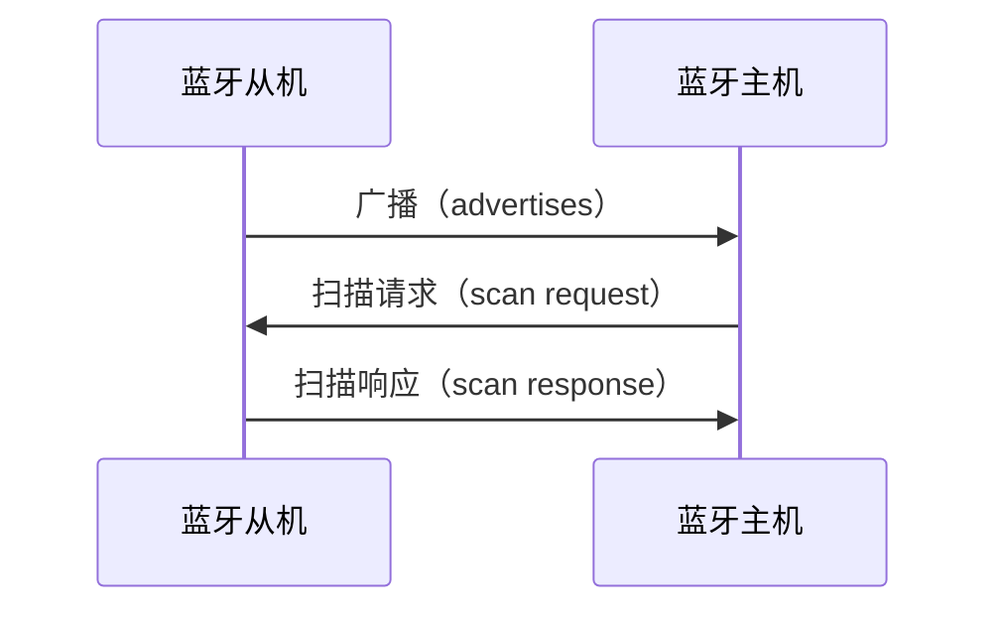
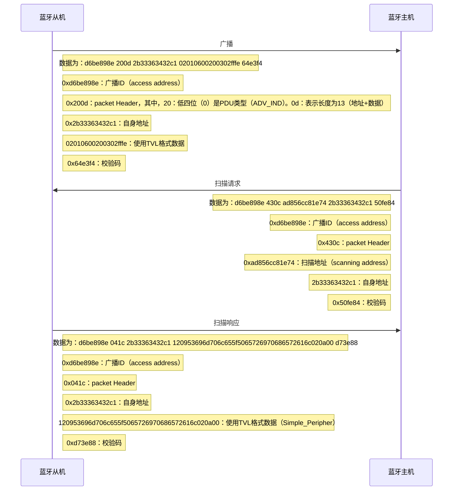
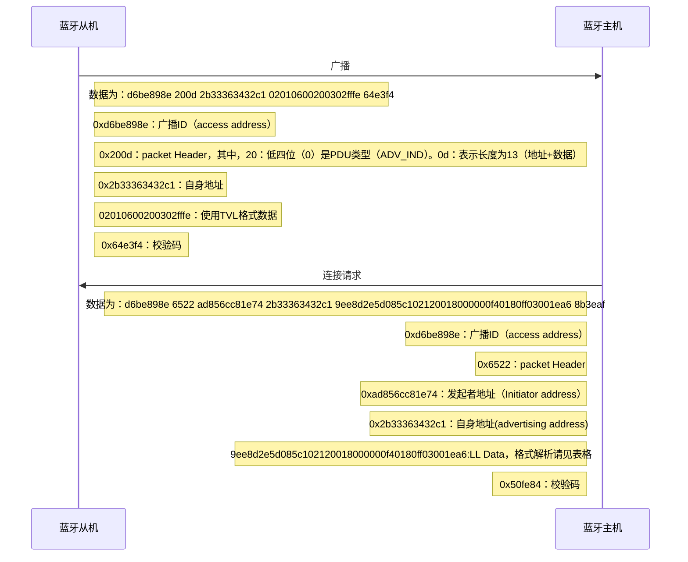
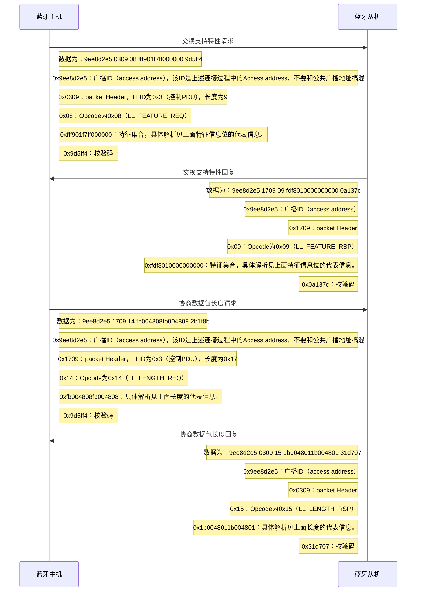

# 参考链接

[深入浅出低功耗蓝牙(BLE)协议栈及蓝牙连接过程_蓝牙芯片的寄存器组为什么需要分为两块-CSDN博客](https://blog.csdn.net/lanhuazui10/article/details/144194112)

[蓝牙核心技术概述（一）:蓝牙概述_蓝牙技术-CSDN博客](https://blog.csdn.net/xubin341719/article/details/38145507?spm=1001.2014.3001.5502)

[蓝牙核心技术概述（三）： 蓝牙协议规范（射频、基带链路控制、链路管理）_蓝牙3.0技术规范-CSDN博客](https://blog.csdn.net/xubin341719/article/details/38303881?spm=1001.2014.3001.5502)

[蓝牙核心技术概述（四）：蓝牙协议规范（HCI、L2CAP、SDP、RFOCMM）_蓝牙通信帧分类-CSDN博客](https://blog.csdn.net/xubin341719/article/details/38305331)

[蓝牙核心技术概述（五）：蓝牙协议规范（irOBEX、BNEP、AVDTP、AVCTP）_蓝牙核心bnep-CSDN博客](https://blog.csdn.net/xubin341719/article/details/38335533)

[BLE协议学习 – 学习笔记 (giraffexiu.love)](http://www.giraffexiu.love/index.php/2024/10/22/ble协议学习/)

[ESP32教程第二章讲义 - 哔哩哔哩 (bilibili.com)](https://www.bilibili.com/opus/697239519074713670)

[Bluetooth.org - Generic Access Profile (nop.hu)](http://rfc.nop.hu/bluetooth/AssignedNumbersGenericAccessProfile.pdf)

[Assigned Numbers | Bluetooth® Technology Website](https://www.bluetooth.com/specifications/assigned-numbers/)

# 传输原理

<iframe src="//player.bilibili.com/player.html?isOutside=true&aid=1606150371&bvid=BV1Sm421G7Rp&cid=1610274664&p=1&autoplay=0" scrolling="no" border="0" frameborder="no" framespacing="0"allowfullscreen="true"></iframe>

蓝牙的传输频率是2.4GHZ，也就是说一秒钟之内蓝牙信号可以改变24亿次。

蓝牙的通信模式有两种：

1. 经典蓝牙：一帧数据包有357个字节

   

   1. 前9字节是访问地址用于区分不同的蓝牙设备

   2. 标头是确保数据的可靠性和稳定性
   3. 可以承载0-399字节的数据位，不同的报文会承载不同长度的数据
   4. 最后两字节用于CRC校验，用于校验一帧数据的正确性

2. 低功耗蓝牙：一帧数据包有261个字节

   

   1. 第一个字节是预补码，用于时钟同步和信道估计
   2. 后四个字节是访问地址，用于区分不同的蓝牙设备
   3. 2-253字节的数据位
   4. 最后三个字节用于CRC校验

实际上，蓝牙通过高频信号和低频信号来表达0和1


所以说，虽然蓝牙的通信协议的频率为2.4GHZ，但是实际上蓝牙的传输速率最快也就是3MB/S


所以说蓝牙需要两种频率才能传输数据，2.4GHz只是一个大概频率，蓝牙利用的是高斯频移键控（Gaussian Frequency Shift Keying ，GFSK）技术。

低功耗蓝牙的GFSK的偏移量一般为$\pm$185KHz，首先确定一个中心频率，比如中心频率为2.402GHz，那么

1. 逻辑1是在中心频率的基础上加185KHz
2. 逻辑0是在中心频率的基础上减185KHz


但是在同一个空间中，所有的蓝牙都是使用的是2.402GHz作为中心频率，那么蓝牙的通信不就是全乱的吗，实际上并不会。

蓝牙采用了多信道通信，如低功耗蓝牙有40个信道，信道范围从2.402GHz到2.480GHz，每个信道的间隔是==2MHz==。


比如在2.402GHz内通信，那么它实际传输的就是刚刚通过GFSK计算的频率，经典蓝牙的每个信道的间隔是==1MHz==，并且他们会频繁的在不同的信道之间开始通信，一秒之内可以达到上百次跳频


# 概述

## 名称由来  

蓝牙这个名称来自于第十世纪的一位丹麦国王哈洛德·布美塔特（（Harald Blåtand），丹麦语的Blåtand翻译成英语就是 Bluetooth，因此这位国王又叫哈拉尔蓝牙王（Harald Bluetooth）。因为国王喜欢吃蓝莓，牙龈每天都是蓝色的所以叫蓝牙。**蓝牙的标志是一个结合符文，它融合了卢恩字母（古北欧人使用的一类字母，现已灭绝）中的H（ᚼ）和B（ᛒ）符文，同时也是哈拉尔国王名字的首字母缩写。**


在行业协会筹备阶段，需要一个极具有表现力的名字来命名这项高新技术。行业组织人员，在经过一夜关于欧洲历史和未来无线技术发展的讨论后，有些人认为用Blatand国王的名字命名再合适不过了。Blatand国王将挪威，瑞典和丹麦统一起来；他的口齿伶俐,善于交际,就如同这项即将面世的技术，技术将被定义为允许不同工业领域之间的协调工作，保持着各个系统领域之间的良好交流，例如计算机，手机和汽车行业之间的工作。   

## 发展历史

1. 1994年爱立信公司研发；
2. 1997年爱立信联系其他设备生产商；
3. 1998年二月，诺基亚、苹果、三星组成的一个特殊兴趣小组SIG(Special Interest Group)；
4. 1998年5月，爱立信、诺基亚、东芝、IBM和英特尔公司等五家著名厂商，联合开发；
5. 1999年下半年，微软、摩托罗拉、三星、朗讯等主流设备商广泛推广蓝牙技术应用；
6. 2006年10月13日，Bluetooth SIG（蓝牙技术联盟）发展到200多家联盟成员公司以及约6000家应用成员企业。

## 技术特点

1. 工作频段：2.4GHz（ISM）频段，无需申请许可证。大多数国家使用79个频点，载频为(2402+k)MHz（k=0，1, 2…78），载频间隔1MHz。采用TDD时分双工方式。
2. 传输速率：1Mb/s（V2.0以上版本）
3. 调试方式：BT=0.5的GFSK调制，调制指数为0.28-0.35。
4. 采用跳频技术：跳频速率为1600跳/秒，在建链时（包括寻呼和查询）提高为3200跳/秒。蓝牙通过快跳频和短分组技术减少同频干扰，保证传输的可靠性。
5. 语音调制方式：连续可变斜率增量调制（CVSD，ContinuousVariable Slope Delta Modulation），抗衰落性强，即使误码率达到4%，话音质量也可接受。
6. 支持电路交换和分组交换业务：蓝牙支持实时的同步定向联接（SCO链路）和非实时的异步不定向联接（ACL链路），前者主要传送语音等实时性强的信息，后者以数据包为主。语音和数据可以单独或同时传输。蓝牙支持一个异步数据通道，或三个并发的同步话音通道，或同时传送异步数据和同步话音的通道。每个话音通道支持64kbps的同步话音；异步通道支持723.2/57.6kbps的非对称双工通信或433.9kbps的对称全双工通信。
7. 支持点对点及点对多点通信：蓝牙设备按特定方式可组成两种网络：微微网(Piconet)和分布式网络(Scatternet)，其中微微网的建立由两台设备的连接开始，最多可由八台设备组成。在一个微微网中，只有一台为主设备（Master），其它均为从设备（Slave），不同的主从设备对可以采用不同的链接方式，在一次通信中，链接方式也可以任意改变。几个相互独立的微微网以特定方式链接在一起便构成了分布式网络。所有的蓝牙设备都是对等的，所以在蓝牙中没有基站的概念。
8. 工作距离：蓝牙设备分为三个功率等级，分别是：100mW（20dBm）、2.5mW（4dBm）和1mW（0dBm），相应的有效工作范围为：100米、10米和1米。

## 系统组成


1. 应用程序（Application）

   - 应用程序层位于蓝牙协议栈的顶层
   - 直接与用户交互和上层应用程序进行通信（定义了蓝牙设备的具体功能和应用，如文件传输、音频/视频传输、设备控制等）
   - 应用程序层向高层协议（如FTP、HFP、A2DP等）提供服务，转换用户需求为协议栈可以处理的操作指令

2. 高层协议（Higher Layer Protocols）

   高层协议位于应用程序层之下（负责定义和管理特定的应用通信协议）

   - FTP（File Transfer Protocol）：用于文件传输
   - HFP（Hands-Free Profile）：用于蓝牙耳机和车载电话的通话控制
   - A2DP（Advanced Audio Distribution Profile）：用于高质量音频传输
   - AVRCP（Audio/Video Remote Control Profile）：用于远程控制音视频设备
   - OPP（Object Push Profile）：用于简单对象的传输

3. 主机控制接口（HCI，Host Controller Interface）

   - HCI是主机软件与蓝牙硬件控制器之间的接口协议（定义了主机与控制器之间的命令和事件传输机制，使主机能够向控制器发送控制命令，如设备初始化、连接管理、链路状态查询等）
   - 控制器通过HCI向主机报告事件，如连接状态改变、数据接收等

4. 主机控制（Host Control）

   主机控制层位于蓝牙协议栈中主机端的核心部分，负责协调和管理整个协议栈的运行

   接收来自应用程序层的请求，通过HCI与蓝牙控制器进行通信，并处理各种协议的状态管理和数据传输控制

5. 链路管理(Link Manager)

   链路管理层负责管理蓝牙设备之间的连接建立、维护和释放

   - 连接请求和响应：处理设备之间的连接请求，协商连接参数
   - 链路质量管理：监测和维护连接的质量，包括信号强度、误码率等
   - 能量管理：优化设备的电源消耗，通过动态调整传输功率和时钟频率来降低能耗

6. 蓝牙音频（Audio）

   蓝牙音频层专门用于音频数据的传输和处理（音频数据的编解码方式、传输格式和同步机制，使得蓝牙设备能够支持高质量音频的无线传输，如音乐播放、电话通话）

7. 基带或链路控制单元(Link Controller)

   负责管理和控制蓝牙通信中的基础数据链路（蓝牙协议栈的核心部分之一）

   - 数据包的生成和解析：定义数据包的格式和结构
   - 错误检测与纠正：通过CRC（循环冗余校验）等方法检测和纠正数据传输中的错误
   - 链路管理：协调和管理设备之间的连接，包括连接的建立、维护和断开

8. 无线射频单元(Radio)

   射频层是蓝牙协议栈的最底层，负责实际的无线通信

   - 物理层和调制解调器（控制射频信号的发送和接收）
   - 射频层使用频率跳跃扩频技术（FHSS），在2.4GHz ISM频段内工作，以提高通信稳定性和抗干扰能力


## 蓝牙协议规范

1. 传输协议

   负责蓝牙设备间，互相确认对方的位置，以及建立和管理蓝牙设备间的物理链路；

   - 底层传输协议： 蓝牙射频（Radio）部分、基带链路管理控制器（Baseband&Link Controller）、链路管理协议（Link Manager Protocol LMP）。负责语言、数据无线传输的物理实现以及蓝牙设备间的联网组网。
   -  高层传输协议： 逻辑链路控制与适配器（Logical Link Control and Adaptation Protocol）L2CAP 、主机控制接口（Host Control Interface，HCI）。为高层应用屏蔽了跳频序列选择等底层传输操作，为高层程序提供有效、有利于实现数据分组格式。

2. 中介协议

   为高层应用协议或者程序，在蓝牙逻辑链路上工作提供必要的支持，为应用提供不同标准接口。

   - 串口仿真协议：RFCOMM
   - 服务发现协议：SDP
   - 互操作协议：IrDA
   - 网络访问协议：PPP、IP、TCP、UDP
   - 电话控制协议：TCS、AT指令集。

   

3. 应用协议

   蓝牙协议栈之上的应用软件和所涉及到的协议，如：拨号上网、语言功能的应用程序。蓝牙的应用框架如下：

   1. 通用应用类框架：提供基本的服务发现、连接建立和数据传输功能
   2. 蓝牙电话应用类框架：支持电话控制和语音通信功能
   3. 蓝牙连网应用类框架：支持蓝牙设备与互联网的连接和数据交换
   4. 对象交互服务类框架：支持与其他设备（如IrDA设备）之间的对象交换协议（OBEX）
   5. 蓝牙音视频控制类框架：支持音频和视频设备的远程控制和数据传输

## 硬件接口

一般蓝牙芯片通过UART、USB、SDIO、I2S、PcCard和主控芯片通信。如下图所示，通过UART和主控芯片通信。

   


## 协议栈

> [!note]
>
> 下面以BLE（低功耗蓝牙）为例

协议栈如下图所示：


如上图所述，要实现一个BLE应用，首先需要一个支持BLE射频的芯片，然后还需要提供一个与此芯片配套的BLE协议栈，最后在协议栈上开发自己的应用。可以看出BLE协议栈是连接芯片和应用的桥梁，是实现整个BLE应用的关键。

那BLE协议栈具体包含哪些功能呢？简单来说，BLE协议栈主要用来对你的应用数据进行**层层封包**，以生成一个满足BLE协议的空中数据包，也就是说，把应用数据包裹在一系列的帧头（header）和帧尾（tail）中。具体来说，BLE协议栈主要由如下几部分组成：

- PHY**层**（Physical layer物理层）。PHY层用来指定BLE所用的无线频段，调制解调方式和方法等。PHY层做得好不好，直接决定整个BLE芯片的功耗，灵敏度以及selectivity等射频指标。
- LL**层**（Link Layer链路层）。LL层是整个BLE协议栈的核心，也是BLE协议栈的难点和重点。像Nordic的BLE协议栈能同时支持20个link（连接），就是LL层的功劳。LL层要做的事情非常多，比如具体选择哪个射频通道进行通信，怎么识别空中数据包，具体在哪个时间点把数据包发送出去，怎么保证数据的完整性，ACK如何接收，如何进行重传，以及如何对链路进行管理和控制等等。LL层只负责把数据发出去或者收回来，对数据进行怎样的解析则交给上面的GAP或者GATT。
- HCI（Host controller interface）。HCI是可选的（[具体请参考文章： 三种蓝牙架构实现方案（蓝牙协议栈方案）](http://www.cnblogs.com/iini/p/8834970.html)），HCI主要用于2颗芯片实现BLE协议栈的场合，用来规范两者之间的通信协议和通信命令等。
- GAP**层**（Generic access profile）。GAP是对LL层payload（有效数据包）如何进行解析的两种方式中的一种，而且是最简单的那一种。GAP简单的对LL payload进行一些规范和定义，因此GAP能实现的功能极其有限。GAP目前主要用来进行广播，扫描和发起连接等。
- L2CAP**层**（Logic link control and adaptation protocol）。L2CAP对LL进行了一次简单封装，LL只关心传输的数据本身，L2CAP就要区分是加密通道还是普通通道，同时还要对连接间隔进行管理。
- SMP（Secure manager protocol）。SMP用来管理BLE连接的加密和安全的，如何保证连接的安全性，同时不影响用户的体验，这些都是SMP要考虑的工作。
- **ATT**（Attribute protocol）。简单来说，ATT层用来定义用户命令及命令操作的数据，比如读取某个数据或者写某个数据。BLE协议栈中，开发者接触最多的就是ATT。**BLE引入了attribute概念，用来描述一条一条的数据**。Attribute除了定义数据，同时定义该数据可以使用的ATT命令，因此这一层被称为ATT层。
- **GATT**（Generic attribute profile ）。GATT用来规范attribute中的数据内容，并运用group（分组）的概念对attribute进行分类管理。没有GATT，BLE协议栈也能跑，但互联互通就会出问题，也正是因为有了GATT和各种各样的应用profile，BLE摆脱了ZigBee等无线协议的兼容性困境，成了出货量最大的2.4G无线通信产品。

# 发送方式

> [!note]
>
> 假设有设备A和设备B，设备A要把自己目前的电量状态83%（十六进制表示为0x53）发给设备B，该怎么做呢？

作为一个开发者，他希望越简单越好，对他而言，他希望调用一个简单的API就能完成这件事，比如send(0x53)，实际上我们的BLE协议栈就是这样设计的，开发者只需调用send(0x53)就可以把数据发送出去了，其余的事情BLE协议栈帮你搞定。很多人会想，BLE协议栈是不是直接在物理层就把0x53发出去，就如下图所示：


这种方式初看起来挺美的，但由于很多细节没有考虑到，实际是不可行的。

1. 首先，它没有考虑用哪一个射频信道来进行传输，在不更改API的情况下，我们只能对协议栈进行分层，为此引入LL层，开发者还是调用send(0x53)，send(0x53)再调用send_LL(0x53,2402M)（注：2402M为信道频率）。
2. 这里还有一个问题，设备B怎么知道这个数据包是发给自己的还是其他人的，为此BLE引入==access address==概念，用来指明接收者身份，其中，`0x8E89BED6`这个access address比较特殊，它表示要发给周边所有设备，即广播。
3. 如果你要一对一的进行通信（BLE协议将其称为**连接**），即设备A的数据包只能设备B接收，同样设备B的数据包只能设备A接收，那么就必须生成一个独特的**随机**access address以标识设备A和设备B两者之间的连接。

## 广播方式

低功耗蓝牙工作在2.4GHz频段，频率范围为 2402MHz – 2480 MHz，每2MHz一个信道，共40个信道，其中为3个广播信道，剩余的37为个数据信道。


> [!tip]  
>
> 之所以会选择相距很远的通道，是为了防止干扰

我们先来看一下简单的广播情况，这种情况下，我们把设备A叫**advertiser**（广播者），设备B叫**scanner**或者**observer**（扫描者）。

1. 广播状态下设备A的LL层API将变成send_LL(0x53,2402M, 0x8E89BED6)。
2. 由于设备B可以同时接收到很多设备的广播，因此数据包还必须包含设备A的device address（0xE1022AAB753B）以确认该广播包来自设备A，为此send_LL参数需要变成(0x53,2402M, 0x8E89BED6, 0xE1022AAB753B)。
3. LL层还要检查数据的完整性，即数据在传输过程中有没有发生窜改，为此引入CRC24对数据包进行检验 (假设为0xB2C78E) 。
4. 同时为了调制解调电路工作更高效，每一个数据包的最前面会加上1个字节的preamble（前导帧），preamble一般为0x55或者0xAA。这样，整个空中包就变成（注：**空中包用小端模式表示！**）：`AAD6BE898E3B75AB2A02E1538EC7B2`


上面这个数据包还有如下问题：

1. 没有对数据包进行分类组织，设备B无法找到自己想要的数据0x53。为此我们需要**在access address之后加入两个字段：LL header和长度字节**。LL header用来表示数据包的LL类型，长度字节用来指明payload的长度
2. 设备B什么时候开启射频窗口以接收空中数据包？如上图case1所示，当设备A的数据包在空中传输的时候，设备B把接收窗口关闭，此时通信将失败；同样对case2来说，当设备A没有在空中发送数据包时，设备B把接收窗口打开，此时通信也将失败。只有case3的情况，通信才能成功，即设备A的数据包在空中传输时，设备B正好打开射频接收窗口，此时通信才能成功，换句话说，LL层还必须定义通信时序。
3. 当设备B拿到数据0x53后，该如何解析这个数据呢？它到底表示湿度还是电量，还是别的意思？这个就是GAP层要做的工作，**GAP层引入了LTV（Length-Type-Value）结构来定义数据**，比如020105，02-长度，01-类型（强制字段，表示广播flag，广播包必须包含该字段），05-值。由于==广播包最大只能为31个字节==，它能定义的数据类型极其有限，像这里说的电量，GAP就没有定义，因此要通过广播方式把电量数据发出去，只能使用**供应商自定义数据类型0xFF，即04FF590053**，其中04表示长度，FF表示数据类型（自定义数据），0x0059是供应商ID（自定义数据中的强制字段），0x53就是我们的数据(设备双方约定0x53就是表示电量，而不是其他意思)。

最终空中传输的数据包将会变成：

`AA D6BE898E 60 0E 3B75AB2A02E1 020105 04FF5900 53 8EC7B2`

- AA – 前导帧(preamble)
- D6BE898E – 访问地址(access address)
- 60 – LL帧头字段(LL header)
- 0E – 有效数据包长度(payload length)
- 3B75AB2A02E1 – 广播者本身的设备地址(advertiser address)
- 02010504FF5900**53 –** **广播数据（LTV结构数据+供应商自定义数据+广播发送的真正数据）**
- 8EC7B2 – CRC24校验值

有了PHY，LL和GAP，就可以发送广播包了，但广播包携带的信息极其有限，而且还有如下几大限制：

1. 无法进行一对一双向通信 （广播是一对多通信，而且是单方向的通信）
2. 由于不支持组包和拆包，因此无法传输大数据
3. 通信不可靠及效率低下。广播信道不能太多，否则将导致扫描端效率低下。为此，BLE只使用37(2402MHz) /38(2426MHz) /39(2480MHz)三个信道进行广播和扫描，因此==广播不支持跳频==。由于广播是一对多的，所以广播也无法支持ACK。这些都使广播通信变得不可靠。
4. 扫描端功耗高。由于扫描端不知道设备端何时广播，也不知道设备端选用哪个频道进行广播，扫描端只能拉长扫描窗口时间，并同时对37/38/39三个通道进行扫描，这样功耗就会比较高。

## 连接方式


到底什么叫连接(connection)？像有线UART，很容易理解，就是用线（Rx和Tx等）把设备A和设备B相连，即为连接。用“线”把两个设备相连，实际是让2个设备有共同的通信媒介，并让两者时钟同步起来。蓝牙连接有何尝不是这个道理，所谓设备A和设备B建立蓝牙连接，就是指设备A和设备B**两者一对一“同步”成功**，其具体包含以下几方面：

- 设备A和设备B对接下来要使用的物理信道达成一致

- 设备A和设备B双方建立一个共同的时间锚点，也就是说，把双方的时间原点变成同一个点

- 设备A和设备B两者时钟同步成功，即双方都知道对方什么时候发送数据包什么时候接收数据包

- 连接成功后，设备A和设备B通信流程如下所示：

  

如上图所示，一旦设备A和设备B连接成功（此种情况下，我们把设备A称为**Master**或者**Central**，把设备B称为**Slave**或者**Peripheral**），设备A将周期性以CI（connection interval）为间隔向设备B发送数据包，而设备B也周期性地以CI为间隔打开射频接收窗口以接收设备A的数据包。同时按照蓝牙spec要求，设备B收到设备A数据包150us**后**，设备B切换到发送状态，把自己的数据发给设备A；设备A则切换到接收状态，接收设备B发过来的数据。由此可见，连接状态下，设备A和设备B的射频发送和接收窗口都是周期性地有计划地开和关，而且开的时间非常短，从而大大降低系统功耗并大大提高系统效率。

现在我们看看连接状态下是如何把数据0x53发送出去的，从中大家可以体会到[蓝牙协议栈](https://so.csdn.net/so/search?q=蓝牙协议栈&spm=1001.2101.3001.7020)分层的妙处。

以下是数据一层层封装的过程

- 对开发者来说，很简单，他只需要调用send(0x53)

- GATT层定义数据的类型和分组，方便起见，我们用0x0013表示电量这种数据类型，这样GATT层把数据打包成130053（**小端模式**！）

- ATT层用来选择具体的通信命令，比如读/写/notify通知/indicate等，这里选择**notify命令0x1B**，这样数据包变成了：1B130053

- L2CAP用来指定connection interval（连接间隔），比如每10ms同步一次（CI不体现在数据包中），同时指定**逻辑通道编号0004（表示ATT命令）**，最后把**ATT数据长度0x0004**加在包头，这样数据就变为：040004001B130053

- LL层要做的工作很多，首先LL层需要指定用哪个物理信道进行传输（物理信道不体现在数据包中），然后再给此连接分配一个Access address

  （0x50655DAB）以标识此连接只为设备A和设备B直连服务，然后加上LL header和payload length字段，LL header标识此packet为数据packet，而不是control packet等，payload length为整个L2CAP字段的长度，最后加上CRC24字段，以保证整个packet的数据完整性，所以数据包最后变成：

  - AAAB5D65501E08040004001B130053D550F6
    - AA – 前导帧(preamble)
    - 0x50655DAB – 访问地址(access address)
    - 1E – LL帧头字段(LL header)
    - 08 – 有效数据包长度(payload length)
    - 04000400 – ATT数据长度，以及L2CAP通道编号
    - 1B – notify command
    - 0x0013 – 电量数据handle
    - 0x53 – 真正要发送的电量数据
    - 0xF650D5 – CRC24值

虽然开发者只调用了 send(0x53)，但由于低功耗蓝牙协议栈层层打包，最后空中实际传输的数据将变成下图所示的模样，这就既满足了低功耗蓝牙通信的需求，又让用户API变得简单，可谓一箭双雕！


## 封包过程

假设现在要发送`0x53`，以下是封包的过程：

### 广播方式

封包过程中走了以下协议：*==应用层>GAP层>LL层>物理层==*

==应用层==

- 数据：`0x53`
- 广播参数：
  - 广播类型：可连接的非定向广播（ADV_IND）。
  - 广播设备地址：`0xAABBCCDDEEFF`（假设为公共地址）。
  - 广播数据：包含 `0x53`。

==GAP 层==

- 将 `0x53` 封装到广播数据中。
- 广播数据格式：
  ```
  | Length (1 byte) | AD Type (1 byte) | AD Data (variable) |
  ```
- 假设使用自定义的 AD Type（例如 `0xFF` 表示厂商自定义数据）。
- 广播数据示例：
  ```
  | Length = 2 | AD Type = 0xFF | AD Data = 0x53 |
  ```

- **广播数据**：
  ```
  02 FF 53
  ```

==LL 层==

- 广播信道 PDU 格式：
  ```
  | Header (2 bytes) | Payload (6-37 bytes) |
  ```

- **Header 字段**：
  - PDU Type：`0000`（ADV_IND，可连接的非定向广播）。
  - RFU：`0`。
  - ChSel：`1`（支持信道选择算法）。
  - TxAdd：`0`（公共地址）。
  - RxAdd：`0`（公共地址）。
  - Length：`9`（Payload 长度为 9 字节）。

- **Payload 字段**：
  - AdvA：`AA BB CC DD EE FF`（广播设备地址）。
  - AdvData：`02 FF 53`（广播数据）。

- **封装后的广播信道 PDU**：
  ```
  | Header = 0x40 0x09 | AdvA = 0xAA 0xBB 0xCC 0xDD 0xEE 0xFF | AdvData = 0x02 0xFF 0x53 |
  ```

- **完整 PDU**：
  ```
  40 09 AA BB CC DD EE FF 02 FF 53
  ```

==物理层==

- 物理层数据包格式：
  ```
  | Preamble (1 byte) | Access Address (4 bytes) | PDU (2-39 bytes) | CRC (3 bytes) |
  ```

- **封装步骤**：
  1. **Preamble**：`0xAA`（假设 Access Address 的 LSB 为 0）。
  2. **Access Address**：广播信道的 Access Address 固定为 `0x8E89BED6`。
  3. **PDU**：`40 09 AA BB CC DD EE FF 02 FF 53`。
  4. **CRC**：假设为 `0x55 0x55 0x55`。

- **封装后的物理层数据包**：
  ```
  AA D6 BE 89 8E 40 09 AA BB CC DD EE FF 02 FF 53 55 55 55
  ```

### 连接方式

==应用层==

- 数据：`0x53`

==ATT 层==

- Opcode：`0x12`（ATT_HANDLE_VALUE_NOTI，通知操作）。
- Parameters：`0x53`。

- **ATT 数据包**：
  ```
  12 53
  ```

==L2CAP 层==

- L2CAP 数据包格式：
  ```
  | Length (2 bytes) | Channel ID (2 bytes) | Payload (0-65535 bytes) |
  ```

- **封装步骤**：
  1. **Length**：`0x0002`（2 字节）。
  2. **Channel ID**：`0x0004`（ATT 通道）。
  3. **Payload**：`12 53`。

- **L2CAP 数据包**：
  ```
  02 00 04 00 12 53
  ```

==LL 层==

- 数据信道 PDU 格式：
  ```
  | Header (2 bytes) | Payload (0-251 bytes) |
  ```

- **Header 字段**：
  
  - LLID：`01`（LL Data PDU）。
  - NESN：`0`。
  - SN：`0`。
  - MD：`0`。
  - Length：`0x06`（6 字节）。
  
- **Payload 字段**：
  - L2CAP 数据包：`02 00 04 00 12 53`。

- **LL PDU**：
  ```
  09 06 02 00 04 00 12 53
  ```

==物理层==

- 物理层数据包格式：
  ```
  | Preamble (1 byte) | Access Address (4 bytes) | PDU (2-257 bytes) | CRC (3 bytes) |
  ```

- **封装步骤**：
  1. **Preamble**：`0xAA`（假设 Access Address 的 LSB 为 0）。
  2. **Access Address**：连接的唯一标识符，假设为 `0xD6 BE 89 8E`。
  3. **PDU**：`09 06 02 00 04 00 12 53`。
  4. **CRC**：假设为 `0x55 0x55 0x55`。

- **封装后的物理层数据包**：
  ```
  AA D6 BE 89 8E 09 06 02 00 04 00 12 53 55 55 55
  ```

# PDU格式

蓝牙协议数据单元（PDU）格式是蓝牙通信中用于传输控制信息和数据的基本结构。PDU格式根据蓝牙协议的不同层次（如LL、L2CAP、ATT、GATT等）有所差异。

## LL

### 广播信道

完整的广播信道报文格式为：

```
| Preamble (1 byte) | Access Address (4 bytes) | PDU (2-39 bytes) | CRC (3 bytes) |
```

广播信道的PDU格式为：

```
| Header (2 bytes) | Payload (6-37 bytes) |
```

#### Header 字段
- **PDU Type (4 bits)**：指示PDU类型，例如：
  - `0000`：ADV_IND（可连接的非定向广播）
  - `0001`：ADV_DIRECT_IND（可连接的定向广播）
  - `0010`：ADV_NONCONN_IND（不可连接的非定向广播）
  - `0110`：SCAN_REQ（扫描请求）
  - `0111`：SCAN_RSP（扫描响应）
  - `1000`：CONNECT_IND（连接请求）
- **RFU (1 bit)**：保留位。
- **ChSel (1 bit)**：指示是否支持信道选择算法（LE Channel Selection Algorithm #2）。
- **TxAdd (1 bit)**：指示广播地址是公共地址（0）还是随机地址（1）。
- **RxAdd (1 bit)**：指示目标地址是公共地址（0）还是随机地址（1）。
- **Length (6 bits)**：有效载荷的长度（6-37字节）。

#### Payload 字段
- **AdvA (6 bytes)**：广播设备的地址。
- **TargetA (6 bytes，可选)**：目标设备的地址（仅用于定向广播）。
- **AdvData (0-31 bytes)**：广播数据（包含GAP相关的信息，如设备名称、服务UUID等）。

广播信道 PDU 的类型决定了广播设备的行为和目标设备的响应方式。以下是常见的 PDU 类型：

1. ADV_IND：用于广播设备向所有设备发送广播数据。

   ```
   | Header | AdvA (6 bytes) | AdvData (0-31 bytes) |
   ```

2. ADV_DIRECT_IND：用于广播设备向特定目标设备发送广播数据。

   ```
   | Header | AdvA (6 bytes) | TargetA (6 bytes) |
   ```

3. ADV_NONCONN_IND：用于广播设备发送不可连接的广播数据。

   ```
   | Header | AdvA (6 bytes) | AdvData (0-31 bytes) |
   ```

4. SCAN_REQ：用于扫描设备向广播设备请求扫描响应数据。

   ```
   | Header | ScanA (6 bytes) | AdvA (6 bytes) |
   ```

5. SCAN_RSP：用于广播设备响应扫描请求。

   ```
   | Header | AdvA (6 bytes) | ScanRspData (0-31 bytes) |
   ```

### 数据信道

完整的数据信道报文格式为：

```
| Preamble (1 byte) | Access Address (4 bytes) | PDU (2-257 bytes) | CRC (3 bytes) |
```

在连接建立后，数据信道PDU的格式如下：

```
| Header (2 bytes) | Payload (0-251 bytes) |
```

#### Header 字段
- **LLID (2 bits)**：逻辑链路标识符（Logical Link Identifier），标识数据包类型。
  
  | LLID 值 | 名称                                    | 描述                                                         |
  | ------- | --------------------------------------- | ------------------------------------------------------------ |
  | 00      | RFU (Reserved)                          | 保留字段，未使用。                                           |
  | 01      | LL Data PDU (Continuation Fragment)     | 表示这是一个数据PDU的后续分片（Continuation Fragment) 。     |
  | 10      | LL Data PDU (Start of an L2CAP Message) | 表示这是一个数据PDU的起始分片（Start of an L2CAP Message) 。 |
  | 11      | LL Control PDU                          | 表示这是一个控制PDU（Control PDU），用于链路层控制信息。     |
  
- **NESN (1 bit)**：下一个预期序列号。

- **SN (1 bit)**：序列号。

- **MD (1 bit)**：更多数据标志。指示是否有更多的数据需要传输。

- RFU（3 bit）：保留字段

- **Length (8 bits)**：有效载荷的长度（0-251字节）。

假设一个 Packet Header 的值为 `0x1A2B`，其二进制表示为：

```
000 1 1 0 10 | 00101011
```

- **LLID**：`10`（表示数据 PDU 的PDU起始分片）。
- **NESN**：`0`（表示接收方期望的下一个序列号为 0）。
- **SN**：`1`（表示当前数据包的序列号为 1）。
- **MD**：`1`（表示发送方还有更多数据需要传输）。
- **RFU**：`000`（保留字段）。
- **Length**：`0x2B`（表示有效载荷长度为 43 字节）。

不同的LLID有着不同的PDU，实际上共有两种类型：

1. 控制报文
2. 数据报文

#### Payload 字段

- **L2CAP数据或LL控制信息**：承载GAP相关的数据或控制信息。

#### 控制报文

两台设备连接成功之后，首先会先进行沟通，设备之间会通过==链路层（Link Layer, LL）==交换一系列控制信息，以协商连接参数、确认支持的功能以及管理连接状态。当数据报文是控制信息，那么LLID应该为`11`。

所有 LL 控制报文都以一个 **Opcode** 开头，用于标识报文的类型。通用格式如下：

| 字段名称    | 长度（字节） | 描述                                                         |
| ----------- | ------------ | ------------------------------------------------------------ |
| **Opcode**  | 1            | 控制报文的操作码（Opcode），用于标识报文的类型。             |
| **Payload** | 可变         | 与 Opcode 相关的数据字段，长度和内容取决于具体的控制报文类型。 |

Opcode的可选如下：

| **Opcode** | **名称**                 | **描述**                                                |
| ---------- | ------------------------ | ------------------------------------------------------- |
| `0x00`     | LL_CONNECTION_UPDATE_IND | 用于更新连接参数（如连接间隔、延迟等）。                |
| `0x01`     | LL_CHANNEL_MAP_IND       | 用于指示信道映射的更新。                                |
| `0x02`     | LL_TERMINATE_IND         | 用于终止连接。                                          |
| `0x03`     | LL_ENC_REQ               | 用于请求加密连接的启动。                                |
| `0x04`     | LL_ENC_RSP               | 用于响应加密请求。                                      |
| `0x05`     | LL_START_ENC_REQ         | 用于启动加密过程。                                      |
| `0x06`     | LL_START_ENC_RSP         | 用于响应加密启动请求。                                  |
| `0x07`     | LL_UNKNOWN_RSP           | 用于响应未知或不支持的控制报文。                        |
| `0x08`     | LL_FEATURE_REQ           | 用于请求对端设备的支持特性。                            |
| `0x09`     | LL_FEATURE_RSP           | 用于响应特性请求，返回支持的特性列表。                  |
| `0x0A`     | LL_PAUSE_ENC_REQ         | 用于请求暂停加密。                                      |
| `0x0B`     | LL_PAUSE_ENC_RSP         | 用于响应暂停加密请求。                                  |
| `0x0C`     | LL_VERSION_IND           | 用于交换链路层版本信息。                                |
| `0x0D`     | LL_REJECT_IND            | 用于拒绝某个请求或指示。                                |
| `0x0E`     | LL_SLAVE_FEATURE_REQ     | 用于从设备请求主设备的支持特性。                        |
| `0x0F`     | LL_CONNECTION_PARAM_REQ  | 用于请求更新连接参数（如连接间隔、延迟等）。            |
| `0x10`     | LL_CONNECTION_PARAM_RSP  | 用于响应连接参数更新请求。                              |
| `0x11`     | LL_REJECT_EXT_IND        | 用于拒绝扩展指示。                                      |
| `0x12`     | LL_PING_REQ              | 用于发送 Ping 请求，测试连接状态。                      |
| `0x13`     | LL_PING_RSP              | 用于响应 Ping 请求。                                    |
| `0x14`     | LL_LENGTH_REQ            | 用于请求最大数据长度（支持 LE Data Length Extension）。 |
| `0x15`     | LL_LENGTH_RSP            | 用于响应最大数据长度请求。                              |
| `0x16`     | LL_PHY_REQ               | 用于请求 PHY 更新（如 1M、2M 或 Coded PHY）。           |
| `0x17`     | LL_PHY_RSP               | 用于响应 PHY 更新请求。                                 |
| `0x18`     | LL_PHY_UPDATE_IND        | 用于指示 PHY 更新已完成。                               |
| `0x19`     | LL_MIN_USED_CHANNELS_IND | 用于指示最小使用的信道数量。                            |
| `0x1A`     | LL_CTE_REQ               | 用于请求发送 Constant Tone Extension（CTE）。           |
| `0x1B`     | LL_CTE_RSP               | 用于响应 CTE 请求。                                     |


Opcode 按以下分类：

1. **连接管理**：
   - `LL_CONNECTION_UPDATE_IND`
   - `LL_TERMINATE_IND`
   - `LL_CONNECTION_PARAM_REQ`
   - `LL_CONNECTION_PARAM_RSP`

2. **加密管理**：
   - `LL_ENC_REQ`
   - `LL_ENC_RSP`
   - `LL_START_ENC_REQ`
   - `LL_START_ENC_RSP`
   - `LL_PAUSE_ENC_REQ`
   - `LL_PAUSE_ENC_RSP`

3. **特性交换**：
   - `LL_FEATURE_REQ`
   - `LL_FEATURE_RSP`

4. **PHY 和数据长度管理**：
   - `LL_LENGTH_REQ`
   - `LL_LENGTH_RSP`
   - `LL_PHY_REQ`
   - `LL_PHY_RSP`
   - `LL_PHY_UPDATE_IND`

5. **其他功能**：
   - `LL_PING_REQ`
   - `LL_PING_RSP`
   - `LL_UNKNOWN_RSP`
   - `LL_REJECT_IND`

##### 连接管理

1. `LL_CONNECTION_UPDATE_IND`：用于更新连接参数。

   | 字段名称      | 长度（字节） | 描述                                                         |
   | ------------- | ------------ | ------------------------------------------------------------ |
   | **Opcode**    | 1            | `0x02`                                                       |
   | **WinSize**   | 1            | 传输窗口大小（Transmit Window Size），单位为 1.25 ms。       |
   | **WinOffset** | 2            | 传输窗口偏移（Transmit Window Offset），单位为 1.25 ms。     |
   | **Interval**  | 2            | 连接间隔（Connection Interval），单位为 1.25 ms。            |
   | **Latency**   | 2            | 从设备延迟（Slave Latency），表示从设备可以跳过的连接事件次数。 |
   | **Timeout**   | 2            | 连接超时时间（Connection Timeout），单位为 10 ms。           |
   | **Instant**   | 2            | 更新生效的事件计数（Instant）。                              |

2. `LL_CHANNEL_MAP_IND`：用于更新信道映射。

   | 字段名称    | 长度（字节） | 描述                                                  |
   | ----------- | ------------ | ----------------------------------------------------- |
   | **Opcode**  | 1            | `0x03`                                                |
   | **ChM**     | 5            | 信道映射（Channel Map），指示哪些信道可用于数据传输。 |
   | **Instant** | 2            | 更新生效的事件计数（Instant）。                       |

3. `LL_TERMINATE_IND`：用于终止连接。

   | 字段名称       | 长度（字节） | 描述                                           |
   | -------------- | ------------ | ---------------------------------------------- |
   | **Opcode**     | 1            | `0x04`                                         |
   | **Error Code** | 1            | 终止原因（Error Code），例如超时、用户请求等。 |

4. 

5. 


##### 加密管理

1. `LL_ENC_REQ`：用于启动加密过程。

   | 字段名称   | 长度（字节） | 描述                                                   |
   | ---------- | ------------ | ------------------------------------------------------ |
   | **Opcode** | 1            | `0x05`                                                 |
   | **Rand**   | 8            | 随机数（Random Number）。                              |
   | **EDIV**   | 2            | 加密差分（Encryption Diversifier）。                   |
   | **SKDm**   | 8            | 主设备会话密钥差分（Session Key Diversifier Master）。 |
   | **IVm**    | 4            | 主设备初始化向量（Initialization Vector Master）。     |

2. `LL_ENC_RSP`：用于响应加密请求。

   | 字段名称   | 长度（字节） | 描述                                                  |
   | ---------- | ------------ | ----------------------------------------------------- |
   | **Opcode** | 1            | `0x06`                                                |
   | **SKDs**   | 8            | 从设备会话密钥差分（Session Key Diversifier Slave）。 |
   | **IVs**    | 4            | 从设备初始化向量（Initialization Vector Slave）。     |

 3. `LL_START_ENC_REQ`：用于确认加密已启动。

    | 字段名称   | 长度（字节） | 描述   |
    | ---------- | ------------ | ------ |
    | **Opcode** | 1            | `0x07` |

 4. `LL_START_ENC_RSP`：用于响应加密启动请求。

 5. 

 6. 

|      |      |      |
| ---- | ---- | ---- |
|      |      |      |
##### 特性交换

##### PHY和数据长度管理

##### 其他功能


|      |      |      |
| ---- | ---- | ---- |
|      |      |      |

##### `LL_FEATURE_REQ` 和 `LL_FEATURE_RSP`

用于交换支持的特性。

| 字段名称       | 长度（字节） | 描述                                                    |
| -------------- | ------------ | ------------------------------------------------------- |
| **Opcode**     | 1            | `0x09`（`LL_FEATURE_REQ`）或 `0x0A`（`LL_FEATURE_RSP`） |
| **FeatureSet** | 8            | 支持的特性集合（Feature Set），每个比特表示一个特性。   |

**Feature Set** 是一个 64 位的字段，用于表示设备支持的蓝牙特性。每一位代表一个特定的功能或特性支持状态。如果某一位被设置为 `1`，则表示该设备支持该功能；如果为 `0`，则表示不支持。

以下是标准蓝牙规范中定义的 Feature Set 的每个位的含义（根据 [Bluetooth Core Specification](https://www.bluetooth.com/specifications/)）：

| 位位置 | 功能名称                                       | 描述                                                        |
| ------ | ---------------------------------------------- | ----------------------------------------------------------- |
| 0      | LE Encryption                                  | 支持蓝牙低功耗加密功能                                      |
| 1      | Connection Parameters Request                  | 支持连接参数请求过程                                        |
| 2      | Extended Reject Indication                     | 支持扩展拒绝指示                                            |
| 3      | Slave-initiated Features Exchange              | 支持从设备发起特性交换                                      |
| 4      | LE Ping                                        | 支持低功耗 Ping 操作                                        |
| 5      | LE Data Packet Length Extension                | 支持低功耗数据包长度扩展                                    |
| 6      | LL Privacy                                     | 支持链路层隐私功能                                          |
| 7      | Extended Scanner Filter Policies               | 支持扩展扫描器过滤策略                                      |
| 8      | LE 2M PHY                                      | 支持低功耗 2M PHY（物理层）                                 |
| 9      | Stable Modulation Index - TX                   | 支持稳定的调制索引（发射）                                  |
| 10     | Stable Modulation Index - RX                   | 支持稳定的调制索引（接收）                                  |
| 11     | LE Coded PHY                                   | 支持低功耗编码 PHY                                          |
| 12     | LE Extended Advertising                        | 支持低功耗扩展广告                                          |
| 13     | LE Periodic Advertising                        | 支持低功耗周期性广告                                        |
| 14     | Channel Selection Algorithm #2                 | 支持信道选择算法 #2                                         |
| 15     | LE Power Class 1                               | 支持低功耗功率等级 1                                        |
| 16     | Minimum Number of Used Channels                | 支持最少使用信道数设置                                      |
| 17     | Connection CTE Request                         | 支持连接 CTE（连续时间误差）请求                            |
| 18     | Connection CTE Response                        | 支持连接 CTE 响应                                           |
| 19     | Connectionless CTE Transmitter                 | 支持无连接 CTE 发送                                         |
| 20     | Connectionless CTE Receiver                    | 支持无连接 CTE 接收                                         |
| 21     | Antenna Switching During CTE TX                | 支持 CTE 发射期间天线切换                                   |
| 22     | Antenna Switching During CTE RX                | 支持 CTE 接收期间天线切换                                   |
| 23     | Receiving Constant Tone Extension              | 支持接收连续音调扩展                                        |
| 24     | Periodic Advertising Sync Transfer - Sender    | 支持周期性广告同步传输发送                                  |
| 25     | Periodic Advertising Sync Transfer - Recipient | 支持周期性广告同步传输接收                                  |
| 26     | Sleep Clock Accuracy Updates                   | 支持睡眠时钟精度更新                                        |
| 27     | Remote Public Key Validation                   | 支持远程公钥验证                                            |
| 28     | Connected Isochronous Stream - Master          | 支持主设备同步流                                            |
| 29     | Connected Isochronous Stream - Slave           | 支持从设备同步流                                            |
| 30     | Isochronous Broadcaster                        | 支持同步广播                                                |
| 31     | Synchronized Receiver                          | 支持同步接收                                                |
| 32     | LE Secure Connections                          | 支持低功耗安全连接                                          |
| 33     | BIS Receiver                                   | 支持广播同步流接收（Broadcast Isochronous Stream Receiver） |
| 34     | Power Control Request                          | 支持功率控制请求                                            |
| 35     | Power Change Indication                        | 支持功率变化指示                                            |
| 36     | LE Path Loss Monitoring                        | 支持路径损耗监控                                            |
| 37-63  | 未来保留                                       | 为未来扩展功能保留                                          |

##### `LL_VERSION_IND`

用于交换协议版本信息。

| 字段名称      | 长度（字节） | 描述                            |
| ------------- | ------------ | ------------------------------- |
| **Opcode**    | 1            | `0x0C`                          |
| **VersNr**    | 1            | 协议版本号（Version Number）。  |
| **CompId**    | 2            | 公司标识（Company ID）。        |
| **SubVersNr** | 2            | 子版本号（Subversion Number）。 |

#####  `LL_LENGTH_REQ` 和 `LL_LENGTH_RSP`

用于协商数据包长度。

| 字段名称        | 长度（字节） | 描述                                                  |
| --------------- | ------------ | ----------------------------------------------------- |
| **Opcode**      | 1            | `0x14`（`LL_LENGTH_REQ`）或 `0x15`（`LL_LENGTH_RSP`） |
| **MaxRxOctets** | 2            | 最大接收字节数（Max Rx Octets）。                     |
| **MaxRxTime**   | 2            | 最大接收时间（Max Rx Time），单位为 1.25 ms。         |
| **MaxTxOctets** | 2            | 最大发送字节数（Max Tx Octets）。                     |
| **MaxTxTime**   | 2            | 最大发送时间（Max Tx Time），单位为 1.25 ms           |


## GAP

GAP的PDU格式如下图：


如上图所示，报文采用LTV（LENGTH-TYPE-Value）格式，每个AD Structure包含又包含三部分，分别是：

1. Length(1字节)

2. AD Type(1字节)

3. AD Data(n字节)

   > [!tip]   
   >
   > 其中Length = AD Type 长度 + AD Data 长度

例如，如下广播数据：

```
0x04,0x09,0x41,0x42,0x43,0x03,0x19,0x80,0x01
```

按照蓝牙的广播数据格式可以解析为 2 个AD Structure，如下图：


上述数据的第一个字节 0x04 是第一个AD Structure的长度，表示后面有4个字节的数据属于该AD Structure，分别是 0x09, 0x41, 0x42, 0x43， 后面的数据 0x03 是第二个 AD Structure 的长度，表示后面有3个字节的数据属于该AD Structure，分别是 0x19, 0x80, 0x01 。

通过上述方法，我们可以将蓝牙广播数据格式分割成若干个 AD Structure ，但是想要知道每一个 AD Structure 的含义，还必须知道广播结构体中 AD Type 的含义。AD Type 由蓝牙组织联盟指定并发布，可以在蓝牙官方网站上下载相关文档， AD Type 及其含义如下(请参阅[Bluetooth.org - Generic Access Profile (nop.hu)](http://rfc.nop.hu/bluetooth/AssignedNumbersGenericAccessProfile.pdf))：

|  值  |       类型       |            描述             |
| :--: | :--------------: | :-------------------------: |
| 0x01 | EIR 数据类型定义 |      设备标识（flag）       |
| 0x02 |   UUIDs服务类    |       16 位 UUID 可用       |
| 0x03 |        :         |      16位UUID完整列表       |
| 0x04 |        :         |        32 位UUID可用        |
| 0x05 |        :         |      32位UUID完整列表       |
| 0x06 |        :         |        128位UUID可用        |
| 0x07 |        :         |      128位UUID完整列表      |
| 0x08 |      设备名      |          设备简称           |
| 0x09 |        :         |          设备全称           |
| 0x0A |     发射功耗     |    0xXX:-127 至 +127dBm     |
| 0x0D |   OOB安全配对    |    设备类别（3 个字节）     |
| 0x0E |        :         |  简单配对哈希 C（16 字节）  |
| 0x0F |        :         | 简单配对随机器 R（16 字节） |
| 0x10 |      设备ID      |  设备 ID 扩展查询响应记录   |
| 0xFF |    厂商自定义    |       厂商自定义数据        |

设备标识有以下的格式

| 数据位 |            含义            |
| :----: | :------------------------: |
|  Bit0  |      LE有限可发现模式      |
|  Bit1  |      LE普通可发现模式      |
|  Bit2  |   不支持BR/EDR(经典蓝牙)   |
|  Blt3  | 控制器端同时支持BR/EDR和LE |
|  Bit4  |  主机端同时自持BR/EDR和LE  |
| Bit5-7 |            保留            |

## L2CAP

L2CAP PDU用于在蓝牙设备之间传输数据和控制信息。其基本格式如下：

```
| Length (2 bytes) | Channel ID (2 bytes) | Payload (variable) |
```

- **Length (2字节)**：指示有效载荷的长度（不包括Length字段本身）。
- **Channel ID (2字节)**：标识逻辑通道。
- **Payload (可变长度)**：实际传输的数据或控制信息。

==Channel ID==

**CID（Channel Identifier）** 是用来标识逻辑通道的一个关键字段。每个L2CAP通道都有一个唯一的CID，用于区分不同的逻辑连接。CID 用于标识 L2CAP 层上的逻辑通道，使得多个应用程序或服务可以共享同一个蓝牙链路。每个 CID 对应一个独立的逻辑通道，用于传输特定类型的数据。

### CID 的取值范围
CID 是一个 16 位的字段，取值范围如下：

1. **保留的 CID 值**：
   - `0x0000`：空标识，无效 CID。
   - `0x0001`：信令通道（Signaling Channel），用于 L2CAP 控制命令（如连接请求、配置请求等）。
   - `0x0002`：连接less通道（Connectionless Channel），用于无连接数据传输。
   - `0x0003` - `0x003F`：保留用于未来扩展。

2. **动态分配的 CID 值**：
   - `0x0040` - `0xFFFF`：动态分配给具体的逻辑通道，用于传输应用程序或服务的数据。

### **CID 的使用场景**
1. **信令通道（CID = 0x0001）**：
   - 用于 L2CAP 控制命令，例如：
     - 建立逻辑通道（`L2CAP_ConnectionRequest`）。
     - 配置逻辑通道参数（`L2CAP_ConfigurationRequest`）。
     - 断开逻辑通道（`L2CAP_DisconnectionRequest`）。

2. **动态分配的 CID**：
   - 用于具体的应用程序或服务，例如：
     - RFCOMM（串口仿真协议）会分配一个 CID 用于传输串口数据。
     - ATT（Attribute Protocol）会分配一个 CID 用于传输 GATT 数据。

### **CID 的分配过程**
1. 当两个设备需要建立 L2CAP 连接时，发起方会通过信令通道（CID = 0x0001）发送 `L2CAP_ConnectionRequest`。
2. 接收方同意连接后，会分配一个动态 CID（例如 0x0040）并返回 `L2CAP_ConnectionResponse`。
3. 双方使用该 CID 进行数据传输。

## ATT/GATT

ATT PDU用于在蓝牙低功耗（BLE）设备之间传输属性数据。其基本格式如下：

```
| Opcode (1 byte) | Parameters (variable) |
```

- **Opcode (1字节)**：指示操作类型（如读、写、通知等）。
- **Parameters (可变长度)**：与操作相关的参数。

常见的ATT Opcode包括：

- `0x01`：ATT_READ_BY_GROUP_TYPE_REQ
- `0x02`：ATT_READ_BY_GROUP_TYPE_RSP
- `0x12`：ATT_HANDLE_VALUE_NOTI

## HCI
HCI PDU用于在蓝牙主机和控制器之间传输命令、事件和数据。其格式取决于数据包类型：

- **HCI Command Packet**：
  ```
  | Packet Type (1 byte) | Opcode (2 bytes) | Parameter Length (1 byte) | Parameters (variable) |
  ```
- **HCI ACL Data Packet**：
  ```
  | Packet Type (1 byte) | Handle (2 bytes) | Data Length (2 bytes) | Data (variable) |
  ```
- **HCI Event Packet**：
  ```
  | Packet Type (1 byte) | Event Code (1 byte) | Parameter Length (1 byte) | Parameters (variable) |
  ```

##  SMP
SMP PDU用于蓝牙设备之间的安全配对和加密。其格式如下：

```
| Code (1 byte) | Data (variable) |
```

- **Code (1字节)**：指示SMP操作类型（如配对请求、配对响应等）。
- **Data (可变长度)**：与操作相关的数据。

# 通信过程

> 假设现在有一个手机A和一个蓝牙设备B（单片机型号为Nordic_HRM），现在将要建立两者的连接。

蓝牙的链路层的状态机有五种状态：

1. 就绪态
2. 广播态
3. 链接态
4. 扫描态
5. 发起链接态


以手机连接某个蓝牙模块为例，手机作为主机设备，蓝牙模块作为从机设备。上电之后二者都将处于==就绪态==，蓝牙模块设置广播数据并开始广播后将转换到==广播态==；手机扫描附近范围内的蓝牙设备时，手机将处于==扫描态==，手机尝试连接某个设备时，手机的蓝牙处于==发起连接态==，连接成功后，二者将都处于==链接态==。

断开连接之后，二者将都再回到==就绪态==！

## 广播

在手机A(Observer)跟设备B建立连接之前，设备B需要先进行广播，即设备B（Advertiser）不断发送如下广播信号，t为广播间隔。每发送一次广播包，我们称其为一次广播事件（advertising event），因此t称为广播事件间隔。虽然图中广播事件是用一根线来表示的，但实际上广播事件是有一个持续时间的，蓝牙芯片只有在广播事件期间才打开射频模块，这个时候功耗比较高，其余时间蓝牙芯片都处于idle状态，因此平均功耗非常低，以Nordic nRF52810为例，每1秒钟发一次广播，平均功耗不到11uA。


上面只是一个概略图，按照蓝牙spec，实际上每一个广播事件包含三个广播包，即分别在37/38/39三个射频通道上同时广播相同的信息，即真正的广播事件是下面这个样子的。


设备B不断发送广播信号给手机（Observer），如果手机不开启扫描窗口，手机是收不到设备B的广播的，如下图所示，不仅手机要开启射频接收窗口，只有手机的射频接收窗口跟广播发送的发射窗口匹配成功，且广播射频通道和手机扫描射频通道是同一个通道，手机才能收到设备B的广播信号。也就是说，如果设备B在37通道发送广播包，而手机在扫描38通道，那么即使他们俩的射频窗口匹配，两者也是无法进行通信的。由于这种匹配成功是一个概率事件，因此手机扫到设备B也是一个概率事件。也就是说，手机有时会很快扫到设备B，比如只需要一个广播事件，手机有时又会很慢才能扫到设备B，比如需要10个广播事件甚至更多。


> [!tip]
>
> 在蓝牙通信中，射频通道37、38和39被称为主要广播信道（Primary Advertising Channels），它们在低功耗蓝牙（Bluetooth Low Energy, BLE）技术中具有特定的作用和意义。
>
> 1. **定义与用途**：
>    - 这三个信道主要用于设备的发现、连接建立以及广播数据等过程。具体来说，它们用于传输广播包、扫描请求、扫描响应和连接请求。
>    - 广播信道的设计目的是为了确保广播的可靠性，并尽量避开Wi-Fi使用的信道，从而减少干扰。
>
> 2. **频率分布**：
>    - 通道37的中心频率为2402 MHz，通道38的中心频率为2426 MHz，通道39的中心频率为2480 MHz。
>    - 这些信道分布在不同的频率范围内，以避免相邻信道之间的干扰。
>
> 3. **技术细节**：
>    - 在广播过程中，设备会在这三个信道上循环发送广播包，每次只在一个信道上传送一个广播包的副本。
>    - 广播信道的选择是随机的，以进一步降低冲突的可能性。
>    - 广播包可以包含设备地址、设备名称等信息，并且可以指定是否允许连接。
>
> 4. **与其他信道的关系**：
>    - 除了这三个广播信道外，剩余的37个信道被称为通用信道（General Purpose Channels），用于已连接设备之间的双向通信。
>    - 在BLE协议中，这些通用信道也可以用于辅助广播，特别是在扩展广播模式下。
>

## 扫描请求和扫描响应

蓝牙设备除了可以通过上述方式，主动的发射广播数据外，还可以接受其他设备的扫描请求，从而响应额外的数据，二者的区别如下:

- 广播是蓝牙从机设备主动发出的数据。
- 而扫描响应是， 当蓝牙主机收到从机的广播数据后，如果想要进一步了解该从机设备的信息，可以向从机设备发送扫描请求，从机收到扫描请求后，向对应的主机回复扫描响应。



扫描响应的数据格式和蓝牙广播的数据格式完全一样，其作用也基本一样，那为什么还要设置这么一个扫描响应数据呢？

我们前文中讲到，蓝牙的广播数据最多是31个字节，如果广播数据太多，这31个字节装不下时，我们就可以将一部分不太重要的数据放到扫描响应数据里面，来分担广播数据的工作。

一 次广播的过程如下：




> [!tip]
>
> 上图中的一些参数没有进行解释，只展示了较为重要部分的解析，具体每个数据位的含义可见[PDU格式](##PDU格式)
>
> 建议将该过程使用wireShark进行解析。
>
> 上述按照小端数据放置

## 建立连接

根据蓝牙spec规定，advertiser发送完一个广播包之后150us（T_IFS），advertiser必须开启一段时间的射频Rx窗口，以接收来自observer的数据包。Observer就可以在这段时间里给advertiser发送连接请求。

如下图所示，手机在第三个广播事件的时候扫到了设备B，并发出了连接请求CONN_REQ(CONN_REQ又称为CONNECT_IND)。


上图的交互流程比较粗略，为此我们引入下图，以详细描述连接建立过程。


> [!note]
>
> 图中M**代表手机，S**代表设备B**，M->S**表示手机将数据包发给设备B**，即手机开启Tx**窗口，设备B**开启Rx**窗口；S->M**正好相反，表示设备B**将数据包发给手机，即设备B**开启Tx**窗口，手机开启Rx窗口。

如图所示，手机在收到A1广播包ADV_IND后，以此为初始锚点（这个锚点不是连接的锚点），T_IFS时间后给Advertiser发送一个connection request命令，即A2数据包，告诉advertiser我将要过来连你，请做好准备。Advertiser根据connect_req命令信息做好接收准备，connect_req的PDU格式为：

```
| Packet Header (2 byte) | InitA (6 byte) | AdvA (6 byte) | LLData (variable) |
```


1. **报头（Header）**  ：包含指令类型和其他控制信息。对于CONNECT_REQ，报头类型值为5。

   1. **有效数据长度（Length）**  ：表示后续数据字段的长度。

2. **发起者地址（InitA）**  ：主设备的MAC地址，即发起者的地址。

3. **广播数据地址（AdvA）**  ：从设备的MAC地址，即广告者的地址。

4. **LL Data**：

   | 宇段名称  | 长度 (宇节) L | 描述                                                         |
   | --------- | ------------- | ------------------------------------------------------------ |
   | AA        | 4             | 访问地址（Access Address），用于连接后的通信。               |
   | CRCInit   | 3             | CRC 初始值，用于校验。                                       |
   | WinSize   | 1             | 传输窗口大小（Transmit Window Size），单位为1.25 ms。        |
   | Winoffset | 2             | 传输窗口偏移（Transmit Window Offset），单位为1.25 ms。      |
   | Interval  | 2             | 连接间隔 (Connection Interval)，单位为 1.25 ms。             |
   | Latency   | 2             | 从设备延迟（Slave Latency），表示从设备可以跳过的连接事件次数。 |
   | Timeout   | 2             | 连接超时时间（Connection Timeout），单位为 10 ms。           |
   | ChM       | 5             | 信道映射（Channel Map），指示使用的数据信道。                |
   | Hop       | 1             | 跳频增量（Hop Increment），用于计算下一个连接事件的信道。    |
   | SCA       | 1             | 睡眠时钟精度（Sleep Clock Accuracy），表示主设备的时钟精度。 |

连接过程细节如下：

1. connect_req其实是在告诉advertiser，手机将在Transmit Window期间发送第一个同步包（P1）给你，请在这段时间里把你的射频接收窗口打开。
2. 设备B收到P1后，==T_IFS==时间后将给手机回复数据包P2（ACK包）。
3. 一旦手机收到数据包P2，连接即可认为建立成功。
4. 当然，实际情况会比较复杂，手机有可能收不到P2，这个时候手机将持续发送同步包直到超时时间（supervision timeout）到，在此期间只要设备B回过一次ACK包，连接即算成功。所以一旦P1包发出，主机（手机）即认为连接成功，而不管有没有收到设备的ACK包。这也是为什么在Android或者iOS系统中，应用经常收到连接成功的回调事件（该回调事件就是基于P1包有没有发出，只要P1包发出，手机即认为连接成功，而不管有没有收到设备的ACK包），但实际上手机和设备并没有成功建立连接。后续手机将以P1为锚点（原点），Connection Interval为周期，周期性地给设备B发送数据包（Packet），Packet除了充当数据传送功能，它还有如下两个非常重要的功能：
   1. 同步手机和设备的时钟，也就是说，设备每收到手机发来的一个包，都会把自己的时序原点重新设置，以跟手机同步。
   2. 告诉设备你现在可以传数据给我了。连接成功后，BLE通信将变成主从模式，因此把连接发起者（手机）称为Master或者Central，把被连接者（之前的Advertiser）称为Slave或者Peripheral。BLE通信之所以为主从模式，是因为Slave不能“随性”给Master发信息，它只有等到Master给它发了一个packet后，然后才能在规定的时间把自己的数据回传给Master。

连接过程如下：



> [!important]
>
> 注意：前两帧报文还在进行广播，通信通道还在37，38，39
>
> ==当两个设备连接成功之后，两设备就会使用同一个Access address（访问地址）==


## 连接失败

有如下几种典型的连接失败情况：

1. 如果slave在transmit window期间没有收到master发过来的P1，那么连接将会失败。此时应该排查master那边的问题，看看master为什么没有在约定的时间把P1发出来。
2. 如果master在transmit window期间把P1发出来了，也就是说master按照connect_req约定的时序把P1发出来了，但slave没有把P2回过去或者没有在超时时间内把P2回过去，那么连接也会失败。此时应该排查slave这边的问题，看一看slave为什么没有把P2回过去
3. 如果master把P1发出来了，slave也把P2回过去了，此时主机或者从机还是报连接失败，这种情况有可能是软件有问题，需要仔细排查master或者slave的软件。
4. 还有一种比较常见的连接失败情况：空中射频干扰太大。此时应该找一个干净的环境，比如屏蔽室，排除干扰后再去测试连接是否正常。


## 连接事件

连接成功后，master和slave在每一个connection interval开始的时候，都必须交互一次，即master给slave发一个包，slave再给master发一个包，整个交互过程称为一个connection event或者gap event。蓝牙芯片只有在connection event期间才把射频模块打开，此时功耗比较高，其余时间蓝牙芯片都是处于idle状态的，因此蓝牙芯片平均功耗就非常低，以Nordic nRF52810为例，每1秒钟Master和Slave通信1次，平均功耗约为6微安左右。Master不可能时时刻刻都有数据发给slave，所以master大部分时候都是发的空包（empty packet）给slave。同样slave也不是时时刻刻都有数据给master，因此slave回复给master的包大部分时候也是空包。另外在一个connection event期间，master也可以发多个包给slave，以提高吞吐率。综上所述，连接成功后的通信时序图应该如下所示：

下图中每个连接事件都只发了一个包：


下图中每个连接事件可能发多个包：


连接事件细节图：


> [!note]
>
> 上图中出现了slave latency（slave latency = 1），那么什么叫slave latency？
>
> 如前所述，在每一个connection interval开始的时候，Master和Slave必须交互一次，哪怕两者之间交互的是empty packet（空包），但如果slave定义了slave latency，比如slave latency = 9，此时slave可以每9个connection interval才回复一次master，也就是说slave可以在前面8个connection interval期间一直睡眠，直到第9个connection interval到来之后，才回复一个packet给master，这样将大大节省slave的功耗，提高电池续航时间。当然如果slave有数据需要上报给master，它也可以不等到第9个connection interval才上报，直接像正常情况进行传输即可，这样既节省了功耗，又提高了数据传输的实时性。

## 数据传输

### 

|      |      |      |
| ---- | ---- | ---- |
|      |      |      |
|      |      |      |
|      |      |      |
|      |      |      |
|      |      | 。   |

#### 沟通过程

沟通过程如下：



> [!tip]
>
> 注意：在packet header中有SN和NESN，这两位用于控制报文重传和流控制功能。
>
> 当发送方的的NESN为1，而接收方下一帧报文的SN应该为1
>
> 例如：
>
> | 角色   | SN   | NESN | 备注                  |
> | ------ | ---- | ---- | --------------------- |
> | 发送方 | 0    | 0    | 初始化时SN和NESN都为0 |
> | 接受方 | 0    | 1    |                       |
> | 发送方 | 1    | 0    |                       |
> | 接收方 | 0    | 1    |                       |
> 
> 


### 数据信息

可通过不同的协议来进行传输协议，如*==GATT>ATT>L2CAP>LL==*或者*==GAP>LL==*


## GAP角色

对上面提到的手机和设备B，在BLE通信过程中，随着时间的推移，他们的状态在发生变化，两者的关系也在发生变化，为此蓝牙spec根据不同的时间段或者状态给手机和设备B取不同的名字，即GAP层定义了如下角色：

- advertiser：发出广播的设备
- observer或者scanner：可以扫描广播的设备
- initiator：能发起连接的设备
- master或者central：连接成功后的主设备，即主动发起packet的设备
- slave或者peripheral：连接成功后的从设备，即被动回传packet的设备

下图通过时间把observer，initiator和central串起来了，其实这三个角色是相互独立的，也就是说一个设备可以只支持observer角色，而不支持initiator和central角色。同样，下图也把advertiser和peripheral串起来了，其实advertiser和peripheral也是相互独立的，即一个设备可以只作为advertiser角色，而不支持peripheral角色。


## 蓝牙服务和特性的创建

### UUID

UUID是Universally Unique IDentifier的缩写，翻译成中文为通用唯一标识符。是蓝牙组织联盟定义的用于区分蓝牙服务和特性的的标识符，总长度为128Bit。例如：

```
03B80E5A-EDE8-4B33-A751-6CE34EC4C700
7772E5DB-3868-4112-A1A9-F2669D106BF3
```

128Bit的UUID占用16个字节，在传输的时候都很不方便，所以蓝牙联盟定义了一个UUID的基地址，允许在此基础上使用16Bit的UUID。

UUID基地址为：`0x0000xxxx-0000-1000-8000-00805F9B34FB`，其中的`xxxx`可以替换为16Bit的UUID，`0x2A37` 转换成128Bit的UUID为：

`0x00002A37-0000-1000-8000-00805F9B34FB`

对于16位的UUID，可参考[Assigned Numbers | Bluetooth® Technology Website](https://www.bluetooth.com/specifications/assigned-numbers/)文件中的16位UUID部分。

### 服务和特性

低功耗蓝牙设备之间通信，都是基于服务和特性。一个蓝牙设备中可以包含若干个服务，一个服务中可以包含若干个特性，每一个服务或者特性都要有一个UUID。蓝牙的数据交互都是基于一个个特性进行的。数据交互的方式有五种，分别是

1. Read
2. Write
3. Write Without Response（和Write一样，但是不需要主机回信）
4. Notify
5. Indication(和Notify一样，但是需要主机回信)


==每个服务和特性都有自己独有的UUID‼‼‼==，当我们需要使用服务的时候，步骤如下

1. 创建要使用的UUID；
2. 使用UUID创建特性并设置特性的读写权限；
3. 将创建好的特性添加到服务集合中；
4. 将服务集合注册到协议栈中。

比如我们要创建一个UUID为9011的服务，该服务里面包含两个特性：

这两个特性的UUID分别是9012和9013，9012的特性拥有Read和Write的权限，9013的特性拥有Read和Notify的权限。


# 协议规范

## 传输协议

蓝牙协议是蓝牙设备间交换信息所应该遵守的规则。与开放系统互联（OSI）模型一样，蓝牙技术的协议体系也采用了分层结构，从底层到高层形成了蓝牙协议栈，各层协议定义了所完成的功能和使用数据分组格式，以保证蓝牙产品间的互操作性。

### 射频协议

#### 工作频率

蓝牙工作在2.4GHz ISM频段上，蓝牙采用跳频扩谱技术主动的避免工作频段受干扰（微波炉的工作频率也是2.4GHz）。


| 地理位置         | ISM频段范围        | 射频信道频率                          |
| ---------------- | ------------------ | ------------------------------------- |
| 中国、美国、欧洲 | 2400.0~2483.5MHz   | F=(2402+k)MHz,k在0、1、 .78中随机取值 |
| 法国             | 2446.5~2483.5MHz   | F=(2454+k)MHz,k在0、1、 22中随机取值  |
| 日本             | 2471.0~ 2497.0MHz  | F=(2473+k)MHz,k在0、1、 22中随机取值  |
| 西班牙           | 2445.0 ~ 2475.0MHz | F=(2449+k)MHz,k在0、1、 22中随机取值  |

 我国的蓝牙频率在2.402GHz～2.483GHz,蓝牙每个频道的宽度为1MHz，为了减少带外辐射的干扰，保留上、下保护为3.5MHz和2MHz，79个跳频点中至少75个伪随机码跳动，30S内任何一个频点使用时长不能超过0.4S。 

#### 跳频技术、发射功率、时隙


1. **发射功率：**蓝牙发射功率分三级：一级功率100mW(20dBm)；二级功率2.5mW(4dBm)；三级功率1mW(0dBm)；

2. **物理信道：**蓝牙物理信道有伪随机序列控制的79个跳频点构成，不同跳频序列代表不同的信道。

   

3. **时隙：**蓝牙跳频速率为1600次/s,每个时间为625uS(1S/1600)称为一个时隙；

   

> [!tip]
>
> 跳频（Frequency Hopping）是指在数据传输过程中，设备会快速在多个预设的信道之间切换。这种技术的主要目的是提高抗干扰能力，通过频繁改变传输频率来避免其他设备或环境因素对信号的干扰。蓝牙通常采用每秒1600次的跳频速率，每个时隙（625微秒）内完成一次跳频。跳频序列由设备标志决定，每个时隙的载频由时隙号决定，这样可以确保即使在复杂的环境中，数据包也能被正确接收。
>
> 
>
> 时隙（Slot）是蓝牙信道划分的基本时间单位，每个时隙长度为625微秒。在蓝牙系统中，信道被划分为多个时隙，每个时隙可以传送一个数据包。主设备和从设备通过时分双工（TDD）机制交替使用这些时隙进行数据传输。==主设备在偶数时隙开始发送数据，而从设备在奇数时隙开始发送数据。这种机制有助于减少碰撞和提高数据传输的效率和可靠性。==


### 基带与链路控制协议

> [!important]
>
> 1. 蓝牙发送数据时，基带部分将来自高层的数据进行信道编码，向下发给射频进行发送；
> 2. 蓝牙接收数据时，将解调恢复空中数据并上传给基带，基带进行信道编码传送给上层。
>
>  作用：跳频选择、蓝牙编址、链路类型、信道编码、收发规则、信道控制、音频规范、安全设置。

1. 蓝牙分组编码为小端模式

2. 蓝牙地址

   BD_ADDR： Bluetooth Device Address；

   LAP: Lower Address Part 低地址部分；

   UAP: Upper Address Part 高地址部分；

   NAP: Non-significant Address Part 无效地址部分。

   地址组成如下：

   

3. 蓝牙时钟

   每个蓝牙设备都有一个独立运行的内部系统时钟，称为本地时钟（Local Clock），决定定时器的收发跳频。为了与其他设备同步，本地时钟要加一个偏移量（offset），提供给其他设备同步。
   蓝牙基带四个关键周期：**312.5uS、625uS、1.25mS、1.28S**。

   

   **CLKN：**本地时钟：
   **CLKE:**预计时钟，扫描寻呼过程中用到；
   **CLK：**设备实际运行的时钟频率。
   CLKE、CLK由CLKN加上一个偏移量得到的。

   

4. 物理链路层

   通信设备间物理层的数据连接通道就是物理链路。
    ACL（Asynchronous Connectionless）异步无连接链路；对时间要求不敏感的数据通信，如文件数据、控制信令等。
    SCO（Synchronous Connection Oriented）同步面向连接链路；对时间比较敏感的通信，如：语音；最多只支持3条SCO链路，不支持重传。

   > [!tip]
   >
   > ACL用于数据传输； 

5. 蓝牙基带分组

   基带分组至少包括：接入码、分组头、有效载荷；

   ```mermaid
   block-beta
   	columns 3
   	LSB space MSB
   	接入码（72或68bit） 分组头（54bit） 有效载荷（0~2745bit）
   ```

   > [!tip]
   >
   > 1. **基带（Baseband）** ：基带是蓝牙协议栈中的一个关键层，负责处理数字信号的编码和解码。它位于射频层之上，主要功能包括链路控制、物理链路管理、分组格式定义以及纠错机制等。
   > 2. **接入码（Access Code）** ：接入码是每个基带数据包的起始部分，用于同步和标识。接入码可以分为三类：信道接入码、设备接入码和请求接入码。接入码包括引导码、同步字和尾码。
   > 3. **分组头（Packet Header）** ：分组头通常包含激活设备地址（AM_ADDR）和分组类型（TYPE），用于识别数据包的来源和用途。
   > 4. **有效载荷（Payload）** ：有效载荷是数据包中实际传输的数据部分，其长度可以变化，范围从0到2745位。
   > 5. **SCO（Synchronous Connection-Oriented）链路**：SCO链路是一种同步连接导向的链路，用于时间受限的信息传输，如压缩音频。
   > 6. **ACL（Asynchronous Connection-Less）链路**：ACL链路是一种异步无连接的链路，用于非时间受限的信息传输。
   > 7. **FEC（Forward Error Correction）编码**：FEC编码是一种前向纠错技术，用于提高数据传输的可靠性。
   > 8. **ARQ（Automatic Repeat Request）机制**：ARQ是一种自动重传请求机制，用于在数据传输过程中检测并纠正错误。
   > 9. **比特误码率（Bit Error Rate, BER）** ：BER是衡量数据传输质量的一个重要指标，表示在传输过程中错误比特的比例。

   1. **接入码**用于同步、直流、载频泄漏偏置补偿标识；

   2. **分组头**包含链路信息，确保纠正较多的错误。

      | 分组类别     | Type(b3b2b1b0) | 时隙 | SCO    | ACL    |
      | ------------ | -------------- | ---- | ------ | ------ |
      | 链路控制分组 | 0000           | 1    | NULL   | NULL   |
      | :            | 0001           | :    | POLL   | POLL   |
      | :            | 0010           | :    | FHS    | FHS    |
      | :            | 0011           | :    | DM1    | DM1    |
      | 单时隙分组   | 0100           | 1    | 未定义 | NULL   |
      | :            | 0101           | ：   | HV1    | :      |
      | :            | 0110           | ：   | HV2    | :      |
      | :            | 0111           | ：   | HV3    | :      |
      | :            | 1000           | ：   | DV     | :      |
      | :            | 1001           | ：   | NULL   | AUX1   |
      | 3时隙分组    | 1010           | 3    | 未定义 | DM3    |
      | :            | 1011           | ：   | :      | DH3    |
      | :            | 1100           | ：   | :      | 未定义 |
      | :            | 1101           | ：   | :      | :      |
      | 5时隙分组    | 1110           | 5    | 未定义 | DM5    |
      | :            | 1111           | ：   | :      | :      |

      ACL分组形式为：D(M|H)（1|3|5）:

      1. D代表数据分组

      2. M代表用2/3比例的FEC的中等速率分组

      3. H代表不使用纠错码的高速率分组

      4. 1、3、5分别代表分组所占用的时隙数目

      5.  DM1、DM3、DM5、DH1、DH3、DH5

         | 类型 | 有效载荷头/字节 | 用户有效载荷/字节 | FEC  | CRC  | 对称最大速率/kbps | 非对称速率/kbps | =     |
         | ---- | --------------- | ----------------- | ---- | ---- | ----------------- | --------------- | ----- |
         | :    | :               | :                 | :    | :    | :                 | 前向            | 后向  |
         | DM1  | 1               | 0~17              | 2/3  | 有   | 108.8             | 108.8           | 108.8 |
         | DH1  | 1               | 0~27              | 无   | 有   | 172.8             | 172.8           | 172.8 |
         | DM3  | 2               | 0 ~121            | 2/3  | 有   | 258.1             | 387.2           | 54.4  |
         | DH3  | 2               | 0~183             | 无   | 有   | 390.4             | 585.6           | 86.4  |
         | DM5  | 2               | 0~ 224            | 2/3  | 有   | 286.7             | 477.8           | 36.3  |
         | MH5  | 2               | 0~339             | 无   | 有   | 433.9             | 723.2           | 57.6  |
         | AUX1 | 1               | 0~29              | 无   | 无   | 185.6             | 185.6           | 185.6 |

      SCO分组形式为：HV(1|2|3)。

      1. HV代表高质量语言分组

      2. 1、2、3有效载荷所采用的纠错码方法。1为1/3比例FEC，设备2个时隙发送一个单时隙分组；2为2/3比例FEC，设备4个时隙发送一个单时隙分组；3为不使用纠错码，设备6个时隙发送一个单时隙分组

      3. HV1、HV2、HV3

         | 类型 | 有效载荷头/字节 | 用户有效载荷/字节 | FEC  | CRC  | 有效载荷长度 | 同步速率/kbps | 占用Tsco数目/语言长度 |
         | ---- | --------------- | ----------------- | ---- | ---- | ------------ | ------------- | --------------------- |
         | HV1  | 无              | 10                | 1/3  | :    | 240位        | 64            | 2/1.25ms              |
         | HV2  | :               | 20                | 2/3  | :    | :            | :             | 4/2.5ms               |
         | HV3  | :               | 30                | 无   | :    | :            | :             | 6/3.75ms              |
         | DV   | 1D              | 10+(0-9)D         | 2/3D | 有D  |              | 64+57.6D      |                       |

6. 逻辑信道

   1.  链路控制信道：Link Control  `LC`

   2.  链路管理信道：Link Manage `LM`
   3.  用户异步数据信道：User Asynchronization `UA`
   4.  用户同步数据信道：User Synchronization `US`
   5.  用户等时数据信道：User Isochronous UI  `UI`

7. 收发规则

   **时分双工（TDD）技术**：蓝牙收发器采用时分复用TDD方案，这意味着它可以在同一信道上交替进行发送和接收操作。在常规连接状态下，主设备在偶数时隙开始传送，而从设备在奇数时隙开始传送

   接收规则：

   1. **主设备和从设备的RX缓冲器**：主设备对所有从设备共用一个ACL链路的RX缓冲器，SCO缓冲器的数量取决于实际SCO链路的数量。接收过程是发送过程的逆向过程，接收到的数据包需要进行拆包处理，然后进入缓冲区暂存，并根据需要进入异步单元或同步单元接收处理。
   2. **流量控制**：在接收端，流量控制同样用于管理数据流。当RX FIFO队列全满时，流量控制避免丢弃数据包和防止阻塞。如果数据没有收到，STOP表示符会被插入到返回数据包的报头中被传送。当发送方收到STOP表示符，它会冻结其FIFO队列，直到接收方准备完毕并发送GO数据包以恢复数据流传输。
   3. **比特流处理**：在空中接口发送用户数据前，需要在发送端对比特流作适当的处理。在接收端，应当执行相反的过程，以恢复数据处理前的真实面目。

   

   > [!note]
   >
   > 上图SCO发送缓存左边是异步IO端口

   发送规则：

   1. **主设备和从设备的准备**：主设备为每个从设备准备了一个独立的ACL链路的TX缓冲器，以及一个或多个SCO链路的TX缓冲器。每个TX缓冲器包括两个先入先出（FIFO）寄存器，这些寄存器交替使用以实现数据的异步和同步发送。
   2. **数据包的处理**：在ACL链路上发送业务流时，蓝牙链路管理器将新数据装入由S1接通的缓冲寄存器。然后，分组打包器读取当前缓冲器中的数据，并根据分组类型信息构造分组的净荷。接着，将构造好的净荷加上分组信道接入码和分组头，最后发送分组。
   3. **流量控制**：在ACL链路上，流量控制用于解决新的净荷如何装满ACL接收缓冲区的问题。如果ACL缓冲区已经饱和，流量控制通过返回分组头中的FLOW位来使用STOP和GO控制新数据的传输。

   

   > [!tip]
   >
   > 蓝牙收发器中的次态现态FIFO寄存器是指在蓝牙通信中用于管理数据包传输的两个关键寄存器。这些寄存器用于区分当前正在处理的数据包（现态）和即将处理的数据包（次态）。
   >
   > 具体来说，蓝牙收发器的FIFO寄存器分为现态寄存器和次态寄存器。现态寄存器由蓝牙控制器识别和读出，用于处理当前正在传输或接收的数据包。而次态寄存器则由蓝牙链接管理器识别和装入新信息，用于准备后续的数据包传输。
   >
   > 在蓝牙的ACL（异步连接通道）和SCO（同步连接通道）链路中，这两个寄存器分别用于管理数据包的收发。例如，在RX ACL缓冲区中，一个寄存器用于识别和装入最近的RX分组的有效信息，另一个寄存器则用于读出先前的有效信息。类似地，在TX SCO缓冲区中，一个寄存器用于填充新到的话音信息，而另一个寄存器则由处理单元读出。
   >
   > 这种设计确保了蓝牙收发器能够有效地管理数据流，避免数据包丢失或阻塞。通过使用FIFO寄存器，蓝牙设备可以实现先入先出（FIFO）队列处理数据包的收发，从而提高数据传输的效率和可靠性。
   >
   > ==并且新分组到达时，ACL链路的RX缓存器要流量控制，SCO数据不需要流量控制；==

8. **基带信道和网络控制**

   1. 链路控制器状态：待机、连接、寻呼page、寻呼扫描page scan、查询inquiry、查询扫描inquiry scan、主设备响应Master Response、从设备响应Slave Response、查询响应inquiry response

   2. 连接状态： 激活模式active、呼吸模式sniff、保持模式hold、休眠模式park。
   3. 待机状态：待机状态是蓝牙设备缺省低功耗状态，此状态下本地时钟以低精度运行。蓝牙从待机转入寻呼扫描状态，对其他寻呼进行响应成为从设备；也可以从待机状态进入查询扫描状态，完成一个完整的寻呼，成为主设备。

9. 接入过程

   > [!tip]
   >
   > IAC （Inquiry Access Code）：查询接入码
   >
   > 1. GIAC（General Inquiry Access Code）:通用查询接入码，适用于任何设备的查询，可以发现所有在查询范围内的设备。 
   > 2. DIAC（Dedicated Inquiry Access Code）：专用查询接入码，仅用于特定类型的设备查询，以过滤出特定类型的设备。
   >
   > DAC（DeviceAccess Code）： 设备接入码，用于建立蓝牙设备间的连接。在连接过程中，DAC帮助设备识别和接入特定的蓝牙设备。
   >
   > LAP（Link Access Procedure）：建立连接的过程，包括查询和寻呼两个步骤。查询过程使用IAC以发现覆盖区域内的设备及其地址和时钟信息。寻呼过程使用DAC，以建立设备间的蓝牙连接，并确定哪个设备将作为主设备。

   > [!important]
   >
   > 蓝牙协议中的接入过程是指设备之间建立通信连接的过程。蓝牙协议规范定义了设备接入的不同阶段，主要包括以下几个步骤：
   >
   > 1. **设备发现 (Inquiry)**
   >
   > - **目的**：蓝牙设备扫描并发现周围的其他蓝牙设备。
   > - 过程：
   >   - 主设备（Master）发送**Inquiry**信号，广播自身寻找其他设备。
   >   - 附近处于可被发现状态的从设备（Slave）会响应并发送自身的设备地址和设备信息。
   >   - 主设备记录响应的设备信息以便后续连接。
   >
   > 2. **连接建立 (Paging)**
   >
   > - **目的**：主设备与目标从设备建立初始物理连接。
   > - 过程：
   >   - 主设备发送**Page**信号，包含目标从设备的蓝牙地址。
   >   - 从设备识别该信号后，回复响应，双方同步连接参数（时钟偏移和跳频序列）。
   >   - 此时，设备之间的物理连接完成，但尚未进入逻辑通信阶段。
   >
   > 3. **连接配置 (Link Setup)**
   >
   > - **目的**：配置逻辑链路以支持具体的蓝牙通信。
   >
   > - 过程：
   >
   >   - 设备协商
   >
   >     链路类型
   >
   >     ，如：
   >
   >     - SCO（同步连接导向链路）用于语音通信。
   >     - ACL（异步连接逻辑链路）用于数据通信。
   >
   >   - 确定认证、加密和蓝牙版本支持等参数。
   >
   >   - 若需要加密通信，设备会交换密钥并启动加密过程。
   >
   > 4. **配对与认证 (Pairing & Authentication)**
   >
   > - **目的**：验证设备身份并建立安全通信。
   > - 过程：
   >   - 使用配对码（PIN码或其他方法）完成身份认证。
   >   - 生成共享密钥以保护通信数据。
   >
   > 5. **数据传输 (Data Communication)**
   >
   > - **目的**：通过建立的逻辑链路进行数据交换。
   > - 过程：
   >   - 根据应用需求，设备可进行数据传输、音频流传输等任务。
   >   - 支持单点或多点连接（如支持多个从设备）。

   1. 查询过程：蓝牙设备通过查询来发现通信范围内的其他蓝牙设备。查询信息分为GIAC、DIAC两种。查询发起设备收集所有相应设备的地址、时钟信息。

      1.  设备进入查询状态去发现其他设备，查询状态下连续不断的在不同频点发送查询消息。查询的跳频序列有GIAC的LAP导出。
      2. 设备想被其他设备发现，就要周期性进入 查询扫描状态，以便相应查询消息。如：我们选择设备多长时间可见，其实就是进入查询扫描状态。
      3. 查询扫描：查询扫描状态下，接收设备扫描接入码的时间长度，足以完成对16个频率的扫描。扫描在同一个频率上进行，查询过程用32跳专用查询跳频序列，此序列有通用查询的地址决定，相位有本地时钟决定，每隔1.28S变化一次。
      4. 查询：与寻呼类似，TX用查询跳频序列、RX用查询相应跳频序列。
      5. 查询响应：从设备响应查询操作。每个设备都有自己的时钟，使用查询序列相位相同的几率比较小。为了避免多个设备在同一查询跳频信道同时激活，从设备查询响应规定：从设备收到查询消息，产生0-1023的一个随机数，锁定当时相位输入值进行跳频选择，从设备此后的RAND时隙中返回到连接或者待机状态。

   2. 寻呼扫描：寻呼扫描状态下的设备扫描窗口内监听自己的DAC。监听只在一个跳频点进行。Twindow page scan足够覆盖16个寻呼扫描频点。 寻呼扫描状态，扫描在同一个频率上进行，持续1.28S，再选择另一个不同频率。

      | SR模式 | Tpage scan | 寻呼次数Npage |
      | ------ | ---------- | ------------- |
      | R0     | 连续       | >=1           |
      | R1     | <=1.28S    | >=128         |
      | R2     | <=2.56S    | >=256         |
      | 预留   | -          | -             |

### 链路管理器


链路管理器负责完成设备的功率管理、链路质量管理、链路控制管理、数据分组管理、链路安全管理。

1. 链路管理协议数据单元：蓝牙链路管理器接收到高层的控制信息后，不是向自身的基带部分分发控制信息，就是与另一台设备的链路管理器进行协商管理。这些控制信息封装在链路管理协议数据单元LMP_PDU中，由ACL分组的有效载荷携带。
2. 链路管理器协议规范
   1. 设备功率管理：RSSI保持模式、呼吸模式、休眠模式。
   2. 链路质量管理 QoSQuality of Service
      1. ACL链路
      2. SCO链路。
   3. 链路控制管理：设备寻呼模式、设备角色转换、时钟计时设置、信息交换:版本信息、支持特性、设备名称；建立连接、链路释放。
   4. 数据分组管理

## 中介协议

### 主机控制接口协议（HCI）


软件协议栈的数据传输过程：


蓝牙控制器接口数据分组：

1. 指令分组

   

   现在有一个Accept Connection Request，使用大端数据模式，指令为：09 04 07 9f 16 5f fd 0d 00 01，则

   1. Opcode为：0x0409
   2. 参数长度为: 07
   3.  参数中蓝牙地址为：00:0d:fd:5f:16:9f 
   4.  角色为：从设备 0x01

2. 事件分组

   

   现在有一个HCI event，使用大端数据模式，指令为：0f 04 00 01 09 04

   1. Opcode :0x0409
   2.  状态： 0x00
   3.  总长度： 4字节
   4.  命令状态：0x0f

3. 数据分组

   ACL数据分组：

   | 连接句柄 (12bit) | PB(2bit) | BC(2bit) | 数据长度 (16bit) |
   | ---------------- | -------- | -------- | ---------------- |
   | 数据.......      | =        | =        | =                |

   SCO数据分组：

   | 连接句柄 (12bit) | 保留 (4bit) | 数据长度 (16bit) |
   | ---------------- | ----------- | ---------------- |
   | 数据.......      | =           | =                |

4. RS232分组指示器

   | HCI分组类型     | RS232分组指示器 |
   | --------------- | --------------- |
   | HCI指令分组     | 0x01            |
   | HCI ACL数据分组 | 0x02            |
   | HCI SCO数据分组 | 0x03            |
   | HCI事件分组     | 0x04            |
   | HCI错误消息分组 | 0x05            |
   | HCI协商分组     | 0x06            |

HCI控制命令：

1. 链路控制指令

   | 命令                            | OCF    | 概述                                                         |
   | ------------------------------- | ------ | ------------------------------------------------------------ |
   | Inquiry                         | 0x0001 | 蓝牙设备进入查询模式，搜索临近设备                           |
   | Inquiry Cancel                  | 0x0002 | 退出查询模式                                                 |
   | Periodic Inquiry Mode           | 0x0003 | 蓝牙设备在指定周期内自动查询                                 |
   | Exit Periodic Inquiry Mode      | 0x0004 | 退出自动查询模式                                             |
   | Create Connection               | 0x0005 | 按指定蓝牙设备的BD_ADDR创建ACL链路                           |
   | Disconnect                      | 0x0006 | 终止现有连接                                                 |
   | Add SCO Connection              | 0x0007 | 利用连接句柄参数指定的ACL连接创建SCO                         |
   | Cancel Create Connection        | 0x0008 |                                                              |
   | Accept Connection Request       | 0x0009 | 接收新的呼入连接请求                                         |
   | Reject Connection Request       | 0x000A | 拒绝新的呼入连接请求                                         |
   | Link Key Request Reply          | 0x000B | 应答从主机控制器发出的链路密钥请求事件，并指定存储在主机上的链路密钥做为与 BD_ADDR指定的蓝牙设备进行连接使用的链路密钥请求事件 |
   | Link Key Request Negative Reply | 0x000C | 如果主机上没有存储链路密钥，作为与BD_ADDR指定的蓝牙设备进行连接使用的链路密钥， 就应答从主机控制器发出的链路密钥请求事件 |
   | PIN Code Request Reply          | 0x000D | 应答从主机控制器发出的PIN请求事件，并指定用于连接的PIN       |
   | PIN Code Request Negative Reply | 0x000E | 当主机不能指定连接的PIN时，应回答从机控制器发出的PIN请求事件 |
   | Change Connection Packet  Type  | 0x000F | 改变正在建立连接的分组类型                                   |
   | Authentication Request          | 0x0011 | 指定连接句柄关联的两个蓝牙设备之间建立身份鉴权               |
   | Set Connection Encryption       | 0x0013 | 建立取消连接加密                                             |
   | Change Connection Link Key      | 0x0015 | 强制关联了连接句柄的两个设备建立连接，并生成一个新的链路密钥 |
   | Master Link Key                 | 0x0017 | 强制关联了连接句柄的两个设备利用主设备时链路密钥或常规密钥   |
   | Remote Name Request             | 0x0019 | 获取远端设备的名称                                           |
   | Cancel Remote Name Request      |        |                                                              |
   | Read Remote Supported Features  | 0x001B | 请求远端设备所支持的特性列表                                 |
   | Read Remote Extended Features   |        |                                                              |
   | Read Remote Version Information | 0x001D | 从远端设备读取版本信息                                       |
   | Read Clock Offset               | 0x001F | 读取远端的时钟信息                                           |

2. 链路策略指令

   | 命令                               | OCF    | 简介                                                         |
   | ---------------------------------- | ------ | ------------------------------------------------------------ |
   | Hold Mode                          | 0x0001 | 改变LM状态和本地及远程设备为主模式的LM位置                   |
   | Sniff Mode                         | 0x0003 | 改变LM状态和本地及远程设备为呼吸模式的LM位置                 |
   | Exit Sniff Mode                    | 0x0004 | 结束连接句柄在当前呼吸模式里的呼吸模式                       |
   | Park State                         | 0x0005 | 改变LM状态和本地及远程设备为休眠模式的LM位置                 |
   | Exit Park State                    | 0x0006 | 切换从休眠模式返回到激活模式的蓝牙设备                       |
   | QoS Setup                          | 0x0007 | 指出连接句柄的服务质量参数                                   |
   | Role Discovery                     | 0x0009 | 蓝牙设备连接后确定自己的主从角色                             |
   | Switch Role                        | 0x000B | 角色互换                                                     |
   | Read Link Policy Settings          | 0x000C | 为指定连接句柄读链路策略设置。链路策略设置允许主机控制器指定用于连接句柄的LM 连接模式 |
   | Write Link Policy Setings          | 0x000D | 为指定连接句柄写链路策略设置。链路策略设置允许主机控制器指定用于连接句柄的LM 连接模式 |
   | Read Default Link Policy Settings  | 0x000E |                                                              |
   | Write Default Link Policy Settings | 0x000F |                                                              |
   | Flow Specification                 | 0X0010 |                                                              |

3. 主机控制器与基带指令

   | 命令                                     | OCF         | 简介                                                         |
   | ---------------------------------------- | ----------- | ------------------------------------------------------------ |
   | Set Event Mark                           | 0x0001      | 使能主机过滤HCI产生的事件                                    |
   | Reset                                    | 0x0003      | 复位蓝牙控制器、链路管理器、基带链路管理器                   |
   | Set Event Filter                         | 0x0005      | 使能主机指定不同事件过滤                                     |
   | Flush                                    | 0x0008      | 针对指定的蓝牙句柄，放弃所有作为当前待传输数据，甚至当前是属于多个在主机控制 器里的L2CAP指令的数据块 |
   | Read PIN Type                            | 0x0009      | 主机读取指定主机的PIN类型是可变的还是固定的                  |
   | Write PIN Type                           | 0x000A      | 主机写入指定主机的PIN类型是可变的还是固定的                  |
   | Create New Unit Key                      | 0x000B      | 创建新的单一密钥                                             |
   | Read Stored Link Key                     | 0x000D      | 读取存放在蓝牙控制器中的单个或者多个密钥                     |
   | Write Stored Link Key                    | 0x0011      | 写入存放在蓝牙控制器中的单个或者多个密钥                     |
   | Delete Stored Link Key                   | 0x0012      | 删除存放在蓝牙控制器中的单个或者多个密钥                     |
   | Write Local Name                         | 0x0013      | 修改蓝牙设备名称                                             |
   | Read Local Name                          | 0x0014      | 读取蓝牙设备名称                                             |
   | Read Connection Accept Timeout           | 0x0015      | 读连接识别超时参数值，定时器终止后蓝牙硬件Q自动拒绝连接      |
   | Write Connection Accept Timeout          | 0x0016      | 写连接识别超时参数值，定时器终止后蓝牙硬件自动拒绝连接       |
   | Read Page Timeout                        | 0x0017      | 读寻呼超时参数值，本地设备返回连接失败前，该值是允许蓝牙硬件定义等待远程设备 连接申请时间 |
   | Write Page Timeout                       | 0x0018      | 写寻呼超时参数值，本地设备返回连接失败前，该值是允许蓝牙硬件定义等待远程设备 连接申请时间 |
   | Read Scan Enable                         | 0x0019      | 写出扫描允许参数值---用来控制蓝牙设备周期性查询              |
   | WriteScanEnable                          | 0x001A      | 读出扫描允许参数值---用来控制蓝牙设备周期性查询              |
   | Read Page Scan Activity                  | 0x001B      | 读寻呼扫描间隔、寻呼扫描区间参数                             |
   | Write Page Scan Activity                 | 0x001C      | 写寻呼扫描间隔、寻呼扫描区间参数                             |
   | Read Inquiry Scan Activity               | 0x001D      | 读查询扫描间隔、查询扫描区间参数                             |
   | Write Inquiry Scan Activity              | 0x001E      | 写查询扫描间隔、查询扫描区间参数                             |
   | Read Authentication Enable               | 0x001F      | 读取鉴权允许参数--控制蓝牙设备是否对每个连接进行鉴权         |
   | Write Authentication Enable              | 0x0020      | 写取鉴权允许参数---控制蓝牙设备是否对每个连接进行鉴权        |
   | Read Encryption Mode                     | 0x0021      | 读加密模式数值---控制蓝牙设备是否对每个连接进行加密          |
   | Write Encryption Mode                    | 0x0022      | 写加密模式数值-控制蓝牙设备是否对每个连接进行加密            |
   | Read Class Of Device                     | 0x0023      | 读取设备类型参数值，用于区别设备能力                         |
   | Write Class Of Device                    | 0x0024      | 写设备类型参数值，用于区别设备能力                           |
   | Read Voice Setting                       | 0x0025      | 读取语音设置参数值，控制语音连接的各种设置                   |
   | Write Voice Setting                      | 0x0026      | 写语音设置参数值，控制语音连接的各种设置                     |
   | Read AutomaticFlush Timeout              | 0x0027      | 对指定句柄，读取刷新超时值                                   |
   | Write Automatic Flush Timeout            | 0x0028      | 对指定句柄，写入刷新超时值                                   |
   | Read Num Broadcast Retransmissions       | 0x0029      | 读取设备的广播重复发送次数，重复发送提高广播消息的可靠性     |
   | Write NumBroadcast Retransmissions       | 0x002A      | 写入设备的广播重复发送次数，重复发送提高广播消息的可靠性     |
   | Read Hold Mode Activity                  | 0x002B      | 读取Hold Mode Activity的参数值，用来确定Hold挂起的时间       |
   | Write Hold Mode Activity                 | 0x002C      | 写入Hold Mode Activity的参数值，用来确定Hold挂起的时间       |
   | Read Transmit Power Level                | 0x002D      | 对指定句柄，读取传输功率的参数值                             |
   | Read Synchronous Flow Control Enable     | 0x002E      | 读取SCO流量控制设置。通过使用该设置，主机控制器决定是否主机控制器发送与SCO 连接句柄相关的完成分组事件的数量 |
   | Write Synchronous Flow Control Enable    | 0x002F      | 读写入SCO流量控制设置。通过使用该设置，主机控制器决定是否主机控制器发送与 SCO连接句柄相关的完成分组事件的数量 |
   | Set Host Controller To Host Flow Control | 0x0031      | 主机控制器的打开、关闭，主机控制器到主机的流量控制           |
   | Host Buffer Size                         | 0x0033      | 主机通知主机控制器自己的ACL、SCO数据缓冲区大小。主机控制器分段传输数据，而 数据不会超出这个范围 |
   | Host Number Of Completed Packets         | 0x0035 制器 | 当主机对于任何连接的句柄准备接受较多的HCI指令时，该指令用于通过主机指出主机控 |
   | Read Link Supervision Timeout            | 0x0036      | 读取连接管理超时参数。主从蓝牙设备用该参数监视链路丢失情况   |
   | Write Link Supervision Timeout           | 0x0037      | 写入连接管理超时参数。主从蓝牙设备用该参数监视链路丢失情况   |
   | Read Number of Supported IAC             | 0x0038      | 读取查询扫描期间本地蓝牙扫描的查询识别码（ICA）的数值        |
   | Read Current IAC LAP                     | 0x0039      | 读取创建在查询扫描期间本地蓝牙设备正同时扫描的蓝牙识别码的LAP |
   | Write Current IAC LAP                    | 0x003A      | 写入创建在查询扫描期间本地蓝牙设备正同时扫描的蓝牙识别码的LAP |
   | Read Page Scan Period Mode               | 0x003B      | 读取本地蓝牙设备的强制寻呼扫描区间模式                       |
   | Write Page Scan Period Mode              | 0x003C C    | 写入本地蓝牙设备的强制寻呼扫描区间模式                       |
   | Read Page Scan Mode                      | 0x003D      | 读取本地蓝牙设备的默认寻呼扫描区间模式                       |
   | Write Page Scan Mode                     | 0x003E      | 写入本地蓝牙设备的默认寻呼扫描区间模式                       |

4. 信息指令参数

   | 命令                           | OCF    | 简介                                      |
   | ------------------------------ | ------ | ----------------------------------------- |
   | Read Local Version Information | 0x0001 | 读取本地蓝牙版本信息                      |
   | Read Local Supported Features  | 0x0003 | 读取本地蓝牙设备特征表                    |
   | Read Local Extended Features   | 0x0004 |                                           |
   | Read Buffer Size               | 0x0005 | 返回HCI缓冲容量。缓冲容量用于传输缓冲数据 |
   | Read Country Code [Deprecated] | 0x0007 | 读取国家代码状态参数值                    |
   | Read BD ADDR                   | 0x0009 | 读取BD_ADDR的参数值                       |

5. 状态指令参数

   | 命令                          | OCF    | 简介                                                         |
   | ----------------------------- | ------ | ------------------------------------------------------------ |
   | Read Failed Contact Count     | 0x0001 | 读取对于其他设备特殊连接的Failed Contact Count参数值。Failed Contact Count记录在刷新时终止及 当前正在传输的L2CAP数据指令被自动刷新后，主单元或从单元不能连续响应事件次数 |
   | Reset Failed                  | 0x0002 | 复位时对于其他设备的连接的Failed Contact Count的参数值。Failed Contact Count记录在刷新时终止 及当前正在传输的L2CAP数据指令被自动刷新后，主单元或从单元不能连续响应事件次数 |
   | Contact Count Get LinkQuality | 0x0003 | 读取指定连接句柄的LinkQuality的值                            |
   | Read RSSI                     | 0x0005 | 读取对于其他蓝牙设备连接句柄的接收信号强度指示               |
   | Read AFH Channel Map          | 0x0007 |                                                              |
   | Read BD Clock                 | 0x0009 |                                                              |

6. 测试指令

   | 命令                          | OCF    | 简介                                                         |
   | ----------------------------- | ------ | ------------------------------------------------------------ |
   | Read Loopback Mode            | 0x0001 | 读取主机端控制器会送模式的设置值。回送模式设置可以确定信息发送路径 |
   | Write Loopback Mode           | 0x0002 | 写入主机控制器会送模式的设置值。回送模式设置可以确定信息发送路径 |
   | Enable Device Under Test Mode | 0x0003 | 允许本地蓝牙设备模块通过LMP测试指令接入测试模式。当主机要求本地设备作为待测试设备， 实现蓝牙测试模式文件中规定测试场景，则发送该指令 |

7. 错误代码

   | 错误代码 | 错误含义                             | 错误代码  | 错误含义                         |
   | -------- | ------------------------------------ | --------- | -------------------------------- |
   | 0x01     | 位置HCI指令                          | 0x14      | 由于另一端引起连接中断：资源限制 |
   | 0x02     | 不能连接                             | 0x15      | 由于另一端引起连接中断：关机     |
   | 0x03     | 硬件故障                             | 0x16      | 本机中断连接                     |
   | 0x04     | 寻呼超时                             | 0x17      | 重复尝试                         |
   | 0x05     | 身份验证失败                         | 0x18      | 不允许匹配                       |
   | 0x06     | 键丢失                               | 0x19      | 未知LMP PDU                      |
   | 0x07     | 存储器已满                           | 0x1A      | 不支持远端特性                   |
   | 0x08     | 连接超时                             | 0x1B      | 拒绝SCO补偿                      |
   | 0x09     | 最大连接数                           | 0x1C      | 拒绝SCO间歇模式                  |
   | 0x0A     | 连接到设备A的最大SCO连接数           | 0x1D      | 拒绝SCO无线模式                  |
   | 0x0B     | ACL连接已存在                        | 0x1E      | 非法链路管理参数                 |
   | 0x0C     | 指令非法                             | 0x1F      | 未特别指明错误                   |
   | 0x0D     | 由于资源有限，主机被拒绝             | 0x20      | 不支持链路管理器协议参数         |
   | 0x0E     | 由于安全原因，主机被拒绝             | 0x21      | 不允许角色改变                   |
   | 0x0F     | 由于远端设备单连接设备，主机拒绝     | 0x22      | 链路管理响应超时                 |
   | 0x10     | 主机超时                             | 0x23      | 链路管理错误处理Q事务冲突        |
   | 0x11     | 不支持特性或参数值                   | 0x24      | 不允许LMPPDU                     |
   | 0x12     | 非法主机控制接口指令                 | 0x25~0xFF | 保留                             |
   | 0x13     | 由于另一端引起连接中断：用户中断连接 |           |                                  |

### 逻辑链路控制与适配协议（L2CAP）

 L2CAP位于基带之上，将基带的数据分组转换为便于高层应用的数据分组格式，并提供协议复用和服务质量交换等功能。L2CAP只支持ACL数据传输，不支持SCO数据。

 L2CAP本身不提供加强信道可靠性和保证数据完整性的机制，其信道的可靠性依靠基带提供。


1. 协议复用：底层传输协议没有提供对高层协议的复用机制，因而L2CAP支持高层协议复用，L2CAP层可以区分其上的SDP、RFCOMM、TCS等。
2. 分段重组：L2CAP层帮助实现基带的短PDU和高层的长PDU相互传输，L2CAP本身不完成任何PDU的分段重组，具体的分段重组有低层和高层来完成。
3. 服务质量 Quality of Service 信息的交换：蓝牙建立连接的过程中，L2CAP允许交互蓝牙所期望的服务质量，建立完成后，通过监视资源的使用情况，来保证服务质量。
4. 组抽象：L2CAP忽略地址组概念，他只关心数据。

 L2CAP信道有三种类型：

1.  面向连接信道：Connection-Oriented CO，用于两个设备之间的数据通信。

2.  无连接信道：Connection-Less CL，用来向一组设备广播方式传输数据。CID为固定值：0x0002。

3.  信令信道：Signaling，用于创建CO通道，可以通过协商改变CO信道的特性

CL信道的L2CAP_PDU:

| 长度 (2bytes) | 信道ID (0x0002) | PSM(最小为2bytes) | 有效载荷 |
| ------------- | --------------- | ----------------- | -------- |

PSM为 协议/服务复用器Protocol/Service Multiplexer，一般为SDP、RFCOMM、TCS等中介协议复用,是小于0x1000的值，0x0001对应SDP，0x0003对应RFCOMM、0x0005对应TCS。


#### 蓝牙逻辑链路控制与适配协议信令


L2CAP的信令通道的CID为0x0001， **信令指令分组：**


| 长度 (2byte)    | CID(0x0001) | 指令1 | 指令2 | ...  | 指令n |
| --------------- | ----------- | ----- | ----- | ---- | ----- |
| L2CAP分组头部分 | =           | =     |       |      |       |

**信令指令格式：**

| 代码 (1byte) | 标识符 (1byte) | 长度(2byte) | 数据 |
| ------------ | -------------- | ----------- | ---- |
| 信令指令头   | =              | =           | =    |

L2CAP信令的格式为：

    Role:Master
    Address:11
    PDULength: 6  //指令的长度，值为06 00
    ChannelID: 0x0001  (Signaling)//L2CAP的信令通道，值为01 00
    Code:Information request//信息请求，值为0a
    Identifier:1//标识符，值为01
    CommandLength: 2//命令长度，值为02 00
    InfoType:Extended features supported//02 00


所以这条指令的完整形式为：

```
06 00 01 00 0a 01 02 00 02 00
```


**L2CAP信令指令码：**


| 信令指令码 | 描述                   |          |
| ---------- | ---------------------- | -------- |
| 0x00       | RESERVED               | 保留     |
| 0x01       | Command reject         | 拒绝命令 |
| 0x02       | Connection request     | 连接请求 |
| 0x03       | Connection response    | 连接响应 |
| 0x04       | Configure request      | 配置请求 |
| 0x05       | Configure response     | 配置响应 |
| 0x06       | Disconnection request  | 断开请求 |
| 0x07       | Disconnection response | 断开响应 |
| 0x08       | Echo request           |          |
| 0x09       | Echo response          |          |
| 0x0A       | Information request    | 信息请求 |
| 0x0B       | Information response   | 信息响应 |

1. 连接请求

   | 代码 (0x02) | 标识符 (1字节) | 长度 (2字节) | PSM (2字节) | 源CID (2字节) |
   | ----------- | -------------- | ------------ | ----------- | ------------- |

   假设一条SDP的连接请求为

   ```
   Role:Master
   Address:50
   PDU Length:8
   Channel ID:0x0001 [Signaling]
   Code:Connection Request
   Identifier:3
   Command Length:4
   Protocol/Service Multiplexer:SDP
   Source Channel ID:0x0040
   ```

   所以上述的报文为

   | 代码(0x02) | 标识符 (1字节) | 长度 (2字节) | PSM (2字节) | 源CID (2字节) |
   | ---------- | -------------- | ------------ | ----------- | ------------- |
   | 0x02       | 3              | 4            | SDP         | 0x0040        |

2. 连接响应

   | 代码 (0x03) | 标识符 | 长度 | 目标CID | 源CID | 结果 | 状态 |
   | ----------- | ------ | ---- | ------- | ----- | ---- | ---- |

   假设一条SDP请求响应为：

   ```
   Role:Slave
   Address:50
   PDU Length:12
   Channel ID:0x0001 [Signaling)
   Code:Connection Response
   Identifier:3
   Command Length:8
   Destination Channel ID:0x0040
   Source Channel ID:0x0040
   Result:Connection successful
   ```

   所以上述的报文为：

   | 代码(0x03) | 标识符 | 长度 | 目标CID | 源CID  | 结果   | 状态 |
   | ---------- | ------ | ---- | ------- | ------ | ------ | ---- |
   | 0x03       | 3      | 8    | 0x0040  | 0x0040 | 0x0000 |      |

3. MTU MAXIMUMTRANSMISSION UNIT最大传输单元

   ```
   Role:Master
   Address:11
   PDU Length:14
   Channel ID:0x0001 [Signaling]
   Code:Configure Response
   Identifier:2
   Command Length:10
   Source Channel ID:0x0049
   C Flag:Last Configuration Request
   Results:Success
   Option:MAXIMUM TRANSMISSION UNIT (MTU)
   	Length:2
   	value:48
   ```

   MTU最大传输单元，L2CAP应用必须支持最小为48字节的MTU，默认值为672

### 服务发现协议（SDP）


SDP两种服务发现模式： 

1.  服务搜索：查询具有特定服务属性的服务；  
2.  服务浏览：简单的浏览全部可用服务。

PDU 格式：（协议数据单元）

| PDU ID (1byte) | Transaction ID (2byte) | 参数长度 (2byte) | 参数1 | ...  | 参数N |
| -------------- | ---------------------- | ---------------- | ----- | ---- | ----- |
| Header         | =                      | =                |       | =    | =     |

不同PDU ID实现SDP的不同功能，概述如下表格：

| ID        | 参数描述                           |                  |
| --------- | ---------------------------------- | ---------------- |
| 0x00      | Reserved                           | 保留             |
| 0x01      | SDP_ErrorResponse                  | 错误响应         |
| 0x02      | SDP_ServiceSearchRequest           | 服务搜索请求     |
| 0x03      | SDP_ServiceSearchResponse          | 服务搜索响应     |
| 0x04      | SDP_ServiceAttributeRequest        | 服务属性请求     |
| 0x05      | SDP_ServiceAttributeResponse       | 服务属性响应     |
| 0x06      | SDP_ServiceSearchAttributeRequest  | 服务搜索属性请求 |
| 0x07      | SDP_ServiceSearchAttributeResponse | 服务搜索属性响应 |
| 0x08-0xff | Reserved                           | 保留             |


服务记录表：

SDP的服务记录表对每一个服务进行描述，每条记录包含服务句柄、一组服务属性：


Service Record Attributes：服务记录；

Service Record Handle 服务句柄；

Attribute 服务属性；


### 串口仿真协议（RFCOMM）

为建立在串口之上的传统应用提供环境接口，使他们可以做比较少协议改动就可以在蓝牙无线通信无线链路上工作。多路串口仿真是RFCOMM的重要功能，通过多路复用器(multiplexer)，一条L2CAP链路可以同时多个串行应用。


RFCOMM 两个蓝牙设备之间可以支持多达60多路仿真串口。

RFCOMM帧类型如下：

| 帧类型 | 描述                           |
| ------ | ------------------------------ |
| SABM   | 异步平衡模式设置指令           |
| UA     | 未加编号的确认响应             |
| DM     | 断开连接模式响应               |
| DISC   | 断开连接指令                   |
| UIH    | 带头校验的未编号信息命令和响应 |

## 应用协议

### IrDA互操作协议

IrOBEX 红外对象交互协议，简称OBEX，使高层协议同时运作在蓝牙和红外的无线链路之上。


主要操作指令有：连接操作、断开操作、Put操作、Get操作。

1. 连接操作

   操作码为0x80

   | 字节0 | 字节1、2         | 字节3      | 字节4 | 字节5、6                       | 字节7~n |
   | ----- | ---------------- | ---------- | ----- | ------------------------------ | ------- |
   | 0x80  | 连接请求分组长度 | OBEX版本号 | 标志  | 客户端可接收最大的OBEX分组长度 | 可选头  |

2. 断开操作：操作码为0x81

3. PUT操作：操作码为0x02，连接成功后，客户端通过Put请求向服务器“推送”对象，如果对象较大，Put请求可以用多个Put请求分组。

4. Get操作：操作码为0x30

### 音频与电话控制协议

1. 框架部分

   

   蓝牙音频如上图协议栈所示：音频通过基带传输同步面向连接分组实现，没有以规范的形式给出，不是协议栈的一部分。
    TCS_Binary是一种基于分组电话控制二进制编码指令集，位于L2CAP之上。实现蓝牙无绳电话、对讲机功能。
    RFCOMM用于AT指令，拨号上网、蓝牙耳机、耳麦、传真通过AT发送指令控制。

2. 音频部分

   64kbps电信级语言质量音频流
    CVSD  continuous variable slope delta 连续可变斜率增量。
    PCM  pulse code modulation 。
    PCM存在斜率效应。CVSD使用音节压缩算法，编码步长根据信号斜率变化自动调整，是现在比较好的编码方案，提高语言的抗干扰能力。

3. 电话控制部分

   TCS-Binary电话控制部分。

   1. 电话呼叫： 呼叫控制、呼叫建立、呼叫拆除；
   2. 组管理： 访问权限请求、分布式配置、快速内部成员访问。

### 网络封装协议（BNEP）

BNEP BluetoothNetworkEncapsulation Protocol 网络封装协议。

 为了使集成蓝牙技术的电脑、电话、PDA、家用电器等网络设备交换信息，需要在网络层统一数据分组。网络封装协议将来自不同网络的数据分组重新封装，通过L2CAP进行传输。这部分协议感觉在现实中用处不大，有更多简单便捷的方法去实现网络功能。 BNEP支持Ipv4、Ipv6、IPX


### 音频分发协议（AVDTP）

AVDTPAudio/Video Distribution Transport Protocol音视频分发传输协议


有关A/V的协议有 AVDTP音视频分发传输协议、AVCTP音视频控制传输协议、GAVDP通用音视频分发框架、A2DP高级音频分发框架、AVCRP音视频遥控框架


#### 基本概念术语

**流stream:**流是音视频传输的数据形式，单向传输，在AVDTP中被分为媒介分组。流有句柄HS统一标识。


#### 信令

AVDTP信令列表

| 命令                       | 信令标识符 | 描述                                                 |
| -------------------------- | ---------- | ---------------------------------------------------- |
| AVDTP_DISCOVER             | 0x01       | 发现设备中的流端点                                   |
| AVDTP_GET_CAPABILITIES     | 0x02       | 获得流端点的信息能力                                 |
| AVDTP SET CONFIGURATION    | 0x03       | 对SEP进行配置                                        |
| AVDTP GET CONFIGURATION    | 0x04       | 获取SEP当前配置                                      |
| AVDTP_RECONFIGURE          | 0x05       | 对SEP重新配置                                        |
| AVDTP_OPEN                 | 0x06       | 成功的配置SEP后，打开流                              |
| AVDTP_START                | 0x07       | 流被打开：用于开始形成流；流暂停时：用于重新形成流。 |
| AVDTP_CLOSE                | 0x08       | 对SEP关闭                                            |
| AVDTP_SUSPEND              | 0x09       | 请求SEP暂停                                          |
| AVDTP_SECURITY_CONTROL     | 0xOA       | 设置设备内容保护、或者请求设备状况信息               |
| AVDTP_ABORT                | 0xOB       | 中断正在建立或者传输的过程                           |
| AVDTP_GET_ALL_CAPABILITIES |            |                                                      |
| AVDTP_DELAYREPORT          |            |                                                      |

这部分信令，实现了蓝牙的A2DP 数据流的控制；

流的信令管理流程


### 音视频控制传输协议（AVCTP）


AVCTP可以使音视频设备同时支持多个应用框架，每个应用框架定义了各自相应的消息格式与应用规则。
 这部分操作，在现实的应用中也有不足的地方，蓝牙传输的数据量有限，实现这些功能有一定的不足。随着科学技术的发展，蓝牙在无线通信方面的优点、缺点都凸显出来，找的合适的方向，合理的发展方向是硬道理。


