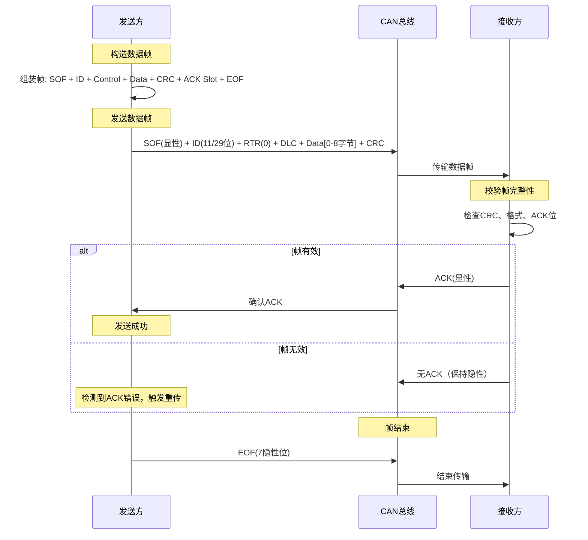
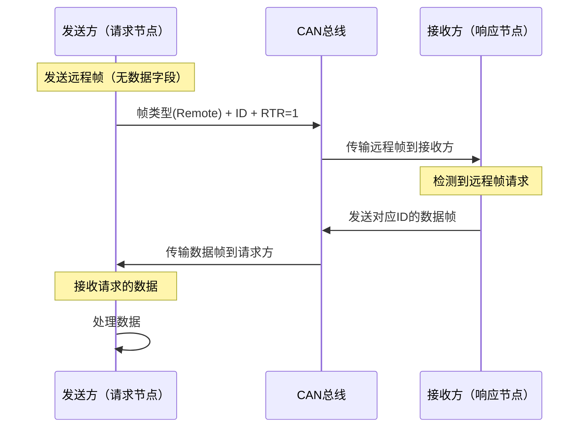
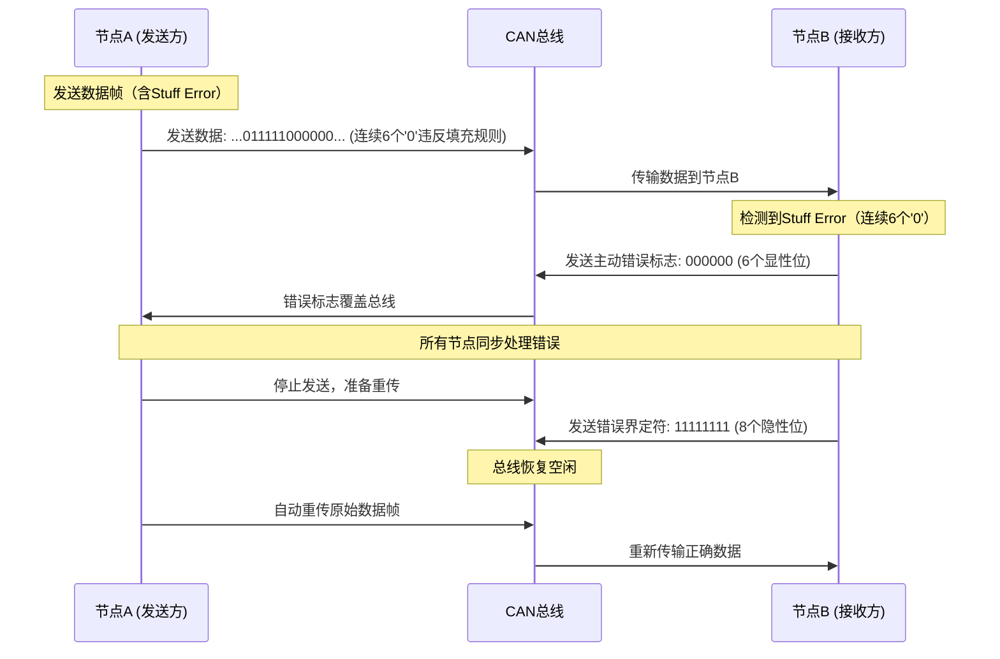
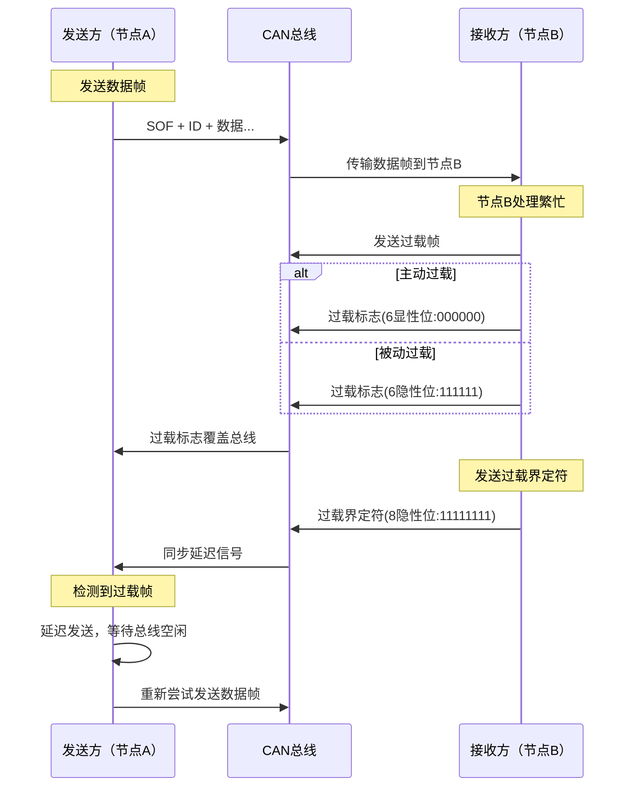
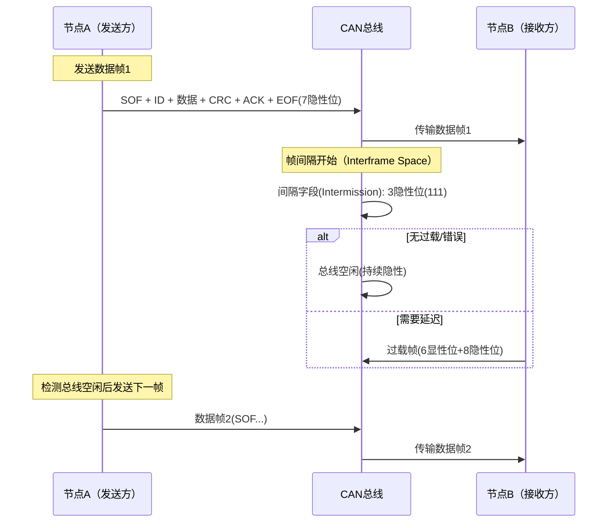
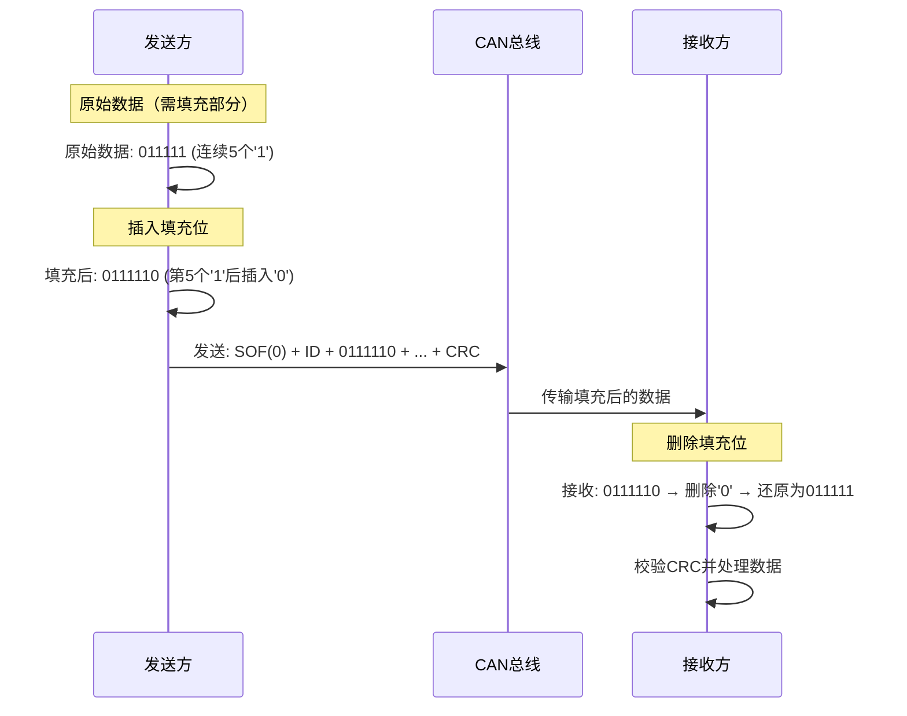

# 简介

1. CAN总线（Controller Area Network Bus）控制器局域网总线
2. CAN总线是由BOSCH公司开发的一种简洁易用、传输速度快、易扩展、可靠性高的串行通信总线，广泛应用于汽车、嵌入式、工业控制等领域
3. CAN总线特征：

   - 两根通信线（CAN_H、CAN_L），线路少，无需共地
   - 差分信号通信，抗干扰能力强
   - 高速CAN（ISO11898）：125k~1Mbps, <40m
   - 低速CAN（ISO11519）：10k~125kbps, <1km
   - 异步，无需时钟线，通信速率由设备各自约定
   - 半双工，可挂载多设备，多设备同时发送数据时通过仲裁判断先后顺序
   - 11位/29位报文ID，用于区分消息功能，同时决定优先级
   - 可配置1~8字节的有效载荷
   - 可实现广播式和请求式两种传输方式
   - 应答、CRC校验、位填充、位同步、错误处理等特性

# 主流通信协议对比

| **名称** | **引脚**      | **双工** | **时钟** | **电平** | **设备** | **应用场景**           |
| -------------- | ------------------- | -------------- | -------------- | -------------- | -------------- | ---------------------------- |
| UART           | TX、RX              | 全双工         | 异步           | 单端           | 点对点         | 两个设备互相通信             |
| I2C            | SCL、SDA            | 半双工         | 同步           | 单端           | 多设备         | 一个主控外挂多个模块         |
| SPI            | SCK、MOSI、MISO、SS | 全双工         | 同步           | 单端           | 多设备         | 一个主控外挂多个模块（高速） |
| CAN            | CAN_H、CAN_L        | 半双工         | 异步           | 差分           | 多设备         | 多个主控互相通信             |

# 硬件电路

- 每个设备通过CAN收发器挂载在CAN总线网络上
- CAN控制器引出的TX和RX与CAN收发器相连，CAN收发器引出的CAN_H和CAN_L分别与总线的CAN_H和CAN_L相连
- 高速CAN使用闭环网络，CAN_H和CAN_L两端添加120Ω的终端电阻

  > [!tip]
  >
  > 增加电阻的作用有两个:
  >
  > 1. 一是防止回波反射
  > 2. 二是在没有设备进行操作的时候，将两根差分线的电压收紧，使其电压一致
  >
  > 如果想要了解原理，需要查看收发器的内部电路。
  >
- 低速CAN使用开环网络，CAN_H和CAN_L其中一端添加2.2kΩ的终端电阻

  

## CAN收发器

这里以TJA1050（高速CAN）为例：

- 接收端

  如果CANH和CANL之间有电压差，则Receiver就输出1，否则就输出0

  当Receiver输出为1时，上管断开，下管导通，输出0。输出为0时，上管导通，下管断开，输出1。RXD为输入部分
- 发送端通过两个三级管来控制输出的电压差，当TXD为0时，上面的三极管将CANH线的电平拉高，下面的三极管将CANL线的电平拉低，出现电压差，显示为0

其中的两个电阻为中拉电阻，通过两个电阻，可以将CANH和CANL两根线都拉到0.5倍VCC的中间电平，使CANH和CANL的默认对地电压都是2.5v左右，同时，这两个电阻还有一定的收紧作用，但是由于阻值较大，所以收紧电压一般都使用外部的电阻来实现 。

## CAN物理层

- CAN总线采用差分信号，即两线电压差（VCAN_H-VCAN_L）传输数据位
- 高速CAN规定：

    电压差为0V时表示逻辑1（隐性电平，总线收紧状态）

    电压差为2V时表示逻辑0（显性电平，总线张开状态）

- 低速CAN规定：（电压有压降，所以拉大了两个信号线的电压差）

    电压差为-1.5V时表示逻辑1（隐性电平）

    电压差为3V时表示逻辑0（显性电平）

高速CAN，总线回归隐性电平快，传输速度就会快，低速CAN总线回归隐性电平慢，传输速度就会慢。

# 总线帧格式

CAN协议规定了以下5种类型的帧：

| **帧类型** | **用途**                         |
| ---------------- | -------------------------------------- |
| 数据帧           | 发送设备主动发送数据（广播式）         |
| 遥控帧           | 接收设备主动请求数据（请求式）         |
| 错误帧           | 某个设备检测出错误时向其他设备通知错误 |
| 过载帧           | 接收设备通知其尚未做好接收准备         |
| 帧间隔           | 用于将数据帧及遥控帧与前面的帧分离开   |

## 帧结构

一帧Can报文的组成如下：

1. 帧起始
   1. SOF（Start of Frame）：帧起始，表示后面一段波形为传输的数据位，**为0的时候表示帧开始**
2. 仲裁段
   1. ID（Identify）：标识符，区分功能，同时决定优先级
   2. RTR（Remote Transmission Request ）：远程请求位，区分数据帧和遥控帧
3. 控制段
   1. IDE（Identifier Extension）：扩展标志位，区分标准格式和扩展格式，标准格式为0，扩展格式为1
   2. SRR（Substitute Remote Request）：替代RTR，协议升级时留下的无意义位
   3. r0/r1（Reserve）：保留位，为后续协议升级留下空间
4. 数据段
   1. DLC（Data Length Code）：数据长度，指示数据段有几个字节
   2. Data：数据段的1~8个字节有效数据
5. CRC 段
   1. CRC（Cyclic Redundancy Check）：循环冗余校验，校验数据是否正确
   2. CRC界定符：为应答位前后发送方和接收方释放总线留下时间
6. ACK段
   1. ACK（Acknowledgement）：应答位，判断数据有没有被接收方接收
   2. ACK界定符：为应答位前后发送方和接收方释放总线留下时间
7. 帧结束
   1. EOF（End of Frame ）：帧结束，表示数据位已经传输完毕，**出现7个1表示帧结束**

## 数据帧

在发送数据之前，总线必须要为空闲状态，空闲状态时，总线是隐性电平（1），当开始发送数据帧时，首位必须要为显性电平0（SOF）。随后是报文ID，一般为11位。之后发送RTR，RTR必须要为0，用于区分数据帧（0）还是遥控帧（1）。后面按照图片进行控制。

> [!tip]
>
> 灰色方块表示只能发送0，白的方块表示只能发送1，紫色的方块表示既能发送0也能发送1。其中的数字为位数。

数据交互过程如下：

## 遥控帧

**遥控帧无数据段，RTR为隐性电平1，其他部分与数据帧相同**

CAN总线的数据主要靠发送方自觉广播出来的，一般发送方会定一个周期，定时广播自己的数据，但如果发送方没有及时发送自己的数据，或者这个数据的使用频率太低了，广播太频繁了，用不到就会浪费总线资源，广播太慢了，偶尔有用的话，有不能及时拿到。此时就可以规定，发送方不要主动广播数据，而是设备有需要的话，首先接收方发出一个遥控帧，遥控帧包含报文ID，遥控帧也是通过广播出来的，每个设备都能收到遥控帧，如果其中某个设备有这个ID的数据，就会通过数据帧广播出来，这样接收方就可以及时获取这个数据了

数据交互过程如下：

## 错误帧

在CAN（Controller Area Network）总线上，共定义了5种类型的错误：

1. 位错误（Bit Error）
2. **产生条件**：节点在发送位（显性0或隐性1）的同时，检测到总线上的实际电平与发送的不一致（仲裁阶段除外）。
3. **常见原因**：
   - 总线短路或开路导致电平异常。
   - 电磁干扰（EMI）造成信号畸变。
   - 节点硬件故障（如收发器损坏）。
4. 填充错误（Stuff Error）
   1. **产生条件**：  在CAN帧的帧起始、仲裁场、控制场、数据场和CRC序列中，出现连续**6个相同极性**的位，违反位填充规则（每5个相同位后必须插入一个反极性位）。
   2. **常见原因**：
      - 节点发送逻辑错误，未正确插入填充位。
      - 总线干扰导致电平持续不变（如长时间显性电平）。
5. CRC错误（CRC Error）
   1. **产生条件**：接收节点计算的CRC校验值与帧中的CRC序列不匹配。
   2. **常见原因**：
      - 数据传输过程中因噪声或干扰导致位翻转。
      - 发送节点CRC计算错误（罕见，通常为硬件故障）。
      - 波特率不匹配导致采样点偏移。
6. 格式错误（Form Error）
   1. **产生条件**：检测到与固定格式字段不符的位模式（如帧结束、ACK间隙、CRC分隔符等位置出现非法电平）。
   2. **常见原因**：
      - 节点未正确遵循CAN帧格式（如ACK间隙应为隐性位但检测到显性位）。
      - 总线竞争异常或节点同步失败。
7. ACK错误（Acknowledgment Error）
   1. **产生条件**： 发送节点在ACK间隙（ACK Slot）未检测到至少一个其他节点发出的显性位（表示无节点成功接收）。
   2. **常见原因**：
      - 总线上无其他正常工作的接收节点。
      - 所有接收节点均因错误（如CRC错误）未发送ACK。
      - 总线断开或终端电阻缺失导致信号反射。

总线上所有设备都会监督总线的数据，一旦发现以上错误 ，这些设备便会发出错误帧来破坏数据，同时终止当前的发送设备。发现数据帧数据有错，所以破坏了该数据帧，是一种错误处理机制

- 主动错误
  - 发了6个0表示主动错误，中间有0到6位的延长时间，是错误标志的重叠部分。之后发送错误界定符，也就是8个1
- 被动错误
  - 发了6个1表示被动错误，之后发送错误界定符，也就是8个1

以下展示了出现了stuff error时，发送方和接收方的交互过程

## 过载帧

当接收方收到大量数据而无法处理时，其可以发出过载帧，延缓发送方的数据发送，以平衡总线负载，避免数据丢失

**发送方发送数据太快，接受方处理不了，由接收方产生**

数据交互过程如下：

## 帧间隔

将数据帧和遥控帧与前面的帧分离开

数据交互过程如下：

# 数据采样

- CAN总线没有时钟线，总线上的所有设备通过约定波特率的方式确定每一个数据位的时长
- 发送方以约定的位时长每隔固定时间输出一个数据位
- 接收方以约定的位时长每隔固定时间采样总线的电平，输入一个数据位
- 理想状态下，接收方能依次采样到发送方发出的每个数据位，且采样点位于数据位中心附近

## 位时序

为了灵活调整每个采样点的位置，使采样点对齐数据位中心附近，CAN总线对**每一个数据位的时长进行了更细的划分**，分为同步段（SS）、传播时间段（PTS）、相位缓冲段1（PBS1）和相位缓冲段2（PBS2），每个段又由若干个最小时间单位（Tq，Time Quantum）构成

其中，Tq的时间是自己指定的，如可以指定1Tq=0.5us

- SS段为同步段，如果数据跳变沿正好出现在SS段，则说明当前设备与波形达成同步，如果当前跳变沿不在SS段，则需要调整当前设备的位时序，使跳变沿正好出现在同步段，也就是采用硬同步和再同步手段，使得跳变沿再次出现在SS段
- PTS段为传播时间段，PTS用于吸收网络上的物理延迟，网络的物理延迟指定发送单元的输出延迟，总线上信号的传播延迟、接收单元的输入延迟。PTS的时间为以上各延迟时间的和的两倍。控制器想发信号，由于硬件电路的限制，这个信号输出到总线，总会有延迟，所以设计该段。也就是说当开始发送数据时，SS结束后要稍微等一等，等待传播的延迟。
- PBS1和PBS2为相位缓冲段，其作用为确定采样点的位置，**采样点会在PBS1和PBS2中间**，所以调节PBS1和PBS2的时间长短就可以条件采样位置

采样点的计算公式为：

$$
采样点=\frac{SS+PTS+PBS1}{SS+PTS+PSB1+PSB2} \times 100\%
$$

> [!tip]
>
> 有些厂商会将PTS和PBS1合并

## 采样问题

采样指的是对于数据的读取，使用固定时间间隔对数据进行采样。

- 接收方以约定的位时长进行采样，但是采样点没有对齐数据位中心附近，假设每次采样的时候都会采到数据的跳变，这时就不知道采样采的是0还是1了
- 接收方刚开始采样正确，但是时钟有误差，随着误差积累，采样点逐渐偏离

> [!tip]
>
> 只有在位数据出现跳变（如0变为1）的时候才会触发同步，如果相邻的多位数据如果都是同一电平，那么数据采样就靠本地时钟来维持位时间

### 硬同步

- 每个设备都有一个位时序计时周期，当某个设备（发送方）率先发送报文，其他所有设备（接收方）收到SOF的下降沿时，接收方会将自己的位时序计时周期拨到SS段的位置，与发送方的位时序计时周期保持同步
- 硬同步只在帧的第一个下降沿（SOF下降沿）有效
- 经过硬同步后，若发送方和接收方的时钟没有误差，则后续所有数据位的采样点必然都会对齐数据位中心附近

### 再同步

- 若发送方或接收方的时钟有误差，随着误差积累，数据位边沿逐渐偏离SS段，则此时接收方根据再同步补偿宽度值（SJW）通过加长PBS1段，或缩短PBS2段，以调整同步
- 再同步可以发生在第一个下降沿之后的每个数据位跳变边沿

上图是发送方信号沿快于SS，图中的红色部分就是SJW，下图是发送方信号沿慢于SS

硬同步用于一帧波形初始的位置对齐，所以硬同步更加激进一些，直接在波形边沿，把自己的秒表拨到SS段，一旦一帧波形开始，就不能再这么激进的调整同步了。所以再同步的补偿需要限定范围，一次只补偿一点，不能再多了

### 示例

要传输一个字节数据 `0x31`（二进制 `00110001`）：

- **数据字节 `0x31`** 的二进制为 `00110001`，但CAN总线按 **LSB（最低有效位）优先** 传输，因此实际线上顺序为： `10001100`（即从右到左逐位发送）。

假设配置为 **波特率500 kbps（位时间=2 μs）**，且位时间划分为：

- **Sync=1 Tq, Prop=2 Tq, Phase1=10 Tq, Phase2=3 Tq**（总16 Tq，采样点=13 Tq，即81.25%位时间）。
- **Tq长度**：若时钟源为16 MHz，分频因子BRP=3，则 𝑇𝑞=416 MHz=250 ns*Tq*=16MHz4=250ns。

以数据位 `10001100` 为例，每个位的时序行为如下（示波器视图）：

| 位序 | 位值 | 总线电平             | 关键时间点（示例）                           |
| ---- | ---- | -------------------- | -------------------------------------------- |
| 1    | 1    | 隐性（CAN_H≈CAN_L） | 从SOF下降沿开始，持续2 μs隐性电平。         |
| 2    | 0    | 显性（CAN_H>CAN_L）  | 隐性→显性跳变，触发重同步（若边沿未对齐）。 |
| 3    | 0    | 显性                 | 持续显性，无跳变沿。                         |
| 4    | 0    | 显性                 | 持续显性，无跳变沿。                         |
| 5    | 1    | 隐性                 | 显性→隐性跳变，可能触发重同步。             |
| 6    | 1    | 隐性                 | 持续隐性，无跳变沿。                         |
| 7    | 0    | 显性                 | 隐性→显性跳变，触发重同步。                 |
| 8    | 0    | 显性                 | 持续显性，无跳变沿。                         |

==同步与跳变沿==

- **SOF（帧起始）**：显性下降沿强制所有节点硬同步，位计数器归零。
- 数据位跳变：
  - 隐性→显性跳变（如第2、7位）：可能触发重同步（若跳变沿不在Sync段）。
  - 显性→隐性跳变（如第5位）：同样可能触发重同步。
- **无跳变位**（如连续显性或隐性）：节点依赖本地时钟维持位时间。

==采样时刻==

每个位的采样点固定在 **13 Tq（1.625 μs）** 处：

- **显性位**（如第2位）：在1.625 μs处采样到显性电平（逻辑0）。
- **隐性位**（如第1位）：在1.625 μs处采样到隐性电平（逻辑1）。

==重同步调整==

若跳变沿出现在Phase1或Phase2内：

- **Phase1内跳变**：延长Phase1（最多SJW个Tq），推迟采样点。
- **Phase2内跳变**：缩短Phase2（最多SJW个Tq），调整下一位起始。

## 波特率计算

波特率的单位为 `bps`，位时长为 `s`

$$
波特率 = \frac {1} {一个数据位的时长} = \frac {1} {TSS + TPTS + TPBS1 + TPBS2}
$$

例如：

$$
SS = 1Tq，PTS = 3Tq，PBS1 = 3Tq，PBS2 = 3Tq \\

 Tq = 0.5us\\

 波特率 = \frac{1} {0.5us + 1.5us + 1.5us + 1.5us}=0.2 \times 10^6 bps= 200kbps
$$

> [!note]
>
> 波特率表示的是单位时间内传输的码元的数量。（这里的码元可以是二进制、也可以是四相调制）

## 位填充

位填充规则：发送方每发送5个相同电平后，自动追加一个相反电平的填充位，接收方检测到填充位时，会自动移除填充位，恢复原始数据

例如：

    即将发送：     100000110     10000011110          0111111111110

    实际发送：     100000**1**110   100000**1**1111**0**0     011111**0**11111**0**10

    实际接收：     100000**1**110   100000**1**1111**0**0     011111**0**11111**0**10

    移除填充后： 100000110     10000011110          0111111111110

> [!tip]
>
> 位填充作用：
>
> - 增加波形的定时信息，利于接收方执行“再同步”，防止波形长时间无变化，导致接收方不能精确掌握数据采样时机
> - 将正常数据流与“错误帧”和“过载帧”区分开，标志“错误帧”和“过载帧”的特异性
> - 保持CAN总线在发送正常数据流时的活跃状态，防止被误认为总线空闲

数据交互过程如下：

# 总线的资源分配规则

## 多设备同时发送所遇到的问题

- CAN总线只有一对差分信号线，同一时间只能有一个设备操作总线发送数据，若多个设备同时有发送需求，该如何分配总线资源？
- 解决问题的思路：制定资源分配规则，依次满足多个设备的发送需求，确保同一时间只有一个设备操作总线

现假设两个设备想要同时发送数据，有以下两种情况：

1. 一个波形正在发送，另外一个想要发送
2. 多个波形在同一起始段都想要发送数据

## 问题1解决方案-先占先得

- 若当前已经有设备正在操作总线发送数据帧/遥控帧，则其他任何设备不能再同时发送数据帧/遥控帧（可以发送错误帧/过载帧破坏当前数据）
- 任何设备检测到连续11个隐性电平，即认为总线空闲，只有在总线空闲时，设备才能发送数据帧/遥控帧
- 一旦有设备正在发送数据帧/遥控帧，总线就会变为活跃状态，必然不会出现连续11个隐性电平，其他设备自然也不会破坏当前发送
- 若总线活跃状态其他设备有发送需求，则需要等待总线变为空闲，才能执行发送需求

## 问题2解决方案-非破坏性仲裁

- 若多个设备的发送需求同时到来或因等待而同时到来，则CAN总线协议会根据ID号（仲裁段）进行非破坏性仲裁，ID号小的（优先级高）取到总线控制权，ID号大的（优先级低）仲裁失利后将转入接收状态，等待下一次总线空闲时再尝试发送
- 实现非破坏性仲裁需要两个要求：
  - 线与特性：总线上任何一个设备发送显性电平0时，总线就会呈现显性电平0状态，只有当所有设备都发送隐性电平1时，总线才呈现隐性电平1状态，即：0 & X & X = 0，1 & 1 & 1 = 1
  - 回读机制：每个设备发出一个数据位后，都会读回总线当前的电平状态，以确认自己发出的电平是否被真实的发送出去了，根据线与特性，发出0读回必然是0，发出1读回不一定是1

### 非破坏性仲裁过程

数据位从前到后依次比较，出现差异且数据位为1的设备仲裁失利

单元1和单元2代表的是两个设备，根据线与特性，总线显示为空闲状态，所以此时单元1和单元2同时向总线发送请求，也就是同时发送SOF（0），两个单元同时回读，此时总线电平呈现0状态，单元1和单元2会继续同时向总线发送且回读，如果发送的和回读的不一样，代表仲裁失利，从下一位开始转为接收状态工作。

## 数据帧和遥控帧的优先级

数据帧和遥控帧ID号一样时，数据帧的优先级高于遥控帧

## 标准格式和扩展格式的优先级

标准格式的优先级高于扩展格式（SRR必须始终为1，以保证此要求）

# 错误处理

## 错误类型

错误共有5种： 位错误、填充错误、CRC错误、格式错误、应答错误

## 错误状态

- 每个设备内部管理一个TEC和REC，根据TEC和REC的值确定自己的状态
- 主动错误状态的设备正常参与通信并在检测到错误时发出主动错误标志
- 被动错误状态的设备正常参与通信但检测到错误时只能发出被动错误标志
- 总线关闭状态的设备不能参与通信

## 错误计数器

对于接收的错误较为宽容

## Busoff

### 概述

> **什么是Can Bus Off**
>
> 车上有一个ECU 1, 一直向总线发送消息，可怎么都发送不出去。
>
> 如果这个累计到一定的次数（255），按照CAN总线协议： ECU 1自己进入 BUSOFF模式，这个时候ECU 1 一时半会是不能发送信息了。

> **BusOff 后如何处理**
>
> ECU 1在自己内部检测到BUS OFF后，默默的从逻辑上退出了总线，暂时他没妨碍大家，ECU 1他自己也搞不明白啥回事，于是ECU 1拿着小本子，记下了 x年x月x日x时x分x秒, 汽车电压，里程，xxx 是多少多少，我bus off 了。
>
> 写完备案后，ECU 1 开始数时间，等待 5 秒后，重启自己的CAN模块

> **BusOff时计数的变化规律**
>
> bus off是个非常集体的概念：
>
> - ECU自己发送失败，TX error count + 8，
> - ECU自己发送成功，TX error count - 1，
>
> 这个TX error count 超过255，ECU就必须进入Bus Off 状态，并需要逻辑上断开总线

> **Can Frame的一些常见错误**
>
> 1. 发送ECU检查
>    - 有无ACK
>    - CRC检查，CRC Delimiter, ACK Delimiter，EOF等
>    - BIT监控， 送的那个ECU，自己校对每个BIT，看有没有都送对（ID区域，和ACK区域除外）
> 2. 接收ECU检查
>    - CRC检查，CRC Delimiter, ACK Delimiter，EOF等
>    - 检查有无连续6比特是全0、或全1的

### 故障界定

为了避免某个设备因为自身原因（例如硬件损坏）导致无法正确收发报文而不断的破坏总线的数据帧，从而影响其它正常节点通信，CAN网络具有严格的错误诊断功能，CAN通用规范中规定每个CAN控制器中有一个发送错误计数器和一个接收错误计数器。根据计数值不同，节点会处于不同的错误状态，并根据计数值的变化进行状态转换，状态转换如下图所示。

以上三种错误状态表示发生故障的严重程度，总线关闭是节点最严重的错误状态。并且，节点在不同的状态下具有不同的特性，在总线关闭状态下，节点不能发送报文或应答总线上的报文，也就意味着不能再对总线有任何影响。

状态跳转和错误计数的规则使得节点在发生通信故障时有了较好的自我错误处理和恢复机制，从一种较严重的错误状态跳转到另一种严重性相对较低的状态，本质上就是一种恢复过程。上图所呈现的转换过程是CAN通用规范所要求的，我们从设备供应商买回来的CAN控制器已经把这些功能固化在硅片之中。

在通信过程中，错误主动和错误被动两种状态下节点的恢复过程一般不需要MCU进行额外的编程处理，直接使用CAN控制器固有功能即可。但对于总线关闭状态，往往不直接使用CAN控制器固有的恢复过程，而是对其进行编程控制，以实现“快恢复”和“慢恢复”机制。

### 快恢复和慢恢复

当节点进入总线关闭状态后，如果MCU仅是开启自动恢复功能，CAN控制器在检测到128次11个连续的隐性位后即可恢复通信，在实际的CAN通信总线中，这一条件是很容易达到的。以125K的波特率为例，12811（1/125000）= 0.011264s。这意味着如果节点所在的CAN总线的帧间隔时间大于0.011264s，节点在总线空闲时间内便可轻易恢复通信。我们已经知道，当进入总线关闭状态时，节点已经发生了严重的错误，处于不可信状态，如果迅速恢复参与总线通信，具有较高的风险，因此，在实际的应用中，往往会通过MCU对CAN控制器总线关闭状态的恢复过程进行编程处理，以控制节点从总线关闭状态恢复到错误主动状态的等待时间，达到既提高灵活性又保证节点在功能上的快速响应性的目的。具体包括“快恢复”和“慢恢复”策略，两种策略一般同时应用。

通过以上的讨论，我们可以知道，节点进入总线关闭状态后，存在以下几种恢复情况：

1. MCU仅开启CAN控制器的自动恢复功能，节点只需检测到128次11个连续的隐性位便可以恢复通信，恢复过程如[上节图](##故障界定)所示。
2. MCU没有开启CAN控制器的自动恢复功能，也不主动干预总线关闭错误，节点将一直无法“自动”恢复总线通信，只能通过重新上电的方式使节点恢复, 恢复过程如下图所示。

   
3. MCU对CAN控制器的恢复过程进行编程处理，这时，节点的恢复行为由具体的编程逻辑决定，各厂家普遍采用了先“快恢复”后“慢恢复”的恢复策略，恢复过程如下图所示。

   

MCU编程实现总线关闭“快恢复”和“慢恢复”的一般过程可用以下流程图描述：

节点以正常发送模式发送报文的过程中，如果出现了发送错误，发送错误计数会增加，只要发送错误计数没有超过255， CAN控制器便会自动重发报文，如果出现多次发送错误，使发送错误计数累加超过255，则节点跳转为总线关闭状态。MCU能够第一时间知道节点进入了总线关闭状态（例如在错误中断处理逻辑中查询状态寄存器的相应位），这时MCU控制CAN控制器进入“快恢复”过程，即控制CAN控制器停止报文收发，并进行等待，计时达到需要的时间T1（如100ms）后，MCU重新启动恢复CAN控制器参与总线通信，这样便完成了一次“快恢复”过程。

节点每进入一次“快恢复”过程时，MCU会对此进行计数，当节点“快恢复”计数达到设定的值N（如5次），则后续再次进入总线关闭状态时MCU把恢复总线通信的等待时间T2进行延长（如1000ms），这样便实现了“慢恢复”过程。“快恢复”和“慢恢复”过程的主要区别就在于恢复节点参与总线通信的等待时间的不同。

通过MCU对于总线关闭后的恢复行为进行编程控制，实际上是对CAN控制器的错误管理和恢复机制进行了补充，使得总线关闭状态后的恢复过程更加灵活，更能适应实际应用的需要。对于 “快恢复”和“慢恢复”的等待时间，以及“快恢复”计数多少次后进入“慢恢复”过程，不同厂家可根据具体的需求进行编程实现。

> [!note]
>
> 当我们进行干扰的时候，不用Rx口就可以知道数据帧发送是否正确，以下使用Ack干扰来举例：
>
> CAN总线采用"线与"逻辑，发送节点在ACK槽（ACK Slot）发送隐性位（逻辑1），而正确接收的节点会覆盖为显性位（逻辑0）。发送节点通过**实时回读总线电平**与自身发送的电平对比：
>
> - 成功应答：若回读到显性位（0），说明至少有一个节点正确接收。
> - 应答错误：若回读到隐性位（1），说明无节点应答，触发ACK错误。
>
> 此过程由CAN控制器硬件自动完成，无需软件干预。发送节点在TX发送的同时通过内部回环检测总线实际状态，而非依赖RX口 。
>
> 问题：不走Rx是怎么知道发出去的报文是正确的‼‼‼‼‼‼‼‼

# 控制器

## 简介

- STM32内置bxCAN外设（CAN控制器），支持CAN2.0A和2.0B，可以自动发送CAN报文和按照过滤器自动接收指定CAN报文，程序只需处理报文数据而无需关注总线的电平细节
- 波特率最高可达1兆位/秒
- 3个可配置优先级的发送邮箱
- 2个3级深度的接收FIFO
- 14个过滤器组（互联型28个）：用于过滤总线上不需要的报文（通过id）
- 时间触发通信、自动离线恢复、
- 自动唤醒、禁止自动重传、
- 接收FIFO溢出处理方式可配置、
- 发送优先级可配置、双CAN模式
- STM32F103C8T6 CAN资源：CAN1

## 网络拓扑结构

CAN的控制器在MCU中，而收发器在外部属于外设，CAN控制器将会引出两个引脚，CAN的发送和CAN的接收，CAN的收发器将会将收到的Rx或Tx的数据转换成差分数据，也就是这里的CAN High和CAN Low

CAN收发器原理图：

对MCU端的接口为TX、RX、VCC和GND，对外接口为CANH和CANL

## 内部设计

CAN2辅助CAN1工作，共同管理同一个CAN总线

*`主发送`邮箱*：每个邮箱存一个CAN报文，如果想要发出一个CAN报文，那就需要将这个报文写入道其中的一个空置邮箱中，之后设置寄存器请求发送就行了，其余的如位同步、仲裁等等都靠硬件电路自动实现就好

*`接受`滤波器*：当接收到一个报文时，首先需要经过接收过滤器，无论收到遥控帧还是远程帧，CAN硬件电路都会将该帧报文缓存下来，之后再传输进入过滤器。过滤器内可以设置过滤规则，告诉硬件想要指定的ID的报文

*`主接收`FIFO*：当一个报文通过过滤器时，就可以进入主接受FIFO（由邮箱组成）

1. MCU对外提供CAN_TX和CAN_RX，而引脚内部就需要配置相关的GPIO：

   - CAN_TX是输出，引脚控制权在CAN外设，所以需要将引脚配置为复用推挽输出模式
   - CAN_RX是输入，可以配置为上拉输入
2. 从GPIO进入之后，将会由发送和接收控制器全权控制

   - 当我们想要发送数据时，只需要将需要发送的数据写入发送邮箱中，发送和接收控制器会自动帮我们发送报文。并且发送时，可以配置发送模式，比如按照发送ID的优先级发送或者按照FIFO模式发送
   - 当我们想要接收数据时，发送和接收控制器会匹配过滤器，如果符合要求将会自动存入邮箱中，不需要人为的干涉

## 基本过程

### 发送过程

邮箱有以下描述：

- RQCP：请求完成
- TXOK：发送成功
- TME：发送邮箱空
- TXRQ：发送请求控制位
- ABRQ：中止发送
- NART：自动重传

发送流程详述：

1. 空置状态下，等待被填充数据，当有一个发送请求时，将会转到挂号状态
2. 挂号状态表示此邮箱的数据已准备好了，但是邮箱有三个，可能别的邮箱也有数据已经准备好了，所以该邮箱需要排队，如果邮箱已经时最高优先级了，那么就表明下一次发送就轮到该邮箱了，邮箱立马进入预定状态
3. 在预定状态下，等待总线为空闲，如果为空闲，就正式进入发送状态
4. 在正式发送状态时，成功则转到空置且发送成功状态，如果使用自动重传（NART=0）则返回预定状态，否则返回空置且发送未完成状态。

### 接收过程

状态有以下描述：

- FMP：报文数量
- FOVR：FIFO溢出
- FULL：FIFO存满
- RFOM：释放FIFO

接收到一个报文→匹配过滤器后进入FIFO 0或FIFO 1→CPU读取

1. 在初始状态下，当收到有效报文时，进入挂号1状态，报文数量为1（0x01）
2. 当进入挂号1状态时，收到有效报文，进入状态2，此时报文数量为2（0x02，==下图写错了==）
3. 当进入挂号状态2时，收到有效报文，进入状态3，此时报文数量为3（0x03）
4. 当进入挂号状态3时，收到有效报文，进入溢出状态，此时FIFO溢出标志位设为1
5. 当读取数据时，就会释放邮箱，一级一级回到挂号及空状态

> [!NOTE]
>
> 发送和接收配置位：
>
> - NART：置1，关闭自动重传，CAN报文只被发送1次，不管发送的结果如何（成功、出错或仲裁丢失）；置0，自动重传，CAN硬件在发送报文失败时会一直自动重传直到发送成功
> - TXFP：置1，优先级由发送请求的顺序来决定，先请求的先发送；置0，优先级由报文标识符来决定，标识符值小的先发送（标识符值相等时，邮箱号小的报文先发送）
> - RFLM：置1，接收FIFO锁定，FIFO溢出时，新收到的报文会被丢弃；置0，禁用FIFO锁定，FIFO溢出时，FIFO中最后收到的报文被新报文覆盖

### 过滤器

标识符过滤器：

==每个==过滤器的核心由两个32位寄存器组成：R1[31:0]和R2[31:0]

- FSCx：位宽设置，置0，16位；置1，32位
- FBMx：模式设置，置0，屏蔽模式；置1，列表模式
- FFAx：关联设置，置0，FIFO 0；置1，FIFO 1
- FACTx：激活设置， 置0，禁用；置1，启用

  > 其中x可以为0-13
  >

过滤的配置有：

- 让指定ID通过（标识符列表）
- 让指定组ID（组ID有着相同的数据段）通过（标识符屏蔽）

根据FSC和FBM两位的配置，过滤器可以工作在4中状态下：

- 如果FSC=1，FBM=0，那么就工作在图中的第一行的状态下
- 如果FSC=1，FBM=1，那么就工作在图中的第二行的状态下
- 如果FSC=0，FBM=0，那么就工作在图中的第三行的状态下
- 如果FSC=0，FBM=1，那么就工作在图中的第四行的状态下

> 标识符列表模式：
>
>> 对于2个32位过滤器而言，用户可以写入两个目标ID，R1和R2中都包含数据
>>
>> 当收到一个报文时，就和R1和R2中的ID做比对，如果相同就通过过滤器，否则则舍弃
>>
>> 在存储映像中，32位寄存器的高11位存标准格式的ID号，后面的18位存的是拓展格式的ID号
>>
>> 如果想要区分拓展ID还是标准ID就需要看后面的IDE的数据位（置1为拓展ID，置0为标准ID）
>>
>> 如果想要区分遥控帧，就需要控制RTR位，RTR为是遥控帧标识位，写0就过滤数据帧，写1就过滤遥控帧
>>
>
>> 而对于4个16位过滤器而言，只过滤标准格式的ID就可以使用FSC=0，此时的长度为16位，那么一个过滤器就可以写入4个目标ID
>>

> 标识符屏蔽模式
>
>> 对于1个32过滤器而言，用户可以设置需要屏蔽的ID（R1）和相应的掩码（R2）
>>
>> 假设现在需求是过滤出以0x01开头的所有标准ID号
>>
>>> 那么ID号应该为001 xxxxxxx
>>>
>>> 在R1中就可以填001 00000（当然，后面是任意填的，不是0填充也行）
>>>
>>> 在掩码中，位为1表示必须匹配，位为0表示不需要匹配
>>>
>>> 那么为了解决需求，则需要给R2设置为111 00000000（高三位为1表示必须匹配，低位为0表示可以为任意数）
>>>
>>

过滤器示例：

| 总线上存在的ID                                                         | 想要接收的ID                     | 过滤器模式 | R1[31:0]配置值                                                     | R2[31:0]配置值                                                     |
| ---------------------------------------------------------------------- | -------------------------------- | ---------- | ------------------------------------------------------------------ | ------------------------------------------------------------------ |
| 0x123, 0x234, 0x345, 0x456,  0x567, 0x678                    | 0x234, 0x345,  0x567   | 16位/列表  | ID: R1[15:0]=0x234<<5 ID: R1[31:16]=0x345<<5                  | ID: R2[15:0]=0x567<<5 ID: R2[31:16]=0x000<<5                  |
| 0x100~0x1FF, 0x200~0x2FF,  0x310~0x31F,   0x320~0x32F | 0x200~0x2FF,   0x320~0x32F | 16位/屏蔽  | ID: R1[15:0]=0x200<<5 Mask: R1[31:16]=  (0x700<<5)\|0x10\|0x8 | ID: R2[15:0]=0x320<<5 Mask: R2[31:16]=  (0x7F0<<5)\|0x10\|0x8 |
| 0x123, 0x234,  0x345, 0x456,  0x12345678,  0x0789ABCD   | 0x123, 0x12345678           | 32位/列表  | ID: R1[31:0]=  0x123<<21                                           | ID: R2[31:0]=  (0x12345678<<3)\|0x4                                |
| 0x12345600~  0x123456FF,  0x0789AB00~  0x0789ABFF                 | 0x12345600~ 0x123456FF      | 32位/屏蔽  | ID: R1[31:0]=  (0x12345600<<3)\|0x4                                | Mask: R2[31:0]=  (0x1FFFFF00<<3)\|0x4\|0x2                         |
| 任意ID                                                                 | 只要遥控帧                       | 32位/屏蔽  | ID: R1[31:0]=0x2                                                   | Mask: R2[31:0]=0x2                                                 |
| 任意ID                                                                 | 所有帧                           | 32位/屏蔽  | ID: R1[31:0]=随意                                                  | Mask: R2[31:0]=0                                                   |

> [!NOTE]
>
> 注意：赋值语句默认是右对齐的，在配置过滤器时，低位是标志位，所以在进行赋值的时候需要进行左移操作，至于需要左移几位就需要看需要使用哪种报文格式了

## 测试模式

在测试模式下，发送和接收的线路在内部会进行变更

1. 静默模式：用于分析CAN总线的活动，不会对总线造成影响。发送端直接接到接收端，在这个模式下可以进行自发自收测试，还可以默默的监测CAN总线数据。

   > 如果只想看一下总线上有哪些报文，而不想输出任何电平，就可以使用静默模式
   >
2. 环回模式：用于自测试，同时发送的报文可以在CAN_TX引脚上检测到。RX引脚直接断开，且自己发送的数据，自己也可以收回来
3. 环回静默模式：用于热自测试，自测的同时不会影响CAN总线

   > 一般为了确保自己的硬件是没问题的，会使用环回静默模式，自己发送一个报文，看看自己能不能进行接收
   >

## 工作模式

1. 初始化模式：用于配置CAN外设，禁止报文的接收和发送
2. 正常模式：配置CAN外设后进入正常模式，以便正常接收和发送报文
3. 睡眠模式：低功耗，CAN外设时钟停止，可使用软件唤醒或者硬件自动唤醒
4. AWUM：置1，自动唤醒，一旦检测到CAN总线活动，硬件就自动清零SLEEP，唤醒CAN外设；置0，手动唤醒，软件清零SLEEP，唤醒CAN外设

工作状态寄存器描述：

- SLAK：睡眠确认状态位，置1后表示硬件已经确认进入睡眠模式了
- INAK：初始化确认位，置0表示硬件目前没有进入初始化模式
- SLEEP：置0后就是请求退出睡眠
- INRQ：置1后表示请求进入初始化，置0表示请求退出初始化

## 位时间特性

正常的时间分段分为：

1. 同步段：SS=1Tq
2. 时间段1：BS1=1~16Tq
3. 时间段2：BS2=1~8Tq
4. SJW=1~4Tq

> [!TIP]
>
> 注意：前面说过位时序的组成：由SS+PTS+PBS1+PBS2组成，采样点位于PBS1和PBS2之间
>
> 但是现在将PTS和PBS1合并叫BS1段，采样点位于BS1和BS2段之间

$$
波特率 =\frac{ APB1时钟频率} {分频系数 \times 一位的Tq数量}  \\= \frac{36MHz} {(BRP[9:0]+1) \times ((1 + (TS1[3:0]+1) + (TS2[2:0]+1)))}
$$

## 中断

- CAN外设占用4个专用的中断向量
- 发送中断：发送邮箱空时产生
- FIFO 0中断：收到一个报文/FIFO 0满/FIFO 0溢出时产生
- FIFO 1中断：收到一个报文/FIFO 1满/FIFO 1溢出时产生
- 状态改变错误中断：出错/唤醒/进入睡眠时产生

## 时间触发通信

- TTCM：置1，开启时间触发通信功能；置0，关闭时间触发通信功能
- CAN外设内置一个16位的计数器，用于记录时间戳
- TTCM置1后，该计数器在每个CAN位的时间自增一次，溢出后归零
- 每个发送邮箱和接收FIFO都有一个TIME[15:0]寄存器，发送帧SOF时，硬件捕获计数器值到发送邮箱的TIME寄存器，接收帧SOF时，硬件捕获计数器值到接收FIFO的TIME寄存器
- 发送邮箱可配置TGT位，捕获计数器值的同时，也把此值写入到数据帧数据段的最后两个字节，为了使用此功能，DLC必须设置为8

## 错误处理和离线恢复

- TEC和REC根据错误的情况增加或减少
- ABOM：置1，开启离线自动恢复，进入离线状态后，就自动开启恢复过程；置0，关闭离线自动恢复，软件必须先请求进入然后再退出初始化模式，随后恢复过程才被开启

