# 参考链接

[《UDS协议从入门到精通（UDS速查手册）》（完结撒花版）_obdonuds-CSDN博客](https://blog.csdn.net/qq_40309666/article/details/130831416)

[ISO 14229-1 UDS中文译版 (diag123.com)](http://www.diag123.com/202102/1710955cf07041b8bb1e1e803c00acaf.pdf)

[ISO 14229-1:2020(en), Road vehicles — Unified diagnostic services (UDS) — Part 1: Application layer](https://www.iso.org/obp/ui/en/#iso:std:iso:14229:-1:ed-3:v1:en)

[一文搞懂UDS的各种NRC – CN知EV (cnzev.com)](https://www.cnzev.com/1333.html)

# 简介

UDS (Unified Diagnostic Services) 是一种标准化的==车辆诊断协议==，广泛应用于汽车电子控制单元（ECU）的诊断和维修。它是ISO 14229标准的一部分，主要用于车辆诊断、故障排除、软件更新和其他与车辆维护相关的服务。

# UDS协议栈

UDS（Unified Diagnostic Services）协议栈是实现UDS协议功能的分层架构，确保汽车电子控制单元（ECU）与诊断工具之间的通信。UDS协议栈通常包括以下几层：

1. 应用层（Application Layer）：应用层是UDS协议栈的最高层，负责实现具体的诊断服务。它定义了各种诊断服务，如读取数据、清除故障码、重置ECU等。这一层的功能由==ISO 14229标准==规定。
2. 传输层（Transport Layer）：传输层负责数据的分段、重组和流量控制。UDS协议通常使用ISO 15765-2（CAN TP）作为其传输层协议。传输层处理较大的诊断消息，通过将它们分成较小的帧进行传输，然后在接收端重组这些帧。
3. 网络层（Network Layer）：网络层管理数据包的寻址和路由。在UDS协议中，网络层通常依赖于ISO 15765-3标准，这一标准定义了如何在CAN网络上传输诊断信息。网络层确保诊断消息能够正确到达目标ECU。
4. 数据链路层（Data Link Layer）：数据链路层负责物理网络上的数据帧传输和错误检测。在UDS协议中，数据链路层通常基于CAN（Controller Area Network）协议，由ISO 11898标准定义。数据链路层处理数据帧的发送和接收，并提供基本的错误检测和恢复机制。
5. 物理层（Physical Layer）：物理层定义了实际的硬件接口和信号传输特性。在UDS协议中，物理层通常是基于CAN总线的物理层，由ISO 11898标准定义。这一层包括信号的电气特性、连接器和传输介质（如电缆）的规范。


> [!TIP]
>
> PDU 是 "Protocol Data Unit" 的缩写，意为协议数据单元。在计算机网络和通信系统中，PDU 是在不同层次之间传输的数据单位。PDU 的概念在 OSI（Open Systems Interconnection）模型中尤为重要，每个层次都会定义自己的 PDU 格式和用途。


## UDS协议栈的实现

> 现假设诊断仪向测试ECU发送了一个0x1001的报文，该诊断仪的CAN id是0x7E0

协议栈的组成及数据包格式如下：

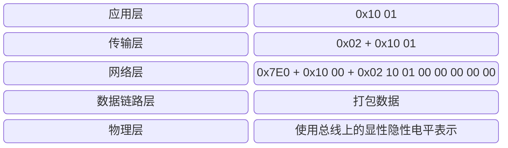
```mermaid
block-beta
columns 2
  app("应用层") appData("0x10 01")
  trans("传输层")  transData("0x02 + 0x10 01")
  net("网络层") netData("0x7E0 + 0x10 00 + 0x02 10 01 00 00 00 00 00")
  dataLink("数据链路层") linkData("打包数据") 
  phy("物理层") phyData("使用总线上的显性隐性电平表示")

```

传输层次==细节==：

*`应用`层*

   - **应用层数据**：`0x1001`

*`传输`层* 

- **数据格式**：`N_PCI` + `0x1001`
     - **N_PCI（Network Protocol Control Information）**：`0x02`，表示这是一个单帧（SF, Single Frame），并且该帧中的数据长度为 2 字节。N_PCI有以下的选择：
     - **完整的传输层数据**：`0x02 0x10 0x01`

> [!TIP]
>
> N_PCI:
>
> 1. **SF（Single Frame，单帧）：`0x0x`**
>    - 用于表示一个单帧传输，数据长度不超过 7 个字节。
>    - **N_PCI 格式**：`0x0x`，其中 `x` 表示数据的字节数（最多为 7 字节）。
>      - `0x02`：表示单帧，数据长度为 2 字节。
>      - `0x05`：表示单帧，数据长度为 5 字节。
>
> 2. **FF（First Frame，首帧）：`0x1x`**
>    - 用于表示多帧传输的首帧，当数据长度超过 7 字节时使用。
>    - **N_PCI 格式**：`0x1xxx`，其中 `xxx` 表示总的数据长度的高 12 位（最大 4095 字节）。
>      - FF 的前两个字节用于传输总的数据长度。
>      - 剩下的 6 个字节用于传输首帧中的数据。
>      - 例如，`0x10 0x12` 表示该报文的总数据长度为 18 字节（`0x12`），后面的 6 个字节是数据。
>
> 3. **CF（Consecutive Frame，连续帧）：`0x2x`**
>    - 用于在首帧之后，继续发送剩余的数据。
>    - **N_PCI 格式**：`0x2x`，其中 `x` 表示帧序号（从 1 开始，每帧递增，循环计数到 15 然后归 0）。
>      - 例如，`0x21` 表示这是第一段连续帧，`0x22` 是第二段，依此类推。
>      - CF 帧的前一个字节是帧序号，接下来的 7 个字节是数据。
>
> 4. **FC（Flow Control Frame，流控制帧）：`0x3x`**
>    - 用于控制发送方的流量，以便接收方处理数据。
>    - **N_PCI 格式**：`0x3_SS BS STmin`
>      - **SS**（流控制状态）：表示接收端的反馈状态（第一字节的低四位）
>        - `0x00`：继续发送（Clear to send, CTS）。
>        - `0x01`：等待（Wait, WAIT）。
>        - `0x02`：中止传输（Abort, ABORT）。
>      - **BS**（Block Size）：发送端可以在不等待流控制的情况下连续发送的帧数量。`0x00` 表示无限制。
>      - **STmin**（Separation Time minimum）：指示发送帧之间的最小时间间隔（以毫秒为单位）。
>
> 示例:
>
> 1. **单帧（Single Frame，SF）**：
>    - N_PCI = `0x02`，表示一个 2 字节的数据包。
>    - **数据**：假设数据为 `0x1001`，完整 N_PCI 数据为：`0x02 0x10 0x01`。
>
> 2. **首帧（First Frame，FF）**：
>    - N_PCI = `0x10 0x12`，表示该报文的数据总长度为 18 字节。
>    - **数据**：首帧中最多可传输 6 字节，剩下的数据会分多帧传输。
>
> 3. **连续帧（Consecutive Frame，CF）**：
>    - N_PCI = `0x21`，表示这是第一段连续帧。
>    - **数据**：7 字节数据从 `0x07` 开始。
>
> 4. **流控制帧（Flow Control Frame，FC）**：
>    - N_PCI = `0x30 0x00 0x05`：
>      - `0x30`：流控制帧，状态为 CTS（Clear to Send）。
>      - `0x00`：Block Size 为无限制，发送端可以连续发送。
>      - `0x05`：每个连续帧之间必须间隔至少 5 毫秒。


*`网络`层*

   - **数据**：`CAN ID + DLC + 数据`
     - **CAN ID**：`0x7E0`，表示这是诊断仪器发往 ECU 的消息。
     - **DLC（Data Length Code）**：`8`，表示数据长度为 8 个字节（尽管实际数据可能少于 8 字节，DLC 通常为 8）。
     - **数据**：`0x02 0x10 0x01 0x00 0x00 0x00 0x00 0x00`（CAN 总线允许的最大数据长度是 8 字节，短数据帧会用 `0x00` 填充）。
     - **网络层数据格式**：
       - `CAN ID = 0x7E0`
       - `DLC = 8`
       - `数据 = 0x02 0x10 0x01 0x00 0x00 0x00 0x00 0x00`

*`物理`层*

   - **电压信号**：物理层会将网络层的数据转换为电压信号，传输到 CAN 总线上。
     - 在 CAN 总线上，数据会以位级别的电压信号传输，其中 CAN 帧的每一位都通过电压变化（主导电平和隐性电平）来表示。

---

最终完整的报文传输：

| 层次   | 报文内容                                                     | 描述                                                      |
| ------ | ------------------------------------------------------------ | --------------------------------------------------------- |
| 应用层 | `0x1001`                                                     | 发送一个诊断请求，应用层负责生成具体的报文内容            |
| 传输层 | `0x02 0x10 0x01`                                             | N_PCI 表示单帧传输，数据长度为 2 字节，携带 `0x1001` 数据 |
| 网络层 | CAN ID: `0x7E0`, DLC: `8`, 数据: `0x02 0x10 0x01 0x00 0x00 0x00 0x00 0x00` | CAN 数据帧，CAN ID 为 `0x7E0`，数据为单帧格式，DLC 为 8   |
| 物理层 | 电压信号                                                     | CAN 总线上的电压变化用于物理传输数据                      |

# 两种常见的诊断协议

- OBD
- UDS

OBD和UDS是两种常见的诊断协议，它们在目标和应用领域上存在一些区别。OBD协议主要用于监测车辆的排放情况，通过读取车辆的故障码来判断是否符合排放标准。而UDS协议则更加全面和灵活，在各个ECU上是一种通用型的协议。

## OBD（On-Board Diagnostic）

主要用于跟汽车排放系统相关的ECU（电子控制单元，汽车上的板级控制器）的诊断。OBD协议分为两种：OBD-I和OBD-II。OBD-I是由美国为当时制造的加州汽车所制定的排放法规，随后这套法规被逐渐标准化，于是又提出了OBDII标准，包括：标准化的车载ECU数据诊断接口（SAE-J1962，也就是现在常说的OBD接口）、标准化的诊断解码工具（SAE-J1978）、标准化的诊断协议（ISO 9141-2、ISO 14230-4、ISO 15765-4）、标准化的故障码定义（SAE-J2012、ISO 15031-6）、标准化的维修服务指南（SAE-J2000），OBD-II在1996年开始实施，目前已经成为全球汽车行业的标准。**因此，OBD标准可以看作一系列标准的集合，是具有强制标准需要参照的，是由法规要求的，其最初目的是环保，用于汽车排放系统相关的ECU上**。

## UDS（Unified diagnostic services）

UDS（Unified Diagnostic Services）与OBD最大的区别就在于“Unified“上，是面向整车所有ECU的。单就UDS而言，它只是一个应用层协议（ISO 14229-1），不关心应用层以下的实现，比如执行该协议的应用层程序不关心通过何种物理传输方式实现与ECU硬件的通信，因此它既可以基于CAN线通信去实现，也能在Ethernet上实现。并且，UDS提供的是一个诊断服务的基本框架，定义了一系列的诊断服务和通用化的诊断流程，主机厂和零部件供应商可以根据实际情况选择实现其中的一部分或是自定义出一些私有化的诊断服务来，所以基于UDS协议的诊断又常常被称为Enhanced diagnosic（增强型诊断）。**可见，UDS不是法规要求的，没有统一实现标准，可以基于该协议提供的诊断请求及响应格式进行二次开发**。

简言之，UDS服务主要用于诊断设备Tester（Client）和ECU（Server）之间的诊断通信，诊断设备（Tester）发送诊断请求（request），ECU给出诊断响应（response），通过这种“一问一答”的形式让目标ECU执行一些期望的操作，而UDS就是为不同类型诊断功能的request和response定义了统一的内容和格式。

# 相关术语介绍

## Service ID（SID）

在UDS协议中，Service ID（SID）是指服务标识符，用于标识要执行的服务。每个服务都有一个唯一的SID，在诊断会话中通过SID来区分要执行/响应哪种服务请求。

| 服务标识符  | 服务类型（第6位）    | 定义出处       |
| ----------- | -------------------- | -------------- |
| 0x10 - 0x3E | 本标准定义的服务请求 | 本标准         |
| 0x3F        | 不适用               | 预留           |
| 0x50 - 0x7E | 本标准定义的肯定响应 | 本标准         |
| 0x7F        | 否定响应服务标识符   | 本标准         |
| 0x80-0x82   | 不适用               | 本标准预留     |
| 0x83- 0x88  | 本标准定义的服务请求 | 本标准         |
| 0x89 -0xB9  | 不适用               | 本标准预留     |
| OxBA - OxBE | 服务请求             | 系统供应商定义 |
| 0xBF - 0xC2 | 不适用               | 本标准预留     |
| 0xC3 0xC8   | 本标准定义的肯定响应 | 本标准         |
| 0xC9 - 0xF9 | 不适用               | 本标准预留     |
| 0xFA - 0xFE | 肯定响应             | 系统供应商定义 |
| 0xFF        | 不适用               | 预留           |

14229-1中定义了26种服务并将这些服务分为6大类：诊断和通信管理类、数据传输类、存储数据传输类、输入输出控制类、例程功能类、上传下载类。

| 大类             | SID (Hex) | 诊断服务名         | 服务Service                        |
| ---------------- | --------- | ------------------ | ---------------------------------- |
| 诊断和通信管理类 | 10        | 诊断会话控制       | Diagnostic Session Control         |
| :                | 11        | ECU复位            | ECU Reset                          |
| :                | 27        | 安全访问           | Security Access                    |
| :                | 28        | 通讯控制           | Comunication Control               |
| :                | 3E        | 待机握手           | Tester Present                     |
| :                | 83        | 访问时间参数       | Access Timing Parameter            |
| :                | 84        | 安全数据传输       | Secured Data Transmission          |
| :                | 85        | 控制DTC的设置      | Control DTC Setting                |
| :                | 86        | 事件响应           | Response On Event                  |
| :                | 87        | 链路控制           | Link Control                       |
| 数据传输类       | 22        | 通过ID读数据       | Read Data By Identifier            |
| :                | 23        | 通过地址读取内存   | Read Memory By Adress              |
| :                | 24        | 通过ID读比例数据   | Read Scaling Data By Identifier    |
| :                | 2A        | 通过周期ID读取数据 | Read Data By Periodic Identifier   |
| :                | 2C        | 动态定义标识符     | Dynamically Define Data Identifier |
| :                | 2E        | 通过ID写数据       | Write Data By Identifier           |
| :                | 3D        | 通过地址写内存     | Write Memory By Adress             |
| 存储数据传输类   | 14        | 清除诊断信息       | Clear Diagnostic Infomation        |
| :                | 19        | 读取故障码信息     | Read DTC Infomation                |
| 输入输出控制类   | 2F        | 通过ID控制输入输出 | Input/Output Control By Identifier |
| 例程功能类       | 31        | 例行程序控制       | Routine Control                    |
| 上传下载类       | 34        | 请求下载           | Request Download                   |
| :                | 35        | 请求上传           | Request Upload                     |
| :                | 36        | 数据传输           | Transfer Data                      |
| :                | 37        | 请求退出传输       | Request Transfer Exit              |
| :                | 38        | 请求文件传输       | Request File Transfer              |

## 诊断请求

诊断请求是指诊断工具向车辆发送的请求消息，用于请求执行某个服务。诊断请求消息由三个部分组成：

- SID：用于标识要执行的服务

- 子功能：这个服务还能更进一步的划分或者具有启动/暂停之类的子功能

- 实际数据

尽管服务类型不尽相同，但UDS针对这些服务定义了统一的诊断请求包的格式，每个诊断请求由1个Byte的SID + 1个Byte的 sub-function（实际上是1bit spr + 7bit sub-function）+ 不定长的实际数据构成，其格式如下所示：


spr存在的目的是告诉ECU针对某个服务请求是否需要发送正响应数据，用于减少ECU发送不必要的响应，节约系统资源：

- spr=1， 抑制正响应，即ECU不给出正响应；
- spr=0， 需要ECU给出正响应，如果某个服务没有sub-function，即没有第二个字节，那默认是要发正响应的。

## 正负响应

诊断工具向车辆发送服务请求后，如果服务执行成功，则返回的响应消息称为正响应，反之返回的响应消息称为负响应。

### 正响应报文格式


举个栗子：

0x10-诊断会话控制服务

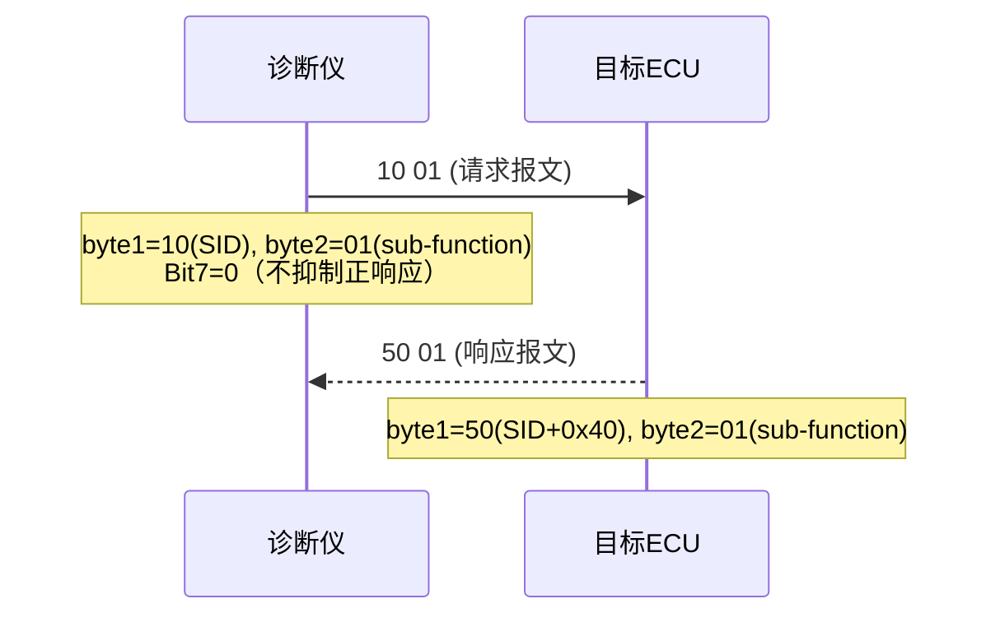
```mermaid
sequenceDiagram
    participant 诊断仪
    participant 目标ECU

    %% 诊断仪发送请求（步骤1）
    诊断仪->>目标ECU: 10 01  (请求报文)
    note over 诊断仪: byte1=10(SID), byte2=01(sub-function)<br/>Bit7=0（不抑制正响应）

    %% 目标ECU响应（步骤2）
    目标ECU-->>诊断仪: 50 01  (响应报文)
    note over 目标ECU: byte1=50(SID+0x40), byte2=01(sub-function)
```

再举个不带sub-function的例子：0x22-通过DID读数据（实际上SID和sub function都是固定的，这里的例子就是不带有sub function的报文）

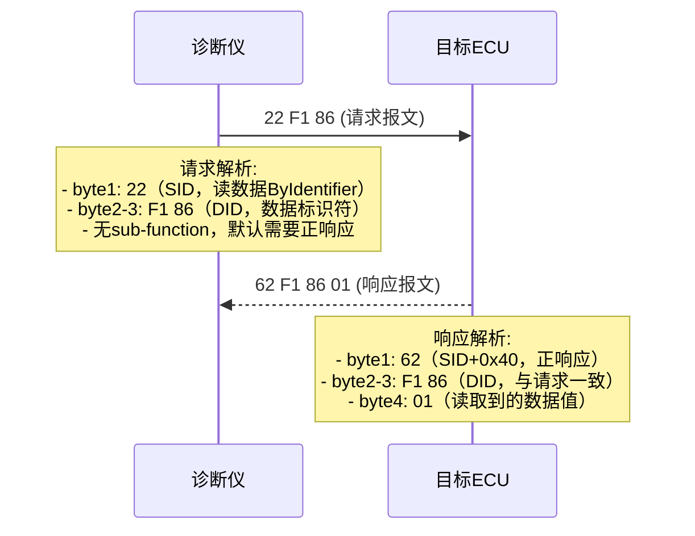
```mermaid
sequenceDiagram
    participant 诊断仪
    participant 目标ECU

    %% 步骤1:诊断仪发送请求（读数据ByIdentifier）
    诊断仪->>目标ECU: 22 F1 86  (请求报文)
    note over 诊断仪: 请求解析:<br/>- byte1: 22（SID，读数据ByIdentifier）<br/>- byte2-3: F1 86（DID，数据标识符）<br/>- 无sub-function，默认需要正响应

    %% 步骤2:目标ECU返回响应
    目标ECU-->>诊断仪: 62 F1 86 01  (响应报文)
    note over 目标ECU: 响应解析:<br/>- byte1: 62（SID+0x40，正响应）<br/>- byte2-3: F1 86（DID，与请求一致）<br/>- byte4: 01（读取到的数据值）
```

### 负响应报文格式

负响应消息由两部分组成：SID和负响应码（NRC）。SID用于标识响应的服务，负响应码指示服务执行失败的原因。


——还是拿0x10-诊断会话控制服务来举例：

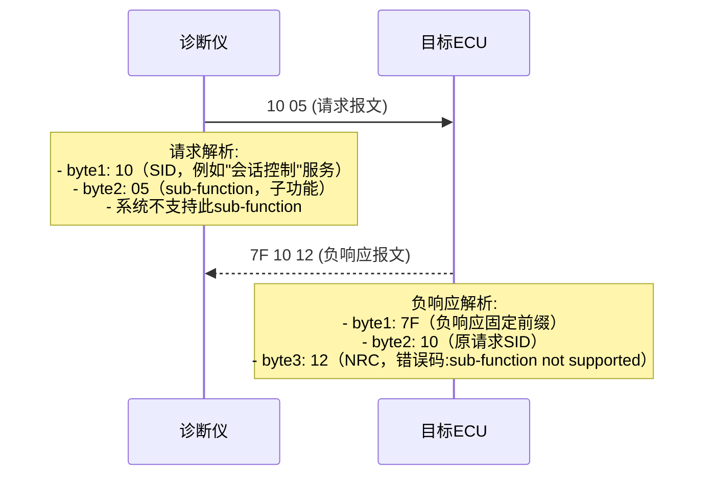
```mermaid
sequenceDiagram
    participant 诊断仪
    participant 目标ECU

    %% 步骤1:诊断仪发送请求（子功能不支持场景）
    诊断仪->>目标ECU: 10 05  (请求报文)
    note over 诊断仪: 请求解析:<br/>- byte1: 10（SID，例如"会话控制"服务）<br/>- byte2: 05（sub-function，子功能）<br/>- 系统不支持此sub-function

    %% 步骤2:目标ECU返回负响应
    目标ECU-->>诊断仪: 7F 10 12  (负响应报文)
    note over 目标ECU: 负响应解析:<br/>- byte1: 7F（负响应固定前缀）<br/>- byte2: 10（原请求SID）<br/>- byte3: 12（NRC，错误码:sub-function not supported）
```

#### 负响应码（Negative Response Code - NRC）

在UDS协议中，负响应码用于指示服务执行失败的原因。NRC用一个字节表示，每个取值都对应一种不同的错误类型。

| NRC码       | 含义                             | NRC码       | 含义                                        |
| ----------- | -------------------------------- | ----------- | ------------------------------------------- |
| 0x01 - 0x0f | 暂保留；                         | 0x78        | 收到请求，延迟响应；                        |
| 0x10        | 未知错误，服务被拒绝；           | 0x79 - 0x7d | 暂保留；                                    |
| 0x11        | 不支持该服务请求；               | 0x7e        | 当前会话下子功能不支持；                    |
| 0x12        | 不支持子功能；                   | 0x7f        | 当前会话下服务不支持；                      |
| 0x13        | 消息长度或格式错误；             | 0x80        | 暂保留；                                    |
| 0x14        | 请求信息长度超出；               | 0x81        | rpm（每分钟转速）太高；                     |
| 0x15 - 0x20 | 暂保留；                         | 0x82        | rpm太低；                                   |
| 0x21        | 服务端正忙；                     | 0x83        | 当前引擎正在运行；                          |
| 0x22        | 条件不满足；                     | 0x84        | 当前引擎未运行；                            |
| 0x23        | 暂保留；                         | 0x85        | 截止当前时间引擎运行时间太短；              |
| 0x24        | 请求顺序错误；                   | 0x86        | 温度过高；                                  |
| 0x25        | 指令已经被接收，但是未被执行；   | 0x87        | 温度过低；                                  |
| 0x26        | 失败的操作导致当前操作无法执行； | 0x88        | 车速过高；                                  |
| 0x27 - 0x30 | 暂保留；                         | 0x89        | 车速过低；                                  |
| 0x31        | 参数错误；                       | 0x8a        | 油门/踏板过高（超过了当前要求的最大阈值）； |
| 0x32        | 暂保留；                         | 0x8b        | 油门/踏板过低；                             |
| 0x33        | 安全校验未通过；                 | 0x8c        | 变速器档位不在空档；                        |
| 0x34        | 暂保留；                         | 0x8d        | 变速器档位不在排挡；                        |
| 0x35        | 密钥不匹配；                     | 0x8e        | 暂保留；                                    |
| 0x36        | 已达到解锁最大错误次数；         | 0x8f        | 制动开关没有关闭                            |
| 0x37        | 超时时间未到；                   | 0x90        | 换挡杆不在驻车档；                          |
| 0x38 - 0x4f | 由扩展数据链路安全性保留；       | 0x91        | 变矩器离合器锁定；                          |
| 0x50 - 0x6f | 暂保留；                         | 0x92        | 电压过高；                                  |
| 0x70        | 不允许上传下载；                 | 0x93        | 电压过低；                                  |
| 0x71        | 数据传输中断；                   | 0x94 - 0xef | 暂保留（特定条件下）；                      |
| 0x72        | 擦除或烧写内存错误；             | 0xf0 - 0xfe | 为汽车制造商保留；                          |
| 0x73        | 块序列计数错误；                 | 0xff        | 暂保留；                                    |
| 0x74 - 0x77 | 暂保留；                         |             |                                             |

#### NRC回复优先级

NRC的优先级从高到低排列：**NRC 0x11 > 0x7F > 0x13 > 0x12 > 0x7E > 0x33 > 0x24 > 0x31 > 0x22 > 0x78**

1. **NRC 0x11和0x7F的区别**：都是服务不支持，但0x11是整个服务不支持，而0x7F是在某个会话不支持，在其他服务下是支持的。举个例子：28服务，只支持在扩展会话下，但在默认会话下执行0x28服务，那此时回复的NRC就是0x7F。
2. **NRC 0x11和0x12的区别**：0x11是服务不支持，0x12是子功能不支持。这个还是比较好理解的。举个例子：19服务有很多子功能，假设客户不支持0A子功能，那执行19 0A就会回复0x12；假设客户需求不支持23服务，那执行23服务就回复0x11，而且不管你后面传的子功能参数对不对，长度对不对，都是回复0x11，因为0x11优先级最高(看标准0x21总线繁忙的NRC优先级是最高的，但没怎么用过)
3. **NRC 0x12和0x7E的区别**：0x12是整个子功能不支持，而0x7E是在当前会话不支持。举个例子：19服务有很多子功能，假设客户需求不支持0A子功能，那执行19 0A就会回复0x12；假设10 02服务只在扩展会话下支持，但在默认会话下执行了，就会回复0x7E
4. **NRC 0x7F和0x7E的区别**：0x7F是当前会话下服务不支持，0x7E是当前会话下子功能不支持。这两个没啥好说的，看具体情况，如果这两个都支持，则回复NRC 0x7F，因为0x7F优先级更高。

#### 通用服务的NRC回复流程

1. 没有子功能的NRC的回复优先级的顺序为： 0x11 > 0x7F > 0x33

   

2. 下图为带子功能的NRC回复顺序，如$10、$11、$27、$28、$31、$85、$14、$19这些服务都是遵照以下的顺序。

   

> [!note]
>
> **强制性的**：也就是说这一列的NRC必须是按这个顺序来回复
>
> **可选择的**：就是不一定有，可以选择性地由每个请求消息进行评估。例如出现总线繁忙时，就先回复NRC  0x21
>
> **车厂或主机厂规范**：这是客户要求的，有些客户有特殊的需求，具体的按照客户要求来做就行

#### 物理和功能寻址下的NRC

1. **物理寻址有子功能**：分成抑制正响应(SPRMIB = 1)，没有抑制正响应(SPRMIB = 0)两种情况

   1. NRC 0x31不管SPRMIB有没有置位，在参数不对或不支持的情况下都回复NRC 0x31

   2. 在SID不支持时，SPRMIB没有置位，则回复NRC 0x11或0x7F，看具体情况；但SPRMIB置位了，则一定回复NRC  0x11

   3. 在sub-function不支持时，SPRMIB没有置位，则回复NRC 0x12或0x7E，看具体情况；但SPRMIB置位了，则一定回复NRC  0x12

      | 客户端请求消息               | 服务端能力 | ==           | ==                              | 服务端响应 | ==         | 服务端响应的说明                                             |
      | ---------------------------- | ---------- | ------------ | ------------------------------- | ---------- | ---------- | ------------------------------------------------------------ |
      | 子功能（抑制肯定响应指示位） | 支持的SI   | 支持的子功能 | 支持的数据参数（只有当适用 时） | 消息       | 否定响应码 | ：                                                           |
      | 否（该位=0)                  | 是         | 是           | 至少一个                        | 肯定响应   | -          | 服务端发送肯定响应                                           |
      | ：                           | ：         | ：           | 至少一个                        | 否定响应   | 0xXX       | 服务端发送否定响应，因为当读取请求消息的数据参数时发生了错   |
      | ：                           | ：         | ：           | 无                              | ：         | ROOR       | 否定响应码为0x31的否定响应                                   |
      | ：                           | 否         | -            | -                               | ：         | SNS/SNSIAS | 否定响应码为0x11或0x7F的否定                                 |
      | ：                           | 是         | 否           | -                               | ：         | ：         | 否定响应码为0x12或0x7E的否定响应                             |
      | 是（该位=1)                  | 是         | 是           | 至少一个                        | 无响应     | -          | 服务端为发送响应                                             |
      | ：                           | ：         | ：           | 至少一个                        | 否定响应   | 0xXX       | 服务端发送否定响应，因为当读取 请求消息的数据参数时发生了错误 |
      | ：                           | ：         | ：           | 无                              | ：         | ROOR       | 否定响应码为0x31的否定响应                                   |
      | ：                           | 否         | -            | -                               | ：         | SNS        | 否定响应码为0x11的否定响应                                   |
      | ：                           | 是         | 否           | -                               | ：         | SNS        | 否定响应码为0x12的否定响应                                   |

2. **功能寻址有子功能**：请求的服务是功能寻址时，NRC为：服务不支持(0x11)，当前会话服务不支持(0x7F)，子功能不支持(0x12)，当前会话子功能不支持(0x7E)，请求超出范围(0x31)，不管SPRMIB是否置位，都不会回复NRC。但前提是没有回复NRC 0x78的情况下。括号里面那句话很重要。也就是说，**如果请求的是功能寻址，且NRC是上面5个中的任意一个，假设是NRC 0x7F，但是服务端先回复了一个NRC 0x78，那么服务端最后就必须回复NRC 0x7F了**。

   | 客户端请求消息               | 服务端能力 | ==           | ==                              | 服务端响应 | ==         | 服务端响应的说明                                             |
   | ---------------------------- | ---------- | ------------ | ------------------------------- | ---------- | ---------- | ------------------------------------------------------------ |
   | 子功能（抑制肯定响应指示位） | 支持的SI   | 支持的子功能 | 支持的数据参数（只有当适用 时） | 消息       | 否定响应码 | ：                                                           |
   | 否（该位=0)                  | 是         | 是           | 至少一个                        | 肯定响应   | -          | 服务端发送肯定响应                                           |
   | ：                           | ：         | ：           | 至少一个                        | 否定响应   | 0xXX       | 服务端发送否定响应，因为当读取请求消息的数据参数时发生了错   |
   | ：                           | ：         | ：           | 无                              | 无响应     | -          | 服务端不发送响应                                             |
   | ：                           | 否         | -            | -                               | ：         | -          | ：                                                           |
   | ：                           | 是         | 否           | -                               | ：         | -          | ：                                                           |
   | 是（该位=1)                  | 是         | 是           | 至少一个                        | 无响应     | -          | 服务端不发送响应                                             |
   | ：                           | ：         | ：           | 至少一个                        | 否定响应   | 0xXX       | 服务端发送否定响应，因为当读取请求消息的数据参数时发生了错误 |
   | ：                           | ：         | ：           | 无                              | 无响应     | -          | 服务端不发送响应                                             |
   | ：                           | 否         | -            | -                               | ：         | -          | ：                                                           |
   | ：                           | 是         | 否           | -                               | ：         | -          | ：                                                           |

   > [!note]
   >
   > 当NRC 0x78被使用了，服务端最终都要给一个响应(正响应或否定响应)，和SPRMIB的值是否置位无关，和是否是功能寻址，且NRC为0x11，0x7F，0x12，0x7E，0x31无关。简单来说就是：
   >
   > 1. **当服务端回复了NRC 0x78，即使SPRMIB是置位的也要回复正响应；**
   > 2. **当服务端回复了NRC 0x78，即使发送的请求是功能寻址，且NRC为0x11，0x7F，0x12，0x7E，0x31，也要回复对应的NRC**

3. **物理寻址无子功能**：下表为啥没有**SPRMIB**是否置位的区分？因为这些是适用没有子功能的服务啊，没有子功能哪来的**SPRMIB。**物理寻址没有子功能的服务请求，该回复正响应的就回复正响应，回复NRC就NRC，没有啥特殊情况。

   | 服务端能力 | ==           | ==                             | 服务端响应 | ==          | 服务端响应的说明                                             |
   | ---------- | ------------ | ------------------------------ | ---------- | ----------- | ------------------------------------------------------------ |
   | 支持的SI   | 支持的子功能 | 支持的数据参数（只有当适用时） | 消息       | 否定响应码  | ：                                                           |
   | 是         | 是           | 所有                           | 肯定 响应  | -           | 服务端发送肯定响应                                           |
   | ：         | ：           | 至少一个                       | ：         | -           | 服务端发送肯定响应                                           |
   | ：         | ：           | 至少一个                       | 否定响应   | 0xXX        | 服务端发送否定响应，因为当读取请求消息的数据参数时发生了错误 |
   | ：         | -            | 无                             | ：         | ROOR        | 否定响应码为0x31的否定响应码                                 |
   | 否         | 否           | -                              | ：         | SNS /SNSIAS | 否定响应码为0x11或0x7F的否定 响应码                          |

4. **功能寻址无子功能**：功能寻址没有子功能的服务请求时，服务不支持，参数不对，都不回复NRC，即无响应。

   | 服务端能力 | ==           | ==                             | 服务端响应 | ==         | 服务端响应的说明                                             |
   | ---------- | ------------ | ------------------------------ | ---------- | ---------- | ------------------------------------------------------------ |
   | 支持的SI   | 支持的子功能 | 支持的数据参数（只有当适用时） | 消息       | 否定响应码 | ：                                                           |
   | 是         | 是           | 所有                           | 肯定 响应  | -          | 服务端发送肯定响应                                           |
   | ：         | ：           | 至少一个                       | ：         | -          | 服务端发送肯定响应                                           |
   | ：         | ：           | 至少一个                       | 否定响应   | 0xXX       | 服务端发送否定响应，因为当读取请求消息的数据参数时发生了错误 |
   | ：         | -            | 无                             | 无响应     | -          | 服务端不发送响应                                             |
   | 否         | 否           | -                              | ：         | -          | 服务端不发送响应                                             |

## 寻址方式

1. 物理寻址(Physical Addressing)
   1. 针对特定ECU的一对一通信
   2. 用于与单个电子控制单元直接交互
   3. 请求和响应都明确指向特定ECU
2. 功能寻址(Functional Addressing)
   1. 广播式的一对多通信
   2. 同时向多个ECU发送请求
   3. 通常只有请求没有响应，或只由一个ECU响应


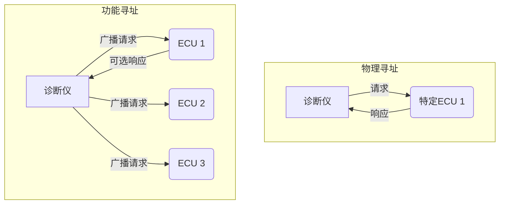
```mermaid
graph TD
    subgraph 物理寻址
    A[诊断仪] -->|请求| B(特定ECU 1)
    B -->|响应| A
    end
    
    subgraph 功能寻址
    C[诊断仪] -->|广播请求| D(ECU 1)
    C -->|广播请求| E(ECU 2)
    C -->|广播请求| F(ECU 3)
    D -->|可选响应| C
    end
```

二者的差异为：

| 特性     | 物理寻址               | 功能寻址             |
| -------- | ---------------------- | -------------------- |
| 通信模式 | 一对一                 | 一对多               |
| 响应要求 | 必须响应               | 通常不响应或单个响应 |
| 地址范围 | 特定ECU地址(0x01-0x7E) | 广播地址(0x7F)       |
| 典型应用 | 读写特定ECU数据        | 同时控制多个ECU      |

地址表示为

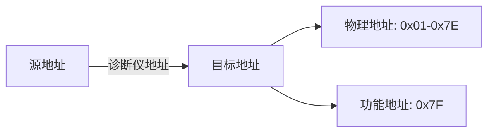
```mermaid
flowchart LR
    SourceAddress[源地址] -->|诊断仪地址| TargetAddress[目标地址]
    TargetAddress --> Physical[物理地址: 0x01-0x7E]
    TargetAddress --> Functional[功能地址: 0x7F]
```

典型应用场景为：

1. **物理寻址用例**：
   - 读取特定ECU的故障码
   - 刷新单个ECU的软件
   - 测试特定传感器

2. **功能寻址用例**：
   - 同时关闭多个ECU的通信
   - 广播复位命令
   - 同步多个ECU的时间

## DTC

DTC(Diagnostic Trouble Code,诊断故障码)是指车辆电子控制单元(ECU)存储的车辆故障代码，它是一种数字编码，用于标识车辆的故障问题。每个DTC都与特定的故障相关联，这些故障可能会导致车辆的某些系统无法正常工作。

车辆在运行过程中ECU会持续监控车辆运行状态，检测到故障时，它会记录相应的DTC,并将其存储在车辆的故障存储器中。通过读取故障存储器中的DTC,可以快速确定车辆的故障问题，并采取相应的修复措施（涉及DTC的读取和清除：[0x14服务](##0x14：清除故障码)和[0x19服务](##0x19：读取故障码))。

### DTC结构

DTC的格式定义是依据几个标准来的，比如ISO-14229-1,SAEJ2012 OBD DTC和SAEJ1939-73等。就学习DTC来说，我们不必关注各个标准间的异同和细节，只需了解DTC分为non OBD和OBD两种格式，具体格式如下所示：


可以清晰地看到DTC由四个字节组成，最高字节均保留未使用，剩下三个字节我们标记为：

1. DTC HighByte
2. DTC MiddleByte
3. DTC LowByte。

> [!tip]
>
> DTC HighByte和DTC MiddleBytei两个字节表示故障内码，对应5位标准故障码（一位字母+四位数字）。
>
> DTC LowByte描述了故障的种类和子类型（可以参考IS015031-6以及SAEJ2012-DA,比如常见的timeout)应该用0x87,信号无效为0x81等等)，简单理解就是对故障类别作进一步的区分/描述，未使用这个字节的可以用0x00填充，比如OBD格式的最低字节未使用，默认为0x00。

举例DTC:B100016

- 其中"B1000"表示故障内码，对应5位标准故障码；
- "16"是DTCLowByte的内容。

故障内码与5位标准故障码的对应关系如下：


看完上面的DTC五位标准故障码的构成，再来看个例子：

`DTC-P010016`:

- 第一位是P代表此故障码和动力系统相关；
- 第二位是0，是ISO标准中定义的故障类型；
- 第三位是1，表示燃油和空气供应的测量相关；
- 第四位和第五位是都是0,是具体的故障对象和类型的一个编码；
- 第六位和第七位16则是DTCLowByt的内容。

在车载操作系统的代码中，DTC码通常作为十六进制数处理，将P010016转换为16进制数如下所示：

二进制表示为：`P`(00) `0`(00) `1`(0001) `0`(0000) `0`(0000) `1`(0001) `6`(0110)
	十六进制表示：0x10016

> [!tip]
>
> 不必疑惑有些位到底表示什么故障类型，更具体的含义是什么，通常制造商会提供他们每个编码的具体含义。

完成上面对DTC码的学习后，我们可以根据DTC大致知道是哪个系统什么类型的故障但不能清晰得知故障是什么时候发生的，是什么原因触发的这个故障、现在是否已经恢复发生过几次，恢复过几次等细节性信息，因此还需要其他信息：比如DTC状态(DTC status)、DTC快照信息(Snapshot)和DTC扩展数据信息(Extended data)。只有发生故障的时候存储下了这些关键信息，才能有助于故障的解决。

### DTC状态

DTC状态跟在DTC后面，DTC状态为1个字节，其8个bit位含义各不相同，如下表所示：

| bit位 | 名称                               | 中文释义               | 含义                                                         |
| ----- | ---------------------------------- | ---------------------- | ------------------------------------------------------------ |
| 0     | testFailed                         | 测试失败               | 通常来说，ECU内部以循环的方式不断地针对预先定义好的错误路径进行测试，如果在最近的一次测试中，==在某个错误路径中发现了故障，则相应DTC的这一个状态位就 要被置1，表征出错。== <br>虽然此时DTC的testFailed位被置1，但是它不一定被ECU存储到非易失性存储中， 只有当pendingDTC或confirmedDTC被置1时DTC才会被存储。而pendingDTC或 confirmedDTC被置1的条件应该是检测到错误出现的次数或时间满足某个预定义的门限。当错误消失或者诊断仪执行了清除DTC指令时，testFailed会再次被置为0。 |
| 1     | testFailedThisOperationCycle       | 本次操作周期测试失败   | ==该bit用于标识某个DTC在当前的operation cycle中是否出现过testFailed置1的情 况，即是否出现过错误。== <br>operation cycle的起始点是ECU通过网络管理唤醒到ECU通过网络管理进入睡眠， 对于没有网络管理的ECU，这个起始点就是KL15通断。通过bit 0我们无法判断某个DTC 是否出现过，比如，当前testFailed=0，说明当前这个DTC没有出错，如果 testFailedThisOperationCycle=1的话，就说明这个DTC在当前这个operationcycle中 出过错，但是当前错误又消失了。 |
| 2     | pendingDTC                         | 待处理DTC              | 根据规范的解释，==pendingDTC=1表示某个DTC在当前或者上一个operationcycle 中是否出现过。== <br>pendingDTC位其实是位于testFailed和confirmedDTC之间的一个状态，有的DTC被确认的判定条件比较严苛，需要在多个operationcycle中出现才可以被判定为 confirmed的状态，此时就需要借助于pendingDTC位。 pendingDTC=1的时候，DTC就要被存储下来了，如果接下来的两个operation cycle中这个DTC都还存在，那么confirmedDTC就要置1了。如果当前operationcycle 中，故障发生，pendingDTC=1，但是在下一个operationcycle中，故障没有了， pendingDTC仍然为1，再下一个operationcycle中，故障仍然不存在，那么pending DTC就可以置0了。 |
| 3     | confirmedDTC                       | 已确认DTC              | ==当confirmedDTC=1时，则说明某个DTC已经被存储到ECU的非易失性存储中==，说明这个DTC曾经满足了被confirmed的条件。 但是请注意，confirmedDTC=1时，并不意味着当前这个DTC仍然出错，如果confirmedDTC=1，但testFailed=0，则说明这个DTC表示的故障目前已经消失了。 将confirmedDTC重新置0的方法只有删除DTC，对应UDS的[0x14服务](##0x14：清除故障码)服务。 |
| 4     | testNotCompletedSinceLastCear      | 自上次清除后测试未完成 | 该bit用于标识自从上次调用了清理DTC的服务（UDS0x14服务）之后，==是否成功地执行了对某个DTC的测试==（不管测试结果是什么，只关心是否测了）。因为很多DTC的测试也是需要满足某些边界条件的，并不是ECU上电就一定会对DTC进行检测。<br> testNotCompletedSinceLastClear=1：自清理DTC后还没有完成过针对该DTC的测试。<br>testNotCompletedSinceLastClear=0：自清理DTC之后已经完成过针对该DTC的测试。 |
| 5     | testFailedSinceLastClear           | 自上次清除后测试失败   | 这个位与bit1：testFailedThisOperationCycle有些类似，后者标识某个DTC在当前 的operationcycle中是否出现过testFailed置1的情况，而testFailedSinceLastClear标识的是在==上次执行过清理DTC之后某个DTC是否出过错==。 testFailedSinceLastClear=0，自从清理DTC之后该DTC没有出过错。<br>testFailedSinceLastClear=1，自从清理DTC之后该DTC出过至少一次错。 |
| 6     | testNotCompletedThisOperationCycle | 本次操作周期测试未完成 | 这个位与bit4：testNotCompletedSinceLastClear类似，后者标识自从上次调用了 清理DTC的服务之后，是否成功地执行了对某个DTC的测试。而该参数则标识==在当前 operationcycle中是否成功地执行了对某个DTC的测试==。 <br>testNotCompletedThisOperationCycle=1：未成功完成过测试。<br>testNotCompletedThisOperationCycle=0：成功完成过测试。 |
| 7     | warningIndicatorRequested          | 警告指示灯请求         | ==某些比较严重的DTC会与用户可见的警告指示相关联==，比如仪表上的报警灯，或者 是文字，或者是声音。这个warningIndicatorRequested就用于此类DTC。<br>warningIndicatorRequested=1：ECU请求激活警告指示。<br>warningIndicatorRequested=0：ECU不请求激活警告指示。 <br>注意，如果这个DTC不支持警告指示，则这个位永远置0。 |

> [!tip]
>
> 是不是testfailed一被置1，pendingdtc也会马上被置1?
>
> 在车载系统的UDS协议中，DTC(Diagnostic Trouble Codes)状态位的管理是错误监控和故障诊断过程的一部分。这些位的设置与清除取决于特定的条件和故障检测逻辑。testFailed位和pendingDTC位代表了故障检测的不同阶段：
>
> 1. testFailed位通常是实时的，在最近的一次监测周期中，如果某个ECU监测的参数不在预期的范围内，就会将这一位设置为1。这表明在最近的检测周期中，该ECU监测到了一个故障。但这并不意味着故障会立即被记录下来，因为它可能是暂时的或偶发的。
> 2. pendingDTC位则是在故障符合一定条件后才被置为1，通常是在故障在一个或多个操作周期中被检测到。pendingDTC为1意味着故障已经被记录下来，但还未达到confirmedDTC(确认DTC)的标准。


> [!tip]
>
> testFailed位被置为1并不会自动导致pending DTC置为1。pendingDTC的置位通常需要故障在连续的操作周期中持续出现。具体的置位条件由制造商根据监测策略和法规要求定义。
>
> 举个例子：
>
> 假设有一个监测策略，它要求一个故障必须在两个连续的操作周期检测到才能将pendingDTC置为1。
>
> - 第一个操作周期：故障首次被检测到，testFailed被置为1，但pendingDTC保持为0，因为我们还没有达到故障记录的条件。
> - 第二个操作周期：故障再次被检测到，testFailed仍然为1。因为这个故障现在已经在连续两个操作周期中被检测到了，pendingDTC将被置为1，表明故障已经被记录下来，但还未确认。
> - 第三个操作周期：如果故障未被检测到，testFailed位将被清除（置0），但pendingDTC可能仍然保持为1，因为它通常需要多个操作周期的故障消失来清除。
>
> 因此，pendingDTC的置位是一个基于监测策略的累积过程，而不是简单地跟随testFailed位的状态。

那么想要读取DTC的流程如下：

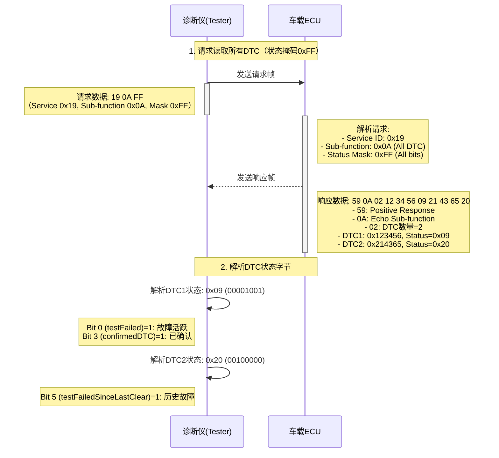
```mermaid
sequenceDiagram
    participant Tester as 诊断仪(Tester)
    participant ECU as 车载ECU

    Note over Tester,ECU: 1. 请求读取所有DTC（状态掩码0xFF）
    Tester->>ECU: 发送请求帧
    activate Tester
    Note left of Tester: 请求数据: 19 0A FF<br/>（Service 0x19, Sub-function 0x0A, Mask 0xFF）
    deactivate Tester

    activate ECU
    Note right of ECU: 解析请求:<br/>- Service ID: 0x19<br/>- Sub-function: 0x0A (All DTC)<br/>- Status Mask: 0xFF (All bits)
    ECU-->>Tester: 发送响应帧
    Note right of ECU: 响应数据: 59 0A 02 12 34 56 09 21 43 65 20<br/>- 59: Positive Response<br/>- 0A: Echo Sub-function<br/>- 02: DTC数量=2<br/>- DTC1: 0x123456, Status=0x09<br/>- DTC2: 0x214365, Status=0x20
    deactivate ECU

    Note over Tester,ECU: 2. 解析DTC状态字节
    Tester->>Tester: 解析DTC1状态: 0x09 (00001001)
    Note left of Tester: Bit 0 (testFailed)=1: 故障活跃<br/>Bit 3 (confirmedDTC)=1: 已确认
    Tester->>Tester: 解析DTC2状态: 0x20 (00100000)
    Note left of Tester: Bit 5 (testFailedSinceLastClear)=1: 历史故障
```


### DTC快照信息

==DTC和Event==

DTC是某类故障的统称，能够大体定位到某个模块的故障，而Event则是故障监控的基本单元，能够定位某个模块中的某个具体故障；Event可以由基础模块自行定义监控策略，当发生故障Event时，需要完成这个Event的上报、去抖（防止故障误报）、存储等过程，这些处理流程由DEM模块负责管理(Diagnostic Event Management)。

DTC和Event之间的区别和联系如下：

- 多个Event可以mapping同一个DTC,而同一个Event不能mapping多个DTC;
- DTC直接可见，但Event需通过进一步手段才能看到（比如通过UDS服务获取DTC关联的Event信息)，有时仅对ECU供应商可见。
- DTC代表某类Event集中表现，而Event则是某个DTC的具体实例：
- Event的优先级决定了DTC的优先级，Event之间的依赖关系决定了DTC的依赖关系；
- DTC的1字节状态位是其mapping的所有Event的状态位的或集。

==快照信息==

DTC快照信息(Snapshot Record)就类似照相机一样，在故障发生的时刻，对整车信息按下快门，做个记录，以便后续分析问题。其所记录ECU发生故障时运行状态信息可以包括多个方面的数据，笼统的说比如故障码、故障条件、传感器数据、控制单元状态等。常见些数据有：

1. 故障发生时的时间戳
2. ECU电压值
3. 电流值
4. 温度或者由故障Evnt引起的相应DTC
5. 等等

>  [!tip] 
>
> 快照信息存在的意义由于一个DTC可由多种故障Event触发（多个Eventi可以mapping同一个DTC),因此需要通过快照信息进一步区分这个DTC具体是由哪个Event触发的。

> [!note]
>
> DTC、Event、快照信息和DID之间的关系：
>
> 整车系统中可能存在各种故障Event,比如电池低压/过压事件、通信丢失事件、胎压故障事件等。为了更好的区分故障类型，整车制造商会将这些事件关联(mapping)到不同的DTC。同时，为了维修人员更快、更准确的识别故障事件，还需要提供一些额外的辅助信息，比如故障发生时的时间、ECU供电电压、相关传感器数据等。为了获取这些信息，可以将这些信息设置一个快照信息组(Snapshot Group),为了区分不同的Snapshot
> Group,可以为每个Snapshot Group:分配一个识别号，即==DTCSnapshotRecordNumber==.
>
> UDS要求，DTCSnapshotRecordNumber由1byte组成，0x00一般预留给OBD协议使用，0xFF表示ECU一次将所有的快照数据上报，0x01~0xFE由OEM自行设定。
>
> 
>
> 每个DTCSnapshotRecordNumbert包含一组快照信息，一组快照信息中可以包含多个DID,每个DID侧包含具体的信息。

### DTC拓展数据信息

和DTC快照信息的功能类似，由于DTC中8bit位可以承载的信息是有限的，仅能说明故障是当前故障还是历史故障。故障发生时的其他重要信息还需要额外的数据存储，常见的一些扩展数据如下所示：

| 常见扩展数据                      | 含义                                                         |
| --------------------------------- | ------------------------------------------------------------ |
| DTC Malfunction Indicator counter | DTC故障指示灯计数器，用于传输故障激活时系统已经运行的时间（发动机的工作时间）。 |
| DTC aging counter                 | DTC老化计数器，处于老化中DTC的计数； 用于计算自最后一次失败后的测试循环，不包括未报告TestPassed或者TestFailed的测试循环。 |
| Test failed counter               | 测试失败计数器，用于计算TestFailed报告的数量； 它与DTC事件计数器不同的是更加强调故障发生的次数。 |
| DTC occurrence counter            | DTC事件计数器，用于计算报告了测试失败（Test Failed）的测试循环数量。 |
| uncompleted testcounters          | 未完成测试计数器，用于计算最后一次完成测试之后（即自发出TestPassed或TestFailed测试报告后），剩余测试循环的数量。 |
| DTC aged counter                  | 表示完成老化的DTC的数量。                                    |

> [!tip]
>
> 这些DTC信息、状态位信息、快照信息、扩展帧信息都可以通过UDS协议中的[0x19服务](##0x19：读取故障码)服务读取。

## DID

**DID（Data Identifier）** 是UDS（ISO 14229-1）协议中用于唯一标识ECU（电子控制单元）内部数据或功能的 **16位编码**（范围：`0x0000–0xFFFF`）。通过DID，诊断设备（如Tester）可以精确读取或写入ECU的特定数据。DID的核心作用为:

- **标准化访问**：提供统一的标识方式，跨车型/厂商访问ECU数据（如VIN码、软件版本等）。  
- **功能控制**：通过DID配置ECU参数（如标定数据、功能开关）。  
- **诊断支持**：读取故障快照、实时数据等，辅助故障排查。

根据ISO 14229-1和行业标准，DID分为以下几类：

| **DID范围（Hex）** | **分类**                | **示例**                       | **说明**                                                    |
| ------------------ | ----------------------- | ------------------------------ | ----------------------------------------------------------- |
| `0x0000–0x00FF`    | ISO/SAE保留             | -                              | 未来协议扩展使用，当前未定义功能。                          |
| `0x0100–0xA5FF`    | 车辆制造商自定义（VMS） | `0x1001`（电池电压）           | OEM私有定义，需查阅车型诊断手册。                           |
| `0xA600–0xBFFF`    | 法规保留（RFLU）        | `0xF600–0xF6FF`（OBD监控数据） | 用于排放、安全等法规要求（如ISO 15031-5）。                 |
| `0xF180–0xF19F`    | ECU识别信息             | `0xF180`（ECU启动软件标识）    | 标准化的ECU信息（版本号、序列号等），但数据格式由厂商定义。 |
| `0xF400–0xF8FF`    | OBD专用                 | `0xF402`（发动机转速）         | 遵循ISO 15031-5标准，用于排放诊断。                         |
| `0xFF00–0xFFFF`    | 协议保留                | `0xFF00`（UDS版本号）          | 协议自身功能（如查询UDS版本）。                             |

详细变量如下：

| **DID范围（Hex）**    | **分类**                                                   | **强制/使用方** | **Mnemonic** | **描述**                                           |
| :-------------------- | :--------------------------------------------------------- | :-------------- | :----------- | :------------------------------------------------- |
| **`0x0000 – 0x00FF`** | ISO SAE Reserved                                           | M(Mandatory)    | ISOSAERESRVD | 保留给ISO/SAE未来定义。                            |
| **`0x0100 – 0xA5FF`** | Vehicle Manufacturer Specific                              | U（User）       | VMS          | 车辆制造商自定义DID（如传感器数据、配置参数）。    |
| **`0xA600 – 0xA7FF`** | Reserved for Legislative Use                               | M               | RFLU         | 保留给未来法规要求（如排放、安全）。               |
| **`0xA800 – 0xACFF`** | Vehicle Manufacturer Specific                              | U               | VMS          | 制造商自定义扩展范围。                             |
| **`0xAD00 – 0xAFFF`** | Reserved for Legislative Use                               | M               | RFLU         | 保留给未来法规。                                   |
| **`0xB000 – 0xB1FF`** | Vehicle Manufacturer Specific                              | U               | VMS          | 制造商自定义扩展范围。                             |
| **`0xB200 – 0xBFFF`** | Reserved for Legislative Use                               | M               | RFLU         | 保留给未来法规。                                   |
| **`0xC000 – 0xC2FF`** | Vehicle Manufacturer Specific                              | U               | VMS          | 制造商自定义范围（如特殊ECU功能）。                |
| **`0xC300 – 0xCEFF`** | Reserved for Legislative Use                               | M               | RFLU         | 保留给未来法规要求。                               |
| **`0xCF00 – 0xEFFF`** | Vehicle Manufacturer Specific                              | U               | VMS          | 制造商自定义大范围（如高级诊断功能）。             |
| **`0xF000 – 0xF00F`** | Network Configuration Data for Tractor-Trailer Application | U               | NCDFTTADID   | 用于请求拖车系统的远程地址。                       |
| **`0xF010 – 0xF0FF`** | Vehicle Manufacturer Specific                              | U               | VMS          | 制造商自定义范围（高优先级功能）。                 |
| **`0xF100 – 0xF17F`** | Identification Option (Vehicle Manufacturer Specific)      | U               | IDOPTVMSDID  | 车辆/ECU识别相关制造商自定义选项（如序列号变种）。 |
| **`0xF180`**          | Boot Software Identification                               | U               | BSIDID       | ECU启动软件标识（格式由制造商定义）。              |
| **`0xF181`**          | Application Software Identification                        | U               | ASIDID       | ECU应用软件标识（如版本号）。                      |
| **`0xF182`**          | Application Data Identification                            | U               | ADIDID       | ECU应用数据标识（如配置参数）。                    |
| **`0xF183`**          | Boot Software Fingerprint                                  | U               | BSFPDID      | ECU启动软件指纹（如校验和）。                      |
| **`0xF184`**          | Application Software Fingerprint                           | U               | ASFPDID      | ECU应用软件指纹。                                  |
| **`0xF185`**          | Application Data Fingerprint                               | U               | ADFPDID      | ECU应用数据指纹。                                  |
| **`0xF186`**          | Active Diagnostic Session                                  | U               | ADSDID       | 报告当前激活的诊断会话（如默认会话、编程会话）。   |
| **`0xF187`**          | Vehicle Manufacturer Spare Part Number                     | U               | VMSPNDID     | 车辆制造商备件编号。                               |
| **`0xF188`**          | Vehicle Manufacturer ECU Software Number                   | U               | VMECUSNDID   | ECU软件编号。                                      |
| **`0xF189`**          | Vehicle Manufacturer ECU Software Version Number           | U               | VMECUSVNDID  | ECU软件版本号。                                    |
| **`0xF18A`**          | System Supplier Identifier                                 | U               | SSIDDID      | 系统供应商名称和地址信息。                         |
| **`0xF18B`**          | ECU Manufacturing Date                                     | U               | ECUMDDID     | ECU生产日期（格式：年-月-日）。                    |
| **`0xF18C`**          | ECU Serial Number                                          | U               | ECUSNDID     | ECU序列号。                                        |
| **`0xF18D`**          | Supported Functional Units                                 | U               | SFUDID       | 请求ECU支持的功能单元列表。                        |
| **`0xF18E`**          | Vehicle Manufacturer Kit Assembly Part Number              | U               | VMKAPNDID    | 车辆制造商套件组装零件编号。                       |
| **`0xF18F`**          | ISO SAE Reserved (Standardized)                            | M               | ISOSAERESRVD | 保留给未来标准化识别选项。                         |
| **`0xF190`**          | VIN Data Identifier                                        | U               | VINDID       | 车辆识别码（VIN）。                                |
| **`0xF191`**          | Vehicle Manufacturer ECU Hardware Number                   | U               | VMECUHNDID   | ECU硬件编号。                                      |
| **`0xF192`**          | System Supplier ECU Hardware Number                        | U               | SSECUHWNDID  | 系统供应商ECU硬件编号。                            |
| **`0xF193`**          | System Supplier ECU Hardware Version Number                | U               | SSECUHWVNDID | 系统供应商ECU硬件版本号。                          |
| **`0xF194`**          | System Supplier ECU Software Number                        | U               | SSECUSWNDID  | 系统供应商ECU软件编号。                            |
| **`0xF195`**          | System Supplier ECU Software Version Number                | U               | SSECUSWVNDID | 系统供应商ECU软件版本号。                          |
| **`0xF196`**          | Exhaust Regulation or Type Approval Number                 | U               | EROTANDID    | 排放法规或型式认证编号（适用于需认证的系统）。     |
| **`0xF197`**          | System Name or Engine Type                                 | U               | SNOETDID     | 系统名称或发动机类型。                             |
| **`0xF198`**          | Repair Shop Code or Tester Serial Number                   | U               | RSCOTSNDID   | 维修厂代码或诊断设备序列号（记录最近服务）。       |
| **`0xF199`**          | Programming Date                                           | U               | PDDID        | ECU最后编程日期（格式：年-月-日）。                |
| **`0xF19A`**          | Calibration Repair Shop Code or Equipment Serial Number    | U               | CRSCOCESNDID | 校准维修厂代码或设备序列号。                       |
| **`0xF19B`**          | Calibration Date                                           | U               | CDDID        | ECU最后校准日期（格式：年-月-日）。                |
| **`0xF19C`**          | Calibration Equipment Software Number                      | U               | CESWNDID     | 校准设备软件版本号。                               |
| **`0xF19D`**          | ECU Installation Date                                      | U               | EIDDID       | ECU安装到车辆的日期（格式：年-月-日）。            |
| **`0xF19E`**          | ODX File Data Identifier                                   | U               | ODXFDID      | 引用ECU的ODX文件（用于数据解析）。                 |
| **`0xF19F`**          | Entity Data Identifier                                     | U               | EDID         | 安全数据传输的实体标识符。                         |
| **`0xF1A0 – 0xF1EF`** | Identification Option (Vehicle Manufacturer Specific)      | U               | IDOPTVMS     | 车辆制造商特定识别选项扩展。                       |
| **`0xF1F0 – 0xF1FF`** | Identification Option (System Supplier Specific)           | U               | IDOPTSSS     | 系统供应商特定识别选项扩展。                       |
| **`0xF200 – 0xF2FF`** | Periodic Data Identifier                                   | U               | PDID         | 周期性数据标识符（静态或动态定义）。               |
| **`0xF300 – 0xF3FF`** | Dynamically Defined Data Identifier                        | U               | DDDDI        | 动态定义的数据标识符。                             |
| **`0xF400 – 0xF4FF`** | OBD Data Identifier (ISO 15031-5)                          | M               | OBDDID       | 保留用于OBD/EOBD参数（如ISO 15031-5定义的PID）。   |
| **`0xF500 – 0xF5FF`** | OBD Data Identifier (Future)                               | M               | OBDDID       | 保留用于未来OBD/EOBD参数。                         |
| **`0xF600 – 0xF6FF`** | OBD Monitor Data Identifier (ISO 15031-5)                  | M               | OBDMDID      | 保留用于OBD/EOBD监控结果值。                       |
| **`0xF700 – 0xF7FF`** | OBD Monitor Data Identifier (Future)                       | M               | OBDMDID      | 保留用于未来OBD/EOBD监控结果值。                   |
| **`0xF800 – 0xF8FF`** | OBD Info Type Data Identifier (ISO 15031-5)                | M               | OBDINFTYPDID | 保留用于OBD/EOBD信息类型值。                       |
| **`0xF900 – 0xF9FF`** | Tachograph Data Identifier (ISO 16844-7)                   | M               | TACHODID     | 保留用于车速记录仪数据（如ISO 16844-7）。          |
| **`0xFA00 – 0xFA0F`** | Airbag Deployment Data Identifier (ISO 26021-2)            | M               | ADDID        | 保留用于安全气囊激活数据（如ISO 26021-2）。        |
| **`0xFA10`**          | Number of EDR Devices                                      | U               | NOEDRD       | 报告支持EDR（事件数据记录）的设备数量。            |
| **`0xFA11`**          | EDR Identification                                         | U               | EDRI         | 报告EDR设备标识数据。                              |
| **`0xFA12`**          | EDR Device Address Information                             | U               | EDRDAI       | 报告EDR设备地址信息（格式参考ISO 26021-2）。       |
| **`0xFA13 – 0xFA18`** | EDR Entries                                                | U               | EDRES        | 报告单个EDR条目（`0xFA13`为最新条目）。            |
| **`0xFA19 – 0xFAFF`** | Safety System Data Identifier                              | M               | SSDID        | 保留用于安全系统相关DID。                          |
| **`0xFB00 – 0xFCFF`** | Reserved for Legislative Use                               | M               | RFLU         | 保留给未来法规要求。                               |
| **`0xFD00 – 0xFEFF`** | System Supplier Specific                                   | U               | SSS          | 系统供应商特定DID（如私有诊断功能）。              |
| **`0xFF00`**          | UDS Version Data Identifier                                | U               | UDSVDID      | 报告ECU支持的UDS协议版本（参见标准附录C.11）。     |
| **`0xFF01 – 0xFFFF`** | ISO SAE Reserved                                           | M               | ISOSAERESRVD | 保留给ISO/SAE未来定义。                            |

## 时间参数

### P2 、P2*、P3


- **定义**：ECU响应请求报文的最大允许时间。
  - **$P2$**：初始请求后的最大响应时间（默认值通常为 **50ms**）。
  - **$P2^ *$**：后续连续帧（如流控制帧）之间的最大响应时间（默认值通常为 **5ms**）。
- **用途**：确保ECU在合理时间内响应，避免诊断工具因超时误判通信失败。

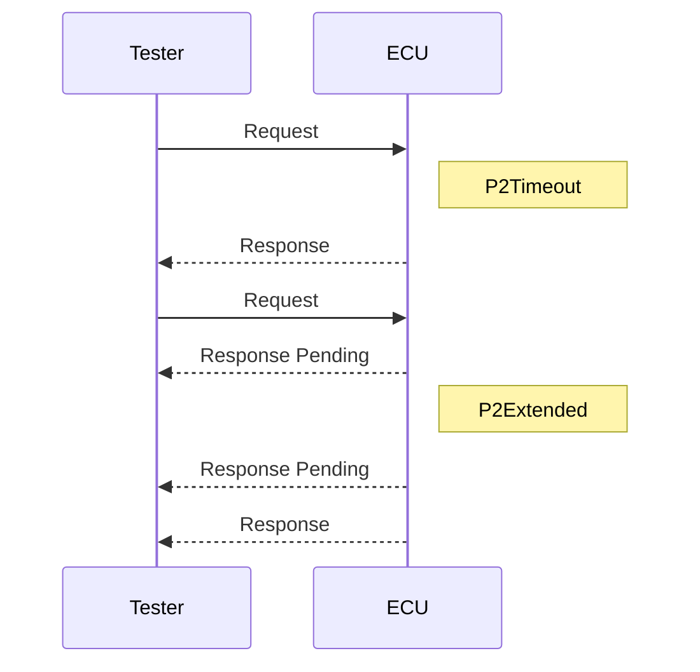
```mermaid
sequenceDiagram
    participant Tester as Tester
    participant ECU as ECU

    Tester->>ECU: Request
    note right of ECU: P2Timeout
    ECU-->>Tester: Response
    Tester->>ECU: Request
    ECU-->>Tester: Response Pending
    note right of ECU: P2Extended
    ECU-->>Tester: Response Pending
    ECU-->>Tester: Response
```


- **定义**：诊断工具在ECU响应后发送下一条请求的最大间隔时间（默认值通常为 **5000ms**）。
- **用途**：若超过此时间未发送新请求，ECU可能重置会话或状态，需重新建立通信。

### S3（Server S3 Timeout）

- **定义**：ECU在非默认会话（如编程会话）中，无通信时维持会话的最大时间（默认值通常为 **5000ms**）。
- **用途**：防止资源占用，超时后ECU自动退回默认会话。

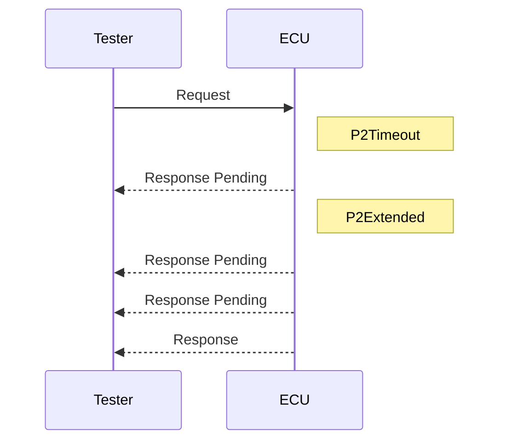
```mermaid
sequenceDiagram
    participant Tester as Tester
    participant ECU as ECU

    Tester->>ECU: Request
    note right of ECU: P2Timeout
    ECU-->>Tester: Response Pending
    note right of ECU: P2Extended
    ECU-->>Tester: Response Pending
    ECU-->>Tester: Response Pending
    ECU-->>Tester: Response
```


### 4. **BS（Block Size）与 STmin（Separation Time）**

- **应用场景**：多帧传输（如CAN TP协议）时的流控参数。
  - **BS（Block Size）**：接收方允许连续发送的帧数量（如BS=0表示无限制）。
  - **STmin**：发送方连续帧之间的最小间隔时间（如 **0ms~127ms**）。
- **用途**：避免接收方缓冲区溢出，控制数据流速率。

### 5. **N_As（Network Layer Acknowledgement Timeout）**

- **定义**：发送方等待接收方流控帧（如CTS）的超时时间（默认值通常为 **1000ms**）。
- **用途**：检测接收方是否准备好继续接收数据。

### 6. **N_Bs（Network Layer Block Timeout）**

- **定义**：发送方在BS限制下发送完一帧后，等待下一组流控帧的超时时间。
- **用途**：确保流控机制的正常运作。

### 7. **N_Cr（Network Layer Response Timeout）**

- **定义**：诊断工具等待ECU响应（如肯定应答ACK）的超时时间（默认值通常为 **1000ms**）。
- **用途**：判断ECU是否无响应，需重发请求。

### 8. **Timing during Security Access**

- **Seed & Key 交互**：
  - **Delay**：ECU发送Seed后可能强制延迟（如 **200ms**）才允许接收Key，防止暴力破解。
  - **Timeout**：发送Key的窗口时间（如 **5000ms**），超时需重新获取Seed。

### 9. **其他应用层时间参数**

- **Routine Control执行时间**：某些诊断例程（如擦除内存）可能需较长时间，ECU返回 **0x78（Pending）** 并持续发送状态更新。
- **DTC捕获时间**：故障码触发条件需满足特定时间（如故障持续 **500ms** 才记录）。

### **总结表**

| 参数    | 描述                 | 典型值    | 适用场景       |
| ------- | -------------------- | --------- | -------------- |
| P2 CAN  | ECU初始响应时间      | 50ms      | 单帧请求       |
| P2* CAN | ECU连续帧响应时间    | 5ms       | 多帧传输       |
| P3 CAN  | 诊断工具请求间隔超时 | 5000ms    | 会话保持       |
| S3      | 非默认会话超时       | 5000ms    | 会话管理       |
| STmin   | 连续帧最小间隔       | 0ms~127ms | 流控（CAN TP） |
| N_As    | 流控帧等待超时       | 1000ms    | 多帧传输流控   |
| N_Cr    | 响应超时             | 1000ms    | 应用层应答     |

# UDS服务概览

## 诊断和通信管理类

诊断和通信管理类是UDS服务的核心部分，它提供了与ECU进行通信以及执行诊断操作的基本功能。这些功能包括诊断会话的建立和终止、ECU的重置和诊断通信的管理。通过诊断和通信管理类，技术人员可以与ECU进行交互，获取ECU的状态信息，并执行各种诊断操作。主要包括如下服务：

| Service                                    | 功能简述                                                     |
| ------------------------------------------ | ------------------------------------------------------------ |
| [0x10：诊断会话控制](##0x10：诊断会话控制) | 客户端控制目标ECU的诊断会话状态。                            |
| [0x11：ECU复位](#0X11:ECU复位)             | 客户端强制让目标ECU执行复位操作。                            |
| [0x27：安全访问](#0X27:安全访问)           | 客户端请求解锁受保护的目标ECU。                              |
| [0x28：通讯控制](##0x28：通讯控制)         | 客户端控制目标ECU的通信行为 (在特定情况下启用或禁用ECU的某些通信功能)。 |
| [0x3E：待机握手](##0x3E：待机握手)         | 客户端向目标ECU表明它仍然存在。                              |
| [0x85：控制DTC的设置](#0x85：控制DTC设置)  | 客户端控制目标ECU中dtc的设置。                               |
| [0x83：访问时间参数](##0x83:访问时间参数)  | 客户端使用此服务读取/修改当前通信的定时参数。                |
| [0x84：安全数据传输](##0x84:安全数据传输)  | 客户端使用此服务执行具有扩展数据链路安全性的数据传输。       |
| [0x86：事件响应](##0x86:事件响应)          | 客户端请求设置和/或控制目标ECU中的事件机制。                 |
| [0x87：链路控制](##0x87：链路控制)         | 客户端请求控制通信波特率。                                   |

## 数据传输类

数据传输类是用于在ECU和诊断工具之间传输数据的UDS服务类别。它提供了可靠的数据传输机制，确保数据的完整性和准确性。数据传输类包括数据的读取和写入功能，允许技术人员读取和修改ECU中的数据。此外，数据传输类还支持数据的块传输，以提高数据传输的效率。主要包括如下服务：

| Service                                                      | 功能简述                                                     |
| ------------------------------------------------------------ | ------------------------------------------------------------ |
| [0x22：通过DID读数据](##0x22：通过DID读数据)                 | 客户端请求读取由提供的DID标识的记录的当前值。                |
| [0x2E：通过DID写数据](##0x2E：通过DID写数据)                 | 客户端请求写入由提供的DID指定的记录数据。                    |
| [0x23：通过地址读内存](##0x23:通过地址读取内存)              | 客户端请求读取所提供内存范围的当前值。                       |
| [0x24：通过ID读缩放数据/换算信息](##0x24：通过DID读换算信息) | 客户端请求读取由提供的DID标识的比例数据。                    |
| [0x2A：通过周期读ID数据](##0x2A:通过周期读DID数据)           | 客户端请求调度目标ECU中的数据进行周期性传输。                |
| [0x2C：动态定义标识符](##0x2C:动态定义数据标识符)            | 客户端请求动态定义数据标识符，这些标识符随后可能被0x22-读DID服务读取。 |
| [0x3D：通过地址写内存](##0x3D：通过地址写内存)               | 客户端请求覆盖提供的内存范围。                               |

## 存储数据传输类

存储数据传输类是一种特殊的数据传输类别，用于在ECU和诊断工具之间传输存储数据。存储数据可以是ECU的配置信息、故障码或日志文件等。通过存储数据传输类，技术人员可以读取和清除ECU中的存储数据，以便进行故障诊断和维修。所涉及的两个服务都是常用服务类型。主要包括如下服务：

| Service                                    | 功能简述                                                 |
| ------------------------------------------ | -------------------------------------------------------- |
| [0x14：清除诊断信息](##0x14:清除故障码)    | 允许客户端从目标ECU清除诊断信息(包括dtc、捕获的数据等)。 |
| [0x19：读取故障码信息](##0x19：读取故障码) | 允许客户端从目标ECU请求诊断信息(包括dtc、捕获数据等)。   |

## IO控制类

IO控制类是用于控制ECU输入输出（IO）功能的UDS服务类别。它提供了对ECU输入输出功能的访问和控制，包括读取和设置ECU的输入输出状态。通过IO控制类，技术人员可以与ECU的IO功能进行交互，实现对车辆系统的控制和监控。主要包括如下服务：

| Service                                                | 功能简述                                 |
| ------------------------------------------------------ | ---------------------------------------- |
| [0x2F：通过ID控制输入输出](##0x2F:通过DID控制输入输出) | 客户端请求控制特定于目标ECU的输入/输出。 |

## 例程功能类-调用ECU内部预置函数

例程功能类是一种特殊的UDS服务类别，它允许技术人员调用ECU内部预置的函数。这些函数可以执行特定的操作，如执行自检、执行校准或执行特殊功能。通过例程功能类，技术人员可以利用ECU内部的功能来进行诊断和维修。主要包括如下服务：

| Service                                | 功能简述                                                     |
| -------------------------------------- | ------------------------------------------------------------ |
| [0x31：例行程序控制](##0x31：例程控制) | 客户端请求启动、停止目标ECU中的例程（简单理解就是个函数）或请求例程结果。 |

## 上传下载类

上传下载类是用于在ECU和诊断工具之间进行数据上传和下载的UDS服务类别。它提供了将数据从ECU上传到诊断工具或将数据从诊断工具下载到ECU的功能。上传下载类可用于备份和恢复ECU配置、更新ECU软件或执行其他数据传输操作。主要包括如下服务：

| Service                                   | 功能简述                                                 |
| ----------------------------------------- | -------------------------------------------------------- |
| [0x34：请求下载](##0x34:请求下载)         | 客户端请求协商从客户端到目标ECU的数据传输。              |
| [0x36：数据传输](##0x36：数据传输)        | 客户端向目标ECU发送数据(下载)或向目标ECU请求数据(上传)。 |
| [0x37：请求退出传输](##0x37：请求退出)    | 客户端请求终止数据传输。                                 |
| [0x35：请求上传](##0x35:请求上传)         | 客户端请求从目标ECU到客户端的数据传输。                  |
| [0x38：请求文件传输](##0x38:请求文件传输) | 客户端请求在目标ECU和客户端之间进行文件传输。            |

# UDS服务详述

## 0x10：诊断会话控制

### 简介

会话模式是诊断领域非常重要的一个状态机，不同的会话模式是用来区分诊断服务执行权限的，而该服务正是为了实现会话模式的切换。即该服务可以通过控制ECU在不同的会话模式之间切换从而为ECU使能一组特定的服务以及功能，至于每种会话模式下使能哪些服务/功能，由遵循该协议标准的用户去决定。

UDS协议定义了三种会话模式：

1. 默认会话
2. 编程会话
3. 扩展会话

**不同会话模式间可以互相切换，但在一个ECU中应该始终只有一个诊断会话处于活动状态。** ECU在上电时应始终启动默认会话。如果没有启动其他会话则默认会话将在ECU通电期间一直运行。举例来说：

- ECU通常处于默认会话状态（Default Session），但很多服务需要切换到扩展会话模式中才能执行（Extended Session），当需要进行软件刷写时，则需要切换到编程会话模式（Programming Session）。
- 此外，当ECU处于非默认会话时，如果一段时间没有诊断操作，将会回退到默认会话，这时候如果想要保持在某种会话状态，可以通过[0x3E会话保持服务](https://blog.csdn.net/qq_40309666/article/details/133753250?spm=1001.2014.3001.5501)实现。

#### 会话模式切换时，ECU要做什么

14229-1标准文件中给出如下一幅图并针对各个标号过程中ECU的处理给出如下一些解释。


1. 当ECU处于默认会话状态，客户端请求启动默认会话时，ECU应完全重新初始化默认会话（不包括编程到非易失性存储器中的相关内容的初始化）。

2. 当ECU从默认会话转换到任意其他会话模式时，ECU需要停止在默认会话期间通过Response On Event（0x86）服务在ECU中配置的事件（即暂停事件响应服务）。

3. 当ECU从默认会话以外的任何诊断会话转换到默认会话以外的另一个会话时，ECU应重新初始化诊断会话，这意味着：
   - 通过Response On Event（0x86）服务在ECU中配置的每个事件都应停止；
   
   - 锁定安全访问
   
     > [!TIP]
     >
     > 该操作应重置那些依赖于要解锁安全访问的诊断功能，如DID的输入输出控制（0x2F）；
   
   - 在新会话中受支持且不依赖安全访问的所有功能都应保持不变。例如，任何配置的周期性调度程序在从一个非默认会话转换到另一个不管是否相同的非默认会话时都应保持活动状态；再比如，通信控制（0x28）和控制DTC设置（0x85）服务的状态不应受到影响，即会话切换后的状态应该跟切换前保持一致。
   
4. 当ECU从默认会话以外的任何诊断会话转换到默认会话时，应停止通过0x86服务在ECU中配置的每个事件，并启用安全访问，同时默认会话中不支持的任何其他功能应终止。

#### 不同的会话模式分别支持哪些服务

 不同会话模式支持的服务范围也不同，默认会话有很多不支持的服务，如下表所示（“x“表示支持该服务，“not applicable“表示不支持该服务）：


上表默认会话中有些支持的服务添加了一些备注（xa、b、c、d、e），其实就是说明下为什么默认会话下需要支持这几个服务，或者即使支持该服务也是有特定的场景或者限制的，具体含义如下所示：
  $x^a$：在默认会话模式中是否也允0x86服务是特定于实现的，即不一定支持该服务；
  $x^b$：如果是访问安全相关的DID则需基于安全访问服务，因此如果是该情况下要进非默认会话；
  $x^c$：如果是访问安全相关的内存区域则需要安全访问服务，因此如果是该情况下要进非默认会话；
  $x^d$：可以在默认和非默认会话中动态定义DID，因此非默认会话也支持这个服务；
  $x^e$：如果是安全相关例程需安全访问服务，因此需要非默认会话模式；需要客户端主动停止的例程也需要非默认会话模式。

### 数据包格式

#### 服务请求格式


SessionType的取值及对应含义如下（主要用的是加粗的三个）：

| SessionType | 含义                                                         |
| ----------- | ------------------------------------------------------------ |
| 0x00        | 保留未使用（ISOSAE Reserved）                                |
| **0x01**    | 默认会话模式（Default Session），一般ECU上电后的默认状态就是这个，该会话模式不需要0x3E服务维持。 |
| **0x02**    | 编程会话模式（Programming Session），主要用于ECU软件的升级刷写，刷写流程涉及多类UDS服务， 没有接触过软件升级刷写的可能不太会接触到这种会话模式，暂时不用深究。 |
| **0x03**    | 扩展会话模式（Extended Diagnostic Session），用于解锁需要高权限的诊断服务，基本覆盖各类服务， 最常见的就是读写DID前先进扩展会话模式。 |
| 0x04        | 安全模式（Safety System Diagnostic Session）使能所有跟车载系统安全相关的服务，比如安全气囊。 |
| 0x05 - 0x3F | 保留未使用（ISOSAE Reserved ）                               |
| 0x40 - 0x5F | 保留未使用，整车厂自定义使用（Vehicle Manufacturer Specific） |
| 0x60 - 0x7E | 保留未使用，ECU供应商/系统供应商自定义使用（System Supplier Specific） |
| 0x7F        | 保留未使用（ISOSAE Reserved）                                |

#### 服务响应格式

##### 正响应


SessionType的取值同上，SessionParameterRecord的4个字节含义如下：

| Byte1             | Byte2            | Byte3                 | Byte4                |
| ----------------- | ---------------- | --------------------- | -------------------- |
| $P2$时间 (高字节) | $P2$时间(低字节) | $P2$拓展时间 (高字节) | $P2$拓展时间(低字节) |

这四个字节实际上是两个时间参数的值（$P2$时间（$P2 _{Server}$）和$P2$拓展时间($P2^*_{Server}$)），可以简单理解为Server端接收到请求后如果未在指定的时间参数内给出响应，则需要执行超时操作。

| 参数            | 名称           | 默认值 (ISO 14229-1) | 触发条件                                                     |
| --------------- | -------------- | -------------------- | ------------------------------------------------------------ |
| $P2 _{Server}$  | 服务器响应时间 | 50ms                 | ECU收到请求后，必须在P2时间内发送响应（肯定或否定）。        |
| $P2^*_{Server}$ | 扩展响应时间   | 5000ms               | 当ECU返回`NRC 0x78`时激活，表示需要更多时间处理（如刷写ECU）。 |


##### 负响应


可能出现的NRC及其含义如下：

| NRC  | 含义                |
| ---- | ------------------- |
| 0x12 | 子功能参数不受支持  |
| 0x13 | 消息长度错误        |
| 0x22 | 不满足请求标准/条件 |

### 通信示例

 假设现在诊断设备控制目标ECU进入编程会话模式，发送请求时设置spr位为0（即不抑制正响应），同时假设目标ECU中设置的时间参数分别为：$P2_{ServerMax}$ = 50ms (0x0032)，$P2^*_{ServerMax}$ = 5000ms (0x01F4)，通信数据包如下所示：

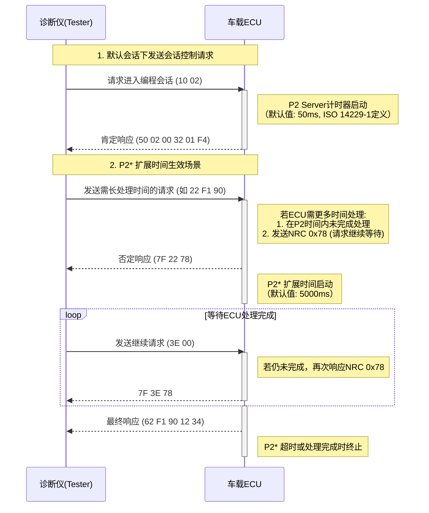
```mermaid
sequenceDiagram
    participant Tester as 诊断仪(Tester)
    participant ECU as 车载ECU

    Note over Tester,ECU: 1. 默认会话下发送会话控制请求
    Tester->>ECU: 请求进入编程会话 (10 02)
    activate ECU
    Note right of ECU: P2 Server计时器启动<br/>（默认值: 50ms, ISO 14229-1定义）
    ECU-->>Tester: 肯定响应 (50 02 00 32 01 F4)
    deactivate ECU

    Note over Tester,ECU: 2. P2* 扩展时间生效场景
    Tester->>ECU: 发送需长处理时间的请求 (如 22 F1 90)
    activate ECU
    Note right of ECU: 若ECU需更多时间处理:<br/>1. 在P2时间内未完成处理<br/>2. 发送NRC 0x78 (请求继续等待)
    ECU-->>Tester: 否定响应 (7F 22 78)
    Note right of ECU: P2* 扩展时间启动<br/>（默认值: 5000ms）
    deactivate ECU

    loop 等待ECU处理完成
        Tester->>ECU: 发送继续请求 (3E 00)
        activate ECU
        Note right of ECU: 若仍未完成，再次响应NRC 0x78
        ECU-->>Tester: 7F 3E 78
        deactivate ECU
    end

    activate ECU
    ECU-->>Tester: 最终响应 (62 F1 90 12 34)
    Note right of ECU: P2* 超时或处理完成时终止
    deactivate ECU
```

## 0x11：ECU复位

### 简介

#### KL15和KL30

在详细介绍该服务之前，首先了解一些基础知识：汽车上的ECU都需要供电，通常有两类供应电源，一类是长期处于电池包供电状态的常电电源，另一类可以称为唤醒电或者钥匙电，顾名思义就是用于钥匙开关启动车辆后才会被正常供电的ECU；在汽车行业中，常听到的KL15和KL30就跟他们有关，实际上KL15和KL30是指电线规格或线束的命名，这两条电线在汽车的电路系统中起着不同的作用，KL15线提供点火开关激活时的电源，而KL30线提供持久的电源供应。

**KL15线** 通常用于汽车电路中的"常电"或"ACC电源"，指的是在汽车点火开关处提供电源的线路。当点火开关处于ON或ACC档位时，KL15线会激活电路，使得车辆的电子设备（如收音机、电脑等）可以正常工作。KL15线的电压通常为12V。

**KL30线** 则是指汽车电路中的"主电"或"电池正极"，它是直接连接到车辆电池正极的电线。KL30线提供持久的电源供应，使得车辆的主要电子设备（如发动机控制单元、空调系统、灯光等）可以正常工作。KL30线的电压通常也为12V。

#### ECU复位服务

该服务请求ECU根据请求消息中的ResetType参数的值执行不同类型的ECU重置。重置成功后（ECU正响应该服务请求），进入Default Session（默认会话模式）。

2020版的ISO14229-1标准中指出，当Client向Server发送0x11服务请求时，Server可在复位行为完成之后或者开始复位行为之前给到Client诊断响应，但14229-1强烈推荐的一种做法是：“**当Server接收到来自Client的0x11服务请求时，Server应当先给出诊断响应然后开始重启行为**（==先响应后重启==）“。

- 一方面，几乎所有ECU软件设计中一旦走复位重启流程，已经不记得之前发生过什么，不知道收到什么请求，又要给谁发响应；
- 另一方面，如果请求11诊断服务时未抑制正响应，在复位完成之前，一般都会先回复NRC 0x78让Client进行等待，那么Client需要根据不同的ECU节点的回复做超时监控，这无疑增加了Client的负担，对于Client而言，最为简单的方法就是发送完请求，各ECU节点回复正响应，然后各自完成复位操作即可。

此外，建议在复位操作执行期间，ECU不要接受任何请求消息以及不要发送任何响应消息，避免发生意料之外的问题。

#### ECU复位服务应用场景

 一般而言，对于0X11诊断服务，主要应用场合如下：

- ECU被刷写新的软件后，此时需要通过0X11服务重启该ECU使其恢复到初始状态；
- 在产线下线标定的过程中，对于KL30供电的ECU存在一些仅在下电时存储的数据，此时需要通过0X11诊断服务使ECU走下电流程进而完成相应数据的保存；
- 为满足特定功能的需要，输入相关标定参数给到ECU后，只有通过发送服务0X11才能使得标定参数生效的场景；
- 对于KL30供电的ECU节点，可以使用诊断服务0X11使ECU快速进入休眠的场景。

### 数据包格式

#### 服务请求格式


 对于请求消息中Reset Type的取值及其含义如下表所示：

| 复位类型                                                     | 取值        | 含义/复位特点                                                |
| ------------------------------------------------------------ | ----------- | ------------------------------------------------------------ |
| ----                                                         | 0x00        | 保留                                                         |
| HardReset (硬复位)                                           | 0x01        | 模拟KL30电源的重上电，该复位基本可以等同于Server直接掉电然后重启， 主要用于需要彻底复位的场景，比如刷写之后的复位 |
| KeyOffOnReset (点火开关复位)                                 | 0x02        | 模拟KL15点火钥匙的重启，此类复位用于模拟点火开关从off–>on的过程， 一般而言NVM数据会保持不变，VM将重新初始化 |
| SoftReset (软复位)                                           | 0x03        | 效果同上，只是复位没有那么彻底，在无需初始化任何数据的前提下 重置PC指针重新运行应用程序，即RAM中的内容不会重置 |
| enableRapidPowerShutDown (使能快速休眠流程)                  | 0x04        | 即开启ECU的休眠功能，该子功能适用于非点火上电而仅采用电池供电（KL30供电）的ECU。 对于这类ECU通常情况下，当关闭钥匙电后，过段时间ECU会进入PowerOff状态（即整体下电）， 当通过0x11服务请求使用该子功能后，关闭钥匙电不会使ECU进入下电状态，而是进入休眠状态， 这种状态下，ECU可以被快速唤醒。相对于整体下电状态，休眠状态的进入和退出都更加迅速， 但同时这种状态也会多一些功耗。 |
| disableRapidPowerShutDown (抑制快速休眠流程)                 | 0x05        | 适用于非点火上电而仅采用电池供电（KL30供电）的ECU，抑制其进入下电休眠流程 |
| vehicleManufacturerSpecific (供整车制造商使用的自定义复位类型) | 0x40 - 0x5F | 整车厂自定义                                                 |
| systemSupplierSpecific (供系统供应商使用的自定义复位类型)    | 0x60 - 0x7E | 零部件供应商自定义                                           |
| ----                                                         | 7F          | 保留                                                         |

#### 服务响应格式

##### 正响应


ResetType：取值及对应含义与上表相同；
  powerDownTime：该参数仅在subfunction(即ResetType)=0x04时才会有，指的是ECU断电过程中保持待机状态的最小时间，即指示这个ECU至少要多久才能进入休眠状态。其他情况下，Server只回复前两个字节，该参数取值范围为0x00-0xFE(254s)，0xFF为无效值。

##### 负响应


| NRC  | 含义                                                         |
| ---- | ------------------------------------------------------------ |
| 0x12 | 子功能参数不受支持                                           |
| 0x13 | 消息长度错误                                                 |
| 0x22 | 不满足请求标准/条件                                          |
| 0x33 | 由于复位操作影响ECU正常功能或者状态，有一定的危险性，所以标准中对于这个服务提供了该NRC， 主机厂在实现该协议时可以（而不是必须）将复位请求定义在安全解锁状态下才能执行， 如果ECU未被解锁，请求重置将受到保护（Server在响应复位请求时处于security lock状态），就回复这个NRC。 |

### 通信示例

假设现在目标ECU处于钥匙电上电状态，但不应处于运行模式（毕竟不能在开车过程中复位，即如果是燃油车，动力源为发动机，发动机应关闭；如果是混动车，发动机和ISG电机都要关闭。）诊断仪发送复位请求，发送请求时设置spr位为0（即不抑制正响应），通信数据包如下所示：

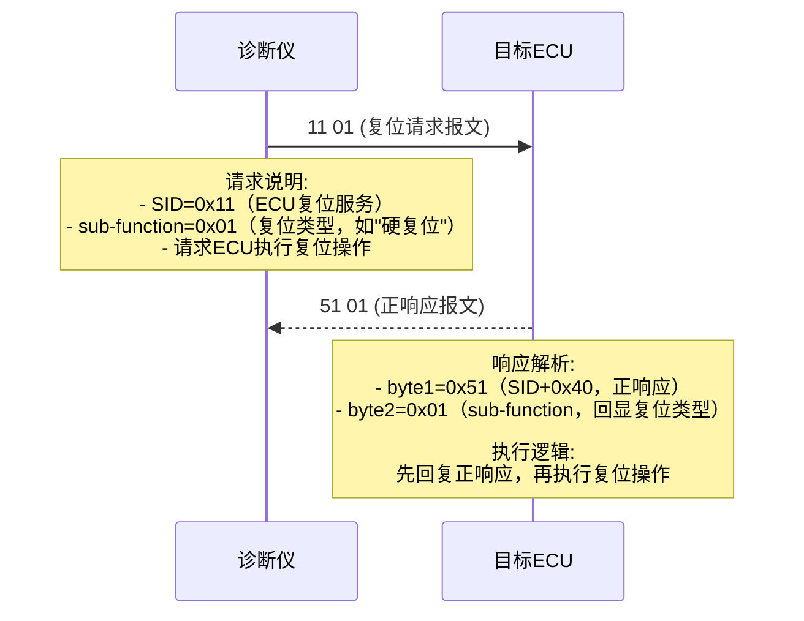
```mermaid
sequenceDiagram
    participant 诊断仪
    participant 目标ECU

    %% 步骤1:诊断仪发送复位请求
    诊断仪->>目标ECU: 11 01  (复位请求报文)
    note over 诊断仪: 请求说明:<br/>- SID=0x11（ECU复位服务）<br/>- sub-function=0x01（复位类型，如"硬复位"）<br/>- 请求ECU执行复位操作

    %% 步骤2:目标ECU返回正响应
    目标ECU-->>诊断仪: 51 01  (正响应报文)
    note over 目标ECU: 响应解析:<br/>- byte1=0x51（SID+0x40，正响应）<br/>- byte2=0x01（sub-function，回显复位类型）<br/><br/>执行逻辑:<br/>先回复正响应，再执行复位操作
```

## 0x14:清除故障码

### 简介

Tester可以通过该服务清除一个或多个目标ECU中的的DTC信息。目标ECU完成清除操作后，应发送一个正响应。即使没有存储任何DTC,也应发送正响应。

通过此服务重置/清除的DTC信息包括但不限于以下内容：

- DTC状态字节(DTC Status)
- 捕获的DTC快照数据(DTC Snapshot Data),
- 捕获的DTC扩展数据(DTC Extended Data)
- 与DTC相关的其他数据，例如第一个/最近的DTC、标志、计数器、定时器等。

常用的一个场景是：ECU刷写新软件后，会通过该服务清除下DTC然后再读取，从而查看是否存在异常的DTC,保证系统监控正常。

### 数据包格式

#### 服务请求格式


> [!tip]
>
> 该服务不存在sub-function

该服务请求消息包含一个参数：groupOfDTC,这个参数允许客户端清除一组DTC(例如动力总成、车身、底盘等)或特定的DTC。其取值及相应含义如下表所示：

| groupOfDTC取值    | 含义                                                         |
| ----------------- | ------------------------------------------------------------ |
| 0x000000~0x0000FF | 保留未使用                                                   |
| 车辆制造商定义    | 动力系统组：发动机和传动装置                                 |
| ：                | 动力系统DTC                                                  |
| ：                | 底盘组                                                       |
| ：                | 底盘DTC                                                      |
| ：                | 车身组                                                       |
| ：                | 车身DTC                                                      |
| ：                | 网络通信组                                                   |
| ：                | 网络通信DTC                                                  |
| 0xFFFF00~0xFFFFFE | 低字节的00~FE的具体取值一定要遵循下面一张表中规定的 FunctionalGroupldentifiers定义。 <br>比如，OxFFFF33为排放组，OxFFFFD0为安全组。 |
| 0xFFFFFF          | 三个字节全FF，清除所有DTC                                    |

低字节可选的值如下表：

| Byte Value | Description                                                  | Cvt  | Mnemonic     |
| ---------- | ------------------------------------------------------------ | ---- | ------------ |
| 0x00-0x32  | ISO/SAE reserved<br> This range of values is reserved by this document for future defintion. | M    | ISOSAERESRVD |
| 0x33       | Emissions-system group<br>This value Identifies the Emisslons system in a server. | M    | EMSYSGRP     |
| 0x34-0xCF  | ISO/SAE reserved<br>This range of values is reserved by this document for future definition. | M    | ISOSAERESRVD |
| 0xD0       | Safety-system group<br>This value identifies the Safety system in a server. | M    | SAFESYSGRP   |
| 0XD1-0xDF  | Legislative system group<br>This range of values is reserved for legislative required group identifiers by this document for future definition. | M    | LEGSYSGRP    |
| 0xE0-0xFD  | ISO/SAE reserved<br>This range of values is reserved by this document for future definition. | M    | ISOSAERESRVD |
| OxFE       | VOBD system<br>This value identies the VOBD system device.Depending on the VOBD strategy which is implemented, only a gateway, adedicated VOBD ECU or any other ECU which has the VOBD function implemented（e.g.engine controller) may respond. | M    | VOBDSYSGRP   |
| OxFF       | All functional system groups<br>This value ldentifies all functional system groups as listed in this table in a server. |      | ALLFCTSYSGRP |


#### 服务响应格式

##### 正响应


##### 负响应


NRC可能的含义为：

| NRC  | 含义                                      |
| ---- | ----------------------------------------- |
| 0x13 | 消息长度错误                              |
| 0x22 | 当前条件不满足                            |
| 0x31 | 请求参数不受支持，参数错误                |
| 0x72 | 通用编程错误，一般写入内存出错就报这个NRC |

NRC的处理流程如下图所示（推荐错误情况检查顺序）：


### 通信示例

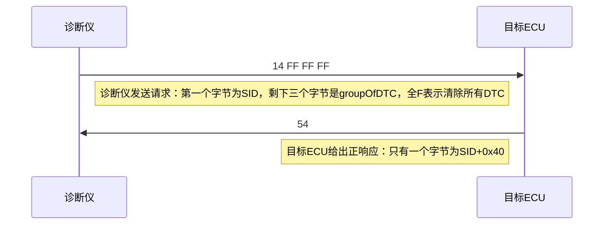
```mermaid
sequenceDiagram
	诊断仪 ->> 目标ECU:14 FF FF FF
	note right of 诊断仪:诊断仪发送请求：第一个字节为SID，剩下三个字节是groupOfDTC，全F表示清除所有DTC
	目标ECU ->> 诊断仪:54
	note left of 目标ECU:目标ECU给出正响应：只有一个字节为SID+0x40
```


## 0x19：读取故障码

### 简介

0x19服务的子服务类型最多，也是最复杂的以及最重要诊断服务之一，同时也是最能体现“诊断”一词的服务。通过对DTC相关内容的学习我们知道：通过DTC及其附属信息，我们可以了解到目标ECU何时何地何种场景下发生了什么样的错误，这些信息存储在目标ECU的故障存储器中，0x19服务存在的意义就是可以通过不同的子功能来读取目标ECU中存储的这些故障信息（可以理解为通过各种过滤规侧读取这些故障信息）

下表罗列了该服务最常用的几个子功能（推荐按顺序阅读）：

| sub-function                             | 功能简述                                                     |
| ---------------------------------------- | ------------------------------------------------------------ |
| 0x01: reportNumberOfDTCByStatusMask      | 检索匹配状态掩码的DTC数                                      |
| 0x02: reportDTCByStatusMask              | 检索匹配状态掩码的DTC列表                                    |
| 0x04: reportDTCSnapshotRecordByDTCNumber | 检索匹配DTC状态掩码的 DTCSnapshot记录数据                    |
| 0x06: reportDTCExtDataRecordByDTCNumber  | 根据客户定义的DTC掩码和 DTCExtendedData记录编号检索 DTCExtendedData记录数据 |
| 0x0A: reportSupportedDTC                 | 检索目标ECU支持的所有DTC的状态                               |

> [!tip]
>
> 该服务目的是从目标ECU中读取故障信息，因此禁止肯定响应是没有意义的，所以SPR位通常都为0。

### 常用子功能介绍

#### reportNumberOfDTCByStatusMask (19 01)

DTC状态(DTC status)是DTC的关键附属信息之一，如果我们想知道符合特定的DTC状态的DTC数量，就需要通过sub-function为01的请求，所说的这个特定的DTC状态就叫做DTC状态掩码(DTC Status Mask)。

在该子服务中，该掩码作为请求参数给到目标ECU,目标ECU将其与自身存储的DTC的Statusi进行“与”运算，并返回"与"运算之后结果不为0的DTC的数量（比如某故障码的实际状态位为”1”，请求信息的DTC状态掩码中的相应位也为“1”，与运算得1，认为两者匹配，此时符合DTC状态的DTC数量+1)。通过该子功能，Tester能够得知目标ECU中DTC状态与DTC状态掩码相匹配的DTC个数。

DTC的Status用一个byte表示，其中的8个bit分别代表DTC的不同状态，比如，bit0表示这个是否检测到了这个DTC对应的故障，bit3表示这个DTC是否已经被confirm了，如果DTC的状态是confirm,则说明该DTC已经被ECU存储下来了。

##### 数据包格式

==请求==


DTCStatusMask(1Byte):DTC状态掩码，Serverl收到该请求后，将筛选符合该掩码的DTC数量。

==肯定响应==


- DTCStatusAvailabilityMask(1Byte)：用于表示目标ECU支持的状态位，跟DTCStatusMask结构一样，8个bit,bit值为0表示目标ECU不支持这个状态位，为1则表示支持。跟请求中的DTC状态掩码没有关系！！

- DTCFormatldentifier(1Byte):指示了目标ECU所用的DTC的格式，一个ECU只能使用一种格式。具体有以下几种：

  | DTCFormatldentifier 取值 | 含义                                                    |
  | ------------------------ | ------------------------------------------------------- |
  | 0x00                     | SAE_J2012-DA_DTC Format_00（在ISO 15031-6中定义 的格式) |
  | 0x01                     | ISO_14229-1_DTC Format（在ISO 14229-1中定义的格 式）    |
  | 0x02                     | SAE_J1939-73_DTC Format（在SAEJ1939-73中定义的 格式)    |
  | 0x03                     | ISO_11992-4_DTC Format（在ISO 11992-4中定义的格 式）    |
  | 0x04                     | SAE_J2012-DA_DTC Format_04(在ISO 27145-2中定义 的格式)  |
  | 0x05-0xFF                | 保留未使用                                              |

- DTCCount(2Byte):表示符合请求中DTC状态掩码的DTC数量。

==否定响应==


可能出现的NRC如下（其他子服务都是一样的，后面就不赘述了）：

| NRC  | 含义                       |
| ---- | -------------------------- |
| 0x12 | sub-function不受支持       |
| 0x13 | 消息长度错误               |
| 0x31 | 请求参数不受支持，参数错误 |

##### 通信示例

假设有以下的一些前置背景：

1. 请求消息中设置的状态掩码DTCStatusMask8个bit为：0000 0001(十六进制0x01)
2. 目标ECU的DTCStatusAvailabilityMask为：11111111（十六进制OxFF,即支特所有状态位)
3. 目标ECU DTCFormatldentifier为：0x00(即目标ECU使用的DTC格式遵循标准J2012-DATACF00)
4. 假设目标ECU中存储了四个DTC,对应的DTC状态位(8个bt)取值如下所示：
   DTC1:00101111
   DTC2:00101111
   DTC3:00101100
   DTC4:00101110

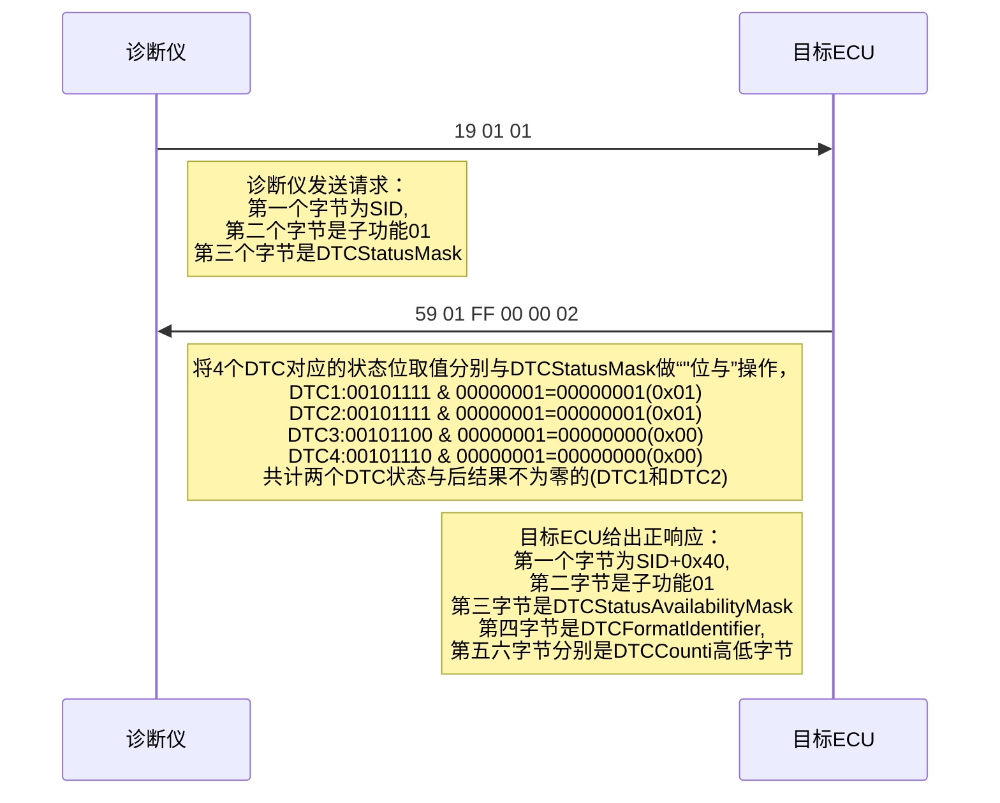
```mermaid
sequenceDiagram
	诊断仪 ->> 目标ECU:19 01 01
	note right of 诊断仪:诊断仪发送请求：<br>第一个字节为SID,<br>第二个字节是子功能01<br>第三个字节是DTCStatusMask
	目标ECU ->> 诊断仪:59 01 FF 00 00 02
	note left of 目标ECU:将4个DTC对应的状态位取值分别与DTCStatusMask做“"位与”操作，<br>DTC1:00101111 & 00000001=00000001(0x01)<br>DTC2:00101111 & 00000001=00000001(0x01)<br>DTC3:00101100 & 00000001=00000000(0x00)<br>DTC4:00101110 & 00000001=00000000(0x00)<br>共计两个DTC状态与后结果不为零的(DTC1和DTC2)
	note left of 目标ECU:目标ECU给出正响应：<br>第一个字节为SID+0x40,<br>第二字节是子功能01<br>第三字节是DTCStatusAvailabilityMask<br>第四字节是DTCFormatldentifier,<br>第五六字节分别是DTCCounti高低字节
	
```

#### reportDTCByStatusMask (19 02)

该子功能用于读取符合特定条件的DTC列表，这个特定条件仍然是DTC状态掩码（参见[0x1901](####reportNumberOfDTCByStatusMask (19 01)))，该掩码作为请求参数给到目标ECU,目标ECU将其与自身存储的DTC的Statusi进行“与”运算，并返回"与"运算之后结果不为0的DTC列表（回复匹配的DTC本身而非数量)

##### 数据包格式

==请求==


请求与[0x1901](####reportNumberOfDTCByStatusMask (19 01))一致，不再赘述。

==正响应==


相对于1901，新增了一种参数类型：

- DTCAndStatusRecord(不定长：n*4Byte):包含一条条DTC及其状态。对于大部分定义DTC格式的标准来说，每条记录的格式为“DTC高字节+DTC中字节+DTC低字节+DTC相应状态”。

##### 通信示例

沿用[0x1901](####reportNumberOfDTCByStatusMask (19 01))中通信示例的部分背景，假设如下：

1. 请求读取所有状态为active的DTC的数量，即请求消息中设置的DTCStatusMask8个bit为：00000001（十六进制0x01)
2. 目标ECU的DTCStatusAvailabilityMask为：11111111（十六进制OxFF,即支特所有状态位)
3. 假设目标ECU中存储了四个DTC,对应的DTC状态位(8个bit)取值如下所示.：
   DTC1.00101111
   DTC2.00101111
   DTC3:00101100
   DTC4.00101110

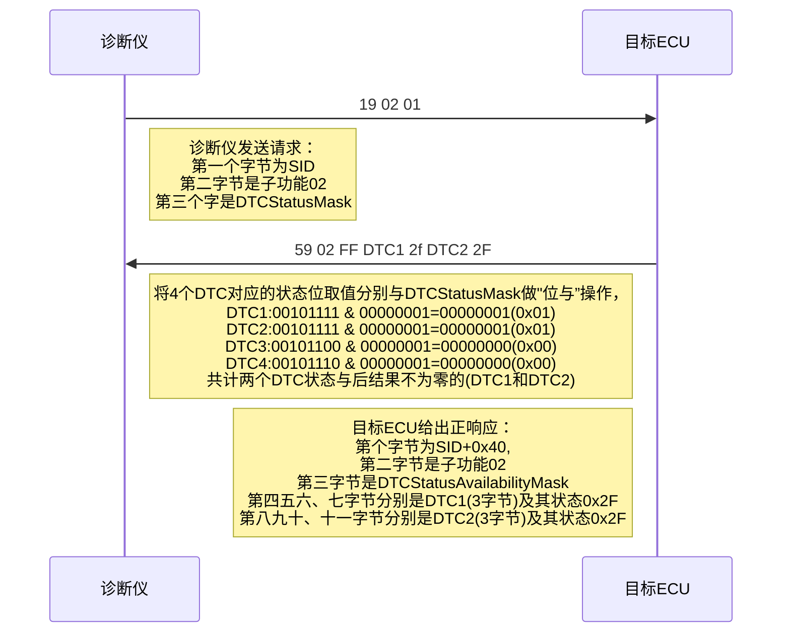
```mermaid
sequenceDiagram
	诊断仪 ->> 目标ECU:19 02 01
	note right of 诊断仪:诊断仪发送请求：<br>第一个字节为SID<br>第二字节是子功能02<br>第三个字是DTCStatusMask
	目标ECU ->> 诊断仪:59 02 FF DTC1 2f DTC2 2F
	note left of 目标ECU:将4个DTC对应的状态位取值分别与DTCStatusMask做"位与”操作，<br>DTC1:00101111 & 00000001=00000001(0x01)<br>DTC2:00101111 & 00000001=00000001(0x01)<br>DTC3:00101100 & 00000001=00000000(0x00) <br>DTC4:00101110 & 00000001=00000000(0x00)<br>共计两个DTC状态与后结果不为零的(DTC1和DTC2)
	note left of 目标ECU:目标ECU给出正响应：<br>第个字节为SID+0x40,<br>第二字节是子功能02<br>第三字节是DTCStatusAvailabilityMask<br>第四五六、七字节分别是DTC1(3字节)及其状态0x2F<br>第八九十、十一字节分别是DTC2(3字节)及其状态0x2F
```

#### reportDTCSnapshotRecordByDTCNumber (19 04)

为了方便快速定位故障，目标ECU会记录故障发生时候的快照信息（也称冻结帧）。DTC快照信息(Snapshot Record)就类似照相机一样，在故障发生的时刻，对整车信息按下快门，做个记录，以便后续分析问题。

常见一些数据有：故障发生时的时间戳、ECU电压值、电流值、温度或者由故障Event引起的相应DTC等等。关于DTC快照的更多内容，建议
先阅读[DTC快照信息](###DTC快照信息)。

通过04子功能，目标ECU根据请求中指定的故障码(DTC),，查找并返回其对应的快照信息，来分析故障原因。

##### 数据包格式

==请求==


- DTCMaskRecord(1Byte):DTC掩码（实际上就是某个具体DTC),目标ECU会查我跟这个值匹配的DTC。(注意该参数跟DTCStatusMask没有任何关系，别看花眼了)

- DTCSnapshotRecordNumber(1Byte)：表示特定的DTC快照数据记录编号。

  DTC快照可以分为不同的组，每个组包含不同的快照信息，并使用快照记录编号区分每个组。这个参数就是表示请求的是哪组快照。例如当我们需要记录某个DTC第一次发生（假设编号为1)和最近一次发生的快照数据时（假设编号为2）；那么当DTCSnapshotRecordNumber为1时，则表示请求该DTC第一次发生时的快照信息。这个编号需要目标ECU提前定义，比如该参数设置为0xFF,则表示读取所有的快照数据组。取值情况及对应含义在标准中的预定义情况如下所示：

  | 取值      | 含义                                    |
  | --------- | --------------------------------------- |
  | 0x00      | 保留用于法定目的(如WWH-OBD)             |
  | 0x01-0xFE | 供车辆制造商使用                        |
  | 0xFF      | 一次性报告所有存储的DTCSnapshot数据记录 |

==肯定响应==


相对于之前的子功能，在响应的最后，携带了一个或多个快照数据（比如请求中的DTCSnapshotRecordNumber为0xFF,则表示读取所有的快照数据组，这里就会返回所有的快照数据)，每个快照数据组的构成如上图大方框所示，这里我们把它称为DTCSnapshotData(标准中没有这个称呼)，他由以下三部分组成：

- DTCSnapshotRecordNumber(1Byte):第几组快照记录数据，其取值符合1904请求中的第六个字节含义。

- DTCSnapshotRecordNumberOfldentifiers(1Byte):对应快照信息中记录的信息条目的数量。

- DTCSnapshotRecord(不定长)：每个信息条目成员的ID信息(DID)及其相应数据。

  > [!tip]
  >
  > 注意：这里DID和

> [!tip]
>
> 1. 如果诊断仪请求的DTC或快照数据编号是目标ECU不支持的，属于参数错误，目标ECU应回NRC 0x31:
> 2. 如果DTC和快照记录编号都受支持，但目标ECU中当前没有存储这个DTC的快照信息（例如这个DTC对应的故障没有发生），那么ECU应返回肯定响应，但响应只包含59+04+DTC+DTC状态，不包含后面携带的快照记录信息。

##### 通信示例

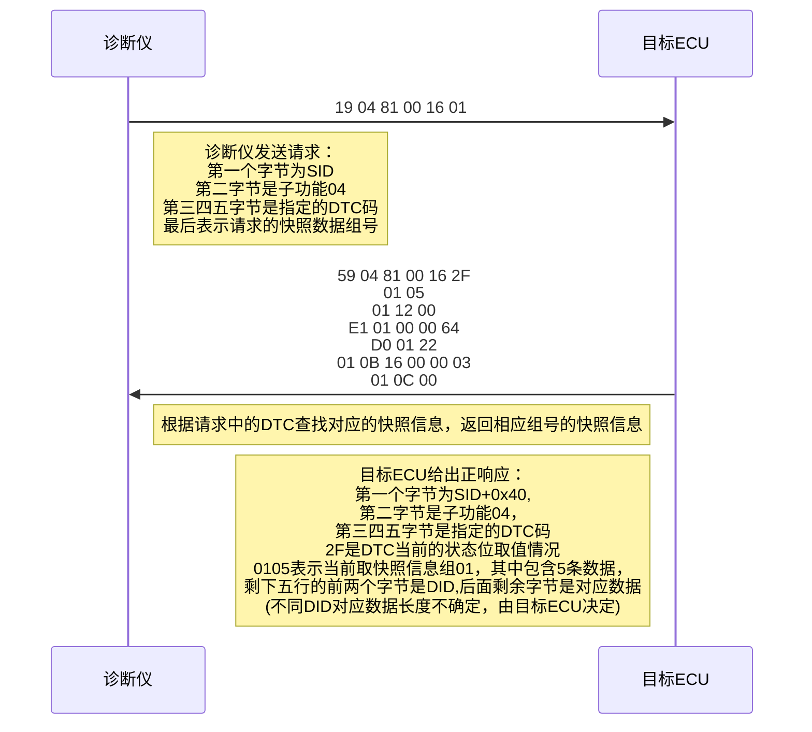
```mermaid
sequenceDiagram
	诊断仪 ->> 目标ECU:19 04 81 00 16 01
	note right of 诊断仪:诊断仪发送请求：<br>第一个字节为SID<br>第二字节是子功能04<br>第三四五字节是指定的DTC码<br>最后表示请求的快照数据组号
	目标ECU ->> 诊断仪:59 04 81 00 16 2F<br> 01 05<br> 01 12 00<br> E1 01 00 00 64<br> D0 01 22<br> 01 0B 16 00 00 03<br> 01 0C 00
	note left of 目标ECU:根据请求中的DTC查找对应的快照信息，返回相应组号的快照信息
	note left of 目标ECU:目标ECU给出正响应：<br>第一个字节为SID+0x40,<br>第二字节是子功能04，<br>第三四五字节是指定的DTC码<br>2F是DTC当前的状态位取值情况<br>0105表示当前取快照信息组01，其中包含5条数据，<br>剩下五行的前两个字节是DID,后面剩余字节是对应数据<br>(不同DID对应数据长度不确定，由目标ECU决定)
```

#### reportDTCExtDataRecordByDTCNumber (19 06)

除了前面的快照信息，一般还会再定义一个扩展信息，用于记录故障的一些其他信息，比如故障发生的次数、老化次数、已老化次数等。通过06子功能，目标ECU根据请求中指定的故障码(DTC)，查找并返回其对应的扩展信息，来分析故障原因。

##### 数据包格式

==请求==


此时parameter为4个byte,前三个byte用于标识我们要读取的DTC,第四个byte用于标识要读取的环境数据的范围，UDS规定使用0xFF来表示读取所有的扩展帧数据，各厂家可以要根据自己的需求定义其他的值来代表要读取的扩展数据的范围。环境数据包括DTC状态，优先级，发生次数，老化计数器，时间戳，里程等，厂家还可以根据自己的需求定义一些此DTC产生时的其他测量数据。

- DTCExtDataRecordNumber(1Byte):扩展数据记录码，该参数用于指定要获取的特定扩展数据记录。取值情况及对应含义如下所示：

  | 取值      | 含义                                |
  | --------- | ----------------------------------- |
  | 0x00      | 保留用于法定目的(如WWH-OBD)         |
  | 0x01-0xFE | 供车辆制造商使用                    |
  | 0xFF      | 一次性报告所有存储的DTC扩展数据记录 |

==肯定响应==


与前面的1904十分类以，在响应的最后，携带了一个或多个扩展数据（比如请求中的DTCExtDataRecordNumber为0xFF,则表示读取所有的扩展数据记录，这里就会返回所有的扩展数据)，每个扩展数据记录（扩展帧）的构成如上图所示，这里我们把它称为DTCExtData,(标准中没有这个称呼)，他由以下两部分组成：

- DTCExtDataRecordNumber(1Byte):标识是哪一个扩展记录数据，其取值符合1906请求中的第六个字节含义。
- DTCExtDataRecord(不定长)：每个信息条目成员的ID信息(DlD)及其相应数据。

##### 通信示例

假设存在如下测试背景：

1. 目标ECU中DTC 0x123456存储了两条扩展帧数据，两个扩展帧的记录编号及其对应数据分别是0x05-0x17和0x10-0x79
2. 当前这个DTC的状态是：00100100（十六进制0x24)
3. 请求读取DTC 0x123456的所有扩展数据

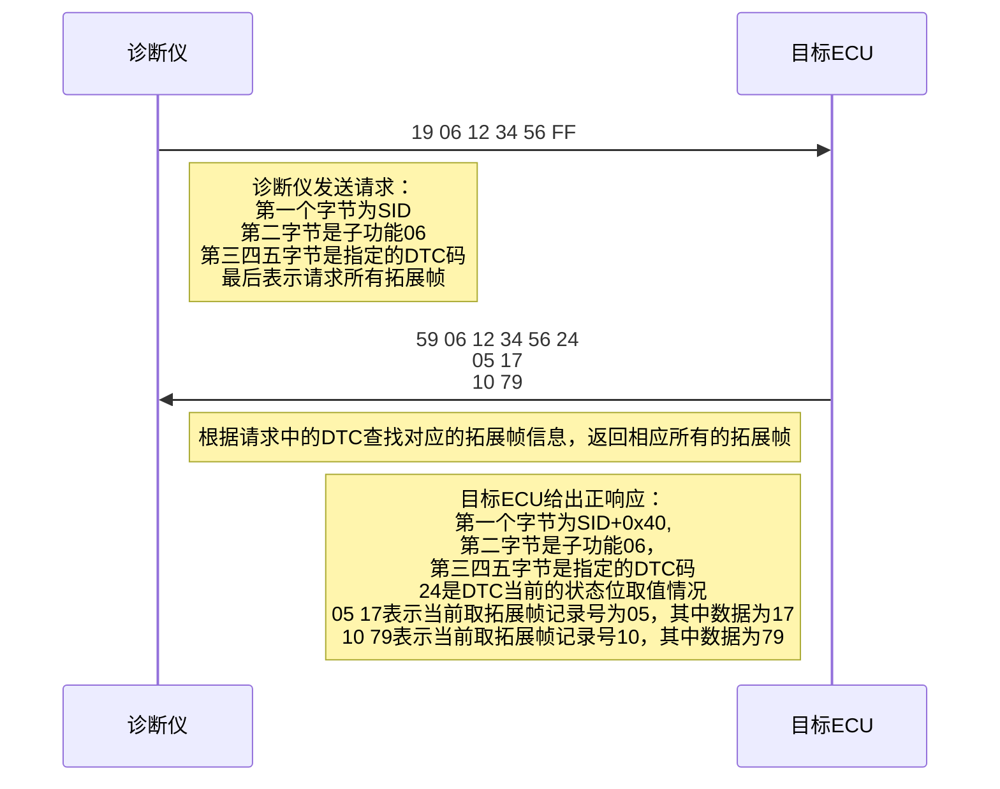
```mermaid
sequenceDiagram
	诊断仪 ->> 目标ECU:19 06 12 34 56 FF
	note right of 诊断仪:诊断仪发送请求：<br>第一个字节为SID<br>第二字节是子功能06<br>第三四五字节是指定的DTC码<br>最后表示请求所有拓展帧
	目标ECU ->> 诊断仪:59 06 12 34 56 24<br> 05 17<br> 10 79
	note left of 目标ECU:根据请求中的DTC查找对应的拓展帧信息，返回相应所有的拓展帧
	note left of 目标ECU:目标ECU给出正响应：<br>第一个字节为SID+0x40,<br>第二字节是子功能06，<br>第三四五字节是指定的DTC码<br>24是DTC当前的状态位取值情况<br>05 17表示当前取拓展帧记录号为05，其中数据为17<br>10 79表示当前取拓展帧记录号10，其中数据为79
```


#### reportSupportedDTC (19 0A)

检索目标ECU所有支持的DTC信息(3字节的DTC标识符+1字节的DTC状态位)，其响应报文与02服务一致；但要区分，该服务返回的是所有DTC的信息；而02服务是返回与请求时状态掩码相与不为0的DTC信息。注意：不论DTC状态如何，故障是否发生，都要返回。通常用来测试ECU中实际支持的DTC和预定义的DTC列表是否相符。

##### 数据包格式

==请求==


请求无需额外的参数。

==肯定响应==

响应格式和1902保持一致，详细解释可以直接参考[1902](####reportDTCByStatusMask (19 02))的响应格式。


##### 通信示例

请参考[1902的通信示例](####reportDTCByStatusMask (19 02))

## 0x22：通过DID读数据

### 简介

Data Identifier简称DID，顾名思义其实就是数据标识符，用来标识数据的一个代号。这个数据通常是某一存储在ECU非易失性存储器（Non-Volatile Memory，NVM）里、表示汽车或者一些软件信息的ID，最为大家熟知的比如 汽车的VIN码 ，还有软件版本、发布时间等等。
  至于具体有哪些DID，存储的相应数据又是什么，一般由车辆制造商或系统供应商决定。因此，数据的格式和定义应符合车辆制造商或系统供应商的特定要求，可能包括模拟输入和输出信号、数字输入和输出信号、内部数据以及系统状态信息。

该服务的作用就是通过DID读取ECU中的相关信息，允许客户端通过一个或多个DID从目标ECU中请求对应数据。至于读取的方式，既可以是上面提到的从NVM中读取这种静态的数据记录：


也可以是实时读取车辆的一些动态数据，Tester发送Service 22 + DID，ECU芯片获取该DID对应的数据信息内容，该内容由传感器采样处理获得（比如温度传感器）：


> [!tip]
>
> - ECU可以根据车辆制造商和系统供应商的约定限制同时请求的DID数量。
> - 在接收到读DID请求后，目标ECU应访问由DID绑定的相应数据，并将其值在一个单独的读DID正向响应中传输。
> - 请求消息可以多次包含相同的DID，而目标ECU应将每个DID视为单独的参数，并根据请求的次数为每个DID提供数据响应。

### 数据包格式

#### 服务请求格式

服务请求报文可以请求一个或者多个DID，此外，本服务不支持sub-function。


#### 服务响应格式

##### 肯定响应


##### 否定响应


可能出现的NRC及其含义如下：

| NRC  | 含义                                                         |
| ---- | ------------------------------------------------------------ |
| 0x13 | 消息长度错误                                                 |
| 0x14 | 响应消息太长，比如一个请求包含多个DID，超过传输协议允许最大长度 |
| 0x22 | 当前条件不满足                                               |
| 0x31 | 请求参数不受支持，参数错误                                   |
| 0x33 | 安全访问错误，比如访问的DID数据是安全数据，但当前等级未解锁  |

NRC的处理流程如下所示（即推荐的错误情况检查顺序）：


### 通信示例

第一个例子读取一个包含单个信息的2字节DID（其中DID 0xF190对应数据为车辆的VIN号）：

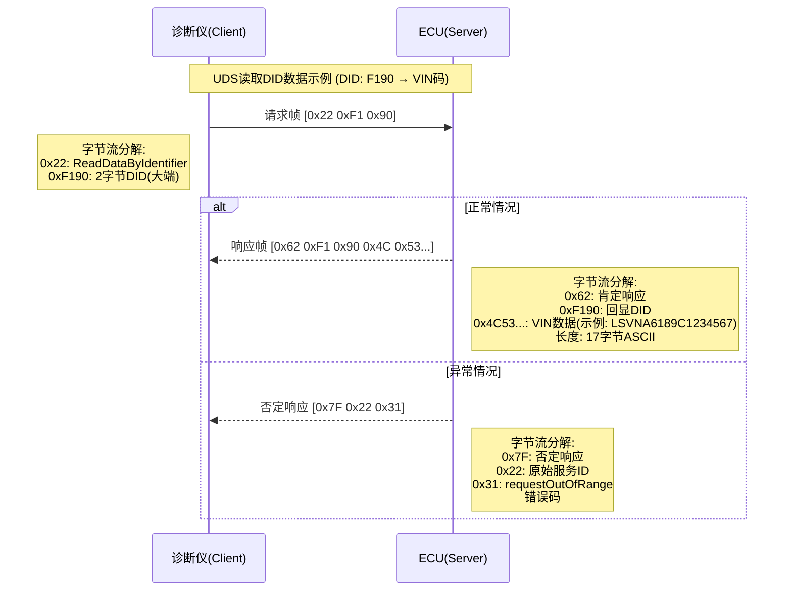
```mermaid
sequenceDiagram
    participant Client as 诊断仪(Client)
    participant Server as ECU(Server)
    
    Note over Client,Server: UDS读取DID数据示例 (DID: F190 → VIN码)
    
    Client->>Server: 请求帧 [0x22 0xF1 0x90]
    Note left of Client: 字节流分解:<br/>0x22: ReadDataByIdentifier<br/>0xF190: 2字节DID(大端)
    
    alt 正常情况
    Server-->>Client: 响应帧 [0x62 0xF1 0x90 0x4C 0x53...]
    Note right of Server: 字节流分解:<br/>0x62: 肯定响应<br/>0xF190: 回显DID<br/>0x4C53...: VIN数据(示例: LSVNA6189C1234567)<br/>长度: 17字节ASCII
    else 异常情况
    Server-->>Client: 否定响应 [0x7F 0x22 0x31]
    Note right of Server: 字节流分解:<br/>0x7F: 否定响应<br/>0x22: 原始服务ID<br/>0x31: requestOutOfRange<br/>错误码
    end
```

 第二个示例演示了用一个请求请求多个DID（其中DID 0x010A包含：发动机冷却剂温度、油门位置、发动机速度、流形绝对压力、空气质量流量、车辆速度传感器、气压、计算负载值、空闲空气控制和加速踏板位置；DID 0x0110包含电池正极电压）。

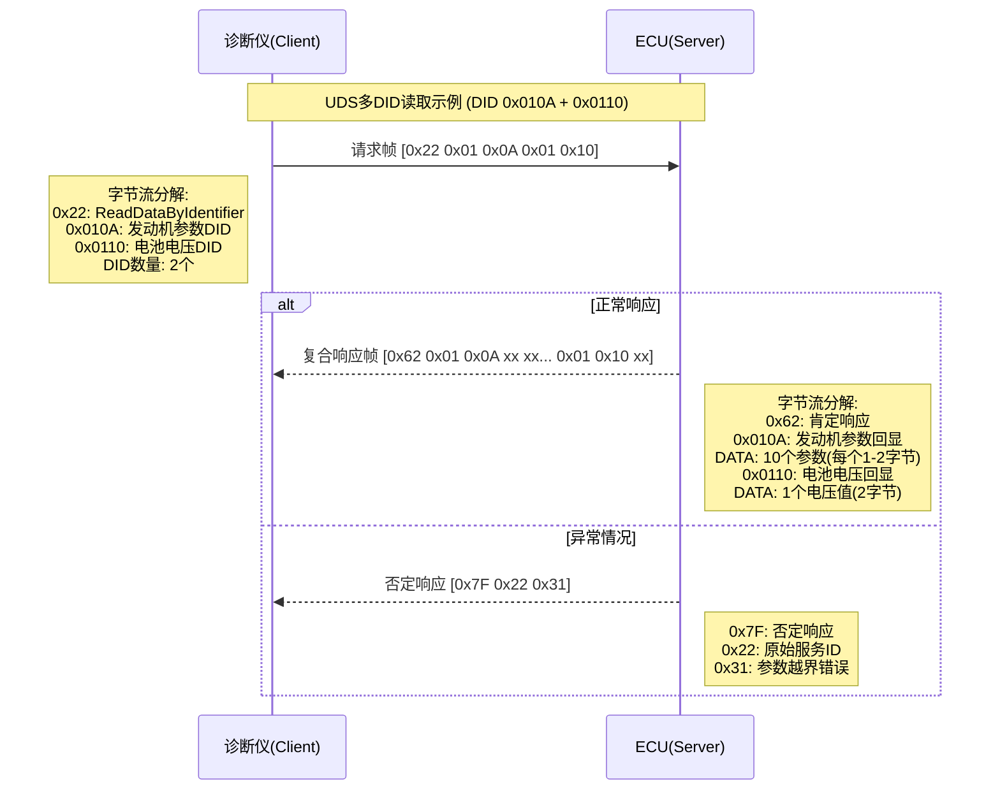
```mermaid
sequenceDiagram
    participant Client as 诊断仪(Client)
    participant Server as ECU(Server)
    
    Note over Client,Server: UDS多DID读取示例 (DID 0x010A + 0x0110)

    Client->>Server: 请求帧 [0x22 0x01 0x0A 0x01 0x10]
    Note left of Client: 字节流分解:<br/>0x22: ReadDataByIdentifier<br/>0x010A: 发动机参数DID<br/>0x0110: 电池电压DID<br/>DID数量: 2个

    alt 正常响应
    Server-->>Client: 复合响应帧 [0x62 0x01 0x0A xx xx... 0x01 0x10 xx]
    Note right of Server: 字节流分解:<br/>0x62: 肯定响应<br>0x010A: 发动机参数回显<br>DATA: 10个参数(每个1-2字节)<br>0x0110: 电池电压回显<br> DATA: 1个电压值(2字节)
    else 异常情况
    Server-->>Client: 否定响应 [0x7F 0x22 0x31]
    Note right of Server: 0x7F: 否定响应<br/>0x22: 原始服务ID<br/>0x31: 参数越界错误
    end
```

## 0x23：通过地址读取内存

### 简介

简单的说，该服务允许Tester通过发送请求提供起始地址和要读取的内存大小从目标ECU中请求内存数据。目标ECU将在正响应消息中返回内存中的实际数据。响应消息中的数据参数的格式和定义由车辆制造商具体决定。数据可能包括模拟输入输出信号、数字输入输出信号、内部数据和系统状态信息等，当然，前提是目标ECU支持这些数据的读取。

### 数据包格式

#### 服务请求格式

其请求消息里面包含了两个重要的参数：`memoryAddress`（内存地址）和`memorySize`（内存大小）。`memoryAddress`指的是数据开始的地址，而`memorySize`指的是要读取的数据的字节数。请求消息中还有一个参数叫作`addressAndLengthFormatIdentifier`，这个参数定义了内存地址和内存大小两个参数各使用多少字节表示。它由一个字节构成，低半字节表示内存地址使用的字节数，高半字节表示内存长度使用的字节数。


本服务不支持sub-function，各个参数的详细含义如下所示：

1. **addressAndLengthFormatIdentifier（1Byte）**：这个参数是一个字节的值，用来定义接下来两个参数memoryAddress和memorySize的字节长度。它的每半字节都有独立的编码规则：

   - 高半字节（bit 7 - 4）：表示memorySize参数的长度（即，读取的字节数的长度用几个字节表示）。
   - 低半字节（bit 3 - 0）：表示memoryAddress参数的长度（即，内存地址的长度用几个字节表示）。

   > [!tip]
   >
   > 通常情况下，针对特定的ECU，`addressAndLengthFormatIdentifier`的格式也是固定的。如果在`memoryAddress`或`memorySize`中有未使用到的字节，这些字节将一般会在高位用0x00填充。

2. **memoryAddress（不定长）**：指定了目标ECU内存中数据读取的起始地址。此地址的具体字节数由addressAndLengthFormatIdentifier的低半字节确定。

   > [!tip]
   >
   > 地址的高位字节可以用作内存标识符，用于在存在地址重叠的情况下区分不同的内存装置或处理器。
   >   例如，在一个具有16位地址的双处理器服务器上，如果某个地址对两个处理器都有效，但指向不同的物理内存装置或内部和外部闪存，这时可以使用内存地址参数中的一个未使用字节作为内存标识符来选择期望的内存装置。

3. **memorySize（不定长）**：这个参数指定了从memoryAddress开始要读取的字节数。该字节数由addressAndLengthFormatIdentifier的高半字节定义。

#### 服务响应格式

##### 肯定响应


**dataRecord（不定长）**：dataRecord包含的具体内容在UDS协议的文档中并没有定义。其格式由制造商定义，直接反映出Tester请求读取的那部分内存内容。

> [!tip]
>
> 
>
> 尽管UDS协议没有定义dataRecord的具体内容，但数据的格式化方式应由车辆制造商或系统供应商事先定义。这是因为不同的车辆制造商或系统可能会以不同的方式存储和管理数据。
>
> 例如，如果一个诊断工具请求从ECU的特定内存地址开始读取某个传感器的数据，那么ECU返回的dataRecord参数将包含该传感器数据的实际值。这些数据可能是原始的二进制值，也可能是经过一定处理的数值，具体取决于车辆制造商定义的格式。诊断工具需要依据制造商提供的数据格式指南来解析dataRecord中的数据，进而得到有意义的诊断信息。

##### 否定响应


 可能出现的NRC及其含义如下：

| NRC  | 含义                       |
| ---- | -------------------------- |
| 0x13 | 消息长度错误               |
| 0x22 | 当前条件不满足             |
| 0x31 | 请求参数不受支持，参数错误 |
| 0x33 | 未通过安全访问             |

  NRC的处理流程如下所示（即推荐的错误情况检查顺序）：


### 通信示例

 假设目标ECU是32位寻址的，及其flash访问地址支持4个字节的寻址空间（换句话说就是地址占用4个字节），我们希望通过该服务从目标ECU的地址0x20481392处读取259字节的数据，请求及响应过程如下所示：

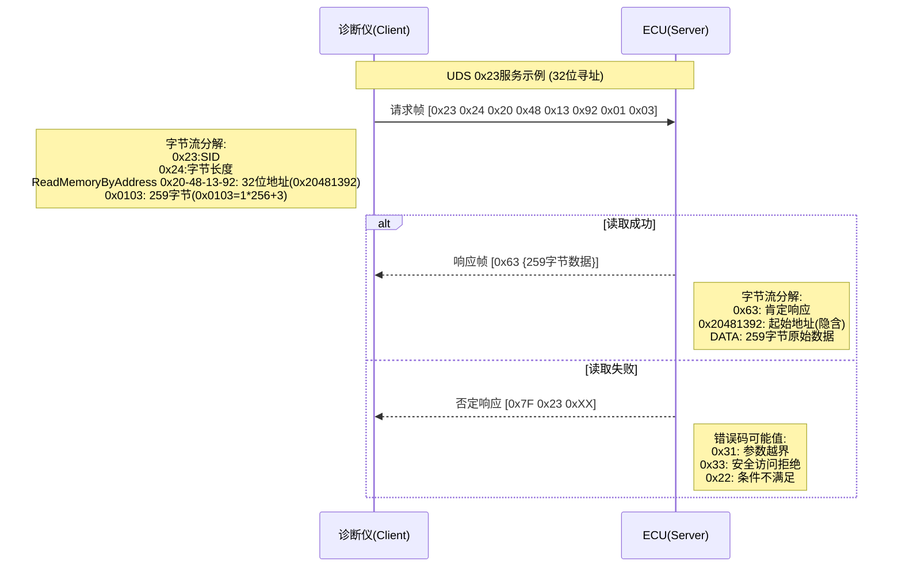
```mermaid
sequenceDiagram
    participant Client as 诊断仪(Client)
    participant Server as ECU(Server)
    
    Note over Client,Server: UDS 0x23服务示例 (32位寻址)

    %% 请求阶段
    Client->>Server: 请求帧 [0x23 0x24 0x20 0x48 0x13 0x92 0x01 0x03]
    Note left of Client: 字节流分解:<br/>0x23:SID<br>0x24:字节长度<br> ReadMemoryByAddress 0x20-48-13-92: 32位地址(0x20481392)<br/>0x0103: 259字节(0x0103=1*256+3)

    %% 响应阶段
    alt 读取成功
    Server-->>Client: 响应帧 [0x63 {259字节数据}]
    Note right of Server: 字节流分解:<br/>0x63: 肯定响应<br/>0x20481392: 起始地址(隐含)<br/>DATA: 259字节原始数据
    
    else 读取失败
    Server-->>Client: 否定响应 [0x7F 0x23 0xXX]
    Note right of Server: 错误码可能值:<br/>0x31: 参数越界<br/>0x33: 安全访问拒绝<br/>0x22: 条件不满足
    end
```

## 0x24：通过DID读换算信息

### 简介

该服务参数用起来稍微复杂，我们通常直接使用0x22服务（通过ID读数据）读取目标ECU中的数据，但可能拿到这个数据后我们并不知道如何解释它，不知道它应该是什么数据类型，单位是什么，或者需要做一个什么样的换算才能得到真实的数据，此时就需要先通过本服务读取DID的换算关系，再通过0x22服务读取数据从而根据读到的换算关系运算出真实数据。**这里的换算关系指的就是如何解释从ECU接收到的原始数据，以便正确地理解和使用这些数据。**

> [!tip]
>
> 推荐先阅读[《UDS协议从入门到精通》系列——图解0x22：通过ID读数据](##0x22：通过DID读数据)

### 数据包格式

#### 服务请求格式


本服务不支持sub-function。

#### 服务响应格式

##### 肯定 响应 


1. **scalingByte（1Byte）**：它由一个字节组成，分为高半字节（high nibble）和低半字节（low nibble）。高半字节定义了数据类型，而低半字节定义了在数据流中表示参数所需的字节数。

   1. **低半字节**的编码范围是0x0 ~ 0xF，这个范围指定了DID将引用的数据流中数据字节的数量。即DID对应的数据记录的长度由一个或多个scalingByte决定，这些scalingByte总是跟在DID之后。如果一个参数标识符后面跟随着多个scalingByte，那么该DID对应的数据长度就是这些scalingByte的低半字节内容之和。

      > [!note] 
      >
      > 例如， 车辆识别号（VIN）如果先通过本服务读取其缩放信息，则应跟随两个scalingByte。VIN数据长度可以计算为最多17个数据字节。这两个低半字节的内容可以是任何相加等于17的组合值。

      > [!tip] 
      >
      > 需要注意的是，当scalingByte的高半字节被编码为公式或单位/格式时，这个低半字节的值是0x0。这意味着在这种情况下，低半字节不代表参数的字节长度，因为它们有特定的使用情景，如表示特定的计算公式或数据格式，而不直接指示数据长度。

   2. **高半字节**，其取值及对应含义如下所示：

      | 编码      | 数据类型描述                                                 |
      | --------- | ------------------------------------------------------------ |
      | 0x0       | 无符号数值（1至4字节）。使用常规的二进制加权方案表示值。     |
      | 0x1       | 有符号数值（1至4字节）。使用二的补码二进制加权方案表示值。   |
      | 0x2       | 无掩码位图。使用单个位或小组位来表示状态。 有效性掩码通过单独的scalingByteExtension表示，不在该参数定义内包含。 |
      | 0x3       | 带掩码位图。使用单个位或小组位来表示状态。 每个状态字节包含一个对应的掩码字节，掩码指示每个位的有效性，有效性掩码包含在该参数定义中。 |
      | 0x4       | 二进制编码十进制。使用每字节两位数字的传统编码方式， 上半字节表示最高有效数字（0-9），下半字节表示最低有效数字（0-9）。 |
      | 0x5       | 状态编码变量（1字节）。使用二进制加权方案表示最多256个不同的状态。 例如点火开关的状态，代码"00"、"01"、"02"、"03"可能分别代表熄火、锁定、运行和启动。 |
      | 0x6       | ASCII（每个缩放字节1至15字节）。使用常规ASCII编码表示最多128个标准字符，最高位是逻辑'0'。 另外128个自定义字符可以用最高位是逻辑'1'表示。 |
      | 0x7       | 有符号浮点数。使用浮点或科学记数法来表示需要的数据。         |
      | 0x8       | 数据包。包含通常相关的多个数据值，每个值具有独特的缩放。不为单个值包含缩放信息。 |
      | 0x9       | 公式。使用公式从原始数据中计算值。公式标识符在定义公式标识符的表中指定。 |
      | 0xA       | 单位/格式。单位和格式标识符在定义公式标识符的表中指定。如果使用组合单位或格式，如mV， 则每个单位/格式应包括一个scalingByte（和scalingData）在readScalingDataByIdentifier正响应中。 |
      | 0xB       | 状态和连接类型（1字节）。专门用于输入和输出信号。 数据字节中编码的信息指定高级物理布局、电气水平和功能状态。推荐用于数字输入和输出参数。 |
      | 0xC - 0xF | 保留未定义                                                   |

      这个表格详细描述了scalingByte高半字节的不同编码及其对应的数据类型。例如，0x0表示无符号数值，0x1表示有符号数值，而0x6表示ASCII字符串。这些信息对于理解和正确解析从ECU接收的数据至关重要。

2. **scalingByteExtension（1Byte）**：在scalingByte参数中，当高半字节被编码为公式、单位/格式bitMappedReportedWithOutMask（也就是上面表格中的取值0x2——无掩码位图）时，scalingByteExtension（SBYE）参数才受支持。

   1. 对于scalingByte高半字节编码为**bitMappedReportedWithOutMask**的，随后的scalingByteExtension字节代表DID的有效性掩码。每个scalingByteExtension字节将指明对应DID字节中哪些位是当前应用所支持的。即如果一个数据标识符（DID）被定义为位图并且没有内置有效性掩码（即无掩码位图），那么scalingByteExtension就用于提供一个外部的有效性掩码。这个掩码确保了可以明确识别哪些特定的位是有意义的，哪些位则是不应该被解释或使用的。

   2. 对于scalingByte高半字节编码为**formula**的，scalingByte将跟随一个或多个scalingByteExtension字节，这些字节定义了所使用的计算公式，每个scalingByteExtension字节包含一部分公式定义。用于描述计算公式的总体结构如下所示：

      | Byte Value | Description                                                  | Cvt  |
      | ---------- | ------------------------------------------------------------ | ---- |
      | #1         | formulaldentifier (refer to table defining the formulaldentifier encoding for details) | M    |
      | #2         | C0 high byte                                                 | M    |
      | #3         | C0 low byte                                                  | M    |
      | #4         | C1 high byte                                                 | U    |
      | #5         | C1 low byte                                                  | U    |
      | ：：       | ：：                                                         | U    |
      | #2n+2      | Cn high byte                                                 | U    |
      | #2n+3      | Cn low byte                                                  | U    |

      1. 其中公式标识符（formulaIdentifier）：这是一个字节，用于指明使用哪个预定义的公式：
   
         | Byte Value | Description                    | Cvt  |
         | ---------- | ------------------------------ | ---- |
         | 0x00       | $y= C_0 \times x+ C_1$         | U    |
         | 0x01       | $y= C_0 \times (x + C_1)$      | U    |
         | 0x02       | $y= \frac{C_0}{x+ C1}+C_2$     | U    |
         | 0x03       | $y=\frac{x}{C_0} + C_1$        | U    |
         | 0x04       | $y=\frac{x+ c0} {c1}$          | U    |
         | 0x05       | $y= \frac{x + C_0}{C_1} + C_2$ | U    |
         | 0x06       | $y= C_0 \times x$              | U    |
         | 0x07       | $y=\frac{x}{C_0}$              | U    |
         | 0x08       | $y=x + C_0$                    | U    |
         | 0x09       | $y=\frac{x \times C_0}{C_1}$   | U    |
         | 0x0A -0x7F | ISO/SAE reserved               | M    |
         | 0x80-0xFF  | Vehicle manufacturer specific  | U    |
   
      2. 常数（Constants）：每个常数由两个字节组成的实数表示:
   
         | High Byte   | ==   | ==   | ==   | ==         | ==   | ==   | ==   | Low Byte    | ==   | ==   | ==   | ==         | ==   | ==   | ==   |
         | ----------- | ---- | ---- | ---- | ---------- | ---- | ---- | ---- | ----------- | ---- | ---- | ---- | ---------- | ---- | ---- | ---- |
         | High Nibble | ==   | ==   | ==   | Low Nibble | ==   | ==   | ==   | High Nibble | ==   | ==   | ==   | Low Nibble |      |      |      |
         | 15          | 14   | 13   | 12   | 11         | 10   | 9    | 8    | 7           | 6    | 5    | 4    | 3          | 2    | 1    | 0    |
         | Exponent    | ==   | ==   | ==   | Mantissa   | ==   | ==   | ==   | ==          | ==   | ==   | ==   | ==         | ==   | ==   | ==   |
   
         > [!note]
         >
         > 在这种公式计算场景中，变量y代表计算出来的值，其它变量（如x等）则是数据流中的部分，由DID引用。常数使用两字节实数表示，其中包括一个12位的有符号尾数（mantissa，M，使用二进制补码表示）和一个4位的有符号指数（exponent，E，同样使用二进制补码表示）。尾数的范围是-2048到+2047，指数能够将数字按10的乘方进行缩放，从10-8到107。两字节实数中，指数被编码在高字节的高半字节，尾数则由高字节的低半字节和低字节整体共同编码。
   
           通过这种方式，scalingByte和scalingByteExtension一起提供了一个强大的机制来精确地定义和解释车辆数据。在车辆通信和诊断中，这可以用来对原始数据进行缩放和转换，最终得到人们可读或机器可进一步处理的高级数据。
   
   3. 当scalingByte的高半字节被编码为**单位/格式（unit/format）**，数据流中的数据将具有特定的解释方式，例如以米（m）、伏特（V）或毫伏（mV）等单位表示。此时，scalingByte将会跟随一个scalingByteExtension字节，这个字节定义了参数的单位或格式。该字节的具体定义如下表所示：
   
      | **Hex**   | **单位（英文）**                        | **单位（中文）**            | **备注**                   |
      | --------- | --------------------------------------- | --------------------------- | -------------------------- |
      | 0x00      | No unit                                 | 无单位                      | 仅数值，无物理单位         |
      | 0x01      | Meter (m)                               | 米 (m)                      | 长度单位                   |
      | 0x02      | Kilometer (km)                          | 千米 (km)                   | 1 km = 1000 m              |
      | 0x03      | Kilogram (kg)                           | 千克 (kg)                   | 质量单位                   |
      | 0x04      | Second (s)                              | 秒 (s)                      | 时间单位                   |
      | 0x05      | Minute (min)                            | 分钟 (min)                  | 1 min = 60 s               |
      | 0x06      | Hour (h)                                | 小时 (h)                    | 1 h = 3600 s               |
      | 0x07      | Ampere (A)                              | 安培 (A)                    | 电流单位                   |
      | 0x08      | Volt (V)                                | 伏特 (V)                    | 电压单位                   |
      | 0x09      | Watt (W)                                | 瓦特 (W)                    | 功率单位                   |
      | 0x0A      | Ohm (Ω)                                 | 欧姆 (Ω)                    | 电阻单位                   |
      | 0x0B      | Degree Celsius (°C)                     | 摄氏度 (°C)                 | 温度单位                   |
      | 0x0C      | Percent (%)                             | 百分比 (%)                  | 比例单位                   |
      | 0x0D      | Radian (rad)                            | 弧度 (rad)                  | 角度单位                   |
      | 0x0E      | Hertz (Hz)                              | 赫兹 (Hz)                   | 频率单位                   |
      | 0x0F      | Newton (N)                              | 牛顿 (N)                    | 力单位                     |
      | 0x10      | Newton-meter (Nm)                       | 牛顿米 (Nm)                 | 扭矩单位                   |
      | 0x11      | Pascal (Pa)                             | 帕斯卡 (Pa)                 | 压强单位                   |
      | 0x12      | Revolutions per minute (rpm)            | 转每分 (rpm)                | 转速单位                   |
      | 0x13      | Kilometer per hour (km/h)               | 公里每小时 (km/h)           | 速度单位                   |
      | 0x14      | Mile per hour (mph)                     | 英里每小时 (mph)            | 速度单位                   |
      | 0x15      | Liter (L)                               | 升 (L)                      | 体积单位                   |
      | 0x16      | Cubic meter (m³)                        | 立方米 (m³)                 | 体积单位                   |
      | 0x17      | Joule (J)                               | 焦耳 (J)                    | 能量单位                   |
      | 0x18      | Watt-hour (Wh)                          | 瓦时 (Wh)                   | 电能单位                   |
      | 0x19      | Coulomb (C)                             | 库仑 (C)                    | 电荷单位                   |
      | 0x1A      | Candela (cd)                            | 坎德拉 (cd)                 | 光强单位                   |
      | 0x1B      | Lux (lx)                                | 勒克斯 (lx)                 | 照度单位                   |
      | 0x1C      | Tesla (T)                               | 特斯拉 (T)                  | 磁感应强度单位             |
      | 0x1D      | Weber (Wb)                              | 韦伯 (Wb)                   | 磁通量单位                 |
      | 0x1E      | Henry (H)                               | 亨利 (H)                    | 电感单位                   |
      | 0x1F      | Siemens (S)                             | 西门子 (S)                  | 电导单位                   |
      | 0x20      | Mole (mol)                              | 摩尔 (mol)                  | 物质的量单位               |
      | 0x21      | Becquerel (Bq)                          | 贝克勒尔 (Bq)               | 放射性活度单位             |
      | 0x22      | Gray (Gy)                               | 戈瑞 (Gy)                   | 吸收剂量单位               |
      | 0x23      | Sievert (Sv)                            | 希沃特 (Sv)                 | 剂量当量单位               |
      | 0x24      | Katal (kat)                             | 开特 (kat)                  | 催化活性单位               |
      | 0x25      | Square meter (m²)                       | 平方米 (m²)                 | 面积单位                   |
      | 0x26      | Cubic decimeter (dm³)                   | 立方分米 (dm³)              | 1 dm³ = 1 L                |
      | 0x27      | Millimeter (mm)                         | 毫米 (mm)                   | 1 mm = 0.001 m             |
      | 0x28      | Centimeter (cm)                         | 厘米 (cm)                   | 1 cm = 0.01 m              |
      | 0x29      | Gram (g)                                | 克 (g)                      | 1 g = 0.001 kg             |
      | 0x2A      | Milligram (mg)                          | 毫克 (mg)                   | 1 mg = 0.000001 kg         |
      | 0x2B      | Microsecond (µs)                        | 微秒 (µs)                   | 1 µs = 0.000001 s          |
      | 0x2C      | Millisecond (ms)                        | 毫秒 (ms)                   | 1 ms = 0.001 s             |
      | 0x2D      | Kilovolt (kV)                           | 千伏 (kV)                   | 1 kV = 1000 V              |
      | 0x2E      | Millivolt (mV)                          | 毫伏 (mV)                   | 1 mV = 0.001 V             |
      | 0x2F      | Kilowatt (kW)                           | 千瓦 (kW)                   | 1 kW = 1000 W              |
      | **0x30**  | Milliwatt (mW)                          | 毫瓦 (mW)                   | 1 mW = 0.001 W             |
      | **0x31**  | Kilowatt-hour (kWh)                     | 千瓦时 (kWh)                | 电能单位                   |
      | **0x32**  | Kiloohm (kΩ)                            | 千欧 (kΩ)                   | 1 kΩ = 1000 Ω              |
      | **0x33**  | Megaohm (MΩ)                            | 兆欧 (MΩ)                   | 1 MΩ = 10⁶ Ω               |
      | **0x34**  | Milliohm (mΩ)                           | 毫欧 (mΩ)                   | 1 mΩ = 0.001 Ω             |
      | **0x35**  | Microampere (µA)                        | 微安 (µA)                   | 1 µA = 0.000001 A          |
      | **0x36**  | Milliampere (mA)                        | 毫安 (mA)                   | 1 mA = 0.001 A             |
      | **0x37**  | Ampere-hour (Ah)                        | 安时 (Ah)                   | 电池容量单位               |
      | **0x38**  | Watt per square meter (W/m²)            | 瓦每平方米 (W/m²)           | 辐射强度单位               |
      | **0x39**  | Decibel (dB)                            | 分贝 (dB)                   | 对数单位（声强、信号强度） |
      | **0x3A**  | Decibel-milliwatt (dBm)                 | 分贝毫瓦 (dBm)              | 功率对数单位               |
      | **0x3B**  | Bar (bar)                               | 巴 (bar)                    | 1 bar ≈ 100 kPa            |
      | **0x3C**  | Millibar (mbar)                         | 毫巴 (mbar)                 | 1 mbar = 0.001 bar         |
      | **0x3D**  | Kilogram per cubic meter (kg/m³)        | 千克每立方米 (kg/m³)        | 密度单位                   |
      | **0x3E**  | Gram per liter (g/L)                    | 克每升 (g/L)                | 1 g/L = 1 kg/m³            |
      | **0x3F**  | Cubic meter per second (m³/s)           | 立方米每秒 (m³/s)           | 流量单位                   |
      | **0x40**  | Liter per hour (L/h)                    | 升每小时 (L/h)              | 流量单位                   |
      | **0x41**  | Liter per minute (L/min)                | 升每分钟 (L/min)            | 流量单位                   |
      | **0x42**  | Cubic meter per hour (m³/h)             | 立方米每小时 (m³/h)         | 流量单位                   |
      | **0x43**  | Newton per second (N/s)                 | 牛顿每秒 (N/s)              | 力变化率单位               |
      | **0x44**  | Revolutions per second (rps)            | 转每秒 (rps)                | 1 rps = 60 rpm             |
      | **0x45**  | Degree (°)                              | 度 (°)                      | 角度单位（非弧度）         |
      | **0x46**  | Radian per second (rad/s)               | 弧度每秒 (rad/s)            | 角速度单位                 |
      | **0x47**  | Meter per second squared (m/s²)         | 米每二次方秒 (m/s²)         | 加速度单位                 |
      | **0x48**  | Kilometer per second squared (km/s²)    | 千米每二次方秒 (km/s²)      | 加速度单位                 |
      | **0x49**  | Millimeter per second squared (mm/s²)   | 毫米每二次方秒 (mm/s²)      | 加速度单位                 |
      | **0x4A**  | Meter per second (m/s)                  | 米每秒 (m/s)                | 速度单位                   |
      | **0x4B**  | Millimeter per second (mm/s)            | 毫米每秒 (mm/s)             | 速度单位                   |
      | **0x4C**  | Joule per kilogram (J/kg)               | 焦耳每千克 (J/kg)           | 比能单位                   |
      | **0x4D**  | Watt per square meter kelvin (W/(m²·K)) | 瓦每平方米开尔文 (W/(m²·K)) | 传热系数单位               |
      | **0x4E**  | Kelvin per watt (K/W)                   | 开尔文每瓦 (K/W)            | 热阻单位                   |
      | **0x4F**  | Square meter kelvin per watt (m²·K/W)   | 平方米开尔文每瓦 (m²·K/W)   | 热阻单位                   |
      | **0x50**  | Volt per meter (V/m)                    | 伏每米 (V/m)                | 电场强度单位               |
      | **0x51**  | Ampere per meter (A/m)                  | 安每米 (A/m)                | 磁场强度单位               |
      | **0x52**  | Candela per square meter (cd/m²)        | 坎德拉每平方米 (cd/m²)      | 亮度单位                   |
      | **0x53**  | Lumen (lm)                              | 流明 (lm)                   | 光通量单位                 |
      | **0x54**  | Lux second (lx·s)                       | 勒克斯秒 (lx·s)             | 曝光量单位                 |
      | **0x55**  | Farad (F)                               | 法拉 (F)                    | 电容单位                   |
      | **0x56**  | Microfarad (µF)                         | 微法 (µF)                   | 1 µF = 10⁻⁶ F              |
      | **0x57**  | Nanofarad (nF)                          | 纳法 (nF)                   | 1 nF = 10⁻⁹ F              |
      | **0x58**  | Picofarad (pF)                          | 皮法 (pF)                   | 1 pF = 10⁻¹² F             |
      | **0x59**  | Ohm meter (Ω·m)                         | 欧姆米 (Ω·m)                | 电阻率单位                 |
      | 0x5A-0x7F | Reserved                                | 保留                        | 未来 ISO 扩展              |
   
      > [!tip]
      >
      > 如果使用组合单位或格式，那么每个单位或格式都需要一个相应的scalingByte和scalingByteExtension。
      >
      > 通过这种方式，scalingByte和scalingByteExtension共同为数据提供了一个强大的描述框架，不仅可以表示数据的大小，而且还可以明确数据的表示方式和单位。
   
   4. 当scalingByte的高半字节被编码为状态和连接类型（**stateAndConnectionType**），将需要跟随一个scalingByteExtension字节，这个字节的每个值或组合的值对应输入输出信号的具体物理布局、电气电平和功能状态。这可能包括如信号是否为模拟或数字、它的电压等级、以及它是否处于活跃状态或其他特定状态。该字节的具体定义如下表所示：
   
      1. 信号状态（0 – 2bit）
   
         | **Value** | **输入信号（Input）**           | **输出信号（Output）**                    | **说明**                           |
         | --------- | ------------------------------- | ----------------------------------------- | ---------------------------------- |
         | 0         | Not Active（未激活）            | Not Activated（未激活）                   | 默认无效状态                       |
         | 1         | Active, function 1（功能1激活） | Active, function 1（功能1激活）           | 正常工作的基础状态                 |
         | 2         | Error detected（检测到错误）    | Plausibility error detected（合理性错误） | 信号异常或逻辑错误                 |
         | 3         | Not available（不可用）         | Not available（不可用）                   | 信号未配置或硬件故障               |
         | 4         | Active, function 2（功能2激活） | Active, function 2（功能2激活）           | 仅在三态信号时使用（如双功能控制） |
         | 5-7       | Reserved（保留）                | Reserved（保留）                          | 未来扩展                           |
   
      2. 电气电平（3 – 4bit）
   
         | **Value** | **输入/输出信号**            | **说明**                        |
         | --------- | ---------------------------- | ------------------------------- |
         | 0         | Low level（低电平，接地）    | 信号电压接近 0V（如 GND）       |
         | 1         | Middle level（中间电平）     | 电压介于低电平和高电平之间      |
         | 2         | High level（高电平，正电压） | 信号电压为电源电压（如 5V/12V） |
         | 3         | Reserved（保留）             | 由文档预留                      |
   
      3. 信号方向（第5bit）
   
         | **Value** | **输入信号**          | **输出信号**          | **说明**       |
         | --------- | --------------------- | --------------------- | -------------- |
         | 0         | Input signal（输入）  | Not defined（未定义） | 明确信号为输入 |
         | 1         | Not defined（未定义） | Output signal（输出） | 明确信号为输出 |
   
      4. 连接类型（6 – 7位）
   
         | **Value** | **输入信号**                     | **输出信号**                     | **说明**                      |
         | --------- | -------------------------------- | -------------------------------- | ----------------------------- |
         | 0         | 内部信号或通过 CAN（非独占引脚） | 内部信号或通过 CAN（非独占引脚） | 信号不直接连接至 ECU 外部接口 |
         | 1         | Pull-down 输入（2态）            | Low side switch（2态）           | 输入下拉电阻 / 输出低边驱动   |
         | 2         | Pull-up 输入（2态）              | High side switch（2态）          | 输入上拉电阻 / 输出高边驱动   |
         | 3         | Pull-up + Pull-down 输入（3态）  | Low + High side switch（3态）    | 支持三态逻辑（如总线信号）    |

##### 否定响应


可能出现的NRC及其含义如下：

| NRC  | 含义                       |
| ---- | -------------------------- |
| 0x13 | 消息长度错误               |
| 0x22 | 当前条件不满足             |
| 0x31 | 请求参数不受支持，参数错误 |
| 0x33 | 未通过安全访问             |

NRC的处理流程如下所示（即推荐的错误情况检查顺序）：


### 通信示例

下面第一个示例读取DID 0xF190关联的缩放信息，其中0xF190代表车辆识别号（VIN），通常是一个17字符的字符串。第二个示例展示了如何使用公式和单位标识符来指定服务器内的数据变量。这里的“公式和单位标识符”用于转换原始数据到可读的数据（比如公里数或者温度值），这里是读DID 0x0105的缩放数据，该DID指的是车速。

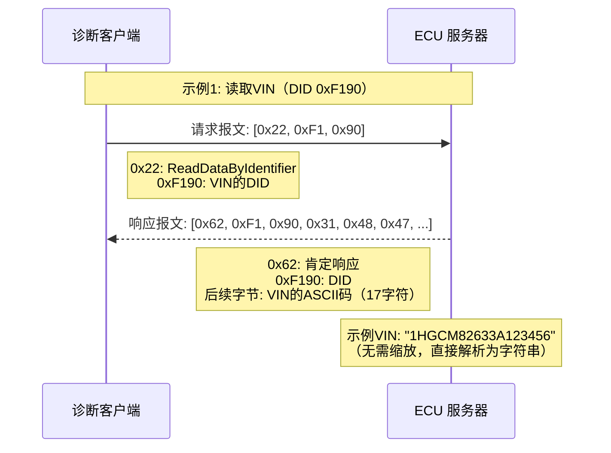
```mermaid
sequenceDiagram
    participant Client as 诊断客户端
    participant Server as ECU 服务器
    Note over Client,Server: 示例1: 读取VIN（DID 0xF190）
    Client->>Server: 请求报文: [0x22, 0xF1, 0x90]
    Note right of Client: 0x22: ReadDataByIdentifier<br>0xF190: VIN的DID
    Server-->>Client: 响应报文: [0x62, 0xF1, 0x90, 0x31, 0x48, 0x47, ...]
    Note left of Server: 0x62: 肯定响应<br>0xF190: DID<br>后续字节: VIN的ASCII码（17字符）
    Note over Server: 示例VIN: "1HGCM82633A123456"<br>（无需缩放，直接解析为字符串）
```

```mermaid
sequenceDiagram
    participant Client as 诊断客户端
    participant Server as ECU服务器
    Note over Client,Server: 示例：读取车速（DID 0x0105）的缩放数据
    Client->>Server: 请求报文: [0x24, 0x01, 0x05]
    Note right of Client: 0x24: ReadScalingDataByIdentifier<br>0x0105: 车速DID
    Server-->>Client: 响应报文: [0x64, 0x01, 0x05, 0x01, 0x95, 0x00, 0xE0, 0x4B, 0x00, 0x1E, 0xA1, 0x30]
    Note over Server: 目标ECU给出正响应：第一个字节为SID+0x40<br>紧接着2个字节是DID<br>01是第一个scalingByte:高半字节0表示是个无符号数,低半字节1表示数据长度为1字节<br>95是第二个scalingByte:高半字节9表示数据流中数据是公式,低半字节5表示占用到数据流中的5个字节<br>接下来的5个字节都是scalingBytel的扩展数据<br>第一个00是公式标识符，表示使用公式C0*X+C1<br>E04B是C0的高低字节，E0的高四位E是用二进制补码表示的指数，为-2，低半字节搭配4B这个字节总共12位标识底数为75<br>因此C0=75*10的-2次方=0.75<br>同理解释001E得到C1为30*10的0次方=30<br>A1为第三个scalingByte：高半字节A表示下面的数据是单位占用1字节<br>紧随着的scalingByteExtension30到单位标识符表中查<br>其对应的单位是km/h,最终得到DID的换算信息为：<br>速=(0.75*×+30)km/h<br>其中x就是DID0105存储在目标ECU中的实际数据。
    Note over Server: 物理值计算（假设）:<br>公式: y = (x × 224 + 19200) / 1000<br>结果: (7841×224 +19200)/1000 ≈ 1758.38 (需确认单位)
```


## 0x28：通讯控制

### 简介

首先了解如下信息：整车网络中各个ECU之间存在大量的通信报文，这些报文从功能上可以划分为不同的类型，总的来说可以分为:

1. 应用报文
2. 网络管理报文

通常情况下，各类报文充斥在整个通信网络中。

0x28就是一个通信控制的服务，你可以用它决定让什么类型的报文进行通信或者不让其进行通信。举个常见的例子：用UDS进行软件升级刷写时需要传输大量的软件镜像数据，这时需要将can总线资源让出来，降低CAN总线的负载率和MCU的负载，减少CAN总线的通信报文数量，提高传输效率。就可以通过0x28服务功能寻址关闭某类通讯发送报文到can总线上，待下载升级或传输数据完成后再通过0x28服务将通讯开启即可。

当然，有时候为了排查问题或者满足特殊的测试场景，也需要使能或者失能某类报文的收发，这时候也需要使用0x28服务。总之，0x28就是一个通信控制的服务，根据需求可以通过该服务开关ECU对特定类型报文的传送和接收。

### 数据包格式

#### 服务请求格式


- controlType表示通信控制类型，即采取什么样的控制，取值及含义如下表所示：

  | controlType取值                                           | 含义                                                         |
  | --------------------------------------------------------- | ------------------------------------------------------------ |
  | 0x00 (enableRxAndTx)                                      | 使能 communicationType 所指定的报文类型的 发送与接收         |
  | 0x01 (enableRxAndDisableTx)                               | 使能 communicationType 所指定的报文类型的 接收，但抑制其发送 |
  | 0x02 (disableRxAndEnableTx)                               | 使能 communicationType 所指定的报文类型的 发送，但抑制其接收 |
  | 0x03 (disableRxAndTx)                                     | 抑制 communicationType 所指定的报文类型的 发送与接收         |
  | 0x04 (enableRxAndDisableTxWithEnhancedAddresslnformation) | 需要对应子网节点切 换到诊断模式                              |
  | 0x05 (enableRxAndTxWithEnhancedAddresslnformation)        | 需要对应子网节点切 换到应用模式                              |
  | 0x06-0x3F                                                 | 保留                                                         |
  | 0x40-0x5F                                                 | 整车厂商自定义                                               |
  | 0x60-0x7E                                                 | 系统供应商自定义                                             |
  | 0x7F                                                      | 保留                                                         |

- communicationType表示控制的通信报文的类型，即要控制哪类报文，共计占用一个字节，8个Bit,各个Bit的含义如下表所示：

  | Bit范围  | 取值及含义                                                   |
  | -------- | ------------------------------------------------------------ |
  | Bit0 - 1 | 值为1：表示正常应用报文；<br> 值为2：表示网络管理报文；<br> 值为3：表示正常应用报文和网络管理报文； |
  | Bit2 - 3 | 保留                                                         |
  | Bit4 - 7 | 取值范围0x0～0xF，表示对Bit0－1所示的报文类型进行的控制类型进行进 一步分类：<br> 值为0x0：使能/抑制所有通道；<br> 值为0x1~0xE：使能/抑制指定通道；<br> 值为0xF：仅控制接收该请求的通道。 |

- nodeldentificationNumber:2Byte,分别是寻址节点lD的高子节和低字节。用于识别车辆子网络节点，只在controlType为0x04或者0x05时可以使用。

#### 服务响应格式

##### 肯定响应


sub-function(controlType)的取值与请求中的值保持一致即可。

##### 否定响应


可能出现的NRC及其含义如下：

| NRC  | 含义                               |
| ---- | ---------------------------------- |
| 0x12 | 子功能参数不受支持                 |
| 0x13 | 消息长度错误                       |
| 0x22 | 不满足请求标准/条件                |
| 0x31 | 参数错误，请求中携带的数据是无效的 |


### 通信示例

示例1：诊断仪发送请求抑制网络管理报文的发送，不抑制肯定响应。

```mermaid
sequenceDiagram
	诊断仪 ->> 目标ECU:28 01 02
	note right of 诊断仪:诊断仪发送请求：<br>byte1是SID<br>byte2表示控制类型为抑制报文发送<br>byte3表示抑制所有通道的网络管理报文
	目标ECU ->> 诊断仪:68 01
	note left of 目标ECU:目标ECU给出正响应：<br>byte1的68是SID+0x40<br>byte2是subFunction-表示控制类型
	诊断仪 ->> 目标ECU:28 02 12
	note right of 诊断仪:诊断仪发送请求：<br>byte1是SID<br>byte2表示控制类型为使能报文发送<br>byte3表示使能指定通道的网络管理报文<br>使能通道代号为高四位'1'<br>比如其可以代指can通道1，具体含义取决于ECU设计
	目标ECU ->> 诊断仪:68 02
	note left of 目标ECU:目标ECU给出正响应：<br>byte1的68是SID+0x40<br>byte2是subFunction-表示控制类型
	
```

> [!tip]
>
> 除正常的响应规则外，当目标ECU已经处在被请求的状态，如已经停止了网络管理报文发送，此时又被请求停止网络管理报文发送，服务端应当也给予肯定响应。

示例2：控制远程特定地址的节点（因此需要指定寻址节点D)进入仅诊断模式，同样不抑制肯定响应，假设寻址节点的D为0x000A。

```mermaid
sequenceDiagram
	诊断仪 ->> 目标ECU:28 04 01 00 0A
	note right of 诊断仪:诊断仪发送请求：<br>byte1是SID<br>byte2表示控制类型为抑制报文发送，使能接收<br>(需要对应子网节点切换到诊断模式)<br>byte3表示抑制所有通道的正常应用报文<br>最后两个byte表示针对的那个特定节点的ID
	目标ECU ->> 诊断仪:68 04
	note left of 目标ECU:目标ECU给出正响应：<br>byte1的68是SID+0x40<br>byte2是subFunction-表示控制类型
```


## 0x27：安全访问

### 简介

#### 安全访问服务

车载ECU中的一些数据或者操作是比较重要的，对于这种企业敏感的数据或者操作肯定不是人人都能访问的，诊断服务0x27应运而生。它主要用于车载ECU数据上传或者下载，传递重要信息以及敏感操作等过程中。即对请求执行操作的人进行鉴权，只有正确解锁对应的安全等级，才能访问该安全等级的数据，否则无法访问。

#### 应用场景

- 通常在向Flash中写数据时，都需要先执行0x27安全解锁之后才能进行安全写入，最常见的就是对ECU进行软件刷写时，需要先通过0x27安全解锁才能进行后续重编程操作，否则将对ECU造成极大的安全风险；
- 使用0x31服务执行十分重要的routine时，需要优先执行0x27进行安全解锁之后才能够执行对应的routine；
- 在产线写入较为重要的版本或者标定等信息过程中，需要先使用0x27服务才能使用写操作的诊断指令，如0x2E服务；

#### 基本原理

第一回合：

1. Tester向目标ECU请求种子（“种子“：简单理解它就是个随机数）
2. 目标ECU向Tester发送种子

第二回合：

1. Tester基于接收到来自目标ECU的种子计算出对应的key并发送给目标ECU
2. 目标ECU接收来自Tester算出来的key并与内部算出的key比较，如果一致则解锁成功，否则解锁不成功

  请求+响应为一组，共两个来回，用图示方式看起来更直观一些：

```mermaid
sequenceDiagram
	Tester ->> 目标ECU:发送请求，索要随机数种子
	note over 目标ECU:使用随机数生成算法生成随机数种子
	目标ECU ->> Tester:回复随机数种子
	note over Tester:使用安全算法根据随机数种子计算密钥key1
	note over 目标ECU:使用相同的安全算法根据这个种子计算密钥key2
	Tester ->> 目标ECU:发送上一步计算出来的key1
	note over 目标ECU:key1 == key2 ? 正响应：负响应
	目标ECU ->> Tester:回复响应
	note over Tester:得知解锁成功还是失败
	
```

### 数据包格式

#### 服务请求格式

该服务共两次请求+响应，两次请求数据包的格式不一样:

**请求种子数据包:**


**发送 key数据包:**


Tips📌：两个请求中sub-function: securityAccessType的含义

- “请求种子“数据包中，该字段必须为奇数；“发送key“数据包中该字段必须为偶数，不同的数字代表不同的安全等级
- 每一次完整的0x27服务流程中，“请求种子“和“发送key“两个数据包中该字段数值必须存在一个定量关系，即：
  “请求种子“ 的securityAccessType + 1 == “发送key“ 的securityAccessType
  例如： “请求种子“ 的securityAccessType= 0x01 ——> “发送key“ 的securityAccessType= 0x02

Tips📌：两次请求携带的数据含义

- securityAccessDataRecord: 传输到目标ECU端的标识性信息，一般不使用
- securityKey: Tester通过安全算法根据随机数种子计算出来的密钥值，发送给目标ECU

#### 服务响应格式

##### 正响应


securityAccessType：取值与请求中的sub-function值保持一致即可；

securitySeed：该参数仅在对应请求的sub-function为奇数(即“请求种子“)时才会有，其他情况下，目标ECU只会回复前两个字节（0x67 & sub-function），该参数取值范围只能为0x00-0x7F。

##### 负响应


可能出现的 NRC 及其含义如下：

| NRC含义 |                                                              |
| ------- | ------------------------------------------------------------ |
| 0x12    | 子功能参数不受支持                                           |
| 0x13    | 消息长度错误                                                 |
| 0x22    | 不满足请求标准/条件                                          |
| 0x24    | 请求顺序错误，比如应该先发送请求种子，而不是先发送密钥数据   |
| 0x31    | 请求中携带的数据是无效的                                     |
| 0x35    | 密钥不匹配，即Tester计算出来的key和目标ECU计算出来的不一样：若始终不匹配还不断尝试， ECU会回复下面的NRC=36，告诉你已经超过失败的次数了，不能再请求安全解锁了 |
| 0x36    | 超过最大试错次数，已达到解锁最大错误次数，若你执意再请求，ECU就会回复你下面的NRC=37， 意思是ECU现在不接受安全访问，这就是ECU锁死的现象，需等待一定时间后才可继续请求安全访问 |
| 0x37    | 当前服务器处于延时状态，超时时间未到                         |

Tips📌：

*   ECU 上电后，保持上锁状态，[一般进入扩展会话才能请求 0x27 服务](https://blog.csdn.net/qq_40309666/article/details/133752052?spm=1001.2014.3001.5501#diff-service)，而编程会话的安全等级与扩展会话的安全的等级不一致。所以如果想进行 ECU 软件刷写操作 flash，那进入编程会话后一般还需要再请求 0x27 服务进入另一个安全等级。
*   若已成功解锁安全等级，再请求相同层级的解锁服务，ECU 一般会回复的种子（随机数）为 0。而未解锁的安全等级下，27 服务中目标 ECU 发送来的随机数种子是不允许为 0 的。因此，可以通过判断种子的值得知当前安全等级是否处于解锁状态。
*   同一时刻，只允许有一个安全等级处于解锁状态。
*   安全等级的值没有特别的含义，不存在高低之分，比如解锁 level3 并不需要先处于 level2。

### 通信示例

假设现在需要解锁目标 ECU 的安全等级 1，并且此时目标 ECU 的这个等级处于上锁状态：

```mermaid
sequenceDiagram
	诊断仪 ->> 目标ECU:27 01
	note right of 诊断仪:诊断仪 目标 ECU 27 01 1 诊断仪发送请求：<br> 向 ECU 索要随机数种子， 请求解锁安全等级 1
	目标ECU ->> 诊断仪:67 01 36 57
	note left of 目标ECU:根据随机数生成算法生成随机数种子，<br> 假设生成的是（36 57)同时也会根据该随机数种子用安全算法计算密钥。<br>目标 ECU 给出响应： byte1 是 SID+0x40 = 67， byte2 是 sub-funtion：<br>安全等级 其他 byte 是生成的随机数种子
	诊断仪 ->> 目标ECU:27 02 C9 A9
	note right of 诊断仪:使用相同的安全算法根据随机数种子计算密钥， 假设算出来的是（C9 A9)
```

在上一步成功解锁安全等级 1 的基础上，继续发送解锁目标 ECU 的安全等级 1 的请求：

```mermaid
sequenceDiagram
	诊断仪 ->> 目标ECU:27 01
	note right of 诊断仪:诊断仪发送请求： 向 ECU 索要随机数种子， 请求解锁安全等级 1
	目标ECU ->> 诊断仪:67 01 00 00
	note left of 目标ECU:ECU 已经处于解锁状态，直接回复正响应,目标 ECU 给出正响应： 随机数种子的值都是 0
```

## 0x2A：通过周期读DID数据

### 简介

0x2A服务被称为“ReadDataByPeriodicIdentifier”，即“按周期标识符读取数据”。这项服务允许客户端（如诊断工具）请求服务器（如车辆控制单元）周期性地传输由一个或多个周期性数据标识符（periodicDataIdentifier）标识的数据记录值。

- **客户端请求**：客户端发送一个包含一个或多个1字节周期性数据标识符的请求消息。这些标识符指向服务器维护的数据记录。周期性数据标识符是数据标识符的低字节，该数据标识符属于为该服务保留的范围内（例如0xF2XX）。
- **数据记录格式**：数据记录的格式和定义由车辆制造商特定，可能包括模拟输入输出信号、数字输入输出信号、内部数据和系统状态信息，前提是服务器支持这些。
- **服务器响应**：服务器在接收到ReadDataByPeriodicIdentifier请求后，会检查是否满足执行服务的条件。如果条件正确，服务器将发送一个正响应消息，仅包含服务标识符。此后，服务器将访问由周期性数据标识符指定的记录数据元素，并分别发送包含相关数据记录参数的周期性数据响应消息。
- **周期性传输**：周期性数据响应消息将不包含正响应服务标识符，而是包含周期性数据标识符及其数据。周期性传输的速率由车辆制造商定义，并受周期性调度器的调用频率、可以并行定义和传输的周期性数据标识符数量等目标ECU上的诸多因素影响。
- **停止传输**：如果客户端请求包含传输模式“stopSending”，服务器将停止周期性传输指定的周期性数据标识符或所有周期性数据标识符（如果没有指定具体的一个）。
- **限制和支持**：服务器可能根据车辆制造商和系统供应商的协议，限制可以同时支持的周期性数据标识符的数量。如果超过最大数量，服务器将发送一个负响应，并且该请求中的任何周期性数据标识符都不会被调度。

这个服务特别适用于需要定期监控车辆状态的应用，如实时数据监控或性能分析。通过周期性地获取数据，客户端可以持续跟踪车辆的状态，而无需频繁地发送请求。

> [!tip]
>
> 推荐先阅读[通过DID读数据](##0x22:通过DID读数据)

从[DID表](##DID)可以看到0xF200~0xF2FF正是为periodicDataIdentifier预定义的。

### 数据包格式

#### 服务请求格式


1. **transmissionMode（1Byte）**：传输模式决定了数据传输的频率和方式。例如，`sendAtSlowRate`、`sendAtMediumRate`和`sendAtFastRate`分别表示慢速、中速和快速传输模式，具体的速度由车辆制造商定义。当设置为`stopSending`时，表示客户端希望停止所有或特定周期性数据标识符的周期性传输。

   | **Hex值** | **传输模式（Transmission Mode）** | **说明**                                          |
   | --------- | --------------------------------- | ------------------------------------------------- |
   | **0x01**  | Send At Slow Rate                 | ECU 以**低速**周期性发送数据（具体速率由ECU定义） |
   | **0x02**  | Send At Medium Rate               | ECU 以**中速**周期性发送数据（具体速率由ECU定义） |
   | **0x03**  | Send At Fast Rate                 | ECU 以**高速**周期性发送数据（具体速率由ECU定义） |
   | **0x04**  | Stop Sending                      | **停止**周期性数据传输（必须支持）                |

2. **periodicDataIdentifier（1Byte）**：当传输模式（transmissionMode）设置为`sendAtSlowRate`、`sendAtMediumRate`或`sendAtFastRate`时，请求消息中必须包含至少一个周期性数据标识符。这是为了指定客户端希望服务器周期性发送的具体数据记录。如果传输模式设置为`stopSending`，则请求消息中可以不包含任何周期性数据标识符，这将导致服务器停止所有已调度的周期性数据标识符的传输。或者，客户端可以明确指定一个或多个周期性数据标识符，以指示服务器停止这些特定标识符的周期性传输。

这种设置允许客户端根据需要灵活地控制数据的获取和传输。例如，如果客户端只需要监控车辆的一个特定参数，它可以请求该参数的周期性数据，并设置适当的传输模式。如果客户端不再需要这些数据，它可以发送一个包含`stopSending`模式的请求，以停止数据的周期性传输，从而节省资源和带宽。

#### 服务响应格式

##### 肯定响应

对于0x2A服务（ReadDataByPeriodicIdentifier）的响应消息，可以分为两大类：初始正响应消息和后续的周期性数据响应消息。这两类消息在形式和功能上有所区别。

1. **初始正响应消息：** 当服务器接受客户端的请求时，会首先发送一个初始正响应消息。这个消息是一种确认信号，表明服务器已经理解并准备执行客户端的请求。初始正响应消息的具体内容和格式十分简单，只发送一下SID+0x40即可。

   

2. **周期性数据响应消息：** 在发送了初始正响应消息之后，服务器将根据客户端请求中指定的周期性数据标识符和传输模式，开始周期性地发送数据响应消息。每个周期性数据响应消息包括周期性数据标识符本身及其对应的数据值。数据值将根据请求中指定的传输模式（如慢速、中速或快速）周期性更新，一般来说更新速率取决于数据的重要性或监控的需求。

   

##### 否定响应


可能出现的NRC及其含义如下：

| NRC  | 含义                       |
| ---- | -------------------------- |
| 0x13 | 消息长度错误               |
| 0x22 | 当前条件不满足             |
| 0x31 | 请求参数不受支持，参数错误 |
| 0x33 | 未通过安全访问             |

NRC的处理流程如下所示（即推荐的错误情况检查顺序）：


### 通信示例

在下面示例中，Tester使用0x2A服务请求目标ECU周期性地传输多个数据记录，具体是两个周期性数据标识符（periodicDataIdentifiers）：0xE3和0x24，并且要求以中速率传输这些数据。

- **数据标识符和内容**：
  - 周期性数据标识符0xE3（对应的数据标识符为0xF2E3）包含以下数据：发动机冷却液温度、节气门位置、发动机转速、车辆速度传感器数据。
  - 周期性数据标识符0x24（对应的数据标识符为0xF224）包含以下数据：电池正电压、进气管绝对压力、空气质量流量、车辆大气压力和计算的负载值。
- **请求和传输模式**：
  - Tester发送一个请求，要求目标ECU以中速率周期性地传输这些数据。中速率的具体定义由车辆制造商确定，通常介于慢速和快速之间。
- **停止传输**：
  - 在Tester接收到一定时间的数据后，它决定停止周期性数据标识符0xE3的传输，而继续接收周期性数据标识符0x24的数据。这通过发送一个包含传输模式“stopSending”和指定周期性数据标识符0xE3的请求来实现。

这个示例展示了如何使用UDS 0x2A服务来管理车辆数据的周期性传输。客户端可以根据需要选择性地请求和停止特定数据集的传输，从而实现对车辆状态的灵活监控和资源的高效利用。通过指定不同的传输模式，客户端可以控制数据传输的频率，确保在需要时获得足够的数据，同时在不需要时减少数据流量，节省带宽和处理资源。

这种机制特别适用于需要实时监控车辆状态但又不希望持续占用大量通信资源的场景，如远程诊断、性能监控或故障检测。通过动态调整数据传输的频率和内容，可以确保车辆系统的健康状态得到有效监控，同时避免不必要的资源消耗。

```mermaid
sequenceDiagram
    participant Tester
    participant ECU

    Note over Tester,ECU: 步骤1: Tester发送周期性传输请求
    Tester->>ECU: 2A 02 E3 24
    Note left of Tester: • 2A: 服务ID<br>• 02: 速率=中速<br>• E3/24: 目标DID列表
    ECU-->>Tester:0x6A
    Note right of ECU: • 6A: 2A的正响应

    loop 中速率周期性传输 (每100ms)
        Note over Tester,ECU: 步骤2: ECU发送DID 0xE3数据
        ECU->>Tester: E3 11 22 33
        Note right of ECU: • E3: 目标DID<br>• 112233: 数据内容

        Note over Tester,ECU: 步骤3: ECU发送DID 0x24数据
        ECU->>Tester:24 AA BB CC
        Note right of ECU:• 24: 目标DID<br>• AABBCC: 数据内容
    end

    Note over Tester,ECU: 步骤4: Tester发送停止请求
    Tester->>ECU: 0x2A 04 E3
    Note left of Tester: • 2A: 服务ID<br>• 04: 停止传输<br> E3:目标DID
    ECU-->>Tester:6A
    Note right of ECU: 确认停止
```


## 0x2C：动态定义数据标识符

### 简介

在UDS协议中，0x2C服务（DynamicallyDefineDataIdentifier）允许Tester动态地在目标ECU中定义一个数据标识符，这个标识符可以在后续通过ReadDataByIdentifier服务读取。这个服务的目的是让客户端能够将一个或多个数据元素组合成一个大的数据集合，然后通过ReadDataByIdentifier或ReadDataByPeriodicIdentifier服务一次性请求这些数据。这个服务特别适用于开发阶段，当需要通过绝对内存地址和长度信息来定义动态数据标识符时。

- 动态定义的数据标识符可以通过一个或多个请求消息来定义。目标ECU需要将这些定义组合成一个单一的数据元素。
- 可以清除现有的动态定义数据标识符并重新定义。如果定义超出最大字节数，目标ECU将保持数据标识符的原始定义。
- 目标ECU将维护动态定义的数据记录，直到它们被清除或根据车辆制造商的指定删除。
- 动态定义的数据记录中的数据顺序应与客户端请求消息中指定的顺序相同。

> [!tip]
>
> 推荐先阅读[《0x22：通过ID读数据](##0x22:通过DID读数据) 以及[0x2A：通过周期读ID数据](##0x2A：通过周期读DID数据)

### 数据包格式

#### 服务请求格式

在请求消息中，子功能（sub-function）用于指定如何定义或操作动态数据标识符。除去bit7作为SPR位之外，bit6~bit0的取值及对应含义如下表所示：

| bit6~bit0取值 | 标识符                                | 含义                                                         |
| ------------- | ------------------------------------- | ------------------------------------------------------------ |
| 0x00          |                                       | 保留未使用                                                   |
| 0x01          | defineByIdentifier                    | 通过数据标识符来定义动态数据标识符：Tester将提供一个或多个数据标识符， 目标ECU将这些数据标识符组合成一个新的动态数据标识符。 这种方式适用于Tester已经知道要组合的数据元素的具体标识符的情况。 |
| 0x02          | defineByMemoryAddress                 | 通过内存地址来定义动态数据标识符：Tester将提供一个内存地址和长度， 目标ECU将从这个地址开始读取指定长度的数据，并将其定义为一个新的动态数据标识符。 这种方式适用于Tester知道数据在内存中的确切位置和大小的情况。 |
| 0x03          | clearDynamicallyDefinedDataIdentifier | 清除指定的动态数据标识符：即使请求时指定的动态数据标识符不存在， 目标ECU也应正响应清除请求。但是，指定的动态数据标识符必须在有效的范围内。 如果指定的动态数据标识符在请求时正在被周期性地报告， 目标ECU应首先停止报告，然后清除该标识符。 |
| 0x04 ~ 0x7F   |                                       | 保留未使用                                                   |

下面依次列举了不同sub-function下的请求消息的结构：


各个参数的详细含义如下所示：

1. **dynamicallyDefinedDataIdentifier（2Bytes）**：定义了Tester将要定义的动态数据记录在未来的ReadDataByIdentifier或ReadDataByPeriodicDataIdentifier服务调用中如何被引用。在ReadDataByIdentifier服务中，它被视为一个数据标识符（dataIdentifier），在ReadDataByPeriodicDataIdentifier服务中，它被视为一个周期记录标识符（periodicRecordIdentifier）。
2. **sourceDataIdentifier（2Bytes）**：仅在子功能为`defineByIdentifier`时出现。它逻辑上指定了信息源，即要包含在动态数据记录中的数据元素的标识符。例如，这可以是一个引用发动机速度的2字节DID，或者是一个包含发动机速度、车辆速度、进气温度等的复合信息块的2字节DID。
3. **positionInSourceDataRecord（1Bytes）**：这个参数也仅在子功能为`defineByIdentifier`时出现。这个1字节参数用于指定从源数据记录中提取并包含在动态数据记录中的数据片段的起始字节位置。位置1表示引用源数据记录的第一个字节。
4. **addressAndLengthFormatIdentifier（1Bytes）**：这是一个1字节参数，每个半字节（nibble）单独编码。高半字节（bit 7-4）定义了`memorySize`参数的字节数，低半字节（bit 3-0）定义了`memoryAddress`参数的字节数。
5. **memorySize（1Bytes or 不定长）**：这个参数用于指定从源数据记录或内存地址中包含在动态数据记录中的字节总数。在子功能为`defineByIdentifier`时，`positionInSourceDataRecord`参数用于指定`memorySize`适用的源数据标识符的起始位置（此时占用1字节）。在子功能为`defineByMemoryAddress`时（参见下文），这个参数反映了从指定的`memoryAddress`开始包含在动态定义数据标识符中的字节数，其字节数由`addressAndLengthFormatIdentifier`的高半字节定义，是不定长的。
6. **memoryAddress（不定长）**：这个参数仅在子功能为`defineByMemoryAddress`时出现。它指定了包含在动态数据记录中的信息的内存源地址。地址的字节数由`addressAndLengthFormatIdentifier`的低半字节定义。

#### 服务响应格式

##### 肯定响应


##### 否定响应


可能出现的NRC及其含义如下：

| NRC  | 含义                       |
| ---- | -------------------------- |
| 0x12 | 子功能不受支持             |
| 0x13 | 消息长度错误               |
| 0x22 | 当前条件不满足             |
| 0x31 | 请求参数不受支持，参数错误 |
| 0x33 | 未通过安全访问             |

### 通信示例

#### 示例1

假定目标ECU支持2字节标识符，这些标识符引用单一数据信息。本示例使用`defineByIdentifier`方法构建动态数据标识符，然后发送`ReadDataByIdentifier`请求来读取刚刚配置的动态数据标识符。请求及响应过程如下所示：

```mermaid
sequenceDiagram
    participant Client
    participant ECU
    autonumber

    Client->>ECU: 2C 01 F201 F103 0000 02
    Note right of ECU: • 方法01(byIdentifier)<br>• 目标DID: F201<br>• 源DID: F103<br>• 偏移量: 0x0000<br>• 长度: 2字节
    ECU-->>Client: 6C 01 F201
    Note right of Client: 成功响应:<br>• 确认动态DID F201<br>已关联到F103[0:2]

    Note over Client,ECU: ===== 数据读取验证阶段 =====
    Client->>ECU: 22 F201
    Note right of ECU:读取请求:<br>• 查询动态定义的<br>DID F201
    alt 数据有效
        ECU-->>Client: 62 F201 89 AB
        Note right of Client: 成功响应:<br>• 返回F103的<br>[0:2]数据值89 AB
    else 数据无效
        ECU-->>Client: 7F 22 31
        Note right of Client: 失败响应:<br>• NRC 31(RequestOutOfRange)<br>可能原因:<br>- 源DID不可访问<br>- 偏移量越界
    end
```

#### 示例2

 假定目标ECU支持引用包含多个数据信息的复合数据块的数据标识符。本示例同样使用`defineByIdentifier`方法构建动态标识符，并发送`ReadDataByIdentifier`请求来读取刚刚定义的数据标识符。请求及响应过程如下所示：

```mermaid
sequenceDiagram
    participant Client
    participant ECU
    autonumber

    Note over Client,ECU: ===== 复合数据块动态定义 =====
    Client->>ECU: 2C 01 F210 F100 0000 04<br>F101 0002 02<br>F102 0000 02
    Note right of ECU: ▶ 复合定义请求:<br>• 方法01(byIdentifier)<br>• 目标DID: F210<br>• 数据源1: F100[0:4]<br>• 数据源2: F101[2:2]<br>• 数据源3: F102[0:2]<br>• 总长度=8字节
    ECU-->>Client: 6C 01 F210
    Note right of Client: ◀ 定义成功响应:<br>• 确认DID F210现在包含:<br>F100[0-3]+F101[2-3]+F102[0-1]

    Note over Client,ECU: ===== 复合数据读取验证 =====
    Client->>ECU: 22 F210
    Note right of ECU: ▶ 读取复合DID请求:<br>• 请求F210的8字节数据
    alt 数据有效
        ECU-->>Client: 62 F210 11 22 33 44 55 66 77 88
        Note right of Client: ◀ 复合数据响应:<br>• Bytes[0-3]: F100数据<br>• Bytes[4-5]: F101[2:2]<br>• Bytes[6-7]: F102[0:2]
    else 数据无效
        ECU-->>Client: 7F 22 14
        Note right of Client: ◀ 失败响应:<br>• NRC 14(LengthTooShort)<br>可能原因:<br>- 某个源DID数据<br>长度不足
    end
```

#### 示例3

在前面示例的基础上，本示例使用`defineByMemoryAddress`方法构建动态数据标识符，并发送`ReadDataByIdentifier`请求来读取刚刚定义的数据标识符。最后删除这个我们自定义的动态数据标识符，请求及响应过程如下所示：

```mermaid
sequenceDiagram
    participant Client
    participant ECU
    autonumber

    Note over Client,ECU: ===== 1. 动态定义（基于内存地址） =====
    Client->>ECU: 2C 02 F211 00004000 04<br>00005000 02
    Note right of ECU: ▶ DefineByIdentifier (Method=02:ByMemoryAddress)<br>• 目标DID: F211<br>• 内存块1: 0x4000-0x4003 (4字节)<br>• 内存块2: 0x5000-0x5001 (2字节)<br>• 总长度=6字节
    ECU-->>Client: 6C 02 F211
    Note right of Client: ◀ 定义成功响应<br>• DID F211 现在映射到:<br>0x4000[4B] + 0x5000[2B]

    Note over Client,ECU: ===== 2. 读取动态数据 =====
    Client->>ECU: 22 F211
    Note right of ECU: ▶ 请求读取动态DID F211
    alt 数据有效
        ECU-->>Client: 62 F211 AA BB CC DD EE FF
        Note right of Client: ◀ 成功响应:<br>• Bytes[0-3]: 0x4000数据 (AA BB CC DD)<br>• Bytes[4-5]: 0x5000数据 (EE FF)
    else 内存不可访问
        ECU-->>Client: 7F 22 33
        Note right of Client: ◀ 失败响应:<br>• NRC 33 (SecurityAccessDenied)<br>• 可能内存区域受保护
    end

    Note over Client,ECU: ===== 3. 删除动态定义 =====
    Client->>ECU: 2C 03 F211
    Note right of ECU: ▶ 删除请求:<br>• 子功能03(Delete)<br>• 目标DID: F211
    ECU-->>Client: 6C 03
    Note right of Client: ◀ 删除成功确认<br>• DID F211 已解除内存映射
```


## 0x2E：通过DID写数据

### 简介


该服务与0x22服务是成对的，推荐先阅读[0x22-通过DID读数据](##0x22：通过DID读数据)。客户端根据提供的DID将信息写入目标ECU，常用场景如下：

- 将配置信息（例如VIN码）编程到ECU中；
- 清除非易失性存储器；
- 重置已写入flash中的值；
- 设置一些可配置字段的值。

>  [!tip]  
>
> 目标ECU可能限制或禁止对某些DID的写入访问（由系统供应商/车辆制造商定义为只读标识符等。

### 数据包格式

#### 服务请求格式

该服务请求报文不能一次性请求写入多个DID，此外，本服务不支持sub-function。


#### 服务响应格式

##### 肯定响应


##### 否定响应


可能出现的NRC及其含义如下：

| NRC  | 含义                                                        |
| ---- | ----------------------------------------------------------- |
| 0x13 | 消息长度错误                                                |
| 0x22 | 当前条件不满足                                              |
| 0x31 | 请求参数不受支持，参数错误                                  |
| 0x33 | 安全访问错误，比如访问的DID数据是安全数据，但当前等级未解锁 |
| 0x72 | 通用编程错误，一般写入内存出错就报这个NRC                   |

NRC的处理流程如下所示（即推荐的错误情况检查顺序）：


### 通信示例

通过DID 0xF190向ECU写入车辆VIN码。

```mermaid
sequenceDiagram
    participant Client as 诊断仪(Client)
    participant Server as ECU(Server)
    
    Note over Client,Server: UDS写入DID示例 (DID 0xF190 → 写入VIN码)

    %% 安全访问阶段
    Client->>Server: 安全请求 [0x27 0x01]
    Note left of Client: 服务ID: 0x27<br/>子功能: 0x01(请求种子)
    Server-->>Client: 种子响应 [0x67 0x01 0x89 0xA3 0xC5]
    Note right of Server: 响应ID: 0x67<br/>种子: 0x89A3C5(3字节随机数)
    
    Client->>Server: 密钥发送 [0x27 0x02 0x42 0x96 0xF7]
    Note left of Client: 子功能: 0x02(发送密钥)<br/>密钥: 0x4296F7(示例算法生成)
    
    %% 数据写入阶段
    alt 安全认证成功
    Server-->>Client: 肯定响应 [0x67 0x02]
    Note right of Server: 安全访问通过
    
    Client->>Server: 写入请求 [0x2E 0xF1 0x90 0x4C 0x53...]
    Note left of Client: 服务ID: 0x2E(WriteDataByIdentifier)<br/>DID: 0xF190<br/>VIN数据: 17字节ASCII(示例: LSVNA6189C1234567)
    
    Server-->>Client: 写入响应 [0x6E 0xF1 0x90]
    Note right of Server: 响应ID: 0x6E<br/>回显DID: 0xF190
    
    else 安全认证失败
    Server-->>Client: 否定响应 [0x7F 0x27 0x35]
    Note right of Server: 错误码: 0x35(无效密钥)
    end
```


## 0x2F：通过DID控制输入输出

### 简介

在车载ECU控制功能中，有很多复杂的控制，比如控制发动机转速，归零标定方向盘角度等；也有很多简单的控制，比如风扇的开关、车窗的升降、后视镜的调节，车内灯光的开关控制等等。当我们想让ECU执行这些控制的时候，既可以通过0x31-例程控制功能（在ECU中设置一段执行逻辑，输出控制信号让执行器执行相应操作），也可以通过我们今天要阐述的0x2F服务。两者的区别在于，0x31服务通常用于一些复杂控制逻辑，而2F服务用于控制简单的IO 通断，不涉及复杂的流程。

举个简单的例子：”踩刹车，刹车尾灯亮“，在实车上，这个简单的逻辑由车载ECU控制，传感器检测是否踩了刹车，作为输入信号传输到ECU，ECU输出控制信号控制刹车尾灯亮灭。通过0x2F服务，我们可以通过Tester直接跟ECU通信，跳过硬件电路的检测，直接改变ECU输出的控制信号，让刹车尾灯亮起。

——这里大家可能有两个疑问：

> Q1：上面例子中放到实车上是实际可见的，对于一块独立的ECU板子或者是台架环境（模拟实车搭建出来的用于测试的硬件环境），如何判断这条IO控制请求真的起作用了呢？
>
> A1：还记得数据传输类中的0x22-通过ID读数据服务吗，当通过0x2F服务控制IO的输出信号后，可以通过0x22再读取出来，比较结果以判断是否成功完成控制。因此，通常一个ECU支持0x2F服务的话，也会支持0x22服务。

>  Q2：既然是直接跳过硬件检测电路控制IO的输出信号，这样做的意义是什么，毕竟在实车上不会这样，而且既跳过了硬件检测电路的检查，又跳过了ECU中软件逻辑的检查？
>
> A2：可以用于与该IO输出相关的其他功能的检测，实现自动化测试，比如需要依据刹车灯控制信号做一些其他的控制算法，如果没有这个服务，测试时不容易直接控制刹车灯的控制信号。

### 数据包格式

#### 服务请求格式


该服务不支持sub-function。部分参数的含义如下所示：

1. **dataIdentifier（2Byte）**：参数用于标识目标ECU待受控的信号，在0x22服务中描述过[DID相关内容](##DID)。

2. **controlOptionRecord（不定长）**：该参数标识控制模式以及所需的控制参数，由inputOutputControlParameter和多个controlState组成。控制模式有以下几种：

   | 控制模式取值 | 含义                                                         |
   | ------------ | ------------------------------------------------------------ |
   | 0x00         | Tester取消对dataIdentifier参数指定的DID的控制，将控制权交还给目标ECU本身 |
   | 0x01         | Tester请求将dataIdentifier参数指定的DID下的所有参数都设置为默认值 |
   | 0x02         | Tester请求将dataIdentifier参数指定的DID下的所有参数当前值都冻结 |
   | 0x03         | Tester请求将dataIdentifier参数指定的DID下的指定参数设置为控制参数表示的指定值 |
   | 0x04 - 0xFF  | 未通过安全访问                                               |

   > [!tip]
   >
   > 当控制模式取值为0x00，0x01，0x02时，请求报文中不需要加入“其他参数2”中的controlState以及“其他参数3”，只需执行诊断请求 2F + DID +控制模式值即可。

3. **controlEnableMaskRecord（不定长）**：该参数由一个或多个ControlMask（1Byte）构成，当要控制的DID由多个参数组成时，才支持该参数；对于只由单个参数组成的DID，不支持该参数。（注意，DID中的每个参数可以是任意数量的位）。该参数中的每个位的值将决定该请求是否会影响DID中的相应控制参数。参数中每个ControlMask都是1个字节，字节中某个位值为’0’表示该请求不会影响相应控制参数，位值为’1’表示该请求会影响相应控制参数。可以简单理解为将对应控制参数与该参数的bit位进行映射，若bit位为1，则对应参数将受控，若为0，则对应参数不受控。

   > [!note]
   >
   > 读起来可能有些晦涩难懂，举个例子并加以图解：假设该参数由两个ControlMask组成，ControlMask1的最高有效位应对应于controlOptionRecord中的第一个控制参数，ControlMask1的第二高有效位应对应于controlOptionRecord中的第二个控制参数，依此类推。ControlMask2的最低有效位将对应于controlOptionRecord中的第16个控制参数。（需要确保controlEnableMaskRecord中每个参数的屏蔽位位置与controlState中对应参数的位置完全匹配）

#### 服务响应格式

##### 肯定响应


1. **dataIdentifier（2Byte）**：跟请求消息中的保持一致。
2. **controlStatusRecord（不定长）**：参数由多个字节（InputOutputControlParameter和controlState#1至controlState#m）组成，其实就是请求报文中的controlOptionRecord，也跟请求保持一致就行。需要注意的只不过是：这里返回的controlState参数是目标ECU的反馈值，可能跟请求中的不一样，看后面的例子就明白了。

##### 否定响应


可能出现的NRC及其含义如下：

| NRC  | 含义                       |
| ---- | -------------------------- |
| 0x13 | 消息长度错误               |
| 0x22 | 当前条件不满足             |
| 0x31 | 请求参数不受支持，参数错误 |
| 0x33 | 未通过安全访问             |

NRC的处理流程如下所示（即推荐的错误情况检查顺序）：


### 通信示例

#### 单参数控制示例

以控制发动机进风门位置为例，通过DID（0x9B00）控制该参数，在目标ECU中应当实现一些转化关系，即将接收到的参数值通过一定的数学运算转换为实际用来控制的数值，假设这个例子中的转换关系为：进风门位置% = 参数值(Hex) × 1%。，通信流程如下所示（该例子中涉及到[0x22服务](##0x22：通过DID读数据)）：

```mermaid
sequenceDiagram
    participant Client
    participant ECU
    autonumber

    Note over Client,ECU: ===== 1. 控制进风门位置 =====
    Client->>ECU: 2F 9B00 03 3C
    Note left of ECU: ▶ 控制请求:<br>• DID: 9B00 (进风门控制)<br>• 控制类型: 0x03（将DID对应数据设置为指定值）<br>数据：0x3C

    ECU-->>Client: 6F 9B00 03 0C
    Note right of Client: ◀ 03是控制类型；0C表示当前进风门位置是12%，<br>因为目标ECU是立即给出响应，<br>而进风门位置需要逐渐调节到60%，<br>所以跟设定的目标值不一样

    Note over Client,ECU: ===== 2. 验证当前状态 =====
    Client->>ECU: 22 9B00
    Note left of ECU: ▶ 读取请求:<br>• 查询当前进风门实际位置
    alt 控制有效
        ECU->>ECU: 读取实际位置传感器值
        ECU-->>Client: 62 9B00 3C
        Note right of Client: ◀ 响应数据:<br>• 当前值: 0x32 (50%)<br>• 与设定值一致
    else 控制失效
        ECU-->>Client: 62 9B00 0C
        Note right of Client: ◀ 响应数据:<br>• 当前值: 0x1E (30%)<br>• 实际未达到目标位置
    end
    
     Client->>ECU: 2F 9B00 00
    Note left of ECU: ▶ 控制请求:<br>• DID: 9B00 (进风门控制)<br>• 控制类型: 0x00（将DID对应数取消控制

    ECU-->>Client: 6F 9B00 00 0C
    Note right of Client: ◀ 00是控制类型；0C表示当前进风门位置是12%
    
    Client->>ECU: 2F 9B00 02
    Note left of ECU: ▶ 控制请求:<br>• DID: 9B00 (进风门控制)<br>• 控制类型: 0x02（将DID对应数据冻结）

    ECU-->>Client: 6F 9B00 00 0B
    Note right of Client: ◀ 02是控制类型；0B表示当前进风门位置<br>该数据将会被冻结，不会再发送变化
    
    
```


#### 多参数控制示例

假设DID（0x0155）控制多个参数：IAC，RPM，PPA，PPB，EGR 。这5个参数对应着在controlOptionRecord中控制模式后面的控制参数，组成如下：

| DID    | 参数序号 | 参数名称                | 字节占用情况          |
| ------ | -------- | --------------------- | --------------------- |
| 0x0155 | 1        | IAC                   | 第1Byte (8bits)       |
| : | 2        | RPM      | 第2、3Byte (16bits)   |
| : | 3        | PPA      | 第4Byte高四位 (4bits) |
| : | 4        | PPB      | 第4Byte低四位 (4bits) |
| : | 5        | EGR      | 第5Byte (8bits)      |

控制参数只有5个，controlEnableMaskRecord参数中使用1个字节的ControlMask（8个bit位）即可，ControlMask将使用5个bit位对应这5个参数的控制使能。如下所示：


```mermaid
sequenceDiagram
    participant Client
    participant ECU
    autonumber

    Client->>ECU: 2F 01 55 03 07 XX XX YZ XX 80
    Note left of Client:  只控制DID 0x0155中的IAC参数，<br>03表示控制模式：将其设为指定值<br>最后一个80就是ControlMask，<br>0x80即1000 0000，最高bit位为1<br>表明该请求只对受控参数1有影响，即IAC<br>07是IAC指定值，剩下XYZ之类的随便是啥

    ECU->>Client: 6F 01 55 03 07 02 EE 12 59
    Note right of ECU: 目标ECU给出响应：byte1是SID+0x40 = 6F；01 55是DID<br>03是控制模式<br>剩下5字节是5个受控参数当前值<br>注意，响应中不包含最后的控制掩码<br>

 Client->>ECU: 2F 01 55 03 XX 03 E8 YZ XX 40
    Note left of Client:  诊断仪发送请求：只控制DID 0x0155中的RPM参数，<br>03表示控制模式：将其设为指定值<br>最后一个40是ControlMask，<br>0x40即0100 0000，第二bit位为1<br>表明该请求只对受控参数2有影响，即RPM<br>RPM取值由5个字节中的2、3字节组成<br>取值为03、E8，剩下XYZ之类的随便是啥

    ECU->>Client: 6F 01 55 03 09 03 B6 12 59
    Note right of ECU: 目标ECU给出响应：<br>byte1是SID+0x40 = 6F；01 55是DID<br>03是控制模式<br>剩下5字节是5个受控参数当前值<br>03 B6正是当前RPM的值，<br>因为目标ECU是立即给出响应，<br>所以跟设定目标值不一定立马一样<br>注意，响应中不包含最后的控制掩码
    
     Client->>ECU: 2F 01 55 03 XX XX XX 3Z 72 28
    Note left of Client:  诊断仪发送请求：<br>同时控制DID 0x0155中的PPA和EGR<br>03表示控制模式：将其设为指定值<br>最后一个28就是ControlMask，<br>0x28即0010 1000，第3、5bit位为1<br>表明该请求会同时对受控参数3、5有影响<br>即PPA和EGR。<br>3Z中的高4bit:3、72是PPA和EGR的指定值<br>剩下XYZ之类的随便是啥

    ECU->>Client: 6F 01 55 03 07 03 52 32 69
    Note right of ECU: 目标ECU给出响应：<br>byte1是SID+0x40 = 6F；01 55是DID<br>03是控制模式<br>剩下5字节是5个受控参数当前值的回显<br>32中的3、69正是当前PPA和EGR的值，<br>因为目标ECU是立即给出响应，<br>所以跟设定的目标值不一定立马一样<br>注意，响应中不包含最后的控制掩码
    
     Client->>ECU: 2F 01 55 00 FF
    Note left of Client: 诊断仪发送请求：<br>取消对DID 0x0155对应数据的控制

    ECU->>Client:6F 01 55 00 09 03 52 12 59
    Note right of ECU:目标ECU给出响应：<br>byte1是SID+0x40 = 6F；01 55是DID<br>00是控制模式<br>剩下5字节是5个受控参数当前值的回显<br>他们回归被ECU本身控制<br>注意，响应中不包含最后的控制掩码
    
```


## 0x31：例程控制

### 简介

所谓“例程”，简单理解你可以认为就是个函数或者一段执行逻辑，而“例程控制”就是控制这段执行逻辑的启动、停止或者获取其执行结果，这就是0x31-例行程序控制服务的作用。每个“例程”都有一个唯一的标识，称为Routine ID(RID),以便在Ox31服务的请求中区分请求执行的是哪一个”例程”。

该服务具有很大的灵活性，但典型的使用方式有擦除内存、重置或学习自适应数据、运行自检、控制目标ECU值随时间变化等。通常情况下，该服务用于更复杂类型的输出控制，而0x2F-通过D控制输入输出用于相对简单的输出控制，大多情况下0x2F服务的功能都能够通过0x31服务来实现，不过一般不这么做，属于杀鸡用牛刀的做法。

### 数据包格式

#### 服务请求格式


各个参数的含义如下所示：

1. routineControlType(1Byte):表示要对routine进行何种控制（启动、停止、获取执行结果），取值及相应含义如下所示：

   | 取值        | 含义                                                        |
   | ----------- | ----------------------------------------------------------- |
   | 0x00        | 保留                                                        |
   | 0x01        | 启动由 routineldentifier 标识的 routine                     |
   | 0x02        | 停止由 routineldentifier 标识的routine                      |
   | 0x03        | 请求目标 ECU返回由routineldentifier 标识的routine的执行结果 |
   | 0x04 - 0x7F | 保留                                                        |

2. routineldentifier(2Byte):该参数和数据传输类服务中的DID参数类似，我们可以称它为RID,也是用来标识具体的功能的，可以理解为给各种要执行的操作(routine)一个代号。有个别RID在标准中是有明确定义的，RID相关取值如下表所示：

   | 取值            | 含义                                                         |
   | --------------- | ------------------------------------------------------------ |
   | 0x0000 - 0x00FF | 保留                                                         |
   | 0x0100 - 0x01FF | 该范围的值被保留来表示行车记录仪的测试结果值。               |
   | 0x0200 - 0xDFFF | 此值范围保留给特定的汽车制造商使用。                         |
   | 0xE000 - 0xE1FF | 这个范围的值被保留来表示OBD/EOBD 测试结果值。                |
   | 0xE200          | 此值应使用用于启动先前选择的点火回路的部署。                 |
   | 0xE201 - 0xE2FF | 保留的， 以便将来定义安全相关系统中实施的例行程序。          |
   | 0xE300 - 0xEFFF | 保留                                                         |
   | 0xF000   0xFEFF | 系统供应商定义                                               |
   | 0xFF00          | 该值用于启动目标ECU的内存擦除操作。（常用于 ECU软件升级刷写中） |
   | 0xFF01          | 该值用于检查目标 ECU的内存编程依赖关系。 比如版本检查、crc 检查等。（常用于 ECU 软件升级刷写中) |
   | 0xFF02          | 该值用于擦除目标ECU 的镜像内存 dtc。                         |
   | 0xFF03 - 0xFFFF | 保留                                                         |

3. routineControlOptionRecord(不定长)：该参数是可选的，需要根据routine的具体设计决定，比如有些routine需要额外的数据，就可以通过这个参数来传递，比如routine是用来进行数据校验的，需要把标准值告诉目标ECU,这样目标ECU就可以根据自身计算结果和接收到的标准值进行比较，来判断校验结果。

#### 服务响应格式

##### 肯定响应


1. routineControlType和routineldentifier的定义跟请求消息中的保持一致。
2. routinelnfo(1Byte)：该参数是可选的，用于在执行相应routine后，返回routine相关信息，具体该参数用做什么由制造商做决定。
3. routineStatusRecord(不定长)：该参数也是可选的，用于在执行相应routine后，返回目标ECU相关信息（比如通过3102服务请求目标ECU停止routine时，目标ECU可以通过该参数返回该routine运行时间等信息)，可根据实际需要进行使用，很少用到。

##### 否定响应


可能出现的NRC的含义：

| NRC C | 含义                                                         |
| ----- | ------------------------------------------------------------ |
| 0x12  | 子功能不受支持                                               |
| 0x13  | 消息长度错误                                                 |
| 0x22  | 当前条件不满足                                               |
| 0x24  | 三种情况下返回该 NRC：<br> ①当收到“startRoutine”子功能时， 流程当前正在进行且无法重新启动 （是否可以在活动状态下重新启动取决于车辆制造商）；<br> ②当收到“stopRoutine”子功能时， 流程当前未处于活动状态；<br> ③当收到“requestRoutineResults”子功能时， 流程结果不可用（例如，所请求的流程标识从未启动）。 |
| 0x31  | 请求参数不受支持，参数错误                                   |
| 0x33  | 未通过安全访问                                               |
| 0x72  | 如果目标ECU在执行与其内部存储器访问有关的流程时检测到错误， 0x72返回该NRC。例如，当流程擦除或编程永久存储器设备(如Flash存储器)中的某个内存位置时，访问该内存位置失败。 |

NRC的处理流程如下：


### 通信示例

Tester分别发送启动、停l止、返回执行结果三类routine控制请求，不抑制正响应，通信流程如下所示：

```mermaid
sequenceDiagram
	诊断仪 ->> 目标ECU:31 01 20 01
	note over 诊断仪:诊断发送请求：请求ECU执行RID为0x0201的routine
	目标ECU ->> 诊断仪:71 01 02 01 32
	note over 目标ECU:目标ECU给出响应：<br>byte1是SID+0x41<br>byte2的01是启动routine<br>02 01是RID<br>32是制造商自定义的返回目标ECU的一些附加信息
	诊断仪 ->> 目标ECU:31 02 02 01
	note over 诊断仪:诊断仪发送请求:请求ECU停止RID为02 01的routine
	目标ECU ->> 诊断仪:71 02 02 01 30
	note over 目标ECU:目标ECU给出响应：<br>byte1是SID+0x41<br>byte2的01是停止routine<br>02 01是RID<br>32是制造商自定义的返回目标ECU的一些附加信息
	诊断仪 ->> 目标ECU:31 03 02 01
	note over 诊断仪:诊断仪发送请求:请求ECU返回RID为02 01的routine的执行结果
	目标ECU ->> 诊断仪:71 03 02 01 30 33 .... 8f
	note over 目标ECU:目标ECU给出响应：<br>byte1是SID+0x41<br>byte2的01是停止routine<br>02 01是RID<br>剩下的数据表示routine执行的返回结果
```


## 0x34：请求下载

### 简介

#### 为何需要上传下载类服务？

参加过嵌入式软件开发工作的同志应该知道，MCU中的资源是有限的。在复杂的车载操作系统中，为了尽可能的降低汽车开发成本，在ECU的芯片选型上通常也比较严格，软件开发代码的编写也会考虑资源的利用效率，比如芯片RAM空间的使用情况。

例如用于缓存ECU诊断数据的那块buffer通常是有限的，为了向ECU中写入数据，可以使用我们前面提到过的0x2E服务（通过ID写数据）。但当要写入的数据块很大时（最常见的就是升级ECU软件，通常数据量是要上KByte甚至MByte的)，为诊断数据定义的buffer已经不能满足使用需求。于是，上传下载类服务应运而生，他们主要用于大块数据的读取或写入。

#### 0x34服务的作用

该服务用于启动数据传输服务，传输方向是Tester(Client)→目标ECU(Server),向目标ECU发送该请求的==主要作用就是告知目标ECU"我(Tester)准备向你传输数据了，请你（目标ECU)准备接收数据”==。

目标ECU正确收到该请求消息后，可以发送响应告诉Tester自己是否允许传输数据，以及自己的接受能力是多大，如果可以传输，目标ECU应采取一切必要措施接收数据，然后再发送肯定响应消息。

### 数据包格式

#### 服务请求格式


==该服务不支持sub-function==。部分参数的含义如下所示：

1. dataFormatldentifier(1Byte):这个单字节里面标识了数据格式相关的信息，每半个字节分别编码，==高半字节==指定“==数据压缩方法==”，而==低半字节==则指定“==数据加密方法==”。如果该字节取值为0x00,则表示既不使用加密方法也不适用压缩方法，其他取值情况有整车制造商或者供应商决定，可以用约定好用不同的取值代表数据是否有压缩，是否有加密，用的又是什么算法等等。
2. addressAndLengthFormatldentifier(1Byte):该参数含义在图中标识的已经比较清晰，不再赘述。比如memoryAddressa参数占用m个字节，memorySize参数占用n个字节，则该参数取值为0x(nm)。
3. memoryAddress(mByte):对于即将启动的数据传输，该参数指明了向ECU内存写入数据的逻辑地址。比如Tester请求将数据写入ECU内存地址为0x12345678的地方（该地址占4个字节)，则memoryAddress值为0x12345678,对应addressAndLengthFormatldentifier参数低4Bits值为0x04。
4. memorySize(nByte):对于即将启动的数据传输，该参数指明了向ECU内存写入数据的字节数。比如Testeri请求写入ECU数据的字节数为0x01234567(即memorySize占4字节)，则memorySize值为0x01234567,对应的addressAndLengthFormatldentifier高4Bits值为0x40。

#### 服务响应格式

##### 肯定响应


1. lengthFormatldentifier(1Byte):该字节每半个字节单独编码，高4Bits为maxNumberOfBlockLength有效字节长度，低4Bits保留为0。
2. maxNumberOfBlockLength:字节长度不定，取值长度取决于lengthFormatldentifier的高半字节，表示0x36服务一次传输一个block的最大的字节数。比如该参数取值为0x202,则使用0x36服务时，一次最多发送字节数为0x202(字节数：0x202>=36(1Byte)+parameter(x个Bytes)）。

##### 否定响应


可能出现的NRC：

| NRC  | 含义                                                         |
| ---- | ------------------------------------------------------------ |
| 0x13 | 消息长度错误                                                 |
| 0x22 | 当前条件不满足                                               |
| 0x31 | 请求参数不受支持，参数错误                                   |
| 0x33 | 未通过安全访问                                               |
| 0x70 | 由于某些故障导致无法下载到目标ECU的指定内存中（比如没有执行擦除就直接 写入） |

NRC的处理流程如下（推荐的错误情况检查顺序）：


## 0x35：请求上传

### 简介

与0x34服务相反，该服务用于启动数据上传服务，传输方向是目标ECU（Server）→ Tester（Client），向目标ECU发送该请求的主要作用就是告知目标ECU“我（Tester）想要你存储的数据，请你（目标ECU）发送给我”。

> [!tip]
>
> 该服务跟34使用方式上服务几乎一致，推荐先阅读[0x34：请求下载](##0x34:请求上传)

### 数据包格式

#### 服务请求格式


该服务不支持sub-function。部分参数的含义如下所示：

1. **dataFormatIdentifier（1Byte）**：这个单字节里面标识了数据格式相关的信息，每半个字节分别编码，高半字节指定 “数据压缩方法”，而低半字节则指定“数据加密方法”。如果该字节取值为0x00，则表示既不使用加密方法也不适用压缩方法，其他取值情况有整车制造商或者供应商决定，可以用约定好用不同的取值代表数据是否有压缩，是否有加密，用的又是什么算法等等。
2. **addressAndLengthFormatIdentifier（1Byte）**：该参数含义在图中标识的已经比较清晰，不再赘述。比如memoryAddress参数占用m个字节，memorySize参数占用n个字节，则该参数取值为0x(nm)。
3. **memoryAddress（mByte）**：对于即将启动的数据传输，该参数指明了从目标ECU内存读取数据的逻辑地址。比如Tester请求将数据写入ECU内存地址为0x12345678的地方（该地址占4个字节），则memoryAddress值为0x12345678，对应addressAndLengthFormatIdentifier参数低4Bits值为0x04。
4. **memorySize（nByte）**：对于即将启动的数据传输，该参数指明了从ECU内存读取数据的字节数。比如Tester请求读取目标ECU数据的字节数为0x01234567（即memorySize占4字节），则memorySize值为0x01234567，对应的addressAndLengthFormatIdentifier高4Bits值为0x4。

#### 服务响应格式

##### 肯定响应


1. **lengthFormatIdentifier（1Byte）**：该字节每半个字节单独编码，高4Bits为maxNumberOfBlockLength有效字节长度，低4Bits保留为0。
2. **maxNumberOfBlockLength**：字节长度不定，取值长度取决于lengthFormatIdentifier的高半字节，表示0x36服务一次传输一个block的最大的字节数。比如该参数取值为0x202，则使用0x36服务时，一次最多发送字节数为0x202（字节数：0x202 >= 36 （1Byte）+ parameter（x个Bytes））。

这些参数确保了Tester和目标ECU之间的数据传输能够高效和安全地进行。通过maxNumberOfBlockLength参数，Tester可以预先知道目标ECU将发送的数据块的最大长度，从而可以适当地调整自己的接收缓冲区，以避免数据丢失或溢出。

##### 否定响应


可能出现的NRC及其含义如下：

| NRC  | 含义                                            |
| ---- | ----------------------------------------------- |
| 0x13 | 消息长度错误                                    |
| 0x22 | 当前条件不满足                                  |
| 0x31 | 请求参数不受支持，参数错误                      |
| 0x33 | 未通过安全访问                                  |
| 0x70 | 由于某些故障导致无法上传目标ECU的数据到Tester中 |

NRC的处理流程如下所示（即推荐的错误情况检查顺序）：


### 通信示例

基于对本服务以及[0x36](##0x36：数据传输)、[0x37](##0x37：请求退出)三个服务的学习，这里举一个完整的例子，该示例实现：将数据从目标ECU上传到Tester中。数据从目标ECU上传到Tester的过程分三步：

1. **Tester通过0x35-请求上传服务向目标ECU发送请求**，该请求消息中将包括数据的格式信息（是否压缩、加解密信息）、要从目标ECU的哪个地址获取数据、要获取多少字节的数据。目标ECU收到该请求后将通过响应告诉Tester：“我（目标ECU）每次最多能传输多少自字节”，即目标ECU会表明自己每次的上传能力。
2. Tester得知目标ECU每次上传能力后，将按照目标ECU上传能力做适配，**目标ECU将通过0x36-数据传输服务将数据一块块的上传到Tester**。
3. Tester端收到期望的数据后，**通过发送0x37-退出传输服务请求来终止数据上传过程**。

在钥匙电开启，发动机关闭，车速为0的背景下，Tester和目标ECU间的通信过程如下图所示：

```mermaid
sequenceDiagram
    participant Tester
    participant ECU

    %% ====== 阶段1:0x35请求上传 ======
    Tester->>ECU: 35 11 33 20 10 00 00 01 FF
    Note left of Tester: 发起上传数据的请求：<br>34：Service ID<br>11：标识数据压缩及加解密算法信息<br>33：表明地址和大小信息占用几个字节，<br>高低四位都是3，即地址和大小信息都占3字节<br>20 10 00：取目标ECU中地址0x201000的数据<br>00 01 FF：要获取数据大小是0x0001FF(511字节)

    ECU->>Tester: 75 20 00 81
    Note right of ECU: 目标ECU通过响应表明自己的上传能力：<br>74：Service ID + 40<br>20：高四位表示每次最大传输长度2字节，低四位默认0<br>00 81：每次最多传输0x0081(129字节)数据
    
    note over Tester,ECU: 通过36服务传输每个数据块，共计要传输：511/127=5次，4次不能传完，要再来一次

    %% ====== 阶段2:0x36数据传输 ======
    loop 分块传输 (每块16字节)
        Tester-->>ECU:  36 0x（需要传输5次，所以x的取值从0到5）
        Note right of ECU: 请求第一块数据:<br>36：Service ID<br>01：标识请求的数据块序号
        
        ECU->>Tester: 76 0x xx xx.....(实际数据共127字节)
    end

    %% ====== 阶段3:0x37终止传输 ======
    Tester->>ECU: 0x37
    Note left of Tester:发送退出传输请求，<br>不跟其他参数也可以，由制造商决定

    ECU-->>Tester: 0x77
    Note right of ECU:给出正响应，<br>不跟其他参数也可以，由制造商决定
  
```


## 0x36：数据传输

### 简介

该服务用于在Tester和目标ECU之间传输数据，可以是从Tester向目标ECU传输（下载)或从目标ECU向Tester传输（上传)。数据传输方向由前面的0x34-RequestDownload或0x35-RequestUpload)服务定义。==即0x36服务必须在0x34或0x35服务之后才能正常执行==。

- 如果Tester发起了0x34-RequestDownload请求，则要下载的数据包含在该服务请求消息中的transferRequestParameter参数中；
- 如果Tester发起了0x35-RequestUpload请求，则要上传的数据包含在该服务响应消息中的transferResponseParameter参数中。

### 数据包格式

#### 服务请求格式


==该服务不支持sub-function==。部分参数的含义如下所示：

1. blockSequenceCounter(1Byte):参数的初始值为0x01,从RequestDownload(0x34)或RequestUpload(0x35)服务后的第一个TransferData请求开始。每个后续的TransferData请求，blockSequenceCounter的值递增1。当blockSequenceCounter的值达到0xFF时，它将重新变为0x00,然后随着下一个TransferData请求继续递增。
   以数据下载过程中该服务的使用为例，可以看到该参数的作用：
   - 如果下载数据的TransferData请求在目标ECU中已经被正确接收和处理，但目标ECU发出的正响应消息未能到达Tester,则Tester会检测到超时，并重复相同的请求（包括相同的blockSequenceCounter)。于是目标ECU会接收到重复的TransferDatai请求，并根据包含的blockSequenceCounteri确定这是一个重复的请求。这是目标ECU会立即发送正响应消息，而无需再次写入数据到其内存中。
   - 如果下载数据的TransferData请求在目标ECU中未能正确接收，则目标ECU不会发送正响应消息。于是Tester端会检测到超时，并重复相同的请求（包括相同的blockSequenceCounter)。目标ECU会接收到重复的TransferData请求，并根据包含的blockSequenceCountert确定这是一个新的请求。服务器会处理该服务，并发送正响应消息。
2. transferResponseParameterRecord(不定长)：这个参数记录包含目标ECU需要支持数据传输的参数。这些参数的格式和长度是由车辆制造商指定的。例如，在下载操作中，transferRequestParameterRecord包含要传输的数据。

#### 服务响应格式

##### 肯定响应


1. blockSequenceCounter(1Byte):跟请求消息中的保持一致。
2. transferResponseParameterRecord(不定长)：这个参数的格式和长度是由车辆制造商指定的。例如，在下载操作中（上一条请求是0x34)，那么该参数可能包含目标ECU根据请求下载的数据计算得出的校验和。在上传操作中（上一条请求是0x35)，该参数包含要上传的数据。在下载操作中，该参数不应与transferRequestParameterRecord重复。

##### 否定响应


可能出现的NRC及其含义如下：

| NRC       | 含义                                                         |
| --------- | ------------------------------------------------------------ |
| 0x13      | 消息长度错误                                                 |
| 0x24      | 两种情况会回复这个NRC： ①收到0x36请求时，0x34/0x35服务未处于活动状态，也就是在这之前没 收到上传下载请求； ②之前收到了上传下载请求，但目标ECU已根据上一次请求中的 memorySize参数接收到了所有的数据； |
| 0x31      | 请求参数不受支持，参数错误                                   |
| 0x71      | 如果下载模块的长度不符合0x34-请求下载服务请求消息中的 memorySize参数的要求，则应返回此NRC。 |
| 0x72      | 一 般的刷写错误，比如写flash出错                             |
| 0x73      | 如果目标ECU检测到blockSequenceCounter的序列错误，应返回此 NRC。 注意，如果请求消息的blockSequenceCounter与前一个请求消息中的 blockSequenceCounter相等， 则目标ECU应接受重复的那个TransferData请求消息。 |
| 0x92/0x93 | 电压条件不满足，比如目标ECU的主电源引脚上测量到的电压超出了下载 数据到其永久存储器（例如闪存）的可接受范围 |

NRC的处理流程如下：


## 0x37：请求退出

### 简介

不管是数据上传还是下载过程，该服务由Tester发起，==用于终止Tester和目标ECU之间的数据传输==。

### 数据包格式

#### 服务请求格式


格式很简单，没什么要做特别说明的，其中transferRequestParameterRecord参数应包含目标ECU需要支持数据传输所需的参数。该参数的格式和长度是是由车辆制造商决定的。

#### 服务响应格式

##### 肯定响应


跟请求消息一样，格式很简单，没什么要做特别说明的，其中transferResponseParameterRecord参数应包含Tester需要支持数据传输所需的参数。该参数的格式和长度是也是由车辆制造商决定的。

##### 否定响应


可能出现的NRC及其含义：

| NRC  | 含义                                                         |
| ---- | ------------------------------------------------------------ |
| 0x13 | 消息长度错误                                                 |
| 0x24 | 两种情况会回复这个NRC： ①0x36传输过程还没结束就收到这个请求； ②之前压根儿没收到过上传下载请求（0x34or0x35）； |
| 0x31 | 请求参数不受支持，参数错误                                   |
| 0x72 | 一般的刷写错误，比如目标ECU在终止数据传输时发生错误          |

NRC的处理流程：


### 通信示例

基于对0x34、0x36、0x37三个服务的学习，这里举一个完整的例子，该示例实现：==通过Tester将数据下载到目标ECU中==，该示例最为常用的场景就是在车载ECU软件升级过程中更新目标ECU flash中的软件。数据下载到目标ECU的过程分三步：

1. Tester通过0x34-请求下载服务向目标ECU发送请求，该请求消息中将包括数据的格式信息（是否压缩、加解密信息）、数据要往哪个地址写、要写入多少字节的数据。目标ECU收到该请求后将通过响应告诉Tester:“我（目标ECU)每次最多能接收多少自字节”，即目标ECU会表明自己每次的接收能力。
2. Tester得知目标ECU每次接收能力后，将要传输过去的数据按照目标ECU接收能力拆分成一个个数据块(block)，通过0x36-数据传输服务将数据一块块的传输到目标ECU。
3. Tester端数据传输完成后，通过发送0x37-退出传输服务请求来终止数据传输过程。

在钥匙电开启，发动机关闭，车速为0的背景下，Tester7和目标ECU间的通信过程如下图所示：

```mermaid
sequenceDiagram
	Tester ->> 目标ECU:34 11 33 60 20 00 00 FF FF
	note right of Tester: 通过0x34-请求下载服务向目标ECU发送请求
	note right of Tester:34：Service ID<br>11：标识数据压缩及解密算法信息<br>33:表明地址和大小信息占用几个字节<br>602000：地址信息，下载到目标ECU中地址为0行0x602000<br>00 FF FF：大小信息，要下载的数据大小是0x00FFFF（65535字节）
	目标ECU ->> Tester:74 20 00 81
	note left of 目标ECU:目标ECU通过响应表明自己的接收能力<br>74:service + 40<br>20：高四位2表示每次最大接收数据长度为2字节，低四位默认为0<br>00 81：每次最多接收0x0081（129字节）数据
	loop 通过36服务传输每个数据块，共计要传输：65535/127=516...3，516次不能传完，要再来一次
		Tester ->> 目标ECU:36 01（xxxxxxx实际数据共127字节）
		note right of Tester:通过0x36-数据传输服务将数据一块一块的传输到目标ECU
		note right of Tester:36：Service ID<br>01：标识这是第几块数据块（block），剩下的127字节：实际数据<br>上一步目标ECU回复的最大接收能力是包括36和01两个字节的
		目标ECU ->> Tester:76 01
		note left of 目标ECU:针对每一次0x36传输请求都回复正响应<br>76:Service + 40<br>01:标识这是针对第几个传输数据块（block）的响应
	end
	Tester ->> 目标ECU:37
	note right of Tester:通过0x37-退出传输服务来终止数据传输过程，发送退出传输请求，不跟其他参数也可以，由制造商决定
	目标ECU ->> Tester:77
	note left of 目标ECU:给出正响应，不跟其他参数也可以，由制造商决定
```

## 0x38:请求文件传输

### 简介

UDS协议中的0x38服务，即RequestFileTransfer服务，是一种用于文件数据传输的服务。这个服务允许Tester发起从Tester到目标ECU或从目标ECU到Tester的文件数据传输，即上传或下载文件。此外，这个服务还能够获取关于服务器文件系统的信息。

这个服务的目的是作为一个替代方案，用于那些支持数据上传和下载功能，并且实现了文件系统进行数据存储的目标ECU。如果目标ECU具备文件系统，那么在进行文件的下载或上传时，应该使用RequestFileTransfer服务来替代传统的[RequestDownload（0x34服务）](##0x34:请求下载)或[RequestUpload（0x35服务）](##0x35：请求上传)。

在实际的文件传输过程中，数据传输和数据传输的终止是通过使用[TransferData（0x36服务）](##0x36：)和[RequestTransferExit（0x37服务）](##0x37：请求退出)来实现的，这与使用RequestDownload或RequestUpload服务时的操作相同。此外，这个服务还支持在目标ECU的文件系统中删除文件或目录的功能，但在这种情况下，TransferData和RequestTransferExit服务是不适用的。

当目标ECU接收到RequestFileTransfer请求消息后，它将采取所有必要的行动来准备接收或发送数据，然后才会发送一个正响应消息。这意味着目标ECU在开始实际的数据传输之前，会先准备好相应的文件系统操作，确保数据传输可以顺利进行。

> [!tip] 
>
> 总之，0x38服务是一个多功能的文件传输服务，它不仅支持文件的上传和下载，还能获取文件系统信息，并且在必要时可以删除目标ECU上的文件或目录。该服务特别适用于那些具备文件系统的目标ECU，为它们提供了一个更加灵活和强大的文件管理解决方案。

### 数据包格式

#### 服务请求格式


该服务不支持sub-function。部分参数的含义如下所示：

1. **modeOfOperation**：指的是对文件或目录执行的操作类型。操作类型包括添加、删除、替换或读取文件，以及读取目录等。具体如下表所示。

   | 取值        | 描述                                                         |
   | ----------- | ------------------------------------------------------------ |
   | 0x00        | ISO/SAE保留                                                  |
   | 0x01        | 添加文件 用于添加（下载）filePathAndName参数中定义的文件。   |
   | 0x02        | 删除文件 用于删除filePathAndName参数中定义的文件。           |
   | 0x03        | 替换文件 用于替换（下载）filePathAndName参数中定义的文件。如果文件不在指定位置，则应添加该文件。 |
   | 0x04        | 读取文件 用于读取（上传）filePathAndName参数定义位置的文件。 |
   | 0x05        | 读取目录 用于读取filePathAndName参数中定义的目录。此值意味着请求不包含文件名。 |
   | 0x06 - 0xFF | ISO/SAE保留                                                  |

2. **filePathAndNameLength**：定义了文件路径和名称参数（filePathAndName）的长度，以字节为单位。

3. **filePathAndName**：定义了目标ECU文件系统中文件的位置，以及文件的名称。根据modeOfOperation参数的不同，这个文件可以是将要被添加、删除、替换或读取的文件。如果modeOfOperation等于0x05（ReadDir），则这个参数指示将要被读取的目录。这个参数的每个字节都应以ASCII格式编码。

4. **dataFormatIdentifier**：高半字节（nibble）指定压缩方法，低半字节指定加密方法。值0x00表示既不使用压缩也不使用加密。其他值由车辆制造商定义。*如果modeOfOperation等于0x02（DeleteFile）或0x05（ReadDir），则这个参数不应包含在请求消息中。*

5. **fileSizeParameterLength**：这个参数定义了未压缩文件大小（fileSizeUncompressed）和压缩文件大小（fileSizeCompressed）参数的长度，以字节为单位。*如果modeOfOperation等于0x02（DeleteFile）、0x04（ReadFile）或0x05（ReadDir），则这个参数不应包含在请求消息中。*

6. **fileSizeUncompressed**：定义了未压缩文件的大小，以字节为单位。*如果modeOfOperation等于0x02（DeleteFile）、0x04（ReadFile）或0x05（ReadDir），则这个参数不应包含在请求消息中。*

7. **fileSizeCompressed**：这个参数定义了压缩文件的大小，以字节为单位。如果传输的是未压缩文件，则这个参数的所有字节应设置为与fileSizeUncompressed参数相同的大小信息。*如果modeOfOperation等于0x02（DeleteFile）、0x04（ReadFile）或0x05（ReadDir），则这个参数不应包含在请求消息中。*

#### 服务响应格式

##### 肯定响应


1. **modeOfOperation**：回显请求消息中的值，反映了Tester请求的操作类型。

2. **lengthFormatIdentifier**：定义了maxNumberOfBlockLength参数的长度（以字节为单位）。如果modeOfOperation参数等于0x02（DeleteFile），则这个参数不应包含在响应消息中。

3. **maxNumberOfBlockLength**：用于在请求FileTransfer的正响应消息中通知Tester，在每个TransferData请求消息中应包含多少数据字节（maxNumberOfBlockLength），或者在数据上传时，目标ECU将在每个TransferData正响应中包含多少数据字节。这个长度反映了包括服务标识符（SID）和TransferData请求消息或正响应消息中的数据参数在内的完整消息长度。

   该参数允许Tester在开始向目标ECU传输数据之前适应目标ECU的接收缓冲区大小，或者指示在数据上传时将在每个TransferData正响应中包含多少数据字节。目标ECU必须接受长度等于其报告的maxNumberOfBlockLength的TransferData请求。目标ECU特定于接受小于maxNumberOfBlockLength的TransferData请求长度（如果有）。

   > [!tip] 
   >
   > 在给定块内的最后一个TransferData请求可能需要小于maxNumberOfBlockLength。不允许目标ECU写入未包含在TransferData消息中的额外数据字节（即填充字节），因为这会影响后续TransferData请求数据将被写入的内存地址。  
   >
   > 此外，如果modeOfOperation参数等于0x02（DeleteFile），则这个参数不应包含在响应消息中。

4. **dataFormatIdentifier**：回显请求消息中的值。如果modeOfOperation参数等于0x02（DeleteFile），则这个参数不应包含在响应消息中。如果modeOfOperation参数等于0x05（ReadDir），则这个参数的值应等于0x00。

5. **fileSizeOrDirInfoParameterLength**：这个参数定义了fileSizeUncompressedOrDirInfoLength和fileSizeCompressed参数的长度，以字节为单位。如果modeOfOperation参数等于0x01（AddFile）、0x02（DeleteFile）或0x03（ReplaceFile），则这个参数不应包含在响应消息中。

6. **fileSizeUncompressedOrDirInfoLength**：定义了将要上传的未压缩文件的大小，或者将要读取的目录信息的长度，以字节为单位。如果modeOfOperation参数等于0x01（AddFile）、0x02（DeleteFile）或0x03（ReplaceFile），则这个参数不应包含在响应消息中。

7. **fileSizeCompressed**：定义了压缩文件的大小，以字节为单位。如果modeOfOperation参数等于0x01（AddFile）、0x02（DeleteFile）、0x03（ReplaceFile）或0x05（ReadDir），则这个参数不应包含在响应消息中。

##### 否定响应


可能出现的NRC及其含义如下：

| NRC  | 含义                                            |
| ---- | ----------------------------------------------- |
| 0x13 | 消息长度错误                                    |
| 0x22 | 当前条件不满足                                  |
| 0x31 | 请求参数不受支持，参数错误                      |
| 0x33 | 未通过安全访问                                  |
| 0x70 | 由于某些故障导致无法上传目标ECU的数据到Tester中 |

NRC的处理流程如下所示（即推荐的错误情况检查顺序）：


## 0x3D：通过地址写内存

### 简介

UDS协议中的0x3D服务（WriteMemoryByAddress）允许Tester向目标ECU的连续内存位置写入信息。这个服务的目的是为了修改或更新ECU内部的存储数据。这个服务可以用于多种目的，例如：

- 清除非易失性存储器（如清除故障码）
- 改变校准值（如调整发动机性能参数）

> [!tip] 
>
> 故名思意，该请求跟0x23服务是相对的，0x3D服务是一个强大的工具，它允许技术人员或诊断工具直接修改车辆ECU的内存数据，但同时也需要谨慎使用，以确保车辆的正常运行和安全。


### 数据包格式

#### 服务请求格式

Tester通过发送一个请求消息来使用这个服务，请求消息中包含了要写入的数据（dataRecord）、目标内存地址（memoryAddress）和要写入的数据长度（memorySize）。请求格式如下所示：


本服务不支持sub-function，各个参数的详细含义如下所示：

1. **addressAndLengthFormatIdentifier（1Byte）**：这个参数定义了memoryAddress和memorySize的字节长度。它由高低半字节（nibble）组成，低半字节定义memoryAddress的长度，高半字节定义memorySize的长度。
2. **memoryAddress（字节数取决于第一个参数）**：要写入数据的起始内存地址。
3. **memorySize（字节数取决于第一个参数）**：要写入的数据的字节数。
4. **dataRecord（不定长）**：dataRecord包含的具体内容在UDS协议的文档中并没有定义。其格式由制造商定义，直接反映出Tester请求读取的那部分内存内容。

> [!tip]
>
> 尽管UDS协议没有定义dataRecord的具体内容，但数据的格式化方式应由车辆制造商或系统供应商事先定义。这是因为不同的车辆制造商或系统可能会以不同的方式存储和管理数据。

#### 服务响应格式

##### 肯定响应


各个参数都是请求消息中的回显，不再赘述。

##### 否定响应


可能出现的NRC及其含义如下：

| NRC  | 含义                                          |
| ---- | --------------------------------------------- |
| 0x13 | 消息长度错误                                  |
| 0x22 | 当前条件不满足                                |
| 0x31 | 请求参数不受支持，参数错误                    |
| 0x33 | 未通过安全访问                                |
| 0x72 | 通用编程错误（因为可能涉及到写flash中的数据） |

  NRC的处理流程如下所示（即推荐的错误情况检查顺序）：


### 通信示例

假设目标ECU是32位寻址的，及其flash访问地址支持4个字节的寻址空间（换句话说就是地址占用4个字节），我们希望通过该服务向目标ECU的地址0x20481309处写入5字节的数据，请求及响应过程如下所示：

```mermaid
sequenceDiagram
    participant Tester as 诊断仪(Tester)
    participant ECU as 车载ECU (32-bit寻址)

    Note over Tester,ECU: 请求写入内存（地址: 0x20481309, 数据: 5字节）
    Tester->>ECU: 3D 14 20 48 13 09 05 AA BB CC DD EE
    activate Tester
    Note left of Tester: 请求报文结构:<br/>3D: Service ID<br/>14: 地址长度：4字节 数据长度：1字节<br/>20 48 13 09: 32位地址(0x20481309)<br/> 05: 数据长度=5字节<br/> AA BB CC DD EE: 待写入数据
    deactivate Tester

    activate ECU
    Note right of ECU: 1. 验证地址合法性<br/>2. 检查写入权限<br/> 3. 执行Flash写入操作
    alt 写入成功
        ECU-->>Tester: 7D 14 20 48 13 09 05
        Note left of Tester: 响应报文结构:<br/> 7D: Positive Response<br/>     24: 回显地址和数据格式<br/> 20 48 13 09: 回显写入地址
    else 写入失败（示例:NRC 0x31）
        ECU-->>Tester: 7F 3D 31
        Note left of Tester: NRC 0x31: RequestOutOfRange
    end
    deactivate ECU
```


## 0x3E:待机握手

### 简介

该服务可以说是众多服务中最简单的一个了，**目的是告诉服务端（目标ECU）：“客户端（诊断设备）目前还处于连接状态，请不要切换会话状态”**。大多情况下用于保持当前的非默认会话，通过周期地发送请求帧来阻止自动跳转回默认会话模式。

  一般在实际应用中，比如在通过0x2E服务写DID时，可能会要求进入用户自定义的session，还有可能会通过0x27服务进入一定的安全等级，为了使这些服务在写DID的时候是处于激活状态，就可以使用该服务。

其中使用$S3$时间来切换会话状态：

```mermaid
sequenceDiagram
    participant Tester as 诊断仪
    participant ECU as ECU

    Note over Tester,ECU: 1. 进入非默认会话（如编程会话0x02）
    Tester->>ECU: 10 02
    ECU-->>Tester: 50 02
    activate ECU
    Note right of ECU: S3定时器启动（默认5000ms）
    deactivate ECU

    Note over Tester,ECU: 2. 在S3超时前发送Tester Present (3E 00)
    loop 周期性发送3E 00（间隔 < S3时间）
        Tester->>ECU: 3E 00
        ECU-->>Tester: 7E 00
        activate ECU
        Note right of ECU: S3定时器重置（重新计时5000ms）
        deactivate ECU
    end

    Note over Tester,ECU: 3. 停止发送3E 00，触发S3超时
    Tester->>Tester: 停止通信（等待 >5000ms）
    activate ECU
    Note right of ECU: S3超时！<br/>ECU自动回退到默认会话
    deactivate ECU

    Note over Tester,ECU: 4. 超时后尝试其他服务
    Tester->>ECU: 22 F1 90（读取DID）
    ECU-->>Tester: 7F 22 7F
    Note left of Tester: NRC 0x7F: 服务在默认会话中不可用
```

时序图如下：

```mermaid
timeline
    title S3定时器时序示例（单位:ms）
    section 进入编程会话
        ECU启动S3 : 0: 5000ms
    section 维持会话
        诊断仪发送3E 00 : 1000 : S3重置
        诊断仪发送3E 00 : 3500 : S3重置
    section 超时触发
        无通信 : 6000 : S3超时（5000ms未重置）
```


### 数据包格式

#### 服务请求格式


sub-function：0x00 / 0x80区别就是SPR位是否置1，即是否抑制正响应。0x01~0x7F都是保留值。

#### 服务响应格式

##### 肯定响应


sub-function：取值与请求中sub-function值保持一致即可，如果是0x80，表明SPR位为1，即抑制正响应，则无需回这个肯定响应。

> [!tip]
>
> **为什么很多时候0x3E请求都会抑制正响应？**
>
> 抑制正响应主要是为了减少不必要的带宽，因为有些服务是由功能寻址发出来的，而功能寻址是广播的方式发送的，所有节点都进行响应，那同时就会有很多响应报文发出来，占用总线带宽，而这些响应又是可有可无。所以，ECU在接收到抑制正响应位是1的请求报文时，如果回复的是肯定响应，就不需要回复了（否定响应是需要回复的）。

##### 否定响应


可能出现的NRC及其含义如下：

| NRC  | 含义               |
| ---- | ------------------ |
| 0x12 | 子功能参数不受支持 |
| 0x13 | 消息长度错误       |

### 通信示例

```mermaid
sequenceDiagram
    participant Tester as 诊断仪(Tester)
    participant ECU as 车载ECU

    Note over Tester,ECU: 场景1: 正常维持会话（子功能0x00）
    Tester->>ECU: 发送Tester Present请求 (3E 00)
    activate ECU
    Note right of ECU: P2 Server计时器启动（默认50ms）
    ECU-->>Tester: 肯定响应 (7E 00)
    Note left of Tester: 响应无参数，仅回显子功能
    deactivate ECU

    Note over Tester,ECU: 场景2: 抑制正响应（子功能0x80）
    Tester->>ECU: 发送抑制响应请求 (3E 80)
    activate ECU
    Note right of ECU: ECU不返回任何响应<br/>（用于降低总线负载）
    deactivate ECU

    Note over Tester,ECU: 场景3: 会话超时（未及时发送3E）
    Tester->>ECU: 最后一次3E 00
    ECU-->>Tester: 7E 00
    Tester->>Tester: 超过S3定时器（默认5000ms）未发送3E
    ECU->>ECU: 自动回退到默认会话
    Note right of ECU: 后续请求将触发NRC 0x7F（会话超时）
    Tester->>ECU: 尝试发送其他请求（如22 F1 90）
    ECU-->>Tester: 否定响应 (7F 22 7F)
    Note left of Tester: NRC 0x7F: 服务不支持当前会话
```


## 0x83:访问时间参数

### 简介

该服务请求及响应结构上很简单，它允许在通信链接激活期间读取和更改通信链接默认时序参数，这些参数控制着通信的速度和效率。

- 使用时需要考虑目标ECU的功能和数据链路拓扑结构。每个诊断会话只能支持一组扩展时序参数。
- 建议仅在物理寻址模式下使用此服务，因为不同的目标ECU支持不同的扩展时序参数集。

  建议按照以下顺序使用服务：

1. `DiagnosticSessionControl` 服务：开始一个诊断会话。
2. `AccessTimingParameter` 服务：读取扩展时序参数集。
3. `AccessTimingParameter` 服务：设置时序参数为给定值。

> [!tip]
>
> - 如果目标ECU需要发送响应，Tester和目标ECU应在服务器发送 `AccessTimingParameter` 正响应消息后激活新的时序参数设置。
> - 如果不需要响应消息，Tester和目标ECU应在请求消息传输/接收后激活新的时序参数。
> - 目标ECU和Tester在成功切换到另一个或相同的诊断会话（例如通过 `DiagnosticSessionControl`、`ECUReset` 服务或会话超时）后，应将时序参数重置为默认值。

### 数据包格式

#### 服务请求格式


sub function提供四种不同的模式来访问目标ECU时序参数：

| sub-function | 含义                                                         |
| ------------ | ------------------------------------------------------------ |
| 0x00         | ISO SAE Reserved                                             |
| 0x01         | `readExtendedTimingParameterSet`（读取扩展时序参数集） 目标ECU读取支持的扩展时序参数集， 只有通过 timingParameterAccessType = readExtendedTimingParameterSet 读取的这组时序参数 可以通过 timingParameterAccessType = setTimingParametersToGivenValues 设置。 |
| 0x02         | `setTimingParametersToDefaultValues`（将时序参数设置为默认值） 目标ECU将所有时序参数更改为默认值，并在默认时序参数生效前发送正响应 （如果 suppressPosRspMsgIndicationBit 设置为 'FALSE'，否则时序参数应在请求消息成功评估后直接生效）。 默认时序值的定义取决于所使用的数据链路，并在 ISO 14229 的实现规范中指定。 |
| 0x03         | `readCurrentlyActiveTimingParameters`（读取当前激活的时序参数） 目标ECU读取当前使用的时序参数 |
| 0x04         | `setTimingParametersToGivenValues`（将时序参数设置为给定值） 目标ECU首先应检查在当前条件下是否可以更改时序参数。 如果条件有效，目标ECU应执行所有必要的操作以更改时序参数，并在新时序参数值生效前发送正响应 （如果SPR位设置为 'FALSE'，否则时序参数应在请求消息成功评估后直接生效）。 无法将目标ECU的时序参数设置为通过 timingParameterAccessType = readExtendedTimingParameterSet 读取的最小和最大值之间任何值。 目标ECU的时序参数只能设置为通过 timingParameterAccessType = readExtendedTimingParameterSet 读取的完全相同的时序参数。 |
| 0x05 – 0xFF  | ISO SAE Reserved                                             |

> [!tip]
>
> - `TimingParameterRequestRecord` 参数仅在 `timingParameterAccessType` 等于 `setTimingParametersToGivenValues` 时存在。
> - `TimingParameterRequestRecord` 的结构和内容是数据链路层依赖的，因此其具体定义在 ISO 14229 的实现规范中。ISO 14229 是UDS协议的标准，而实现规范则提供了具体的细节和配置，以适应不同的数据链路层技术（比如是基于can的实现或者是基于以太网的实现）。


#### 服务响应格式

##### 肯定响应


响应消息中的TimingParameterResponseRecord也正如请求消息中描述的那样，只不过这个是从目标ECU中实际读出来的时间参数。

##### 否定响应


可能出现的NRC及其含义如下：

| NRC  | 含义                       |
| ---- | -------------------------- |
| 0x12 | 未通过安全访问             |
| 0x13 | 消息长度错误               |
| 0x22 | 当前条件不满足             |
| 0x31 | 请求参数不受支持，参数错误 |

### 通信示例

```mermaid
sequenceDiagram
    participant Tester as 诊断仪(Tester)
    participant ECU as 车载ECU

    Note over Tester,ECU: 1. 请求重置时序参数为默认值（Service 0x83）
    Tester->>ECU: 83 01
    activate ECU
    Note right of ECU: 子功能0x01: 恢复默认时序参数<br/>（P2=50ms, P2*=5000ms, S3=5000ms）
    ECU-->>Tester: C3 01
    Note left of Tester: 肯定响应C3: 服务ID 0x83 + 0x40<br/>子功能回显0x01
    deactivate ECU

    Note over Tester,ECU: 2. 验证P2时间（默认50ms）
    Tester->>ECU: 3E 00
    activate ECU
    Note right of ECU: P2计时器启动（50ms）
    ECU-->>Tester: 7E 00
    Note left of Tester: 响应在50ms内到达 → P2生效
    deactivate ECU

    Note over Tester,ECU: 3. 验证P2*扩展时间（默认5000ms）
    Tester->>ECU: 22 F1 90
    activate ECU
    ECU-->>Tester: 7F 22 78
    Note right of ECU: NRC 0x78激活P2*<br/>扩展计时5000ms
    deactivate ECU
    loop 等待期间维持会话
        Tester->>ECU: 3E 80
        Note left of Tester: 子功能0x80抑制响应<br/>不占用P2时间
    end

    Note over Tester,ECU: 4. 验证S3超时（默认5000ms）
    Tester->>Tester: 停止发送3E，等待>5000ms
    activate ECU
    Note right of ECU: S3超时！<br/>自动回退到默认会话
    deactivate ECU
    Tester->>ECU: 85 01
    ECU-->>Tester: 7F 85 7F
    Note left of Tester: NRC 0x7F: 服务在默认会话中不可用
```

## 0x84:安全数据传输

### 简介

该服务的目的是传输受保护的数据，以防止第三方攻击，从而危及数据安全。**安全模式意味着传输的数据通过加密方法得到保护。**

为了在安全模式下执行诊断服务，需要在目标ECU和Tester应用程序中添加安全子层，如下所示：


有两种方法在客户端和服务器之间执行诊断服务数据传输：

1. **非安全数据传输模式**：
   Tester使用这些服务和目标ECU之间直接交换数据。双方应用层实现数据的“直通”。
2. **安全数据传输模式**：
   应用程序使用诊断服务或外部服务以及安全子层的服务原语在目标ECU和Tester之间交换数据。作为中介的安全子层使用SecuredDataTransmission服务进行安全数据的传输/接收。安全链接必须是点对点通信，因此只允许物理寻址，这意味着只涉及一个目标ECU。

安全子层与应用程序的接口遵循ISO/OSI模型约定，因此提供以下四个安全子层（SS_）服务原语：

- SS_SecuredMode.req：安全子层请求
- SS_SecuredMode.ind：安全子层指示
- SS_SecuredMode.resp：安全子层响应
- SS_SecuredMode.conf：安全子层确认

ISO 14229的这一部分定义了确认和非确认服务。在安全模式下，只允许suppressPosRspMsgIndicationBit = FALSE的服务请求。基于这一要求，以下服务不允许在安全模式下执行：

- ResponseOnEvent (0x86)
- ReadDataByPeriodicIdentifier (0x2A)
- TesterPresent (0x3E)

在安全模式下执行诊断服务时，安全子层的任务是对“应用程序”（Tester）提供的数据进行加密，对“应用层”（目标ECU的应用层）提供的数据进行解密，并添加、检查和移除安全特定数据元素。安全子层使用应用层的SecuredDataTransmission (0x84) 服务来传输和接收整个诊断消息或根据外部协议的消息（请求和响应），这些消息应在安全模式下交换。

安全子层为应用程序提供“SecuredServiceExecution”服务，以便安全地执行诊断服务。“SecuredServiceExecution”服务的请求和指示原语按照以下通用格式指定：

```c
SS_SecuredMode.request(
    SA,
    TA,
    TA_type,
    [,RA],
    [parameter 1,...]
);

SS_SecuredMode.indication(
    SA,
    TA,
    TA_type,
    [,RA],
    [parameter 1,...]
);

SS_SecuredMode.response(
    SA,
    TA,
    TA_type,
    [,RA,],
    Result,
    [parameter 1,...]
);

SS_SecuredMode.confirm(
    SA,
    TA,
    TA_type,
    [RA,],
    Result,
    [parameter 1,...]
);
```

在安全模式下执行诊断服务的过程如下所示：

1. **客户端（Tester）**：
   - 客户端应用程序使用安全子层的SecuredServiceExecution服务请求，在安全模式下执行诊断服务。
   - 安全子层执行必要的操作以建立与服务器(s)的链接，添加特定的安全相关参数，如果需要，应对要在安全模式下执行的诊断服务的数据做加密操作，并使用应用层的（目标ECU的应用层）SecuredDataTransmission服务请求将安全数据传输到服务器。
2. **服务器（目标ECU）**：
   - 服务器接收到应用层的SecuredDataTransmission服务指示，该指示由服务器的安全子层处理。
   - 服务器的安全子层检查安全特定参数，解密加密数据，并通过安全子层的SecuredServiceExecution服务指示将要在安全模式下执行的服务数据呈现给应用程序。
   - 应用程序执行服务，并使用安全子层的SecuredServiceExecution服务响应，在安全模式下响应服务。
   - 服务器的安全子层添加特定的安全相关参数，如果需要，加密响应消息数据，并使用应用层的SecuredDataTransmission服务响应将响应数据传输到客户端。
3. **客户端（Tester）**：
   - 客户端接收到应用层的SecuredDataTransmission服务确认原语，该原语由客户端的安全子层处理。
   - 客户端的安全子层检查安全特定参数，解密加密的响应数据，并通过安全子层的SecuredServiceExecution确认将数据呈现给应用程序。


交互图如下所示：

```mermaid
sequenceDiagram
    participant App as Client Application
    participant SS_T as Client Security Sublayer
    participant SS_E as ECU Security Sublayer
    participant ECU as ECU Application

    title UDS Secured Service Execution Flow (0x27 Security Mode)

    %% 1. 客户端发起安全服务请求
    App->>SS_T: SecuredServiceExecution.req(service, data)
    Note left of SS_T: 安全上下文检查<br>参数添加(SecLevel/Counter)<br>数据加密(如AES-CBC)
    SS_T->>SS_E: SecuredDataTransmission.req(securedData)
    
    %% 2. ECU安全子层处理
    SS_E->>ECU: SecuredServiceExecution.ind(decryptedData)
    Note right of SS_E: 验证安全参数<br>解密数据<br>防重放检查
    ECU->>SS_E: SecuredServiceExecution.resp(responseData)
    SS_E->>SS_T: SecuredDataTransmission.rsp(securedResp)
    Note right of SS_E: 添加MAC签名<br>加密响应数据

    %% 3. 客户端处理安全响应
    SS_T->>App: SecuredServiceExecution.cnf(decryptedResp)
    Note left of SS_T: 校验MAC/签名<br>解密数据<br>更新安全上下文

    %% 错误处理分支
    alt 安全验证失败
        SS_E-->>SS_T: SecuredDataTransmission.rsp(ERROR)
        SS_T->>App: SecuredServiceExecution.cnf(ERROR)
    end
```

> [!tip]
>
> 简单来说，在安全模式下执行诊断服务时，客户端和服务器通过安全子层进行交互，确保数据的安全传输。客户端应用程序发起请求，安全子层处理并加密数据，然后通过应用层的SecuredDataTransmission服务将数据传输到服务器。服务器的安全子层解密数据并执行服务，然后将响应数据加密并通过相同的服务传输回客户端。整个过程确保了数据在传输过程中的安全性和完整性。

### 数据包格式

#### 服务请求格式


本服务不支持sub-function。

#### 服务响应格式

##### 肯定响应


响应消息中的TimingParameterResponseRecord也正如请求消息中描述的那样，只不过这个是从目标ECU中实际读出来的时间参数。

##### 否定响应


可能出现的NRC及其含义如下：

| NRC         | 含义                       |
| ----------- | -------------------------- |
| 0x13        | 消息长度错误               |
| 0x38 – 0x4F | 由扩展数据链路安全相关保留 |

### 通信示例

```mermaid
sequenceDiagram
    participant Tester
    participant SS_T as Tester安全子层
    participant SS_E as ECU安全子层
    participant ECU

    title UDS 0x84 SecurityAccess 交互流程（含诊断数据）

    %% ===== 1. 请求种子阶段 =====
    Tester->>SS_T: 发送明文请求<br>【02 84 01】
    Note left of Tester: 诊断报文结构:<br>• SID: 0x84<br>• SubFunc: 0x01 (请求种子)<br>• Level: 0x01 (安全级别1)
    SS_T->>SS_E: 传输原始报文<br>【02 84 01】
    SS_E->>ECU: 解析请求<br>• 检查安全级别有效性
    ECU->>SS_E: 生成种子<br>【随机16字节: 3A7F...D4】
    SS_E->>SS_T: 返回种子响应<br>【06 84 41 3A 7F ... D4】
    Note right of SS_E: 响应报文结构:<br>• SID+0x40: 0xC4<br>• SubFunc: 0x01<br>• Seed: 3A7F...D4
    SS_T->>Tester: 显示种子<br>【06 84 41 3A 7F ... D4】

    %% ===== 2. 密钥计算阶段 =====
    Tester->>SS_T: 输入密钥算法<br>【AES128(Seed⊕Salt)】
    SS_T->>SS_T: 计算密钥<br>【Key=5C9E...B2】
    Note left of SS_T: 算法示例:<br>1. Seed ⊕ 0xCAFEBABE<br>2. AES加密<br>3. 取后4字节→5C9E...B2

    %% ===== 3. 发送密钥阶段 =====
    Tester->>SS_T: 发送密钥报文<br>【06 84 02 5C 9E ... B2】
    Note left of Tester: 诊断报文结构:<br>• SID: 0x84<br>• SubFunc: 0x02 (发送密钥)<br>• Key: 5C9E...B2
    SS_T->>SS_E: 传输密钥报文<br>【06 84 02 5C 9E ... B2】
    SS_E->>ECU: 验证密钥
    alt 验证成功
        ECU->>SS_E: 解锁响应<br>【02 84 62】
        Note right of ECU: 响应报文结构:<br>• SID+0x40: 0xC4<br>• SubFunc: 0x02
        SS_E->>SS_T: 返回成功<br>【02 84 62】
        SS_T->>Tester: 显示解锁成功<br>【安全级别1已激活】
    else 验证失败
        ECU->>SS_E: 错误响应<br>【03 7F 84 35】
        SS_E->>SS_T: 返回失败<br>【无效密钥】
        SS_T->>Tester: 显示错误<br>【NRC 0x35】
    end
```


## 0x85：控制DTC设置

### 简介

在正常情况下，服务端（目标ECU)的故障检测功能模块会根据故障检测结果实时更新每个DTC的状态。而该服务就是让目标ECU停止或者恢复DTC状态位的更新。

这个服务通常和0x28服务一起使用，比如在开始写参数之前，为了获得更快的传输速度我们使用0x28服务把所有ECU的通信给关闭了，但此时很多ECU由于收不到相关报文，会没必要地存储很多DTC,这时如果我们使用0x85服务把ECU存储DTC的功能暂时性地禁用掉，则不会产生这种麻烦。

最常见的应用场景就是在用UDS进行ECU软件刷写时，由于刷写通常是针对某一个ECU单独进行的，此时其他ECU正常工作，因此应当通过功能寻址发送给其他各个ECU请求他们停止更新/记录DTC状态，待刷写完成后再启用状态更新即可。

> [!note]
>
> 1. 当目标ECU接收到0x85请求后，如果控制信息是请求关闭DTC状态更新，则目标ECU应该立即停止DTC的状态更新。即从此刻起，DTC的状态信息保持不变，无论是发生了新的故障，还是已有的故障有了新的状态，目标ECU中的DTC数量、状态信息都不会更新。如果控制信息是启用更新，那么如果先前是关闭状态，就立即恢复到正常的状态，如果先前就是启用更新的状态，则保持状态不变。
> 2. 无论是启用还是禁用状态更新，目标ECU在正确处理请求之后都要给出肯定响应，如果无法正确处理，需要给出否定响应并明确响应失败的NRC。
>    1. 该服务需在非默认会话状态下才受支持，当ECU重回到默认回话模式时，该服务的功能就会恢复到默认状态，即恢复启用DTC更新状态。
>    2. 虽然该服务控制DTC状态更新的使能/失能，但并不影响通过0x14服务(ClearDTCInformation)请求清除故障信息。
>    3. 如果某event没有对应DTC(没有mapping DTC),那0x85请求不会对这个event做任何处理，因为该服务基本对象是DTC。
>    4. 如果某event触发安全行为，这时执行0x85请求以及0x14请求清除了DTC,那这个安全行为可能就失效了，这种情况下建议触发的安全行为不应该被同步抑制。

### 数据包格式

#### 服务请求格式


- DTCSettingTypel取值及含义如下表所示：

  | DTCSettingType | 含义             |
  | -------------- | ---------------- |
  | 0x00           | 保留             |
  | 0x01           | 启用DTC状态更新  |
  | 0x02           | 禁用DTC状态更新  |
  | 0x03 - 0x3F    | 保留             |
  | 0x40 - 0x5F    | 整车厂商自定义   |
  | 0x60 - 0x7E    | 系统供应商自定义 |
  | 0x7F           | 保留             |

- DTCSettingControlOptionRecord：一般这个参数不使用，可以设置为传递需要控制的DTC列表之类的。

#### 服务响应格式

##### 肯定响应


DTCSettingType的取值与请求中的值保持一致即可。

##### 否定响应


可能出现的NRC及其含义如下：

| NRC  | 含义                               |
| ---- | ---------------------------------- |
| 0x12 | 子功能参数不受支持                 |
| 0x13 | 消息长度错误                       |
| 0x22 | 不满足请求标准/条件                |
| 0x31 | 参数错误，请求中携带的数据是无效的 |


### 通信示例

```mermaid
sequenceDiagram
	诊断仪 ->> 目标ECU:85 02
	note right of 诊断仪:诊断发送请求：关闭DTC更新，不抑制肯定响应
	目标ECU ->> 诊断仪:C5 02
	note left of 目标ECU:目标ECU给出正响应
	诊断仪 ->> 目标ECU:85 01
	note right of 诊断仪:诊断发送请求：关闭DTC更新，不抑制肯定响应
	目标ECU ->> 诊断仪:C5 01
	note left of 目标ECU:目标ECU给出正响应

```

## 0x86：事件响应

### 简介

该服务与其他服务不同：其他服务是一条请求对应一条响应，诊断仪发送请求，目标ECU给出响应。而这个服务叫做事件响应，从字面意思理解，就是当（目标ECU）发生了某个事件，那就产生相应的响应。

事实上也大致如此，首先诊断仪发送的请求指定该事件（包括可选的事件参数）以及该事件发生时需要执行的服务（包括服务参数），可以理解为这一步设置了事件及其对应的响应。随后，诊断仪会再次发送指令控制这个事件的启动，指令中会携带事件的有效持续时间，在这个有效时间内，一旦发生了上一步设定的事件，目标ECU就会返回一条响应。因此，叫做基于事件触发的响应。

对于该服务定义的事件响应机制，14229-1标准中给出如下图片描述了客户端（诊断仪）和服务器（目标ECU）的行为逻辑（上半个虚线框内是诊断仪的行为，下半个是目标ECU的行为）：


简单解释下上图中的流程：

1. 首先诊断仪发送事件响应请求（携带一些可选数据参数）；
2. 目标ECU收到后根据请求中的信息设置event逻辑并发送初步响应；
3. 随后诊断仪发送启动事件监控的请求；
4. 目标ECU收到该请求后会激活事件逻辑并启动一个timer，再次回复响应情况；
5. 在timer超时时间内，一旦server端检测到event发生，就会触发相应的服务逻辑，简单来说就是触发一个操作，具体做些什么由协议应用者决定。
6. timer超时，发送最终响应。

> [!tip]
>
> 看到这里后，建议先跳到请求及响应格式简单看一下该服务的协议格式（不然接下来的几段文字可能看起来有点懵）。该服务参数及含义最为复杂，可先大致浏览。
>
> 第2步中，目标ECU在收到请求后，需要对请求中携带的数据（子功能和数据内容）进行检查，该环节检查如下三项，如果事件响应服务(ResponseOnEvent)请求报文中的数据无效，则发送否定应答码0x31（表示参数无效）：
>
> - eventType：事件类型
> - eventWindowTime：事件窗口时间
> - eventTypeRecord：事件类型携带的参数
>
> 检查不包括第四个参数——serviceToRespondToRecord。当指定事件发生时，才会检查serviceToRespondToRecord参数，这将触发serviceToRespondToRecord中所包含服务的执行。在事件发生时，应执行serviceToRespondToRecord(诊断服务请求报文)。如果条件不正确，则应发送带有合理的否定应答码的否定应答报文。多个事件应按其发生的顺序发出信号。

除了以上提到的一些内容外，标准中针对该服务还罗列了如下一些执行规则：

1. 该服务可以在任意会话模式下执行，并且无需0x3E服务保持当前通信状态；
2. 如果目标ECU在诊断服务运行过程中发生了该服务请求中设置的指定事件，那应当保持原来的处理过程优先执行，0x86服务的响应或者处理应该等当前诊断响应结束后再执行；（因此，0x86事件响应sevice的延迟有可能导致，service携带的数据参数跟触发事件的数据值不对应）
3. 多事件发生时，具体的处理顺序/逻辑由整车厂商（协议的具体实现者）指定；
4. 客户端请求目标ECU启动事件逻辑后，目标ECU在eventWindowTime时间内，当事件逻辑满足时，目标ECU将执行serviceToRespondToRecord参数中包含的诊断服务，并发送响应。
5. 只要收到进入非默认回话的请求，不管当前是什么会话状态，所有已激活的事件应当被暂停；当重新切换到默认回话时，之前在默认回话中激活的所有事件响应服务都将被重新激活。
6. SPR位只能被用于子功能stopResponseOnEvent、startResponseOnEvent和clearResponseOnEvent，当事件发生时，目标ECU总是要给出响应。
7. 当eventWindowTime有限时，目标ECU应在eventWindowTime结束时发送final response。但当事件在eventWindowTime前被终止，比如使用stopResponseOnEvent或者切换非默认回话导致事件终止时，不应发送final response。
8. 为防止干扰正常的诊断通讯，基于事件的响应最好应用于瞬时事件，事件发生时返回一个响应。对于持续发生的事件，可以在时间结束时返回一个响应。此外，对于高频发生的事件，需要制定合理的方案避免高频发送响应，比如可以在eventTypeRecord定义一个最小时间间隔。
9. 标准中推荐了以下几个可以使用事件响应的诊断服务，其他的不推荐使用事件响应机制。
   1. [0x22 (ReadDataByIdentifier)](##0x22:通过ID读数据)
   2. [0x19 (ReadDTCInformation)](##0x19:读取故障码)
   3. [0x31 (RoutineControl)](##0x31：例程控制)
   4. [0x2F (InoutOutputControlByIdentifier)](##0x2F：通过ID控制输入输出)


### 数据包格式

#### 服务请求格式

数据包请求格式为：

```
 0x86 +  eventType (1Byte) +  eventWindowTime(1Byte) +  eventTypeRecord +  serviceToRespondToRecord
```

参数释义如下：

1. `eventType`：

   1. Bit7：跟其他请求一样，SPR，正响应抑制位
   2. Bit6：指示将要设置的这个事件要不要存储在目标ECU的非易失性存储器中，并在目标ECU下次上电时重新激活，或者在目标ECU下电时终止，简单来说这是一个存储状态标识位（storage state）：
      1. 值为0：表示不存储，即目标ECU掉电后事件将终止，并且目标ECU复位或重新上电后不会存在原来设置的这个事件逻辑；
      2. 值为1：表示设置的事件逻辑会被永久存储，直到事件逻辑被显式清除或者设置了新的事件逻辑。
   3. Bit5~0：取值情况对应含义如下：
      1. 0x00 - `stopResponseOnEvent`：使目标ECU停止发送事件的响应，但设置的事件逻辑不会被清除，之后可以通过下面的startResponseOnEvent再使能目标ECU对事件的响应。**该取值情况下不需要使用eventTypeRecord携带更多信息，为0Byte**
      2. 0x01 - `onDTCStatusChange`：（要了解这个参数的作用，需要先对AutoSAR中的Dem模块以及DTC有一些了解，这里假设读者有这方面的基础，如果没接触过相关内容可以跳过这个，对于把这个服务用起来没什么影响。）该值表示将事件定义为检测一个新DTC，相匹配的DTCStatusMask要在eventTypeRecord中指定（**因此需要1Byte的 eventTypeRecord**），收到这个请求后，目标ECU中应当有一个DTC计数算法，计算某个周期内与请求中定义的DTCStatusMask匹配的DTC数量，当发现计数值与上一次不同时，就需要触发service的执行。
      3. 0x02 - `onTimerInterrupt`：（**⚠️：在2020版本的14229-1中，这个值的含义未定义，是保留的，这里解释的是2013版本的**）该值表示将事件定义为计时器中断，但计时器的及其值不属于事件响应服务的一部分，也就是说这个计时器本身的操作是独立的，跟这里设置的事件响应没有直接关系，标准中指出该eventType在请求报文中需要更多的细节，也就是需要eventTypeRecord，**标准中定义该取值情况下eventTypeRecord为1Byte**。
      4. 0x03 - `onChangeOfDataIdentifier`：该值表示将事件定义为产生了由数据标识符指定的一条新的内部数据记录，同样需要eventTypeRecord指定更多信息，**标准中定义该取值情况下eventTypeRecord为2Bytes，通常情况下是DID的高低字节**。
      5. 0x04 - `reportActivatedEvents`：该值表示将事件定义为通过肯定响应中触发的service汇报目标ECU中处于激活状态的事件有多少个，包括本身这个事件-reportActivatedEvents。**该取值情况下不需要使用eventTypeRecord携带更多信息，为0Byte**。
      6. 0x05 - `startResponseOnEvent`：该值表示使能/激活目标ECU对已设置的事件逻辑的响应（包括启动事件窗口计时器），开始发送对事件的响应。**该取值情况下不需要使用eventTypeRecord携带更多信息，为0Byte**。
      7. 0x06 - `clearResponseOnEvent`：该值表示清除目标ECU中已设置的事件逻辑，这将停止目标ECU发送对事件的响应。**该取值情况下不需要使用eventTypeRecord携带更多信息，为0Byte**。
      8. 0x07 - `onComparisonOfValues`：修改由数据标识符（DID）标识的数据值。首先有一个已定义的测量值，用收集到的结果与之比较，当相等时，就可以触发用户定义的事件服务。因此需要携带指定测量值并指定要绑定的数据标识符DID，目标ECU中拿指定测量值和收集的值做比较，因此还要指定二者比较的类型，如果比较结果为正，则发生该事件。**该取值情况下需要使用eventTypeRecord携带更多信息，标准中设定为10Bytes**。（⚠️：接下来的08 09两种取值情况都是在2020版本的14229-1标准中定义的，2013版本中均是保留值）
      9. 0x08 - `reportMostRecentDtcOnStatusChange`：该值表示将事件定义为检测一个新DTC，这个DTC应当是testFailed或者是confirmedDTC类型，即相匹配的DTCStatusMask中Bit0和Bit3位应该是1，要在eventTypeRecord中指定（**因此需要1Byte的 eventTypeRecord**）
      10. 0x09 - `reportDTCRecordInformationOnDtcStatusChange`：该值表示将事件定义为DTC状态发生变化，这个事件逻辑在目标ECU中是通过DTC status与客户端提供的DTCStatusMask进行逻辑与操作判定的，使用0x14服务和aging导致的DTC状态变化不会触发事件响应。
      11. 0x0A - 0x3F：保留

2. `eventWindowTime`：

   1. 简单理解就是设置的事件逻辑的有效时间，超时之后事件监测就会失效。

      > [!tip]
      >
      > 如果该字节值设为0x02，那请求中的事件逻辑将设置为永久事件，不会自动停止，只能使用stop子功能来停止或者被新定义的同一事件覆盖；如果事件要存储在非易失性存储区，那这个eventWindowTime只能是永久，设置为0x02。

3. `eventTypeRecord`:

   1. 不同子功能所需要的参数，每种情况是否需要这个，需要多少字节，均已经在eventType中说明。至于每个字节用来表示什么，可以在实际用到的时候去标准文件的 chapter-10.9.2.2（2020版本14229-1）以及 chapter-9.10.2（2013版本14229-1）中查阅，此处不再赘述。

4. `serviceToRespondToRecord`

   - 当指定的事件发生时，目标ECU应该执行的诊断请求数据，可以简单理解为某个诊断请求。比如10 02进入编程会话状态。

#### 服务响应模式

##### 肯定响应

肯定响应参数格式为：

```
0xC6 + eventType (1Byte)  + numberOfIdentifiedEvents + eventWindowTime + eventTypeRecord + serviceToRespondToRecord
```

参数释义如下：

1. `eventType`
   1. 取值与请求中的eventType值保持一致即可；
2. `numberOfIdentifiedEvents`
   1. 此参数包含在激活的事件窗口中已识别的事件数量，并且仅适用于在事件窗口结束时发送的响应消息(如果是有限事件窗口)。对请求报文的初始化响应，在此参数中应该包含一个零(0)。
3. `eventWindowTime`
   1. 请求报文中eventWindowTime参数的回显，当请求是上报激活的事件数的时候，这个参数就是剩余时间。
4. `eventTypeRecord`
   1. 请求报文中eventTypeRecord参数的回显。
5. `serviceToRespondToRecord`
   1. 请求报文中serviceToRespondToRecord参数的回显。

> [!note]
>
> 当请求中的subFunction = reportActivatedEvents时，肯定应答报文格式是比较特殊的，如下所示：
>   0xC6 + 0x04 + numberOfActivatedEvents +
>   eventTypeOfActiveEvent #1 + eventWindowTime #1 +
>     eventTypeRecord1 + serviceToRespondToRecord1
>     eventTypeRecord2 + serviceToRespondToRecord2
>     … …
>   eventTypeOfActiveEvent #2 + eventWindowTime #2 +
>     eventTypeRecord1 + serviceToRespondToRecord1
>     eventTypeRecord2 + serviceToRespondToRecord2
>     … …

##### 否定响应

否定响应格式为：

```
0x7F + 0x86 + NRC
```

可能出现的NRC及其含义如下：

| NRC  | 含义                               |
| ---- | ---------------------------------- |
| 0x12 | 子功能参数不受支持                 |
| 0x13 | 消息长度错误                       |
| 0x22 | 不满足请求标准/条件                |
| 0x31 | 参数错误，请求中携带的数据是无效的 |

### 通信示例

我们将诊断服务0x19 (ReadDTCInformation)设置为使用这种事件响应的机制。设置的事件窗口时间是有限的，即在ECU下电之前事件窗口时间将会超时，因此最终目标ECU将有一个final response。

> [!tip]
>
> 目标ECU中的eventWindowTime = 请求信息中的eventWindowTime * 10s，比如下面的例子中请求信息中的eventWindowTime参数值为0x08，但目标ECU中设置的这个超时时间值为80s。（该服务通信流程较为繁琐，携带参数较多，直接通过标准中的表格的形式看每一条指令会相对清晰些）

1. 诊断仪发送一个事件响应请求，目标ECU根据该请求中携带的参数设置事件逻辑，在下面这个请求中，请求初始化一个类型为0x01的事件（DTC状态变化事件）。不存储在非易失性存储区，不抑制正响应。设置事件窗口有效时间为80s，事件类型参数（该子功能下这个参数为1个Byte，表示DTC状态掩码）设置为0x01，最低位有效表示testFaild有效（这个需要了解过Dem/DTC相关的知识）。建议先阅读[《到底什么是DTC？》](##DTC)以及[《0x19-读取故障码信息》](##0x19:读取故障码)。

   | Message direction | client -→> server                                            | ==         | ==        |
   | ----------------- | ------------------------------------------------------------ | ---------- | --------- |
   | Message Type      | Request                                                      | ==         | ==        |
   | A_Data byte       | Description (all values are in hexadecimal)                  | Byte Value | Mnemonic  |
   | #1                | ResponseOnEvent Request SID                                  | 0x86       | ROE       |
   | #2                | eventTypeRecord [eventType]=onDTCStatusChange,<br/>storageState = doNotStoreEvent ,<br/>suppressPosRspMsglndicationBit = FALSE | 0x01       | ET_ODTCSC |
   | #3                | eventWindowTime = 80 seconds                                 | 0x08       | EWT       |
   | #4                | eventTypeRecord [ eventTypeParameter ]= testFailed status    | 0x01       | ETP1      |
   | #5                | serviceToRespondToRecord [serviceld ]= ReadDTCInformation    | 0x19       | RDTCI     |
   | #6                | serviceToRespondToRecord[sub-function ]= reportNumberOfDTCByStatusMask | 0x01       | RNDTC     |
   | #7                | serviceToRespondToRecord [DTCStatusMask]= testFailed status  | 0x01       | DTCSM     |

   目标ECU端应根据该请求设置如下处理逻辑：
     存储当前testFaild为1的DTC个数，周期性重新计算testFaild为1的DTC个数，如果跟上次计算结果不同就要触发这个事件，并更新DTC的个数。当事件触发时，应当检查serviceToRespondToRecord中的参数，并执行其中的诊断请求（19 01 01：返回testFaild为1的DTC个数）。

2. 目标ECU中完成事件初始化，返回肯定响应:

   | Message direction | server→client                                                | ==                    | ==                   |
   | ----------------- | ------------------------------------------------------------ | --------------------- | -------------------- |
   | Message Type      | Response                                                     | ==                    | ==                   |
   | A_Data byte       | Description (all values are in hexadecimal)                  | Byte Value            | Mnemonic             |
   | #1                | ResponseOnEvent ResponseSID                                  | 0xC6                  | ROEPR                |
   | #2                | eventType = onDTCStatusChange                                | 0x01                  | ET_ODTCSC            |
   | #3                | numberOfldentifiedEvents = 0                                 | 0x00                  | NOIE                 |
   | #4                | eventWindowTime=80 seconds                                   | 0x08                  | EWT                  |
   | #5                | eventTypeRecord [eventTypeParameter]= testFailed status      | 0x01                  | ETP1                 |
   | # 6<br>#7<br>#8   | serviceToRespondToRecord [ serviceld ]= ReadDTCInformation serviceToRespondToRecord [sub-function]= reportNumberOfDTCByStatusMask serviceToRespondToRecord [DTCStatusMask]= testFailed status | 0x19<br>0x01<br> 0x01 | RDTCI<br>RNDTC DTCSM |

3. 诊断仪发送请求，启动事件监控，对应子功能0x05 (startResponseOnEvent):

   | Message direction | client → server                                              | ==         | ==         |
   | ----------------- | ------------------------------------------------------------ | ---------- | ---------- |
   | Message Type      | Request                                                      | ==         | ==         |
   | A_Data byte       | Description (all values are in hexadecimal)                  | Byte Value | Mnemonic   |
   | #1                | ResponseOnEvent Request SID                                  | 0x86       | ROE        |
   | #2                | eventTypeRecord[eventType]=startResponseOnEvent, <br>storageState = doNotStoreEvent,<br> suppressPosRspMsglndicationBit = FALSE | 0x05       | ET_STRTROE |
   | #3                | eventWindowTime (will not be evaluated)                      | 0x08       | EWT        |

4. 目标ECU返回肯定响应：

   | Message direction | server → client                             | ==        | ==        |
   | ----------------- | ------------------------------------------- | --------- | --------- |
   | Message Type      | Response                                    | ==        | ==        |
   | A_Data byte       | Description (all values are in hexadecimal) | ByteValue | Mnemonic  |
   | #1                | ResponseOnEvent Response SID                | 0xC6      | ROEPR     |
   | #2                | eventType = onDTCStatusChange               | 0x01      | ET_ODTCSC |
   | #3                | numberOfldentifiedEvents = 0                | 0x00      | NOIE      |
   | #4                | eventWindowTime                             | 0x08      | EWT       |

5. 触发事件，目标ECU执行serviceToRespondToRecord中携带的诊断请求并返回响应消息：

   | Message direction | server → client                             |            |           |
   | ----------------- | ------------------------------------------- | ---------- | --------- |
   | Message Type      | Response                                    |            |           |
   | A_Data byte       | Description (all values are in hexadecimal) | Byte Value | Mnemonic  |
   | #1                | ReadDTCInformation Response SID             | 0x59       | RDTCI     |
   | #2                | DTCStatusAvaiibilityMask                    | 0xFF       | DTCSAM    |
   | #3                | DTCCount [ DTCCountHighByte ]= 0            | 0x00       | DTCCNT_HB |
   | #4                | DTCCount [DTCCountLowByte ]= 4              | 0x04       | DTCCNT_LB |

6. 诊断仪请求读取当前激活的事件：

   | Message direction | client→server                                                |                |                     |
   | ----------------- | ------------------------------------------------------------ | -------------- | ------------------- |
   | MessageType       | Request                                                      |                |                     |
   | A_Data byte       | Description (all values are in hexadecimal)                  |                | Byte Value Mnemonic |
   | #1                | ResponseOnEvent Request SID                                  |                | ROE                 |
   | #2                | eventTypeRecord [eventType ]= reportActivatedEvents, storageState = doNotStoreEvent, | 0x86 0x04 0x08 | ET_RAE              |
   | #3                | suppressPosRspMsglndicationBit = FALSE eventWindowTime (will not be evaluated) |                | EWT                 |

7. 目标ECU返回当前已激活的事件：

   | Message direction | server → client                                              | ==                    | ==                       |
   | ----------------- | ------------------------------------------------------------ | --------------------- | ------------------------ |
   | Message Type      | Response                                                     | ==                    | ==                       |
   | A_Data byte       | Description (all values are in hexadecimal)                  | Byte Value            | Mnemonic                 |
   | #1                | ResponseOnEvent Response SID                                 | 0xC6                  | ROEPR                    |
   | #2                | eventType = reportActivatedEvents                            | 0x04                  | ET_RAE                   |
   | #3                | numberOfActivatedEvents = 1                                  | 0x01                  | NOAE                     |
   | #4                | eventTypeOfActiveEvent = onDTCStatusChange                   | 0x01                  | ET_ODTCSC                |
   | #5                | eventWindowTime = 80 seconds                                 | 0x08                  | EWT                      |
   | #6                | eventTypeRecord [ eventTypeParameter ]= testFailed status    | 0x01                  | ETP1                     |
   | #7<br>#8<br>#9    | serviceToRespondToRecord [serviceld ]= ReadDTCInformation serviceToRespondToRecord [sub-function ]= reportNumberOfDTCByStatusMask<br>serviceToRespondToRecord [DTCStatusMask ]= testFailed status | 0x19 <br>0x01<br>0x01 | RDTCI <br>RNDTC<br>DTCSM |

8. 事件窗口计时器超时（这里就是超过80s），目标ECU发出最终肯定响应：

   | Message direction | server → client                                              | ==                    | ==                       |
   | ----------------- | ------------------------------------------------------------ | --------------------- | ------------------------ |
   | Message Type      | Response                                                     | ==                    | ==                       |
   | A_Data byte       | Description (all values are in hexadecimal)                  | Byte Value            | Mnemonic                 |
   | #1                | ResponseOnEvent Response SID                                 | 0xC6                  | ROEPR                    |
   | #2                | eventType = onDTCStatusChange                                | 0x01                  | ET_ODTCSC                |
   | #3                | numberOfldentifiedEvents = 1                                 | 0x01                  | NOIE                     |
   | #4                | eventWindowTime = 80 seconds                                 | 0x08                  | EWT                      |
   | #5                | eventTypeRecord [eventTypeParameter]= testFailed status      | 0x01                  | ETP1                     |
   | #6<br>#7<br>#8    | serviceToRespondToRecord[serviceld ]= ReadDTCInformation serviceToRespondToRecord [ sub-function ]= reportNumberOfDTCByStatusMask<br>serviceToRespondToRecord [DTCStatusMask ]= testFailed status | 0x19<br> 0x01<br>0x01 | RDTCI<br> RNDTC<br>DTCSM |

以上面这个相对简单的例子为基础，标准中提供了目标ECU端可能发生的两种情况，一是整个事件窗口时间内没有任何事件响应，此时目标ECU端的处理流程如下所示：


 二是在有限的事件窗口时间内多次触发事件，针对每一次事件执行的诊断服务的响应都会跟每个事件关联起来（event #1 ～ #n），最后事件窗口时间结束前，目标ECU应当发送一个正响应指明numberOfIdentifiedEvents及其相关信息。 


## 0x87：链路控制

### 简介

该服务主要用于改变诊断仪（客户端）和目标ECU（服务器）之间的通信速率（数据传输波特率），准确地说是客户端应该在非默认会话状态下发送请求控制通信的波特率，当发生会话转换切回默认会话状态或ECU复位时，通信速率要恢复默认状态。但从当前非默认会话过渡到另一个非默认会话不会影响波特率。

协议标准将这个通信速率转换流程分成两步，主要目的是为了解决功能寻址下的通信存在的问题（因为功能寻址通信状态下请求以广播的方式发送出去，将同时在多个服务器中进行波特率转换）：

- 第一步：客户端先发送请求**询问目标ECU能否支持指定的波特率的转换**，如果是功能寻址发送的请求，则在客户端执行第二步之前，要求每个目标ECU都应作出肯定响应（不会抑制肯定响应，spr=0），但此步骤实际上不执行波特率转换。
- 第二步：客户端发送请求**请求目标ECU进行通信速率转换**（在第一步得到支持转换的前提下，才会执行这一步）。如果是功能寻址的模式下，**建议在执行转换过程中任何目标ECU都不要发送肯定响应**（因为假设某个目标ECU完成了波特率转换，其他的才发送肯定响应，那么将导致双方波特率不匹配使得总线上出现错误帧）。

简单来说，该服务的执行过程就是：在改变传输速率前，先询问目标ECU是否支持某种通信方式，得到支持的响应后，再发请求执行通信速率的变更（总共发送两次请求）。

最常见的应用场景就是在ECU刷写程序时临时提高传输速率，刷写完毕后再恢复正常，以提高刷写速度。这个服务在之前车上CAN总线通信速率较低的时候有应用场景，现在应用比较少是因为车上的CAN总线速率普遍比较高了，能到500K，刷写程序也够用，所以就不需要改变通信速率了。而且运行过程中改变通信速率很容易出现错误帧。

> [!tip] 
>
> 该服务只适用于部分底层传输协议，例如CAN、Flexray等速率可变的通信方式。


### 数据包格式

#### 服务请求格式


1. **linkControlType（1Byte）**：表示链路控制的类型，具体有以下几种：

   | 取值        | 含义                                                         |
   | ----------- | ------------------------------------------------------------ |
   | 0x00        | ISO保留；                                                    |
   | 0x01        | `verifyModeTransitionWithFixedParameter`： 验证是否可以执行带有指定参数的转换，指定的参数在linkControlModeIdentifier中， 这时这个参数的值是一些预定义的波特率，详情见下个参数中的解释 |
   | 0x02        | `verifyModeTransitionWithSpecificParameter`： 验证是否可以执行带有指定参数的转换，指定的参数在linkControlModeIdentifier中， 这时这个参数的值是一些特定定义的波特率（可简单理解为自定义），详情见下个参数中的解释 |
   | 0x03        | `transitionMode`：表示将波特率转换为前面的验证消息中指定的波特率，即简介中该服务流程第二步时候的请求值 |
   | 0x04 - 0x3F | ISO保留                                                      |
   | 0x40 - 0x5F | 整车厂商自定义                                               |
   | 0x60 - 0x7E | 系统供应商自定义                                             |
   | 0x7F        | ISO保留                                                      |

2. **linkControlModeIdentifier（1Byte）**：在linkControlType为0x01或者0x02时，会携带这个参数，当linkControlType为0x01时，该参数为baudrateIdentifier，是一些预定义的波特率，如下表所示：

   | 取值        | 含义                                            |
   | ----------- | ----------------------------------------------- |
   | 0x00        | ISO保留；                                       |
   | 0x01        | PC9600Baud：指定标准PC的波特率为9.6 KBaud       |
   | 0x02        | PC19200Baud：指定标准PC的波特率为19.2 KBaud     |
   | 0x03        | PC38400Baud：指定标准PC的波特率为38.4 KBaud     |
   | 0x04        | PC57600Baud：指定标准PC的波特率为57.6 KBaud     |
   | 0x05        | PC115200Baud：指定标准PC的波特率为115.2 KBaud   |
   | 0x06 - 0x0F | ISO保留                                         |
   | 0x10        | CAN125000Baud：指定标准CAN的波特率为125 KBaud   |
   | 0x11        | CAN250000Baud：指定标准CAN的波特率为250 KBaud   |
   | 0x12        | CAN500000Baud：指定标准CAN的波特率为500 KBaud   |
   | 0x13        | CAN1000000Baud：指定标准CAN的波特率为1000 KBaud |
   | 0x14 - 0xFF | ISO保留                                         |

> [!tip] 
>
> 当linkControlType为0x02时，该参数为linkBaudrateRecord，是特定定义的波特率。

#### 服务响应格式

##### 肯定响应


linkControlType的取值与请求中的linkControlType值保持一致即可；

##### 否定响应


可能出现的NRC及其含义如下：

| NRC  | 含义                                                         |
| ---- | ------------------------------------------------------------ |
| 0x12 | 子功能参数不受支持                                           |
| 0x13 | 消息长度错误                                                 |
| 0x22 | 请求顺序错误，比如没有询问是否支持请求的通信速率转换就直接发送通信速率转换请求 |
| 0x24 | 不满足请求标准/条件（比如请求复位操作时，ECU判断当前车速不满足复位条件） |
| 0x31 | 请求中携带的数据是无效的，这里特指设定的波特率是无效值       |

### 通信示例

举两个例子，一是诊断仪请求将通信速率设置为预定义的标准波特率PC115200Baud，二是诊断仪请求将通信速率设置为自定义的波特率150k Bits/s，通信数据传输情况如下所示：

```mermaid
sequenceDiagram
    participant 诊断仪
    participant ECU

    Note over 诊断仪,ECU: 请求标准波特率 (PC_115200)
    诊断仪->>ECU: 0x87 01 01
    Note right of ECU: 解析请求: <br>• 子功能=0x01(切换波特率)<br>• 波特率ID=0x01(PC_115200)
    
    alt 支持该波特率
        ECU-->>诊断仪: 0x47 87 01
        Note over ECU: 立即切换至115200 Baud
        loop 新速率通信
            诊断仪->>ECU: [新速率下报文]
            ECU-->>诊断仪: [新速率下响应]
        end
    else 不支持
        ECU-->>诊断仪: 0x7F 87 31<br>(NRC=参数超范围)
    end
```

```mermaid
sequenceDiagram
    participant 诊断仪
    participant ECU

    Note over 诊断仪,ECU: 请求自定义波特率 (150k Bits/s)
    诊断仪->>ECU: 0x87 02 00 09 3D 80
    Note right of ECU: 解析请求: <br>• 子功能=0x02(自定义波特率)<br>• 波特率值=0x00093D80 (150,000 Bits/s)
    
    alt 支持自定义配置
        ECU-->>诊断仪: 0x47 87 02
        Note over ECU: 切换至150k Baud
        loop 新速率通信
            诊断仪->>ECU: [150k速率下报文]
            ECU-->>诊断仪: [150k速率下响应]
        end
    else 不支持
        ECU-->>诊断仪: 0x7F 87 33<br>(NRC=安全访问拒绝)
    end
```


```mermaid
flowchart LR
    A[0x87请求类型] --> B[标准波特率]
    A --> C[自定义波特率]
    B --> D[子功能=0x01, 波特率ID=预定义值]
    C --> E[子功能=0x02, 波特率值=实际数值]
    D & E --> F{ECU支持?}
    F -->|是| G[切换速率并确认]
    F -->|否| H[回复NRC]
```


