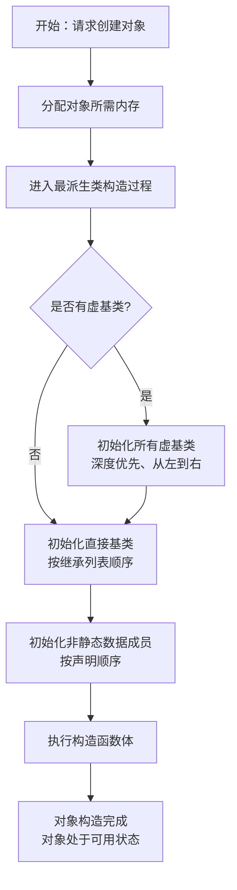
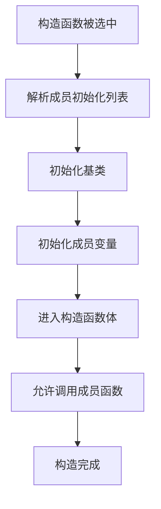
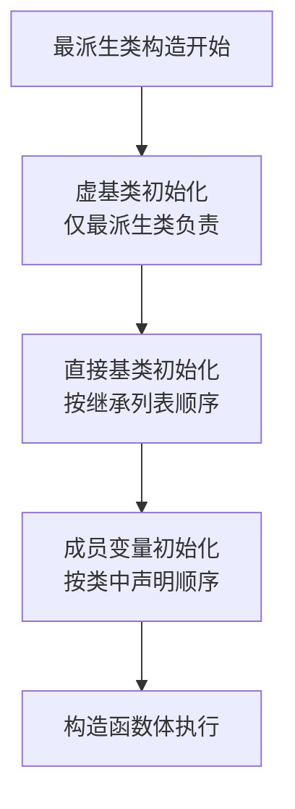
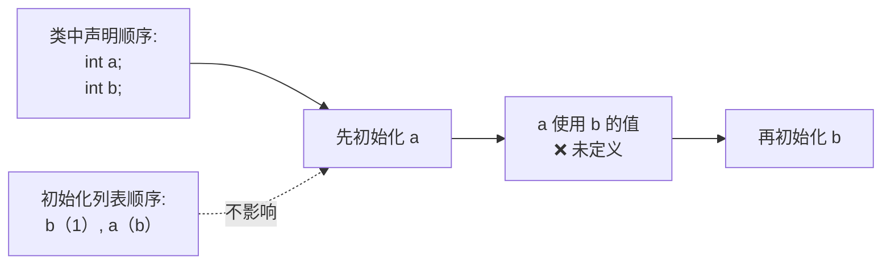
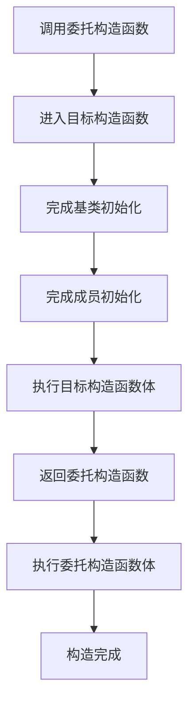
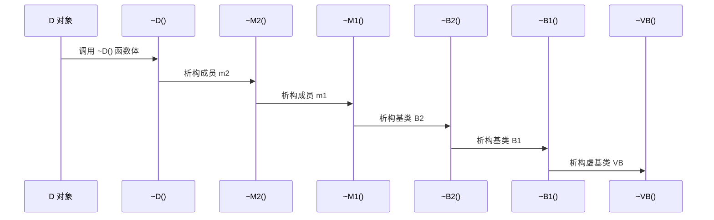

# 参考链接

[C++学习网 – 世界上最好的中文C++学习网站 (studycpp.cn)](https://www.studycpp.cn/)

[C++ 语言 - cppreference.cn - C++参考手册](https://cppreference.cn/w/cpp/language)

# 数据类型

## vector

### 增加数据

在C++中，可以使用`std::vector`来动态管理数据。要向`std::vector`中增加数据，有几种常用的方法：

1. **使用`push_back`方法**：向`vector`的末尾添加一个元素。
   
    ```cpp
    myVector.push_back(10);
    ```
2. **使用`emplace_back`方法**：在`vector`的末尾原地构造一个元素。这通常比`push_back`更高效，尤其是在处理复杂对象时。
   
    ```cpp
    myVector.emplace_back(30);
    ```
    
3. **使用`insert`方法**：在`vector`的指定位置插入一个或多个元素。
    ```cpp
    myVector.insert(myVector.begin() + 1, 40);
    ```

4. **使用`resize`方法**：调整`vector`的大小，并对新增加的元素进行初始化。
    ```cpp
     // 将vector大小调整为5，并用0初始化新增的元素
    myVector.resize(5, 0);
    ```
    
5. **使用`assign`方法**：给`vector`分配新的内容，替换其当前内容。
    ```cpp
    myVector.assign({1, 2, 3, 4, 5});
    ```

## hash map

### 引入头文件

首先需要包含 `unordered_map` 头文件：

```cpp
#include <unordered_map>
```

### 基本用法

1. **定义一个 `unordered_map`：**

   ```cpp
   std::unordered_map<int, std::string> myMap;
   ```

   这里定义了一个 `unordered_map`，键是 `int` 类型，值是 `std::string` 类型。

2. **插入元素：**

   可以通过 `[]` 运算符或 `insert` 函数来插入元素。

   ```cpp
   myMap[1] = "Hello";
   myMap[2] = "World";

   // 使用 insert 函数
   myMap.insert({3, "C++"});
   ```

3. **访问元素：**

   可以使用键访问元素，如果键不存在则会插入一个默认值。

   ```cpp
   std::string value = myMap[1]; // "Hello"
   ```

   如果不确定键是否存在，可以使用 `at` 方法，这样在键不存在时会抛出 `std::out_of_range` 异常。

   ```cpp
   try {
       std::string value = myMap.at(4); // 会抛出异常
   } catch (const std::out_of_range& e) {
       std::cout << "Key not found" << std::endl;
   }
   ```

4. **查找元素：**

   可以使用 `find` 函数来查找元素，返回一个迭代器。

   ```cpp
   auto it = myMap.find(2);
   if (it != myMap.end()) {
       std::cout << "Found: " << it->second << std::endl; // 输出 "Found: World"
   } else {
       std::cout << "Not found" << std::endl;
   }
   ```

5. **遍历 `unordered_map`：**

   可以使用范围 `for` 循环或迭代器来遍历所有键值对。

   ```cpp
   for (const auto& pair : myMap) {
       std::cout << pair.first << ": " << pair.second << std::endl;
   }
   ```

6. **删除元素：**

   可以使用 `erase` 方法删除某个键值对。

   ```cpp
   myMap.erase(1); // 删除键为 1 的元素
   ```

7. **获取大小和检查是否为空：**

   ```cpp
   std::cout << "Size: " << myMap.size() << std::endl;
   if (myMap.empty()) {
       std::cout << "Map is empty" << std::endl;
   }
   ```

# 类

## OOP

> **OOP 是一种以“对象”为核心的程序设计思想，对象把“数据（属性）”和“操作这些数据的行为（函数）”封装在一起。**

它解决的核心问题是：**如何管理复杂系统中的数据与行为的关系。**

实际有两种编程方式：

1. 过程式编程（Procedural Programming）

   - 关注点：**过程 / 函数**
   - 数据与行为分离
   - 函数“作用”在数据之上

   ```cpp
   eat(you, apple);
   ```

   特点：

   - 函数是主角
   - 数据是被动的
   - 程序员负责“正确地把函数和数据配对”

2. 面向对象编程（Object-Oriented Programming）

   - 关注点：**对象**
   - 数据和行为绑定
   - 行为是对象“做的事”

   ```cpp
   you.eat(apple);
   ```

   特点：

   - 对象是主角
   - 对象自己管理自己的数据
   - 代码结构更接近现实世界的建模方式

---

 OOP 中几个核心概念

| 概念           | 含义                           |
| -------------- | ------------------------------ |
| 类（Class）    | 对一类对象的抽象描述           |
| 对象（Object） | 类的一个实例                   |
| 属性           | 对象内部的数据                 |
| 行为           | 对象可以执行的操作（成员函数） |

OOP带来了四大特性：

1. 封装（Encapsulation）：**把数据和操作这些数据的函数放在一起，并限制外部直接访问内部细节。**

   - `class`
   - `public / protected / private`
   - 接口与实现分离

   ```cpp
   class User
   {
   public:
       void login();
   private:
       std::string password;
   };
   ```

   解决的问题：

   - 防止误用
   - 降低耦合
   - 提高模块化程度

2. 继承（Inheritance）：**在已有类型的基础上派生出新类型，实现代码复用和层次建模。**

   ```cpp
   class Animal
   {
   public:
       void eat();
   };
   
   class Dog : public Animal
   {
   public:
       void bark();
   };
   ```

   继承的三种方式：

   | 方式        | 语义             |
   | ----------- | ---------------- |
   | `public`    | is-a             |
   | `protected` | 仅对继承体系开放 |
   | `private`   | 实现复用         |

3. 多态（Polymorphism）：**同一接口，不同对象，表现出不同行为。**

   - 虚函数（`virtual`）
   - 基类指针 / 引用指向派生类对象

   ```cpp
   class Animal
   {
   public:
       virtual void speak();
   };
   
   class Dog : public Animal
   {
   public:
       void speak() override;
   };
   Animal* a = new Dog;
   a->speak(); // 调用 Dog::speak
   ```

   解决的问题

   - 消除大量 `if/else`
   - 支持运行时行为扩展

4. 抽象（Abstraction）：**只暴露“做什么”，不暴露“怎么做”。**

   - 纯虚函数
   - 抽象基类（接口）

   ```cpp
   class Shape
   {
   public:
       virtual double area() const = 0;
   };
   ```

## 声明

$$
类声明 = 定义一种用户自定义类型 + 同时定义其作用域、成员、访问规则和继承关系
$$

在 C++ 中，`class / struct / union` 并不只是“数据结构”，而是：

- 类型定义
- 名字空间（作用域）
- 访问控制单元
- 面向对象语义的载体

> [!tip]
>
> class / struct / union 的本质区别（不是“有没有构造函数”）
>
> | 关键字 | 默认成员访问 | 默认继承方式 | 本质区别         |
> | ------ | ------------ | ------------ | ---------------- |
> | class  | private      | private      | 强调封装         |
> | struct | public       | public       | 强调数据聚合     |
> | union  | public       | public       | **共享内存布局** |
>
> ⚠️ **除了默认访问权限，class 和 struct 在语言层面完全等价**

### 声明语法

声明语法为：

```cpp
class-key
[attributes]
[class-name]
[class-property-specs]
[base-clause]
{
    member-specification
};
```

我们可以通俗的将一个类的声明理解为：

```text
这是一个类型
├─ 它叫什么
├─ 能不能被继承 / 优化属性
├─ 继承了谁、怎么继承
└─ 里面有什么成员、谁能访问
```

其中每个符号的解释如下：

1. `class-key`

   其中之一是 [`class`](https://cppreference.cn/w/cpp/keyword/class)、[`struct`](https://cppreference.cn/w/cpp/keyword/struct) 和 [`union`](https://cppreference.cn/w/cpp/keyword/union)。关键字 class 和 struct 除了默认[成员访问权限](https://cppreference.cn/w/cpp/language/access)和默认[基类访问权限](https://cppreference.cn/w/cpp/language/derived_class)外是相同的。如果它是 union，则此声明引入一个[联合类型](https://cppreference.cn/w/cpp/language/union)。

2. `attr`

   任意数量的[属性](https://cppreference.cn/w/cpp/language/attributes)，可以包含 [`alignas`](https://cppreference.cn/w/cpp/language/alignas) 说明符

3. `class-head-name`

   正在定义的类的名称，可选[限定符](https://cppreference.cn/w/cpp/language/identifiers#Qualified_identifiers)

4. `class-property-specs`

   以下说明符的列表，每个说明符在每个序列中最多允许出现一次。

   | 说明符                            | 效果                                                         |
   | --------------------------------- | ------------------------------------------------------------ |
   | final                             | 指定 [虚函数](https://cppreference.cn/w/cpp/language/virtual) 不能在派生类中被覆盖，指定类[不能被派生](https://cppreference.cn/w/cpp/language/final) |
   | trivially_relocatable_if_eligible | 如果符合条件，将类标记为可平凡重定位                         |
   | replaceable_if_eligible           | 如果符合条件，将类标记为可替换                               |

   - `final`:

     ```cpp
     struct A final {};
     ```

     - **禁止任何继承**
     - 编译器可进行更激进的优化（如 devirtualization）

     📌 常用于：

     - 接口实现的最终版本
     - 不希望被滥用继承的类

   - 其他的两个参数基本不使用，所以不做赘述

5. `base-clause`

   一个或多个基类的列表，以及每个基类使用的继承模型（参见[派生类](https://cppreference.cn/w/cpp/language/derived_class)）

   ```cpp
   class D : public B1, private B2 {};
   ```

   1. **继承的是“子对象”，不是拷贝代码**
   2. 访问方式（public / protected / private）：
      - 控制 **外部是否能通过 D 当成 B 使用**
   3. 是否 `virtual`：
      - 决定是否共享基类子对象
      - 直接影响 **对象布局 + 构造/析构顺序**

6. `member-specification`

   访问说明符、成员对象和成员函数声明和定义的列表

下面使用几个例子来展示申明一个类的写法：

1. **基本命名类（`class` 和 `struct` 对比）**

   ```cpp
   // 使用 class（默认成员访问权限为 private）
   class Widget {
       int x;          // 默认 private
   public:
       void set(int v) { x = v; }
       int get() const { return x; }
   };
   
   // 使用 struct（默认成员访问权限为 public）
   struct Point {
       int x, y;       // 默认 public
       void move(int dx, int dy) { x += dx; y += dy; }
   };
   ```

   `class` 和 `struct` 的唯一区别是默认访问权限。

2. **带属性和 `final` 的类**

   ```cpp
   // 使用 alignas 和 final
   class alignas(16) Immutable final {  // 16 字节对齐，且不可继承
       const int value;
   public:
       Immutable(int v) : value(v) {}
       int get() const { return value; }
   };
   
   // 尝试继承会报错
   // class Derived : Immutable {};  // 错误：Immutable 是 final
   ```

3. **匿名类（通常用于嵌套或联合）**

   ```cpp
   // 匿名类（常用于联合或嵌套场景）
   struct Outer {
       struct {        // 匿名嵌套类
           int a, b;
       } inner;        // 直接声明对象 inner
   };
   
   Outer o;
   o.inner.a = 42;     // 访问匿名类的成员
   
   // 匿名联合
   union {
       int i;
       float f;
   } data;
   data.i = 42;        // 通过联合成员访问
   ```

4. **继承和基类列表**

   ```cpp
   class Base {
   public:
       virtual void foo() {}
   };
   
   class Derived : public Base {  // 公有继承
       void foo() override {}     // 覆盖虚函数
   };
   
   // 多重继承
   struct A { int a; };
   struct B { int b; };
   struct C : A, B { int c; };   // 继承 A 和 B
   ```

5. **带限定名称的类（嵌套或命名空间内）**

   ```cpp
   namespace N {
       class Inner {  // 限定名称为 N::Inner
           int x;
       };
   }
   
   class Outer::Nested {  // 前置声明需存在 class Outer { class Nested; };
       int y;
   };
   ```

### 成员规范

1. 数据成员（状态）

   ```cpp
   int x;
   static int y;
   int a[10] = {1,2};
   ```

   - 非静态成员 → 属于对象
   - 静态成员 → 属于类
   - 默认成员初始化器 ≠ 构造函数初始化

2. 成员函数（行为）

   ```cpp
   void f();
   virtual void g() = 0;
   ```

   - 类内定义 → 自动 inline
   - `virtual` 影响 **动态绑定**
   - 纯虚函数 → 抽象类

3. 类型成员（类型系统的一部分）

   ```cpp
   using value_type = T;
   typedef int* pointer;
   enum { A, B };
   struct Nested {};
   ```

   📌 这使得：

   - 类本身成为一个 **小型类型命名空间**
   - 支撑 STL 风格的泛型设计

4. 访问控制与语言工具

   ```cpp
   public:
   protected:
   private:
   using Base::member;
   static_assert(...);
   ```

   这些**不产生对象成员**，但**强烈影响语义**


### 前向声明

前向声明实际上是为了**打破类型之间的编译依赖环**

```cpp
class B;   // 不完整类型
class A {
    B* p;  // OK
};
```

但是需要注意的是，类型的支持程度如下：

| 可以             | 不可以   |
| ---------------- | -------- |
| 指针 / 引用      | 成员对象 |
| 函数参数         | sizeof   |
| 返回类型（指针） | 访问成员 |

我们可以先申明类，再去写类的定义：

```cpp
class-key attr identifier；
```

声明了一个将在该作用域中稍后定义的类类型。在定义出现之前，此类名具有[不完整类型](https://cppreference.cn/w/cpp/language/incomplete_type)。这允许类之间相互引用

```cpp
class Vector; // 前向申明
 
class Matrix
{
    // ...
    friend Vector operator*(const Matrix&, const Vector&);	//这里就已经在用前向申明的类了
};
 
class Vector
{
    // ...
    friend Vector operator*(const Matrix&, const Vector&);
};
```

如果前向声明出现在局部作用域中，它会*隐藏*之前声明的类、变量、函数以及在封闭作用域中可能出现的同名所有其他声明。

```cpp
struct s { int a; }; // 定义了一个全局的结构体s，包含一个int成员a
struct s; // 这在全局作用域中什么都不做，因为s已经被定义了
 
void g()
{
    struct s; // 前向声明一个新的、局部的结构体s，这会隐藏全局的结构体s，直到这个块结束
    
    s* p; // 这个指针指向的是局部声明的结构体s，不是全局的那个
    
    struct s { char* p; }; // 定义局部结构体s的具体内容
}
```

请注意，新的类名也可以通过作为另一个声明的一部分出现的[详细类型说明符](https://cppreference.cn/w/cpp/language/elaborated_type_specifier)引入，但前提是[名称查找](https://cppreference.cn/w/cpp/language/lookup)无法找到之前声明的同名类。

```cpp
class U;// 前向声明全局类U，但尚未定义它的成员。此时 U 是一个不完全类型，只能用于声明指针或引用，不能实例化对象。
 
namespace ns
{
    class Y f(class T p); // class Y 和 class T 是详细类型说明符。由于 ns::Y 和 ns::T 在命名空间 ns 中尚未声明，编译器会隐式前向声明它们。
 
    class U f(); //这里的 class U 会触发名称查找，编译器先在 ns 中查找 U，没找到。接着在外部作用域（全局）查找，找到 ::U。因此，这里的 U 引用的是全局的 ::U，不会隐式声明新的 ns::U。
 
    Y* p;	//此时Y并不是一个不完整类型，还是不能实例化对象。
    T* q;
}
```

### 局部类


```cpp
void f() {
    struct Local {};
}
```

设计目的只有一个：**作为“临时策略 / 仿函数 / 实现细节”存在**

因此它：

- ❌ 不能有静态成员
- ❌ 不能当模板参数
- ❌ 没有链接性
- ✅ 能访问外层作用域名字

📌 STL 算法里的仿函数就是典型应用

## 成员

### 非静态数据成员

#### 声明

基本的申明规则为：

1. **合法声明形式**：

   ```cpp
   class Widget {
       int value;                  // 基础类型
       std::string name{"default"};// 带默认值
       double* ptr;                // 指针
       int& ref = value;           // 引用（必须初始化）
       int arr[3]{1,2,3};          // 数组
       struct { int x,y; } point;  // 匿名结构体成员
       unsigned bits : 4;          // 位域
   };
   ```

   

2. **禁止的声明**：

   ```cpp
   class Invalid {
       extern int x;       // ❌ 不允许extern
       register int y;     // ❌ 不允许register
       thread_local int z; // ❌ 非静态成员不能用thread_local
       class Incomplete;   // ❌ 不能有不完整类型成员
       Invalid self;       // ❌ 不能包含自身类型（指针/引用可以）
       auto unknown;       // ❌ 不能用auto推导类型
   };
   ```

---

对于特殊的成员会有一些处理：

1. **引用成员**：

   - 必须通过构造函数初始化列表初始化

   - 可能不占用存储空间（实现定义）

     ```cpp
      class RefHolder {
            int& ref;
        public:
            RefHolder(int& v) : ref(v) {}
        };
     ```

2. **位域成员**：

   1. 指定比特位数节省空间

   2. 实际布局取决于实现

      ```cpp
      class Packet {
             unsigned type : 4;  // 4位
             unsigned flag : 1;  // 1位
             unsigned : 3;       // 未命名填充位
         };
      ```

---

内存布局有以下规则：

1. **C++23前**：

   - 相同访问权限的成员按声明顺序排列

   - 不同访问权限的成员顺序未指定

     ```cpp
     class Pre23 {
         public:
         	int a;    // 可能地址最低
         private:
         	int b;    // 可能被重新排列
         public:
         	int c;    // 保证在a之后
     };
     ```

2. **C++23起**：

   1. 强制所有成员按声明顺序排列

   2. 仍允许不同访问权限的成员间插入填充

      ```cpp
      class Post23 {
          public:
          	int a;    // 地址最低
          private:
          	int b;    // 必须在a后
          public:
          	int c;    // 必须在b后
      };
      ```

#### 成员初始化


非静态数据成员可以通过以下两种方式之一进行初始化：

1. 在构造函数的[成员初始化列表](https://cppreference.cn/w/cpp/language/constructor)中。

   ```cpp
   struct S
   {
       int n;
       std::string s;
       S() : n(7) {} //直接初始化n为7，默认初始化s
   };
   ```

2. 通过**默认成员初始化器**，它是在成员声明中包含的大括号或等号[初始化器](https://cppreference.cn/w/cpp/language/initialization)，并在构造函数的成员初始化列表中省略该成员时使用。

   ```cpp
   struct S
   {
       int n = 7;	// 等号初始化器
       std::string s{'a', 'b', 'c'};	// 括号初始化器
       S() {} // 在此构造函数中会自动复制n和s变量到实体中
   };
   ```

   - 如果成员具有默认成员初始化器并且也出现在构造函数的成员初始化列表中，则该构造函数的默认成员初始化器将被忽略。

     ```cpp
     #include <iostream>
      
     int x = 0;
     struct S
     {
         int n = ++x;
         S() {}                 // 使用默认变量
         S(int arg) : n(arg) {} // 成员初始化
     };
      
     int main()
     {
         std::cout << x << '\n'; // 打印0
         S s1;                   // 使用默认构造函数
         std::cout << x << '\n'; // 打印1
         S s2(7);                // 使用自定义构造函数
         std::cout << x << '\n'; // 打印1
     }
     ```

   - 位域成员不允许使用默认成员初始化器。

   - 数组类型的成员不能从成员初始化器中推断其大小

     ```cpp
     struct X
     {
         int a[] = {1, 2, 3};  // error
         int b[3] = {1, 2, 3}; // OK
     };
     ```

   - 默认成员初始化器不允许导致隐式定义封闭类的默认[默认构造函数](https://cppreference.cn/w/cpp/language/default_constructor)或该构造函数的异常规范。

     ```cpp
     struct node
     {
         node* p = new node; // 错误：使用了隐式或默认的 node::node()
     };
     ```

     这个会导致循环依赖的问题：成员 `p` 的初始化需要先构造 `node` 对象，构造 `node` 对象又需要先初始化 `p` 成员，形成无限递归的构造循环。

   - 引用成员不能在默认成员初始化器中绑定到临时对象（注意：[成员初始化列表](https://cppreference.cn/w/cpp/language/constructor#Explanation)也存在相同的规则），**引用成员初始化基本规则**是必须**在构造函数初始化列表中初始化**，**不能**仅靠默认成员初始化器（类内初始化）绑定到临时对象

     ```cpp
     struct A
     {
         A() = default;     // 默认构造函数 OK
         A(int v) : v(v) {} // 带参构造函数 OK
         const int& v = 42; // 默认成员初始化器（危险！）  OK
     };
      
     A a1;   // 错误：尝试将引用v绑定到临时对象42
     		// 使用默认构造函数 A()
     		// 没有在初始化列表中初始化 v
     		// 回退到默认成员初始化器 = 42
     		// 出错，将引用绑定到临时整数字面量（右值42）
     
     
     A a2(1); 	// 编译通过但产生悬垂引用
              	// 使用 A(int) 构造函数
     			// 初始化列表 : v(v) 将引用绑定到参数 v（局部变量）
     			// 问题：构造函数结束后参数 v 被销毁，成员 v 成为悬垂引用
     			// 默认成员初始化器 = 42 被忽略（因为 v 已在初始化列表中出现）
     ```

   - 如果引用成员由其默认成员初始化器初始化成员具有默认成员初始化器并且其一个[潜在求值](https://cppreference.cn/w/cpp/language/expressions#Potentially-evaluated_expressions)子表达式是会使用该默认成员初始化器的[聚合初始化](https://cppreference.cn/w/cpp/language/aggregate_initialization)，则程序格式错误。

     ```cpp
     struct A;
     extern A a;	// 前向声明和外部声明
      
     struct A
     {
         const A& a1{A{a, a}}; // 合法
         const A& a2{A{}};     // 非法
     };
      
     A a{a, a};                // 合法
     ```

     - 当引用成员通过默认成员初始化器初始化时
     - 如果该初始化涉及聚合初始化
     - 且聚合初始化会直接或间接使用这个默认成员初始化器
     - 则程序格式错误（ill-formed）

#### 用法

非静态数据成员或非静态成员函数的名称只能出现在以下三种情况中：

1) 作为类成员访问表达式的一部分，其中该类具有此成员或派生自具有此成员的类，包括当非静态成员名称在允许[`this`](https://cppreference.cn/w/cpp/language/this)的任何上下文中（在成员函数体内部、在成员初始化列表中、在类内默认成员初始化器中）使用时出现的隐式this->成员访问表达式。

   ```cpp
   struct S {
       int m;
       int n;
       int x = m;  // ✅ 默认初始化器中使用成员变量
       
       S(int i) : m(i), n(m)  // ✅ 初始化列表中使用成员
       {
           this->f();  // ✅ 显式成员访问
           f();        // ✅ 隐式成员访问
       }
       
       void f() { /*...*/ }
   };
   ```

2) 用于形成[指向非静态成员的指针](https://cppreference.cn/w/cpp/language/pointer)。

   ```cpp
   struct S {
       int m;       // 数据成员
       void f();    // 成员函数
   };
   
   // 数据成员指针
   int S::*p = &S::m;       // p 是指向 S 的 int 类型成员的指针
   
   // 成员函数指针
   void (S::*fp)() = &S::f; // fp 是指向 S 的无参成员函数的指针
   ```

3) （仅限数据成员，不包括成员函数）在[未求值操作数](https://cppreference.cn/w/cpp/language/expressions#Unevaluated_expressions)中使用时。

   ```cpp
   struct S
   {
       int m;
       static const std::size_t sz = sizeof m; // OK: m in unevaluated operand
   };
    
   std::size_t j = sizeof(S::m + 42); // OK: even though there is no "this" object for m
   ```

### 非静态成员函数

简单来说，非静态成员函数就是**属于对象的函数**。

- **对比静态函数：** 静态函数（`static`）属于“类”本身，像是个全局工具；而非静态函数必须通过“对象”来调用，因为它要操作具体对象的数据。
- **核心特点：** 每个非静态成员函数内部都有一个隐藏的宝物——`this` 指针，它指向当前正在调用这个函数的对象。

其中有以下特性：

1. `this` 指针的隐式转换

   当你编写 `n = 1;` 时，编译器在幕后其实把它变成了 `this->n = 1;`，这确保函数知道它现在改的是哪个对象的数据。

2. CV 限定符（const 和 volatile）

   - **`const` 成员函数：** 承诺“我只读，不改对象的数据”。

   - **重载：** 你可以同时定义一个 `const` 版本和一个非 `const` 版本的同名函数。

     ```cpp
     struct Array {
         int data[10];
         int operator[](int i) const { return data[i]; } // 常量对象调用，只读
         int& operator[](int i) { return data[i]; }      // 非常量对象调用，可改
     };
     ```

3. 引用限定符 (Ref-qualifiers) `&` 和 `&&`

   这是 C++11 引入的，用来限制函数只能由“左值”或“右值”调用。

   - `void f() &` : 只能由有名字的变量（左值）调用。

   - `void f() &&` : 只能由临时对象（右值）调用。

   - 防止你意外给一个马上就要销毁的临时对象赋值。

     ```cpp
     #include <iostream>
     
     struct S {
         void f() &  { std::cout << "我在为持久的变量服务 (Lvalue)\n"; }
         void f() && { std::cout << "我在为临时的对象服务 (Rvalue)\n"; }
     };
     
     int main() {
         S s;
         s.f();            // s 有名字，调用 & 版本
         S().f();          // S() 是临时产生的，调用 && 版本
         std::move(s).f(); // 把 s 强制当成临时对象，调用 && 版本
     }
     ```

     


| **特性分类**        | **语法示例**          | **核心目的**                               |
| ------------------- | --------------------- | ------------------------------------------ |
| **基础调用**        | `obj.func()`          | 操作特定实例的数据                         |
| **Const 限定**      | `void f() const`      | 保证不修改对象成员，增加代码安全性         |
| **虚函数**          | `virtual void f()`    | 实现多态（子类可以重写父类行为）           |
| **引用限定**        | `void f() &&`         | 区分临时对象和持久对象，优化性能           |
| **显式对象(C++23)** | `void f(this X self)` | 简化模板编写，让成员函数像普通函数一样工作 |

> [!note]
>
> 需要注意的是：
>
> 1. **未定义行为：** 永远不要在空指针（`nullptr`）上调用非静态成员函数。虽然有时看起来能跑，但这是极度危险的违规操作。
> 2. **构造/析构函数：** 虽然它们也是成员函数，但它们有特殊的语法（没有返回值），不遵循普通的非静态成员函数查找规则。
> 3. **内联定义：** 在类内部直接写出函数体的（如 `int f() { return 1; }`）自动被视为 `inline`，有助于提高性能。

### 静态成员


1. 静态成员的基本特点

   1. **不属于单个对象**：
      - 普通成员：每个对象都有自己的副本，每个对象独有（如人的姓名）
      - 静态成员：所有对象共享同一个副本，所有对象共享（如人的总人口数）
   2. **生命周期**：
      - 在程序启动时创建，程序结束时销毁
      - 与类的对象是否存在无关
   3. **访问方式**：
      - 可以通过类名直接访问（`类名::静态成员`）
      - 也可以通过对象访问（`对象.静态成员`）

2. 静态数据成员

   ```cpp
   class Counter {
   public:
       static int count;  // 声明静态成员
       Counter() { count++; }
   };
   
   int Counter::count = 0;  // 定义并初始化（必须在类外）
   
   int main() {
       Counter c1, c2, c3;
       cout << Counter::count;  // 输出3（共享计数）
   }
   ```

   - 类内声明，类外定义（需要类型和类名限定）
   - 所有对象共享同一个count
   - 常用于统计对象数量、共享配置等场景

3.  静态成员函数

   ```cpp
   class MathUtils {
   public:
       static int add(int a, int b) {  // 静态成员函数
           return a + b;
       }
   };
   
   int main() {
       cout << MathUtils::add(2, 3);  // 无需创建对象
   }
   ```

   - 不能访问非静态成员（因为没有this指针）
   - 不能使用const/volatile/virtual/引用类型限定
   - 常用于工具类函数

4. 静态成员的初始化

   ```cpp
   class MyClass {
   public:
       static const int x = 10;  // 只有const静态整型可以类内初始化
       static double y;          // 其他类型必须类外定义
   };
   
   double MyClass::y = 3.14;     // 正确初始化方式
   ```

## 访问说明符


访问说明符**用于控制：谁可以访问类中的哪些成员。**

C++ 中有三种访问说明符：

| 关键字      | 含义                   |
| ----------- | ---------------------- |
| `public`    | 公有：任何地方都能访问 |
| `protected` | 受保护：派生类可以访问 |
| `private`   | 私有：只能类自己访问   |

它们主要出现在 **两个位置**：

1. **类 / 结构体 / 联合体的成员区**
2. **派生类声明中的基类列表（继承方式）**

成员区的基本语法为

```cpp
class A
{
public:
    int x;      // 公有成员
protected:
    int y;      // 保护成员
private:
    int z;      // 私有成员
};
```

**规则**：

- 一个访问说明符**影响它后面出现的所有成员**
- 可以出现**任意次、任意顺序**
- 只影响“访问权限”，不影响“是否存在”

---

1. `public` 成员 —— 对外接口

   1. **任何地方**都可以访问

   2. 构成类的“公共 API”

      ```cpp
      class S
      {
      public:
          int n;
          void f();
      };
      
      S s;
      s.n = 1;     // OK
      s.f();       // OK
      ```

      > [!tip]
      >
      > **设计含义**：“这是我希望类的使用者看到和使用的东西。”

2. `protected` 成员 —— 给子类用

   1. 本类的成员函数 / 友元可以访问

   2. **派生类的成员函数 / 友元**，但**只能通过派生类对象访问**

      ```cpp
      struct Base
      {
      protected:
          int i;
      };
      
      struct Derived : Base
      {
          void f(Derived& d, Base& b)
          {
              ++i;     // OK（this 是 Derived）
              ++d.i;   // OK（d 是 Derived）
              // ++b.i; // ❌ 错误（b 是 Base）
          }
      };
      ```

      > [!tip]
      >
      > 派生类只能通过 **“派生类对象”** 访问基类的 protected 成员，❌ 不能通过 Base 类型对象访问，这是为了防止“越权修改其他派生类的内部状态”。

3. `private` 成员 —— 完全封装

   1. 本类的成员函数可以访问

   2. 本类的友元可以访问

      ```cpp
      class S
      {
      private:
          int n;
      public:
          S(const S& other) : n(other.n) {} // OK
      };
      
      S a, b;
      // b.n = 3; // ❌ 错误
      ```

      > [!tip]
      >
      > - 不区分“是不是同一个对象”
      > - 只要是在 `S` 的成员函数里，就能访问任何 `S` 对象的私有成员

> [!important]
>
> - public：给“任何人”用
> - protected：给“子类”用
> - private：给“自己”用

不同类型有着不同的默认访问权限的：

| 类型     | 默认成员访问 | 默认继承方式 |
| -------- | ------------ | ------------ |
| `class`  | `private`    | `private`    |
| `struct` | `public`     | `public`     |
| `union`  | `public`     | —            |

```cpp
class A
{
    int x; // private
};

struct B
{
    int y; // public
};
```

---

在继承时，访问说明符也会限制访问权限

```cpp
class Derived : public Base {};
class Derived : protected Base {};
class Derived : private Base {};
```

这里的访问说明符主要控制的是**基类成员在派生类中“变成什么权限”**，⚠️ **它不影响基类内部的访问规则**

假设 `Base` 中有：

```cpp
public:    int pub;
protected: int pro;
private:   int pri;
```

那么在继承时：

| 继承方式    | `pub` 在 Derived 中 | `pro` 在 Derived 中 | `pri`    |
| ----------- | ------------------- | ------------------- | -------- |
| `public`    | public              | protected           | 不可访问 |
| `protected` | protected           | protected           | 不可访问 |
| `private`   | private             | private             | 不可访问 |


> **铁律**：❗ **基类的 private 成员，无论如何都不能被派生类访问**

> [!tip]
>
> 为什么要有 protected / private 继承？
>
> **private 继承表示一种“实现复用（is-implemented-in-terms-of）关系”，而不是“类型关系（is-a）”。**
>
> 换句话说：
>
> - `public` 继承：**语义上的“是一个”**
>
>   - **“Derived 是一种 Base”**
>
>   - 支持多态
>
>     ```cpp
>     void foo(Animal& a);
>     
>     Dog d;
>     foo(d); // OK（多态）
>     ```
>
>   - 满足“is-a”关系
>
>     ```cpp
>     class Animal
>     {
>     public:
>         virtual void speak();
>     };
>           
>     class Dog : public Animal {};
>     ```
>
>     这意味着：
>
>     1. **Dog 是一种 Animal**
>     2. **任何需要 Animal 的地方，都可以用 Dog**
>
>     > [!note]
>     >
>     > 派生类对象可以当作基类对象使用
>
> - `private` 继承：**实现上的“用一下”**
>
>   - **“Derived 用到了 Base 的实现，但不是 Base”**
>
>     看同样的代码，换成 private：
>
>     ```cpp
>     class Dog : private Animal {};
>     ```
>
>     现在发生了**三个根本变化**。
>
>     1. 对外：Dog 不再是 Animal
>
>        ```cpp
>        Dog d;
>        // Animal* p = &d; // ❌ 编译错误
>        ```
>
>        **外部代码根本不知道 Dog 继承了 Animal**(“基类接口不会暴露给外部”)
>
>     2. 对内：Dog 仍然可以使用 Animal 的实现
>
>        ```cpp
>        class Dog : private Animal
>        {
>        public:
>            void bark()
>            {
>                speak(); // OK：Animal 的 public / protected 成员
>            }
>        };
>        ```
>
>        说明：
>
>        - Dog **内部可以复用 Animal 的代码**
>        - 但 **Dog 的使用者看不到 Animal 的任何接口**
>
>     3. 语义变化
>
>        现在的关系是：
>
>        - **Dog 不是 Animal**
>        - *Dog 只是“用 Animal 的功能实现自己”**
>
>        这就不是 is-a，而是**is-implemented-in-terms-of**
>
>   - 像“组合的替代方案”
>
>   - 基类接口不会暴露给外部

多继承时，取“权限最高的路径”

```cpp
class A : private virtual W {};
class B : public  virtual W {};
class C : public A, public B
{
    void f()
    {
        W::f(); // OK（通过 B）
    }
};
```


## 特殊成员函数

### 构造函数

#### 概述


构造函数是**“负责初始化对象状态”的特殊成员函数。**它的职责只有一个：**把对象从“一块原始内存”变成“一个合法可用的对象”。**

构造函数的基本特征为：

| 特性           | 说明                 |
| -------------- | -------------------- |
| 名字           | 和类名相同           |
| 返回类型       | **没有**             |
| 是否能直接调用 | ❌ 不能               |
| 调用时机       | 对象初始化时自动调用 |
| 是否静态       | ❌ 不能是 static      |

```cpp
struct S
{
    S();      // 构造函数
    S(int x); // 构造函数
};
```

构造函数有以下几类：

| 类型           | 含义                    |
| -------------- | ----------------------- |
| 默认构造函数   | `S()`                   |
| 转换构造函数   | `S(int)`（非 explicit） |
| 拷贝构造函数   | `S(const S&)`           |
| 移动构造函数   | `S(S&&)`                |
| constexpr 构造 | 可用于常量表达式        |
| explicit 构造  | 禁止隐式转换            |

构造函数做了两件事，当你写：

```cpp
S(int x)
{
    n = x;
}
```

而**真实发生的是：**

1. **先初始化成员**
2. **再执行构造函数体**

⚠️ 成员的初始化**不在函数体里发生**。

构造函数有以下几条铁律;

1. 成员初始化发生在构造函数体之前
2. const / 引用 / 基类必须用初始化列表
3. 初始化顺序只看“声明顺序”
4. 初始化列表顺序≠初始化顺序
5. 默认成员初始化器会被初始化列表覆盖
6. 委托构造是消除重复初始化的正确方式

#### 成员初始化列表

成员初始化列表**是“指定子对象如何被初始化”的唯一正确位置。**

```cpp
S(int x) : n(x) {}
```

它负责初始化：

- 直接基类
- 虚基类
- 非静态数据成员

> [!tip] 
>
> 为什么不能只在函数体里赋值？
>
> 因为有些成员：❌ **根本不能先默认构造再赋值**
>
> 必须用初始化列表的成员类型
>
> | 成员类型               | 原因               |
> | ---------------------- | ------------------ |
> | `const` 成员           | 不能赋值           |
> | 引用成员               | 必须在初始化时绑定 |
> | 无默认构造函数的类成员 | 无法默认构造       |
> | 基类                   | 必须先构造         |
>
> ```cpp
> struct A
> {
>     const int x;
>     int& r;
> 
>     A(int& v) : x(10), r(v) {} // 必须
> };
> ```
>
> 




成员初始化列表的语法为：

```cpp
Constructor(...)
    : member(expr)
    , base(expr)
    , member{expr}
{}
```

以上的三种形式的含义分别为：

| 形式           | 说明               |
| -------------- | ------------------ |
| `member(expr)` | 直接初始化         |
| `member{expr}` | 列表初始化（推荐） |
| `Base(expr)`   | 初始化基类         |

1. 初始化基类

   ```cpp
   struct Derived : Base
   {
       Derived() : Base(123) {}
   };
   ```

   如果不写：

   - **直接基类**：默认初始化
   - 不是 `Base()` 的意思，而是 *default-init*

2. 直接初始化

   ```cpp
   class BasicTypes {
       int x;
       float y;
   public:
       BasicTypes() : x(0), y(3.14f) {}  // 直接赋值
   };
   ```

   允许隐式 / 窄化转换，按普通构造函数规则匹配

3. 列表初始化

   ```
   class BasicTypes {
       int x;
       float y;
   public:
       BasicTypes() : x{0}, y{3.14f} {}  // 直接赋值
   };
   ```

   禁止窄化转换，优先匹配 `initializer_list`，可进行聚合和值初始化

成员初始化列表一般推荐`{}`。



#### 初始化顺序

❗ 真实初始化顺序（与列表顺序无关），**永远遵循下面顺序：**

1. **虚基类**（最派生类时）
2. **直接基类**（按继承列表顺序）
3. **成员变量**（按声明顺序）
4. **构造函数体**




```cpp
struct X
{
    int a;
    int b;

    X() : b(1), a(b) {} // ❌ a 先初始化
};
```

真实顺序：

1. `a` 初始化（使用未定义的 b）
2. `b` 初始化

👉 **初始化列表的顺序不会改变初始化顺序**

正确写法（工程规则）：**初始化列表顺序 = 成员声明顺序**




#### 委托构造函数

委托构造函数是**一个构造函数调用同一个类的另一个构造函数**

```cpp
class Foo
{
public:
    Foo(char x, int y) {}
    Foo(int y) : Foo('a', y) {}
};
```

委托构造函数的规则为：

- 初始化列表 **只能有一个成员**
- 不能递归
- 目标构造函数先执行




### 析构函数

#### 概述

析构函数**是对象生命周期的“收尾阶段”，负责撤销构造阶段建立的一切语义与资源。**它不是“释放内存”的函数，而是**释放对象所拥有的资源**（RAII）。

析构函数在**对象生命周期结束**时被隐式调用，包括：

| 存储期         | 析构时机       |
| -------------- | -------------- |
| 静态存储期     | 程序结束       |
| 线程局部存储期 | 线程结束       |
| 自动存储期     | 作用域结束     |
| 动态存储期     | `delete`       |
| 临时对象       | 完整表达式结束 |
| 异常展开       | 栈回溯过程中   |

📌 **析构 ≠ delete**，`delete` = 调用析构函数 + 释放内存

析构函数的语法规则为：

```cpp
~T();
```

- **没有返回值**
- **参数列表必须为空**
- 不能是协程
- 可 `virtual`
- 可 `= default` / `= delete`
- **可以重载（准析构函数）**

#### 析构函数类型

##### 准析构函数


C++20 中允许**多个析构函数声明**：

```cpp
template<class T>
struct A {
    ~A() requires std::is_integral_v<T>;
    ~A() requires std::is_pointer_v<T>;
    ~A();
};
```

- 类中**可以有多个准析构函数**
- **最终只能有一个被选为真正的析构函数**
- 在类定义结束时，对 **空参数列表的准析构函数做重载决议**
- **选中的那个就是析构函数**

📌 **析构函数选择不发生 ODR 使用**
→ 即使是 `= delete` 也能被“选中”，但一旦真正调用就非良构


##### 隐式析构函数

如果你 **没有声明任何析构函数**：

```cpp
struct S {
    int x;
};
```

编译器会自动生成：

```cpp
~S() noexcept;
```

隐式析构函数有以下关键性质：

- `public`
- `inline`
- **通常是 `noexcept(true)`**
- 函数体为空
- 会**递归调用成员和基类的析构函数**

##### 平凡析构函数

平凡析构函数的条件为：

- 非用户提供（你没写）
- 非虚
- 所有成员 / 基类析构函数平凡

它表示

- 什么都不做
- **对象销毁 = 直接释放内存**
- POD 类型都是平凡可销毁的

📌 **这是 STL 能高效 `memcpy` / `realloc` 的基础**

##### 虚析构函数

虚析构函数是面向对象的生死线

```cpp
Base* p = new Derived;
delete p; // ❌ UB，除非 Base::~Base 是 virtual
```

设计准则为：

- **一个类如果可能被当作基类通过指针删除：**
  - 析构函数 **public + virtual**
- **如果不允许多态删除：**
  - 析构函数 **protected + non-virtual**

##### 纯虚析构函数

纯虚析构函数是抽象类技巧

```cpp
struct Base {
    virtual ~Base() = 0;
};
Base::~Base() {} // 必须有定义
```

原因是**派生类析构时，一定会调用基类析构函数**

##### 删除析构函数

析构函数会被隐式定义为 `= delete`，如果：

- 成员或基类的析构函数不可访问或被删除
- 联合体成员规则不满足
- 虚析构函数对应的 `operator delete` 不可访问 / 歧义

📌 **一句话**：**你不能销毁一个“不能被安全销毁的对象”**


#### 析构顺序

析构顺序 = 构造的严格逆序

1. 析构函数体
2. 成员（声明的逆序）
3. 非虚基类（构造的逆序）
4. 虚基类（最终派生类负责）

```cpp
struct VB { ~VB(); };

struct B1 : virtual VB{ ~B1(); };
struct B2 : virtual VB{ ~B2(); };

struct M1 { ~M1(); };
struct M2 { ~M2(); };

struct D : public B1, public B2 {
    M1 m1;
    M2 m2;
    ~D();
};

```

假设：

- `VB` 是虚基类
- `D` 是**最派生类**

当 `D` 对象生命周期结束时，**真实执行顺序是：**

1. 执行 `~D()` 函数体
2. 析构 **非静态成员**（按**声明顺序的逆序**）
3. 析构 **直接非虚基类**（按**继承顺序的逆序**）
4. 析构 **虚基类**（仅最派生类负责）



> - 析构函数 = 生命周期结束钩子
> - 构造 → 析构是严格配对的
> - 析构顺序 = 构造逆序
> - 多态删除 ⇒ virtual 析构
> - 析构函数不应抛异常
> - 平凡析构 = 零成本抽象

### 虚函数


`virtual` **的唯一目的是：让“通过基类指针/引用调用成员函数”时，根据“对象的真实动态类型”决定调用哪个函数实现。**这就是 **动态分派（dynamic dispatch）**。

下面可以看一个成员变量定义：

```cpp
Base* p = new Derived;
```

这里同时存在两种“类型”：

| 名称         | 含义                            |
| ------------ | ------------------------------- |
| **静态类型** | 编译器看到的类型：`Base*`       |
| **动态类型** | 运行时对象的真实类型：`Derived` |

那么虚函数和非虚函数的区别在于：

1. 非虚函数
   - **只看静态类型**
   - 编译期决定调用哪个函数
2. 虚函数
   - **看动态类型**
   - 运行期决定调用哪个函数


必须 **同时满足三个条件**，才会产生虚调用：

1. 函数是 `virtual`
2. 通过 **基类指针或基类引用** 调用
3. 没有使用作用域限定（`Base::f()`）

```cpp
Base& r = derived;
r.f();          // 虚调用
r.Base::f();    // 非虚调用（强制静态绑定）
```

#### 纯虚函数

一个**纯虚函数**是指：**在虚函数声明中，使用纯说明符 `= 0` 的虚函数**

形式为：

```cpp
虚函数声明符 [override / final] = 0;
```

例如：

```cpp
struct Base {
    virtual void f() = 0;
};
```

这里的 `= 0`：

- 不是赋值
- 不是默认值
- 是**语法关键字级别的“纯说明符（pure-specifier）”**

> [!note] 
>
> 纯说明符的语法位置
>
> ```cpp
> virtual int f() = 0;                // OK
> virtual int f() override = 0;       // OK
> virtual int f() = 0 override;       // ❌ 非法
> ```
>
> 并且：
>
> - ❌ **不能**出现在函数定义中
> - ❌ **不能**出现在友元函数声明中
>
> ```cpp
> virtual int f() = 0 {}  // 错误
> ```

需要注意的是：纯虚函数 ≠ 没有实现

> **纯虚函数可以有定义**

```cpp
struct A {
    virtual void f() = 0;
};

void A::f() {
    std::cout << "A::f\n";
}
```

但是：

- 该函数 **仍然是纯虚的**
- 该类 **仍然是抽象类**
- 不能通过虚调用来调用它

那么纯虚函数的定义有什么用？

用途只有一个：

> **供派生类显式调用（非虚调用）**

```cpp
struct B : A {
    void f() override {
        A::f(); // 合法，非虚调用
    }
};
```

#### 协变返回类型

**协变返回类型**是指：当派生类成员函数**重写**基类的虚函数时，**允许返回一个“比基类返回类型更具体”的类型**，前提是该返回类型与基类返回类型存在**合法的继承关系**。这是 **虚函数重写规则的一个例外**。

如果没有协变返回类型：

```cpp
struct Base {
    virtual Base* clone() const;
};

struct Derived : Base {
    Derived* clone() const; // 如果不允许协变，这是非法的
};
```

你将被迫写成：

```cpp
Base* clone() const;
```

这会导致：

- 调用者**失去派生类的类型信息**
- 必须手动 `static_cast` / `dynamic_cast`
- 接口表达能力下降

**协变返回类型的目的**：在保持多态语义正确的前提下，让派生类接口更“精确”。

协变返回类型的正式规则（必须全部满足）为：

假设：`Base::f()` 被 `Derived::f()` 重写，那么返回类型 **可以不同**，但必须满足：

1. 必须是指针或引用

   ```cpp
   Base*        ✔
   Derived*     ✔
   Base&        ✔
   Derived&     ✔
   
   Base         ✘
   Derived      ✘
   ```

   **值返回不允许协变**

2. 返回的派生类类型必须继承自基类返回类型

   ```cpp
   struct B {};
   struct D : B {};
   virtual B* f();   // 基类
   virtual D* f();   // 派生类 ✔
   ```

   反过来不行。

3. cv 限定不能“变松”

   ```cpp
   Base*              → Derived*              ✔
   const Base*        → Derived*              ✘
   const Base*        → const Derived*        ✔
   ```

   **派生返回类型的 cv 限定 ≤ 基类**

4. 返回类型中的类必须是完整类型

   ```cpp
   class A; // 不完整
   
   struct Base {
       virtual Base* f();
   };
   
   struct Derived : Base {
       A* f(); // ❌ A 不完整
   };
   ```

> **协变只影响“函数的实现者”，
> 不影响“调用点的静态类型”。**

```cpp
Base* p = new Derived;
Base* r = p->clone();   // 永远是 Base*
```

即使 `Derived::clone()` 返回 `Derived*`：

- **调用表达式的类型仍是 `Base *`**
- 只是内部返回值被 **隐式向上转换**

如果你写：

```cpp
Derived d;
Derived* r = d.clone(); // OK
```

这是因为此时：

- 静态类型是 `Derived`
- 调用的是 `Derived::clone`

下面举一个例子：

```cpp
struct Base {
    virtual Base* clone() const {
        return new Base(*this);
    }
};

struct Derived : Base {
    Derived* clone() const override {
        return new Derived(*this);
    }
};
```

行为分析

| 调用方式               | 返回类型   |
| ---------------------- | ---------- |
| `Base* p; p->clone()`  | `Base*`    |
| `Derived d; d.clone()` | `Derived*` |

> [!tip]
>
>  为什么“只能是指针/引用”？
>
> 根本原因：
>
> - **值返回涉及对象切片（object slicing）**
> - 虚调用无法在调用点改变对象大小
> - ABI 无法安全支持
>
> 所以：协变返回类型在设计上被限制为**不影响对象布局和调用约定的形式**

> [!caution]
>
> 常见误区：
>
> 1. 误区 1：协变可以用于普通函数
>
>    ❌ 不行
>    ✔ 只适用于 **虚函数的重写**
>
> 2. 误区 2：返回类型只要能隐式转换就行
>
>    ❌ 不行
>
>    ```cpp
>    struct A {};
>    struct B {};
>    
>    virtual A* f();
>    virtual B* f(); // 即使可转换，也不协变
>    ```
>
>    必须是 **继承关系**。
>
> 3. 误区 3：可以多级指针
>
>    ```cpp
>    Base**  → Derived**  ❌
>    ```
>
>    标准明确禁止。

#### 虚析构函数

```cpp
Base* p = new Derived;
delete p;
```

如果 `Base::~Base()` **不是 virtual**：

- 只调用 `Base` 析构
- `Derived` 析构不执行
- **未定义行为**

解决方案

```cpp
struct Base {
    virtual ~Base() = default;
};
```

请牢记

> **只要一个类“可能被当作基类使用”，
> 析构函数必须是 virtual**

在构造函数或析构函数中：

> **对象只被视为“当前正在构造/析构的那一层”**

更派生的部分 **尚不存在 / 已不存在**

```cpp
struct Base {
    Base() { f(); }
    virtual void f();
};

struct Derived : Base {
    void f() override;
};
```

构造 `Derived` 时：

1. 先构造 `Base`
2. 此时 `Derived` 不存在
3. `Base()` 中的 `f()` 调用的是 `Base::f()`

这是 **语言设计的必然结果**，不是 bug。

> **在构造函数或析构函数中，对纯虚函数进行虚调用是未定义行为（UB）**

无论该纯虚函数是否有定义。

在构造 / 析构期间：

- 对象的**动态类型正在变化**
- vptr 指向的虚表可能是：
  - 基类的
  - 中间类的
- **派生部分尚未构造 / 已经析构**

因此：

```cpp
struct Abstract {
    virtual void f() = 0;

    ~Abstract() {
        f();  // ❌ UB：虚调用
    }
};
```


合法的做法是：

1. 非虚调用是允许的：

   ```cpp
   Abstract::f(); // OK
   ```

2. 非纯虚函数的虚调用是允许的：

   ```cpp
   virtual void g() {}
   
   ~Abstract() {
       g(); // OK，调用 Abstract::g()
   }
   ```

3. 纯虚析构函数是合法的,但：**必须提供定义**

   ```cpp
   struct A {
       virtual ~A() = 0;
   };
   ```

   原因：

   - 析构函数**一定会被调用**
   - 派生类析构时，基类析构必然执行

   ```cpp
   A::~A() {}  // 必须存在
   ```

   否则：**链接错误**

看这个例子：

```cpp
struct Abstract {
    virtual void f() = 0;
};

struct Concrete : Abstract {
    void f() override {}   // f 的最终覆盖器是非纯
};

struct Abstract2 : Concrete {
    void f() override = 0; // 再次变成纯虚
};
```

结论：

| 类        | 是否抽象 | 原因                   |
| --------- | -------- | ---------------------- |
| Abstract  | 是       | f 是纯虚               |
| Concrete  | 否       | f 被最终实现           |
| Abstract2 | 是       | f 的最终覆盖器又是纯虚 |

------

#### 抽象类

> **如果一个类定义或继承了至少一个“最终覆盖器（final overrider）为纯虚函数”的虚函数，则该类是抽象类。**

关键点在 **“最终覆盖器”**，而不是“有没有写 `= 0`”。

抽象类 **不能**：

- 创建对象
- 作为非静态数据成员的类型
- 作为函数参数类型
- 作为函数返回值类型
- 作为显式类型转换目标

```cpp
Abstract a;        // ❌
Abstract func();   // ❌
```

但 **可以**：

- 声明指针和引用

```cpp
Abstract* p;   // OK
Abstract& r;   // OK
```


### 重写函数

什么叫“重写（override）”

当派生类中出现一个函数，满足以下条件时：

- 函数名相同
- 参数列表完全相同
- cv / ref 限定符相同

那么：

> 派生类函数 **重写（override）** 了基类虚函数
> 并且 **自动也是 virtual**

即使你**不写 `virtual`**。

```cpp
struct Base {
    virtual void f();
};

struct Derived : Base {
    void f();  // 仍然是 virtual
};
```

------

# 5. `override` 不是语义，而是“编译期校验工具”

```cpp
void f() override;
```

作用只有一个：

> **强制编译器检查：
> 你是不是“真的重写了某个虚函数”**

如果没有重写成功 → **直接编译错误**

### 工程准则（非常重要）

> **派生类重写虚函数，必须写 `override`**

------

# 6. 隐藏（hiding） vs 重写（override）

这是 C++ 中**非常容易踩坑**的点。

```cpp
struct Base {
    virtual void f();
};

struct Derived : Base {
    void f(int);   // ❌ 没有重写，只是隐藏
};
```

结果：

- `Derived::f(int)` **隐藏了** `Base::f`
- 但 **没有重写**
- 多态失败

```cpp
Base* p = new Derived;
p->f();   // 调用 Base::f()
```

### 结论

> **参数不同 ≠ 重写
> 只会发生名字隐藏**

------

# 7. 最终重写者（final overrider）

在一条继承链上：

- 对每个虚函数
- 在每个对象中
- **恰好只能有一个“最终实现”**

这叫 **final overrider**。

如果一个对象中出现两个最终重写者 → **程序不合法**

这是多重继承中虚基类规则存在的根本原因之一。

## friend

`friend`**不是成员关系，而是“越权访问许可”。**

- friend **不改变作用域**
- friend **不引入继承**
- friend **不建立所有权**
- friend **只改变访问控制**

可以把它理解为：**“我信任你，你可以翻我抽屉，但你不是我家的人。”**

假设有一个人：**类 A**

```text
A 有一个保险箱（private 成员）
```

从上面的学习可以知道：

- 只有 **A 自己** 能打开保险箱
- 别人 **不管是谁** 都不行

friend **就是：A 主动说 ——“我允许你打开我的保险箱。”**

- 不是法律强制的
- 不是因为亲戚
- 不是因为继承

而是 **A 自己点名允许的**

friend 不是“变成自己人”

- 错误理解（❌）：friend 后，对方就“变成类的一部分”
- 正确理解（✅）：**friend 只是“被允许偷看”**，对方依然是 **外人**

### 语法

友元声明出现在[类体](https://cppreference.cn/w/cpp/language/class)中，并授予函数或其他类访问该类（其中友元声明出现）的私有和保护成员的权限。

声明的语法为：

```cpp
friend function-declaration;
friend function-definition;
friend elaborated-type-specifier;
friend simple-type-specifier;
friend typename-specifier;
friend friend-type-specifier-list;
```

| 参数名                       | 参数含义                                                     |
| ---------------------------- | ------------------------------------------------------------ |
| *function-declaration*       | 一个[函数声明](https://cppreference.cn/w/cpp/language/function) |
| *function-definition*        | 一个[函数定义](https://cppreference.cn/w/cpp/language/function#Function_definition) |
| *elaborated-type-specifier*  | 一个[详述类型说明符](https://cppreference.cn/w/cpp/language/elaborated_type_specifier) |
| *simple-type-specifier*      | 一个[简单类型说明符](https://cppreference.cn/w/cpp/language/declarations#Specifiers) |
| *typename-specifier*         | 关键字typename后跟一个限定标识符或限定[简单模板标识符](https://cppreference.cn/w/cpp/language/templates#Template_identifiers) |
| *friend-type-specifier-list* | 一个非空的逗号分隔的*simple-type-specifier*、*elaborated-type-specifier*和*typename-specifier*列表，每个说明符后面可以跟省略号（`...`） |

### 友元函数和友元类


friend 声明不会声明成员：

比如下面定义了一个函数：

```cpp
class Y {
    friend std::ostream& operator<<(std::ostream&, const Y&);
};
```

❗ **operator<< 不是 Y 的成员函数**

```cpp
Y y;
y.operator<<(...); // ❌ 编译错误
```

正确调用方式仍然是：

```cpp
operator<<(std::cout, y); // 或 std::cout << y;
```


> friend 只是 **授予访问权限**
>
> ❌ 不把函数“塞进类里”

1. friend 函数 —— 精准授权，✅ 推荐使用

   ```cpp
   class A {
       int x;
       friend void f(A&);
   };
   ```

   - 只有 `f` 能访问 `A::x`
   - 其他函数仍然不行
   - **最小权限原则**

2. friend 类 —— 全权授权，⚠ 权限很大，慎用

   ```cpp
   class A {
       int x;
       friend class B;
   };
   ```

   - `B` 的 **所有成员**
   - `B` 的 **嵌套类**
   - 都可以访问 `A` 的 private/protected

### 注意事项

需要注意的是：

1. friend 和继承完全无关

   ```cpp
   class A {
       friend class B;
   };
   
   class C : public B {
       void f(A& a) {
           a.x; // ❌ 不可访问
       }
   };
   ```

2.  operator<< 几乎总是 friend

   因为它同时满足三个条件：

   1. **逻辑上是外部操作**
   2. **需要访问 private 成员**
   3. **左操作数不是类本身**

   ```cpp
   std::cout << obj;
   ```

   - 左边是 `std::cout`
   - 不是 `obj`
   - 所以 **不可能是 obj 的成员函数**

   但是：

   - 它又需要读取 `obj` 的私有数据
   - 那怎么办？

   答案就是：

   > **允许它偷看（friend）**

   ```cpp
   class A {
       int x;
       friend std::ostream& operator<<(std::ostream&, const A&);
   };
   ```

   这是 **friend 最正当、最常见的用途**

3. 模板 friend 解决的是“一对多授权”的问题

   ```cpp
   template<typename T>
   class A {
       template<typename U>
       friend class B;
   };
   ```

   含义是：

   > **所有 B 都是 A 的友元**

## this

在 C++ 中，`this` 是一个**隐式对象参数（implicit object parameter）**，其值为**当前正在调用该非静态成员函数的对象地址**。

形式化地说：

> 在非静态成员函数的执行上下文中，`this` 指向该成员函数所属的对象实例。

编译器在调用成员函数时，会**隐式地**将对象地址作为第一个参数传入。

```cpp
obj.f(arg);
```

等价于：

```cpp
f(&obj, arg);
```

`this` 的类型规则为：

1. 一般成员函数

   对于类 `X` 的非 `const` 成员函数：

   ```cpp
   class X {
       void f();
   };
   ```

   在 `f()` 内部：this 的类型为：`X*`

2. `const` 成员函数

   ```cpp
   class X {
       void f() const;
   };
   ```

   在 `f() const` 内部：this 的类型为：`const X*`

   因此，`const` 成员函数中不能修改对象的非 `mutable` 成员，这是**类型系统层面的约束**。

3. 构造函数与析构函数

   构造函数和析构函数**不能被 cv 修饰**，因此在其中：this 的类型恒为：`X*`

   即使正在构造或析构的是 `const X` 对象，该限制在构造/析构阶段并不生效。

> [!tip]
>
> `this` 的作用域与使用限制:
>
> 1. 仅存在于隐式对象成员函数相关的上下文
>
>    `this` 只能出现在以下语境中：
>
>    - 非静态成员函数体
>    - 成员初始化列表
>    - 默认成员初始化器
>    - 成员函数声明中的返回类型、异常说明
>    - lambda 捕获列表
>
>    **不能在以下场景使用：**
>
>    - 静态成员函数
>    - 自由函数
>    - 类作用域中（非初始化上下文）
>
> 2. `this` 只与最内层封闭类关联
>
>    即使在嵌套类型或局部类中，`this` **不会自动指向外层类对象**。
>
>    ```cpp
>    struct Outer {
>        void f() {
>            struct Inner {
>                void g() {
>                    this; // 指向 Inner，而不是 Outer
>                }
>            };
>        }
>    };
>    ```

> [!note]
>
> `this`是很有必要的：
>
> 1. 名称遮蔽（name hiding）
>
>    当成员名被函数参数或局部变量遮蔽时，必须使用 `this->` 明确访问成员：
>
>    ```cpp
>    class X {
>        int n;
>    public:
>        void set(int n) {
>            this->n = n;
>        }
>    };
>    ```
>
> 2. 模板中的依赖名问题（two-phase lookup）
>
>    在类模板中，如果成员来自**依赖基类**，编译器在第一阶段查找时无法确定其存在，必须显式使用：
>
>    ```cpp
>    this->member;
>    ```
>
>    这是语义规则，而非编码风格问题。

> [!important] 
>
> 构造期间对对象的访问规则:在对象构造期间，**只有通过 `this` 指针获得的对象子对象访问是可靠的**。
>
> 以下代码是未定义/未指定行为：
>
> ```cpp
> extern D d;
> 
> struct D {
>     int a, b;
>     D(int x) : a(x), b(d.a) {}
> };
> ```
>
> 原因在于：
>
> - `d.a` 并非通过 `this` 访问
> - 对象尚未完成构造
>
> **规范性原则：**
>
> > 在构造函数中，避免通过除 `this` 以外的途径访问当前对象。


