# 语法

Markdown 是一种轻量级标记语言，使用简单的文本格式来创建格式化的文档。以下是常用的 Markdown 语法命令：

## 标题
使用 `#` 来创建标题，`#` 的数量表示标题的级别。

```markdown
# 一级标题
## 二级标题
### 三级标题
#### 四级标题
##### 五级标题
###### 六级标题
```

> [!note]
>
> 需要注意的是，在`#`符号后面需要加一个空格，这样markdown才能知道是标题

## 字体样式

使用 `**` 或 `__` 包围文本表示粗体

使用 `*` 或 `_` 包围文本表示斜体。

使用`==`包围为高亮

使用~~包围的为删除线

使用<u></u>包围为下划线


```markdown
**这是粗体文本**
__这是粗体文本__
*这是斜体文本*
_这是斜体文本_
==这是高亮文本==
~~这是删除线~~
<u>这是下划线</u>
```

## 列表
无序列表使用 `*`、`-` 或 `+` 表示，有序列表使用数字加点表示。

```markdown
* 项目 1
* 项目 2
  * 子项目 2.1
  * 子项目 2.2

1. 项目 1
2. 项目 2
3. 项目 3
```

## 链接和图片


图片使用 ``。

```markdown
	网络图片
							本地图片
```

链接使用 `[显示文本](URL)`。

```markdown
[这是一个链接](https://www.example.com) 		网络链接
[将要链接的标题](#一级标题名)					链接到本文中的标题，需要注意的是，这里几级标题就要写几个#号
[将要链接的标题](##二级标题名)

<a id="test"></a>							使用HTML的标签功能方便引用
						正常使用图片
	
[点击这里跳转图片1](#test)						注意，当想要引用图片时，只需要使用1个#号，#号后面跟的是id号
```

## 引用块
使用 `>` 表示引用

使用多个`>`表示区块以此表示层级效果，在typora中，回车会自动添加>符号

```markdown
> 这是一个引用。

> 区块引用
>> 二级区块
>>> 三级区块

```

> 区块引用
>> 二级区块
>>> 三级区块


## 代码

单行代码使用 `` 包围，多行代码使用三个反引号 ```。

`这是单行代码`

```
这是
多行代码
```


## 表格
使用 `|` 和 `-` 创建表格。

```markdown
| 头1 | 头2 | 头3 |
| --- | --- | --- |
| 行1 | 数据 | 数据 |
| 行2 | 数据 | 数据 |
```

我们可以在分割行中设置表格的对齐方式：

-: 设置内容和标题栏居右对齐。
	:- 设置内容和标题栏居左对齐。
	:-: 设置内容和标题栏居中对齐。

```
| head | head2| head3|
| :------|:-------:| -------:|
| tab | tab2| tab3|
| tab | tab | tab3|
```

## 分割线

使用三个或更多的 `*`、`-` 或 `_`。

```markdown
***
---
___
```

## 脚注
使用 `[^注释]` 添加脚注，脚注的内容在文档底部。

```markdown
这是一个脚注示例[^1]。

[^1]: 这是脚注的内容。
```

# Mermaid绘图

## 参考链接

[序列图 | Mermaid 中文网 (nodejs.cn)](https://mermaid.nodejs.cn/syntax/sequenceDiagram.html)

## Typora

typora中不能绘制最新版的mermaid图：

1. 从[美人鱼用户指南 |美人鱼 (mermaid.js.org)](https://mermaid.js.org/intro/getting-started.html)找到mermaid的CDN

2. 打开typora中的`window.html`文件，在 `window.html` 文件中的 `</body>` 前插入以下代码并保存：

   ```html
    <script type="module">
         import mermaid from 'https://cdn.jsdelivr.net/npm/mermaid@11/dist/mermaid.esm.min.mjs';
         mermaid.initialize({ startOnLoad: true });
       </script>
   ```

3. 重新打开软件即可

## 基础知识

mermaid可以绘制12种图表:流程图、时序图、类图、状态图、实体关系图、用户行程图、甘特图、饼图、需求图、Git分支可视化、思维导图、ZenUML图

### 新建绘图

1. 新建代码块
2. 将代码块的语言格式设置为mermaid
3. 在首行申明图类型及图方向

示例:

```
图类型 图方向
	图代码
```

### 标识符

| 图类型 | 关键字 |
| :------: | :------: |
| [流程图](###流程图) | flowchart或graph |
| [序列图](###序列图) | sequenceDiagram |
| 甘特图 | gantt |
| 饼图 | pie |
| 用户行程图 | journey |

| 图方向 | 关键字 |
| :--------: | :----: |
| 自上而下 | TB |
| 自下而上 | BT |
| 自左往右 | LR |
| 自右往左 | RL |


## 流程图

### 声明节点

申明节点的方式有两种,现想要申明一个节点block:

1. 直接申明: block
2. 完整申明:block["第一个申明的节点"]

申明的每个节点的ID都是唯一的,在完整申明中,节点中的内容可以:

1. 使用unicode:节点中的内容需要使用""包裹
2. 想要使用markDOwm的语法:"``"

### 声明节点形状

```
%%这是一行注释
graph TB
	block1[默认]
	block2(圆边)
	block3{菱形}
	block4([开始\结束])
	block5[[子程序]]
	block6[(圆柱)]
	block7((圆形))
	block8{{六边形}}
	block9[/正四边形/]
	block10[\反四边形\]
	block11[/正梯形\]
	block12[\反梯形/]
	block13>旗帜]
	block14(((双圆)))
```


### 声明节点的连接

单个连接语法:

- `A --> B` 
- `一条 A 到 B 链接`

多个连接语法:

- `A --> B --> C`
- `A 到 B、B 到 C 共两条链接`

多个节点聚合声明语法:

- `A & B --> C`
- ` A 到 C、B 到 C 共两条链接`

```
graph LR
	A --单连接声明--> B
    B --多连接声明--> C --多连接声明--> D
    D --多节点聚合--> E & F --多节点聚合--> A
```

  ```mermaid
  graph LR
  A --单连接声明--> B
  B --多连接声明--> C --多连接声明--> D
  D --多节点聚合--> E & F --多节点聚合--> A
  ```

#### 连接线

```
graph LR
	A---B
	B--标签---C
	C-->D
	D--标签-->E
	E<-->F
	F-.->G
	G-.标签.->H
	H<-.标签.->I
```

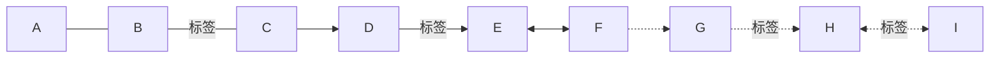

```
graph LR
	J==>K
	K==标签==>L
	L--o M
	M o--o N
	N --x o
	o x--x P
```


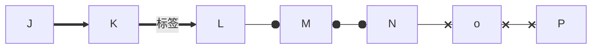

有的图需要跨层级,可以使用`-`来增加线的长度

```
graph LR
	A-->B
	C--->D
	E---->F
```


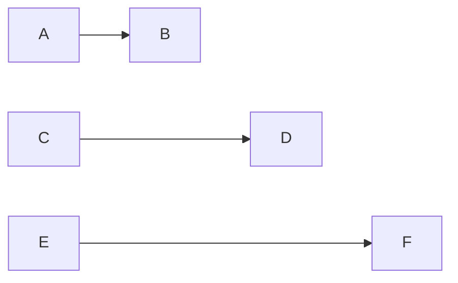

### 流程子图

```
  subgraph 子流程图名字[子流程图文本内容（标题）]
    direction 子流程图方向
    子流程图具体信息
  end
```

例子

```
    graph TB
    A[HTML 基础]
    subgraph B[HTML 进阶]
      subgraph 属性[各种属性]
        一般属性 --> 特殊属性
      end
      标签 --> 属性 --> 方法
    end
    C[HTML 深入]
    A --> B --> C
```

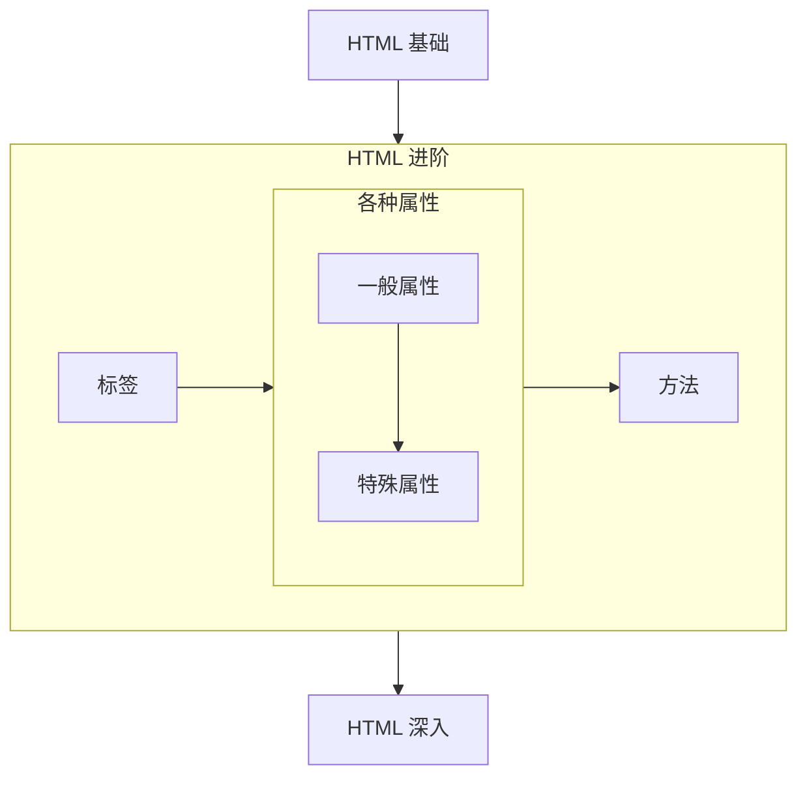

### 事件交互

我们可以把页面跳转或js函数捆绑在节点的点击事件上

#### 页面的跳转

```
  click 节点名字 href "网址" "注释" 打开方式
```

#### 函数的捆绑

```
  <!--先定义一个函数-->
  <script>
    const callback = function(){
      alert("Function running!");
    };
  </script>
  
  <!--然后把这个函数引进 Mermaid 并将它和节点捆绑-->
  click 节点名字 callback "注释"
  click 节点名字 call callback() "注释"
```

示例

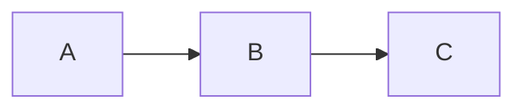

## 序列图

### 参与者

使用`participant`定义参与者

```
sequenceDiagram
    participant Alice
    participant Bob
    Bob->>Alice: Hi Alice
    Alice->>Bob: Hi Bob
```

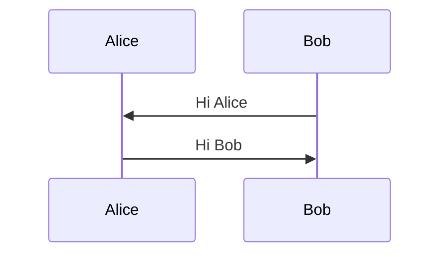

### 角色

使用`actor`定义角色

```
sequenceDiagram
    participant Alice
    participant Bob
    Bob->>Alice: Hi Alice
    Alice->>Bob: Hi Bob
```


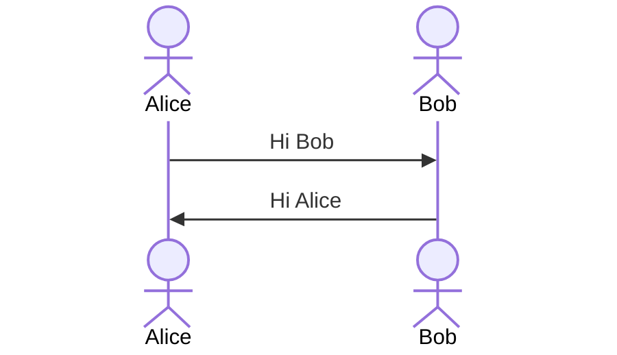


### 别名

角色可以有一个方便的标识符和描述性标签。

```
sequenceDiagram
    participant A as Alice
    participant J as John
    A->>J: Hello John, how are you?
    J->>A: Great!
```

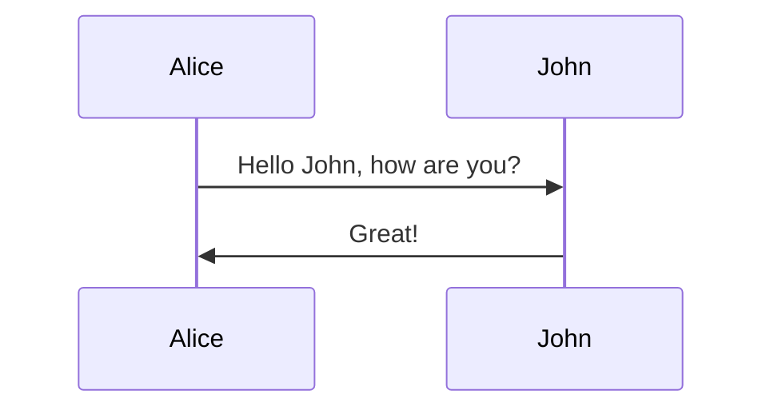


### 信息

消息可以有两条显示，可以是实线，也可以是虚线

```
[参与者][箭头][参与者]:标注
```

箭头类型

| 类型   | 描述                           |
| :----- | :----------------------------- |
| `->`   | 没有箭头的实线                 |
| `-->`  | 没有箭头的虚线                 |
| `->>`  | 带箭头的实线                   |
| `-->>` | 带箭头的虚线                   |
| `-x`   | 末端有十字的实线               |
| `--x`  | 末端带有十字的虚线。           |
| `-)`   | 末尾带有空心箭头的实线（异步） |
| `--)`  | 末尾带有空心箭头的虚线（异步） |

### 标注

可以向序列图添加注释。这是通过符号 Note [ right/left of] [角色]：注意内容中的文本，文本的换行使用<br/>

```
sequenceDiagram
    participant John
    Note left of John: Text in note
```

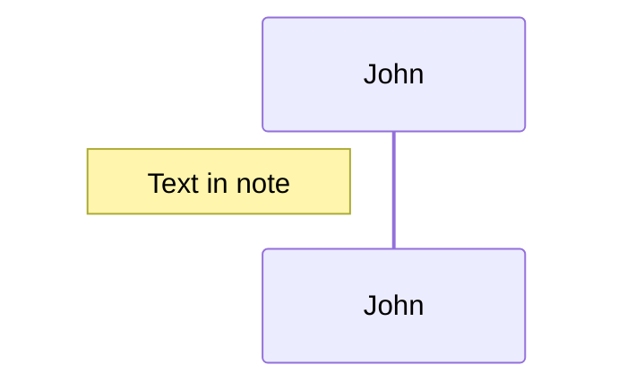

还可以创建跨越两个参与者的注意，只需要将right或left换成over即可：

```
sequenceDiagram
    Alice->John: Hello John, how are you?
    Note over Alice,John: A typical interaction
```

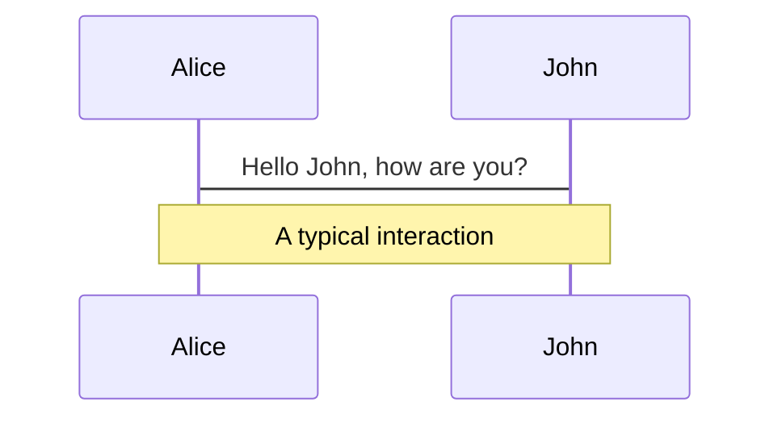

### 循环

```
loop 循环名
	需要循环的代码
end
```

```
sequenceDiagram
    Alice->John: Hello John, how are you?
    loop Every minute
        John-->Alice: Great!
    end

```

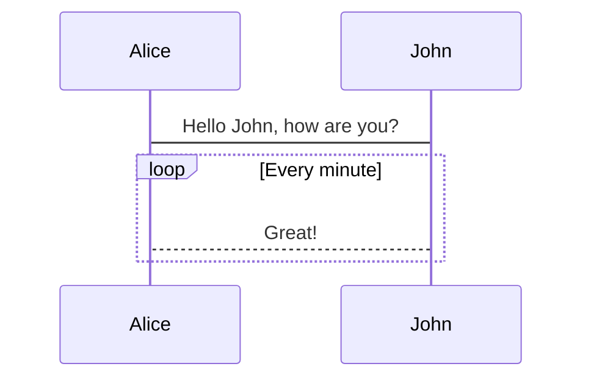

# VLOOK

## 参考链接

[快速参考手册 (Part.I) - VLOOK™ - Markdown 编辑器 Typora 的主题包和增强插件 (madmaxchow.github.io)](https://madmaxchow.github.io/VLOOK/guide.html)

## 封底封面

在文件开头使用以下代码即可激活封面

```makefile
###### 在这填写文档标题<br>**在些填写作者**<br>*在这填版权归属方的信息*
```

我的模板

```makefile
###### 文档标题<br><br>**你要信我啊**<br><br><br><br>*COPYRIGHT ©ryf*
```

在文档结尾使用一个一级标题即可激活封底

```makefile
# The end
```


## 着色

先斜体，后下标。强调需要在颜色后面加！，如红色强调颜色就是`rd！`

在文本着色时需要将文本设置为特殊样式

```
_~这里写颜色~_
*斜体文本着色*_~Rd~_
**粗体文本着色**_~Rd~_
==高亮文本着色==_~Rd~_
```


*红色*_~Pk~_

> [!NOTE]
>
> 注意这里的颜色渲染只有在导出之后才能显示


|       颜色        | **色号** | 单色渲染效果示例           |
| :---------------: | :------: | -------------------------- |
|     酒红 Wine     |    Wn    | 警告、危险、关键事项、删除 |
|      红 Red       |    Rd    | 警告、危险、关键事项、删除 |
|     橙 Orange     |    Og    | 提醒、注意、修复           |
|     黄 Yellow     |    Ye    | 关注、优化、备忘、说明     |
|     柠绿 Lime     |    Lm    | 提示、参考、新增           |
|     绿 Green      |    Gn    | 提示、参考、新增           |
|   矿绿 Mineral    |    Mn    | 提示、参考、新增           |
|   橄榄绿 Olives   |    Ol    | 提示、参考、新增           |
|     水绿 Aqua     |    Aq    | 引用块、公告               |
|      青 Cyan      |    Cy    | 引用块、公告               |
|      蓝 Blue      |    Bu    | 信息、资讯                 |
|     海蓝 Sea      |    Se    | 信息、资讯                 |
|  薰衣紫 Lavender  |    La    | 信息、资讯                 |
|     藤紫 Vine     |    Vn    | 信息、资讯                 |
|     紫 Purple     |    Pu    | 延伸、扩展、保留、备用     |
|     玫红 Rose     |    Ro    | 年轻、个性、女性           |
|     粉红 Pink     |    Pk    | 年轻、个性、女性           |
|      金 Gold      |    Gd    | VIP、金融、工程            |
|     棕 Brown      |    Bn    | VIP、金融、工程            |
|      灰 Gray      |    Gy    | 无效、暂缓、停用、结束     |
|     黑 Black      |    Bk    | 黑白、高对比               |
|  主题主色 Theme1  |    T1    | 当前 VLOOK™ 主题的主色     |
| 主题辅助色 Theme2 |    T2    | 当前 VLOOK™ 主题的辅助色   |

渐变色只需要连续输入色彩编号就行

```
 _~RdGn~_
 _~RdYeGn~_
```


## 按钮

使用<kbd>标签实现按钮样式

```
<kbd></kbd>
```

<kbd>CTRL</kbd> + <kbd>S</kbd>

## 表格

### 合并

---

- 行合并
    - 在需要行合并的单元格中填入==,会与左侧单元格合并
- 列合并
    - 在需要列合并的单元格中填入：，会与上侧单元格合并

| **列 A**        | 列 B                | 列 C                    | ==列 D==           | 列 E       | 列 F       | 列 G                                                         |
| --------------- | ------------------- | ----------------------- | ------------------ | ---------- | ---------- | ------------------------------------------------------------ |
| 纵向合并 *`×3`* | 普通单元格          | 普通单元格              | 普通单元格         | 普通单元格 | 普通单元格 | `123` 纵向合并 *`×5`*<br>*单元格`徽章 1`*<br>*单元格`徽章 2`*_~Rd~_<br>*单元格`内容 3`内容 4*_~Gn~_ |
| :               | 纵向合并 *`×2`*     | 横向合并 *`×4`*         | ==                 | ==         | ==         | :                                                            |
| :               | :                   | 普通**单==元==格**加粗  | 普通*单元格`徽章`* | 普通单元格 | 普通单元格 | :                                                            |
| 普通单元格      | 纵向<br>合并 *`×3`* | 普通 *单元格* 斜体      | 普通单元格         | 普通单元格 | 普通单元格 | :                                                            |
| 普通单元格      | :                   | 普通==单元格==高亮      | 普通单元格         | 普通单元格 | 普通单元格 | :                                                            |
| 普通单元格      | :                   | 普通<u>单元格</u>下划线 | 普通单元格         | 普通单元格 | 普通单元格 | :                                                            |

> [!NOTE]
>
> 注意，表格合并只有在导出为html文件时有效


### 数值

只需要在需要的单元格设置右对齐即可自动匹配数值格式

| 原始内容    | 数值情况 |   ==   |   ==   |    ==    |      |        数值列 |
| ----------- | :------: | :----: | :----: | :------: | ---- | ------------: |
| :           | []含小数 | []正数 | []负数 | []超三位 | :    |             : |
| 123         |          |        |        |          |      |           123 |
| -12345      |          |        |   Y    |    Y     | :    |       -12,345 |
| +5678.00    |    Y     |   Y    |        |    Y     | :    |     +5,678.00 |
| -2345678.00 |    Y     |        |   Y    |    Y     | :    | -2,345,678.00 |

当使用%号时，会凸显出进行程度

*==测试==*

| 原始内容 | 数值情况 |   ==   |   ==   |    ==    |      |  百分数列 |
| -------- | :------: | :----: | :----: | :------: | ---- | --------: |
| :        | []含小数 | []正数 | []负数 | []超三位 | :    |         : |
| 79%      |          |        |        |          |      |      79 % |
| 88.88%   |    Y     |        |        |          | :    |   88.88 % |
| +38%     |          |   Y    |        |          | :    |    ▴ 38 % |
| -57.30%  |    Y     |        |   Y    |          | :    | ▾ 57.30 % |
| 100%     |          |        |        |          | :    |     100 % |

对货币符号（如： `¥` `$` ），或货币简写（如： `CNY` `USD` `HKD` 等）进行左侧对齐和视觉弱化，在符号和数值中间必须要有空格

| **币种** | 原始内容      | 数值情况 |   ==   |    ==    |    ==    |      |      **货币** |
| :------: | ------------- | :------: | :----: | :------: | :------: | ---- | ------------: |
|    :     | :             |  []正数  | []负数 | []含小数 | []超三位 | :    |             : |
|  人民币  | ￥ +123456.99 |    Y     |        |    Y     |    Y     |      | ￥+123,456.99 |
|    :     | CNY 987654.99 |          |        |    Y     |    Y     | :    | CN¥987,654.99 |
|    :     | CNY 987654.99 |          |        |    Y     |    Y     | :    | CNY987,654.99 |
|          | ==            |    ==    |   ==   |    ==    |    ==    | ==   |            == |
|   港元   | HK\$ 3456.78  |    Y     |        |    Y     |    Y     |      |  HK\$3,456.78 |
|    :     | HKD 3456.78   |          |        |    Y     |    Y     | :    |   HKD3,456.78 |
|          | ==            |    ==    |   ==   |    ==    |    ==    | ==   |            == |
|   美元   | \$ +555.38    |    Y     |        |    Y     |          |      |     \$+555.38 |
|    :     | USD 555       |          |        |          |          | :    |        USD555 |
|          | ==            |    ==    |   ==   |    ==    |    ==    | ==   |            == |
|   澳元   | AU\$ 56789    |    Y     |        |          |    Y     |      |    AU\$56,789 |
|    :     | AUD -56789    |          |   Y    |          |    Y     | :    |     AUD-5,678 |


### 表格编号

使用`*====*`符号对表格进行编号，导出html时会自动给表格进行编号

*==测试标题==*

| 列 A       | 列 B       | 列 C       | 列 D       | 列 E       |
| ---------- | ---------- | ---------- | ---------- | ---------- |
| 单元格内容 | 单元格内容 | 单元格内容 | 单元格内容 | 单元格内容 |

## 备忘与警示

在引用块内的首行输入以下任一 GitHub Style Alert 的分类信息标识即可自动识别并渲染：

```
[!NOTE] [!TIP] [!IMPORTANT] [!WARNING] [!CAUTION]
```

> [!NOTE]
>
> 这是一个备注

> [!TIP]
>
> 这是一个提示

> [!IMPORTANT]
>
> 这是重要信息

> [!WARNING]
>
> 这是一个警告

> [!CAUTION]
>
> 这是一个严重警告


## 分栏

使用`---`进行分栏，双栏就使用两个分割线，以此类推

```markdown
--- 

- 列表 1
  - 列表项 1-1
  - 列表项 1-2
- 列表 2
  - 列表项 2-1
```


---

- 组1
    - 组1.1
    - 组1.2
- 组2
    - 组2.1
    - 组2.2


---
---

- 组1
  - 组1.1
  - 组1.2
- 组2
  - 组2.1
  - 组2.2
- 组3
  - 组3.1
  - 组3.2


引用分栏

```
---

> 组1
>> 组1.1

> 组2
>> 组2.1
```

---
> 组1
>> 组1.1

> 组2
>> 组2.1


## 内容标记

### 标签

使用`*``*`进行打标签，改变色彩只需要设置色号即可

*`这是一个标签`*

| **预置色号** | 应用场景建议               | 渲染效果              |
| :----------: | -------------------------- | --------------------- |
|      Wn      | 警告、危险、关键事项、删除 | *`Wn 常规风格`*_~Wn~_ |
|      Rd      | :                          | *`Rd 常规风格`*_~Rd~_ |
|      Og      | 提醒、注意、修复           | *`Og 常规风格`*_~Og~_ |
|      Ye      | 关注、优化、备忘、说明     | *`Ye 常规风格`*_~Ye~_ |
|      Lm      | 提示、参考、新增           | *`Lm 常规风格`*_~Lm~_ |
|      Gn      | :                          | *`Gn 常规风格`*_~Gn~_ |
|      Mn      | :                          | *`Mn 常规风格`*_~Mn~_ |
|      Ol      | :                          | *`Ol 常规风格`*_~Ol~_ |
|      Aq      | 引用块、公告               | *`Aq 常规风格`*_~Aq~_ |
|      Cy      | :                          | *`Cy 常规风格`*_~Cy~_ |
|      Bu      | 信息、资讯                 | *`Bu 常规风格`*_~Bu~_ |
|      Se      | :                          | *`Se 常规风格`*_~Se~_ |
|      La      | :                          | *`La 常规风格`*_~La~_ |
|      Vn      | :                          | *`Vn 常规风格`*_~Vn~_ |
|      Pu      | 延伸、扩展、保留、备用     | *`Pu 常规风格`*_~Pu~_ |
|      Ro      | 年轻、个性、女性           | *`Ro 常规风格`*_~Ro~_ |
|      Pk      | :                          | *`Pk 常规风格`*_~Pk~_ |
|      Gd      | VIP、金融、工程            | *`Gd 常规风格`*_~Gd~_ |
|      Bn      | :                          | *`Bn 常规风格`*_~Bn~_ |
|      Gy      | 无效、暂缓、停用、结束     | *`Gy 常规风格`*_~Gy~_ |
|      Bk      | 黑白、高对比               | *`Bk 常规风格`*_~Bk~_ |
|      T1      | 当前 VLOOK™ 主题的主色     | *`T1 常规风格`*       |
|      T2      | 当前 VLOOK™ 主题的辅助色   | *`T2 常规风格`*_~T2~_ |

### 徽章

```
使用*徽章标题`徽章内容`徽章结尾*
同样的，改变色号只需要在后面加上预置色编号就行
```

*徽章标题`徽章内容`徽章结尾*


### 进度条

```
**==这里写进度==**
```

**==20==**

**==0==**_~Rd~_

### 面包屑

```
*==面包屑包裹内容==*
```

> [!WARNING]
>
> 面包屑必须要和段落一起使用，不然会被识别为题主

面包屑前面必须有文字，不能为一个段落*==面包屑包裹内容==*


### 刮刮卡

```
*刮刮卡的提示内容**刮刮卡内容***
```

坚***不***可***摧***


