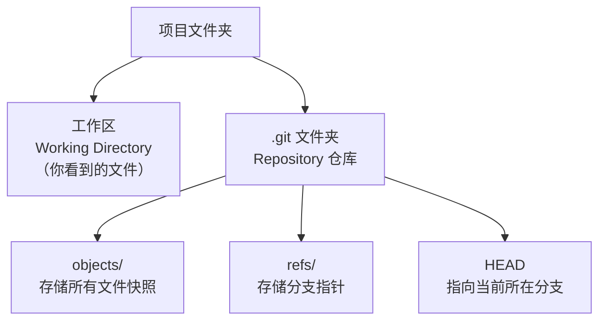
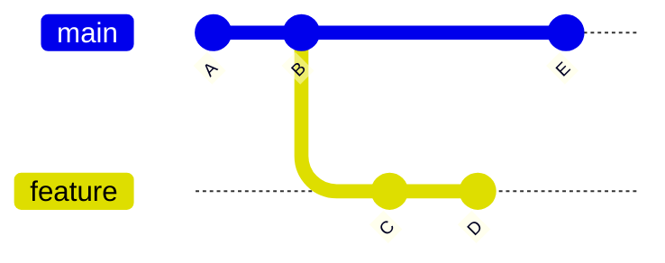
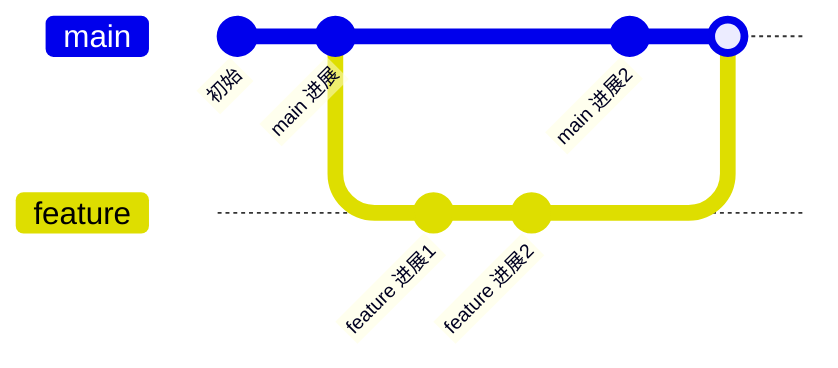
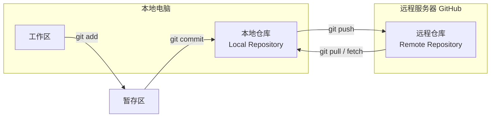
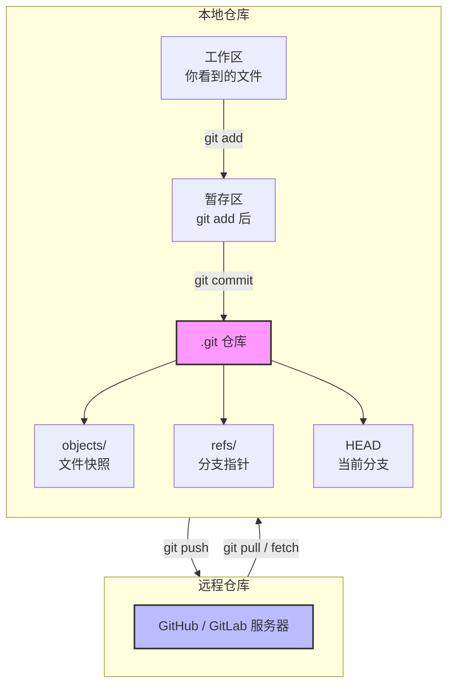
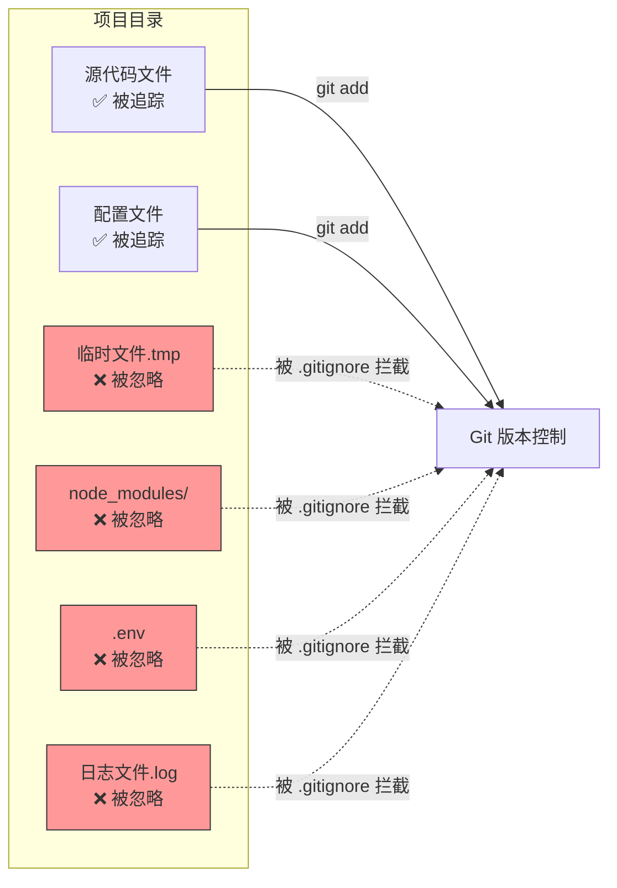
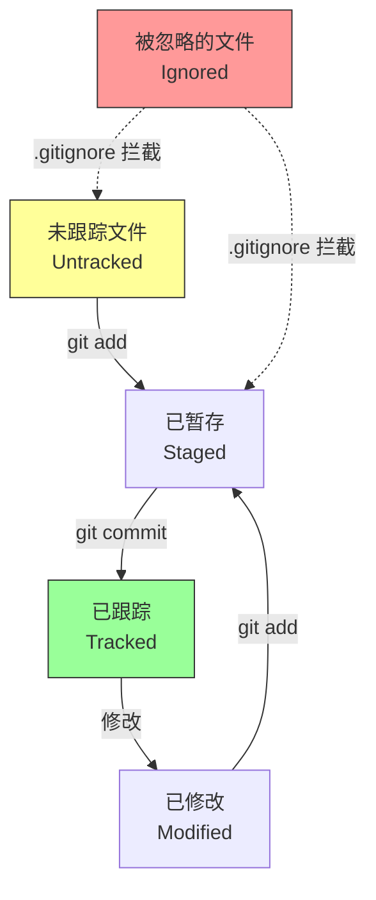
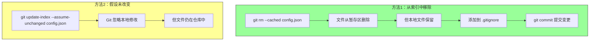
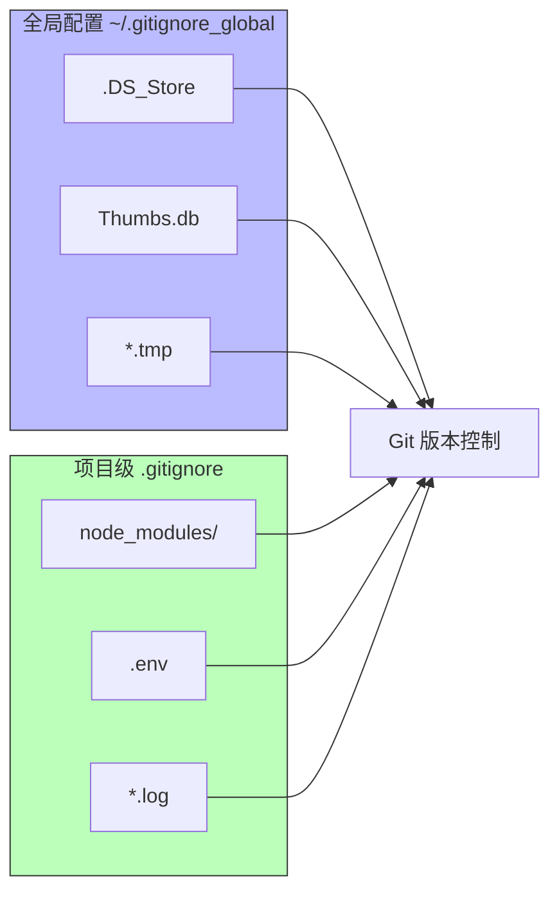
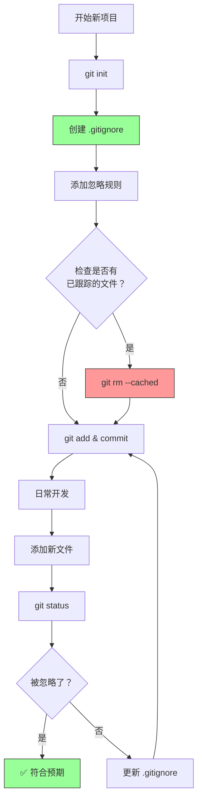

# Git 的基本概念

Git 是一个分布式版本控制系统，广泛用于软件开发中来跟踪代码变更、协作开发和版本管理。以下是 Git 的基本使用指南，涵盖常见的操作和命令。

- **Repository（仓库）**：存储项目及其版本历史的地方。
- **Commit（提交）**：对文件或目录的快照。
- **Branch（分支）**：代码开发的独立分支。
- **Merge（合并）**：将分支的修改合并到主分支中。
- **Remote（远程）**：存储在服务器上的仓库。

## Repository（仓库）

**概念**：仓库就是项目根目录下的 `.git` 文件夹，它像一个数据库，记录了所有文件的每一次历史变动。



**对应命令**：
```bash
# 初始化一个新仓库
git init

# 克隆远程仓库到本地
git clone https://github.com/user/repo.git
```


## Commit（提交）

**概念**：每一次 `git commit` 就是对当前所有暂存文件的一次**永久快照**，每个提交都有唯一的哈希值作为 ID。


**对应命令**：
```bash
# 查看提交历史（简洁版）
git log --oneline

# 创建一个新提交
git add .
git commit -m "修复登录页面的 Bug"

# 查看某次提交的具体改动
git show <commit-hash>
```

## Branch（分支）

**概念**：分支本质上是一个**轻量级的移动指针**，指向某一个 Commit。新建分支只是新建一个指针，不会复制代码，速度极快。



**对应命令**：
```bash
# 列出所有本地分支（* 号表示当前所在分支）
git branch

# 创建新分支（但不切换）
git branch feature-login

# 创建并立即切换到新分支（最常用）
git checkout -b feature-login
# 或新版命令
git switch -c feature-login
```

---

## Merge（合并）

**概念**：将另一个分支的代码改动**整合**到当前分支。Git 会找到两个分支的"共同祖先"提交，然后生成一个新的"合并提交"。



**对应命令**：
```bash
# 切换到要接收合并的分支（如 main）
git checkout main

# 把 feature 分支合并进来
git merge feature

# 如果出现冲突，解决后：
git add .
git commit -m "合并解决冲突"
```

## Remote（远程）

**概念**：存放在**云端或服务器**上的仓库副本（如 GitHub/GitLab）。本地和远程通过 `push`（推）和 `pull`（拉）同步。

**Mermaid 图**：本地与远程的交互



**对应命令**：
```bash
# 查看配置的远程仓库（默认 origin）
git remote -v

# 推送本地分支到远程
git push -u origin main

# 从远程拉取最新代码
git pull origin main

# pull 实际上是 fetch + merge 的缩写
git fetch origin
git merge origin/main
```

## 仓库概览



# Git 的基本操作

##  安装 Git

- **Windows**：从 [Git 官网](https://git-scm.com/download/win) 下载并安装。
- **macOS**：使用 Homebrew 安装：`brew install git`
- **Linux**：使用包管理器安装，例如 Ubuntu：`sudo apt-get install git`

## 配置 Git

```sh
git config --global user.name "Your Name"
git config --global user.email "your.email@example.com"
```

##  创建一个新的 Git 仓库

```sh
mkdir myproject
cd myproject
git init
```

## 克隆一个现有的仓库

```sh
git clone https://github.com/username/repository.git
```

## 检查仓库状态

```sh
git status
```

## 添加文件到仓库

```sh
git add filename
git add .
```

##  提交更改

```sh
git commit -m "Commit message"
```

## 查看提交历史

```sh
git log
```

## 创建和切换分支

```sh
git branch new-branch
git checkout new-branch
```

或者创建并切换到新分支

```sh
git checkout -b new-branch
```

## 合并分支

切换到你要合并到的分支（例如 `main`）

```sh
git checkout main
git merge new-branch
```

## 删除分支

```sh
git branch -d new-branch
```

## 添加远程仓库

下面的栗子是添加一个远程仓库，远程仓库的名字为origin，url为`https://github.com/username/repository.git`

```sh
git remote add origin https://github.com/username/repository.git
```

查看远程仓库命令为：

```sh
git remote
```


##  推送到远程仓库

首次推送需要先设置公钥

```bash
ssh-keygen -t rsa -C "your_email@example.com"
```

生成密钥之后查看密钥文件中的内容，将密钥文件中的内容复制到github的设置中的SSH中即可开始推送

```bash
cat ~/.ssh/id_rsa.pub 
```

可使用以下命令测试密钥是否配置成功

```bash
ssh -T git@github.com
```

推送的语法为

```bash
git push [添加的仓库名] [仓库的分支名]
```

下面的栗子是向origin仓库的branch-name分支推送代码

```bash
git push origin branch-name
```

## 从远程仓库拉取更新

```sh
git pull origin branch-name
```

##  解决冲突

在合并或拉取过程中，如果有冲突，Git 会提示冲突文件。你需要手动解决冲突并提交解决后的更改。


# 差异和补丁

在 Git 中，**diff** 和 **patch** 是紧密相关的两个概念，它们共同构成了 Git 代码变更传递的核心机制。简单来说：**diff 是“说明书”（记录改了哪里），patch 是“补丁包”（应用这些修改）。**

## Diff（差异对比）

**作用**：比较两个状态之间的**具体内容差异**。

-   **查看未暂存的修改**：`git diff` 可以告诉你工作区里哪些文件被改了，但还没用 `git add` 暂存。
-   **查看已暂存的修改**：`git diff --staged` 比较暂存区和上一次提交（HEAD）的区别，也就是你准备提交的内容。
-   **比较分支/提交**：`git diff branch1 branch2` 可以对比两个分支的代码有什么不同；`git diff commit1 commit2` 可以对比任意两次提交。
-   **代码审查**：在 Pull Request 或 Merge Request 中，你看到的绿色（新增）和红色（删除）行，就是 Git Diff 的渲染结果。

Diff 输出的是一种**特定格式的文本**，它包含了：

-   哪个文件发生了变更。
-   变更发生在文件的第几行附近（上下文）。
-   具体的删除行（以 `-` 开头）和新增行（以 `+` 开头）。

## Git Patch（补丁）

**作用**：将 Diff 生成的差异文本**保存为文件**，然后可以**传递**并**应用**到另一个代码仓库或分支上。

-   **生成补丁**：`git format-patch` 命令可以将某次或某几次提交，转换成 `.patch` 后缀的文本文件。
-   **应用补丁**：
    -   **`git apply`**：直接读取 patch 文件，将修改应用到当前工作区（相当于手动改代码，不会产生提交记录）。
    -   **`git am`**（Apply Mail）：专门用来应用 `format-patch` 生成的补丁，它会**自动生成一条新的提交记录**，并保留原作者的信息（姓名、邮箱、提交时间）。

## Diff 和 Patch 的核心关系

可以用一个公式来理解：
$$
Patch = Diff 内容 + 元数据（作者、时间、提交信息）
$$

-   **Diff** 是“原材料”，只记录代码变动。
-   **Patch** 是“封装好的快递包裹”，不仅包含变动内容，还包含了“谁寄的”和“备注信息”。


## 实操示例

### 案例 1：紧急热修复（无网络 / 无法 Push）

**场景**：你正在生产环境的服务器上调试，紧急修复了一个 Bug，但服务器处于内网隔离状态，无法连接远程 Git 仓库（Origin）。你需要把这份改动带回办公室提交到正式仓库。

**常规做法痛点**：没法 Push，总不能手抄代码。

**Patch 解决方案**：

1. **在服务器上生成补丁**（不要用 `git diff`，用 `format-patch` 才能保留提交信息）：
   ```bash
   # 假设你刚刚 git commit -m "hotfix memory leak"
   git format-patch -1 -o /tmp/
   ```
   此时生成了 `/tmp/0001-hotfix-memory-leak.patch`。

2. **传输补丁**：通过 U 盘或内网通讯工具，把 `.patch` 文件传到办公室电脑。

3. **在办公室电脑应用**：
   ```bash
   # 放在仓库目录下执行
   git am /tmp/0001-hotfix-memory-leak.patch
   ```
   **结果**：办公室电脑的 Git 历史里会完整保留你在服务器上的提交者姓名、邮箱和时间，**等同于你亲自在办公室提交了一次**，而不是丢失元数据的“合并修改”。

### 案例 2：代码审查（Review）前的“排练”

**场景**：你完成了一个大功能的重构，改动了几十个文件。你想在正式发起 Pull Request (PR) 前，先发给资深同事看一眼逻辑，但你的分支里有很多“WIP（Work In Progress，开发中）”的琐碎提交记录（比如“fix typo”、“temp save”），不想把这些脏历史暴露出去。

**常规做法痛点**：直接 `git diff` 输出到屏幕太乱；发 PR 又会被同事看到你乱七八糟的提交记录。

**Patch 解决方案**：

1. **生成一个“聚合补丁”**（只包含最终代码差异，不包含中间提交历史）：
   ```bash
   # 对比你的功能分支和主分支的最终差异，生成一个大的 patch 文件
   git diff main..feature-branch > feature-review.patch
   ```

2. **发送给同事**：把 `.patch` 文件发给同事。

3. **同事本地预览**：同事不需要切换分支，直接在 IDE 里打开这个 `.patch` 文件，就能看到所有 `-` 和 `+` 的高亮改动。
   （更专业一点：如果同事用 VSCode，安装 `Patch Viewer` 插件，看这个文件就像看 PR 页面一样清晰。）

4. **同事给出反馈**：你们纯粹讨论代码逻辑，而你的分支历史在 Git 里依然可以继续随意 rebase 修改，不会受到任何干扰。

### 案例 3：跨仓库移植代码（Cherry-pick 的替代方案）

**场景**：你在公司内部的 A 仓库发现了一个通用的工具类函数，想把它移植到另一个独立的 B 仓库（但 B 仓库没有 A 仓库的 Git 历史，无法直接 merge）。

**常规做法痛点**：直接复制粘贴代码会丢失提交记录（谁写的、为什么这么写）。

**Patch 解决方案**：

1. **在 A 仓库找到该函数的引入提交**：
   ```bash
   git log -p -- src/utils.js  # 找到那个提交的 Hash，比如 a1b2c3d
   ```

2. **生成特定提交的补丁**：
   ```bash
   git format-patch -1 a1b2c3d -o /tmp/
   ```

3. **在 B 仓库应用补丁**（注意：B 仓库的目录结构可能不同）：
   - 如果目录结构相同，直接 `git am` 即可。
   - **如果目录结构不同（比如 A 仓库在 `src/`，B 仓库在 `lib/`）**，这里要用到高级技巧：
   ```bash
   # 应用补丁，但允许忽略目录层级（-p1 表示去掉第一层路径）
   git am --reject -p1 < /tmp/0001-xxx.patch
   ```
   如果失败，Git 会生成 `.rej` 文件，你可以根据这些文件手动调整路径，然后 `git am --continue` 完成移植。**这样，B 仓库的提交历史里依然会显示原作者是 A 仓库的同事。**

### 案例 4：批量处理历史补丁（邮件协作模式）

**场景**：你参与了一个严格的顶级开源项目（比如 Linux 内核或 FreeBSD），它们不接受 GitHub PR，只接受邮件列表（Mailing List）发送的补丁。你需要给维护者发一系列补丁（比如 3 个相关提交）。

**操作步骤**（这是 Git 最原生的协作方式）：

1. **生成一系列补丁**（告诉 Git 你要基于主分支之上的 3 个提交）：
   ```bash
   git format-patch main -3 -o /tmp/patches/
   ```
   这会生成 `0001-xxx.patch`, `0002-yyy.patch`, `0003-zzz.patch`。

2. **发送邮件**（利用 `git send-email`）：
   ```bash
   git send-email --to="maintainer@example.com" /tmp/patches/*.patch
   ```
   Git 会自动把每个 `.patch` 文件包装成一封邮件，且邮件正文就是你的提交信息，附件是具体改动。

3. **维护者接收并应用**：维护者收到邮件后，不用去网页点按钮，只需把邮件存成文件，执行 `git am`，**所有补丁就会完美地按顺序应用到主分支上，并且自动生成相同的提交 Hash 信息。**

### Patch 冲突了怎么办？

在实际使用 `git am` 时，最怕的就是“打不上”（冲突）。这里有 3 种处理手法：

| 处理方式               | 命令                                                         | 适用场景                                                     |
| :--------------------- | :----------------------------------------------------------- | :----------------------------------------------------------- |
| **自动跳过**           | `git am --skip`                                              | 觉得这个补丁已经过时，不要了，直接跳过这个补丁去应用下一个。 |
| **放弃本次应用**       | `git am --abort`                                             | 冲突太复杂，不想处理了，回到执行 `git am` 之前的状态。       |
| **手动解决**（最常用） | `git apply --reject` + 手动改代码 + `git add .` + `git am --continue` | 补丁大部分能用，只有少量行冲突。用 `--reject` 生成 `.rej` 文件，按提示改好后继续。 |


# .gitignore

## 什么是 .gitignore？

**概念**：`.gitignore` 是一个文本文件，告诉 Git **哪些文件或文件夹不需要纳入版本控制**。被忽略的文件不会被 `git add`、`git commit` 或 `git push` 跟踪。



---

## .gitignore 的基本语法

### 1. 通配符规则

| 模式     | 匹配示例                     | 说明                           |
| :------- | :--------------------------- | :----------------------------- |
| `*.log`  | `app.log`, `error.log`       | 匹配所有 `.log` 结尾的文件     |
| `temp/`  | `temp/`, `temp/file.txt`     | 忽略 `temp` 文件夹及其所有内容 |
| `*.tmp`  | `file.tmp`, `data.tmp`       | 匹配所有 `.tmp` 结尾的文件     |
| `build/` | `build/`, `build/index.html` | 忽略 `build` 文件夹            |
| `!`      | `!important.log`             | 取反，不忽略 `important.log`   |
| `#`      | `# 这是注释`                 | 注释行                         |

### 2. 实际示例

```gitignore
# 编译产物
*.class
*.exe
*.dll
*.so

# 依赖目录
node_modules/
vendor/
__pycache__/

# 环境配置文件
.env
.env.local
.env.*.local

# IDE 配置
.vscode/
.idea/
*.iml

# 日志文件
*.log
npm-debug.log*
yarn-debug.log*

# 操作系统文件
.DS_Store
Thumbs.db

# 但我要跟踪这个特定的 .env.example 文件
!.env.example
```

---

## .gitignore 的生效时机

**Mermaid 图**：文件状态转换图



**重要规则**：
- ✅ **未跟踪的文件**：`.gitignore` 立即生效
- ❌ **已跟踪的文件**：`.gitignore` **不会生效**（必须先手动停止跟踪）

---

## 实战场景：如何忽略已跟踪的文件？

**场景**：你发现 `config.json` 已经被提交到仓库了，但现在想忽略它。

**Mermaid 图**：停止跟踪的两种方法



**命令实践**：

```bash
# 方法1：从 Git 中移除但保留本地文件（推荐）
git rm --cached config.json
echo "config.json" >> .gitignore
git add .gitignore
git commit -m "停止跟踪 config.json"

# 方法2：临时忽略本地修改（不推荐长期使用）
git update-index --assume-unchanged config.json
# 恢复跟踪
git update-index --no-assume-unchanged config.json
```

---

## 常见项目的 .gitignore 模板

### 1. Python 项目

```gitignore
# Python
__pycache__/
*.py[cod]
*.so
.Python
env/
venv/
*.egg-info/
dist/
build/

# 虚拟环境
venv/
env/
.env/

# IDE
.vscode/
.idea/
*.swp
```

### 2. Node.js 项目

```gitignore
# 依赖
node_modules/
npm-debug.log*
yarn-debug.log*
yarn-error.log*

# 环境配置
.env
.env.local
.env.*.local

# 构建产物
dist/
build/
*.tsbuildinfo
```

### 3. Java 项目

```gitignore
# 编译产物
*.class
*.jar
*.war
*.ear

# 构建工具
target/
.idea/
*.iml
.gradle/
build/

# 日志
*.log
```

---

## 高级技巧：全局 .gitignore

**场景**：你想在所有项目中忽略 `.DS_Store` 或 `Thumbs.db`，不用每个项目都写一遍。

**Mermaid 图**：全局 vs 项目级 .gitignore



**配置命令**：

```bash
# 1. 创建全局 .gitignore
touch ~/.gitignore_global

# 2. 添加内容到该文件
echo ".DS_Store" >> ~/.gitignore_global
echo "Thumbs.db" >> ~/.gitignore_global

# 3. 配置 Git 使用它
git config --global core.excludesfile ~/.gitignore_global
```

---

## 常见问题和解决方案

### 问题1：.gitignore 添加了规则，但 `git status` 还是显示文件

```bash
# 原因：文件已经被 Git 跟踪了
# 解决方案：先停止跟踪
git rm --cached <file>
git add .gitignore
git commit -m "更新 .gitignore"
```

### 问题2：我想查看哪些文件被忽略了

```bash
# 查看所有被忽略的文件
git status --ignored

# 检查某个文件是否会被忽略
git check-ignore -v config.json
```

### 问题3：忽略所有文件，但保留特定文件

```gitignore
# 忽略所有文件
*

# 但不忽略这些
!.gitignore
!README.md
!src/
```

---

## 实际工作流程图



---

## 总结要点

| 要点           | 说明                                                         |
| :------------- | :----------------------------------------------------------- |
| **创建时机**   | 项目初始化时就应该创建 `.gitignore`                          |
| **生效对象**   | 只对未跟踪的文件生效                                         |
| **已跟踪文件** | 需要用 `git rm --cached` 先停止跟踪                          |
| **全局配置**   | 使用 `core.excludesfile` 配置全局忽略                        |
| **模板来源**   | GitHub 提供了各种语言的模板：https://github.com/github/gitignore |

---

如果还有什么不理解的地方，或者想看看某个特定语言/框架的 `.gitignore` 配置，随时告诉我！😊

在Git中，`.gitignore` 文件用于告诉Git哪些文件和目录应该被忽略，不需要被版本控制。`.gitignore` 文件中的语法规则非常灵活，支持多种模式和通配符。以下是一些常用的语法规则和示例：

1. **注释**：以 `#` 开头的行是注释。

   ```plaintext
   # 这是一个注释
   ```

2. **忽略文件或目录**：直接写文件或目录的名称。

   ```plaintext
   # 忽略所有 .log 文件
   *.log
   
   # 忽略名为 temp 的目录
   temp/
   ```

3. **通配符 `*`**：匹配零个或多个字符。

   ```plaintext
   # 忽略所有 .log 文件
   *.log

   # 忽略所有的临时文件
   *~
   ```

4. **问号 `?`**：匹配任意一个字符。

   ```plaintext
   # 忽略所有扩展名为 .l?g 的文件（例如 .log 和 .l1g）
   *.l?g
   ```

5. **方括号 `[]`**：匹配括号内的任意一个字符。

   ```plaintext
   # 忽略所有扩展名为 .log 或 .lbg 的文件
   *.l[ob]g
   ```

6. **斜杠 `/`**：用于分隔目录。如果以 `/` 开头，表示相对于仓库根目录。如果以 `/` 结尾，表示一个目录。

   ```plaintext
   # 忽略根目录下的 temp 目录
   /temp/

   # 忽略所有子目录中的 temp 目录
   temp/
   ```

7. **否定模式 `!`**：将某些文件从忽略列表中排除。

   ```plaintext
   # 忽略所有的 .log 文件
   *.log

   # 但不要忽略特定的 debug.log 文件
   !debug.log
   ```

8. **双星号 `**`**：匹配任意目录深度。

   ```plaintext
   # 忽略任何子目录中的 temp 目录
   **/temp/

   # 忽略所有子目录中的 .log 文件
   **/*.log
   ```

9. **注释行中的 `\`**：用于转义字符。

   ```plaintext
   # 忽略所有以 # 开头的文件
   \#*.log
   ```

以下是一个示例 `.gitignore` 文件，结合了上述规则：

```plaintext
# 忽略所有的 .log 文件
*.log

# 忽略所有的临时文件
*~

# 忽略根目录下的 temp 目录
/temp/

# 忽略任何子目录中的 temp 目录
**/temp/

# 忽略所有子目录中的 .log 文件
**/*.log

# 但不要忽略特定的 debug.log 文件
!debug.log

```

> [!important]
>
> 需要注意的是，该文件需要放在根目录

# 问题

1. 如果使用`ssh -T git@github.com`命令显示`Connection reset by 20.205.243.166 port 22`，说明是网络有问题，可以在`~/.ssh/config`或`C:\Users\Administrator\.ssh`文件中修改`config`(没有的话创建一个)内容如下：

   ```
   Host github.com
       Hostname ssh.github.com
       User git
       Port 443
       IdentityFile ~/.ssh/id_rsa
   ```

   `IdentityFile`的内容要改为`id_rsa`的文件路径

2. 


