# 参考链接
[新的活动图测试语法和功能 (plantuml.com)](https://plantuml.com/zh/activity-diagram-beta)

# 活动图

## 行为

活动标签以`:` 开始，以`;` 结束。文本格式可以使用[克里奥尔语的维基语法](https://plantuml.com/zh/creole)。它们的定义顺序是隐性链接的。

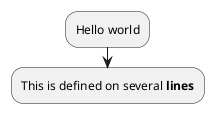


当然，还可以使用别的符号作为开头：

1.  `-`

   ```plantuml
   @startuml
   - Action 1 
   - Action 2 
   - Action 3 
   @enduml
   ```

   

2.  `*`

   1. 一级

      ```plantuml
      @startuml
      * Action 1
      * Action 2
      * Action 3
      @enduml
      ```

      

   2. 多级

      ```plantuml
      @startuml
      <style>
      element {MinimumWidth 150}
      </style>
      * Action 1
      ** Sub-Action 1.1
      ** Sub-Action 1.2
      *** Sub-Action 1.2.1
      *** Sub-Action 1.2.2
      * Action 2
      @enduml
      ```

      


## 开始/停止/结束

你可以使用`start` 和`stop` 关键字来表示一个图的开始和结束 。

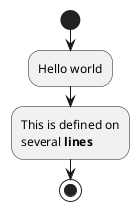


你也可以使用`end` 关键字。

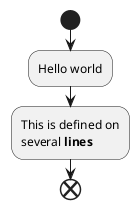


## 分支

### if-else

你可以使用`if`,`then`, `break`和`else` 关键词来在你的图表中放入测试。 标签可以用圆括号提供。

有3种语法可供选择。

1. `if (...) then (...)`

   ```plantuml
   @startuml
   
   start
   
   if (Graphviz installed?) then (yes)
     :process all\ndiagrams;
   else (no)
     :process only
     __sequence__ and __activity__ diagrams;
   endif
   
   stop
   
   @enduml
   ```

   

2. `if (...) is (...) then`

   ```plantum
   @startuml
   if (color?) is (<color:red>red) then
   :print red;
   else 
   :print not red;
   @enduml
   ```

   

3. `if (...) equals (...) then`

   ```plantum
   @startuml
   if (counter?) equals (5) then
   :print 5;
   else 
   :print not 5;
   @enduml
   ```

   

分支可以使用不同的排布方式：

1. 水平模式（默认水平模式）

   ```plantuml
   @startuml
   start
   if (condition A) then (yes)
     :Text 1;
   elseif (condition B) then (yes)
     :Text 2;
     stop
   (no) elseif (condition C) then (yes)
     :Text 3;
   (no) elseif (condition D) then (yes)
     :Text 4;
   else (nothing)
     :Text else;
   endif
   stop
   @enduml
   ```

   

2. 垂直模式：你可以使用`!pragma useVerticalIf on` 命令，让图处于垂直模式。

   ```plantuml
   @startuml
   start
   if (condition A) then (yes)
     :Text 1;
   elseif (condition B) then (yes)
     :Text 2;
     stop
   (no) elseif (condition C) then (yes)
     :Text 3;
   (no) elseif (condition D) then (yes)
     :Text 4;
   else (nothing)
     :Text else;
   endif
   stop
   @enduml
   ```

   


你可以使用`-P` command-line[命令行]选项来指定pragma。

```
java -jar plantuml.jar -PuseVerticalIf=on
```

### switch

Switch判断可以使用你可以使用 `switch`, `case` 和 `endswitch` 关键词在图表中绘制Switch判断.使用括号表示标注.

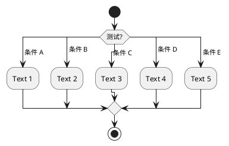


### 终止

你可以在if判断中终止一个行为.

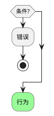


但如果你想在特定行为上停止，你可以使用`kill` 或 `detach`关键字:

- `kill`

  ```plantuml
  @startuml
  if (条件?) then
    #pink:错误;
    kill
  endif
  #palegreen:行为;
  @enduml
  ```

  

- `detach`

  ```plantuml
  @startuml
  if (条件?) then
    #pink:错误;
    detach
  endif
  #palegreen:行为;
  @enduml
  ```

  

### GoTo

Goto和标签处理 [label, goto]

⚠ 目前只是实验性的 🚧

你可以使用`label` 和`goto` 关键词来表示Goto处理，其中：

- `label <label_name>`
- `goto <label_name>`

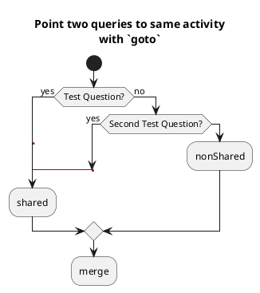


## 循环

### 基础循环


重复循环：你可以使用关键字`repeat`和`repeatwhile`进行重复循环。

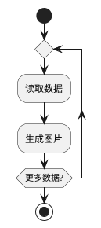


你同样可以使用一个全局行为作为`repeat`目标， 在返回循环开始时使用`backward`关键字插入一个全局行为。

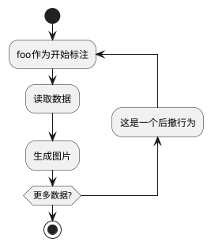


### 跳出

你可以使用 `break` 关键字跟在循环中的某个行为后面打断循环.

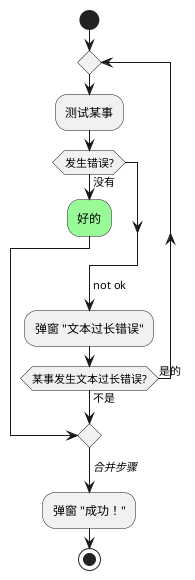


### while

可以使用关键字`while`和`end while`进行while循环。

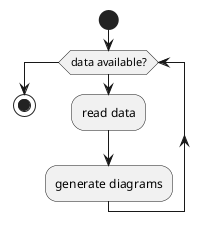


还可以在关键字`endwhile`后添加标注，还有一种方式是使用关键字`is`。

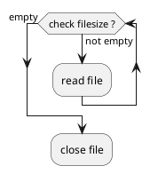


如果你使用 `+detach+` 来形成一个无限循环, 那么你可能需要使用 `+-[hidden]->+` 来隐藏一些不完整的箭头。

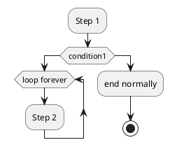


## 并行


你可以使用`fork`，`fork again`和`end fork` 或者 `end merge` 等关键字表示并行处理。

### fork

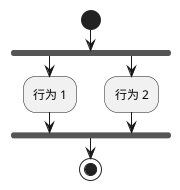


### fork合并

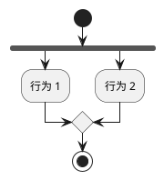


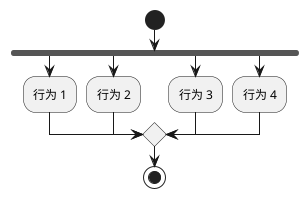


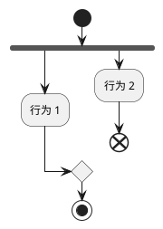


### end fork标注

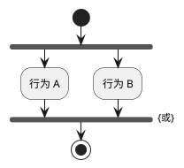


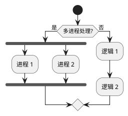


### 分割

你可以使用 `split`, `split again` 和 `end split` 关键字去表达分割处理

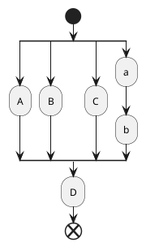


### 输入分割 

你可以使用包含 `hidden` 指令的箭头去制造一个输入分割 (多入口):

```plantuml
@startuml
split
   -[hidden]->
   :A;
split again
   -[hidden]->
   :B;
split again
   -[hidden]->
   :C;
end split
:D;
@enduml
```


### 输出分割

```plantuml
@startuml
start
split
   :A;
   kill
split again
   :b;
   :c;
   detach
split again
   (Z)
   detach
split again
   end
split again
   stop
end split
@enduml
```


## 注释

文本格式可以使用[克里奥尔维基语法](https://plantuml.com/zh/creole)。可以使用`floating` 关键字浮动注释。

```plantuml
@startuml

start
:foo1;
floating note left: This is a note
:foo2;
note right
  This note is on several
  //lines// and can
  contain <b>HTML</b>
  ====
  * Calling the method ""foo()"" is prohibited
end note
stop

@enduml
```


您可以为后向活动添加注释：

```plantuml
@startuml
start
repeat :Enter data;
:Submit;
backward :Warning;
note right: Note
repeat while (Valid?) is (No) not (Yes)
stop
@enduml
```


可以添加分区活动注释：

```plantuml
@startuml
start
partition "**process** HelloWorld" {
    note
        This is my note
        ----
        //Creole test//
    end note
    :Ready;
    :HelloWorld(i)>
    :Hello-Sent;
}
@enduml
```


## 箭头


无箭头连接线

您可以使用 `skinparam ArrowHeadColor none` 参数来表示仅使用线条连接活动，而不带箭头。

|      |                                                              |
| ---- | ------------------------------------------------------------ |
| <br> | `@startuml skinparam ArrowHeadColor none start :Hello world; :This is on defined on several **lines**; stop @enduml`<br><br> |

|      |                                                              |
| ---- | ------------------------------------------------------------ |
| <br> | `@startuml skinparam ArrowHeadColor none start repeat :Enter data; :Submit; backward :Warning; repeat while (Valid?) is (No) not (Yes) stop @enduml`<br><br> |

## 


箭头

使用`->`标记，你可以给箭头添加文字或者修改箭头[颜色](https://plantuml.com/zh/color)。

同时，你也可以选择点状 (dotted)，条状(dashed)，加粗或者是隐式箭头

|      |                                                              |
| ---- | ------------------------------------------------------------ |
| <br> | `@startuml :foo1; -> You can put text on arrows; if (test) then   -[#blue]->   :foo2;   -[#green,dashed]-> The text can   also be on several lines   and **very** long...;   :foo3; else   -[#black,dotted]->   :foo4; endif -[#gray,bold]-> :foo5; @enduml`<br><br> |

## 


Multiple colored arrow

You can use multiple colored arrow.

|      |                                                              |
| ---- | ------------------------------------------------------------ |
| <br> | `@startuml skinparam colorArrowSeparationSpace 1 start -[#red;#green;#orange;#blue]-> if(a?)then(yes) -[#red]-> :activity; -[#red]-> if(c?)then(yes) -[#maroon,dashed]-> else(no) -[#red]-> if(b?)then(yes) -[#maroon,dashed]-> else(no) -[#blue,dashed;dotted]-> :do a; -[#red]-> :do b; -[#red]-> endif -[#red;#maroon,dashed]-> endif -[#red;#maroon,dashed]-> elseif(e?)then(yes) -[#green]-> if(c?)then(yes) -[#maroon,dashed]-> else(no) -[#green]-> if(d?)then(yes) -[#maroon,dashed]-> else(no) -[#green]-> :do something; <<continuous>> -[#green]-> endif -[#green;#maroon,dashed]-> partition dummy { :some function; } -[#green;#maroon,dashed]-> endif -[#green;#maroon,dashed]->  elseif(f?)then(yes) -[#orange]-> :activity; <<continuous>> -[#orange]-> else(no) -[#blue,dashed;dotted]-> endif stop @enduml`<br><br> |

_[Ref. [QA-4411](https://forum.plantuml.net/4411)]_

## 


连接器(Connector)

你可以使用括号定义连接器。

|      |                                                              |
| ---- | ------------------------------------------------------------ |
| <br> | `@startuml start :Some activity; (A) detach (A) :Other activity; @enduml`<br><br> |

WARNING

 **This translation need to be updated.** 

WARNING

## 


连接器颜色

你可以在连接器上增加 [颜色](https://plantuml.com/zh/color)

|      |                                                              |
| ---- | ------------------------------------------------------------ |
| <br> | `@startuml start :下面的连接器 应该是蓝色; #blue:(B) :下一个连接器应该 看起来应该是 深绿色; #green:(G) stop @enduml`<br><br> |

_[参考. [QA-10077](https://forum.plantuml.net/10077/assigning-color-to-connectors?show=10080#c10080)]_

_[Ref. [QA-19975](https://forum.plantuml.net/19975/please-provide-change-background-connectors-activity-diagrams?show=19976#a19976)]_

WARNING

 **This translation need to be updated.** 

WARNING

## 


组合(grouping)

通过定义分组(group)，你可以把多个活动分组。

|      |                                                              |
| ---- | ------------------------------------------------------------ |
| <br> | `@startuml start group 初始化分组      :read config file;     :init internal variable; end group group 运行分组     :wait for user interaction;     :print information; end group  stop @enduml`<br><br> |

### 分区

通过定义分区(partition)，你可以把多个活动组合(group)在一起:

|      |                                                              |
| ---- | ------------------------------------------------------------ |
| <br> | `@startuml start partition 初始化分区 {     :read config file;     :init internal variable; } partition 运行分区 {     :wait for user interaction;     :print information; }  stop @enduml`<br><br> |

这里同样可以改变分区颜色 [color](https://plantuml.com/zh/color):

|      |                                                              |
| ---- | ------------------------------------------------------------ |
| <br> | `@startuml start partition #lightGreen "Input Interface" {     :read config file;     :init internal variable; } partition Running {     :wait for user interaction;     :print information; } stop @enduml`<br><br> |

_[参考: [QA-2793](https://forum.plantuml.net/2793/activity-beta-partition-name-more-than-one-word-does-not-work?show=2798#a2798)]_

同样可以添加一个 [链接](https://plantuml.com/zh/link) 到分区:

|      |                                                              |
| ---- | ------------------------------------------------------------ |
| <br> | `@startuml start partition "[[http://plantuml.com partition_name]]" {     :read doc. on [[http://plantuml.com plantuml_website]];     :test diagram; } end @enduml`<br><br> |

_[参考: [QA-542](https://forum.plantuml.net/542/ability-to-define-hyperlink-on-diagram-elements?show=14003#c14003)]_

### 分组, 分区, 包, 矩形 或 卡片式

你可以分组活动通过定义:

- group;
- partition;
- package;
- rectangle;
- card.

|      |                                                              |
| ---- | ------------------------------------------------------------ |
| <br> | `@startuml start group 分组   :Activity; end group floating note: 分组备注  partition 分区 {   :Activity; } floating note: 分区备注  package 包 {   :Activity; } floating note: 包备注  rectangle 矩形 {   :Activity; } floating note: 矩形备注  card 卡片式 {   :Activity; } floating note: 卡片式备注 end @enduml`<br><br> |

## 


泳道(Swimlanes)

你可以使用管道符`|`来定义泳道。

还可以改变泳道的[颜色](https://plantuml.com/zh/color)。

|      |                                                              |
| ---- | ------------------------------------------------------------ |
| <br> | `@startuml \|Swimlane1\| start :foo1; \|#AntiqueWhite\|Swimlane2\| :foo2; :foo3; \|Swimlane1\| :foo4; \|Swimlane2\| :foo5; stop @enduml`<br><br> |

你可以在泳道中增加 `if` 判断或 `repeat` 或 `while` 循环.

|      |                                                              |
| ---- | ------------------------------------------------------------ |
| <br> | `@startuml \|#pink\|Actor_For_red\| start if (color?) is (red) then #pink:**action red**; :foo1; else (not red) \|#lightgray\|Actor_For_no_red\| #lightgray:**action not red**; :foo2; endif \|Next_Actor\| #lightblue:foo3; :foo4; \|Final_Actor\| #palegreen:foo5; stop @enduml`<br><br> |

你同样可以在泳道中增加别名，使用 `alias` 语法:

- `|[#<color>|]<swimlane_alias>| <swimlane_title>`

|      |                                                              |
| ---- | ------------------------------------------------------------ |
| <br> | `@startuml \|#palegreen\|f\| fisherman \|c\| cook \|#gold\|e\| eater \|f\| start :go fish; \|c\| :fry fish; \|e\| :eat fish; stop @enduml`<br><br> |

_[参考: [QA-2681](https://forum.plantuml.net/2681/possible-define-alias-swimlane-place-alias-everywhere-else?show=2685#a2685)]_

## 


分离(detach)

可以使用关键字`detach` 或 `kill`移除箭头。

- `detach`

|      |                                                              |
| ---- | ------------------------------------------------------------ |
| <br> | `@startuml  :start;  fork    :foo1;    :foo2;  fork again    :foo3;    detach  endfork  if (foo4) then    :foo5;    detach  endif  :foo6;  detach  :foo7;  stop @enduml`<br><br> |

- `kill`

|      |                                                              |
| ---- | ------------------------------------------------------------ |
| <br> | `@startuml  :start;  fork    :foo1;    :foo2;  fork again    :foo3;    kill  endfork  if (foo4) then    :foo5;    kill  endif  :foo6;  kill  :foo7;  stop @enduml`<br><br> |

## 


SDL（规范和描述语言）

### SDL 形状名称表

|   |   |   |
|---|---|---|
|**名称**|**旧语法**|**定型语法**|
|输入|`<`|`<<input>>`|
|输出|`>`|`<<output>>`|
|程序|`\|`|`<<procedure>>`|
|加载|`\`|`<<load>>`|
|保存|`/`|`<<save>>`|
|连续|`}`|`<<continuous>>`|
|任务|`]`|`<<task>>`|

_[Ref.[QA-11518](https://forum.plantuml.net/11518/issues-with-final-separator-latex-math-expression-activity?show=17268#a17268),[GH-1270](https://github.com/plantuml/plantuml/discussions/1270)]_

### SDL using final separator (Deprecated form)

通过更改最终`;` separator，可以为活动设置不同的渲染：

- `|`
- `<`
- `>`
- `/`
- `\\`
- `]`
- `}`

|      |                                                              |
| ---- | ------------------------------------------------------------ |
| <br> | `@startuml :Ready; :next(o)\| :Receiving; split  :nak(i)<  :ack(o)> split again  :ack(i)<  :next(o)  on several lines\|  :i := i + 1]  :ack(o)> split again  :err(i)<  :nak(o)> split again  :foo/ split again  :bar\\ split again  :i > 5} stop end split :finish; @enduml`<br><br> |

### 使用正态分隔符和立体原型的 SDL（当前正式形式）

|      |                                                              |
| ---- | ------------------------------------------------------------ |
| <br> | `@startuml start :SDL Shape; :input; <<input>> :output; <<output>> :procedure; <<procedure>> :load; <<load>> :save; <<save>> :continuous; <<continuous>> :task; <<task>> end @enduml`<br><br> |

|      |                                                              |
| ---- | ------------------------------------------------------------ |
| <br> | `@startuml :Ready; :next(o); <<procedure>> :Receiving; split  :nak(i); <<input>>  :ack(o); <<output>> split again  :ack(i); <<input>>  :next(o)  on several lines; <<procedure>>  :i := i + 1; <<task>>  :ack(o); <<output>> split again  :err(i); <<input>>  :nak(o); <<output>> split again  :foo; <<save>> split again  :bar; <<load>> split again  :i > 5; <<continuous>> stop end split :finish; @enduml`<br><br> |

WARNING

 **This translation need to be updated.** 

WARNING

## 


UML (Unified Modeling Language) Shape

### Table of UML Shape Name

|   |   |
|---|---|
|**Name**|**Stereotype syntax**|
|ObjectNode|`<<object>>`|
|ObjectNode  <br>typed by signal|`<<objectSignal>>` or `<<object-signal>>`|
|AcceptEventAction  <br>without TimeEvent trigger|`<<acceptEvent>>` or `<<accept-event>>`|
|AcceptEventAction  <br>with TimeEvent trigger|`<<timeEvent>>` or `<<time-event>>`|
|SendSignalAction  <br>  <br>SendObjectAction  <br>with signal type|`<<sendSignal>>` or `<<send-signal>>`|
|Trigger|`<<trigger>>`|

_[Ref. [GH-2185](https://github.com/plantuml/plantuml/pull/2185)]_

### UML Shape Example using Stereotype

|      |                                                              |
| ---- | ------------------------------------------------------------ |
| <br> | `@startuml :action; :object; <<object>>  :ObjectNode typed by signal; <<objectSignal>>  :AcceptEventAction without TimeEvent trigger; <<acceptEvent>>  :SendSignalAction; <<sendSignal>>  :SendObjectAction with signal type; <<sendSignal>>  :Trigger; <<trigger>>  :\t\t\t\t\t\tAcceptEventAction \t\t\t\t\t\twith TimeEvent trigger; <<timeEvent>> :an action; @enduml`<br><br> |

_[Ref. [GH-2185](https://github.com/plantuml/plantuml/pull/2185), [QA-16558](https://forum.plantuml.net/16558), [GH-1659](https://github.com/plantuml/plantuml/issues/1659)]_

## 


一个完整的例子

|      |                                                              |
| ---- | ------------------------------------------------------------ |
| <br> | `@startuml  start :ClickServlet.handleRequest(); :new page; if (Page.onSecurityCheck) then (true)   :Page.onInit();   if (isForward?) then (no)     :Process controls;     if (continue processing?) then (no)       stop     endif      if (isPost?) then (yes)       :Page.onPost();     else (no)       :Page.onGet();     endif     :Page.onRender();   endif else (false) endif  if (do redirect?) then (yes)   :redirect process; else   if (do forward?) then (yes)     :Forward request;   else (no)     :Render page template;   endif endif  stop  @enduml`<br><br> |

## 


判断的样式

### inside 样式 (默认)

|      |                                                              |
| ---- | ------------------------------------------------------------ |
| <br> | `@startuml skinparam conditionStyle inside start repeat   :act1;   :act2; repeatwhile (<b>end) :act3; @enduml`<br><br> |

|      |                                                              |
| ---- | ------------------------------------------------------------ |
| <br> | `@startuml start repeat   :act1;   :act2; repeatwhile (<b>end) :act3; @enduml`<br><br> |

### Diamond 样式

|      |                                                              |
| ---- | ------------------------------------------------------------ |
| <br> | `@startuml skinparam conditionStyle diamond start repeat   :act1;   :act2; repeatwhile (<b>end) :act3; @enduml`<br><br> |

### InsideDiamond (或 _Foo1_) 样式

|      |                                                              |
| ---- | ------------------------------------------------------------ |
| <br> | `@startuml skinparam conditionStyle InsideDiamond start repeat   :act1;   :act2; repeatwhile (<b>end) :act3; @enduml`<br><br> |

|      |                                                              |
| ---- | ------------------------------------------------------------ |
| <br> | `@startuml skinparam conditionStyle foo1 start repeat   :act1;   :act2; repeatwhile (<b>end) :act3; @enduml`<br><br> |

_[参考: [QA-1290](https://forum.plantuml.net/1290/plantuml-condition-rendering) and [#400](https://github.com/plantuml/plantuml/issues/400#issuecomment-721287124)]_

## 


判断的结束样式

### Diamond 样式 (默认)

- With one branch

|      |                                                              |
| ---- | ------------------------------------------------------------ |
| <br> | `@startuml skinparam ConditionEndStyle diamond :A; if (decision) then (yes)     :B1; else (no) endif :C; @enduml`<br><br> |

- 两个分支 (`B1`, `B2`)

|      |                                                              |
| ---- | ------------------------------------------------------------ |
| <br> | `@startuml skinparam ConditionEndStyle diamond :A; if (decision) then (yes)     :B1; else (no)     :B2; endif :C; @enduml @enduml`<br><br> |

### 水平线 (hline) 样式

- 一个分

|      |                                                              |
| ---- | ------------------------------------------------------------ |
| <br> | `@startuml skinparam ConditionEndStyle hline :A; if (decision) then (yes)     :B1; else (no) endif :C; @enduml`<br><br> |

- 两个分支 (`B1`, `B2`)

|      |                                                              |
| ---- | ------------------------------------------------------------ |
| <br> | `@startuml skinparam ConditionEndStyle hline :A; if (decision) then (yes)     :B1; else (no)     :B2; endif :C; @enduml @enduml`<br><br> |

_[Ref. [QA-4015](https://forum.plantuml.net/4015/its-possible-to-draw-if-else-endif-without-merge-symbol)]_

## 


使用 sytle 定义 (全局) 样式

### 无样式 _(默认)_

|      |                                                              |
| ---- | ------------------------------------------------------------ |
| <br> | `@startuml start :init; -> test of color; if (color?) is (<color:red>red) then :print red; else  :print not red; note right: no color endif partition End { :end; } -> this is the end; end @enduml`<br><br> |

### 有样式

你可以使用 [style](https://plantuml.com/zh/style-evolution) 节点去定义样式然后改变渲染。

|      |                                                              |
| ---- | ------------------------------------------------------------ |
| <br> | `@startuml <style> activityDiagram {   BackgroundColor #33668E   BorderColor #33668E   FontColor #888   FontName arial    diamond {     BackgroundColor #ccf     LineColor #00FF00     FontColor green     FontName arial     FontSize 15   }   arrow {     FontColor gold     FontName arial     FontSize 15   }   partition {     LineColor red     FontColor green     RoundCorner 10     BackgroundColor PeachPuff   }   note {     FontColor Blue     LineColor Navy     BackgroundColor #ccf   } } document {    BackgroundColor transparent } </style> start :init; -> test of color; if (color?) is (<color:red>red) then :print red; else  :print not red; note right: no color endif partition End { :end; } -> this is the end; end @enduml`<br><br> |

## 


Emoji as action

You can use [emoji](https://plantuml.com/creole#68305e25f5788db0) as action, with the stereotype `<<icon>>`:

|      |                                                              |
| ---- | ------------------------------------------------------------ |
| <br> | `@startuml while (<:cloud_with_rain:>)   :<:umbrella:>; <<icon>> endwhile -<<icon>><:closed_umbrella:> @enduml`<br><br> |

